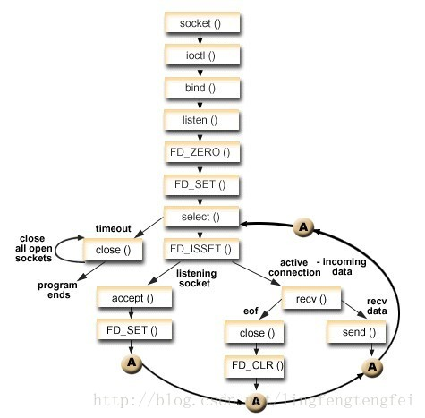
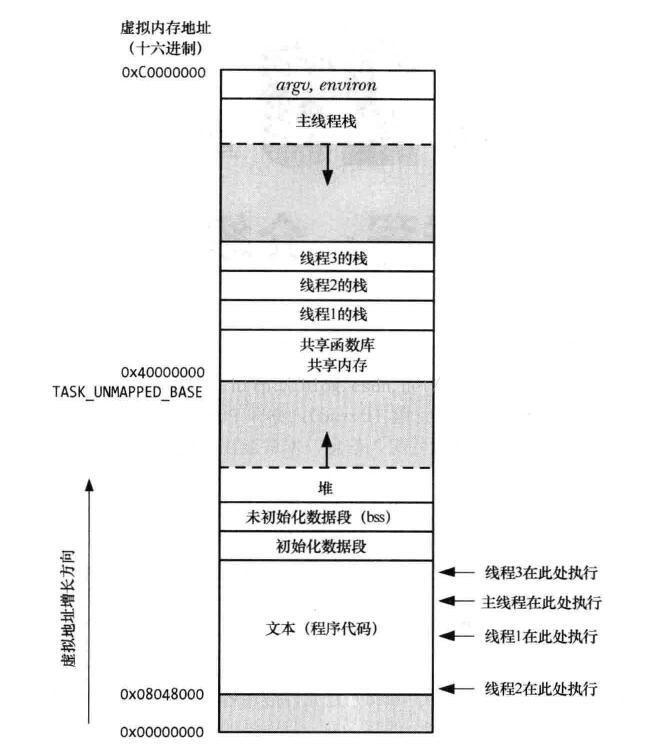

# linux系统函数编程
- [进程相关](#1)
 - [fork函数](#1.1)
 - [execv函数](#1.2)
 - [wait/waitpid函数](#1.3)
 - [kill/raise/sleep信号函数](#1.4)
 - [进程通信方式](#1.5)
 - [system函数](#1.6)
 - [exit()函数](#1.7)
 - [alarm()函数](#1.8)

- [I/O模型](#2)
 - [select函数](#2.1)
 - [poll函数](#2.2)
 - [epoll函数](#2.3)
 - [select、poll、epoll之间的区别](#2.4)
 - [signal](#2.5)

- [线程相关](#3)
 - [linux线程间通信及同步机制总结](#3.1)
 - [互斥锁](#3.2)
 - [读写锁](#3.3)
 - [条件变量](#3.4)
 - [信号量](#3.5)
 - [自旋锁](#3.6)
 - [屏障](#3.7)

- [其他](#4)
 - [主机字节序与网络字节序](#4.1)


tcp/ip
read readv recv recfrom recvmsg
rio_read
fstat stat
opendir closedir
dup2
getaddrinfo  getnameinfo
getprotobyname
gethostbyname
getsockname
getpeername
unlink
getopt_long
sleep

## <a id="1">进程相关</a>
### <a id="1.1">fork函数</a>
参考链接：  
1.linux进程之fork 和 exec函数  
https://www.cnblogs.com/chris-cp/p/3525070.html

2.linux 中 execv, fork, wait 及 waitpid 的用法  
https://blog.csdn.net/wangbaochu/article/details/44087937?ops_request_misc=%257B%2522request%255Fid%2522%253A%2522158883415919725219908989%2522%252C%2522scm%2522%253A%252220140713.130102334.pc%255Fall.57675%2522%257D&request_id=158883415919725219908989&biz_id=0&utm_medium=distribute.pc_search_result.none-task-blog-2~all~first_rank_v2~rank_v25-1

#### fork函数
对于fork函数：  
子进程只继承父进程的文件描述表，不继承但共享文件表项和i-node  
父进程创建一个子进程之后，文件表项中的引用计数加１变为２，当父进程作close操作之后计数器减１，子进程还是可以使用文件表项，只有计数器减到０的时候才会释放该文件表项  

fork函数，该函数是unix中派生新进程的唯一方法。
```cpp
　　#include　<unistd.h>
　　pid_t   fork(void);
返回：（调用它一次， 它返回 两次 ， 它在调用进程（称为父进程）中返回一次， 返回值是新派生进程（称为子进程）的进程ID
号，在子进程又返回一次，返回值为0。 因此，返回值本身告知当前进程是子进程还是父进程）。
　　 在子进程中为0， 在父进程中为子进程ID，
　　 若出错则为-1；
```
fork有两个典型的用法：
* 1.一个进程创建一个自身的副本，这样每个副本都 可以在另一个副本执行其他任务的同时处理各自的某个操作。 这是网络服务器
的典型用法；
* 2.一个进程想要执行另一个程序。既然创建新进程的唯一办法是调用fork， 该进程于是首先调用fork创建一个自身的副本，然后
另一个副本（通常为子进程）调用exec把自身替换成新的程序。 这是shell之类程序的典型用法；exec把当前进程映像替换成新的
程序文件，而且该新程序通常从main函数开始执行，进程ID并不改变。我们称调用exec的进程为调用进程（calling process），
称新执行的程序为新程序（new program）.

#### vfork函数

#### vfork与fork比较
使用fork函数的缓存区会复制到子进程中，在父子进程都需要执行.    
在使用vfork的时候，可以看到，只有一个hello andrew输出，以内vfork函数是部位子进程创建单独的分区的而是和父进程共用一个，一旦子进程将缓存区中的内容输出，那么另一位缓存区中也不会在有内容，因为两者缓存区是相同的；  

```cpp
fork() 子进程拷贝父进程的前3G的地址空间的内容. 
vfork() 子进程与父进程共享数据段，读写都共享.|

fork() 父子进程的执行次序不确定，最终由调度进程决定. 
vfork():保证子进程先运行，父进程会被挂起，直到子进程调用exit()或者exec()系列函数
如果在 调用这两个函数之前子进程有依赖于父进程的进一步动作，则会导致死锁，因为父进程已经被挂起，父进程的运行需要子进
程的退出，而子进程的执行又依赖父进程。

vfork用于创建一个新进程，而该新进程的目的是exec一个新进程，通常vfork()和exec搭配使用
vfork和fork一样都创建一个子进程，但是它并不将父进程的地址空间完全复制到子进程中，不会复制页表。因为子进程会立即调用
exec，于是也就不会存放该地址空间。不过在子进程中调用exec或exit之前，他在父进程的空间中运行。

vfork这个系统调用是用来启动一个新的应用程序。
其次，子进程在vfork()返回后直接运行在父进程的栈空间，并使用父进程的内存和数据，这是很危险的操作。

子进程还必须避免改变全局数据结构或全局变量中的任何信息，
因为这些改变都有可能使父进程不能继续。

通常，如果应用程序不是在fork()之后立即调用exec()，
就有必要在fork()被替换成vfork()之前做仔细的检查。
```

>特点一：也就是说，vfork()产生的子进程与父进程共享数据段上的数据  
特点二：由vfork产生的子进程一定会先于父进程运行，期间会将父进程挂起，直到子进程运行结束或者调用了exec()系列函数才会重新调度父进程。  
 
### <a id="1.2">execv函数</a>
exec把当前进程映像替换成新的程序文件，而且该新程序通常从main函数开始执行，进程ID并不改变。我们称调用exec的进程为调用进程（calling process），称新执行的程序为新程序（new program）
```cpp
　　#include <unistd.h>
　　int  execl(const  char *pathname, const char *arg0,  .../);
　　int   execv(const  char  *pathname, char *const  *argv[]);
　　int    execle(const char *pathname, const char *arg(), ....);
　　int   execve(const char  *pathname,  char *const argv[],  char *const envp[]);
　　int   execlp(const  char *filename, con)
```
execv会停止执行当前的进程，并且以progname应用进程替换被停止执行的进程，进程ID没有改变。  
progname: 被执行的应用程序。  
argv: 传递给应用程序的参数列表， 注意这个数组的第一个参数应该是应用程序名字本身(即argv[0] = progname)，并且最后一个参数应该为NULL，不能将多个参数合并为一个参数放入数组。  

返回值   
如果应用程序正常执行完毕，那么execv是永远不会返回的；当execv在调用进程中返回时，那么这个应用程序应该出错了（可能是程序本身没找到，权限不够等), 此时它的返回值应该是-1,具体的错误代码可以通过全局变量errno查看，还可以通过stderr得到具体的错误描述字符串。  


### <a id="1.3">wait/waitpid函数</a>

#### wait(等待子进程中断或结束)
```cpp
函数功能是：父进程一旦调用了wait就立即阻塞自己，由wait自动分析是否当前进程的某个子进程已经退出，如果让它找到了这样一个
已经变成僵尸的子进程，wait就会收集这个子进程的信息，并把它彻底销毁后返回；如果没有找到这样一个子进程，wait就会一直阻塞
在这里，直到有一个出现为止。
函数原型  
#include<sys/types.h>
#include<sys/wait.h>
pid_t wait (int * status);


函数说明：  
(1) wait()会暂时停止目前进程的执行,直到有信号来到或子进程结束。如果在调用 wait()时子进程已经结束,则 wait()会立即返回
子进程结束状态值。  
(2) 子进程的结束状态值会由参数 status 返回,而子进程的进程识别码也会一起返回。状态值status的具体含义请参考 waitpid()。  
(3) 如果执行成功则返回子进程PID,如果有错误发生则返回返回值-1，失败原因存于 errno 中，如果调用进程没有子进程，调用就会失败，此时wait返回-1。  
(4) 如果不需要status状态值,则参数 status 可以设成 NULL。
```
当父进程忘了用wait()函数等待已终止的子进程时,子进程就会进入一种无父进程的状态,此时子进程就是僵尸进程.   

如果先终止父进程,子进程将继续正常进行，只是它将由init进程(PID 1)继承,当子进程终止时,init进程捕获这个状态.   

如果参数status的值不是NULL，wait就会把子进程退出时的状态取出并存入其中， 这是一个整数值（int），指出了子进程是正常退出还是被非正常结束的，以及正常结束时的返回值，或被哪一个信号结束的等信息。由于这些信息 被存放在一个整数的不同二进制位中，所以用常规的方法读取会非常麻烦，人们就设计了一套专门的宏（macro）来完成这项工作，下面我们来学习一下其中最常用的两个：  
- 1，WIFEXITED(status) 这个宏用来指出子进程是否为正常退出的，如果是，它会返回一个非零值。
（请注意，虽然名字一样，这里的参数status并不同于wait唯一的参数–指向整数的指针status，而是那个指针所指向的整数，切记不要搞混了。）
- 2，WEXITSTATUS(status) 当WIFEXITED返回非零值时，我们可以用这个宏来提取子进程的返回值，如果子进程调用exit(5)退出，WEXITSTATUS(status) 就会返回5；如果子进程调用exit(7)，WEXITSTATUS(status)就会返回7。请注意，如果进程不是正常退出的，也就是说， WIFEXITED返回0，这个值就毫无意义。

#### waitpid(等待子进程中断或结束)
```cpp
函数原型
#include<sys/types.h>
#include<sys/wait.h>
pid_t waitpid(pid_t pid, int * status, int options);

函数说明：
(1) waitpid()会暂时停止目前进程的执行,直到有信号来到或子进程结束。如果在调用waitpid()时子进程已经结束,则 waitpid()会
立即返回子进程结束状态值。
(2) 子进程的结束状态值会由参数 status 返回,而子进程的进程识别码也会一快返回。
(3) 如果执行成功则返回子进程PID,如果有错误发生则返回返回值-1，失败原因存于 errno 中。
(4) 如果不在意结束状态值,则参数 status 可以设成 NULL。
(5) 参数 pid 为欲等待的子进程识别码,其他数值意义如下:
   pid<-1  等待进程组识别码为 pid 绝对值的任何子进程。
   pid=-1  等待任何子进程,相当于 wait()。            
   pid=0   等待进程组识别码与目前进程相同的任何子进程。       
   pid>0   等待任何子进程识别码为 pid 的子进程。
(6) 参数 option 可以为 0 或下面的 OR 组合:
WNOHANG 如果没有任何已经结束的子进程则马上返回, 不予以等待。
WUNTRACED 如果子进程进入暂停执行情况则马上返回,但结束状态不予以理会。
(7) 子进程的结束状态返回后存于 status, 底下有几个宏可判别结束情况:
//Linux <sys/wait.h>
#define WEXITSTATUS(s)  (((s) & 0xff00) >> 8)
#define WCOREDUMP(s)    ((s) & 0x80)
#define WTERMSIG(s)     ((s) & 0x7f)
#define WSTOPSIG(s)     WEXITSTATUS(s)
 
#define WIFEXITED(s)    (WTERMSIG(s) == 0)
#define WIFSTOPPED(s)   (WTERMSIG(s) == 0x7f)
#define WIFSIGNALED(s)  (WTERMSIG((s)+1) >= 2)

a. WIFEXITED(status)       如果子进程正常结束则为true。exit(0), exit(-1), 都是正常结束。例如 exit(0), status = 0; exit(-1), status = 0xFF00; exit(-10), status = 0xF600
b. WEXITSTATUS(status) 取得子进程 exit()返回的结束代码,一般会先用 WIFEXITED 来判断是否正常结束才能使用此宏。
c. WIFSIGNALED(status)  如果子进程是因为信号而结束则此宏值为真。
d. WTERMSIG(status)       取得子进程因信号而中止的信号代码,一般会先用 WIFSIGNALED 来判断后才使用此宏。
e. WIFSTOPPED(status)   如果子进程处于暂停执行情况则此宏值为真。一般只有使用 WUNTRACED 时才会有此情况。
f. WSTOPSIG(status)       取得引发子进程暂停的信号代码,一般会先用 WIFSTOPPED 来判断后才使用此宏。
```

<details>
  <summary>参考源码</summary>
  <p>waitpid</p>
  <pre><code>  
int main() {
    int cpid = fork();
    if (cpid < 0) {
        return -1;
    } else if (cpid == 0) {
        char *arg1 = "system/bin/sh";
        char *arg2 = "-c";
        char *arg3 = "mkdir mydir";
        char *arg4 = NULL;
        char *arg[] = {arg1, arg2, arg3, arg4};
        execv(arg[0], &arg[0]);
        printf("########## exec_command(): error code: %d(%s) ##########", errno, strerror(errno));
        exit(-1);
    } else {
        int status = -1;
        int count = 0;
        while(1)
        {
            //int ret = waitpid(cpid, &status, 0); 如果子进程不结束会一直死等
            int ret = waitpid(cpid, &status, WNOHANG);//WNOHANG 配合while 循环可以实现超时机制
            if (ret) {
                if (WIFEXITED(status)) {
                    //子进程正常结束: exit(任意值无论正负), execv()执行结束没有崩溃
                    //1. execv()执行成功结束: status = 0
                    //2. execv()执行结束，但可能没有执行成功，内部调用了exit(-1): status = 0xFF00
                    //3. 子进程直接调用 exit(-1): status = 0xFF00
                    //4. 子进程直接调用 exit(-10): status = 0xF600
                    if (WEXITSTATUS(status) == 0xFF) {
                        //TODO
                    } else if (WEXITSTATUS(status) == 0xF6) {
                        //TODO
                    } else {
                        //TODO
                    }
                } else {
                    //子进程非正常结束：子进程执行execv()发生崩溃，子进程是因为信号signal而结束
                    //TODO
                }
                break;
            }
            if (++count >= 60) {
                //timeout = 60s
                break;
            }
            sleep(1);
        }
    }
    return 0;
}
  </code></pre>
</details>

### <a id="1.4">kill/raise/sleep信号函数</a>
#### kill
```cpp
#include <sys/types.h>
#include <signal.h>
int kill(pid_t pid, int sig);

参数：
pid：可能选择有以下四种
1. pid大于零时，pid是信号欲送往的进程的标识。
2. pid等于零时，信号将送往所有与调用kill()的那个进程属同一个使用组的进程。
3. pid等于-1时，信号将送往所有调用进程有权给其发送信号的进程，除了进程1(init)。
4. pid小于-1时，信号将送往以-pid为组标识的进程。

sig：准备发送的信号代码，假如其值为零则没有任何信号送出，但是系统会执行错误检查，通常会利用sig值为零来检验某个进程是
否仍在执行。
返回值说明： 成功执行时，返回0。失败返回-1，errno被设为以下的某个值 EINVAL：指定的信号码无效（参数 sig 不合法）
EPERM；权限不够无法传送信号给指定进程 ESRCH：参数 pid 所指定的进程或进程组不存在

sig的值有：
1) SIGHUP
本信号在用户终端连接(正常或非正常)结束时发出, 通常是在终端的控制进程结束时, 通知同一session内的各个作业, 这时它们
与控制终端不再关联。
登录Linux时，系统会分配给登录用户一个终端(Session)。在这个终端运行的所有程序，包括前台进程组和后台进程组，一般都属
于这个 Session。当用户退出Linux登录时，前台进程组和后台有对终端输出的进程将会收到SIGHUP信号。这个信号的默认操作为
终止进程，因此前台进程组和后台有终端输出的进程就会中止。不过可以捕获这个信号，比如wget能捕获SIGHUP信号，并忽略它，这
样就算退出了Linux登录，wget也能继续下载。
此外，对于与终端脱离关系的守护进程，这个信号用于通知它重新读取配置文件。

2) SIGINT
程序终止(interrupt)信号, 在用户键入INTR字符(通常是Ctrl-C)时发出，用于通知前台进程组终止进程。

3) SIGQUIT
和SIGINT类似, 但由QUIT字符(通常是Ctrl-\)来控制. 进程在因收到SIGQUIT退出时会产生core文件, 在这个意义上类似于一个程
序错误信号。

4) SIGILL
执行了非法指令. 通常是因为可执行文件本身出现错误, 或者试图执行数据段. 堆栈溢出时也有可能产生这个信号。

5) SIGTRAP
由断点指令或其它trap指令产生. 由debugger使用。

6) SIGABRT
调用abort函数生成的信号。

7) SIGBUS
非法地址, 包括内存地址对齐(alignment)出错。比如访问一个四个字长的整数, 但其地址不是4的倍数。它与SIGSEGV的区别在于
后者是由于对合法存储地址的非法访问触发的(如访问不属于自己存储空间或只读存储空间)。

8) SIGFPE
在发生致命的算术运算错误时发出. 不仅包括浮点运算错误, 还包括溢出及除数为0等其它所有的算术的错误。

9) SIGKILL
用来立即结束程序的运行. 本信号不能被阻塞、处理和忽略。如果管理员发现某个进程终止不了，可尝试发送这个信号。

10) SIGUSR1
留给用户使用

11) SIGSEGV
试图访问未分配给自己的内存, 或试图往没有写权限的内存地址写数据.

12) SIGUSR2
留给用户使用

13) SIGPIPE
管道破裂。这个信号通常在进程间通信产生，比如采用FIFO(管道)通信的两个进程，读管道没打开或者意外终止就往管道写，写
进程会收到SIGPIPE信号。此外用Socket通信的两个进程，写进程在写Socket的时候，读进程已经终止。

14) SIGALRM
时钟定时信号, 计算的是实际的时间或时钟时间. alarm函数使用该信号.

15) SIGTERM
程序结束(terminate)信号, 与SIGKILL不同的是该信号可以被阻塞和处理。通常用来要求程序自己正常退出，shell命令kill缺省
产生这个信号。如果进程终止不了，我们才会尝试SIGKILL。

17) SIGCHLD
子进程结束时, 父进程会收到这个信号。

如果父进程没有处理这个信号，也没有等待(wait)子进程，子进程虽然终止，但是还会在内核进程表中占有表项，这时的子进程称
为僵尸进程。这种情况我们应该避免(父进程或者忽略SIGCHILD信号，或者捕捉它，或者wait它派生的子进程，或者父进程先终止
，这时子进程的终止自动由init进程来接管)。

18) SIGCONT
让一个停止(stopped)的进程继续执行. 本信号不能被阻塞. 可以用一个handler来让程序在由stopped状态变为继续执行时完
成特定的工作. 例如, 重新显示提示符

19) SIGSTOP
停止(stopped)进程的执行. 注意它和terminate以及interrupt的区别:该进程还未结束, 只是暂停执行. 本信号不能被阻塞, 
处理或忽略.

20) SIGTSTP
停止进程的运行, 但该信号可以被处理和忽略. 用户键入SUSP字符时(通常是Ctrl-Z)发出这个信号

21) SIGTTIN
当后台作业要从用户终端读数据时, 该作业中的所有进程会收到SIGTTIN信号. 缺省时这些进程会停止执行.

22) SIGTTOU
类似于SIGTTIN, 但在写终端(或修改终端模式)时收到.

23) SIGURG
有”紧急”数据或out-of-band数据到达socket时产生.

24) SIGXCPU
超过CPU时间资源限制. 这个限制可以由getrlimit/setrlimit来读取/改变。

25) SIGXFSZ
当进程企图扩大文件以至于超过文件大小资源限制。

26) SIGVTALRM
虚拟时钟信号. 类似于SIGALRM, 但是计算的是该进程占用的CPU时间.

27) SIGPROF
类似于SIGALRM/SIGVTALRM, 但包括该进程用的CPU时间以及系统调用的时间.

28) SIGWINCH
窗口大小改变时发出.

29) SIGIO
文件描述符准备就绪, 可以开始进行输入/输出操作.

30) SIGPWR
Power failure

31) SIGSYS
非法的系统调用。

在以上列出的信号中，程序不可捕获、阻塞或忽略的信号有：SIGKILL,SIGSTOP
不能恢复至默认动作的信号有：SIGILL,SIGTRAP
默认会导致进程流产的信号有：SIGABRT,SIGBUS,SIGFPE,SIGILL,SIGIOT,SIGQUIT,SIGSEGV,SIGTRAP,SIGXCPU,
SIGXFSZ
默认会导致进程退出的信号有：SIGALRM,SIGHUP,SIGINT,SIGKILL,SIGPIPE,SIGPOLL,SIGPROF,SIGSYS,SIGTERM,
SIGUSR1,SIGUSR2,SIGVTALRM
默认会导致进程停止的信号有：SIGSTOP,SIGTSTP,SIGTTIN,SIGTTOU
默认进程忽略的信号有：SIGCHLD,SIGPWR,SIGURG,SIGWINCH

一、SIGINT、SIGTERM和SIGKILL区别
SIGINT与SIGTERM区别
1）SIGINT关联ctrl+c
2）SIGINT只能结束前台进程
3）通过ctrl+c对当前进程发送结束信号，信号被进程树接收到（即：不仅当前进程，子进程也会收到结束信号）
SIGTERM与SIGKILL
1）SIGTERM可以被阻塞、处理和忽略；因此有的进程不能按预期的结束
2）kill不使用参数：发送SIGTERM信号，只有当前进程收到信号，若当前进程被kill，则子进程的父进程就会更改为init，即pid为1
3）kill命令的默认不带参数发生的信号就是SIGTERM，让程序友好的退出 ，当程序未退出时，可以使用kill -9强制退出

kill、killall
这两个命令是用来向进程发送信号的。kill 命令需要进程号作为参数，而 killall 需要进程名称。

另外，还可以在这两个命令后附加要发送信号序号作为参数。默认情况下，它们都向相关进程发送信号 15 (TERM)。例如，如果你想要终止 PID 为 785 的进程，请输入以下命令：
$ kill 785

如果您要向它发送信号 19 (STOP)，请输入：
$ kill -19 785

假设您知道想要终止的进程的命令名称。您可以通过该名称来终止它，而不用再使用 ps 找出该进程的进程号：
$ killall -9 mozilla
```

<details>
  <summary>参考源码</summary>
  <p>waitpid</p>
  <pre><code>  
#include <stdio.h>
#include <stdlib.h>
#include <sys/types.h>
#include <signal.h>
#include <unistd.h>
void handler(int arg)
{
    printf("receive SIGCHLD\n");
}
int main(int argc, const char *argv[])
{
    signal(SIGCHLD,handler); //注册信号回调函数，当信号发生会调用handler
    pid_t pid;
    pid = fork();
    if(pid < 0)
    {
        perror("fork fail ");
        exit(1);
    }
    else if(pid == 0) //子进程
    {
        while(1)
        {
            printf("child \n");
            sleep(1);
        }
    }
    else  //父进程
    {
        sleep(1);  //睡 1 秒
        kill(pid,SIGKILL);//杀死 pid 发送进程的信号,kill 给其他进程发送信号，指定进程号
        printf("child killed\n");
        printf("father \n");
        wait(NULL); //等待回收子进程的资源
        raise(SIGKILL); //杀死自己的信号,函数raise 给自己发送信号
    }
    return 0;
}
  </code></pre>
</details>

#### raise
```cpp
int raise(int sig)
--给自己发送信号,raise(sig)等价于kill(getpid(),sig)
killpg
--给进程组发送信号，killpg(pgrp,sig)等价于kill(-pgrp,sig)
sigqueue
--给进程发送信号，支持排队，可以附带信息
```

#### sleep
sleep()函数  
1.sleep()函数作用：让进程睡眠  
2.能被信号打断，然后处理信号函数以后，就不再睡眠，直接向下执行代码  
3.sleep函数的返回值是剩余秒数  

### <a id="1.5">进程通信方式</a>
 - [管道(PIPE)](#1.5.1)
 - [命名管道（FIFO）](#1.5.2)
 - [信号（signal）](#1.5.3) 
 - [消息队列（Message queues）](#1.5.4) 
 - [信号量（Semaphore）](#1.5.5) 
 - [共享内存（Share Memory）](#1.5.6) 
 - [内存映射（Memory Map）](#1.5.7) 
 - [套接字](#1.5.8) 

参考链接：  
1.进程间方式  
https://blog.csdn.net/sinat_34166518/article/details/82744410   

2.linux进程间通信（IPC）机制总结  
https://blog.csdn.net/a987073381/article/details/52006729  

3.linux管道    
https://www.ibm.com/developerworks/cn/linux/l-ipc/part1/


#### 进程之间的通信方式以及优缺点
- 管道（PIPE）   
 - o有名管道：一种半双工的通信方式，它允许无亲缘关系进程间的通信   
  - a.优点：可以实现任意关系的进程间的通信   
  - b.缺点：  
   - a.长期存于系统中，使用不当容易出错
   - b.缓冲区有限
 - o无名管道：一种半双工的通信方式，只能在具有亲缘关系的进程间使用（父子进程）
  - a.优点：简单方便
  - b.缺点：
   - a.局限于单向通信
   - b.只能创建在它的进程以及其有亲缘关系的进程之间
   - c.缓冲区有限

- 信号量（Semaphore）：一个计数器，可以用来控制多个线程对共享资源的访问
 - 优点：可以同步进程
 - 缺点：信号量有限

- 信号（Signal）：一种比较复杂的通信方式，用于通知接收进程某个事件已经发生

- 消息队列（Message Queue）：是消息的链表，存放在内核中并由消息队列标识符标识
 - 优点：可以实现任意进程间的通信，并通过系统调用函数来实现消息发送和接收之间的同步，无需考虑同步问题，方便
 - 缺点：信息的复制需要额外消耗 CPU 的时间，不适宜于信息量大或操作频繁的场合

- 共享内存（Shared Memory）：映射一段能被其他进程所访问的内存，这段共享内存由一个进程创建，但多个进程都可以访问
 - 优点：无须复制，快捷，信息量大
 - 缺点：
   - a.通信是通过将共享空间缓冲区直接附加到进程的虚拟地址空间中来实现的，因此进程间的读写操作的同步问题
   - b.利用内存缓冲区直接交换信息，内存的实体存在于计算机中，只能同一个计算机系统中的诸多进程共享，不方便网络通信

- 套接字（Socket）：可用于不同及其间的进程通信
 - 优点：
   - a.传输数据为字节级，传输数据可自定义，数据量小效率高
   - b.传输数据时间短，性能高
   - c.适合于客户端和服务器端之间信息实时交互
   - d.可以加密,数据安全性强
 - 缺点：需对传输的数据进行解析，转化成应用级的数据。


管道（Pipe）及有名管道（named pipe）：管道可用于具有亲缘关系进程间的通信，有名管道克服了管道没有名字的限制，因此，除具有管道所具有的功能外，它还允许无亲缘关系进程间的通信；

信号（Signal）：信号是比较复杂的通信方式，用于通知接受进程有某种事件发生，除了用于进程间通信外，进程还可以发送信号给进程本身；linux除了支持Unix早期信号语义函数sigal外，还支持语义符合Posix.1标准的信号函数sigaction（实际上，该函数是基于BSD的，BSD为了实现可靠信号机制，又能够统一对外接口，用sigaction函数重新实现了signal函数）；

报文（Message）队列（消息队列）：消息队列是消息的链接表，包括Posix消息队列system V消息队列。有足够权限的进程可以向队列中添加消息，被赋予读权限的进程则可以读走队列中的消息。消息队列克服了信号承载信息量少，管道只能承载无格式字节流以及缓冲区大小受限等缺点。

共享内存：使得多个进程可以访问同一块内存空间，是最快的可用IPC形式。是针对其他通信机制运行效率较低而设计的。往往与其它通信机制，如信号量结合使用，来达到进程间的同步及互斥。

信号量（semaphore）：主要作为进程间以及同一进程不同线程之间的同步手段。

套接口（Socket）：更为一般的进程间通信机制，可用于不同机器之间的进程间通信。起初是由Unix系统的BSD分支开发出来的，但现在一般可以移植到其它类Unix系统上：Linux和System V的变种都支持套接字。

通信方式的优缺点  
几种通信方法总结综上所述．进程之间的多种通信方法各自有各自的优点和缺点：如果用户传递的信息较少．或是需要通过信号来触发某些行为．前文提到的软中断信号机制不失为一种简捷有效的进程间通信方式．但若是进程间要求传递的信息量比较大或者进程间存在交换数据的要求，那就需要考虑别的通信方式了。无名管道简单方便．但局限于单向通信的工作方式．并且只能在创建它的进程及其子孙进程之间实现管道的共享：有名管道虽然可以提供给任意关系的进程使用．但是由于其长期存在于系统之中，使用不当容易出错．所以普通用户一般不建议使用。消息缓冲可以不再局限于父子进程．而允许任意进程通过共享消息队列来实现进程间通信．并由系统调用函数来实现消息发送和接收之间的同步．从而使得用户在使用消息缓冲进行通信时不再需要考虑同步问题．使用方便，但是消息队列中信息的复制需要额外消耗CPU的时间．不适宜于信息量大或操作频繁的场合。共享内存针对消息缓冲的缺点改而利用内存缓冲区直接交换信息，无须复制，快捷、信息量大是其优点。但是共享内存的通信方式是通过将共享的内存缓冲区直接附加到进程的虚拟地址空间中来实现的．因此，这些进程之间的读写操作的同步问题操作系统无法实现。必须由各进程利用其他同步工具解决。另外，由于内存实体存在于计算机系统中．所以只能由处于同一个计算机系统中的诸进程共享,不方便网络通信。不同的进程通信方式有不同的优点和缺点．因此．对于不同的应用问题，要根据问题本身的情况来选择进程间的通信方式。  
一般来说，进程间的通信根据通信内容可以划分为两种：即控制信息的传送与大批数据传送。有时也把进程间控制信息的交换称为低级通信，而把进程间大批量数据的交换称为高级通信。  


### <a id="1.5.1">管道(PIPE)</a>
  管道实际是用于进程间通信的一段共享内存，创建管道的进程称为管道服务器，连接到一个管道的进程为管道客户机。一个进程在向管道写入数据后，另一进程就可以从管道的另一端将其读取出来。  

管道的特点：  
- 1、管道是半双工的，数据只能向一个方向流动；需要双方通信时，需要建立起两个管道；
- 2、只能用于父子进程或者兄弟进程之间（具有亲缘关系的进程）。比如fork或exec创建的新进程，在使用exec创建新进程时，需要将管道的文件描述符作为参数传递给exec创建的新进程。当父进程与使用fork创建的子进程直接通信时，发送数据的进程关闭读端，接受数据的进程关闭写端。
- 3、单独构成一种独立的文件系统：管道对于管道两端的进程而言，就是一个文件，但它不是普通的文件，它不属于某种文件系统，而是自立门户，单独构成一种文件系统，并且只存在与内存中。
- 4、数据的读出和写入：一个进程向管道中写的内容被管道另一端的进程读出。写入的内容每次都添加在管道缓冲区的末尾，并且每次都是从缓冲区的头部读出数据。

管道的实现机制：  
    管道是由内核管理的一个缓冲区，相当于我们放入内存中的一个纸条。管道的一端连接一个进程的输出。这个进程会向管道中放入信息。管道的另一端连接一个进程的输入，这个进程取出被放入管道的信息。一个缓冲区不需要很大，它被设计成为环形的数据结构，以便管道可以被循环利用。当管道中没有信息的话，从管道中读取的进程会等待，直到另一端的进程放入信息。当管道被放满信息的时候，尝试放入信息的进程会等待，直到另一端的进程取出信息。当两个进程都终结的时候，管道也自动消失。  

管道只能在本地计算机中使用，而不可用于网络间的通信。   
```cpp
pipe函数原型：
#include <unistd.h> 
int pipe(int file_descriptor[2]);//建立管道，该函数在数组上填上两个新的文件描述符后返回0，失败返回-1。
eg.int fd[2]
int result = pipe(fd);
通过使用底层的read和write调用来访问数据。 向file_descriptor[1]写数据，从file_descriptor[0]中读数据。写入与读取的顺序原则是先进先出。 
管道读写规则
当没有数据可读时
    O_NONBLOCK disable：read调用阻塞，即进程暂停执行，一直等到有数据来到为止。
    O_NONBLOCK enable：read调用返回-1，errno值为EAGAIN。
当管道满的时候
    O_NONBLOCK disable： write调用阻塞，直到有进程读走数据
    O_NONBLOCK enable：调用返回-1，errno值为EAGAIN
如果所有管道写端对应的文件描述符被关闭，则read返回0
如果所有管道读端对应的文件描述符被关闭，则write操作会产生信号SIGPIPE
当要写入的数据量不大于PIPE_BUF（Posix.1要求PIPE_BUF至少512字节）时，linux将保证写入的原子性。
当要写入的数据量大于PIPE_BUF时，linux将不再保证写入的原子性。
```

管道的主要局限性正体现在它的特点上：  
- 只支持单向数据流；
- 只能用于具有亲缘关系的进程之间；
- 没有名字；
- 管道的缓冲区是有限的（管道制存在于内存中，在管道创建时，为缓冲区分配一个页面大小）；
- 管道所传送的是无格式字节流，这就要求管道的读出方和写入方必须事先约定好数据的格式，比如多少字节算作一个消息（或命令、或记录）等等；

### <a id="1.5.2">命名管道（FIFO）</a>
```cpp
命名管道是一种特殊类型的文件，它在系统中以文件形式存在。这样克服了管道的弊端，他可以允许没有亲缘关系的进程间通信。 
创建管道的两个系统调用原型：
#include <sys/types.h> 
#include <sys/stat.h> 
int mkfifo(const char *filename,mode_t mode); //建立一个名字为filename的命名管道，参数mode为该文件的权限
 //（mode%~umask），若成功则返回0，否则返回-1，错误原因存于errno中。
eg.mkfifo( "/tmp/cmd_pipe", S_IFIFO | 0666 );
具体操作方法只要创建了一个命名管道然后就可以使用open、read、write等系统调用来操作。创建可以手工创建或者程序中
创建。 
int mknod(const char *path, mode_t mode, dev_t dev); //第一个参数表示你要创建的文件的名称，第二个参数表
 //示文件类型，第三个参数表示该文件对应的设备文件的设备号。只有当文件类型为 S_IFCHR 或 S_IFBLK 的时候该文件才有
 //设备号，创建普通文件时传入0即可。
eg.mknod(FIFO_FILE,S_IFIFO|0666,0);  
```

管道和命名管道的区别：  
对于命名管道FIFO来说，IO操作和普通管道IO操作基本一样，但是两者有一个主要的区别，在命名管道中，管道可以是事先已经创建好的，比如我们在命令行下执行  

mkfifo myfifo  
就是创建一个命名通道，我们必须用open函数来显示地建立连接到管道的通道，而在管道中，管道已经在主进程里创建好了，然后在fork时直接复制相关数据或者是用exec创建的新进程时把管道的文件描述符当参数传递进去。  

一般来说FIFO和PIPE一样总是处于阻塞状态。也就是说如果命名管道FIFO打开时设置了读权限，则读进程将一直阻塞，一直到其他进程打开该FIFO并向管道写入数据。这个阻塞动作反过来也是成立的。如果不希望命名管道操作的时候发生阻塞，可以在open的时候使用O_NONBLOCK标志，以关闭默认的阻塞操作。  

### <a id="1.5.3">信号（signal）</a>
信号机制是unix系统中最为古老的进程之间的通信机制，用于一个或几个进程之间传递异步信号。信号可以有各种异步事件产生，比如键盘中断等。shell也可以使用信号将作业控制命令传递给它的子进程。  
```cpp
在此列出几个简单使用方法定义： 
#include <sys/types.h> 
#include <signal.h> 
void (*signal(int sig,void (*func)(int)))(int); //用于截取系统信号，第一个参数为信号，第二个参数为对此信号挂接用户自己的处理函数指针。返回值为以前信号处理程序的指针。
eg.int ret = signal(SIGSTOP, sig_handle);
由于signal不够健壮，推荐使用sigaction函数。
int kill(pid_t pid,int sig); //kill函数向进程号为pid的进程发送信号，信号值为sig。当pid为0时，向当前系统的所有进程发送信号sig。
int raise(int sig);//向当前进程中自举一个信号sig, 即向当前进程发送信号。
#include <unistd.h> 
unsigned int alarm(unsigned int seconds); //alarm()用来设置信号SIGALRM在经过参数seconds指定的秒数后传送给目前的进程。如果参数seconds为0,则之前设置的闹钟会被取消,并将剩下的时间返回。使用alarm函数的时候要注意alarm函数的覆盖性，即在一个进程中采用一次alarm函数则该进程之前的alarm函数将失效。
int pause(void); //使调用进程（或线程）睡眠状态，直到接收到信号，要么终止，或导致它调用一个信号捕获函数。
```

### <a id="1.5.4">消息队列（Message queues）</a>
消息队列是内核地址空间中的内部链表，通过linux内核在各个进程直接传递内容，消息顺序地发送到消息队列中，并以几种不同的方式从队列中获得，每个消息队列可以用IPC标识符唯一地进行识别。内核中的消息队列是通过IPC的标识符来区别，不同的消息队列直接是相互独立的。每个消息队列中的消息，又构成一个独立的链表。  

```cpp
消息队列克服了信号承载信息量少，管道只能承载无格式字符流。 

消息队列头文件： 
#include <sys/types.h> 
#include <sys/stat.h> 
#include <sys/msg.h> 

1、消息缓冲区结构：
struct msgbuf{
    long mtype;
    char mtext[1];//柔性数组
}

在结构中有两个成员，mtype为消息类型，用户可以给某个消息设定一个类型，可以在消息队列中正确地发送和接受自己的消息。mtext为消息数据，采用柔性数组，用户可以重新定义msgbuf结构。例如：
struct msgbuf{
    long mtype;
    char mtext[1];//柔性数组
}

当然用户不可随意定义msgbuf结构，因为在linux中消息的大小是有限制的，在linux/msg.h中定义如下：
#define MSGMAX 8192
消息总的大小不能超过8192个字节，包括mtype成员（4个字节）。
```

2、msqid_ds内核数据结构。
<div style="font-family: 微软雅黑; font-size: 14px; line-height: 21px;">struct msgid_ds{</div><div style="font-family: 微软雅黑; font-size: 14px; line-height: 21px;">   struct ipc_perm msg_perm{</div><div style="font-family: 微软雅黑; font-size: 14px; line-height: 21px;">   time_t msg_stime;</div><div style="font-family: 微软雅黑; font-size: 14px; line-height: 21px;">   time_t msg_rtime;</div><div style="font-family: 微软雅黑; font-size: 14px; line-height: 21px;">   time_t msg_ctime;</div><div style="font-family: 微软雅黑; font-size: 14px; line-height: 21px;">   unsigned long _msg_cbuyes;</div><div style="font-family: 微软雅黑; font-size: 14px; line-height: 21px;">    ..........</div><div style="font-family: 微软雅黑; font-size: 14px; line-height: 21px;">   };</div>

Linux内核中，每个消息队列都维护一个结构体，此结构体保存着消息队列当前状态信息，该结构体在头文件linux/msg.h中定义。

3、ipc_perm内核数据结构
```cpp
struct ipc_perm{
  key_t key;
  uid_t uid;
  gid_t gid;
  .......
};

结构体ipc_perm保存着消息队列的一些重要的信息，比如说消息队列关联的键值，消息队列的用户id组id等。它定义在头文件linux/ipc.h中。

常用函数：
系统建立IPC通讯 （消息队列、信号量和共享内存） 时必须指定一个ID值。通常情况下，该id值通过ftok函数得到。 
key_t ftok( const char * fname, int id );//参数一为目录名称, 参数二为id。如指定文件的索引节点号为65538，换算成16进制为0x010002，而你指定的ID值为38，换算成16进制为0x26，则最后的key_t返回值为0x26010002。
key_t key = key =ftok(".", 1);
int msgget(key_t key,int msgflag); //msgget用来创建和访问一个消息队列。程序必须提供一个键值来命名特定的消息队列。
int msg_id = msgget(key, IPC_CREATE | IPC_EXCL | 0x0666);//根据关键字创建一个新的队列(IPC_CREATE)，如果队列存在则出错(IPC_EXCL)，拥有对文件的读写执行权限(0666)。
int msgsnd(int msgid,const void *msgptr,size_t msg_sz,int msgflg); //msgsnd函数允许我们把一条消息添加到消息队列中。msgptr只想准备发送消息的指针，指针结构体必须以一个长整型变量开始。 

struct msgmbuf{
    int mtype;
    char mtext[10];
};

struct msgmbuf msg_mbuf;
msg_mbuf.mtype = 10;//消息大小10字节
memcpy(msg_mbuf.mtext, "测试消息", sizeof("测试消息"));
int ret = msgsnd(msg_id, &msg_mbuf, sizeof("测试消息"), IPC_NOWAIT);
int msgrcv(int msgid, void *msgptr, size_t msg_sz, long int msgtype, int msgflg); //msgrcv可以通过msqid对指定消息队列进行接收操作。第二个参数为消息缓冲区变量地址，第三个参数为消息缓冲区结构大小，但是不包括mtype成员长度，第四个参数为mtype指定从队列中获取的消息类型。

int ret = msgrcv(msg_id, &msg_mbuf, 10, 10, IPC_NOWAIT | MSG_NOERROR);
int msgctl(int msqid,int cmd,struct msqid_ds *buf); //msgctl函数主要是一些控制如删除消息队列等操作。 cmd值如下：
IPC_STAT:获取队列的msgid_ds结构，并把它存到buf指向的地址。
IPC_SET:将队列的msgid_ds设置为buf指向的msgid_ds。
IPC_RMID:内核删除消息队列，最后一项填NULL, 执行操作后，内核会把消息队列从系统中删除。
```

消息队列的本质
Linux的消息队列(queue)实质上是一个链表，它有消息队列标识符(queue ID)。 msgget创建一个新队列或打开一个存在的队列；msgsnd向队列末端添加一条新消息；msgrcv从队列中取消息， 取消息是不一定遵循先进先出的， 也可以按消息的类型字段取消息。

消息队列与命名管道的比较
消息队列跟命名管道有不少的相同之处，通过与命名管道一样，消息队列进行通信的进程可以是不相关的进程，同时它们都是通过发送和接收的方式来传递数据的。在命名管道中，发送数据用write，接收数据用read，则在消息队列中，发送数据用msgsnd，接收数据用msgrcv。而且它们对每个数据都有一个最大长度的限制。

与命名管道相比，消息队列的优势在于，
- 1、消息队列也可以独立于发送和接收进程而存在，从而消除了在同步命名管道的打开和关闭时可能产生的困难。
- 2、同时通过发送消息还可以避免命名管道的同步和阻塞问题，不需要由进程自己来提供同步方法。
- 3、接收程序可以通过消息类型有选择地接收数据，而不是像命名管道中那样，只能默认地接收。

### <a id="1.5.5">信号量（Semaphore）</a>
信号量是一种计数器，用于控制对多个进程共享的资源进行的访问。它们常常被用作一个锁机制，在某个进程正在对特定的资源进行操作时，信号量可以防止另一个进程去访问它。 

信号量是特殊的变量，它只取正整数值并且只允许对这个值进行两种操作：等待（wait）和信号（signal）。（P、V操作，P用于等待，V用于信号）   

p(sv):如果sv的值大于0，就给它减1；如果它的值等于0，就挂起该进程的执行   
V(sv):如果有其他进程因等待sv而被挂起，就让它恢复运行；如果没有其他进程因等待sv而挂起，则给它加1   

简单理解就是P相当于申请资源，V相当于释放资源   
```cpp
信号量头文件： 
#include <sys/types.h> 
#include <sys/stat.h>
#include <sys/sem.h> 
内核为每个信号量集合都维护一个semid_ds结构：
struct semid_ds{
    struct ipc_perm sem_perm;
    unsigned short sem_nsems;
    time_t sem_otime;
    time_t sem_ctime;
    ...
}
信号量数据结构：
union semun{
    int val;
    struct semid_ds *buf;
    unsigned short *array;
    struct seminfo *__buf;
}

信号量操作sembuf结构：
struct sembuf{
    ushort sem_num;//信号量的编号
    short sem_op;//信号量的操作。如果为正，则从信号量中加上一个值，如果为负，则从信号量中减掉一个值，如果为0，则将进程设置为睡眠状态，直到信号量的值为0为止。
    short sem_flg;//信号的操作标志，一般为IPC_NOWAIT。
}

常用函数：
int semget(key_t key, int num_sems, int sem_flags); //semget函数用于创建一个新的信号量集合 ， 或者访问一个现有的集合（不同进程只要key值相同即可访问同一信号量集合）。第一个参数key是ftok生成的键值，第二个参数num_sems可以指定在新的集合应该创建的信号量的数目，第三个参数sem_flags是打开信号量的方式。

int semid = semget(key, 0, IPC_CREATE | IPC_EXCL | 0666);//第三个参数参考消息队列int msgget(key_t key,int msgflag);第二个参数。

int semop(int sem_id, struct sembuf *sem_ops, size_t num_sem_ops); //semop函数用于改变信号量的值。第二个参数是要在信号集合上执行操作的一个数组，第三个参数是该数组操作的个数 。

struct sembuf sops = {0, +1, IPC_NOWAIT};//对索引值为0的信号量加一。
semop(semid, &sops, 1);//以上功能执行的次数为一次。

int semctl(int sem_id, int sem_num, int command,...); //semctl函数用于信号量集合执行控制操作，初始化信号量的值，删除一个信号量等。 类似于调用msgctl()， msgctl()是用于消息队列上的操作。第一个参数是指定的信号量集合（semget的返回值），第二个参数是要执行操作的信号量在集合中的索引值（例如集合中第一个信号量下标为0），第三个command参数代表要在集合上执行的命令。

IPC_STAT:获取某个集合的semid_ds结构，并把它存储到semun联合体的buf参数指向的地址。
IPC_SET:将某个集合的semid_ds结构的ipc_perm成员的值。该命令所取的值是从semun联合体的buf参数中取到。
IPC_RMID:内核删除该信号量集合。
GETVAL:返回集合中某个信号量的值。
SETVAL:把集合中单个信号量的值设置成为联合体val成员的值。
```

### <a id="1.5.6">共享内存（Share Memory）</a>
共享内存是在多个进程之间共享内存区域的一种进程间的通信方式，由IPC为进程创建的一个特殊地址范围，它将出现在该进程的地址空间（这里的地址空间具体是哪个地方？）中。其他进程可以将同一段共享内存连接到自己的地址空间中。所有进程都可以访问共享内存中的地址，就好像它们是malloc分配的一样。如果一个进程向共享内存中写入了数据，所做的改动将立刻被其他进程看到。 

共享内存是IPC最快捷的方式，因为共享内存方式的通信没有中间过程，而管道、消息队列等方式则是需要将数据通过中间机制进行转换。共享内存方式直接将某段内存段进行映射，多个进程间的共享内存是同一块的物理空间，仅仅映射到各进程的地址不同而已，因此不需要进行复制，可以直接使用此段空间。

注意：共享内存本身并没有同步机制，需要程序员自己控制。 
```cpp
共享内存头文件：
#include <sys/types.h> 
#include <sys/stat.h>
#include <sys/shm.h> 
结构shmid_ds结构体（是不是很眼熟，看消息队列的msgid_ds结构体）：
strcut shmid_ds{
    struct ipc_perm    shm_perm;
    size_t    shm_segsz;
    time_t    shm_atime;
    time_t    shm_dtime;
    ......
}

共享内存函数定义：
int shmget(key_t key,size_t size,int shmflg);  //shmget函数用来创建一个新的共享内存段， 或者访问一个现有的共享内存段（不同进程只要key值相同即可访问同一共享内存段）。第一个参数key是ftok生成的键值，第二个参数size为共享内存的大小，第三个参数sem_flags是打开共享内存的方式。

int shmid = shmget(key, 1024, IPC_CREATE | IPC_EXCL | 0666);//第三个参数参考消息队列int msgget(key_t key,int msgflag);

void *shmat(int shm_id,const void *shm_addr,int shmflg); //shmat函数通过shm_id将共享内存连接到进程的地址空间中。第二个参数可以由用户指定共享内存映射到进程空间的地址，shm_addr如果为0，则由内核试着查找一个未映射的区域。返回值为共享内存映射的地址。

char *shms = (char *)shmat(shmid, 0, 0);//shmid由shmget获得

int shmdt(const void *shm_addr); //shmdt函数将共享内存从当前进程中分离。 参数为共享内存映射的地址。
shmdt(shms);

int shmctl(int shm_id,int cmd,struct shmid_ds *buf);//shmctl函数是控制函数，使用方法和消息队列msgctl()函数调用完全类似。参数一shm_id是共享内存的句柄，cmd是向共享内存发送的命令，最后一个参数buf是向共享内存发送命令的参数。
```

消息队列、信号量以及共享内存的相似之处：  
它们被统称为XSI IPC，它们在内核中有相似的IPC结构（消息队列的msgid_ds，信号量的semid_ds，共享内存的shmid_ds），而且都用一个非负整数的标识符加以引用（消息队列的msg_id，信号量的sem_id，共享内存的shm_id，分别通过msgget、semget以及shmget获得），标志符是IPC对象的内部名，每个IPC对象都有一个键（key_t key）相关联，将这个键作为该对象的外部名。  

XSI IPC和PIPE、FIFO的区别：  
- 1、XSI IPC的IPC结构是在系统范围内起作用，没用使用引用计数。如果一个进程创建一个消息队列，并在消息队列中放入几个消息，进程终止后，即使现在已经没有程序使用该消息队列，消息队列及其内容依然保留。而PIPE在最后一个引用管道的进程终止时，管道就被完全删除了。对于FIFO最后一个引用FIFO的进程终止时，虽然FIFO还在系统，但是其中的内容会被删除。  
- 2、和PIPE、FIFO不一样，XSI IPC不使用文件描述符，所以不能用ls查看IPC对象，不能用rm命令删除，不能用chmod命令删除它们的访问权限。只能使用ipcs和ipcrm来查看可以删除它们。  

### <a id="1.5.7">内存映射（Memory Map）</a>
内存映射文件，是由一个文件到一块内存的映射。内存映射文件与虚拟内存有些类似，通过内存映射文件可以保留一个地址的区域，
同时将物理存储器提交给此区域，内存文件映射的物理存储器来自一个已经存在于磁盘上的文件，而且在对该文件进行操作之前必须首先对文件进行映射。使用内存映射文件处理存储于磁盘上的文件时，将不必再对文件执行I/O操作。每一个使用该机制的进程通过把同一个共享的文件映射到自己的进程地址空间来实现多个进程间的通信（这里类似于共享内存，只要有一个进程对这块映射文件的内存进行操作，其他进程也能够马上看到）。

使用内存映射文件不仅可以实现多个进程间的通信，还可以用于处理大文件提高效率。因为我们普通的做法是把磁盘上的文件先拷贝到内核空间的一个缓冲区再拷贝到用户空间（内存），用户修改后再将这些数据拷贝到缓冲区再拷贝到磁盘文件，一共四次拷贝。如果文件数据量很大，拷贝的开销是非常大的。那么问题来了，系统在在进行内存映射文件就不需要数据拷贝？mmap()确实没有进行数据拷贝，真正的拷贝是在在缺页中断处理时进行的，由于mmap()将文件直接映射到用户空间，所以中断处理函数根据这个映射关系，直接将文件从硬盘拷贝到用户空间，所以只进行一次数据拷贝。效率高于read/write。

```cpp
内存映射头文件：
#include <sys.mman.h> 
void *mmap(void*start,size_t length,int prot,int flags,int fd,off_t offset); //mmap函数将一个文件或者其它对象映射进内存。 第一个参数为映射区的开始地址，设置为0表示由系统决定映射区的起始地址，第二个参数为映射的长度，第三个参数为期望的内存保护标志，第四个参数是指定映射对象的类型，第五个参数为文件描述符（指明要映射的文件），第六个参数是被映射对象内容的起点。成功返回被映射区的指针，失败返回MAP_FAILED[其值为(void *)-1]。
int munmap(void* start,size_t length); //munmap函数用来取消参数start所指的映射内存起始地址，参数length则是欲取消的内存大小。如果解除映射成功则返回0，否则返回－1，错误原因存于errno中错误代码EINVAL。 
int msync(void *addr,size_t len,int flags); //msync函数实现磁盘文件内容和共享内存取内容一致，即同步。第一个参数为文件映射到进程空间的地址，第二个参数为映射空间的大小，第三个参数为刷新的参数设置。
```

共享内存和内存映射文件的区别：
内存映射文件是利用虚拟内存把文件映射到进程的地址空间中去，在此之后进程操作文件，就像操作进程空间里的地址一样了，比如使用c语言的memcpy等内存操作的函数。这种方法能够很好的应用在需要频繁处理一个文件或者是一个大文件的场合，这种方式处理IO效率比普通IO效率要高  

　　共享内存是内存映射文件的一种特殊情况，内存映射的是一块内存，而非磁盘上的文件。共享内存的主语是进程（Process），操作系统默认会给每一个进程分配一个内存空间，每一个进程只允许访问操作系统分配给它的哪一段内存，而不能访问其他进程的。而有时候需要在不同进程之间访问同一段内存，怎么办呢？操作系统给出了 创建访问共享内存的API，需要共享内存的进程可以通过这一组定义好的API来访问多个进程之间共有的内存，各个进程访问这一段内存就像访问一个硬盘上的文件一样。  

内存映射文件与虚拟内存的区别和联系：
内存映射文件和虚拟内存都是操作系统内存管理的重要部分，两者有相似点也有不同点。

联系：虚拟内存和内存映射都是将一部分内容加载到内存，另一部放在磁盘上的一种机制。对于用户而言都是透明的。
区别：虚拟内存是硬盘的一部分，是内存和硬盘的数据交换区，许多程序运行过程中把暂时不用的程序数据放入这块虚拟内存，节约内存资源。内存映射是一个文件到一块内存的映射，这样程序通过内存指针就可以对文件进行访问。

虚拟内存的硬件基础是分页机制。另外一个基础就是局部性原理（时间局部性和空间局部性），这样就可以将程序的一部分装入内存，其余部分留在外存，当访问信息不存在，再将所需数据调入内存。而内存映射文件并不是局部性，而是使虚拟地址空间的某个区域银蛇磁盘的全部或部分内容，通过该区域对被映射的磁盘文件进行访问，不必进行文件I/O也不需要对文件内容进行缓冲处理。

### <a id="1.5.8">套接字</a>
套接字机制不但可以单机的不同进程通信，而且使得跨网机器间进程可以通信。 

套接字的创建和使用与管道是有区别的，套接字明确地将客户端与服务器区分开来，可以实现多个客户端连到同一服务器。 

服务器套接字连接过程描述： 
首先，服务器应用程序用socket创建一个套接字，它是系统分配服务器进程的类似文件描述符的资源。 接着，服务器调用bind给套接字命名。这个名字是一个标示符，它允许linux将进入的针对特定端口的连接转到正确的服务器进程。 然后，系统调用listen函数开始接听，等待客户端连接。listen创建一个队列并将其用于存放来自客户端的进入连接。 当客户端调用connect请求连接时，服务器调用accept接受客户端连接，accept此时会创建一个新套接字，用于与这个客户端进行通信。 

客户端套接字连接过程描述： 
客户端首先调用socket创建一个未命名套接字，让后将服务器的命名套接字作为地址来调用connect与服务器建立连接。 
只要双方连接建立成功，我们就可以像操作底层文件一样来操作socket套接字实现通信。 
```cpp
几个基础函数定义： 
#include <sys/types.h> 
#include <sys/socket.h> 
int socket(it domain,int type,int protocal); 
int bind(int socket,const struct sockaddr *address,size_t address_len); 
int listen(int socket,int backlog); 
int accept(int socket,struct sockaddr *address,size_t *address_len); 
int connect(int socket,const struct sockaddr *addrsss,size_t address_len); 
```
还记得消息队列中的msgbuf结构吗？在socket编程中也同样适用，在socket编程中，一个服务可以接受多个客户端的连接，可以为每个客户端设定一个消息类型，服务器和客户端直接的通信可以通过此消息类型来发送和接受消息，而且多个客户端之间也可以通过消息类型来区分。

### <a id="1.6">system函数</a>
system()函数调用/bin/sh来执行参数指定的命令，/bin/sh 一般是一个软连接，指向某个具体的shell，比如bash，-c选项是告诉shell从字符串command中读取命令，在该command执行期间，SIGCHLD是被阻塞的。在该command执行期间，SIGINT和SIGQUIT是被忽略的，意思是进程收到这两个信号后没有任何动作。

实际上system()函数执行了三步操作：
- 1.fork一个子进程；
- 2.在子进程中调用exec函数去执行command；
- 3.在父进程中调用wait去等待子进程结束。

对于fork失败，system()函数返回-1。  
如果exec执行成功，也即command顺利执行完毕，则返回command通过exit或return返回的值。  
（注意，command顺利执行不代表执行成功，比如command：”rm debuglog.txt”，不管文件存不存在该command都顺利执行了）   
如果exec执行失败，也即command没有顺利执行，比如被信号中断，或者command命令根本不存在，system()函数返回127.  

popen和system都可以执行外部命令。  
popen相当于是先创建一个管道，fork，关闭管道的一端，执行exec，返回一个标准的io文件指针。  
system相当于是先后调用了fork， exec，waitpid来执行外部命令  
popen本身是不阻塞的，要通过标准io的读取使它阻塞  

popen()函数较于system()函数的优势在于使用简单，popen()函数只返回两个值：  
成功返回子进程的status，使用WIFEXITED相关宏就可以取得command的返回结果；  
失败返回-1，我们可以使用perro()函数或strerror()函数得到有用的错误信息。  

### <a id="1.7">exit()函数</a>
exit()就是退出，传入的参数是程序退出时的状态码，0表示正常退出，其他表示非正常退出，一般都用-1或者1，标准C里有EXIT_SUCCESS和EXIT_FAILURE两个宏，用exit(EXIT_SUCCESS);可读性比较好一点。 

exit()函数定义在stdlib.h中，而_exit()定义在unistd.h中   

_exit()函数的作用最为简单：直接使进程停止运行，清除其使用的内存空间，并销毁其在内核中的各种数据结构；exit() 函数则在这些基础上作了一些包装，在执行退出之前加了若干道工序，也是因为这个原因，有些人认为exit已经不能算是纯粹的系统调用。 
exit()函数与_exit()函数最大的区别就在于 exit()函数在调用exit系统调用之前要检查文件的打开情况，把文件缓冲区中的内容写回文件，就是”清理I/O缓冲”。

exit()在结束调用它的进程之前，要进行如下步骤： 
- 1.调用atexit()注册的函数（出口函数）；按ATEXIT注册时相反的顺序调用所有由它注册的函数,这使得我们可以指定在程序终止时执行自己的清理动作.例如,保存程序状态信息于某个文件,解开对共享数据库上的锁等.
- 2.cleanup()；关闭所有打开的流，这将导致写所有被缓冲的输出，删除用TMPFILE函数建立的所有临时文件.
- 3.最后调用_exit()函数终止进程。

#### 为何在一个fork的子进程分支中使用_exit函数而不使用exit函数？ 
‘exit()’与‘_exit()’有不少区别在使用‘fork()’，特别是‘vfork()’时变得很突出。   
‘exit()’与‘_exit()’的基本区别在于前一个调用实施与调用库里用户状态结构(user-mode constructs)有关的清除工作(clean-up)，而且调用用户自定义的清除程序 (自定义清除程序由atexit函数定义，可定义多次，并以倒序执行)，相对应，_exit函数只为进程实施内核清除工作。

在由‘fork()’创建的子进程分支里，正常情况下使用‘exit()’是不正确的，这是 因为使用它会导致标准输入输出(stdio: Standard Input Output)的缓冲区被清空两次，而且临时文件被出乎意料的删除(临时文件由tmpfile函数创建在系统临时目录下，文件名由系统随机生成)。在C++程序中情况会更糟，因为静态目标(static objects)的析构函数(destructors)可以被错误地执行。(还有一些特殊情况，比如守护程序，它们的父进程需要调用‘_exit()’而不是子进程；)

适用于绝大多数情况的基本规则是，‘exit()’在每一次进入‘main’函数后只调用一次。

### <a id="1.8">alarm()函数</a>
参考链接：  
1.alarm()函数  
https://blog.csdn.net/brouce__lee/article/details/81780769  

alarm()，它是一个用来设置信号传送的闹钟函数。

    [1] 引用头文件：#include <unistd.h>;

    [2] 函数标准式：unsigned int alarm(unsigned int seconds);

    [3] 功能与作用：alarm()函数的主要功能是设置信号传送闹钟，即用来设置信号SIGALRM在经过参数seconds秒数后发送
    给目前的进程。如果未设置信号SIGALARM的处理函数，那么alarm()默认处理终止进程。

    [4] 函数返回值：如果在seconds秒内再次调用了alarm函数设置了新的闹钟，则后面定时器的设置将覆盖前面的设置，即
    之前设置的秒数被新的闹钟时间取代；当参数seconds为0时，之前设置的定时器闹钟将被取消，并将剩下的时间返回。

```cpp
#include <unistd.h>
#include <stdio.h>
#include <stdlib.h>
#include <signal.h>

void sig_alarm() 
{ 
  exit(0); 
} 
int main(int argc, char *argv[]) 
{ 
  signal(SIGALRM, sig_alarm); 
  alarm(10); 
  sleep(5); 
  printf("Hello World!\n"); 
  return 0; 
}
```

## <a id="2">I/O模型</a>
I/O模型有阻塞 非阻塞 IO复用 异步 信号驱动 几种方式。  
- 1.阻塞、非阻塞  
一般对于一个socket 是阻塞模式还是非阻塞模式有两种方式：   
方法1：用fcntl 设置;用F_GETFL获取flags,用F_SETFL设置flags|O_NONBLOCK;；  
方法:2：recv/send 时使用非阻塞的方式读取和发送消息，即把flags设置为MSG_DONTWAIT 实现(临时将sockfd或filefd设置为非阻塞)  

- 2.IO复用   
可加入超时，不必一直阻塞等待。selec poll  epoll(event方式)  
select和poll差异是有限制1024限制耗时。  

- 3.异步  
aio等完成复制再通知。

- 4.信号驱动   
signl信号驱动  kill发送型号 raise自举信号   

### <a id="2.1">select函数</a>
参考链接：  
1.linux select函数详解  
https://www.cnblogs.com/ccsccs/articles/4224253.html  

在Linux中，我们可以使用select函数实现I/O端口的复用，传递给 select函数的参数会告诉内核：
- 我们所关心的文件描述符
- 对每个描述符，我们所关心的状态。(我们是要想从一个文件描述符中读或者写，还是关注一个描述符中是否出现异常)
- 我们要等待多长时间。(我们可以等待无限长的时间，等待固定的一段时间，或者根本就不等待)

调用select()将阻塞，直到指定的文件描述符准备好执行I/O，或者可选参数timeout指定的时间已经过去。

select()成功返回时，每组set都被修改以使它只包含准备好I/O的文件描述符。例如，假设有两个文件描述符，值分别是7和9，被放在readfds中。当select()返回时，如果7仍然在set中，则这个文件描述符已经准备好被读取而不会阻塞。如果9已经不在set中，则读取它将可能会阻塞（我说可能是因为数据可能正好在select返回后就可用，这种情况下，下一次调用select()将返回文件描述符准备好读取）。

第一个参数n，等于所有set中最大的那个文件描述符的值加1。

当select()返回时，timeout参数的状态在不同的系统中是未定义的，因此每次调用select()之前必须重新初始化timeout和文件描述符set。实际上，当前版本的Linux会自动修改timeout参数，设置它的值为剩余时间。因此，如果timeout被设置为5秒，然后在文件描述符准备好之前经过了3秒，则这一次调用select()返回时tv_sec将变为2。

因为文件描述符 set 是静态创建的，它们对文件描述符的最大数目强加了一个限制，能够放进 set 中的最大文件描述符的值由 FD_SETSIZE 指定。在 Linux 中，这个值是 1024 。本章后面我们还将看到这个限制的衍生物。

返回值和错误代码
select()  成功时返回准备好 I/O 的文件描述符数目，包括所有三个 set 。如果提供了 timeout ，返回值可能是 0 ；错误时返回 -1 ，并且设置 errno 为下面几个值之一：  
EBADF：  给某个 set 提供了无效文件描述符。  
EINTR:： 等待时捕获到信号，可以重新发起调用。  
EINVAL:： 参数 n 为负数，或者指定的 timeout 非法。   
ENOMEM:： 不够可用内存来完成请求。   

```cpp
#include <sys/select.h>   
int select(int maxfdp1, fd_set *readset, fd_set *writeset, fd_set *exceptset,struct timeval *timeout);
返回：做好准备的文件描述符的个数，超时为0，错误为 -1.
具体解释select的参数：
（1）intmaxfdp是一个整数值，是指集合中所有文件描述符的范围，即所有文件描述符的最大值加1，不能错。
说明：对于这个原理的解释可以看上边fd_set的详细解释，fd_set是以位图的形式来存储这些文件描述符。maxfdp也就是定义
了位图中有效的位的个数。
（2）fd_set*readfds是指向fd_set结构的指针，这个集合中应该包括文件描述符，我们是要监视这些文件描述符的读变化的，
即我们关心是否可以从这些文件中读取数据了，如果这个集合中有一个文件可读，select就会返回一个大于0的值，表示有文件
可读；如果没有可读的文件，则根据timeout参数再判断是否超时，若超出timeout的时间，select返回0，若发生错误返回负
值。可以传入NULL值，表示不关心任何文件的读变化。
（3）fd_set*writefds是指向fd_set结构的指针，这个集合中应该包括文件描述符，我们是要监视这些文件描述符的写变化的
，即我们关心是否可以向这些文件中写入数据了，如果这个集合中有一个文件可写，select就会返回一个大于0的值，表示有文
件可写，如果没有可写的文件，则根据timeout参数再判断是否超时，若超出timeout的时间，select返回0，若发生错误返回
负值。可以传入NULL值，表示不关心任何文件的写变化。
（4）fd_set*errorfds同上面两个参数的意图，用来监视文件错误异常文件。
（5）structtimeval* timeout是select的超时时间，这个参数至关重要，它可以使select处于三种状态，第一，若将NULL
以形参传入，即不传入时间结构，就是将select置于阻塞状态，一定等到监视文件描述符集合中某个文件描述符发生变化为止；
第二，若将时间值设为0秒0毫秒，就变成一个纯粹的非阻塞函数，不管文件描述符是否有变化，都立刻返回继续执行，文件无
变化返回0，有变化返回一个正值；第三，timeout的值大于0，这就是等待的超时时间，即 select在timeout时间内阻塞，超
时时间之内有事件到来就返回了，否则在超时后不管怎样一定返回，返回值同上述。

说明：
函数返回：
（1）当监视的相应的文件描述符集中满足条件时，比如说读文件描述符集中有数据到来时，内核(I/O)根据状态修改文件描述符集，并返回一个大于0的数。
（2）当没有满足条件的文件描述符，且设置的timeval监控时间超时时，select函数会返回一个为0的值。
（3）当select返回负值时，发生错误。

首先我们先看一下最后一个参数。它指明我们要等待的时间：
struct timeval{      
    long tv_sec;   /*秒 */
    long tv_usec;  /*微秒 */   
}
有三种情况：
1.timeout == NULL  等待无限长的时间。等待可以被一个信号中断。当有一个描述符做好准备或者是捕获到一个信号时函数会返
回。如果捕获到一个信号， select函数将返回 -1,并将变量 erro设为 EINTR。

2.timeout->tv_sec == 0 &&timeout->tv_usec == 0不等待，直接返回。加入描述符集的描述符都会被测试，并且返回满足要
求的描述符的个数。这种方法通过轮询，无阻塞地获得了多个文件描述符状态。

3.timeout->tv_sec !=0 ||timeout->tv_usec!= 0 等待指定的时间。当有描述符符合条件或者超过超时时间的话，函数返回
。在超时时间即将用完但又没有描述符合条件的话，返回 0。对于第一种情况，等待也会被信号所中断。

中间的三个参数 readset, writset, exceptset,指向描述符集。这些参数指明了我们关心哪些描述符，和需要满足什么条件
 (可写，可读，异常)。一个文件描述集保存在 fd_set 类型中。

 对于 fd_set类型的变量我们所能做的就是声明一个变量，为变量赋一个同种类型变量的值，或者使用以下几个宏来控制它：
#include <sys/select.h>   
int FD_ZERO(int fd, fd_set *fdset);  FD_ZERO宏将一个 fd_set类型变量的所有位都设为 0 
int FD_CLR(int fd, fd_set *fdset);   清除某个位时可以使用 FD_CLR
int FD_SET(int fd, fd_set *fd_set);   使用FD_SET将变量的某个位置位
int FD_ISSET(int fd, fd_set *fdset); 我们可以使用 FD_SET来测试某个位是否被置位。

fd_set rset;   
int fd;   
FD_ZERO(&rset);   
FD_SET(fd, &rset);   
FD_SET(stdin, &rset);
```

理解select模型的关键在于理解fd_set,为说明方便，取fd_set长度为1字节，fd_set中的每一bit可以对应一个文件描述符fd。则1字节长的fd_set最大可以对应8个fd。  
（1）执行fd_set set;FD_ZERO(&set);则set用位表示是0000,0000。

（2）若fd＝5,执行FD_SET(fd,&set);后set变为0001,0000(第5位置为1)

（3）若再加入fd＝2，fd=1,则set变为0001,0011

（4）执行select(6,&set,0,0,0)阻塞等待

（5）若fd=1,fd=2上都发生可读事件，则select返回，此时set变为0000,0011。注意：没有事件发生的fd=5被清空。

基于上面的讨论，可以轻松得出select模型的特点：

（1)可监控的文件描述符个数取决与sizeof(fd_set)的值。我这边服务器上sizeof(fd_set)＝512，每bit表示一个文件描述符，则我服务器上支持的最大文件描述符是512*8=4096。据说可调，另有说虽然可调，但调整上限受于编译内核时的变量值。




### <a id="2.2">poll函数</a>
```cpp
和select()不一样，poll()没有使用低效的三个基于位的文件描述符set，而是采用了一个单独的结构体pollfd数组，由fds指针指向这个组。pollfd结构体定义如下：
#include <sys/poll.h>

int poll (struct pollfd *fds, unsigned int nfds, int timeout);
struct pollfd {
    int fd; /* file descriptor */
    short events; /* requested events to watch */
    short revents; /* returned events witnessed */
};
每一个pollfd结构体指定了一个被监视的文件描述符，可以传递多个结构体，指示poll()监视多个文件描述符。每个结构体的events域是监视该文件描述符的事件掩码，由用户来设置这个域。revents域是文件描述符的操作结果事件掩码。内核在调用返回时设置这个域。events域中请求的任何事件都可能在revents域中返回。合法的事件如下：

POLLIN：有数据可读。
POLLRDNORM：有普通数据可读。
POLLRDBAND：有优先数据可读。
POLLPRI：有紧迫数据可读。
POLLOUT：写数据不会导致阻塞。
POLLWRNORM：写普通数据不会导致阻塞。
POLLWRBAND：写优先数据不会导致阻塞。
POLLMSG：SIGPOLL消息可用。

此外，revents域中还可能返回下列事件：
POLLER：指定的文件描述符发生错误。
POLLHUP：指定的文件描述符挂起事件。
POLLNVAL：指定的文件描述符非法。

POLLIN | POLLPRI等价于select()的读事件，POLLOUT | POLLWRBAND等价于select()的写事件。POLLIN等价于POLLRDNORM | POLLRDBAND，而POLLOUT则等价于POLLWRNORM。

例如，要同时监视一个文件描述符是否可读和可写，我们可以设置events为POLLIN | POLLOUT。在poll返回时，我们可以检查revents中的标志，对应于文件描述符请求的events结构体。如果POLLIN事件被设置，则文件描述符可以被读取而不阻塞。如果POLLOUT被设置，则文件描述符可以写入而不导致阻塞。这些标志并不是互斥的：它们可能被同时设置，表示这个文件描述符的读取和写入操作都会正常返回而不阻塞。
timeout参数指定等待的毫秒数，无论I/O是否准备好，poll都会返回。timeout指定为负数值表示无限超时；timeout为0指示poll调用立即返回并列出准备好I/O的文件描述符，但并不等待其它的事件。这种情况下，poll()就像它的名字那样，一旦选举出来，立即返回。
返回值和错误代码
成功时，poll()返回结构体中revents域不为0的文件描述符个数；如果在超时前没有任何事件发生，poll()返回0；失败时，poll()返回-1，并设置errno为下列值之一：
EBADF：一个或多个结构体中指定的文件描述符无效。
EFAULT：fds指针指向的地址超出进程的地址空间。
EINTR：请求的事件之前产生一个信号，调用可以重新发起。
EINVAL：nfds参数超出PLIMIT_NOFILE值。
ENOMEM：可用内存不足，无法完成请求。

```


### <a id="2.3">epoll函数</a>
参考连接：  
1.linux之epoll   
https://www.cnblogs.com/xiaobingqianrui/p/9234290.html    
2.Epoll简介以及例子   
https://blog.csdn.net/cuiyifang/article/details/7957937  
3.epoll完整例子   
https://www.cnblogs.com/yanwei-wang/p/5351771.html   


在linux 没有实现epoll事件驱动机制之前，我们一般选择用select或者poll等IO多路复用的方法来实现并发服务程序。   
```cpp
1. int epoll_create(int size);
创建一个epoll的句柄，size用来告诉内核需要监听的数目一共有多大。当创建好epoll句柄后，它就是会占用一个fd值，在linux下如果查看/proc/进程id/fd/，是能够看到这个fd的，所以在使用完epoll后，必须调用close() 关闭，否则可能导致fd被耗尽。

2. int epoll_ctl(int epfd, int op, int fd, struct epoll_event *event);
epoll的事件注册函数
第一个参数是 epoll_create() 的返回值
第二个参数表示动作，使用如下三个宏来表示：
EPOLL_CTL_ADD    //注册新的fd到epfd中；
EPOLL_CTL_MOD    //修改已经注册的fd的监听事件；
EPOLL_CTL_DEL    //从epfd中删除一个fd；
第三个参数是需要监听的fd，
第四个参数是告诉内核需要监听什么事，struct epoll_event 结构如下：
typedef union epoll_data
{
  void        *ptr;
  int          fd;
  __uint32_t   u32;
  __uint64_t   u64;
} epoll_data_t;

struct epoll_event {
__uint32_t events; /* Epoll events */
epoll_data_t data; /* User data variable */
};
events 可以是以下几个宏的集合：
EPOLLIN     //表示对应的文件描述符可以读（包括对端SOCKET正常关闭）；
EPOLLOUT    //表示对应的文件描述符可以写；
EPOLLPRI    //表示对应的文件描述符有紧急的数据可读（这里应该表示有带外数据到来）；
EPOLLERR    //表示对应的文件描述符发生错误；
EPOLLHUP    //表示对应的文件描述符被挂断；
EPOLLET     //将EPOLL设为边缘触发(Edge Triggered)模式，这是相对于水平触发(Level Triggered)来说的。
EPOLLONESHOT//只监听一次事件，当监听完这次事件之后，如果还需要继续监听这个socket的话，需要再次把这个socket加入到EPOLL队列里。
当对方关闭连接(FIN), EPOLLERR，都可以认为是一种EPOLLIN事件，在read的时候分别有0，-1两个返回值。

3. int epoll_wait(int epfd, struct epoll_event *events, int maxevents, int timeout);
参数events用来从内核得到事件的集合
maxevents 告之内核这个events有多大，这个 maxevents 的值不能大于创建 epoll_create() 时的size
timeout 是超时时间（毫秒，0会立即返回，-1将不确定，也有说法说是永久阻塞）。
该函数返回需要处理的事件数目，如返回0表示已超时。

EPOLL事件有两种模型 Level Triggered (LT) 和 Edge Triggered (ET)：
LT(level triggered，水平触发模式)是缺省的工作方式，并且同时支持 block 和 non-block socket。在这种做法中，内核告诉你一个文件描述符是否就绪了，然后你可以对这个就绪的fd进行IO操作。如果你不作任何操作，内核还是会继续通知你的，所以，这种模式编程出错误可能性要小一点。
ET(edge-triggered，边缘触发模式)是高速工作方式，只支持no-block socket。在这种模式下，当描述符从未就绪变为就绪时，内核通过epoll告诉你。然后它会假设你知道文件描述符已经就绪，并且不会再为那个文件描述符发送更多的就绪通知，等到下次有新的数据进来的时候才会再次出发就绪事件。
```


<details>
  <summary>实例1.epoll server client</summary>
  <p>epollserver.cpp</p>
  <pre><code>  
  #include "intf.h"  
  #include "socket.h"  
  #include <algorithm>  
  #define MAXEVENTS 64
  struct MSG
  {
      string strBuff;
      SOCKET s;
  };
  // 采用epoll异步机制实现服务器
  int main()
  {
      // 创建socket
      string ip = "192.168.176.131";
      int port = 1122;
      TcpSocket tcp(AF_INET, SOCK_STREAM);
      tcp.Bind(ip, port);
      tcp.Listen(MAXEVENTS);
      // 设置socket为O_NONBLOCK
      int flags = fcntl(tcp.m_Sock, F_GETFL, 0);
      if(!(flags & O_NONBLOCK))
      {
          flags |= O_NONBLOCK;
      }
      int exflags = fcntl(tcp.m_Sock, F_SETFL, 0);
      if(exflags == -1)
      {
          cout << "fcntl F_SETFL o_NONBLOCK faild" << endl;
          return -1;
      }
      // 创建epoll,该参数在新版本的linux中已经没有作用了
      int epollftd = epoll_create(MAXEVENTS);
      if(epollftd == -1)
      {
          cout << "epoll create faild" << endl;
          return -1;
      }
      // 将服务区socket描述符添加到epoll
      epoll_event event;
      event.events = EPOLLIN | EPOLLET;
      event.data.fd = tcp.m_Sock;
      int ret = epoll_ctl(epollftd, EPOLL_CTL_ADD, tcp.m_Sock, &event);
      if(ret == -1)
      {
          cout << "epoll_ctrl EPOLL_CTL_ADD faild" << endl;
          return -1;
      }
      epoll_event *pEvents = (epoll_event *)calloc(MAXEVENTS, sizeof(epoll_event));
      if(!pEvents)
      {
          cout << "calloc epoll events faild" << endl;
          return -1;
      }
      // 事件处理
      while(1)
      {
          int nEventNum = epoll_wait(epollftd, pEvents, MAXEVENTS, 500);
          for(int i = 0; i < nEventNum; i ++)
          {
              // 新连接到来
              if(pEvents[i].data.fd == tcp.m_Sock)
              {
                  cout << "准备接收客户端的连接" << endl;
                  SOCKET client = tcp.Accept();
                  cout << "有客户端连接" << endl;
                  // 添加到队列中
                  epoll_event ev;
                  ev.events = EPOLLIN | EPOLLET;
                  ev.data.fd = client;
                  epoll_ctl(epollftd, EPOLL_CTL_ADD, client, &ev);
              }
              else if(pEvents[i].events & EPOLLIN)
              {
                  string strBuff = tcp.Recv(pEvents[i].data.fd);
                  cout << "接收到客户端数据：" << strBuff << endl;
                  if(strBuff == "EOF")
                  {
                      cout << "客户端：" << pEvents[i].data.fd << "请求断开连接" << endl;
                  }              
                  string strSend = "";
                  transform(strBuff.begin(), strBuff.end(), back_inserter(strSend), ::toupper);             
                  MSG msg;
                  msg.strBuff = strSend;
                  msg.s = pEvents[i].data.fd;
                  epoll_event ev;
                  ev.data.fd = pEvents[i].data.fd;
                  ev.events = EPOLLOUT | EPOLLET;
                  ev.data.ptr = (void *)&msg;
                  epoll_ctl(epollftd, EPOLL_CTL_MOD, pEvents[i].data.fd, &ev);
              }
              else if(pEvents[i].events & EPOLLOUT)
              {
                  MSG *pMsg = (MSG*)pEvents[i].data.ptr;
                  cout << "向客户端输出信息:" << pMsg->strBuff << endl;
                  int ret = tcp.Send(pMsg->s, pMsg->strBuff);
                  event.data.fd = pMsg->s;
                  event.events = EPOLLIN | EPOLLET;
                  epoll_ctl(epollftd, EPOLL_CTL_MOD, pMsg->s, &event);
              }
              else
              {
                  cout << "其它的处理" << endl;
              }
          }
      }
      return 0;
  } 
  </code></pre>

<p>epollclient.cpp</p>
  <pre><code>  
#include "intf.h"
#include "socket.h"
#define MAXEVENTS 64
struct MSG
{
    string strBuff;
    SOCKET s;
};
// 采用epoll异步机制实现客户端
int main()
{
    // 创建socket
    string ip = "192.168.176.131";
    int port = 1122;
    TcpSocket tcp(AF_INET, SOCK_STREAM);
    tcp.ConnectSocket(ip, port, SOCK_CLIENT);
    int pid = fork();
    if(pid < 0)
    {
        cout << "创建子进程失败" << endl;
    }
    else if(pid == 0)
    {
        cout << "子进程创建成功，负责向服务器发送消息" << endl;
        string strBuff = "";
        while(getline(cin, strBuff))
        {
            tcp.Send(tcp.m_Sock, strBuff);
            cout << "客户端发送消息：" << strBuff << endl;
            if(strBuff == "EOF")
            {
                cout << "子进程请求断开连接" << endl;
                break;
            }
        }
        cout << "子进程断开连接" << endl;
        exit(0);
    }
    else{
        cout << "父进程负责接收服务器信息" << endl;
        while(1)
        {
            string strBuff = tcp.Recv(tcp.m_Sock);
            if(strBuff.length() > 0)
            {
                cout << "客户端接收到信息：" << strBuff << endl;
                if(strBuff == "EOF")
                {
                    cout << "服务器请求断开连接" << endl;
                    break;
                }
            }
        }
        wait(NULL);
    }
    return 0;
} 
</code></pre>
</details>

<details>
<summary>实例2.epoll socket</summary>
<pre><code>
#include <iostream>
#include <sys/socket.h>
#include <sys/epoll.h>
#include <netinet/in.h>
#include <arpa/inet.h>
#include <fcntl.h>
#include <unistd.h>
#include <stdio.h>
#define MAXLINE 10
#define OPEN_MAX 100
#define LISTENQ 20
#define SERV_PORT 5555
#define INFTIM 1000
void setnonblocking(int sock)
{
    int opts;
    opts = fcntl(sock, F_GETFL);
    if(opts < 0)
    {
        perror("fcntl(sock,GETFL)");
        exit(1);
    }
    opts = opts | O_NONBLOCK;
    if(fcntl(sock, F_SETFL, opts) < 0)
    {
        perror("fcntl(sock,SETFL,opts)");
        exit(1);
    }
}
int main()
{
    int i, maxi, listenfd, connfd, sockfd, epfd, nfds;
    ssize_t n;
    char line[MAXLINE];
    socklen_t clilen;
    //声明epoll_event结构体的变量,ev用于注册事件,数组用于回传要处理的事件
    struct epoll_event ev, events[20];
    //生成用于处理accept的epoll专用的文件描述符
    epfd = epoll_create(256);
    struct sockaddr_in clientaddr;
    struct sockaddr_in serveraddr;
    listenfd = socket(AF_INET, SOCK_STREAM, 0);
    //把socket设置为非阻塞方式
    setnonblocking(listenfd);
    //设置与要处理的事件相关的文件描述符
    ev.data.fd = listenfd;
    //设置要处理的事件类型
    ev.events = EPOLLIN | EPOLLET;
    //注册epoll事件
    epoll_ctl(epfd, EPOLL_CTL_ADD, listenfd, &ev);
    bzero(&serveraddr, sizeof(serveraddr));
    serveraddr.sin_family = AF_INET;
    char *local_addr = "200.200.200.204";
    inet_aton(local_addr, &(serveraddr.sin_addr)); //htons(SERV_PORT);
    serveraddr.sin_port = htons(SERV_PORT);
    bind(listenfd, (sockaddr *)&serveraddr, sizeof(serveraddr));
    listen(listenfd, LISTENQ);
    maxi = 0;
    for ( ; ; )
    {
        //等待epoll事件的发生
        nfds = epoll_wait(epfd, events, 20, 500);
        //处理所发生的所有事件
        for(i = 0; i < nfds; ++i)
        {
            if(events[i].data.fd == listenfd)
            {
                connfd = accept(listenfd, (sockaddr *)&clientaddr, &clilen);
                if(connfd < 0)
                {
                    perror("connfd<0");
                    exit(1);
                }
                setnonblocking(connfd);
                char *str = inet_ntoa(clientaddr.sin_addr);
                std::cout << "connect from " < _u115 ? tr << std::endl;
                //设置用于读操作的文件描述符
                ev.data.fd = connfd;
                //设置用于注测的读操作事件
                ev.events = EPOLLIN | EPOLLET;
                //注册ev
                epoll_ctl(epfd, EPOLL_CTL_ADD, connfd, &ev);
            }
            else if(events[i].events & EPOLLIN)
            {
                if ( (sockfd = events[i].data.fd) < 0) continue;
                if ( (n = read(sockfd, line, MAXLINE)) < 0)
                {
                    if (errno == ECONNRESET)
                    {
                        close(sockfd);
                        events[i].data.fd = -1;
                    }
                    else
                        std::cout << "readline error" << std::endl;
                }
                else if (n == 0)
                {
                    close(sockfd);
                    events[i].data.fd = -1;
                }
                //设置用于写操作的文件描述符
                ev.data.fd = sockfd;
                //设置用于注测的写操作事件
                ev.events = EPOLLOUT | EPOLLET;
                //修改sockfd上要处理的事件为EPOLLOUT
                epoll_ctl(epfd, EPOLL_CTL_MOD, sockfd, &ev);
            }
            else if(events[i].events & EPOLLOUT)
            {
                sockfd = events[i].data.fd;
                write(sockfd, line, n);
                //设置用于读操作的文件描述符
                ev.data.fd = sockfd;
                //设置用于注测的读操作事件
                ev.events = EPOLLIN | EPOLLET;
                //修改sockfd上要处理的事件为EPOLIN
                epoll_ctl(epfd, EPOLL_CTL_MOD, sockfd, &ev);
            }
        }
    }
}
</code></pre>
</details>

<details>
<summary>实例3.epoll 服务器</summary>
<pre><code>
#include <iostream>
#include <sys/socket.h>
#include <sys/epoll.h>
#include <netinet/in.h>
#include <arpa/inet.h>
#include <fcntl.h>
#include <unistd.h>
#include <stdio.h>
#include <errno.h>
#include <stdlib.h>
#include <string.h>
#include <pthread.h>
#define MAXLINE 1024
#define OPEN_MAX 100
#define LISTENQ 20
#define SERV_PORT 5555
#define INFTIM 1000
//线程池任务队列结构体
struct task
{
    int fd;            //需要读写的文件描述符
    struct task *next; //下一个任务
};
//用于保存向客户端发送一次消息所需的相关数据
struct user_data
{
    int fd;
    unsigned int n_size;
    char line[MAXLINE];
};
//线程的任务函数
void *readtask(void *args);
void *writetask(void *args);
//声明epoll_event结构体的变量,ev用于注册事件,数组用于回传要处理的事件
struct epoll_event ev, events[20];
int epfd;
pthread_mutex_t mutex;
pthread_cond_t cond1;
struct task *readhead = NULL, *readtail = NULL, *writehead = NULL;
void setnonblocking(int sock)
{
    int opts;
    opts = fcntl(sock, F_GETFL);
    if(opts < 0)
    {
        perror("fcntl(sock,GETFL)");
        exit(1);
    }
    opts = opts | O_NONBLOCK;
    if(fcntl(sock, F_SETFL, opts) < 0)
    {
        perror("fcntl(sock,SETFL,opts)");
        exit(1);
    }
}
int main()
{
    int i, maxi, listenfd, connfd, sockfd, nfds;
    pthread_t tid1, tid2;
    struct task *new_task = NULL;
    struct user_data *rdata = NULL;
    socklen_t clilen;
    pthread_mutex_init(&mutex, NULL);
    pthread_cond_init(&cond1, NULL);
    //初始化用于读线程池的线程，开启两个线程来完成任务，两个线程会互斥地访问任务链表
    pthread_create(&tid1, NULL, readtask, NULL);
    pthread_create(&tid2, NULL, readtask, NULL);
    //生成用于处理accept的epoll专用的文件描述符
    epfd = epoll_create(256);
    struct sockaddr_in clientaddr;
    struct sockaddr_in serveraddr;
    listenfd = socket(AF_INET, SOCK_STREAM, 0);
    //把socket设置为非阻塞方式
    setnonblocking(listenfd);
    //设置与要处理的事件相关的文件描述符
    ev.data.fd = listenfd;
    //设置要处理的事件类型，当描述符可读时出发，出发方式为ET模式
    ev.events = EPOLLIN | EPOLLET;
    //注册epoll事件
    epoll_ctl(epfd, EPOLL_CTL_ADD, listenfd, &ev);
    bzero(&serveraddr, sizeof(serveraddr));
    serveraddr.sin_family = AF_INET;
    const char *local_addr = "127.0.0.1";
    inet_aton(local_addr, &(serveraddr.sin_addr)); //htons(SERV_PORT);
    serveraddr.sin_port = htons(SERV_PORT);
    bind(listenfd, (sockaddr *)&serveraddr, sizeof(serveraddr));
    //开始监听
    listen(listenfd, LISTENQ);
    maxi = 0;
    for ( ; ; )
    {
        //等待epoll事件的发生
        nfds = epoll_wait(epfd, events, 20, 500);
        //处理所发生的所有事件
        for(i = 0; i < nfds; ++i)
        {
            if(events[i].data.fd == listenfd)
            {
                connfd = accept(listenfd, (sockaddr *)&clientaddr, &clilen);
                if(connfd < 0)
                {
                    perror("connfd<0");
                    exit(1);
                }
                setnonblocking(connfd);
                const char *str = inet_ntoa(clientaddr.sin_addr);
                std::cout << "connec_ from >> " << str << std::endl;
                //设置用于读操作的文件描述符
                ev.data.fd = connfd;
                //设置用于注测的读操作事件
                ev.events = EPOLLIN | EPOLLET;
                //注册ev
                epoll_ctl(epfd, EPOLL_CTL_ADD, connfd, &ev);
            }
            else if(events[i].events & EPOLLIN)
            {
                printf("reading!\n");
                if ( (sockfd = events[i].data.fd) < 0) continue;
                new_task = new task();
                new_task->fd = sockfd;
                new_task->next = NULL;
                //添加新的读任务
                pthread_mutex_lock(&mutex);
                if(readhead == NULL)
                {
                    readhead = new_task;
                    readtail = new_task;
                }
                else
                {
                    readtail->next = new_task;
                    readtail = new_task;
                }
                //唤醒所有等待cond1条件的线程
                pthread_cond_broadcast(&cond1);
                pthread_mutex_unlock(&mutex);
            }
            else if(events[i].events & EPOLLOUT)
            {
                rdata = (struct user_data *)events[i].data.ptr;
                sockfd = rdata->fd;
                write(sockfd, rdata->line, rdata->n_size);
                delete rdata;
                //设置用于读操作的文件描述符
                ev.data.fd = sockfd;
                //设置用于注测的读操作事件
                ev.events = EPOLLIN | EPOLLET;
                //修改sockfd上要处理的事件为EPOLIN
                epoll_ctl(epfd, EPOLL_CTL_MOD, sockfd, &ev);
            }
        }
    }
}
void *readtask(void *args)
{
    int fd = -1;
    unsigned int n;
    //用于把读出来的数据传递出去
    struct user_data *data = NULL;
    while(1)
    {
        //互斥访问任务队列
        pthread_mutex_lock(&mutex);
        //等待到任务队列不为空
        while(readhead == NULL)
            pthread_cond_wait(&cond1, &mutex); //线程阻塞，释放互斥锁，当等待的条件等到满足时，它会再次获得互斥锁
        fd = readhead->fd;
        //从任务队列取出一个读任务
        struct task *tmp = readhead;
        readhead = readhead->next;
        delete tmp;
        pthread_mutex_unlock(&mutex);
        data = new user_data();
        data->fd = fd;
        if ( (n = read(fd, data->line, MAXLINE)) < 0)
        {
            if (errno == ECONNRESET)
                close(fd);
            else
                std::cout << "readline error" << std::endl;
            if(data != NULL) delete data;
        }
        else if (n == 0)
        {
            //客户端关闭了，其对应的连接套接字可能也被标记为EPOLLIN，然后服务器去读这个套接字
            //结果发现读出来的内容为0，就知道客户端关闭了。
            close(fd);
            printf("Client close connect!\n");
            if(data != NULL) delete data;
        }
        else
        {
            std::cout << "read from client: " << data->line << std::endl;
            data->n_size = n;
            //设置需要传递出去的数据
            ev.data.ptr = data;
            //设置用于注测的写操作事件
            ev.events = EPOLLOUT | EPOLLET;
            //修改sockfd上要处理的事件为EPOLLOUT
            epoll_ctl(epfd, EPOLL_CTL_MOD, fd, &ev);
        }
    }
}
</code></pre>
</details>

<details>
<summary>实例4.epoll 客户端</summary>
<pre><code>
#include <stdio.h>
#include <sys/types.h>
#include <sys/socket.h>
#include <sys/un.h>
#include <netdb.h>
#include <unistd.h>
int main(int argc, char *argv[])
{
    int connect_fd;
    int ret;
    char snd_buf[1024];
    int i;
    int port;
    int len;
    static struct sockaddr_in srv_addr;
    if(argc != 3)
    {
        printf("Usage: %s server_ip_address port\n", argv[0]);
        return 1;
    }
    port = atoi(argv[2]);
    connect_fd = socket(PF_INET, SOCK_STREAM, 0);
    if(connect_fd < 0)
    {
        perror("cannot create communication socket");
        return 1;
    }
    memset(&srv_addr, 0, sizeof(srv_addr));
    srv_addr.sin_family = AF_INET;
    srv_addr.sin_addr.s_addr = inet_addr(argv[1]);
    srv_addr.sin_port = htons(port);
    ret = connect(connect_fd, (struct sockaddr *)&srv_addr, sizeof(srv_addr));
    if(ret == -1)
    {
        perror("cannot connect to the server");
        close(connect_fd);
        return 1;
    }
    memset(snd_buf, 0, 1024);
    while(1)
    {
        write(STDOUT_FILENO, "input message:", 14);
        bzero(snd_buf, 1024);
        len = read(STDIN_FILENO, snd_buf, 1024);
        if(snd_buf[0] == '@')
            break;
        if(len > 0)
            write(connect_fd, snd_buf, len);
        len = read(connect_fd, snd_buf, len);
        if(len > 0)
            printf("Message from server: %s\n", snd_buf);
    }
    close(connect_fd);
    return 0;
}
</code></pre>
</details>

<details>
<summary>实例5.epoll完整例子</summary>
<pre><code>
#include deque
#include map
#include vector
#include pthread.h
#include semaphore.h
#include time.h
#include sys/time.h
#include sys/shm.h
#include errno.h
#include sys/types.h
#include fcntl.h
#include stdio.h
#include string
#include cstdio
#include unistd.h
#include signal.h
#include sys/types.h
#include sys/stat.h
#include cstdlib
#include cctype
#include sstream
#include utility
#include stdexcept
#include sys/socket.h 
#include sys/epoll.h 
#include netinet/in.h 
#include arpa/inet.h 
#include iostream
#include signal.h
using namespace std;
#pragma pack(1)
//管道消息结构
struct pipemsg {
    int op;
    int fd;
    unsigned int ip;
    unsigned short port;
};
//地址端口结构
struct ipport {
    unsigned int ip;
    unsigned short port;
    bool operator < (const ipport rhs) const {return (ip < rhs.ip || (ip == rhs.ip && port < rhs.port));}
    bool operator == (const ipport rhs) const {return (ip == rhs.ip && port == rhs.port);}
};
//对应于对方地址端口的连接信息
struct peerinfo {
    int fd;                    //对应连接句柄
    unsigned int contime;    //最后连接时间
    unsigned int rcvtime;    //收到数据时间
    unsigned int rcvbyte;    //收到字节个数
    unsigned int sndtime;    //发送数据时间
    unsigned int sndbyte;    //发送字节个数
};
//连接结构
struct conninfo {
    int rfd;                                    //管道读端
    int wfd;                                    //管道写端
    map<struct ipport, struct peerinfo> peer;    //对方信息
};
#pragma pack()
//全局运行标志
bool g_bRun;
//全局连接信息
struct conninfo g_ConnInfo;
void setnonblocking(int sock) 
{     
    int opts;     
    opts = fcntl(sock,F_GETFL);     
    if (opts < 0)     
    {         
        perror("fcntl(sock,GETFL)");         
        exit(1);     
    }     
    opts = opts|O_NONBLOCK;     
    if (fcntl(sock, F_SETFL, opts) < 0)     
    {         
        perror("fcntl(sock,SETFL,opts)");         
        exit(1);     
    }  
}
void setreuseaddr(int sock)
{
    int opt;
    opt = 1;    
    if (setsockopt(sock,SOL_SOCKET,SO_REUSEADDR,&opt,sizeof(&opt)) < 0)     
    {         
        perror("setsockopt");         
        exit(1);     
    }  
}
static void sig_pro(int signum)
{
    cout << "sig_pro, recv signal:" << signum << endl;
    if (signum == SIGQUIT)
    {
        g_bRun = false;
    }
}
//接收连接线程
void * AcceptThread(void *arg)
{
    cout << "AcceptThread, enter" << endl;
    int ret;        //临时变量,存放返回值
    int epfd;        //监听用的epoll
    int listenfd;   //监听socket
    int connfd;        //接收到的连接socket临时变量
    int i;            //临时变量,轮询数组用
    int nfds;        //临时变量,有多少个socket有事件
    struct epoll_event ev;                     //事件临时变量
    const int MAXEVENTS = 1024;                //最大事件数
    struct epoll_event events[MAXEVENTS];    //监听事件数组
    socklen_t clilen;                         //声明epoll_event结构体的变量,ev用于注册事件,数组用于回传要处理的事件 
    struct sockaddr_in cliaddr;     
    struct sockaddr_in svraddr;
    unsigned short uListenPort = 5000;
    int iBacklogSize = 5;
    int iBackStoreSize = 1024;
    struct pipemsg msg;                        //消息队列数据
    //创建epoll,对2.6.8以后的版本,其参数无效,只要大于0的数值就行,内核自己动态分配
    epfd = epoll_create(iBackStoreSize);
    if (epfd < 0)
    {
        cout << "AcceptThread, epoll_create fail:" << epfd << ",errno:" << errno << endl;
        return NULL;
    }
    //创建监听socket
    listenfd = socket(AF_INET, SOCK_STREAM, 0);
    if (listenfd < 0)
    {
        cout << "AcceptThread, socket fail:" << epfd << ",errno:" << errno << endl;
        close(epfd);
        return NULL;
    }
    //把监听socket设置为非阻塞方式     
    setnonblocking(listenfd);
    //设置监听socket为端口重用 
    setreuseaddr(listenfd);
    //设置与要处理的事件相关的文件描述符     
    ev.data.fd = listenfd;     
    //设置要处理的事件类型     
    ev.events = EPOLLIN|EPOLLET;        
    //注册epoll事件   
    ret = epoll_ctl(epfd, EPOLL_CTL_ADD, listenfd, &ev);
    if (ret != 0)
    {
        cout << "AcceptThread, epoll_ctl fail:" << ret << ",errno:" << errno << endl;
        close(listenfd);
        close(epfd);
        return NULL;
    }   
    bzero(&svraddr, sizeof(svraddr));     
    svraddr.sin_family = AF_INET;     
    svraddr.sin_addr.s_addr = htonl(INADDR_ANY);   
    svraddr.sin_port=htons(uListenPort);     
    bind(listenfd,(sockaddr *)&svraddr, sizeof(svraddr));
    //监听,准备接收连接   
    ret = listen(listenfd, iBacklogSize);
    if (ret != 0)
    {
        cout << "AcceptThread, listen fail:" << ret << ",errno:" << errno << endl;
        close(listenfd);
        close(epfd);
        return NULL;
    }   
    while (g_bRun)
    {
        //等待epoll事件的发生,如果当前有信号的句柄数大于输出事件数组的最大大小,超过部分会在下次epoll_wait时输出,事件不会丢        
        nfds = epoll_wait(epfd, events, MAXEVENTS, 500);
        //处理所发生的所有事件             
        for (i = 0; i < nfds && g_bRun; ++i)         
        {
            if (events[i].data.fd == listenfd)        //是本监听socket上的事件   
            {
                cout << "AcceptThread, events:" << events[i].events << ",errno:" << errno << endl;
                if (events[i].events&EPOLLIN)    //有连接到来
                {
                    do
                    {
                        clilen = sizeof(struct sockaddr);               
                        connfd = accept(listenfd,(sockaddr *)&cliaddr, &clilen);                
                        if (connfd > 0)
                        {
                            cout << "AcceptThread, accept:" << connfd << ",errno:" << errno << ",connect:" << inet_ntoa(cliaddr.sin_addr) << ":" << ntohs(cliaddr.sin_port) << endl;
                            //往管道写数据
                            msg.op = 1;
                            msg.fd = connfd;
                            msg.ip = cliaddr.sin_addr.s_addr;
                            msg.port = cliaddr.sin_port;
                            ret = write(g_ConnInfo.wfd, &msg, 14);
                            if (ret !=  14)
                            {
                                cout << "AcceptThread, write fail:" << ret << ",errno:" << errno << endl;
                                close(connfd);
                            }
                        }
                        else
                        {
                            cout << "AcceptThread, accept:" << connfd << ",errno:" << errno << endl;
                            if (errno == EAGAIN)    //没有连接需要接收了
                            {
                                break;
                            }
                            else if (errno == EINTR)    //可能被中断信号打断,,经过验证对非阻塞socket并未收到此错误,应该可以省掉该步判断
                            {
                                ;
                            }
                            else    //其它情况可以认为该描述字出现错误,应该关闭后重新监听
                            {
                                //此时说明该描述字已经出错了,需要重新创建和监听
                                close(listenfd);                     
                                epoll_ctl(epfd, EPOLL_CTL_DEL, listenfd, &ev);
                                //创建监听socket
                                listenfd = socket(AF_INET, SOCK_STREAM, 0);
                                if (listenfd < 0)
                                {
                                    cout << "AcceptThread, socket fail:" << epfd << ",errno:" << errno << endl;
                                    close(epfd);
                                    return NULL;
                                }
                                //把监听socket设置为非阻塞方式     
                                setnonblocking(listenfd);
                                //设置监听socket为端口重用 
                                setreuseaddr(listenfd);
                                //设置与要处理的事件相关的文件描述符     
                                ev.data.fd = listenfd;     
                                //设置要处理的事件类型     
                                ev.events = EPOLLIN|EPOLLET;        
                                //注册epoll事件     
                                ret = epoll_ctl(epfd, EPOLL_CTL_ADD, listenfd, &ev);
                                if (ret != 0)
                                {
                                    cout << "AcceptThread, epoll_ctl fail:" << ret << ",errno:" << errno << endl;
                                    close(listenfd);
                                    close(epfd);
                                    return NULL;
                                }   
                                bzero(&svraddr, sizeof(svraddr));     
                                svraddr.sin_family = AF_INET;     
                                svraddr.sin_addr.s_addr = htonl(INADDR_ANY);   
                                svraddr.sin_port=htons(uListenPort);     
                                bind(listenfd,(sockaddr *)&svraddr, sizeof(svraddr));
                                //监听,准备接收连接   
                                ret = listen(listenfd, iBacklogSize);
                                if (ret != 0)
                                {
                                    cout << "AcceptThread, listen fail:" << ret << ",errno:" << errno << endl;
                                    close(listenfd);
                                    close(epfd);
                                    return NULL;
                                }
                            }
                        }
                    } while (g_bRun);
                }
                else if (events[i].events&EPOLLERR || events[i].events&EPOLLHUP)    //有异常发生
                {
                    //此时说明该描述字已经出错了,需要重新创建和监听
                    close(listenfd);                     
                    epoll_ctl(epfd, EPOLL_CTL_DEL, listenfd, &ev);
                    //创建监听socket
                    listenfd = socket(AF_INET, SOCK_STREAM, 0);
                    if (listenfd < 0)
                    {
                        cout << "AcceptThread, socket fail:" << epfd << ",errno:" << errno << endl;
                        close(epfd);
                        return NULL;
                    }
                    //把监听socket设置为非阻塞方式     
                    setnonblocking(listenfd);
                    //设置监听socket为端口重用 
                    setreuseaddr(listenfd);
                    //设置与要处理的事件相关的文件描述符     
                    ev.data.fd = listenfd;     
                    //设置要处理的事件类型     
                    ev.events = EPOLLIN|EPOLLET;        
                    //注册epoll事件     
                    ret = epoll_ctl(epfd, EPOLL_CTL_ADD, listenfd, &ev);
                    if (ret != 0)
                    {
                        cout << "AcceptThread, epoll_ctl fail:" << ret << ",errno:" << errno << endl;
                        close(listenfd);
                        close(epfd);
                        return NULL;
                    }   
                    bzero(&svraddr, sizeof(svraddr));     
                    svraddr.sin_family = AF_INET;     
                    svraddr.sin_addr.s_addr = htonl(INADDR_ANY);   
                    svraddr.sin_port=htons(uListenPort);     
                    bind(listenfd,(sockaddr *)&svraddr, sizeof(svraddr));
                    //监听,准备接收连接   
                    ret = listen(listenfd, iBacklogSize);
                    if (ret != 0)
                    {
                        cout << "AcceptThread, listen fail:" << ret << ",errno:" << errno << endl;
                        close(listenfd);
                        close(epfd);
                        return NULL;
                    }
                }
            }
        }
    }
    //关闭监听描述字
    if (listenfd > 0)
    {
        close(listenfd);
    }
    //关闭创建的epoll
    if (epfd > 0)
    {
        close(epfd);
    }
    cout << "AcceptThread, exit" << endl;
    return NULL;
}
//读数据线程
void * ReadThread(void *arg)
{
    cout << "ReadThread, enter" << endl;
    int ret;        //临时变量,存放返回值
    int epfd;        //连接用的epoll
    int i;            //临时变量,轮询数组用
    int nfds;        //临时变量,有多少个socket有事件
    struct epoll_event ev;                     //事件临时变量
    const int MAXEVENTS = 1024;                //最大事件数
    struct epoll_event events[MAXEVENTS];    //监听事件数组
    int iBackStoreSize = 1024;
    const int MAXBUFSIZE = 8192;                    //读数据缓冲区大小
    char buf[MAXBUFSIZE];
    int nread;                                        //读到的字节数
    struct ipport tIpPort;                            //地址端口信息
    struct peerinfo tPeerInfo;                        //对方连接信息
    map<int, struct ipport> mIpPort;                //socket对应的对方地址端口信息
    map<int, struct ipport>::iterator itIpPort;                    //临时迭代子
    map<struct ipport, struct peerinfo>::iterator itPeerInfo;    //临时迭代子
    struct pipemsg msg;                        //消息队列数据
    //创建epoll,对2.6.8以后的版本,其参数无效,只要大于0的数值就行,内核自己动态分配
    epfd = epoll_create(iBackStoreSize);
    if (epfd < 0)
    {
        cout << "ReadThread, epoll_create fail:" << epfd << ",errno:" << errno << endl;
        return NULL;
    }
    while (g_bRun)
    {
        //从管道读数据
        do
        {
            ret = read(g_ConnInfo.rfd, &msg, 14);
            if (ret > 0)
            {
                //队列中的fd必须是有效的
                if (ret == 14 && msg.fd > 0)
                {
                    if (msg.op == 1)    //收到新的连接
                    {
                        cout << "ReadThread, recv connect:" << msg.fd << ",errno:" << errno << endl;
                        //把socket设置为非阻塞方式
                        setnonblocking(msg.fd);  
                        //设置描述符信息和数组下标信息
                        ev.data.fd = msg.fd;                
                        //设置用于注测的读操作事件                 
                        ev.events = EPOLLIN|EPOLLET;               
                        //注册ev                 
                        ret = epoll_ctl(epfd, EPOLL_CTL_ADD, msg.fd, &ev);
                        if (ret != 0)
                        {
                            cout << "ReadThread, epoll_ctl fail:" << ret << ",errno:" << errno << endl;
                            close(msg.fd);
                        }
                        else
                        {
                            mIpPort[msg.fd] = tIpPort;
                            tPeerInfo.fd = msg.fd;
                            tPeerInfo.contime = time(NULL);
                            tPeerInfo.rcvtime = 0;
                            tPeerInfo.rcvbyte = 0;
                            tPeerInfo.sndtime = 0;
                            tPeerInfo.sndbyte = 0;
                            g_ConnInfo.peer[tIpPort] = tPeerInfo;
                        }
                    }
                    else if (msg.op == 2)    //断开某个连接
                    {
                        cout << "ReadThread, recv close:" << msg.fd << ",errno:" << errno << endl;
                        close(msg.fd);
                        epoll_ctl(epfd, EPOLL_CTL_DEL, msg.fd, &ev);
                        itIpPort = mIpPort.find(msg.fd);
                        if (itIpPort != mIpPort.end())
                        {
                            mIpPort.erase(itIpPort);
                            itPeerInfo = g_ConnInfo.peer.find(itIpPort->second);
                            if (itPeerInfo != g_ConnInfo.peer.end())
                            {
                                g_ConnInfo.peer.erase(itPeerInfo);
                            }
                        }
                    }
                }
            }
            else
            {
                break;
            }
        } while(g_bRun);
        //等待epoll事件的发生,如果当前有信号的句柄数大于输出事件数组的最大大小,超过部分会在下次epoll_wait时输出,事件不会丢        
        nfds = epoll_wait(epfd, events, MAXEVENTS, 500);
        //处理所发生的所有事件             
        for (i = 0; i < nfds && g_bRun; ++i)         
        {
            cout << "ReadThread, events:" << events[i].events << ",errno:" << errno << endl;
            if (events[i].events&EPOLLIN)   //有数据可读          
            {        
                do
                {
                    bzero(buf, MAXBUFSIZE);
                    nread = read(events[i].data.fd, buf, MAXBUFSIZE);
                    if (nread > 0)    //读到数据
                    {
                        cout << "ReadThread, read:" << nread << ",errno:" << errno << endl;
                        itIpPort = mIpPort.find(events[i].data.fd);
                        if (itIpPort != mIpPort.end())
                        {
                            itPeerInfo = g_ConnInfo.peer.find(itIpPort->second);
                            if (itPeerInfo != g_ConnInfo.peer.end())
                            {
                                itPeerInfo->second.rcvtime = time(NULL);
                                itPeerInfo->second.rcvbyte += nread;
                            }
                        }
                    }
                    else if (nread < 0) //读取失败
                    {
                        if (errno == EAGAIN)    //没有数据了
                        {
                            cout << "ReadThread, read:" << nread << ",errno:" << errno << ",no data" << endl;
                            break;
                        }
                        else if(errno == EINTR)        //可能被内部中断信号打断,经过验证对非阻塞socket并未收到此错误,应该可以省掉该步判断
                        {
                            cout << "ReadThread, read:" << nread << ",errno:" << errno << ",interrupt" << endl;
                        }
                        else    //客户端主动关闭
                        {
                            cout << "ReadThread, read:" << nread << ",errno:" << errno << ",peer error" << endl;
                            close(events[i].data.fd);                     
                            epoll_ctl(epfd, EPOLL_CTL_DEL, events[i].data.fd, &ev);                
                            itIpPort = mIpPort.find(events[i].data.fd);
                            if (itIpPort != mIpPort.end())
                            {
                                mIpPort.erase(itIpPort);
                                itPeerInfo = g_ConnInfo.peer.find(itIpPort->second);
                                if (itPeerInfo != g_ConnInfo.peer.end())
                                {
                                    g_ConnInfo.peer.erase(itPeerInfo);
                                }
                            }
                            break;
                        }
                    }
                    else if (nread == 0) //客户端主动关闭
                    {
                        cout << "ReadThread, read:" << nread << ",errno:" << errno << ",peer close" << endl;
                        close(events[i].data.fd);                     
                        epoll_ctl(epfd, EPOLL_CTL_DEL, events[i].data.fd, &ev);
                        itIpPort = mIpPort.find(events[i].data.fd);
                        if (itIpPort != mIpPort.end())
                        {
                            mIpPort.erase(itIpPort);
                            itPeerInfo = g_ConnInfo.peer.find(itIpPort->second);
                            if (itPeerInfo != g_ConnInfo.peer.end())
                            {
                                g_ConnInfo.peer.erase(itPeerInfo);
                            }
                        }
                        break;      
                    }
                } while (g_bRun);
            }
            else if (events[i].events&EPOLLERR || events[i].events&EPOLLHUP)    //有异常发生
            {
                cout << "ReadThread, read:" << nread << ",errno:" << errno << ",err or hup" << endl;
                close(events[i].data.fd);                     
                epoll_ctl(epfd, EPOLL_CTL_DEL, events[i].data.fd, &ev);
                itIpPort = mIpPort.find(events[i].data.fd);
                if (itIpPort != mIpPort.end())
                {
                    mIpPort.erase(itIpPort);
                    itPeerInfo = g_ConnInfo.peer.find(itIpPort->second);
                    if (itPeerInfo != g_ConnInfo.peer.end())
                    {
                        g_ConnInfo.peer.erase(itPeerInfo);
                    }
                }
            }
        }
    }
    //关闭所有连接
    for (itIpPort = mIpPort.begin(); itIpPort != mIpPort.end(); itIpPort++)
    {
        if (itIpPort->first > 0)
        {
            close(itIpPort->first);
        }
    }
    //关闭创建的epoll
    if (epfd > 0)
    {
        close(epfd);
    }
    cout << "ReadThread, exit" << endl;
    return NULL;
}
int main(int argc, char* argv[])
{
    int ret;
    int fd[2];                    //读写管道
    pthread_t iAcceptThreadId;    //接收连接线程ID
    pthread_t iReadThreadId;    //读数据线程ID
    //为让应用程序不必对慢速系统调用的errno做EINTR检查,可以采取两种方式:1.屏蔽中断信号,2.处理中断信号
    //1.由signal()函数安装的信号处理程序，系统默认会自动重启动被中断的系统调用，而不是让它出错返回，
    //  所以应用程序不必对慢速系统调用的errno做EINTR检查，这就是自动重启动机制.
    //2.对sigaction()的默认动作是不自动重启动被中断的系统调用，
    //  因此如果我们在使用sigaction()时需要自动重启动被中断的系统调用，就需要使用sigaction的SA_RESTART选项
    //忽略信号    
    //sigset_t newmask;
    //sigemptyset(&newmask);
    //sigaddset(&newmask, SIGINT);
    //sigaddset(&newmask, SIGUSR1);
    //sigaddset(&newmask, SIGUSR2);
    //sigaddset(&newmask, SIGQUIT);
    //pthread_sigmask(SIG_BLOCK, &newmask, NULL);
    //处理信号
    //默认自动重启动被中断的系统调用,而不是让它出错返回,应用程序不必对慢速系统调用的errno做EINTR检查
    //signal(SIGINT, sig_pro);
    //signal(SIGUSR1, sig_pro);
    //signal(SIGUSR2, sig_pro);
    //signal(SIGQUIT, sig_pro);
    struct sigaction sa;
    sa.sa_flags = SA_RESTART;
    sa.sa_handler = sig_pro;
    sigaction(SIGINT, &sa, NULL);
    sigaction(SIGUSR1, &sa, NULL);
    sigaction(SIGUSR2, &sa, NULL);
    sigaction(SIGQUIT, &sa, NULL);
    //设置为运行状态
    g_bRun = true;
    //创建管道
    ret = pipe(fd);
    if (ret < 0)
    {
        cout << "main, pipe fail:" << ret << ",errno:" << errno << endl;
        g_bRun = false;
        return 0;
    }
    g_ConnInfo.rfd = fd[0];
    g_ConnInfo.wfd = fd[1];
    //读端设置为非阻塞方式
    setnonblocking(g_ConnInfo.rfd);
    //创建线程时采用的参数
    pthread_attr_t attr;
    pthread_attr_init(&attr);
    pthread_attr_setscope(&attr, PTHREAD_SCOPE_SYSTEM);                 //设置绑定的线程,以获取较高的响应速度
    //pthread_attr_setdetachstate(&attr, PTHREAD_CREATE_DETACHED);        //设置分离的线程
    //创建接收连接线程
    ret = pthread_create(&iAcceptThreadId, &attr, AcceptThread, NULL);
    if( ret != 0)
    {
        cout << "main, pthread_create AcceptThread fail:" << ret << ",errno:" << errno << endl;
        g_bRun = false;
        close(g_ConnInfo.rfd);
        close(g_ConnInfo.wfd);
        return 0;
    }
    //创建接收连接线程
    ret = pthread_create(&iReadThreadId, &attr, ReadThread, NULL);
    if( ret != 0)
    {
        cout << "main, pthread_create ReadThread fail:" << ret << ",errno:" << errno << endl;
        g_bRun = false;
        pthread_join(iAcceptThreadId, NULL);
        close(g_ConnInfo.rfd);
        close(g_ConnInfo.wfd);
        return 0;
    }
    //主循环什么事情也不做
    while (g_bRun)
    {
        sleep(1);
    }
    //等待子线程终止
    pthread_join(iAcceptThreadId, NULL);
    pthread_join(iReadThreadId, NULL);
    close(g_ConnInfo.rfd);
    close(g_ConnInfo.wfd);
    return 0;
}
总结:
这个错误表示资源暂时不够, 可能read时, 读缓冲区没有数据, 或者, write时,
写缓冲区满了.
遇到这种情况, 如果是阻塞socket, read/write就要阻塞掉.
而如果是非阻塞socket, read/write立即返回-1, 同 时errno设置为EAGAIN.
所以, 对于阻塞socket, read/write返回-1代表网络出错了.
但对于非阻塞socket, read/write返回-1不一定网络真的出错了.
可能是Resource temporarily unavailable. 这时你应该再试, 直到Resource available.
综上, 对于non-blocking的socket, 正确的读写操作为:
读: 忽略掉errno = EAGAIN的错误, 下次继续读　
写: 忽略掉errno = EAGAIN的错误, 下次继续写　
对于select和epoll的LT模式, 这种读写方式是没有问题的. 但对于epoll的ET模式, 这种方式还有漏洞.
</code></pre>
</details>

```c++
所以, 在epoll的ET模式下, 正确的读写方式为:
读: 只要可读, 就一直读, 直到返回0, 或者 errno = EAGAIN
写: 只要可写, 就一直写, 直到数据发送完, 或者 errno = EAGAIN
正确的读:
n = 0;
while ((nread = read(fd, buf + n, BUFSIZ-1)) > 0) {
n += nread;
}
if (nread == -1 && errno != EAGAIN) {
perror("read error");
}
正在写：
int nwrite, data_size = strlen(buf);
n = data_size;
while (n > 0) {
nwrite = write(fd, buf + data_size - n, n);
if (nwrite < n) {
if (nwrite == -1 && errno != EAGAIN) {
perror("write error");
}
break;
}
n -= nwrite;
}
正确的accept，accept 要考虑 2 个问题
(1) 阻塞模式 accept 存在的问题
考虑这种情况： TCP 连接被客户端夭折，即在服务器调用 accept 之前，客户端主动发送 RST 终止
连接，导致刚刚建立的连接从就绪队列中移出，如果套接口被设置成阻塞模式，服务器就会一直阻塞
在 accept 调用上，直到其他某个客户建立一个新的连接为止。但是在此期间，服务器单纯地阻塞在
accept 调用上，就绪队列中的其他描述符都得不到处理.
解决办法是把监听套接口设置为非阻塞，当客户在服务器调用 accept 之前中止某个连接时，accept 调用
可以立即返回 -1， 这时源自 Berkeley 的实现会在内核中处理该事件，并不会将该事件通知给 epool，
而其他实现把 errno 设置为 ECONNABORTED 或者 EPROTO 错误，我们应该忽略这两个错误。
(2) ET 模式下 accept 存在的问题
考虑这种情况：多个连接同时到达，服务器的 TCP 就绪队列瞬间积累多个就绪连接，由于是边缘触发模式，
epoll 只会通知一次，accept 只处理一个连接，导致 TCP 就绪队列中剩下的连接都得不到处理。
解决办法是用 while 循环抱住 accept 调用，处理完 TCP 就绪队列中的所有连接后再退出循环。如何知道
是否处理完就绪队列中的所有连接呢？ accept 返回 -1 并且 errno 设置为 EAGAIN 就表示所有连接都处理完。
综合以上两种情况，服务器应该使用非阻塞地 accept， accept 在 ET 模式下 的正确使用方式为：
while ((conn_sock = accept(listenfd,(struct sockaddr *) &remote,
(size_t *)&addrlen)) > 0) {
handle_client(conn_sock);
}
if (conn_sock == -1) {
if (errno != EAGAIN && errno != ECONNABORTED
&& errno != EPROTO && errno != EINTR)
perror("accept");
}
一道腾讯后台开发的面试题
使用Linux epoll模型，水平触发模式；当socket可写时，会不停的触发 socket 可写的事件，如何处理？
第一种最普遍的方式：
需要向 socket 写数据的时候才把 socket 加入 epoll ，等待可写事件。
接受到可写事件后，调用 write 或者 send 发送数据。。。
当所有数据都写完后，把 socket 移出 epoll。 
这种方式的缺点是，即使发送很少的数据，也要把 socket 加入 epoll，写完后在移出 epoll，有一定操作代价。
一种改进的方式：
开始不把 socket 加入 epoll，需要向 socket 写数据的时候，直接调用 write 或者 send 发送数据。
如果返回 EAGAIN，把 socket 加入 epoll，在 epoll 的驱动下写数据，全部数据发送完毕后，再出 epoll。
这种方式的优点是：数据不多的时候可以避免 epoll 的事件处理，提高效率。
最后贴一个使用epoll, ET模式的简单HTTP服务器代码:
#include <sys/socket.h> 
#include <sys/wait.h> 
#include <netinet/in.h> 
#include <netinet/tcp.h> 
#include <sys/epoll.h> 
#include <sys/sendfile.h> 
#include <sys/stat.h> 
#include <unistd.h> 
#include <stdio.h> 
#include <stdlib.h> 
#include <string.h> 
#include <strings.h> 
#include <fcntl.h> 
#include <errno.h> 
#define MAX_EVENTS 10 
#define PORT 8080 
//设置socket连接为非阻塞模式 
void setnonblocking(int sockfd) { 
int opts; 
opts = fcntl(sockfd, F_GETFL); 
if(opts < 0) { 
perror("fcntl(F_GETFL)\n"); 
exit(1); 
} 
opts = (opts | O_NONBLOCK); 
if(fcntl(sockfd, F_SETFL, opts) < 0) { 
perror("fcntl(F_SETFL)\n"); 
exit(1); 
} 
} 
int main(){ 
struct epoll_event ev, events[MAX_EVENTS]; 
int addrlen, listenfd, conn_sock, nfds, epfd, fd, i, nread, n; 
struct sockaddr_in local, remote; 
char buf[BUFSIZ]; 
//创建listen socket 
if( (listenfd = socket(AF_INET, SOCK_STREAM, 0)) < 0) { 
perror("sockfd\n"); 
exit(1); 
} 
setnonblocking(listenfd); 
bzero(&local, sizeof(local)); 
local.sin_family = AF_INET; 
local.sin_addr.s_addr = htonl(INADDR_ANY);; 
local.sin_port = htons(PORT); 
if( bind(listenfd, (struct sockaddr *) &local, sizeof(local)) < 0) { 
perror("bind\n"); 
exit(1); 
} 
listen(listenfd, 20); 
epfd = epoll_create(MAX_EVENTS); 
if (epfd == -1) { 
perror("epoll_create"); 
exit(EXIT_FAILURE); 
} 
ev.events = EPOLLIN; 
ev.data.fd = listenfd; 
if (epoll_ctl(epfd, EPOLL_CTL_ADD, listenfd, &ev) == -1) { 
perror("epoll_ctl: listen_sock"); 
exit(EXIT_FAILURE); 
} 
for (;;) { 
nfds = epoll_wait(epfd, events, MAX_EVENTS, -1); 
if (nfds == -1) { 
perror("epoll_pwait"); 
exit(EXIT_FAILURE); 
} 
for (i = 0; i < nfds; ++i) { 
fd = events[i].data.fd; 
if (fd == listenfd) { 
while ((conn_sock = accept(listenfd,(struct sockaddr *) &remote, 
(size_t *)&addrlen)) > 0) { 
setnonblocking(conn_sock); 
ev.events = EPOLLIN | EPOLLET; 
ev.data.fd = conn_sock; 
if (epoll_ctl(epfd, EPOLL_CTL_ADD, conn_sock, 
&ev) == -1) { 
perror("epoll_ctl: add"); 
exit(EXIT_FAILURE); 
} 
} 
if (conn_sock == -1) { 
if (errno != EAGAIN && errno != ECONNABORTED 
&& errno != EPROTO && errno != EINTR) 
perror("accept"); 
} 
continue; 
} 
if (events[i].events & EPOLLIN) { 
n = 0; 
while ((nread = read(fd, buf + n, BUFSIZ-1)) > 0) { 
n += nread; 
} 
if (nread == -1 && errno != EAGAIN) { 
perror("read error"); 
} 
ev.data.fd = fd; 
ev.events = events[i].events | EPOLLOUT; 
if (epoll_ctl(epfd, EPOLL_CTL_MOD, fd, &ev) == -1) { 
perror("epoll_ctl: mod"); 
} 
} 
if (events[i].events & EPOLLOUT) { 
sprintf(buf, "HTTP/1.1 200 OK\r\nContent-Length: %d\r\n\r\nHello World", 11); 
int nwrite, data_size = strlen(buf); 
n = data_size; 
while (n > 0) { 
nwrite = write(fd, buf + data_size - n, n); 
if (nwrite < n) { 
if (nwrite == -1 && errno != EAGAIN) { 
perror("write error"); 
} 
break; 
} 
n -= nwrite; 
} 
close(fd); 
} 
} 
} 
return 0; 
}
```

### <a id="2.4">select、poll、epoll之间的区别</a>
#### 参考链接
##### 1、select、poll、epoll之间的区别
https://www.cnblogs.com/aspirant/p/9166944.html  

select的缺点：  
（1）单个进程能够监视的文件描述符的数量存在最大限制，通常是1024，当然可以更改数量，但由于select采用轮询的方式扫描文件描述符，文件描述符数量越多，性能越差；(在linux内核头文件中，有这样的定义：define FD_SETSIZE 1024)  
（2）内核/用户空间内存拷贝问题，select需要复制大量的句柄数据结构，产生巨大的开销；  
（3）select返回的是含有整个句柄的数组，应用程序需要遍历整个数组才能发现哪些句柄发生了事件；  
（4）select的触发方式是水平触发，应用程序如果没有完成对一个已经就绪的文件描述符进行IO操作，那么之后每次select调用还是会将这些文件描述符通知进程。  
__相比select模型，poll使用链表保存文件描述符，因此没有了监视文件数量的限制，但其他三个缺点依然存在__。拿select模型为例，假设我们的服务器需要支持100万的并发连接，则在__FD_SETSIZE 为1024的情况下，则我们至少需要开辟1k个进程才能实现100万的并发连接。除了进程间上下文切换的时间消耗外，从内核/用户空间大量的无脑内存拷贝、数组轮询等，是系统难以承受的。  

(1)select==>时间复杂度O(n)  
它仅仅知道了，有I/O事件发生了，却并不知道是哪那几个流（可能有一个，多个，甚至全部），我们只能无差别轮询所有流，找出能读出数据，或者写入数据的流，对他们进行操作。所以select具有O(n)的无差别轮询复杂度，同时处理的流越多，无差别轮询时间就越长。  
(2)poll==>时间复杂度O(n)  
poll本质上和select没有区别，它将用户传入的数组拷贝到内核空间，然后查询每个fd对应的设备状态， 但是它没有最大连接数的限制，原因是它是基于链表来存储的.  
(3)epoll==>时间复杂度O(1)  
epoll可以理解为event poll，不同于忙轮询和无差别轮询，epoll会把哪个流发生了怎样的I/O事件通知我们。所以我们说epoll实际上是事件驱动（每个事件关联上fd）的，此时我们对这些流的操作都是有意义的。（复杂度降低到了O(1)）  

epoll可以理解为event poll，不同于忙轮询和无差别轮询，epoll会把哪个流发生了怎样的I/O事件通知我们。所以我们说epoll实际上是事件驱动（每个事件关联上fd）的，此时我们对这些流的操作都是有意义的。（复杂度降低到了O(1)）

select，poll，epoll都是IO多路复用的机制。I/O多路复用就通过一种机制，可以监视多个描述符，一旦某个描述符就绪（一般是读就绪或者写就绪），能够通知程序进行相应的读写操作。但select，poll，epoll本质上都是同步I/O，因为__他们都需要在读写事件就绪后自己负责进行读写__，也就是说这个读写过程是阻塞的，而__异步I/O则无需自己负责进行读写，异步I/O的实现会负责把数据从内核拷贝到用户空间__。  

epoll跟select都能提供多路I/O复用的解决方案。在现在的Linux内核里有都能够支持，其中epoll是Linux所特有，而select则应该是POSIX所规定，一般操作系统均有实现

#### select：
select本质上是通过设置或者检查存放fd标志位的数据结构来进行下一步处理。这样所带来的缺点是：  
- 1、 单个进程可监视的fd数量被限制，即能监听端口的大小有限。  
一般来说这个数目和系统内存关系很大，具体数目可以cat /proc/sys/fs/file-max察看。32位机默认是1024个。64位机默认是2048.
- 2、 对socket进行扫描时是线性扫描，即采用轮询的方法，效率较低：  
当套接字比较多的时候，每次select()都要通过遍历FD_SETSIZE个Socket来完成调度,不管哪个Socket是活跃的,都遍历一遍。这会浪费很多CPU时间。如果能给套接字注册某个回调函数，当他们活跃时，自动完成相关操作，那就避免了轮询，这正是epoll与kqueue做的。
- 3、需要维护一个用来存放大量fd的数据结构，这样会使得用户空间和内核空间在传递该结构时复制开销大。  

#### poll：
poll本质上和select没有区别，它将用户传入的数组拷贝到内核空间，然后查询每个fd对应的设备状态，如果设备就绪则在设备等待队列中加入一项并继续遍历，如果遍历完所有fd后没有发现就绪设备，则挂起当前进程，直到设备就绪或者主动超时，被唤醒后它又要再次遍历fd。这个过程经历了多次无谓的遍历。  
它没有最大连接数的限制，原因是它是基于链表来存储的，但是同样有一个缺点：  
- 1、大量的fd的数组被整体复制于用户态和内核地址空间之间，而不管这样的复制是不是有意义。                     
- 2、poll还有一个特点是“水平触发”，如果报告了fd后，没有被处理，那么下次poll时会再次报告该fd。  

#### epoll:
epoll有EPOLLLT和EPOLLET两种触发模式，LT是默认的模式，ET是“高速”模式。LT模式下，只要这个fd还有数据可读，每次 epoll_wait都会返回它的事件，提醒用户程序去操作，而在ET（边缘触发）模式中，它只会提示一次，直到下次再有数据流入之前都不会再提示了，无 论fd中是否还有数据可读。所以在ET模式下，read一个fd的时候一定要把它的buffer读光，也就是说一直读到read的返回值小于请求值，或者 遇到EAGAIN错误。还有一个特点是，epoll使用“事件”的就绪通知方式，通过epoll_ctl注册fd，一旦该fd就绪，内核就会采用类似callback的回调机制来激活该fd，epoll_wait便可以收到通知。  

#### epoll为什么要有EPOLLET触发模式？
如果采用EPOLLLT模式的话，系统中一旦有大量你不需要读写的就绪文件描述符，它们每次调用epoll_wait都会返回，这样会大大降低处理程序检索自己关心的就绪文件描述符的效率.。而采用EPOLLET这种边沿触发模式的话，当被监控的文件描述符上有可读写事件发生时，epoll_wait()会通知处理程序去读写。如果这次没有把数据全部读写完(如读写缓冲区太小)，那么下次调用epoll_wait()时，它不会通知你，也就是它只会通知你一次，直到该文件描述符上出现第二次可读写事件才会通知你！！！这种模式比水平触发效率高，系统不会充斥大量你不关心的就绪文件描述符

#### epoll的优点
- 1、没有最大并发连接的限制，能打开的FD的上限远大于1024（1G的内存上能监听约10万个端口）；
- 2、效率提升，不是轮询的方式，不会随着FD数目的增加效率下降。只有活跃可用的FD才会调用callback函数；
即Epoll最大的优点就在于它只管你“活跃”的连接，而跟连接总数无关，因此在实际的网络环境中，Epoll的效率就会远远高于select和poll。
- 3、 内存拷贝，利用mmap()文件映射内存加速与内核空间的消息传递；即epoll使用mmap减少复制开销。

#### select、poll、epoll 区别总结：
- 1、支持一个进程所能打开的最大连接数
 - select  
单个进程所能打开的最大连接数有FD_SETSIZE宏定义，其大小是32个整数的大小（在32位的机器上，大小就是3232，同理64位机器上FD_SETSIZE为3264），当然我们可以对进行修改，然后重新编译内核，但是性能可能会受到影响，这需要进一步的测试。
 - poll  
poll本质上和select没有区别，但是它没有最大连接数的限制，原因是它是基于链表来存储的
 - epoll  
虽然连接数有上限，但是很大，1G内存的机器上可以打开10万左右的连接，2G内存的机器可以打开20万左右的连接

- 2、FD剧增后带来的IO效率问题
 - select
因为每次调用时都会对连接进行线性遍历，所以随着FD的增加会造成遍历速度慢的“线性下降性能问题”。

 - poll
同上  

 - epoll
因为epoll内核中实现是根据每个fd上的callback函数来实现的，只有活跃的socket才会主动调用callback，所以在活跃socket较少的情况下，使用epoll没有前面两者的线性下降的性能问题，但是所有socket都很活跃的情况下，可能会有性能问题。

- 3、 消息传递方式
 - select
内核需要将消息传递到用户空间，都需要内核拷贝动作

 - poll
同上  

 - epoll  
epoll通过内核和用户空间共享一块内存来实现的。

### <a id="2.5">signal</a>
信号（signal） 就是告知某个进程发生了某个事件的通知，  有时也称为 “ software interrupt “ .  信号通常是异步发生的， 也就是说进程预先不知道信号的准确发生的时间；
信号可以：
1. 由一个信号发给另有一个进程（或自身）
2. 由内核发给某个进程；

每一个信号都有一个与之关联的处置（disposition）, 也称为行为（action）。 我们通过调用sigaction函数来设定一个信号的处置，并有三种选择。
- (1)我们提供一个函数， 只要有特定信号发生它就被调用。   这样的函数称为“信号处理函数（ signal handler）”, 这种行为称为 捕获信号（catch signal）. 
有两个信号不能被捕获，它们是SIGKILL  和 SIGSTOP。  信号处理函数由信号值这个单一的整数参数来调用， 且没有返回值，
其函数原型如下：
void  handler(int  signo);
对于大多信号来说，调用signcation函数   并指定信号发生所调用的函数  就是捕获信号所需做的全部工作；此外，SIGIO， SIGPOLL， SIGURG这些个别信号还要求捕获它们的进程 做其它额外 的工作；

- (2)我们可以把某个信号的处置设定为SIG_IGN来忽略（ignore）它。  SIGKILL和SIGSTOP这两个信号不能被忽略；

- (3)我们可以把某个信号的处置设定为 SIG_DFL来启用它的默认（default）处理。默认处置通常是在收到信号后终止进程，某些信号的默认default处理不同；


## <a id="3">线程相关</a>
### <a id="3.1">linux线程间通信及同步机制总结</a>
参考链接：  
1.linux线程间通信及同步机制总结  
https://blog.csdn.net/a987073381/article/details/52029070  


#### Linux系统中的线程间通信方式主要以下几种:
*  锁机制：包括互斥锁、条件变量、读写锁和自旋锁。
 - 互斥锁确保同一时间只能有一个线程访问共享资源。当锁被占用时试图对其加锁的线程都进入阻塞状态(释放CPU资源使其由运行状态进入等待状态)。当锁释放时哪个等待线程能获得该锁取决于内核的调度。

 - 读写锁当以写模式加锁而处于写状态时任何试图加锁的线程(不论是读或写)都阻塞，当以读状态模式加锁而处于读状态时“读”线程不阻塞，“写”线程阻塞。读模式共享，写模式互斥。

 - 条件变量可以以原子的方式阻塞进程，直到某个特定条件为真为止。对条件的测试是在互斥锁的保护下进行的。条件变量始终与互斥锁一起使用。

 - 自旋锁上锁受阻时线程不阻塞而是在循环中轮询查看能否获得该锁，没有线程的切换因而没有切换开销，不过对CPU的霸占会导致CPU资源的浪费。 所以自旋锁适用于并行结构(多个处理器)或者适用于锁被持有时间短而不希望在线程切换产生开销的情况。

*  信号量机制(Semaphore)：包括无名线程信号量和命名线程信号量

*  信号机制(Signal)：类似进程间的信号处理

#### 线程之间的通信方式  

- 锁机制：包括互斥锁/量（mutex）、读写锁（reader-writer lock）、自旋锁（spin lock）、条件变量（condition）
 - 互斥锁/量（mutex）：提供了以排他方式防止数据结构被并发修改的方法。
 - 读写锁（reader-writer lock）：允许多个线程同时读共享数据，而对写操作是互斥的。
 - 自旋锁（spin lock）与互斥锁类似，都是为了保护共享资源。互斥锁是当资源被占用，申请者进入睡眠状态；而自旋锁则循环检测保持者是否已经释放锁。
 - 条件变量（condition）：可以以原子的方式阻塞进程，直到某个特定条件为真为止。对条件的测试是在互斥锁的保护下进行的。条件变量始终与互斥锁一起使用。

- 信号量机制(Semaphore)
 - 无名线程信号量
 - 命名线程信号量

- 信号机制(Signal)：类似进程间的信号处理

- 屏障（barrier）：屏障允许每个线程等待，直到所有的合作线程都达到某一点，然后从该点继续执行。
线程间的通信目的主要是用于线程同步，所以线程没有像进程通信中的用于数据交换的通信机制

进程之间私有和共享的资源   
- 私有：地址空间、堆、全局变量、栈、寄存器  
- 共享：代码段，公共数据，进程目录，进程 ID   

线程之间私有和共享的资源    
- 私有：线程栈，寄存器，程序寄存器   
- 共享：堆，地址空间，全局变量，静态变量   

#### 多进程与多线程间的对比、优劣与选择   
对比   

| 对比维度   | 多进程                                                        | 多线程                                                      | 总结   |
| -------------- | ---------------------------------------------------------------- | -------------------------------------------------------------- | -------- |
| 数据共享、同步 | 数据共享复杂，需要用 IPC；数据是分开的，同步简单 | 因为共享进程数据，数据共享简单，但也是因为这个原因导致同步复杂 | 各有优势 |
| 内存、CPU   | 占用内存多，切换复杂，CPU 利用率低                | 占用内存少，切换简单，CPU 利用率高              | 线程占优 |
| 创建销毁、切换 | 创建销毁、切换复杂，速度慢                          | 创建销毁、切换简单，速度很快                     | 线程占优 |
| 编程、调试 | 编程简单，调试简单                                      | 编程复杂，调试复杂                                    | 进程占优 |
| 可靠性      | 进程间不会互相影响                                      | 一个线程挂掉将导致整个进程挂掉                  | 进程占优 |
| 分布式      | 适应于多核、多机分布式；如果一台机器不够，扩展到多台机器比较简单 | 适应于多核分布式                                       | 进程占优 |

优劣    

| 优劣 | 多进程                                | 多线程                                |
| ---- | ---------------------------------------- | ---------------------------------------- |
| 优点 | 编程、调试简单，可靠性较高  | 创建、销毁、切换速度快，内存、资源占用小 |
| 缺点 | 创建、销毁、切换速度慢，内存、资源占用大 | 编程、调试复杂，可靠性较差  |

选择   
- 需要频繁创建销毁的优先用线程   
- 需要进行大量计算的优先使用线程   
- 强相关的处理用线程，弱相关的处理用进程   
- 可能要扩展到多机分布的用进程，多核分布的用线程   
- 都满足需求的情况下，用你最熟悉、最拿手的方式  

#### 线程间的通信有两种情况：
- 1、一个进程中的线程与另外一个进程中的线程通信，由于两个线程只能访问自己所属进程的地址空间和资源，故等同于进程间的通信。
- 2、同一个进程中的两个线程进行通信。

因为同一进程的不同线程共享同一份全局内存区域，其中包括初始化数据段、未初始化数据段，以及堆内存段，所以线程之间可以方便、快速地共享信息。只需要将数据复制到共享（全局或堆）变量中即可。不过，要避免出现多个线程试图同时修改同一份信息。



线程间的同步：    
如果变量时只读的，多个线程同时读取该变量不会有一致性问题，但是，当一个线程可以修改的变量，其他线程也可以读取或者修改的时候，我们就需要对这些线程进行同步，确保它们在访问变量的存储内容时不会访问到无效的值。   

互斥与同步的区别：  
互斥：是指某一资源同时只允许一个访问者对其进行访问，具有唯一性和排它性。但互斥无法限制访问者对资源的访问顺序，即访问是无序的。
同步：主要是流程上的概念，是指在互斥的基础上（大多数情况），通过其它机制实现访问者对资源的有序访问。在大多数情况下，同步已经实现了互斥，特别是所有写入资源的情况必定是互斥的。少数情况是指可以允许多个访问者同时访问资源。   

互斥锁、条件变量和信号量的区别：  
互斥锁：互斥，一个线程占用了某个资源，那么其它的线程就无法访问，直到这个线程解锁，其它线程才可以访问。   
条件变量：同步，一个线程完成了某一个动作就通过条件变量发送信号告诉别的线程，别的线程再进行某些动作。条件变量必须和互斥锁配合使用。    
信号量：同步，一个线程完成了某一个动作就通过信号量告诉别的线程，别的线程再进行某些动作。而且信号量有一个更加强大的功能，信号量可以用作为资源计数器，把信号量的值初始化为某个资源当前可用的数量，使用一个之后递减，归还一个之后递增。    

>一般来说条件变量被用于线程间的同步；当条件不满足的时候，允许其中的一个执行流挂起和等待。条件变量的优点：相较于mutex而言，条件变量可以减少竞争。如直接使用mutex，除了生产者、消费者之间要竞争互斥量以外，消费者之间也需要竞争互斥量，但如果汇聚（链表）中没有数据，消费者之间竞争互斥锁是无意义的。有了条件变量机制以后，只有生产者完成生产，才会引起消费者之间的竞争。提高了程序效率。

另外还有以下几点需要注意：  
1、信号量可以模拟条件变量，因为条件变量和互斥量配合使用，相当于信号量模拟条件变量和互斥量的组合。在生产者消费者线程池中，生产者生产数据后就会发送一个信号 pthread_cond_signal通知消费者线程，消费者线程通过pthread_cond_wait等待到了信号就可以继续执行。这是用条件变量和互斥锁实现生产者消费者线程的同步，用信号量一样可以实现！  
2、信号量可以模拟互斥量，因为互斥量只能为加锁或解锁（0 or 1），信号量值可以为非负整数，也就是说，一个互斥量只能用于一个资源的互斥访问，它不能实现多个资源的多线程互斥问题。信号量可以实现多个同类资源的多线程互斥和同步。当信号量为单值信号量时，就完成一个资源的互斥访问。前面说了，信号量主要用做多线程多任务之间的同步，而同步能够控制线程访问的流程，当信号量为单值时，必须有线程释放，其他线程才能获得，同一个时刻只有一个线程在运行（注意，这个运行不一定是访问资源，可能是计算）。如果线程是在访问资源，就相当于实现了对这个资源的互斥访问。  
3、互斥锁是为上锁而优化的；条件变量是为等待而优化的； 信号量既可用于上锁，也可用于等待，因此会有更多的开销和更高的复杂性。  
4、互斥锁，条件变量都只用于同一个进程的各线程间，而信号量（有名信号量）可用于不同进程间的同步。当信号量用于进程间同步时，要求信号量建立在共享内存区。  
5、互斥量必须由同一线程获取以及释放，信号量和条件变量则可以由一个线程释放，另一个线程得到。  
6、信号量的递增和减少会被系统自动记住，系统内部的计数器实现信号量，不必担心丢失，而唤醒一个条件变量时，如果没有相应的线程在等待该条件变量，此次唤醒会被丢失。  

线程间的通信方式  
- 使用全局变量  
主要由于多个线程可能更改全局变量，因此全局变量最好声明为violate  
- 使用消息实现通信  
在Windows程序设计中，每一个线程都可以拥有自己的消息队列（UI线程默认自带消息队列和消息循环，工作线程需要手动实现消息循环），因此可以采用消息进行线程间通信sendMessage,postMessage。  

线程间的同步方式有四种
- 临界区  
临界区对应着一个CcriticalSection对象，当线程需要访问保护数据时，调用EnterCriticalSection函数；当对保护数据的操作完成之后，调用LeaveCriticalSection函数释放对临界区对象的拥有权，以使另一个线程可以夺取临界区对象并访问受保护的数据。
PS:关键段对象会记录拥有该对象的线程句柄即其具有“线程所有权”概念，即进入代码段的线程在leave之前，可以重复进入关键代码区域。所以关键段可以用于线程间的互斥，但不可以用于同步（同步需要在一个线程进入，在另一个线程leave）

- 互斥量  
互斥与临界区很相似，但是使用时相对复杂一些（互斥量为内核对象），不仅可以在同一应用程序的线程间实现同步，还可以在不同的进程间实现同步，从而实现资源的安全共享。    
PS:
1、互斥量由于也有线程所有权的概念，故也只能进行线程间的资源互斥访问，不能由于线程同步；  
2、由于互斥量是内核对象，因此其可以进行进程间通信，同时还具有一个很好的特性，就是在进程间通信时完美的解决了"遗弃"问题  

- 信号量  
信号量的用法和互斥的用法很相似，不同的是它可以同一时刻允许多个线程访问同一个资源，PV操作  
PS:事件可以完美解决线程间的同步问题，同时信号量也属于内核对象，可用于进程间的通信  

- 事件  
事件分为手动置位事件和自动置位事件。事件Event内部它包含一个使用计数（所有内核对象都有），一个布尔值表示是手动置位事件还是自动置位事件，另一个布尔值用来表示事件有无触发。由SetEvent()来触发，由ResetEvent()来设成未触发。  
PS:事件是内核对象,可以解决线程间同步问题，因此也能解决互斥问题  

### <a id="3.2">互斥锁</a>
```cpp
互斥量本质上说是一把锁，在访问共享资源前对互斥量进行加锁，在访问完成后释放互斥量。对互斥量进行枷锁以后，其他视图再次对互斥量
加锁的线程都会被阻塞直到当前线程释放该互斥锁。如果释放互斥量时有一个以上的线程阻塞，那么所有该锁上的阻塞线程都会变成可运行状
态，第一个变成运行状态的线程可以对互斥量加锁，其他线程就会看到互斥量依然是锁着，只能再次阻塞等待它重新变成可用，这样，一次只
有一个线程可以向前执行。
一次只有一个线程可运行。
常用头文件：
#include <pthread.h>
常用函数：
int pthread_mutex_init(pthread_mutex_t *mutex, const pthread_mutexattr_t *mutexattr);//互斥初始化
int pthread_mutex_destroy(pthread_mutex_t *mutex);//销毁互斥
int pthread_mutex_lock(pthread_mutex_t *mutex);//锁定互斥
int pthread_mutex_unlock(pthread_mutex_t *mutex);//解锁互斥
int pthread_mutex_trylock(pthread_mutex_t *mutex);//销毁互斥
eg.pthread_t mutex;
pthread_mutex_init(&mutex, NULL);
pthread_mutex_lock(&mutex);
...
pthread_mutex_unlock(&mutex);
pthread_mutex_detroy(&mutex);


互斥量的死锁:
一个线程需要访问两个或者更多不同的共享资源，而每个资源又有不同的互斥量管理。当超过一个线程加锁同一组互斥量时，就可能发生
死锁。死锁就是指多个线程/进程因竞争资源而造成的一种僵局（相互等待），若无外力作用，这些进程都将无法向前推进。
死锁的处理策略：
1、预防死锁：破坏死锁产生的四个条件：互斥条件、不剥夺条件、请求和保持条件以及循环等待条件。
2、避免死锁：在每次进行资源分配前，应该计算此次分配资源的安全性，如果此次资源分配不会导致系统进入不安全状态，那么将资源
分配给进程，否则等待。算法：银行家算法。
3、检测死锁：检测到死锁后通过资源剥夺、撤销进程、进程回退等方法解除死锁。
```


### <a id="3.3">读写锁</a>
```cpp
读写锁与互斥量类似，不过读写锁拥有更高的并行性。互斥量要么是锁住状态，要么是不加锁状态，而且一次只有一个线程可以对其
加锁。读写锁有3种状态：读模式下加锁状态，写模式下加锁状态，不加锁状态。一次只有一个线程可以占有写模式的读写锁，但是
多个线程可以同时占有读模式的读写锁。
当读写锁是写加锁状态时，在这个锁被解锁之前，所有视图对这个锁加锁的线程都会被阻塞。当读写锁在读加锁状态时，所有试图以
读模式对它进行加锁的线程都可以得到访问权，但是任何希望以写模式对此锁进行加锁的线程都会阻塞，直到所有的线程释放它们的
读锁为止。
常用头文件：
#include <pthread.h>
常用函数：
int pthread_rwlock_init(pthread_rwlock_t *rwlock, const pthread_rwlockattr_t *rwlockattr);//初始化读写锁
int pthread_rwlock_destroy(pthread_rwlock_t *rwlock);//销毁读写锁
int pthread_rwlock_rdlock(pthread_rwlock_t *rwlock);//读模式锁定读写锁
int pthread_rwlock_wrlock(pthread_rwlock_t *rwlock);//写模式锁定读写锁
int pthread_rwlock_unlock(pthread_rwlock_t *rwlock);//解锁读写锁
eg.pthread_rwlock_t q_lock;
pthread_rwlock_init(&q_lock, NULL);
pthread_rwlock_rdlock(&q_lock);
...
pthread_rwlock_unlock(&q_lock);
pthread_rwlock_detroy(&q_lock);
```

### <a id="3.4">条件变量</a>
```cpp
条件变量是线程可用的另一种同步机制。互斥量用于上锁，条件变量则用于等待，并且条件变量总是需要与互斥量一起使用，运行线程
以无竞争的方式等待特定的条件发生。
条件变量本身是由互斥量保护的，线程在改变条件变量之前必须首先锁住互斥量。其他线程在获得互斥量之前不会察觉到这种变化，因
为互斥量必须在锁定之后才能计算条件。
常用头文件：
#include <pthread.h>
常用函数：
int pthread_cond_init(pthread_cond_t *cond, const pthread_condattr_t *attr);//初始化条件变量
int pthread_cond_destroy(pthread_cond_t *cond);//销毁条件变量
int pthread_cond_wait(pthread_cond_t *cond, pthread_mutex_t *mutex);//无条件等待条件变量变为真
int pthread_cond_timewait(pthread_cond_t *cond, pthread_mutex_t *mutex, const struct timespec *tsptr);//在给定时间内，等待条件变量变为真
eg.pthread_mutex_t mutex;
pthread_cond_t cond;
...
pthread_mutex_lock(&mutex);
pthread_cond_wait(&cond, &mutex);
...
pthread_mutex_unlock(&mutex);
...
注意：  pthread_cond_wait 执行的流程首先将这个mutex解锁, 然后等待条件变量被唤醒, 如果没有被唤醒, 该线程将一直休
眠, 也就是说, 该线程将一直阻塞在这个pthread_cond_wait调用中, 而当此线程被唤醒时, 将自动将这个mutex加锁，然后再
进行条件变量判断（原因是“惊群效应”，如果是多个线程都在等待这个条件，而同时只能有一个线程进行处理，此时就必须要再次
条件判断，以使只有一个线程进入临界区处理。），如果满足，则线程继续执行。
```


### <a id="3.5">信号量</a>
```cpp
线程的信号和进程的信号量类似，使用线程的信号量可以高效地完成基于线程的资源计数。信号量实际上是一个非负的整数计数
器，用来实现对公共资源的控制。在公共资源增加的时候，信号量就增加；公共资源减少的时候，信号量就减少；只有当信号量
的值大于0的时候，才能访问信号量所代表的公共资源。
常用头文件：
#include <semaphore.h>
常用函数：
sem_t sem_event;
int sem_init(sem_t *sem, int pshared, unsigned int value);//初始化一个信号量 
int sem_destroy(sem_t * sem);//销毁信号量
int sem_post(sem_t * sem);//信号量增加1
int sem_wait(sem_t * sem);//信号量减少1
int sem_getvalue(sem_t * sem, int * sval);//获取当前信号量的值
```

### <a id="3.6">自旋锁</a>
```cpp
自旋锁与互斥量类似，但它不是通过休眠使进程阻塞，而是在获取锁之前一直处于忙等（自旋）阻塞状态。自旋锁可以用于
以下情况：锁被持有的时间短，而且线程并不希望在重新调度上花费太多的成本。
```

### <a id="3.7">屏障</a>
```cpp
屏障是指用户可以协调多个线程并行工作的同步机制。屏障允许每个线程等待，直到所有的合作线程都到达某一点，然后从
改点继续执行。
还记pthread_join函数吗？在子线程退出之前，主线程要一直等待。pthread_join函数就是一种屏障，它允许一个线程等
待，直到另一个线程退出。屏障允许任意数量的线程等待，直到所有的线程完成处理工作，而线程不需要退出。所有线程达
到屏障后可以接着工作。
如果我们要让主线程在所有工作线程完成之后再做某项任务，一般把屏障计数值设为工作线程数加1，主线程也作为其中一
个候选线程。
```

## <a id="4">其他</a>
### <a id="4.1">主机字节序与网络字节序</a>
主机字节序（CPU 字节序）

概念  
主机字节序又叫 CPU 字节序，其不是由操作系统决定的，而是由 CPU 指令集架构决定的。主机字节序分为两种：  
- 大端字节序（Big Endian）：高序字节存储在低位地址，低序字节存储在高位地址。高字节在前低  
- 小端字节序（Little Endian）：高序字节存储在高位地址，低序字节存储在低位地址。低字节在前低  

判断大端小端   
可以这样判断自己 CPU 字节序是大端还是小端：取低位判断。  

各架构处理器的字节序  
- x86（Intel、AMD）、MOS Technology 6502、Z80、VAX、PDP-11 等处理器为小端序；  
- Motorola 6800、Motorola 68000、PowerPC 970、System/370、SPARC（除 V9 外）等处理器为大端序；  
- ARM（默认小端序）、PowerPC（除 PowerPC 970 外）、DEC Alpha、SPARC V9、MIPS、PA-RISC 及 IA64 的字节序是可配置的。  

网络字节序   
网络字节顺序是 TCP/IP 中规定好的一种数据表示格式，它与具体的 CPU 类型、操作系统等无关，从而可以保证数据在不同主机之间传输时能够被正确解释。  

网络字节顺序采用：大端（Big Endian）排列方式。   

## links
  * [目录](<目录.md>)