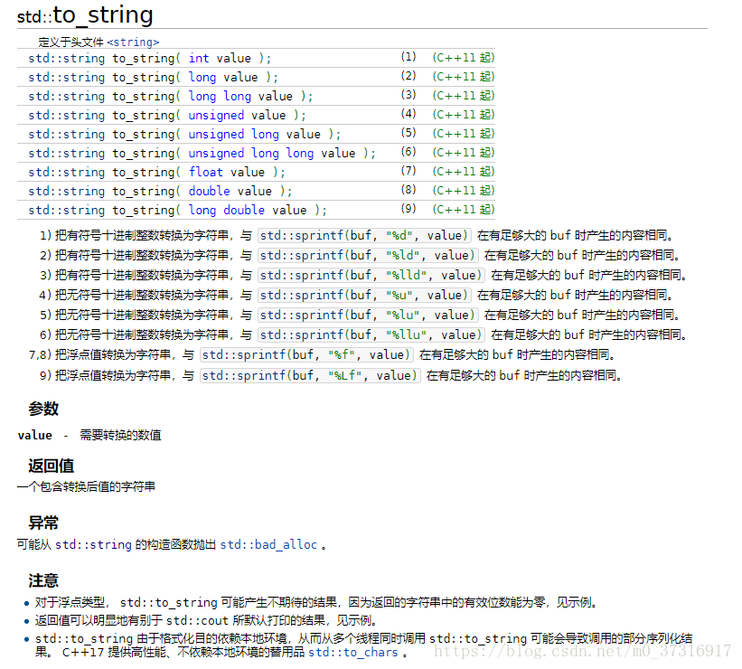
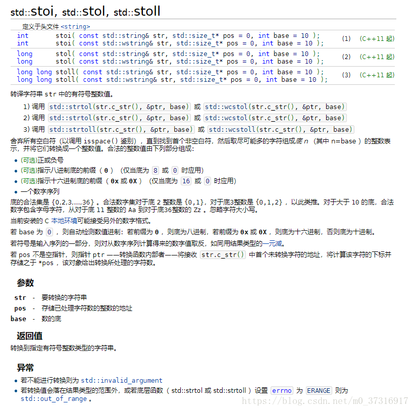
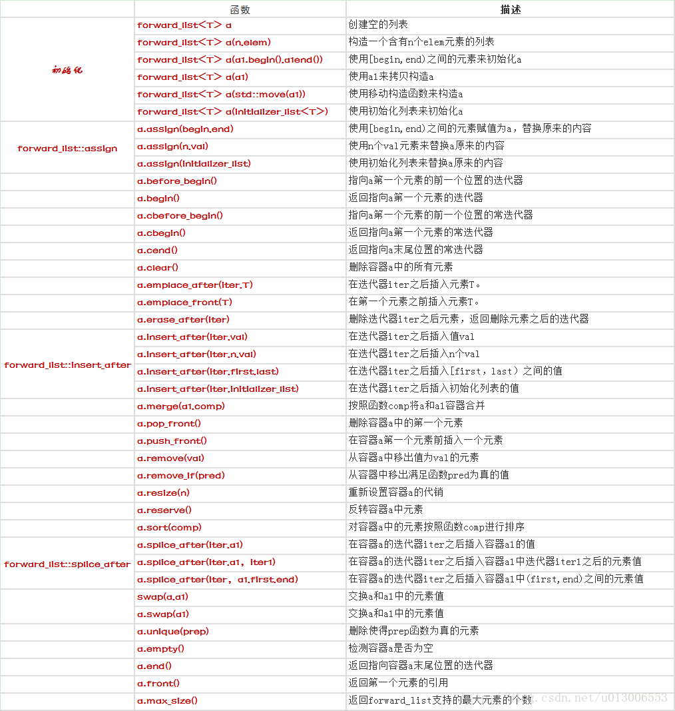

# C++函数
- [字符串相关](#1)
 - [int string互相转换](#1.1)

- [STL容器](#2)
 - [Map](#2.1)
 - [vector（数组）](#2.2) 
 - [array（数组）](#2.3)  
 - [deque（队列）](#2.4)  
 - [list（双向链表）](#2.5)  
 - [forward_list（单向链表）](#2.6)  
 - [stack（堆栈）](#2.7)  
 - [queue(队列)](#2.8)  
 - [priority_queue（优先队列）](#2.9)  
 - [set](#2.10)  
 - [multiset](#2.11)   
 - [hash_set & hash_multiset](#2.12)  
 - [multimap](#2.13) 
 - [hash_map&hash_multimap](#2.14)  
 - [tuple(元组)](#2.15)  
 - [pair](#2.16)  

- [库函数](#3)
 - [fread](#3.1)

- [STL算法](#4)

参考链接：    
1.系统库函数    
https://www.runoob.com/cprogramming/c-function-fread.html     

## <a id="1">字符串相关</a>
### <a id="1.1">int string互相转换</a>
#### int转string



#### string转int



## <a id="2">STL容器</a>
- [Map](#2.1)
- [vector（数组）](#2.2) 
- [array（数组）](#2.3)  
- [deque（队列）](#2.4)  
- [list（双向链表）](#2.5)  
- [forward_list（单向链表）](#2.6)  
- [stack（堆栈）](#2.7)  
- [queue(队列)](#2.8)  
- [priority_queue（优先队列）](#2.9)  
- [set](#2.10)  
- [multiset](#2.11)   
- [hash_set & hash_multiset](#2.12)  
- [multimap](#2.13) 
- [hash_map&hash_multimap](#2.14)  
- [tuple(元组)](#2.15)  
- [pair](#2.16)  


```cpp
array
array 是固定大小的顺序容器，它们保存了一个以严格的线性顺序排列的特定数量的元素。

Vector
vector 是表示可以改变大小的数组的序列容器。

deque
deque（['dek]）（双端队列）是double-ended queue 的一个不规则缩写。deque是具有动态大小的序列容器，可以在两端（前端或后端）扩展或收缩。

forward_list
forward_list（单向链表）是序列容器，允许在序列中的任何地方进行恒定的时间插入和擦除操作。

list
list，双向链表，是序列容器，允许在序列中的任何地方进行常数时间插入和擦除操作，并在两个方向上进行迭代。

stack
stack 是一种容器适配器，用于在LIFO（后进先出）的操作，其中元素仅从容器的一端插入和提取。

queue
queue 是一种容器适配器，用于在FIFO（先入先出）的操作，其中元素插入到容器的一端并从另一端提取。

priority_queue
set
set 是按照特定顺序存储唯一元素的容器。

multiset
map
map 是关联容器，按照特定顺序存储由 key value (键值) 和 mapped value (映射值) 组合形成的元素。
```

| 容器                  | 底层数据结构 | 时间复杂度                   | 有无序        | 可不可重复         | 其他                                                                       |
| ----------------------- | ----------------- | --------------------------------- | ---------------- | ----------------------- | ---------------------------------------------------------------------------- |
| array                   | 数组            | 随机读改 O(1)                 | 无序           | 可重复               | 支持快速随机访问                                                     |
| vector                  | 数组            | 随机读改、尾部插入、尾部删除 O(1) | vector           | 数组                  | 随机读改、尾部插入、尾部删除 O(1)                              |
| 头部插入、头部删除 O(n) | 无序            | 可重复                         | 支持快速随机访问 | 头部插入、头部删除 O(n) | 无序                                                                       |
| list                    | 双向链表      | 插入、删除 O(1)              | list             | 双向链表            | 插入、删除 O(1)                                                         |
| 随机读改 O(n)       | 无序            | 可重复                         | 支持快速增删 | 随机读改 O(n)       | 无序                                                                       |
| deque                   | 双端队列      | 头尾插入、头尾删除 O(1)  | 无序           | 可重复               | 一个中央控制器 + 多个缓冲区，支持首尾快速增删，支持随机访问 |
| stack                   | deque / list      | 顶部插入、顶部删除 O(1)  | 无序           | 可重复               | deque 或 list 封闭头端开口，不用 vector 的原因应该是容量大小有限制，扩容耗时 |
| queue                   | deque / list      | 尾部插入、头部删除 O(1)  | 无序           | 可重复               | deque 或 list 封闭头端开口，不用 vector 的原因应该是容量大小有限制，扩容耗时 |
| priority_queue          | vector + max-heap | 插入、删除 O(log2n)          | 有序           | 可重复               | vector容器+heap处理规则                                                |
| set                     | 红黑树         | 插入、删除、查找 O(log2n) | 有序           | 不可重复            |                                                                              |
| multiset                | 红黑树         | 插入、删除、查找 O(log2n) | 有序           | 可重复               |                                                                              |
| map                     | 红黑树         | 插入、删除、查找 O(log2n) | 有序           | 不可重复            |                                                                              |
| multimap                | 红黑树         | 插入、删除、查找 O(log2n) | 有序           | 可重复               |                                                                              |
| hash_set                | 哈希表         | 插入、删除、查找 O(1) 最差 O(n) | 无序           | 不可重复            |                                                                              |
| hash_multiset           | 哈希表         | 插入、删除、查找 O(1) 最差 O(n) | 无序           | 可重复               |                                                                              |
| hash_map                | 哈希表         | 插入、删除、查找 O(1) 最差 O(n) | 无序           | 不可重复            |                                                                              |
| hash_multimap           | 哈希表         | 插入、删除、查找 O(1) 最差 O(n) | 无序           | 可重复               | hash_multimap                                                                |
|                         |                   |                                   |                  |                         |                                                                              |

### <a id="2.1">Map</a>
参考链接：   
1.C++中的STL中map用法详解   
https://www.cnblogs.com/fnlingnzb-learner/p/5833051.html   

Map是STL的一个关联容器，它提供一对一（其中第一个可以称为关键字，每个关键字只能在map中出现一次，第二个可能称为该关键字的值）的数据 处理能力，由于这个特性，它完成有可能在我们处理一对一数据的时候，在编程上提供快速通道。这里说下map内部数据的组织，map内部自建一颗红黑树(一 种非严格意义上的平衡二叉树)，这颗树具有对数据自动排序的功能，所以在map内部所有的数据都是有序的，后边我们会见识到有序的好处。  

map是一类关联式容器。它的特点是增加和删除节点对迭代器的影响很小，除了那个操作节点，对其他的节点都没有什么影响。对于迭代器来说，可以修改实值，而不能修改key。

根据key值快速查找记录，查找的复杂度基本是Log(N)，如果有1000个记录，最多查找10次，1,000,000个记录，最多查找20次。

使用map得包含map类所在的头文件
#include <map>  //注意，STL头文件没有扩展名.h
map对象是模板类，需要关键字和存储对象两个模板参数：
std:map<int,string> personnel;
这样就定义了一个用int作为索引,并拥有相关联的指向string的指针.

#### 构造函数
map共提供了6个构造函数，这块涉及到内存分配器这些东西，略过不表，在下面我们将接触到一些map的构造方法，这里要说下的就是，我们通常用如下方法构造一个map：

map<int, string> mapStudent;

```cpp
构造一个映射容器对象，根据所使用的构造器版本初始化其内容：
（1）空容器构造函数（默认构造函数）
构造一个空的容器，没有元素。
（2）范围构造函数
构造具有一样多的元素的范围内的容器[第一，最后一个），其中每个元件布设构造的从在该范围内它的相应的元件。
（3）复制构造函数（并用分配器复制）
使用x中的每个元素的副本构造一个容器。
（4）移动构造函数（并与分配器一起移动）
构造一个获取x元素的容器。 如果指定了alloc并且与x的分配器不同，那么元素将被移动。否则，没有构建元素（他们的所有权直接转移）。 x保持未指定但有效的状态。
（5）初始化列表构造函数
用il中的每个元素的副本构造一个容器。
map<char,int> first;
```

#### map的基本操作函数
```cpp
map::begin  end
返回引用map容器中第一个元素的迭代器。由于map容器始终保持其元素的顺序，所以开始指向遵循容器排序标准的元素。如果容器是空的，则返回的迭代器值不应被解除引用。

map::key_comp
返回容器用于比较键的比较对象的副本。

map::value_comp
返回可用于比较两个元素的比较对象，以获取第一个元素的键是否在第二个元素之前。

map::find
在容器中搜索具有等于k的键的元素，如果找到则返回一个迭代器，否则返回map::end的迭代器。如果容器的比较对象自反地返回假（即，不管元素作为参数传递的顺序），则两个key被认为是等同的。另一个成员函数map::count可以用来检查一个特定的键是否存在。

map::count
在容器中搜索具有等于k的键的元素，并返回匹配的数量。由于地图容器中的所有元素都是唯一的，因此该函数只能返回1（如果找到该元素）或返回零（否则）。如果容器的比较对象自反地返回错误（即，不管按键作为参数传递的顺序），则两个键被认为是等同的。

map::lower_bound
将迭代器返回到下限。返回指向容器中第一个元素的迭代器，该元素的键不会在k之前出现（即，它是等价的或者在其后）。返回上一个。

map::upper_bound
将迭代器返回到上限。返回一个指向容器中第一个元素的迭代器，它的关键字被认为是在k之后。返回下一个

Size 返回个数，用下标访问。
erase(1)：删除可以用下标删除，也可以用迭代器范围删除。

map的基本操作函数：
C++ maps是一种关联式容器，包含“关键字/值”对
begin()         返回指向map头部的迭代器
clear(）        删除所有元素
count()         返回指定元素出现的次数
empty()         如果map为空则返回true
end()           返回指向map末尾的迭代器
equal_range()   返回特殊条目的迭代器对
erase()         删除一个元素
find()          查找一个元素
get_allocator() 返回map的配置器
insert()        插入元素
key_comp()      返回比较元素key的函数
lower_bound()   返回键值>=给定元素的第一个位置
max_size()      返回可以容纳的最大元素个数
rbegin()        返回一个指向map尾部的逆向迭代器
rend()          返回一个指向map头部的逆向迭代器
size()          返回map中元素的个数
swap()           交换两个map
upper_bound()    返回键值>给定元素的第一个位置
value_comp()     返回比较元素value的函数
```

#### 数据的插入
##### 第一种：用insert函数插入pair数据
```cpp
map<int, string> mapStudent;  

mapStudent.insert(pair<int, string>(1, "student_one"));  
mapStudent.insert(pair<int, string>(2, "student_two"));  
mapStudent.insert(pair<int, string>(3, "student_three"));  

map<int, string>::iterator iter;  
for(iter = mapStudent.begin(); iter != mapStudent.end(); iter++)  
    cout<<iter->first<<' '<<iter->second<<endl;  
```

##### 第二种：用insert函数插入value_type数据
```cpp
map<int, string> mapStudent;  
  
mapStudent.insert(map<int, string>::value_type (1, "student_one"));  
mapStudent.insert(map<int, string>::value_type (2, "student_two"));  
mapStudent.insert(map<int, string>::value_type (3, "student_three"));  

map<int, string>::iterator iter;  
for(iter = mapStudent.begin(); iter != mapStudent.end(); iter++)  
    cout<<iter->first<<' '<<iter->second<<endl;  
```

##### 第三种：用数组方式插入数据
```cpp
map<int, string> mapStudent;  

mapStudent[1] = "student_one";  
mapStudent[2] = "student_two";  
mapStudent[3] = "student_three";  

map<int, string>::iterator iter;  
for(iter = mapStudent.begin(); iter != mapStudent.end(); iter++)  
    cout<<iter->first<<' '<<iter->second<<endl;  
```

>以上三种用法，虽然都可以实现数据的插入，但是它们是有区别的，当然了第一种和第二种在效果上是完成一样的，用insert函数插入数据，在数据的 插入上涉及到集合的唯一性这个概念，即当map中有这个关键字时，insert操作是插入数据不了的，但是用数组方式就不同了，它可以覆盖以前该关键字对 应的值

#### 数据大小与遍历
Int nSize = mapStudent.size();

这里也提供三种方法，对map进行遍历  
- 第一种：应用前向迭代器，上面举例程序中到处都是了，略过不表  
- 第二种：应用反相迭代器，下面举例说明，要体会效果
```cpp
map<int, string>::reverse_iterator iter;  
for(iter = mapStudent.rbegin(); iter != mapStudent.rend(); iter++)  
    cout<<iter->first<<"  "<<iter->second<<endl;  
```
- 第三种，用数组的形式，程序说明如下：  
```cpp
int nSize = mapStudent.size();  
//此处应注意，应该是 for(int nindex = 1; nindex <= nSize; nindex++)  
//而不是 for(int nindex = 0; nindex < nSize; nindex++)  
for(int nindex = 1; nindex <= nSize; nindex++)  
    cout<<mapStudent[nindex]<<endl;  
```

#### 数据查找
要判定一个数据（关键字）是否在map中出现的方法比较多，这里标题虽然是数据的查找，在这里将穿插着大量的map基本用法。

这里给出三种数据查找方法   
- 第一种：用count函数来判定关键字是否出现，其缺点是无法定位数据出现位置,由于map的特性，一对一的映射关系，就决定了count函数的返回值只有两个，要么是0，要么是1，出现的情况，当然是返回1了  

- 第二种：用find函数来定位数据出现位置，它返回的一个迭代器，当数据出现时，它返回数据所在位置的迭代器，如果map中没有要查找的数据，它返回的迭代器等于end函数返回的迭代器。

查找map中是否包含某个关键字条目用find()方法，传入的参数是要查找的key，在这里需要提到的是begin()和end()两个成员，分别代表map对象中第一个条目和最后一个条目，这两个数据的类型是iterator.
```cpp
map<int, string> mapStudent;  

mapStudent.insert(pair<int, string>(1, "student_one"));  
mapStudent.insert(pair<int, string>(2, "student_two"));  
mapStudent.insert(pair<int, string>(3, "student_three"));  

map<int, string>::iterator iter;  
iter = mapStudent.find(1);  
if(iter != mapStudent.end())  
  cout<<"Find, the value is "<<iter->second<<endl;  
else  
  cout<<"Do not Find"<<endl;  
```
通过map对象的方法获取的iterator数据类型是一个std::pair对象，包括两个数据 iterator->first和 iterator->second分别代表关键字和存储的数据。

- 第三种：这个方法用来判定数据是否出现，是显得笨了点，但是，我打算在这里讲解  
lower_bound函数用法，这个函数用来返回要查找关键字的下界(是一个迭代器)  
upper_bound函数用法，这个函数用来返回要查找关键字的上界(是一个迭代器)  

例如：map中已经插入了1，2，3，4的话，如果lower_bound(2)的话，返回的2，而upper-bound（2）的话，返回的就是3

Equal_range函数返回一个pair，pair里面第一个变量是Lower_bound返回的迭代器，pair里面第二个迭代器是Upper_bound返回的迭代器，如果这两个迭代器相等的话，则说明map中不出现这个关键字  
```cpp
map<int, string> mapStudent;  

mapStudent[1] = "student_one";  
mapStudent[3] = "student_three";  
mapStudent[5] = "student_five";  

map<int, string>::iterator iter;  

iter = mapStudent.lower_bound(1);  
//返回的是下界1的迭代器  
    cout<<iter->second<<endl;  

iter = mapStudent.lower_bound(2);  
//返回的是下界3的迭代器  
    cout<<iter->second<<endl;  
```

#### 删除元素

移除某个map中某个条目用erase（）  

该成员方法的定义如下：  
iterator erase（iterator it);//通过一个条目对象删除
map<int, string>::iterator iter;    
iter = mapStudent.find(1);    
mapStudent.erase(iter);    

iterator erase（iterator first，iterator last）//删除一个范围

size_type erase(const Key&key);//通过关键字删除  
int n = mapStudent.erase(1);//如果删除了会返回1，否则返回0   

clear()就相当于enumMap.erase(enumMap.begin(),enumMap.end());  
mapStudent.erase( mapStudent.begin(), mapStudent.end() );    

#### map的基本操作函数

C++ maps是一种关联式容器，包含“关键字/值”对

begin()         返回指向map头部的迭代器

clear(）        删除所有元素

count()         返回指定元素出现的次数

empty()         如果map为空则返回true

end()           返回指向map末尾的迭代器

equal_range()   返回特殊条目的迭代器对

erase()         删除一个元素

find()          查找一个元素

get_allocator() 返回map的配置器

insert()        插入元素

key_comp()      返回比较元素key的函数

lower_bound()   返回键值>=给定元素的第一个位置

max_size()      返回可以容纳的最大元素个数

rbegin()        返回一个指向map尾部的逆向迭代器

rend()          返回一个指向map头部的逆向迭代器

size()          返回map中元素的个数

swap()           交换两个map

upper_bound()    返回键值>给定元素的第一个位置

value_comp()     返回比较元素value的函数

### <a id="2.2">vector（数组）</a>
向量（Vector）是一个封装了动态大小数组的顺序容器（Sequence Container）。跟任意其它类型容器一样，它能够存放各种类型的对象。可以简单的认为，向量是一个能够存放任意类型的动态数组。特性如下：  
- 1.顺序序列  
顺序容器中的元素按照严格的线性顺序排序。可以通过元素在序列中的位置访问对应的元素。
- 2.动态数组  
支持对序列中的任意元素进行快速直接访问，甚至可以通过指针算述进行该操作。操供了在序列末尾相对快速地添加/删除元素的操作。
- 3.能够感知内存分配器的（Allocator-aware）   
容器使用一个内存分配器对象来动态地处理它的存储需求。

#### 构造函数
```cpp
vector():创建一个空vector
vector(int nSize):创建一个vector,元素个数为nSize
vector(int nSize,const t& t):创建一个vector，元素个数为nSize,且值均为t
vector(const vector&):复制构造函数
vector(begin,end):复制[begin,end)区间内另一个数组的元素到vector中

方式1.
//定义具有10个整型元素的向量（尖括号为元素类型名，它可以是任何合法的数据类型），不具有初值，其值不确定
vector<int>a(10);

方式2.
//定义具有10个整型元素的向量，且给出的每个元素初值为1
vector<int>a(10,1);

方式3.
//用向量b给向量a赋值，a的值完全等价于b的值
vector<int>a(b);

方式4.
//将向量b中从0-2（共三个）的元素赋值给a，a的类型为int型
vector<int>a(b.begin(),b.begin+3);

方式5.//从数组中获得初值
int b[7]={1,2,3,4,5,6,7};
vector<int> a(b,b+7）;

```

#### 增加函数
```cpp
void push_back(const T& x):向量尾部增加一个元素X
iterator insert(iterator it,const T& x):向量中迭代器指向元素前增加一个元素x
iterator insert(iterator it,int n,const T& x):向量中迭代器指向元素前增加n个相同的元素x
iterator insert(iterator it,const_iterator first,const_iterator last):向量中迭代器指向元素前插入另一个
相同类型向量的[first,last)间的数据

1.向向量a中添加元素
vector<int>a;
for(int i=0;i<10;++i){a.push_back(i);}

2.从数组中选择元素向向量中添加
int a[6]={1,2,3,4,5,6};
vector<int> b;
for(int i=0;i<=4;++i){b.push_back(a[i]);}

3.从现有向量中选择元素向向量中添加
int a[6]={1,2,3,4,5,6};
vector<int>b;
vector<int>c(a,a+4);
for(vector<int>::iterator it=c.begin();it<c.end();++it)
{
	b.push_back(*it);
}

4.从文件中读取元素向向量中添加
ifstream in("data.txt");
vector<int>a;
for(int i;in>>i){a.push_back(i);}

5.常见错误赋值方式
vector<int>a;
for(int i=0;i<10;++i){a[i]=i;}//下标只能用来获取已经存在的元素

```

#### 删除函数
```cpp
iterator erase(iterator it):删除向量中迭代器指向元素
iterator erase(iterator first,iterator last):删除向量中[first,last)中元素
void pop_back():删除向量中最后一个元素
void clear():清空向量中所有元素
```

#### 遍历函数
```cpp
reference at(int pos):返回pos位置元素的引用
reference front():返回首元素的引用
reference back():返回尾元素的引用
iterator begin():返回向量头指针，指向第一个元素
iterator end():返回向量尾指针，指向向量最后一个元素的下一个位置
reverse_iterator rbegin():反向迭代器，指向最后一个元素
reverse_iterator rend():反向迭代器，指向第一个元素之前的位置

1.通过下标方式获取
int a[6]={1,2,3,4,5,6};
vector<int>b(a,a+4);
for(int i=0;i<=b.size()-1;++i){cout<<b[i]<<endl;}

2.通过迭代器方式读取

 int a[6]={1,2,3,4,5,6};
 vector<int>b(a,a+4);
 for(vector<int>::iterator it=b.begin();it!=b.end();it++){cout<<*it<<"  ";}
```

#### 判断函数
```cpp
bool empty() const:判断向量是否为空，若为空，则向量中无元素
```

#### 大小函数
```cpp
int size() const:返回向量中元素的个数
int capacity() const:返回当前向量张红所能容纳的最大元素值
int max_size() const:返回最大可允许的vector元素数量值
```

#### 其他函数
```cpp
void swap(vector&):交换两个同类型向量的数据
void assign(int n,const T& x):设置向量中第n个元素的值为x
void assign(const_iterator first,const_iterator last):向量中[first,last)中元素设置成当前向量元素
```

#### vector的基本操作函数
```cpp
1.push_back 在数组的最后添加一个数据
2.pop_back 去掉数组的最后一个数据
3.at 得到编号位置的数据
4.begin 得到数组头的指针
5.end 得到数组的最后一个单元+1的指针
6.front 得到数组头的引用
7.back 得到数组的最后一个单元的引用
8.max_size 得到vector最大可以是多大
9.capacity 当前vector分配的大小
10.size 当前使用数据的大小
11.resize 改变当前使用数据的大小，如果它比当前使用的大，者填充默认值
12.reserve 改变当前vecotr所分配空间的大小
13.erase 删除指针指向的数据项
14.clear 清空当前的vector
15.rbegin 将vector反转后的开始指针返回(其实就是原来的end-1)
16.rend 将vector反转构的结束指针返回(其实就是原来的begin-1)
17.empty 判断vector是否为空
18.swap 与另一个vector交换数据

vector<int> a,b;
//b为向量，将b的0-2个元素赋值给向量a
a.assign(b.begin(),b.begin()+3);
//a含有4个值为2的元素
a.assign(4,2);
//返回a的最后一个元素
a.back();
//返回a的第一个元素
a.front();
//返回a的第i元素,当且仅当a存在
a[i];
//清空a中的元素
a.clear();
//判断a是否为空，空则返回true，非空则返回false
a.empty();
//删除a向量的最后一个元素
a.pop_back();
//删除a中第一个（从第0个算起）到第二个元素，也就是说删除的元素从a.begin()+1算起（包括它）一
//直到a.begin()+3（不包括它）结束
a.erase(a.begin()+1,a.begin()+3);
//在a的最后一个向量后插入一个元素，其值为5
a.push_back(5);
//在a的第一个元素（从第0个算起）位置插入数值5,
a.insert(a.begin()+1,5);
//在a的第一个元素（从第0个算起）位置插入3个数，其值都为5
a.insert(a.begin()+1,3,5);
//b为数组，在a的第一个元素（从第0个元素算起）的位置插入b的第三个元素到第5个元素（不包括b+6）
a.insert(a.begin()+1,b+3,b+6);
//返回a中元素的个数
a.size();
//返回a在内存中总共可以容纳的元素个数
a.capacity();
//将a的现有元素个数调整至10个，多则删，少则补，其值随机
a.resize(10);
//将a的现有元素个数调整至10个，多则删，少则补，其值为2
a.resize(10,2);
//将a的容量扩充至100，
a.reserve(100);
//b为向量，将a中的元素和b中的元素整体交换
a.swap(b);
//b为向量，向量的比较操作还有 != >= > <= <
a==b;

#include<algorithm>
//对a中的从a.begin()（包括它）到a.end()（不包括它）的元素进行从小到大排列
sort(a.begin(),a.end());
//对a中的从a.begin()（包括它）到a.end()（不包括它）的元素倒置，但不排列，如a中元素为1,3,2,4,倒置后为4,2,3,1
reverse(a.begin(),a.end());
//把a中的从a.begin()（包括它）到a.end()（不包括它）的元素复制到b中，从b.begin()+1的位置（包括它）开始复制，
//覆盖掉原有元素
copy(a.begin(),a.end(),b.begin()+1);
//在a中的从a.begin()（包括它）到a.end()（不包括它）的元素中查找10，若存在返回其在向量中的位置
find(a.begin(),a.end(),10);
```

### <a id="2.3">array（数组）</a>
array也位于名称空间std中,与数组一样,array对象的长度也是固定的,也使用栈(静态内存分配),而不是自由存储区,因此其效率与数组相同,但更方便,更安全。

#### 创建
array<int, 5> myarray = {2, 16, 77,34, 50};创建   

#### 访问
```cpp
array::begin：返回指向数组容器中第一个元素的迭代器。
array::end：返回指向数组容器中最后一个元素之后的理论元素的迭代器。
array::rbegin：返回指向数组容器中最后一个元素的反向迭代器。
array::rend：返回一个反向迭代器，指向数组中第一个元素之前的理论元素（这被认为是它的反向结束）。
array::cbegin：返回指向数组容器中第一个元素的常量迭代器（const_iterator）；这个迭代器可以增加和减少，但是不能用来修改它指向的内容。
array::cend：返回指向数组容器中最后一个元素之后的理论元素的常量迭代器（const_iterator）。这个迭代器可以增加和减少，但是不能用来修改它指向的内容。
array::crbegin：返回指向数组容器中最后一个元素的常量反向迭代器（const_reverse_iterator）
array::crend：返回指向数组中第一个元素之前的理论元素的常量反向迭代器（const_reverse_iterator），它被认为是其反向结束。
```

#### 操作函数
```cpp
array::size：返回数组容器中元素的数量。
array::max_size：返回数组容器可容纳的最大元素数。数组对象的max_size与其size一样，始终等于用于实例化数组模板类的第二个模板参数。
array::empty：返回一个布尔值，指示数组容器是否为空，即它的size()是否为0。
array::operator[]：返回数组中第n个位置的元素的引用。与array::at相似，但array::at会检查数组边界并通过抛出一个out_of_range异常来判断n是否超出范围，而array::operator[]不检查边界。使用Array[1]访问。
array::at：返回数组中第n个位置的元素的引用。与array::operator[]相似，但array::at会检查数组边界并通过抛出一个out_of_range异常来判断n是否超出范围，而array::operator[]不检查边界。
array::front：返回对数组容器中第一个元素的引用。array::begin返回的是迭代器，array::front返回的是直接引用。在空容器上调用此函数会导致未定义的行为。
array::back：返回对数组容器中最后一个元素的引用。array::end返回的是迭代器，array::back返回的是直接引用。在空容器上调用此函数会导致未定义的行为。
array::data：返回指向数组对象中第一个元素的指针。由于数组中的元素存储在连续的存储位置，所以检索到的指针可以偏移以访问数组中的任何元素。
array::fill：用val填充数组所有元素，将val设置为数组对象中所有元素的值。
array::swap：通过x的内容交换数组的内容，这是另一个相同类型的数组对象（包括相同的大小）。与其他容器的交换成员函数不同，此成员函数通过在各个元素之间执行与其大小相同的单独交换操作，以线性时间运行。
get（array）：形如：std::get<0>(myarray)；传入一个数组容器，返回指定位置元素的引用。
```

### <a id="2.4">deque（队列）</a>
双端队列，底层是一个双向链表。常用的有队列的尾部入队、首部出队。

#### 普通队列：queue
```cpp
queue 模板类的定义在<queue>头文件中。与stack 模板类很相似，queue 模板类也需要两个模板参数，一个是元素类型，一个容器类型，元素类型是必要的，容器类型是可选的，默认为deque 类型。
定义queue 对象的示例代码如下：
queue<int> q1;
queue<double> q2;
queue 的基本操作有：
入队，如例：q.push(x); 将x 接到队列的末端。
出队，如例：q.pop(); 弹出队列的第一个元素，注意，并不会返回被弹出元素的值。
访问队首元素，如例：q.front()，即最早被压入队列的元素。
访问队尾元素，如例：q.back()，即最后被压入队列的元素。
判断队列空，如例：q.empty()，当队列空时，返回true。
访问队列中的元素个数，如例：q.size()
```

#### 1.构造
```cpp
无参构造：
deque<T> a;　　//<>内自定义数据类型；
带参构造：
deque(beg,end); //构造函数将[beg, end)区间中的元素拷贝给本身。注意该区间是左闭右开的区间。
deque(n,elem); //构造函数将n个elem拷贝给本身。
deque(const deque &deq); //拷贝构造函数。
```

#### 2.头部&尾部的添加和删除
```cpp
deque.push_back(elem); //在容器尾部添加一个数据
deque.push_front(elem); //在容器头部插入一个数据
deque.pop_back(); //删除容器最后一个数据
deque.pop_front(); //删除容器第一个数据
```

#### 3.中间数据存取
```cpp
deque.at(idx); //返回索引idx所指的数据，如果idx越界，抛出out_of_range。
deque[idx]; //返回索引idx所指的数据，如果idx越界，不抛出异常，直接出错。
deque.front(); //返回第一个数据。
deque.back(); //返回最后一个数据
```

#### 4.元素插入
```cpp
deque.insert(pos,elem); //在pos位置插入一个elem元素的拷贝，返回新数据的位置。
deque.insert(pos,n,elem); //在pos位置插入n个elem数据，无返回值。
deque.insert(pos,beg,end); //在pos位置插入[beg,end)区间的数据，无返回值。
```

#### 5.数据删除
```cpp
deque.clear(); //移除容器的所有数据
deque.erase(beg,end); //删除[beg,end)区间的数据，返回下一个数据的位置。
deque.erase(pos); //删除pos位置的数据，返回下一个数据的位置。
```

#### 6.迭代指针
```cpp
deque.begin(); //返回容器中第一个元素的迭代器。
deque.end(); //返回容器中最后一个元素之后的迭代器。
deque.rbegin(); //返回容器中倒数第一个元素的迭代器。
deque.rend(); //返回容器中倒数最后一个元素之后的迭代器。
deque<int>::iterator it = dequeA.begin();
```

#### 7.赋值&拷贝
```cpp
deque.assign(beg,end); //将[beg, end)区间中的数据拷贝赋值给本身。注意该区间是左闭右开的区间。
deque.assign(n,elem); //将n个elem拷贝赋值给本身。
deque& operator=(const deque &deq); //重载等号操作符 
deque.swap(deq); // 将vec与本身的元素互换
```

#### 8.大小&判断非空
```cpp
deque.size(); //返回容器中元素的个数
deque.empty(); //判断容器是否为空
deque.resize(num); //重新指定容器的长度为num，若容器变长，则以默认值填充新位置。如果容器变短，则末尾超出容器长度的元素被删除。
deque.resize(num, elem); //重新指定容器的长度为num，若容器变长，则以elem值填充新位置。如果容器变短，则末尾超出容器长度的元素被删除。
```

### <a id="2.5">list（双向链表）</a>
list 由双向链表（doubly linked list）实现而成，元素也存放在堆中，每个元素都是放在一块内存中，他的内存空间可以是不连续的，通过指针来进行数据的访问，这个特点使得它的随机存取变得非常没有效率，因此它没有提供 [] 操作符的重载。但是由于链表的特点，它可以很有效率的支持任意地方的插入和删除操作。

#### 1.构造
```cpp
list<int> a; // 定义一个int类型的列表a
list<int> a(10); // 定义一个int类型的列表a，并设置初始大小为10
list<int> a(10, 1); // 定义一个int类型的列表a，并设置初始大小为10且初始值都为1
list<int> b(a); // 定义并用列表a初始化列表b
deque<int> b(a.begin(), ++a.end()); // 将列表a中的第1个元素作为列表b的初始值
```

#### 2.容量函数
```cpp
容器大小：lst.size();
容器最大容量：lst.max_size();
更改容器大小：lst.resize();
容器判空：lst.empty();
```

#### 3.添加函数&删除函数
```cpp
头部添加元素：lst.push_front(const T& x);
末尾添加元素：lst.push_back(const T& x);
任意位置插入一个元素：lst.insert(iterator it, const T& x);
任意位置插入 n 个相同元素：lst.insert(iterator it, int n, const T& x);
插入另一个向量的 [forst,last] 间的数据：lst.insert(iterator it, iterator first, iterator last);
头部删除元素：lst.pop_front();
末尾删除元素：lst.pop_back();
任意位置删除一个元素：lst.erase(iterator it);
删除 [first,last] 之间的元素：lst.erase(iterator first, iterator last);
清空所有元素：lst.clear();
```

#### 4.访问函数
```cpp
访问第一个元素：lst.front();
访问最后一个元素：lst.back();
```

#### 5.其他函数
```cpp
多个元素赋值：lst.assign(int nSize, const T& x); // 类似于初始化时用数组进行赋值
交换两个同类型容器的元素：swap(list&, list&); 或 lst.swap(list&);
合并两个列表的元素（默认升序排列）：lst.merge();
在任意位置拼接入另一个list：lst.splice(iterator it, list&);
删除容器中相邻的重复元素：lst.unique();
remove_if()函数括号中可以传入，回调函数，创建用于比较的类，传入类名及初始化参数
Revese()list翻转
```

#### 6.迭代器
```cpp
开始迭代器指针：lst.begin();
末尾迭代器指针：lst.end(); // 指向最后一个元素的下一个位置
指向常量的开始迭代器指针：lst.cbegin(); // 意思就是不能通过这个指针来修改所指的内容，但还是可以通过其他方式修改的，而且指针也是可以移动的。
指向常量的末尾迭代器指针：lst.cend();
反向迭代器指针，指向最后一个元素：lst.rbegin();
反向迭代器指针，指向第一个元素的前一个元素：lst.rend();

可以看到，list 与 vector、deque 的用法基本一致，除了以下几处不同：
list 为双向迭代器，故不支持it+=i；
list 不支持下标访问和at方法访问
```

### <a id="2.6">forward_list（单向链表）</a>

forward_list（单向链表）是序列容器，允许在序列中的任何地方进行恒定的时间插入和擦除操作。forward_list（单向链表）被实现为单链表; 单链表可以将它们包含的每个元素存储在不同和不相关的存储位置中。通过关联到序列中下一个元素的链接的每个元素来保留排序。

forward_list容器和列表之间的主要设计区别容器是第一个内部只保留一个到下一个元素的链接，而后者每个元素保留两个链接：一个指向下一个元素，一个指向前一个元素，允许在两个方向上有效的迭代，但是每个元素消耗额外的存储空间并且插入和移除元件的时间开销略高。因此，forward_list对象比列表对象更有效率，尽管它们只能向前迭代。

与其他基本的标准序列容器（array，vector和deque），forward_list通常在插入，提取和移动容器内任何位置的元素方面效果更好，因此也适用于密集使用这些元素的算法，如排序算法。



>list的特点  
1.不支持随机访问；  
2.在任何位置插入或删除非常迅速；  

>forward_list的特点  
1.forward_list只提供前向迭代器，因此不支持反向迭代器，比如rbegin()等成员函数。  
2.forward_list不提供size（）成员函数。   
3.forward_list没有指向最末元素的锚点，因此不提供back（）、push_back（）和pop_back   
4.forward_list不提供随机访问，这一点跟list相同。  

插入和删除元素不会造成“指向至其他元素”的指针，引用和迭代器失效。  

### <a id="2.7">stack（堆栈）</a>
stack（堆栈） 是一个容器类的改编，为程序员提供了堆栈的全部功能，——也就是说实现了一个先进后出（FILO）的数据结构。特性总结: 栈不能遍历,不支持随机存取，只能通过 top 从栈顶获取和删除元素.

#### c++ stl栈stack的成员函数介绍
```cpp
操作 比较和分配堆栈
stack 构造函数
stack<T> stkT;//stack 采用模板类实现， stack 对象的默认构造形式：
stack(const stack &stk);//拷贝构造函数

stack 赋值操作
stack& operator=(const stack &stk);//重载等号操作符
stack 数据存取操作
push(elem);//向栈顶添加元素
pop();//从栈顶移除第一个元素
top();//返回栈顶元素
stack 大小操作
empty();//判断堆栈是否为空
size();//返回堆栈的大小
```

### <a id="2.8">queue(队列)</a>
queue翻译为队列，在STL中主要则是实现了一个先进先出的容器。

```cpp
1.初始化
需要头文件<queue>
queue<int>que;

2.成员函数
C++队列Queue类成员函数如下:
back()返回最后一个元素
empty()如果队列空则返回真
front()返回第一个元素
pop()删除第一个元素
push()在末尾加入一个元素
size()返回队列中元素的个数

3.queue 的基本操作举例如下：
queue入队，如例：q.push(x); 将x 接到队列的末端。
queue出队，如例：q.pop(); 弹出队列的第一个元素，注意，并不会返回被弹出元素的值。
访问queue队首元素，如例：q.front()，即最早被压入队列的元素。
访问queue队尾元素，如例：q.back()，即最后被压入队列的元素。
判断queue队列空，如例：q.empty()，当队列空时，返回true。
访问队列中的元素个数，如例：q.size()
```

### <a id="2.9">priority_queue（优先队列）</a>
普通的队列是一种先进先出的数据结构，元素在队列尾追加，而从队列头删除。在优先队列中，元素被赋予优先级。当访问元素时，具有最高优先级的元素最先删除。优先队列具有最高级先出 （first in, largest out）的行为特征。要包含头文件#include<queue>, 他和queue不同的就在于我们可以自定义其中数据的优先级, 让优先级高的排在队列前面,优先出队。优先队列具有队列的所有特性，包括队列的基本操作，只是在这基础上添加了内部的一个排序，它本质是一个堆实现的。

```cpp
和队列基本操作相同:
top 访问队头元素
empty 队列是否为空
size 返回队列内元素个数
push 插入元素到队尾 (并排序)
emplace 原地构造一个元素并插入队列
pop 弹出队头元素
swap 交换内容

priority_queue 优先队列，其底层是用堆来实现的。在优先队列中，队首元素一定是当前队列中优先级最高的那一个。在优先队列中，没有 front() 函数与 back() 函数，而只能通过 top() 函数来访问队首元素（也可称为堆顶元素），也就是优先级最高的元素。

基本数据类型的优先级设置
此处指的基本数据类型就是 int 型，double 型，char 型等可以直接使用的数据类型，优先队列对他们的优先级设置一般是数字大的优先级高，因此队首元素就是优先队列内元素最大的那个（如果是 char 型，则是字典序最大的）。

下面两种优先队列的定义是等价的
priority_queue<int> q; //默认大在前
priority_queue<int,vector<int>,less<int> >;//后面有一个空格，大在前
　　其中第二个参数( vector )，是来承载底层数据结构堆的容器，第三个参数( less )，则是一个比较类，less 表示数字大的优先级高，而 greater 表示数字小的优先级高。如果想让优先队列总是把最小的元素放在队首，只需进行如下的定义：
priority_queue<int,vector<int>,greater<int> >q；//小在前

和结构体结合使用
struct student{
    int grade;
    string name;
    //重载运算符，grade 值高的优先级大
    friend operator < (student s1,student s2){
        return s1.grade < s2.grade;
    }
};

priority_queue<student> q;
student s1,s2,s3;
s1.grade = 90;
s1.name = "Tom";

s2.grade = 80;
s2.name = "Jerry";

s3.grade = 100;
s3.name = "Kevin";

q.push(s1);
q.push(s2);
q.push(s3);

while(!q.empty()){
    cout<<q.top().name<<":"<<q.top().grade<<endl;
    q.pop();
} 

定义：priority_queue<Type, Container, Functional>
Type 就是数据类型，Container 就是容器类型（Container必须是用数组实现的容器，比如vector,deque等等，但不能用 list。STL里面默认用的是vector），Functional 就是比较的方式，当需要用自定义的数据类型时才需要传入这三个参数，使用基本数据类型时，只需要传入数据类型，默认是大顶堆
```

### <a id="2.10">set</a>
关于set，必须说明的是set关联式容器。set作为一个容器也是用来存储同一数据类型的数据类型，并且能从一个数据集合中取出数据，在set中每个元素的值都唯一，而且系统能根据元素的值自动进行排序。应该注意的是set中数元素的值不能直接被改变。C++ STL中标准关联容器set, multiset, map, multimap内部采用的就是一种非常高效的平衡检索二叉树：红黑树，也成为RB树(Red-Black Tree)。RB树的统计性能要好于一般平衡二叉树，所以被STL选择作为了关联容器的内部结构。

```cpp
set使用方法：
begin()     　　 ,返回set容器的第一个迭代器
end() 　　　　 ,返回set容器的最后一个迭代器
clear()   　　     ,删除set容器中的所有的元素
empty() 　　　,判断set容器是否为空
max_size() 　 ,返回set容器可能包含的元素最大个数
size() 　　　　 ,返回当前set容器中的元素个数
rbegin　　　　 ,返回的值和end()相同
rend()　　　　 ,返回的值和rbegin()相同
count() 用来查找set中某个某个键值出现的次数。这个函数在set并不是很实用，因为一个键值在set只可能出现0或1次，这样就变成了判断某一键值是否在set出现过了。
erase(iterator)  ,删除定位器iterator指向的值
erase(first,second),删除定位器first和second之间的值
erase(key_value),删除键值key_value的值
insert(key_value); 将key_value插入到set中 ，返回值是pair<set<int>::iterator,bool>，bool标志着插入是否成功，而iterator代表插入的位置，若key_value已经在set中，则iterator表示的key_value在set中的位置。
lower_bound(key_value) ，返回第一个大于等于key_value的定位器
upper_bound(key_value)，返回最后一个大于等于key_value的定位器

小结：set中的删除操作是不进行任何的错误检查的，比如定位器的是否合法等等，所以用的时候自己一定要注意。find()  ，返回给定值值得定位器，如果没找到则返回end()。
```

### <a id="2.11">multiset</a>
```cpp
set和multiset会根据特定的排序原则将元素排序。两者不同之处在于，multisets允许元素重复，而set不允许重复。
multiset mc:创建空集合,不包含任何元素
multiset mc(op):以op为排序准则，产生一个空的set
multiset c1(c2):复制c2中的元素到c1中
multiset c(const value_type *first, const value_type* last):复制[first, last)之间元素构成新集合
multiset c(const value_type *first, const value_type* last,op):以op为排序准则，复制[first, last)之间元素构成新集合。
Set mulitiset函数都差不多。
```

### <a id="2.12">hash_set&hash_multiset</a>
hash_set与hash_multiset：实值就是键值。以hashtable为底层机制，所以几乎所有的hash_set行为，都是转调hashtable的操作行为。与set、multiset相比，hash_set、hash_multiset没有自动排序功能。hash_set与set一样，实值就是键值。使用方式与set完全相同，插入元素操作采用底层机制hashtable的insert_unique()。hash_multiset与multiset一样，键值可以重复，使用方式和multiset相同。插入元素操作采用底层机制hashtable的insert_equal()。


### <a id="2.13">multimap</a>
无序容器（Unordered Container）：unordered_set、unordered_multiset、unordered_map、unordered_multimap。multimap 容器保存的是有序的键/值对，但它可以保存重复的元素。multimap 中会出现具有相同键的元素序列，它们会被添加到容器中。multimap 和 map 有相同范围的构造函数，默认的比较键的函数是 less<K>()。multimap 大部分成员函数的使用方式和 map 相同。因为重复键的原因，multimap 有一些函数的使用方式和 map 有一些区别。   

### <a id="2.14">hash_map&hash_multimap</a>
hash_map与hash_multmap：每一个元素同时拥有实值和键值。以hashtable为底层机制，所以几乎所有的hash_map行为，都是转调hashtable的操作行为。与map、multimap相比，hash_map、hash_multimap没有自动排序功能。hash_map与map一样，实值就是键值。使用方式与set完全相同插入元素操作采用底层机制hashtable的insert_unique()。hash_multimap与multimap一样，键值可以重复，pair<key, value>插入元素操作采用底层机制hashtable的insert_equal()。   

### <a id="2.15">tuple(元组)</a>
元组是一个能够容纳元素集合的对象。每个元素可以是不同的类型。

```cpp
tuple::tuple
1.构建一个 tuple（元组）对象。
这涉及单独构建其元素，初始化取决于调用的构造函数形式：
（1）默认的构造函数
构建一个 元组对象的元素值初始化。
（2）复制/移动构造函数
该对象使用tpl的内容进行初始化 元组目的。tpl 的相应元素被传递给每个元素的构造函数。
（3）隐式转换构造函数
同上。tpl中的 所有类型都可以隐含地转换为构造中它们各自元素的类型元组 目的。
（4）初始化构造函数 用elems中的相应元素初始化每个元素。elems 的相应元素被传递给每个元素的构造函数。
（5）对转换构造函数
该对象有两个对应于pr.first和的元素pr.second。PR中的所有类型都应该隐含地转换为其中各自元素的类型元组 目的。
（6）分配器版本

和上面的版本一样，除了每个元素都是使用allocator alloc构造的。

创建并初始化tuple
auto tup = std::make_tuple("liu","yi","jiang","is",6,1,9);

2.操作函数
Tie：分而取之，获取tuple中的单个元素
auto tup = std::make_tuple('l',6,2.33);
char a;
int b;
double c;
std:tie(a,b,c) = tup;

forward_as_tuple：用于接收右值引用数据生成tuple
auto tup = std::forward_as_tuple(1,"csdn")
tuple_cat：用于连接tuple
std::tuple<float, string> tup1(3.14, "pi");
std::tuple<int, char> tup2(10, 'a');
auto tup3 = tuple_cat(tup1, tup2);

get < i >:获取第i个元素的值
std::tuple<float, string> tup(666, "emmmm");
cout << get<0>(tup);

输入第一个元素666.
tuple_element：获取tuple中特定元素数据结构
std::tuple_element<0, decltype(tup1)>::type

Size：获取tuple中的元素个数
std::tuple<float, string> tup(666, "emmmm");
cout << tuple_size<decltype(tup1)>::value;
```

### <a id="2.16">pair</a>
这个类把一对值（values）结合在一起，这些值可能是不同的类型（T1 和 T2）。每个值可以被公有的成员变量first、second访问。pair是tuple（元组）的一个特例。:pair主要的作用是将两个数据组合成一个数据，两个数据可以是同一类型或者不同类型。

```cpp
pair::pair
构建一个pair对象。
这涉及到单独构建它的两个组件对象，初始化依赖于调用的构造器形式：
（1）默认的构造函数
构建一个 对对象的元素值初始化。

（2）复制/移动构造函数（和隐式转换）
该对象被初始化为pr的内容 对目的。pr 的相应成员被传递给每个成员的构造函数。

（3）初始化构造函数
会员 第一是由一个和成员构建的第二与b。

（4）分段构造
构造成员 first 和 second 到位，传递元素first_args 作为参数的构造函数 first，和元素 second_args 到的构造函数 second 。

（1）利用make_pair：
 pair<int, double> p1;
 p1 = make_pair(1, 1.2);
（2）变量间赋值：
  pair<int, double> p1(1, 1.2);
  pair<int, double> p2 = p1;
First  /   second：访问数据
```

## <a id="3">库函数</a>
### <a id="3.1">fread</a>
参考链接：  
1.C++中fread函数和fwrite函数    
https://www.csdn.net/gather_2f/MtTaQgysMTg1LWJsb2cO0O0O.html     

C 库函数 size_t fread(void *ptr, size_t size, size_t nmemb, FILE *stream) 从给定流 stream 读取数据到 ptr 所指向的数组中.

```cpp
size_t fread(void *ptr, size_t size, size_t nmemb, FILE *stream)

ptr -- 这是指向带有最小尺寸 size*nmemb 字节的内存块的指针。
size -- 这是要读取的每个元素的大小，以字节为单位。要读写的字节数
nmemb -- 这是元素的个数，每个元素的大小为 size 字节。要进行读写多少个size字节的数据项
stream -- 这是指向 FILE 对象的指针，该 FILE 对象指定了一个输入流。

fp = fopen("file.txt", "w+");
/* 写入数据到文件 */
fwrite(c, strlen(c) + 1, 1, fp);
/* 查找文件的开头 */
fseek(fp, 0, SEEK_SET);
/* 读取并显示数据 */
fread(buffer, strlen(c)+1, 1, fp);

1.fread(&id,1,10,f)就是把f里面的值读到id里面，每次读1个字节，一共读10次，或者把id里面的值都读完，不到10次也会停止。
2.fwrite(&id,1,10,f)就是把id里面的值读到f里面，每次读1个字节，一共读10次或是fread(&id,10,1,f)就是把id里面的值读到里面，每次读10个字节，一共读1次。

fseek函数
重定位流上的文件指针
int fseek(FILE *stream, long offset, int fromwhere);
函数设置文件指针stream的位置。如果执行成功，stream将指向以fromwhere为基准，偏移offset个字节的位置。如果执行失败(比如offset超过文件自身大小)，则不改变stream指向的位置。成功，返回0，否则返回其他值。
```

## <a id="4">STL算法</a>
```cpp
// 简单查找算法，要求输入迭代器（input iterator）
find(beg, end, val); // 返回一个迭代器，指向输入序列中第一个等于 val 的元素，未找到返回 end
find_if(beg, end, unaryPred); // 返回一个迭代器，指向第一个满足 unaryPred 的元素，未找到返回 end
find_if_not(beg, end, unaryPred); // 返回一个迭代器，指向第一个令 unaryPred 为 false 的元素，未找到返回 end
count(beg, end, val); // 返回一个计数器，指出 val 出现了多少次
count_if(beg, end, unaryPred); // 统计有多少个元素满足 unaryPred
all_of(beg, end, unaryPred); // 返回一个 bool 值，判断是否所有元素都满足 unaryPred
any_of(beg, end, unaryPred); // 返回一个 bool 值，判断是否任意（存在）一个元素满足 unaryPred
none_of(beg, end, unaryPred); // 返回一个 bool 值，判断是否所有元素都不满足 unaryPred

// 查找重复值的算法，传入向前迭代器（forward iterator）
adjacent_find(beg, end); // 返回指向第一对相邻重复元素的迭代器，无相邻元素则返回 end
adjacent_find(beg, end, binaryPred); // 返回指向第一对相邻重复元素的迭代器，无相邻元素则返回 end
search_n(beg, end, count, val); // 返回一个迭代器，从此位置开始有 count 个相等元素，不存在则返回 end
search_n(beg, end, count, val, binaryPred); // 返回一个迭代器，从此位置开始有 count 个相等元素，不存在则返回 end

// 查找子序列算法，除 find_first_of（前两个输入迭代器，后两个前向迭代器） 外，都要求两个前向迭代器
search(beg1, end1, beg2, end2); // 返回第二个输入范围（子序列）在爹一个输入范围中第一次出现的位置，未找到则返回 end1
search(beg1, end1, beg2, end2, binaryPred); // 返回第二个输入范围（子序列）在爹一个输入范围中第一次出现的位置，未找到则返回 end1
find_first_of(beg1, end1, beg2, end2); // 返回一个迭代器，指向第二个输入范围中任意元素在第一个范围中首次出现的位置，未找到则返回end1
find_first_of(beg1, end1, beg2, end2, binaryPred); // 返回一个迭代器，指向第二个输入范围中任意元素在第一个范围中首次出现的位置，未找到则返回end1
find_end(beg1, end1, beg2, end2); // 类似 search，但返回的最后一次出现的位置。如果第二个输入范围为空，或者在第一个输入范围为空，或者在第一个输入范围中未找到它，则返回 end1
find_end(beg1, end1, beg2, end2, binaryPred); // 类似 search，但返回的最后一次出现的位置。如果第二个输入范围为空，或者在第一个输入范围为空，或者在第一个输入范围中未找到它，则返回 end1

// 其他只读算法，传入输入迭代器
for_each(beg, end, unaryOp); // 对输入序列中的每个元素应用可调用对象 unaryOp，unaryOp 的返回值被忽略
mismatch(beg1, end1, beg2); // 比较两个序列中的元素。返回一个迭代器的 pair，表示两个序列中第一个不匹配的元素
mismatch(beg1, end1, beg2, binaryPred); // 比较两个序列中的元素。返回一个迭代器的 pair，表示两个序列中第一个不匹配的元素
equal(beg1, end1, beg2); // 比较每个元素，确定两个序列是否相等。
equal(beg1, end1, beg2, binaryPred); // 比较每个元素，确定两个序列是否相等。

// 二分搜索算法，传入前向迭代器或随机访问迭代器（random-access iterator），要求序列中的元素已经是有序的。通过小于运算符（<）或 comp 比较操作实现比较。
lower_bound(beg, end, val); // 返回一个非递减序列 [beg, end) 中的第一个大于等于值 val 的位置的迭代器，不存在则返回 end
lower_bound(beg, end, val, comp); // 返回一个非递减序列 [beg, end) 中的第一个大于等于值 val 的位置的迭代器，不存在则返回 end
upper_bound(beg, end, val); // 返回一个非递减序列 [beg, end) 中第一个大于 val 的位置的迭代器，不存在则返回 end
upper_bound(beg, end, val, comp); // 返回一个非递减序列 [beg, end) 中第一个大于 val 的位置的迭代器，不存在则返回 end
equal_range(beg, end, val); // 返回一个 pair，其 first 成员是 lower_bound 返回的迭代器，其 second 成员是 upper_bound 返回的迭代器
binary_search(beg, end, val); // 返回一个 bool 值，指出序列中是否包含等于 val 的元素。对于两个值 x 和 y，当 x 不小于 y 且 y 也不小于 x 时，认为它们相等。

// 只写不读算法，要求输出迭代器（output iterator）
fill(beg, end, val); // 将 val 赋予每个元素，返回 void
fill_n(beg, cnt, val); // 将 val 赋予 cnt 个元素，返回指向写入到输出序列最有一个元素之后位置的迭代器
genetate(beg, end, Gen); // 每次调用 Gen() 生成不同的值赋予每个序列，返回 void
genetate_n(beg, cnt, Gen); // 每次调用 Gen() 生成不同的值赋予 cnt 个序列，返回指向写入到输出序列最有一个元素之后位置的迭代器

// 使用输入迭代器的写算法，读取一个输入序列，将值写入到一个输出序列（dest）中
copy(beg, end, dest); // 从输入范围将元素拷贝所有元素到 dest 指定定的目的序列
copy_if(beg, end, dest, unaryPred); // 从输入范围将元素拷贝满足 unaryPred 的元素到 dest 指定定的目的序列
copy_n(beg, n, dest); // 从输入范围将元素拷贝前 n 个元素到 dest 指定定的目的序列
move(beg, end, dest); // 对输入序列中的每个元素调用 std::move，将其移动到迭代器 dest 开始始的序列中
transform(beg, end, dest, unaryOp); // 调用给定操作（一元操作），并将结果写到dest中
transform(beg, end, beg2, dest, binaryOp); // 调用给定操作（二元操作），并将结果写到dest中
replace_copy(beg, end, dest, old_val, new_val); // 将每个元素拷贝到 dest，将等于 old_val 的的元素替换为 new_val
replace_copy_if(beg, end, dest, unaryPred, new_val); // 将每个元素拷贝到 dest，将满足 unaryPred 的的元素替换为 new_val
merge(beg1, end1, beg2, end2, dest); // 两个输入序列必须都是有序的，用 < 运算符将合并后的序列写入到 dest 中
merge(beg1, end1, beg2, end2, dest, comp); // 两个输入序列必须都是有序的，使用给定的比较操作（comp）将合并后的序列写入到 dest 中

// 使用前向迭代器的写算法，要求前向迭代器
iter_swap(iter1, iter2); // 交换 iter1 和 iter2 所表示的元素，返回 void
swap_ranges(beg1, end1, beg2); // 将输入范围中所有元素与 beg2 开始的第二个序列中所有元素进行交换。返回递增后的的 beg2，指向最后一个交换元素之后的位置。
replace(beg, end, old_val, new_val); // 用 new_val 替换等于 old_val 的每个匹配元素
replace_if(beg, end, unaryPred, new_val); // 用 new_val 替换满足 unaryPred 的每个匹配元素

// 使用双向迭代器的写算法，要求双向选代器（bidirectional iterator）
copy_backward(beg, end, dest); // 从输入范围中拷贝元素到指定目的位置。如果范围为空,则返回值为 dest；否则，返回值表示从 *beg 中拷贝或移动的元素。
move_backward(beg, end, dest);  // 从输入范围中移动元素到指定目的位置。如果范围为空,则返回值为 dest；否则,返回值表示从 *beg 中拷贝或移动的元素。
inplace_merge(beg, mid, end); // 将同一个序列中的两个有序子序列合并为单一的有序序列。beg 到 mid 间的子序列和 mid 到 end 间的子序列被合并，并被写入到原序列中。使用 < 比较元素。
inplace_merge(beg, mid, end, comp); // 将同一个序列中的两个有序子序列合并为单一的有序序列。beg 到 mid 间的子序列和 mid 到 end 间的子序列被合并，并被写入到原序列中。使用给定的 comp 操作。

// 划分算法，要求双向选代器（bidirectional iterator）
is_partitioned(beg, end, unaryPred); // 如果所有满足谓词 unaryPred 的元素都在不满足 unarypred 的元素之前，则返回 true。若序列为空，也返回 true
partition_copy(beg, end, dest1, dest2, unaryPred); // 将满足 unaryPred 的元素拷贝到到 dest1，并将不满足 unaryPred 的元素拷贝到到 dest2。返回一个迭代器 pair，其 first 成员表示拷贝到 dest1 的的元素的末尾，second 表示拷贝到 dest2 的元素的末尾。
partitioned_point(beg, end, unaryPred); // 输入序列必须是已经用 unaryPred 划分过的。返回满足  unaryPred 的范围的尾后迭代器。如果返回的迭代器不是 end，则它指向的元素及其后的元素必须都不满足 unaryPred
stable_partition(beg, end, unaryPred); // 使用 unaryPred 划分输入序列。满足 unaryPred 的元素放置在序列开始，不满足的元素放在序列尾部。返回一个迭代器，指向最后一个满足 unaryPred 的元素之后的位置如果所有元素都不满足 unaryPred，则返回 beg
partition(beg, end, unaryPred); // 使用 unaryPred 划分输入序列。满足 unaryPred 的元素放置在序列开始，不满足的元素放在序列尾部。返回一个迭代器，指向最后一个满足 unaryPred 的元素之后的位置如果所有元素都不满足 unaryPred，则返回 beg

// 排序算法，要求随机访问迭代器（random-access iterator）
sort(beg, end); // 排序整个范围
stable_sort(beg, end); // 排序整个范围（稳定排序）
sort(beg, end, comp); // 排序整个范围
stable_sort(beg, end, comp); // 排序整个范围（稳定排序）
is_sorted(beg, end); // 返回一个 bool 值，指出整个输入序列是否有序
is_sorted(beg, end, comp); // 返回一个 bool 值，指出整个输入序列是否有序
is_sorted_until(beg, end); // 在输入序列中査找最长初始有序子序列，并返回子序列的尾后迭代器
is_sorted_until(beg, end, comp); // 在输入序列中査找最长初始有序子序列，并返回子序列的尾后迭代器
partial_sort(beg, mid, end); // 排序 mid-beg 个元素。即，如果 mid-beg 等于 42，则此函数将值最小的 42 个元素有序放在序列前 42 个位置
partial_sort(beg, mid, end, comp); // 排序 mid-beg 个元素。即，如果 mid-beg 等于 42，则此函数将值最小的 42 个元素有序放在序列前 42 个位置
partial_sort_copy(beg, end, destBeg, destEnd); // 排序输入范围中的元素，并将足够多的已排序元素放到 destBeg 和 destEnd 所指示的序列中
partial_sort_copy(beg, end, destBeg, destEnd, comp); // 排序输入范围中的元素，并将足够多的已排序元素放到 destBeg 和 destEnd 所指示的序列中
nth_element(beg, nth, end); // nth 是一个迭代器，指向输入序列中第 n 大的元素。nth 之前的元素都小于等于它，而之后的元素都大于等于它
nth_element(beg, nth, end, comp); // nth 是一个迭代器，指向输入序列中第 n 大的元素。nth 之前的元素都小于等于它，而之后的元素都大于等于它

// 使用前向迭代器的重排算法。普通版本在输入序列自身内部重拍元素，_copy 版本完成重拍后写入到指定目的序列中，而不改变输入序列
remove(beg, end, val); // 通过用保留的元素覆盖要删除的元素实现删除 ==val 的元素，返回一个指向最后一个删除元素的尾后位置的迭代器
remove_if(beg, end, unaryPred); // 通过用保留的元素覆盖要删除的元素实现删除满足 unaryPred 的元素，返回一个指向最后一个删除元素的尾后位置的迭代器
remove_copy(beg, end, dest, val); // 通过用保留的元素覆盖要删除的元素实现删除 ==val 的元素，返回一个指向最后一个删除元素的尾后位置的迭代器
remove_copy_if(beg, end, dest, unaryPred); // 通过用保留的元素覆盖要删除的元素实现删除满足 unaryPred 的元素，返回一个指向最后一个删除元素的尾后位置的迭代器
unique(beg, end); // 通过对覆盖相邻的重复元素（用 == 确定是否相同）实现重排序列。返回一个迭代器，指向不重复元素的尾后位置
unique (beg, end, binaryPred); // 通过对覆盖相邻的重复元素（用 binaryPred 确定是否相同）实现重排序列。返回一个迭代器，指向不重复元素的尾后位置
unique_copy(beg, end, dest); // 通过对覆盖相邻的重复元素（用 == 确定是否相同）实现重排序列。返回一个迭代器，指向不重复元素的尾后位置
unique_copy_if(beg, end, dest, binaryPred); // 通过对覆盖相邻的重复元素（用 binaryPred 确定是否相同）实现重排序列。返回一个迭代器，指向不重复元素的尾后位置
rotate(beg, mid, end); // 围绕 mid 指向的元素进行元素转动。元素 mid 成为为首元素，随后是 mid+1 到到 end 之前的元素，再接着是 beg 到 mid 之前的元素。返回一个迭代器，指向原来在 beg 位置的元素
rotate_copy(beg, mid, end, dest); // 围绕 mid 指向的元素进行元素转动。元素 mid 成为为首元素，随后是 mid+1 到到 end 之前的元素，再接着是 beg 到 mid 之前的元素。返回一个迭代器，指向原来在 beg 位置的元素

// 使用双向迭代器的重排算法
reverse(beg, end); // 翻转序列中的元素，返回 void
reverse_copy(beg, end, dest);; // 翻转序列中的元素，返回一个迭代器，指向拷贝到目的序列的元素的尾后位置

// 使用随机访问迭代器的重排算法
random_shuffle(beg, end); // 混洗输入序列中的元素，返回 void
random_shuffle(beg, end, rand); // 混洗输入序列中的元素，rand 接受一个正整数的随机对象，返回 void
shuffle(beg, end, Uniform_rand); // 混洗输入序列中的元素，Uniform_rand 必须满足均匀分布随机数生成器的要求，返回 void

// 最小值和最大值，使用 < 运算符或给定的比较操作 comp 进行比较
min(val1, va12); // 返回 val1 和 val2 中的最小值，两个实参的类型必须完全一致。参数和返回类型都是 const的引引用，意味着对象不会被拷贝。下略
min(val1, val2, comp);
min(init_list);
min(init_list, comp);
max(val1, val2);
max(val1, val2, comp);
max(init_list);
max(init_list, comp);
minmax(val1, val2); // 返回一个 pair，其 first 成员为提供的值中的较小者，second 成员为较大者。下略
minmax(vall, val2, comp);
minmax(init_list);
minmax(init_list, comp);
min_element(beg, end); // 返回指向输入序列中最小元素的迭代器
min_element(beg, end, comp); // 返回指向输入序列中最小元素的迭代器
max_element(beg, end); // 返回指向输入序列中最大元素的迭代器
max_element(beg, end, comp); // 返回指向输入序列中最大元素的迭代器
minmax_element(beg, end); // 返回一个 pair，其中 first 成员为最小元素，second 成员为最大元素
minmax_element(beg, end, comp); // 返回一个 pair，其中 first 成员为最小元素，second 成员为最大元素

// 字典序比较，根据第一对不相等的元素的相对大小来返回结果。如果第一个序列在字典序中小于第二个序列，则返回 true。否则，返回 fa1se。如果个序列比另一个短，且所有元素都与较长序列的对应元素相等，则较短序列在字典序中更小。如果序列长度相等，且对应元素都相等，则在字典序中任何一个都不大于另外一个。
lexicographical_compare(beg1, end1, beg2, end2);
lexicographical_compare(beg1, end1, beg2, end2, comp);
```

## links
  * [目录](<目录.md>)