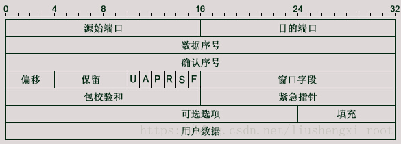
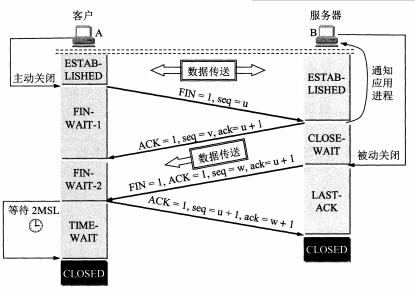

# 网络编程
- [socket编程](#1)

- [socket高级编程](#2)
 - [Linux关于阻塞和非阻塞](#2.1)
 - [阻塞模式和粘包问题](#2.2)

- [TCP/IP基础](#3)
 - [TCP/UDP头](#3.1)
 - [IP头](#3.2)
 - [TCP带外数据](#3.3)
 - [TCP数据包重组实现分析](#3.4)
 - [TCP三次握手](#3.5)

- [计算机网络](#4)
  - [各层作用及协议](#4.1)
  - [物理层](#4.2)
  - [数据链路层](#4.3)
  - [网络层](#4.4)
  - [运输层](#4.5)
  - [应用层](#4.6)  

- [Linux高级网络编程系列教程](#5)
 - [网络协议入门](#5.1)  
 - [套接字的介绍](#5.2)  
 - [广播、多播](#5.3)  
 - [TCP客户端、服务器](#5.4)  
 - [TCP通信过程中各步骤的状态](#5.5)  
 - [connect()、listen()和accept()三者之间的关系](#5.6)  
 - [I/O复用之select详解](#5.7) 
 - [I/O复用之poll函数](#5.8) 
 - [I/O复用函数之epoll](#5.9) 
 - [原始套接字](#5.10) 


## <a id="1">socket编程</a>


### 1.Socket 中的 read()、write() 函数
ssize_t read(int fd, void *buf, size_t count);  
ssize_t write(int fd, const void *buf, size_t count);  

#### read()
- read 函数是负责从 fd 中读取内容。
- 当读成功时，read 返回实际所读的字节数。
- 如果返回的值是 0 表示已经读到文件的结束了，小于 0 表示出现了错误。
- 如果错误为 EINTR 说明读是由中断引起的；如果是 ECONNREST 表示网络连接出了问题。

#### write()
- write 函数将 buf 中的 nbytes 字节内容写入文件描述符 fd。
- 成功时返回写的字节数。失败时返回 -1，并设置 errno 变量。
- 在网络程序中，当我们向套接字文件描述符写时有俩种可能。
 - （1）write 的返回值大于 0，表示写了部分或者是全部的数据。
 - （2）返回的值小于 0，此时出现了错误。
- 如果错误为 EINTR 表示在写的时候出现了中断错误；如果为 EPIPE 表示网络连接出现了问题（对方已经关闭了连接）。


### 2.UDP编程
客户端：创建fd，绑定server 得ip，sendto数据  
服务端：创建fd，bind绑定网卡ip，recvfrom数据  

绑定( bind )端口需要注意的问题  
需要注意的是，一个网络应用程序只能绑定一个端口( 一个套接字只能 绑定一个端口 )。如果客户端想绑定端口号，一定要调用发送信息函数之前绑定( bind )端口，因为在发送信息函数( sendto, 或 write )，系统会自动给当前网络程序分配一个随机端口号，这相当于随机绑定了一个端口号，这里只会分配一次，以后通信就以这个随机端口通信，我们再绑定端口号的话，就会绑定失败。如果我们放在发送信息函数( sendto, 或 write )之前绑定，那样程序将以我们绑定的端口号发送信息，不会再随机分配一个端口号。


## <a id="2">socket高级编程</a>
- [Linux关于阻塞和非阻塞](#2.1)
- [阻塞模式和粘包问题](#2.2)

### <a id="2.1">Linux关于阻塞和非阻塞</a>
参考链接：  
1.Linux关于阻塞和非阻塞    
https://blog.csdn.net/qq_42270373/article/details/89527454  

阻塞IO：socket 的阻塞模式意味着必须要做完IO 操作（包括错误）才会 返回。

非阻塞IO：非阻塞模式下无论操作是否完成都会立刻返回，需要通过其他方式来判断具体操作是否成功。(对于connect，accpet操作，通过select判断，对于recv，recvfrom，send，sendto通过返回值+错误码来判断)

IO模式设置：  
一般对于一个socket 是阻塞模式还是非阻塞模式有两种方式  
- 方法1：用fcntl 设置;用F_GETFL获取flags,用F_SETFL设置flags|O_NONBLOCK;；
- 方法:2：recv/send 时使用非阻塞的方式读取和发送消息，即把flags设置为MSG_DONTWAIT 实现(临时将sockfd或filefd设置为非阻塞)

#### 方法1
```cpp
fcntl 函数可以将一个socket 句柄设置成非阻塞模式:

flags = fcntl(sockfd, F_GETFL, 0); //获取文件的flags值。
fcntl(sockfd, F_SETFL, flags | O_NONBLOCK); //设置成非阻塞模式；
flags = fcntl(sockfd,F_GETFL,0);
fcntl(sockfd,F_SETFL,flags&~O_NUNBLOCK); //设置成阻塞模式；
设置之后每次的对于sockfd 的操作都是非阻塞的。
```

#### 方法2
```cpp
recv, send 函数的最后有一个flag 参数可以设置成MSG_DONTWAIT，临时将sockfd 设置为非阻塞模式,而无论原有是阻塞还是非阻塞：
recv(sockfd, buff, buff_size,MSG_DONTWAIT); //非阻塞模式的消息发送
send(scokfd, buff, buff_size, MSG_DONTWAIT); //非阻塞模式的消息接受
```

阻塞与非阻塞读的区别: //阻塞和非阻塞的区别在于没有数据到达的时候是否立刻返回．
非阻塞IO 和阻塞IO：在网络编程中对于一个网络句柄会遇到阻塞IO 和非阻塞IO 的概念, 这里对于这两种socket 先做一下说明：

    普通文件:
    对于文件的阻塞模式还是非阻塞模式::
    方法1、open时，使用O_NONBLOCK；
    方法2、fcntl设置，使用F_SETFL，flags|O_NONBLOCK；

    消息队列:
    对于消息队列消息的发送与接受
    非阻塞  msgsnd(sockfd,msgbuf,msgsize(不包含类型大小),IPC_NOWAIT)
    阻塞    msgrcv(scokfd,msgbuf,msgsize(**),msgtype,IPC_NOWAIT);     

#### 读
阻塞与非阻塞读的区别: //阻塞和非阻塞的区别在于没有数据到达的时候是否立刻返回．

读(read/recv/msgrcv):
读的本质来说其实不能是读,在实际中, 具体的接收数据不是由这些调用来进行,是由于系统底层自动完成的。read 也好,recv 也好只负责把数据从底层缓冲copy 到我们指定的位置。

在阻塞条件下：  
read/recv/msgrcv的行为，如果没有发现数据在网络缓冲中会一直等待，当发现有数据的时候会把数据读到用户指定的缓冲区，但是如果这个时候读到的数据量比较少，比参数中指定的长度要小，read 并不会一直等待下去，而是立刻返回。

read 的原则：是数据在不超过指定的长度的时候有多少读多少，没有数据就会一直等待。
所以一般情况下：我们读取数据都需要采用循环读的方式读取数据，因为一次read 完毕不能保证读到我们需要长度的数据，
read 完一次需要判断读到的数据长度再决定是否还需要再次读取。

非阻塞情况下：  
在非阻塞的情况下，read 的行为：
1、如果发现没有数据就直接返回
2、如果发现有数据那么也是采用有多少读多少的进行处理所以read 完一次需要判断读到的数据长度再决定是否还需要再次读取。

对于读而言，阻塞和非阻塞的区别在于没有数据到达的时候是否立刻返回．
recv 中有一个MSG_WAITALL 的参数

recv(sockfd, buff, buff_size, MSG_WAITALL),  

在正常情况下recv 是会等待直到读取到buff_size 长度的数据，但是这里的WAITALL 也只是尽量读全，在有中断的情况下recv 还是可能会被打断，造成没有读完指定的buff_size的长度。所以即使是采用recv + WAITALL 参数还是要考虑是否需要循环读取的问题，在实验中对于多数情况下recv (使用了MSG_WAITALL)还是可以读完buff_size，所以相应的性能会比直接read 进行循环读要好一些。

>注意：   
使用MSG_WAITALL时，sockfd必须处于阻塞模式下，否则不起作用。  
所以MSG_WAITALL不能和MSG_NONBLOCK同时使用。  
要注意的是使用MSG_WAITALL的时候，sockfd 必须是处于阻塞模式下，否则WAITALL不能起作用。  

#### 写
阻塞写与非阻塞写的区别  
写(send/write/msgsnd)：写的本质也不是进行发送操作,而是把用户态的数据copy 到系统底层去,然后再由系统进行发送作send，write返回成功，只表示数据已经copy 到底层缓冲,而不表示数据已经发出,更不能表示对方端口已经接收到数据，对于write(或者send)而言，阻塞情况下，write会将数据发送完。(不过可能被中断)  在阻塞的情况下，是会一直等待，直到write 完全部的数据再返回，这点行为上与读操作有所不同，原因是：  

读，究其原因主要是读数据的时候我们并不知道对端到底有没有数据，数据是在什么时候结束发送的，如果一直等待就可能会造成死循环，所以并没有去进行这方面的处理；

写，而对于write, 由于需要写的长度是已知的，所以可以一直再写，直到写完．不过问题是write 是可能被打断吗，造成write 一次只write 一部分数据, 所以write 的过程还是需要考虑循环write, 只不过多数情况下一次write 调用就可能成功.

非阻塞写的情况下  
非阻塞写的情况下，是采用可以写多少就写多少的策略．与读不一样的地方在于，有多少读多少是由网络发送的那一端是否有数据传输到为标准，但是对于可以写多少是由本地的网络堵塞情况为标准的，在网络阻塞严重的时候，网络层没有足够的内存来进行写操作，这时候就会出现写不成功的情况，阻塞情况下会尽可能(有可能被中断)等待到数据全部发送完毕， 对于非阻塞的情况就是一次写多少算多少,没有中断的情况下也还是会出现write 到一部分的情况.  

### <a id="2.2">阻塞模式和粘包问题</a>
参考链接：  
1.TCP套接字--阻塞模式和粘包问题  
https://www.cnblogs.com/straybirds/p/9472157.html  

阻塞模式  
对于TCP套接字（默认情况下），当使用 write()/send() 发送数据时：
- 1) 首先会检查缓冲区，如果缓冲区的可用空间长度小于要发送的数据，那么 write()/send() 会被阻塞（暂停执行），
直到缓冲区中的数据被发送到目标机器，腾出足够的空间，才唤醒 write()/send() 函数继续写入数据。
- 2) 如果TCP协议正在向网络发送数据，那么输出缓冲区会被锁定，不允许写入，write()/send() 也会被阻塞，
直到数据发送完毕缓冲区解锁，write()/send() 才会被唤醒。
- 3) 如果要写入的数据大于缓冲区的最大长度，那么将分批写入。
- 4) 直到所有数据被写入缓冲区 write()/send() 才能返回。

当使用 read()/recv() 读取数据时：
- 1) 首先会检查缓冲区，如果缓冲区中有数据，那么就读取，否则函数会被阻塞，直到网络上有数据到来。
- 2) 如果要读取的数据长度小于缓冲区中的数据长度，那么就不能一次性将缓冲区中的所有数据读出，
剩余数据将不断积压，直到有 read()/recv() 函数再次读取。
- 3) 直到读取到数据后 read()/recv() 函数才会返回，否则就一直被阻塞。
这就是TCP套接字的阻塞模式。所谓阻塞，就是上一步动作没有完成，下一步动作将暂停，直到上一步动作完成后才能继续，以保持同步性。

TCP套接字默认情况下是阻塞模式，也是最常用的。当然你也可以更改为非阻塞模式。

#### TCP粘包问题和数据无界性
上面讲到了socket缓冲区和数据的传递过程，可以看到数据的接收和发送是无关的，read()/recv() 函数不管数据发送了多少次，
都会尽可能多的接收数据。也就是说，read()/recv() 和 write()/send() 的执行次数可能不同。

例如，write()/send() 重复执行三次，每次都发送字符串"abc"，那么目标机器上的 read()/recv() 可能分三次接收，
每次都接收"abc"；也可能分两次接收，第一次接收"abcab"，第二次接收"cabc"；也可能一次就接收到字符串"abcabcabc"。

假设我们希望客户端每次发送一位学生的学号，让服务器端返回该学生的姓名、住址、成绩等信息，这时候可能就会出现问题，服务器端不能区分学生的学号。
例如第一次发送 1，第二次发送 3，服务器可能当成 13 来处理，返回的信息显然是错误的。

这就是数据的“粘包”问题，客户端发送的多个数据包被当做一个数据包接收。
也称数据的无边界性，read()/recv() 函数不知道数据包的开始或结束标志（实际上也没有任何开始或结束标志），
只把它们当做连续的数据流来处理。

## <a id="3">TCP/IP基础</a>
 - [TCP/UDP头](#3.1)
 - [IP头](#3.2)
 - [TCP带外数据](#3.3)
 - [TCP数据包重组实现分析](#3.4)

### <a id="3.1">TCP/UDP头</a>
#### TCP  
- TCP（Transmission Control Protocol，传输控制协议）是一种面向连接的、可靠的、基于字节流的传输层通信协议，其传输的单位是报文段。

特征：
- 面向连接
- 只能点对点（一对一）通信
- 可靠交互
- 全双工通信
- 面向字节流

TCP 如何保证可靠传输：
- 确认和超时重传
- 数据合理分片和排序
- 流量控制
- 拥塞控制
- 数据校验

TCP 报文结构


TCP 首部


TCP：状态控制码（Code，Control Flag），占 6 比特，含义如下：
- URG：紧急比特（urgent），当 URG＝1 时，表明紧急指针字段有效，代表该封包为紧急封包。它告诉系统此报文段中有紧急数据，应尽快传送(相当于高优先级的数据)， 且上图中的 Urgent Pointer 字段也会被启用。
- ACK：确认比特（Acknowledge）。只有当 ACK＝1 时确认号字段才有效，代表这个封包为确认封包。当 ACK＝0 时，确认号无效。
- PSH：（Push function）若为 1 时，代表要求对方立即传送缓冲区内的其他对应封包，而无需等缓冲满了才送。
- RST：复位比特(Reset)，当 RST＝1 时，表明 TCP 连接中出现严重差错（如由于主机崩溃或其他原因），必须释放连接，然后再重新建立运输连接。
- SYN：同步比特(Synchronous)，SYN 置为 1，就表示这是一个连接请求或连接接受报文，通常带有 SYN 标志的封包表示『主动』要连接到对方的意思。
- FIN：终止比特(Final)，用来释放一个连接。当 FIN＝1 时，表明此报文段的发送端的数据已发送完毕，并要求释放运输连接。

#### UDP
- UDP（User Datagram Protocol，用户数据报协议）是 OSI（Open System Interconnection 开放式系统互联） 参考模型中一种无连接的传输层协议，提供面向事务的简单不可靠信息传送服务，其传输的单位是用户数据报。

特征：
- 无连接
- 尽最大努力交付
- 面向报文
- 没有拥塞控制
- 支持一对一、一对多、多对一、多对多的交互通信
- 首部开销小


#### TCP 与 UDP 的区别
- 1.TCP 面向连接，UDP 是无连接的；
- 2.TCP 提供可靠的服务，也就是说，通过 TCP 连接传送的数据，无差错，不丢失，不重复，且按序到达；UDP 尽最大努力交付，即不保证可靠交付
- 3.TCP 的逻辑通信信道是全双工的可靠信道；UDP 则是不可靠信道
- 4.每一条 TCP 连接只能是点到点的；UDP 支持一对一，一对多，多对一和多对多的交互通信
- 5.TCP 面向字节流（可能出现黏包问题），实际上是 TCP 把数据看成一连串无结构的字节流；UDP 是面向报文的（不会出现黏包问题）
- 6.UDP 没有拥塞控制，因此网络出现拥塞不会使源主机的发送速率降低（对实时应用很有用，如 IP 电话，实时视频会议等）
- 7.TCP 首部开销20字节；UDP 的首部开销小，只有 8 个字节

### <a id="3.2">IP头</a>
IP 数据报格式：   


### <a id="3.3">TCP带外数据</a>
参考链接：  
1.TCP 带外数据（即紧急模式的发送和接受）  
https://blog.csdn.net/liushengxi_root/article/details/82563181  

首先，我们需要知道的是数据分为两种，一种是带内数据，一种是带外数据。带内数据就是我们平常传输或者说是口头叫的数据。带外数据就是我们接下来讲的内容。

许多的传输层都具有带外数据（也称为 经加速数据 ）的概念，想法就是连接的某段发生了重要的事情，希望迅速的通知给对端。这里的迅速是指这种通知应该在已经排队了的带内数据之前发送。也就是说，带外数据拥有更高的优先级。带外数据不要求再启动一个连接进行传输，而是使用已有的连接进行传输。 其中，UDP没有实现带外数据（是个极端哦～）



针对标题，我们自然只关心以下两个部分：  
紧急字段URG：告诉系统此报文段中有紧急数据，应尽快传送。当URG=1时。
紧急指针：指出在本报文段中的紧急数据的最后一个字节的序号，即指出带外数据字节在正常字节流中的位置。

所以当TCP发送带外数据时，他的TCP首部一定是设置了URG标志和紧急指针的 。而紧急指针就是用来指出带外数据字节在正常字节流中的位置的 。

#### 发送端
- 1.紧急数据是插在正常数据流中进行传输的 。

- 2.一个紧急指针只指向一个字节的带外数据的后一个字节位置。比如我们要发送数据1，2，3，4，5，6 ，7，8，如果我们只发送一个字节的带外数据X，那么发送缓冲区就是（1，2，3，4，5，6，7，8，X），紧急指针置为10，X是带外数据字节 。如果我们发送多个字节的带外数据（X，Y，Z），那么发送缓冲区就是（1，2，3，4，5，6，7，8，X，Y，Z），紧急指针指向Z的后面，为12 ，Z 被当作带外数据字节。

- 3.假如由于发送窗口的关系，导致该发送缓冲区中的数据（1，2，3，4，5，6，7，8，X）分为多次或者两次发送。比如：发送窗口是6，那么就分为两个包发送，情况如下：第一个包紧急指针为10，传送六个字节（1,2,3,4,5,6），接收端记下接受的字节数并且发现紧急指针指向的紧急数据没有到达，所以继续等待下一个包，下一个包（紧急指针还是10）发过来 7,8,X ，接收端发现紧急指针指向的紧急数据在这个包里，所以将紧急数据进行处理即可。

- 4.带外字节会被标记为OOB

- 5.即使发送端TCP因流量控制而暂停发送数据（接受缓冲区的套接字接受缓冲区已满，导致其TCP向发送端通告了一个值为0 的窗口），紧急通知照样不伴随任何数据的发送。也就是说：即使数据的流动会因为TCP的流量控制而停止，紧急通知却总是无障碍的发送到对端TCP。

#### 接受端
一旦有一个新的紧急指针到达，不论由紧急指针指向的实际数据字节是否已经到达接受端，以下两个动作都会发生 ：
- 1.当接受到一个设置了URG标志的分节时，接受端检查紧急指针，确定它是否指向新的带外数据，比如：前面发送了两个包，只有第一个才会通知接受进程有新的带外数据到达。

- 2.当有新的紧急指针到达时，接受进程被通知到。首先，内核会给接受套接字的属主进程发送SIGURG信号，前提是接受进程调用了 fcntl或者ioctl为这个套接字建立了属主，并且该属主进程为该信号建立了信号处理函数 。

- 3.只有一个OOB标记，如果新的OOB字节在旧的OOB字节之前到达，旧的OOB字节就会被丢弃。

- 4.当由紧急指针指向的实际数据字节到达接受端TCP时，数据字节会有两个存储地区：一个是和普通数据一样的在线留存，另外一个是独立的单字节带外缓冲区，接受进程从这个单字节带外缓冲区读入数据的唯一方法是指定MSG_OOB调用recv，recvfrom，recvmsg。如果放在和普通数据一起的带内区域，接受进程就得通过检查该连接的带外标记OOB来获悉何时访问带这个数据字节。两个区域的使用通过套接字选项SO_OOBLINE来使用，默认情况下将带外数据字节放入独立的单字节带外缓冲区内。

#### 会发生的一些错误
- 1.如果接受进程请求读入数据（通过MSG_OOB标志），但是对端并没有发送任何带外数据，读入操作将返回EINVAL。

- 2.在接受进程已被告知对端发送了一个带外字节（SIGURG和select）的前提下，如果接受进程试图读入该字节，但是该字节尚未到达，读入操作返回EWOULDBLOCK。接受进程此时做的就是从缓冲区中读入数据，腾出空间，以允许对端TCP发送出那个带外字节。

- 3.如果接受进程试图多次读入同一个带外字节，读入操作返回EINVAL。

- 4.如果开启了SO_OOBINLINE套接字选项，接受进程如果还是通过MSG_OOB读入带外数据，读入操作将返回EINVAL 。

#### 为何不直接将一个字节的紧急数据放在紧急指针哪里呢？
   因为TCP数据包在ip层可能被拆包，成为多个数据段。一个包含紧急数据的数据包被拆成两个数据包，那么这两个包有的tcp头部有相同的紧急指针（和UGR）。如果将紧急数据直接放在紧急指针的内存处，那么将多出一个紧急数据！所以，不该将紧急数据放在TCP头部。

#### 总结
带外数据概念实际上时向接收端传送三个不同的信息：
- （1）发送端进入紧急模式这个事实。接收进程得以通知这个事实的手段不外乎SIGURG信号或select调用。本通知在发送进程发送带外字节后由发送端TCP立即发送，即使往接收端的任何数据发送因流量控制而停止了，TCP仍然发送本通知。本通知可能导致接收端进入某种特殊处理模式，以处理接收的任何后继数据。
- （2）带外字节的位置，也就是它相对于来自发送端的其余数据的发送位置：带外标记。
- （3）带外字节的实际值。既然TCP是一个不解释应用进程所发送数据的字节流协议，带外字节就可以是任何8位值。

对于TCP的紧急模式，我们可以认为URG标志时通知（信息1），紧急指针是带外标记（信息2），数据字节是其本身（信息3）。
与这个带外数据概念相关的问题有：
- 每个连接只有一个TCP紧急指针；
- 每个连接只有一个带外标记；
- 每个连接只有一个单字节的带外缓冲区（该缓冲区只有在数据非在线读入时才需考虑）。如果带外数据时在线读入的，那么当心的带外数据到达时，先前的带外字节字节并未丢失，不过他们的标记却因此被新的标记取代而丢失了。

   带外数据的一个常见的用途体现在rlogin程序中。当客户中断运行在服务器主机上的程序时，服务器需要告知客户丢弃所有已在服务器排队的输出，因为已经排队等着从服务器发送到客户的输出最多有一个窗口的大小。服务器向客户发送一个特殊字节，告知后者清刷所有这些输出（在客户看来是输入），这个特殊字节就作为带外数据发送。客户收到由带外数据引发的SIGURG信号后，就从套接字中读入直到碰到带外数据发送。客户收到由带外数据引发的SIGURG信号后，就从套接字中读入直到碰到带外标记，并丢弃到标记之前的所有数据。这种情形下即使服务器相继地快速发送多个带外字节，客户也不受影响，因为客户只是读到最后一个标记为止，并丢弃所有读入的数据。

   总之，带外数据是否有用取决于应用程序使用它的目的。如果目的是告知对端丢弃直到标记处得普通数据，那么丢失一个中间带外字节及其相应的标记不会有什么不良后果。但是如果不丢失带外字节本身很重要，那么必须在线收到这些数据。另外，作为带外数据发送的数据字节应该区别于普通数据，因为当前新的标记到达时，中间的标记将被覆写，从而事实上把带外字节混杂在普通数据之中。举例来说，telnet在客户和服务器之间普通的数据流中发送telnet自己的命令，手段是把值为255的一个字节作为telnet命令的前缀字节。（值为255的单个字节作为数据发送需要2个相继地值为255的字节。）这么做使得telnet能够区分其命令和普通用户数据，不过要求客户进程和服务器进程处理每个数据字节以寻找命令。

### <a id="3.4">TCP数据包重组实现分析</a>
参考链接：  
1.TCP数据包重组实现分析  
https://blog.csdn.net/wfqxx/article/details/4246634?utm_medium=distribute.pc_relevant.none-task-blog-BlogCommendFromMachineLearnPai2-1.nonecase&depth_1-utm_source=distribute.pc_relevant.none-task-blog-BlogCommendFromMachineLearnPai2-1.nonecase  

参照TCP/IP详解第二卷24~29章，详细论述了TCP协议的实现，大概总结一下TCP如何向应用层保证数据包的正确性、可靠性，即TCP如何实现对数据报文的重组。

首先要设计两个报文队列，一个存放正常来到的报文，一个存放失序到来的报文。

比如正常报文队列最后一个报文数据如下：

报文数据段第一字节的序号 | 数据报长度  
-|-
seq1=100 | len1=100 |

下一个来到的报文可能有多种情况，现依次分析如下：  
1）正常报文

序号 | 数据报长度  
-|-
seq2=200 | len2=200 |

seq2 = seq1+len1  
由此报文的seq可知，这个报文携带数据序号200~399，正是上一个报文的预期后续报文，将此报文追加到正常报文队列。  

2）完全重复报文

序号 | 数据报长度  
-|-
seq2=100 | len2=100 |

seq2 ==seq1 而且len2==len1  
这个报文携带数据序号100到199，与上一个报文携带的数据序号100到199完全一样，即完全重复，所以应该丢弃这个报文。  

3）重复子报文

序号 | 数据报长度  
-|-
seq2=100 | len2=50 |

seq2 ==seq1 而且len2<len1  
这个报文携带数据序号100~149，说明这是上一个报文的一部分，所以应该丢弃这个报文。  
注：第二、三这两种情况可以合并，即seq2 ==seq1 而且len2<=len1，这里分别列出只是为了说明各种不同情况。

4）部分重复报文情况一

序号 | 数据报长度  
-|-
seq2=150 | len2=30 |

seq2>seq1而且seq2<seq1+len1而且seq2+len2<=seq1+len1  
即这个报文携带序号150到179，这个序号段被包含在上一个报文段中（100到199），所以应该丢弃这个报文。  

5）部分重复报文情况二

序号 | 数据报长度  
-|-
seq2=150 | len2=100 |

seq2>seq1而且seq2<seq1+len1而且seq2+len2>seq1+len1
即这个报文携带序号150~249，这个序号段前一部分150到199被包含在上一个报文段（100到199）中，后一部分200到249是新的数据，此时应该对这个报文作如下处理：

A. 计算重复字节数  
 (seq1+len1) - Seq2= 100+100-150 = 50  
即这个报文段前50个字节是重复的。  

B. 截取报文段新数据  
丢弃这个报文段的前50字节，截取后面的新数据，即只保留字节序号段200~249。  

C.重新设置这个报文段的seq  
seq2 = seq2+50 = 150+50 = 200  

D. 重新设置这个报文段的数据长度   
len2 = len2-50 =100-50=50  

E.重新设置后报文段如下  

序号 | 数据报长度  
-|-
seq2=200 | len2=50 |

即现在这个报文段携带数据序号200~249，正好是上一个报文的后续报文，现在可以将其作为正常报文追加到正常报文队列。  

6）提前到达的报文

序号 | 数据报长度  
-|-
seq2=300 | len2=100 |

seq2>seq1+len1  
这个报文段携带序号300到399的数据，即不是上一个报文100到199的后续报文，而是提前到来的报文，此时应该将这个报文放置到失序报文队列存储起来，以备后续重组使用。  

>这样直到tcp断开这个socket的链接（FIN=1），此时将正常报文队列和失序报文队列中的数据合并起来，完成重组。取出正常报文队列最后一个报文 的seq和len，在失序报文队列中查找属于它的后续报文，该报文是否可以作为正常报文队列的后续报文处理过程同前面1）~5）的分析。

### <a id="3.5">TCP三次握手</a>
三次握手状态转换：    


## <a id="4">计算机网络</a>
- [各层作用及协议](#4.1)
- [物理层](#4.2)
- [数据链路层](#4.3)
- [网络层](#4.4)
- [运输层](#4.5)
- [应用层](#4.6)  


### <a id="4.1">各层作用及协议</a>

| 分层     | 作用                                              | 协议                                              | title 4 |
| ---------- | --------------------------------------------------- | --------------------------------------------------- | ------- |
| 物理层  | 通过媒介传输比特，确定机械及电气规范（比特 Bit） | RJ45、CLOCK、IEEE802.3（中继器，集线器） |         |
| 数据链路层 | 将比特组装成帧和点到点的传递（帧 Frame） | PPP、FR、HDLC、VLAN、MAC（网桥，交换机） |         |
| 网络层  | 负责数据包从源到宿的传递和网际互连（包 Packet） | IP、ICMP、ARP、RARP、OSPF、IPX、RIP、IGRP（路由器） |         |
| 运输层  | 提供端到端的可靠报文传递和错误恢复（ 段Segment） | TCP、UDP、SPX                                     |         |
| 会话层  | 建立、管理和终止会话（会话协议数据单元 SPDU） | NFS、SQL、NETBIOS、RPC                           |         |
| 表示层  | 对数据进行翻译、加密和压缩（表示协议数据单元 PPDU） | JPEG、MPEG、ASII                                  |         |
| 应用层  | 允许访问OSI环境的手段（应用协议数据单元 APDU） | FTP、DNS、Telnet、SMTP、HTTP、WWW、NFS        |         |


- 传输数据的单位：比特
- 数据传输系统：源系统（源点、发送器） --> 传输系统 --> 目的系统（接收器、终点）

通道：   
- 单向通道（单工通道）：只有一个方向通信，没有反方向交互，如广播
- 双向交替通信（半双工通信）：通信双方都可发消息，但不能同时发送或接收
- 双向同时通信（全双工通信）：通信双方可以同时发送和接收信息

通道复用技术：
- 频分复用（FDM，Frequency Division Multiplexing）：不同用户在不同频带，所用用户在同样时间占用不同带宽资源
- 时分复用（TDM，Time Division Multiplexing）：不同用户在同一时间段的不同时间片，所有用户在不同时间占用同样的频带宽度
- 波分复用（WDM，Wavelength Division Multiplexing）：光的频分复用
- 码分复用（CDM，Code Division Multiplexing）：不同用户使用不同的码，可以在同样时间使用同样频带通信

### <a id="4.3">据链路层</a>
### 
主要信道：
- 点对点信道
- 广播信道

点对点信道
- 数据单元：帧

三个基本问题：
- 封装成帧：把网络层的 IP 数据报封装成帧，SOH - 数据部分 - EOT
- 透明传输：不管数据部分什么字符，都能传输出去；可以通过字节填充方法解决（冲突字符前加转义字符）
- 差错检测：降低误码率（BER，Bit Error Rate），广泛使用循环冗余检测（CRC，Cyclic Redundancy Check）

点对点协议（Point-to-Point Protocol）：
- 点对点协议（Point-to-Point Protocol）：用户计算机和 ISP 通信时所使用的协议

广播通信：
- 硬件地址（物理地址、MAC 地址）
- 单播（unicast）帧（一对一）：收到的帧的 MAC 地址与本站的硬件地址相同
- 广播（broadcast）帧（一对全体）：发送给本局域网上所有站点的帧
- 多播（multicast）帧（一对多）：发送给本局域网上一部分站点的帧

### <a id="4.4">网络层</a>
- IP（Internet Protocol，网际协议）是为计算机网络相互连接进行通信而设计的协议。
- ARP（Address Resolution Protocol，地址解析协议）
- ICMP（Internet Control Message Protocol，网际控制报文协议）
- IGMP（Internet Group Management Protocol，网际组管理协议）

IP 地址分类：
- IP 地址 ::= {<网络号>,<主机号>}

| IP 地址类别 | 网络号                              | 网络范围           | 主机号 | IP 地址范围              |
| ----------- | -------------------------------------- | ---------------------- | ------ | ---------------------------- |
| A 类       | 8bit，第一位固定为 0            | 0 —— 127           | 24bit  | 1.0.0.0 —— 127.255.255.255 |
| B 类       | 16bit，前两位固定为 10          | 128.0 —— 191.255   | 16bit  | 128.0.0.0 —— 191.255.255.255 |
| C 类       | 24bit，前三位固定为 110         | 192.0.0 —— 223.255.255 | 8bit   | 192.0.0.0 —— 223.255.255.255 |
| D 类       | 前四位固定为 1110，后面为多播地址 |                        |        |                              |
| E 类       | 前五位固定为 11110，后面保留为今后所用 |                        |        |                              |
|             |                                        |                        |        |                              |

ICMP 网际控制报文协议  
应用：   
- PING（Packet InterNet Groper，分组网间探测）测试两个主机之间的连通性
- oTTL（Time To Live，生存时间）该字段指定 IP 包被路由器丢弃之前允许通过的最大网段数量

内部网关协议
- RIP（Routing Information Protocol，路由信息协议）
- OSPF（Open Sortest Path First，开放最短路径优先）

外部网关协议
- BGP（Border Gateway Protocol，边界网关协议）

IP多播
- IGMP（Internet Group Management Protocol，网际组管理协议）
- 多播路由选择协议

VPN 和 NAT
- VPN（Virtual Private Network，虚拟专用网）
- NAT（Network Address Translation，网络地址转换）

路由表包含什么？   
- 1.网络 ID（Network ID, Network number）：就是目标地址的网络 ID。
- 2.子网掩码（subnet mask）：用来判断 IP 所属网络
- 3.下一跳地址/接口（Next hop / interface）：就是数据在发送到目标地址的旅途中下一站的地址。其中 interface 指向 next hop（即为下一个 route）。一个自治系统（AS, Autonomous system）中的 route 应该包含区域内所有的子网络，而默认网关（Network id: 0.0.0.0, Netmask: 0.0.0.0）指向自治系统的出口。

根据应用和执行的不同，路由表可能含有如下附加信息：   
- 1.花费（Cost）：就是数据发送过程中通过路径所需要的花费。
- 2.路由的服务质量
- 3.路由中需要过滤的出/入连接列表

### <a id="4.5">运输层</a>
协议：  
- TCP（Transmission Control Protocol，传输控制协议）
- UDP（User Datagram Protocol，用户数据报协议）

端口：   

| 应用程序 | FTP | TELNET | SMTP | DNS | TFTP | HTTP | HTTPS | SNMP |
| -------- | --- | ------ | ---- | --- | ---- | ---- | ----- | ---- |
| 端口号 | 21  | 23     | 25   | 53  | 69   | 80   | 443   | 161  |

#### 1.TCP  
- TCP（Transmission Control Protocol，传输控制协议）是一种面向连接的、可靠的、基于字节流的传输层通信协议，其传输的单位是报文段。

特征：
- 面向连接
- 只能点对点（一对一）通信
- 可靠交互
- 全双工通信
- 面向字节流

TCP 如何保证可靠传输：
- 确认和超时重传
- 数据合理分片和排序
- 流量控制
- 拥塞控制
- 数据校验

TCP 报文结构


TCP 首部


TCP：状态控制码（Code，Control Flag），占 6 比特，含义如下：
- URG：紧急比特（urgent），当 URG＝1 时，表明紧急指针字段有效，代表该封包为紧急封包。它告诉系统此报文段中有紧急数据，应尽快传送(相当于高优先级的数据)， 且上图中的 Urgent Pointer 字段也会被启用。
- ACK：确认比特（Acknowledge）。只有当 ACK＝1 时确认号字段才有效，代表这个封包为确认封包。当 ACK＝0 时，确认号无效。
- PSH：（Push function）若为 1 时，代表要求对方立即传送缓冲区内的其他对应封包，而无需等缓冲满了才送。
- RST：复位比特(Reset)，当 RST＝1 时，表明 TCP 连接中出现严重差错（如由于主机崩溃或其他原因），必须释放连接，然后再重新建立运输连接。
- SYN：同步比特(Synchronous)，SYN 置为 1，就表示这是一个连接请求或连接接受报文，通常带有 SYN 标志的封包表示『主动』要连接到对方的意思。
- FIN：终止比特(Final)，用来释放一个连接。当 FIN＝1 时，表明此报文段的发送端的数据已发送完毕，并要求释放运输连接。

#### 2.UDP
- UDP（User Datagram Protocol，用户数据报协议）是 OSI（Open System Interconnection 开放式系统互联） 参考模型中一种无连接的传输层协议，提供面向事务的简单不可靠信息传送服务，其传输的单位是用户数据报。

特征：
- 无连接
- 尽最大努力交付
- 面向报文
- 没有拥塞控制
- 支持一对一、一对多、多对一、多对多的交互通信
- 首部开销小


#### 3.TCP 与 UDP 的区别
- 1.TCP 面向连接，UDP 是无连接的；
- 2.TCP 提供可靠的服务，也就是说，通过 TCP 连接传送的数据，无差错，不丢失，不重复，且按序到达；UDP 尽最大努力交付，即不保证可靠交付
- 3.TCP 的逻辑通信信道是全双工的可靠信道；UDP 则是不可靠信道
- 4.每一条 TCP 连接只能是点到点的；UDP 支持一对一，一对多，多对一和多对多的交互通信
- 5.TCP 面向字节流（可能出现黏包问题），实际上是 TCP 把数据看成一连串无结构的字节流；UDP 是面向报文的（不会出现黏包问题）
- 6.UDP 没有拥塞控制，因此网络出现拥塞不会使源主机的发送速率降低（对实时应用很有用，如 IP 电话，实时视频会议等）
- 7.TCP 首部开销20字节；UDP 的首部开销小，只有 8 个字节

#### 4.TCP 黏包问题
原因   
TCP 是一个基于字节流的传输服务（UDP 基于报文的），“流” 意味着 TCP 所传输的数据是没有边界的。所以可能会出现两个数据包黏在一起的情况。

解决   
- 发送定长包。如果每个消息的大小都是一样的，那么在接收对等方只要累计接收数据，直到数据等于一个定长的数值就将它作为一个消息。
- 包头加上包体长度。包头是定长的 4 个字节，说明了包体的长度。接收对等方先接收包头长度，依据包头长度来接收包体。
- 在数据包之间设置边界，如添加特殊符号 \r\n 标记。FTP 协议正是这么做的。但问题在于如果数据正文中也含有 \r\n，则会误判为消息的边界。
- 使用更加复杂的应用层协议。

#### 5.TCP 流量控制
概念  
流量控制（flow control）就是让发送方的发送速率不要太快，要让接收方来得及接收。

利用可变窗口进行流量控制   


#### 6.TCP 拥塞控制
概念   
拥塞控制就是防止过多的数据注入到网络中，这样可以使网络中的路由器或链路不致过载。

方法   
- 慢开始( slow-start )
- 拥塞避免( congestion avoidance )
- 快重传( fast retransmit )
- 快恢复( fast recovery )


#### 7.TCP 传输连接管理
因为 TCP 三次握手建立连接、四次挥手释放连接很重要，所以附上《计算机网络（第 7 版）-谢希仁》书中对此章的详细描述：https://raw.githubusercontent.com/huihut/interview/master/images/TCP-transport-connection-management.png

TCP 三次握手建立连接  


【TCP 建立连接全过程解释】  
- 1.客户端发送 SYN 给服务器，说明客户端请求建立连接；
- 2.服务端收到客户端发的 SYN，并回复 SYN+ACK 给客户端（同意建立连接）；
- 3.客户端收到服务端的 SYN+ACK 后，回复 ACK 给服务端（表示客户端收到了服务端发的同意报文）；
- 4.服务端收到客户端的 ACK，连接已建立，可以数据传输。

TCP 为什么要进行三次握手？    
- 【答案一】因为信道不可靠，而 TCP 想在不可靠信道上建立可靠地传输，那么三次通信是理论上的最小值。（而 UDP 则不需建立可靠传输，因此 UDP 不需要三次握手。）
- 【答案二】因为双方都需要确认对方收到了自己发送的序列号，确认过程最少要进行三次通信。
- 【答案三】为了防止已失效的连接请求报文段突然又传送到了服务端，因而产生错误。

TCP 四次挥手释放连接   


【TCP 释放连接全过程解释】     
- 1.客户端发送 FIN 给服务器，说明客户端不必发送数据给服务器了（请求释放从客户端到服务器的连接）；
- 2.服务器接收到客户端发的 FIN，并回复 ACK 给客户端（同意释放从客户端到服务器的连接）；
- 3.客户端收到服务端回复的 ACK，此时从客户端到服务器的连接已释放（但服务端到客户端的连接还未释放，并且客户端还可以接收数据）；
- 4.服务端继续发送之前没发完的数据给客户端；
- 5.服务端发送 FIN+ACK 给客户端，说明服务端发送完了数据（请求释放从服务端到客户端的连接，就算没收到客户端的回复，过段时间也会自动释放）；
- 6.客户端收到服务端的 FIN+ACK，并回复 ACK 给客户端（同意释放从服务端到客户端的连接）；
- 7.服务端收到客户端的 ACK 后，释放从服务端到客户端的连接。

TCP 为什么要进行四次挥手？   

【问题一】TCP 为什么要进行四次挥手？ / 为什么 TCP 建立连接需要三次，而释放连接则需要四次？
- 【答案一】因为 TCP 是全双工模式，客户端请求关闭连接后，客户端向服务端的连接关闭（一二次挥手），服务端继续传输之前没传完的数据给客户端（数据传输），服务端向客户端的连接关闭（三四次挥手）。所以 TCP 释放连接时服务器的 ACK 和 FIN 是分开发送的（中间隔着数据传输），而 TCP 建立连接时服务器的 ACK 和 SYN 是一起发送的（第二次握手），所以 TCP 建立连接需要三次，而释放连接则需要四次。

【问题二】为什么 TCP 连接时可以 ACK 和 SYN 一起发送，而释放时则 ACK 和 FIN 分开发送呢？（ACK 和 FIN 分开是指第二次和第三次挥手）
- 【答案二】因为客户端请求释放时，服务器可能还有数据需要传输给客户端，因此服务端要先响应客户端 FIN 请求（服务端发送 ACK），然后数据传输，传输完成后，服务端再提出 FIN 请求（服务端发送 FIN）；而连接时则没有中间的数据传输，因此连接时可以 ACK 和 SYN 一起发送。

【问题三】为什么客户端释放最后需要 TIME-WAIT 等待 2MSL 呢？
- 【答案三】
 - 1.为了保证客户端发送的最后一个 ACK 报文能够到达服务端。若未成功到达，则服务端超时重传 FIN+ACK 报文段，客户端再重传 ACK，并重新计时。
 - 2.防止已失效的连接请求报文段出现在本连接中。TIME-WAIT 持续 2MSL 可使本连接持续的时间内所产生的所有报文段都从网络中消失，这样可使下次连接中不会出现旧的连接报文段。

TCP 有限状态机



### <a id="4.6">应用层</a>

#### DNS
DNS（Domain Name System，域名系统）是互联网的一项服务。它作为将域名和 IP 地址相互映射的一个分布式数据库，能够使人更方便地访问互联网。DNS 使用 TCP 和 UDP 端口 53。当前，对于每一级域名长度的限制是 63 个字符，域名总长度则不能超过 253 个字符。
域名：

域名 ::= {<三级域名>.<二级域名>.<顶级域名>}，如：blog.huihut.com

#### FTP
FTP（File Transfer Protocol，文件传输协议）是用于在网络上进行文件传输的一套标准协议，使用客户/服务器模式，使用 TCP 数据报，提供交互式访问，双向传输。

TFTP（Trivial File Transfer Protocol，简单文件传输协议）一个小且易实现的文件传输协议，也使用客户-服务器方式，使用UDP数据报，只支持文件传输而不支持交互，没有列目录，不能对用户进行身份鉴定

#### TELNET
TELNET 协议是 TCP/IP 协议族中的一员，是 Internet 远程登陆服务的标准协议和主要方式。它为用户提供了在本地计算机上完成远程主机工作的能力。

HTTP（HyperText Transfer Protocol，超文本传输协议）是用于从 WWW（World Wide Web，万维网）服务器传输超文本到本地浏览器的传送协议。

SMTP（Simple Mail Transfer Protocol，简单邮件传输协议）是一组用于由源地址到目的地址传送邮件的规则，由它来控制信件的中转方式。SMTP 协议属于 TCP/IP 协议簇，它帮助每台计算机在发送或中转信件时找到下一个目的地。

Socket 建立网络通信连接至少要一对端口号（Socket）。Socket 本质是编程接口（API），对 TCP/IP 的封装，TCP/IP 也要提供可供程序员做网络开发所用的接口，这就是 Socket 编程接口。

#### WWW
WWW（World Wide Web，环球信息网，万维网）是一个由许多互相链接的超文本组成的系统，通过互联网访问

URL  
URL（Uniform Resource Locator，统一资源定位符）是因特网上标准的资源的地址（Address）  

标准格式：  
协议类型:[//服务器地址[:端口号]][/资源层级UNIX文件路径]文件名[?查询][#片段ID]   

完整格式：   
协议类型:[//[访问资源需要的凭证信息@]服务器地址[:端口号]][/资源层级UNIX文件路径]文件名[?查询][#片段ID]  

其中【访问凭证信息@；:端口号；?查询；#片段ID】都属于选填项   
如：https://github.com/huihut/interview#cc  

#### HTTP
HTTP（HyperText Transfer Protocol，超文本传输协议）是一种用于分布式、协作式和超媒体信息系统的应用层协议。HTTP 是万维网的数据通信的基础。

请求方法  

| 方法  | 意义                                                                                                                                |
| ------- | ------------------------------------------------------------------------------------------------------------------------------------- |
| OPTIONS | 请求一些选项信息，允许客户端查看服务器的性能                                                                    |
| GET     | 请求指定的页面信息，并返回实体主体                                                                                   |
| HEAD    | 类似于 get 请求，只不过返回的响应中没有具体的内容，用于获取报头                                          |
| POST    | 向指定资源提交数据进行处理请求（例如提交表单或者上传文件）。数据被包含在请求体中。POST请求可能会导致新的资源的建立和/或已有资源的修改 |
| PUT     | 从客户端向服务器传送的数据取代指定的文档的内容                                                                 |
| DELETE  | 请求服务器删除指定的页面                                                                                                  |
| TRACE   | 回显服务器收到的请求，主要用于测试或诊断                                                                          |

状态码（Status-Code）
- 1xx：表示通知信息，如请求收到了或正在进行处理
 - 100 Continue：继续，客户端应继续其请求
 - 101 Switching Protocols 切换协议。服务器根据客户端的请求切换协议。只能切换到更高级的协议，例如，切换到 HTTP 的新版本协议
- 2xx：表示成功，如接收或知道了
 - o200 OK: 请求成功
- 3xx：表示重定向，如要完成请求还必须采取进一步的行动
 - 301 Moved Permanently: 永久移动。请求的资源已被永久的移动到新 URL，返回信息会包括新的 URL，浏览器会自动定向到新 URL。今后任何新的请求都应使用新的 URL 代替
- 4xx：表示客户的差错，如请求中有错误的语法或不能完成
 - 400 Bad Request: 客户端请求的语法错误，服务器无法理解
 - 401 Unauthorized: 请求要求用户的身份认证
 - 403 Forbidden: 服务器理解请求客户端的请求，但是拒绝执行此请求（权限不够）
 - 404 Not Found: 服务器无法根据客户端的请求找到资源（网页）。通过此代码，网站设计人员可设置 “您所请求的资源无法找到” 的个性页面
 - 408 Request Timeout: 服务器等待客户端发送的请求时间过长，超时
- 5xx：表示服务器的差错，如服务器失效无法完成请求
 - 500 Internal Server Error: 服务器内部错误，无法完成请求
 - 503 Service Unavailable: 由于超载或系统维护，服务器暂时的无法处理客户端的请求。延时的长度可包含在服务器的 Retry-After 头信息中
 - 504 Gateway Timeout: 充当网关或代理的服务器，未及时从远端服务器获取请求

#### 其他协议
- SMTP（Simple Main Transfer Protocol，简单邮件传输协议）是在 Internet 传输 Email 的标准，是一个相对简单的基于文本的协议。在其之上指定了一条消息的一个或多个接收者（在大多数情况下被确认是存在的），然后消息文本会被传输。可以很简单地通过 Telnet 程序来测试一个 SMTP 服务器。SMTP 使用 TCP 端口 25。

- DHCP（Dynamic Host Configuration Protocol，动态主机设置协议）是一个局域网的网络协议，使用 UDP 协议工作，主要有两个用途：
 - 用于内部网络或网络服务供应商自动分配 IP 地址给用户
 - 用于内部网络管理员作为对所有电脑作中央管理的手段
 
- SNMP（Simple Network Management Protocol，简单网络管理协议）构成了互联网工程工作小组（IETF，Internet Engineering Task Force）定义的 Internet 协议族的一部分。该协议能够支持网络管理系统，用以监测连接到网络上的设备是否有任何引起管理上关注的情况。

## <a id="5">Linux高级网络编程系列教程</a>
- [网络协议入门](#5.1)  
- [套接字的介绍](#5.2)  
- [广播、多播](#5.3)  
- [TCP客户端、服务器](#5.4)  
- [TCP通信过程中各步骤的状态](#5.5)  
- [connect()、listen()和accept()三者之间的关系](#5.6)  
- [I/O复用之select详解](#5.7) 
- [I/O复用之poll函数](#5.8) 
- [I/O复用函数之epoll](#5.9) 
- [原始套接字](#5.10) 
 

  

参考链接:  
1.Linux高级网络编程系列教程  
https://blog.csdn.net/u011545382/article/details/80348210  

### <a id="5.1">网络协议入门</a>
#### 物理层
就是把电脑连接起来的物理手段。它主要规定了网络的一些电气特性，作用是负责传送 0 和 1 的电信。可以用光缆、电缆、双绞线、无线电波等方式。

#### 链接层
链接层”的功能，它在“物理层”的上方，确定了 0 和 1 的分组方式。每家公司都有自己的电信号分组方式。逐渐地，一种叫做“以太网”（Ethernet）的协议，占据了主导地位。以太网规定，一组电信号构成一个数据包，叫做“帧”（Frame）。

每一帧分成两个部分：标头（Head）和数据（Data）。“标头”的长度，固定为 18 字节。"数据"的长度，最短为 46 字节，最长为 1500 字节。因此，整个"帧"最短为 64 字节，最长为 1518 字节。

如果数据很长，就必须分割成多个帧进行发送。网卡的地址，就是数据包的发送地址和接收地址，这叫做 MAC 地址。

#### 网络层
以太网协议，依靠 MAC 地址发送数据。但是，这样做有一个重大的缺点。以太网采用广播方式发送数据包，所有成员人手一“包”，不仅效率低，而且局限在发送者所在的子网络。也就是说，如果两台计算机不在同一个子网络，广播是传不过去的。

这种设计是合理的，否则互联网上每一台计算机都会收到所有包，那会引起灾难（广播风暴）。因此，必须找到一种方法，能够区分哪些 MAC 地址属于同一个子网络，哪些不是。

如果是同一个子网络，就采用广播方式发送，否则就采用“路由”方式发送。这就导致了“网络层”的诞生。它的作用是引进一套新的地址，使得我们能够区分不同的计算机是否属于同一个子网络。这套地址就叫做“网络地址”，简称“网址”。网络地址帮助我们确定计算机所在的子网络，MAC 地址则将数据包送到该子网络中的目标网卡。因此，从逻辑上可以推断，必定是先处理网络地址，然后再处理 MAC 地址。互联网上的每一台计算机，都会分配到一个 IP 地址。这个地址分成两个部分，前一部分代表网络，后一部分代表主机。所谓“子网掩码”，就是表示子网络特征的一个参数。它在形式上等同于 IP 地址，也是一个 32 位二进制数字，它的网络部分全部为1，主机部分全部为0，并且1和0分别连续。知道“子网掩码”，我们就能判断，任意两个 IP 地址是否处在同一个子网络。方法是将两个 IP 地址与子网掩码分别进行 AND 运算（两个数位都为1，运算结果为1，否则为0），然后比较结果是否相同，如果是的话，就表明它们在同一个子网络中，否则就不是。比如，已知 IP 地址 172.16.254.1 和 172.16.254.233 的子网掩码都是 255.255.255.0，请问它们是否在同一个子网络？两者与子网掩码分别进行 AND 运算，结果都是 172.16.254.0，因此它们在同一个子网络。总结一下，IP 协议的作用主要有两个，一个是为每一台计算机分配 IP 地址，另一个是确定哪些地址在同一个子网络。IP 数据包也分为“标头”和“数据”两个部分。“标头”部分主要包括版本、长度、IP 地址等信息，“数据”部分则是 IP 数据包的具体内容。它放进以太网数据包后，以太网数据包就变成了下面这样。IP 数据包的“标头”部分的长度为 20 到 60 字节，整个数据包的总长度最大为 65,535字节。

因此，理论上，一个 IP 数据包的“数据”部分，最长为 65,515字节。前面说过，以太网数据包的“数据”部分，最长只有 1500 字节。因此，如果 IP 数据包超过了 1500 字节，它就需要分割成几个以太网数据包，分开发送了。我们需要一种机制，能够从 IP 地址得到 MAC 地址。这里又可以分成两种情况。第一种情况，如果两台主机不在同一个子网络，那么事实上没有办法得到对方的 MAC 地址，只能把数据包传送到两个子网络连接处的“网关”（gateway），让网关去处理。第二种情况，如果两台主机在同一个子网络，那么我们可以用 ARP 协议，得到对方的 MAC 地址。ARP 协议也是发出一个数据包（包含在以太网数据包中），其中包含它所要查询主机的 IP 地址，在对方的 MAC 地址这一栏，填的是 FF:FF:FF:FF:FF:FF，表示这是一个“广播”地址。它所在子网络的每一台主机，都会收到这个数据包，从中取出 IP 地址，与自身的 IP 地址进行比较。如果两者相同，都做出回复，向对方报告自己的 MAC 地址，否则就丢弃这个包。总之，有了 ARP 协议之后，我们就可以得到同一个子网络内的主机 MAC 地址，可以把数据包发送到任意一台主机之上。

#### 传输层
我们还需要一个参数，表示这个数据包到底供哪个程序（进程）使用。这个参数就叫做“端口”（port），它其实是每一个使用网卡的程序的编号。每个数据包都发到主机的特定端口，所以不同的程序就能取到自己所需要的数据。

“端口”是 0 到 65535 之间的一个整数，正好 16 个二进制位。0到 1023 的端口被系统占用，用户只能选用大于 1023 的端口。不管是浏览网页还是在线聊天，应用程序会随机选用一个端口，然后与服务器的相应端口联系。“传输层”的功能，就是建立“端口到端口”的通信。相比之下，“网络层”的功能是建立“主机到主机”的通信。只要确定主机和端口，我们就能实现程序之间的交流。

因此，Unix 系统就把主机+端口，叫做“套接字”（socket）。有了它，就可以进行网络应用程序开发了。在，我们必须在数据包中加入端口信息，这就需要新的协议。最简单的实现叫做 UDP 协议，它的格式几乎就是在数据前面，加上端口号。

UDP 数据包，也是由“标头”和“数据”两部分组成。“标头”部分主要定义了发出端口和接收端口，“数据”部分就是具体的内容。然后，把整个 UDP 数据包放入 IP 数据包的“数据”部分，而前面说过，IP 数据包又是放在以太网数据包之中的。UDP 数据包非常简单，“标头”部分一共只有 8 个字节，总长度不超过 65,535字节，正好放进一个 IP 数据包。

UDP 协议的优点是比较简单，容易实现，但是缺点是可靠性较差，一旦数据包发出，无法知道对方是否收到。为了解决这个问题，提高网络可靠性，TCP 协议就诞生了。这个协议非常复杂，但可以近似认为，它就是有确认机制的 UDP 协议，每发出一个数据包都要求确认。如果有一个数据包遗失，就收不到确认，发出方就知道有必要重发这个数据包了。TCP 数据包和 UDP 数据包一样，都是内嵌在 IP 数据包的“数据”部分。TCP 数据包没有长度限制，理论上可以无限长，但是为了保证网络的效率，通常 TCP 数据包的长度不会超过 IP 数据包的长度，以确保单个 TCP 数据包不必再。

#### 应用层
应用程序收到“传输层”的数据，接下来就要进行解读。由于互联网是开放架构，数据来源五花八门，必须事先规定好格式，否则根本无法解读。“应用层”的作用，就是规定应用程序的数据格式。举例来说，TCP 协议可以为各种各样的程序传递数据，比如 Email、WWW、FTP 等等。那么，必须有不同协议规定电子邮件、网页、FTP 数据的格式，这些应用程序协议就构成了“应用层”。

### <a id="5.2">套接字的介绍</a>
套接字的特性有三个属性确定，它们是：域（domain），类型（type），和协议（protocol）。

#### 域
指定套接字通信中使用的网络介质。最常见的套接字域是 AF_INET（IPv4）或者AF_INET6(IPV6)，它是指 Internet 网络，许多 Linux 局域网使用的都是该网络，当然，因特网自身用的也是它。

#### 套接字类型
流套接字（SOCK_STREAM）：   
流套接字用于提供面向连接、可靠的数据传输服务。该服务将保证数据能够实现无差错、无重复发送，并按顺序接收。流套接字之所以能够实现可靠的数据服务，原因在于其使用了传输控制协议，即TCP（The Transmission Control Protocol）协议。

数据报套接字（SOCK_DGRAM）：   
数据报套接字提供了一种无连接的服务。该服务并不能保证数据传输的可靠性，数据有可能在传输过程中丢失或出现数据重复，且无法保证顺序地接收到数据。数据报套接字使用UDP（User Datagram Protocol）协议进行数据的传输。由于数据报套接字不能保证数据传输的可靠性，对于有可能出现的数据丢失情况，需要在程序中做相应的处理。

原始套接字（SOCK_RAW）：  
原始套接字与标准套接字（标准套接字指的是前面介绍的流套接字和数据报套接字）的区别在于：原始套接字可以读写内核没有处理的IP数据包，而流套接字只能读取TCP协议的数据，数据报套接字只能读取UDP协议的数据。因此，如果要访问其他协议发送数据必须使用原始套接字。

#### 套接字协议（协议类别）
只要底层的传输机制允许不止一个协议来提供要求的套接字类型，我们就可以为套接字选择一个特定的协议。通常使用默认即可（也就是最后一个参数填“0”）。

```cpp
#include <sys/socket.h>
int socket(int family,int type,int protocol);
family：协议族（AF_UNIX、AF_INET、AF_INET6、PF_PACKET等）
type：套接字类型（SOCK_STREAM、SOCK_DGRAM、SOCK_RAW等）
protocol：协议类别（0、IPPROTO_TCP、IPPROTO_UDP等），设为 0 表示使用默认协议。
```

### <a id="5.3">广播、多播</a>
#### 广播
网络上的广播指：由一台主机向该主机所在子网内（同一个局域网）的所有主机发送数据的方式。如下图的 1 号主机广播给 2、3、4、5 号主机发送数据。广播地址(Broadcast Address)是专门用于同时向网络中（通常指同一子网）所有工作站进行发送的一个地址。

在使用TCP/IP 协议的网络中，主机标识段host ID（简称主机 ID） 为全 1 的 IP 地址为广播地址，广播的分组传送给同一个子网的所有计算机。对于10.1.1.0 （255.255.255.0 ）网段，其广播地址为10.1.1.255 （255 即为 2 进制的 11111111 ），当发出一个目的地址为10.1.1.255 的数据包时，它将被分发给该网段上的所有计算机。广播地址应用于网络内的所有主机。

广播地址主要有两类：  
```cpp
1)受限广播
路由器不会转发受限广播的数据包，但同一个子网的所有主机都会接收到受限广播的数据包。IP 地址的网络字段和主机字段全为 1 就是受限广播地址255.255.255.255。

2)直接广播（也叫定向广播）
直接广播可以被路由转发，发送到目标网络的所有主机，如：ip地址为 192.168.2.1 的主机也可以发送广播到192.168.1.0这个网络。当然不是所有的路由器，傻瓜式路由器是默认阻止直接广播的。IP 地址的网络字段定义这个网络，主机字段通常全为 1，如192.168.10.0/24 的直接广播（定向广播）地址为：192.168.10.255。
```

四种 IP 广播地址  
```cpp
受限的广播地址
受限的广播地址是255.255.255.255。该地址用于主机配置过程中IP数据包的目的地址，此时，主机可能还不知道它所在网络的网络掩码，甚至连它的IP地址也不知道。在任何情况下，路由器都不转发目的地址为受限的广播地址的数据报，这样的数据报仅出现在本地网络中。

指向网络的广播
指向网络的广播地址是主机号为全1的地址。A类网络广播地址为netid.255.255.255，其中netid为A类网络的网络号。一个路由器可以设置是否转发这个广播地址的数据。

指向子网的广播
指向子网的广播地址为主机号为全1且有特定子网号的地址。作为子网直接广播地址的IP地址需要了解子网的掩码。例如，如果路由器收到发往128.1.2.255的数据报，当B类网络128.1的子网掩码为255.255.255.0时，该地址就是指向子网的广播地址；但如果该子网的掩码为255.255.254.0，该地址就不是指向子网的广播地址。在划分为子网的网络中指向子网的广播地址限于表示特定子网上的主机。 

指向所有子网的广播
指向所有子网的广播也需要了解目的网络的子网掩码，以便与指向网络的广播地址区分开。指向所有子网的广播地址的子网号及主机号为全1。例如，如果目的子网掩码为255.255.255.0，那么IP地址128.1.255.255是一个指向所有子网的广播地址。然而，如果网络没有划分子网，这就是一个指向网络的广播。这一类型的地址现在已经基本不使用了，而由D类组播地址所取代。
```

广播特点  
对于一个带网卡设备的主机，它能接收到哪些网络数据包呢？  
- 1）网卡会接收目的 ip 和它的 ip 地址相同的数据包（至于能不能到应用层我们暂时不管，至于MAC地址如何确定我们暂时也不管），这个就是单播传输数据。
- 2）网卡会接收到目的 ip 为广播地址数据包，这个广播地址的 MAC 地址为：ff:ff:ff:ff:ff:ff 。
- 3）如果这个主机加入了多播组，它也会接收该多播组地址的数据包
UDP 广播特点如下：处于同一子网的所有主机都必须处理数据。UDP 数据包会沿协议栈向上一直到 UDP 层，因为到 UDP 层，端口不匹配的话，数据才丢弃，如下图，所以，运行音视频等较高速率工作的应用，会带来较大的负担。

默认的情况下，不允许发送广播数据包，需要修改套接口选项：  
int setsockopt( int sockfd, int level, int optname, const void *optval, socklen_t optlen);  

设置套接字选项  


#### 多播
IP 多播（也称多址广播或组播）技术，是一种允许一台或多台主机（多播源）发送单一数据包到多台主机（一次的，同时的）的 TCP/IP 网络技术。多播是 IPv6 数据包的 3 种基本目的地址类型之一，多播是一点对多点的通信,　IPv6 没有采用 IPv4 中的组播术语，而是将广播看成是多播的一个特殊例子。

IP 多播应用大致可以分为三类: 点对多点应用，多点对点应用和多点对多点应用。   
- 1）点对多点应用是指一个发送者，多个接收者的应用形式，这是最常见的多播应用形式。典型的应用包括：媒体广播、媒体推送、信息缓存、事件通知和状态监视等。
- 2）多点对点应用是指多个发送者，一个接收者的应用形式。通常是双向请求响应应用，任何一端（多点或点）都有可能发起请求。典型应用包括：资源查找、数据收集、网络竞拍、信息询问等。
- 3）多点对多点应用是指多个发送者和多个接收者的应用形式。通常，每个接收者可以接收多个发送者发送的数据，同时，每个发送者可以把数据发送给多个接收者。典型应用包括：多点会议、资源同步、并行处理、协同处理、远程学习、讨论组、分布式交互模拟（DIS）、多人游戏。

IP 多播通信必须依赖于 IP 多播地址，在 IPv4 中它是一个 D 类 IP 地址，范围从 224.0.0.0 到 239.255.255.255，并被划分为局部链接多播地址、预留多播地址和管理权限多播地址三类：  
- 1）局部链接多播地址范围在 224.0.0.0~224.0.0.255，这是为路由协议和其它用途保留的地址，路由器并不转发属于此范围的IP包；
- 2）预留多播地址为 224.0.1.0~238.255.255.255，可用于全球范围（如Internet）或网络协议；
- 3）管理权限多播地址为 239.0.0.0~239.255.255.255，可供组织内部使用，类似于私有 IP 地址，不能用于 Internet，可限制多播范围。

使用同一个 IP 多播地址接收多播数据包的所有主机构成了一个主机组，也称为多播组。一个多播组的成员是随时变动的，一台主机可以随时加入或离开多播组，多播组成员的数目和所在的地理位置也不受限制，一台主机也可以属于几个多播组。多播地址与 MAC 地址的映射：IPv4 的 D 类地址是多播地址。IEEE 把一块以太网多播组地址分给 IANA 以支持IP多播。块的地址都以 01:00:5e 开头，第 25 位为 0，低 23 位为 IPv4 多播地址( D类地址 )的低 23 位。IPv4 多播地址与 MAC 地址的映射关系如图所示：


由于多播地址( D类地址 )中的最高 5bit 在映射过程中被忽略，因此每个以太网多播地址对应的多播组是不唯一的。32 个不同的多播组号被映射为一个以太网地址。例如，多播地址 224.128.64.32（十六进制 e0.80.40.20）和 224.0.64.32（十六进制 e0.00.40.20）都映射为同一以太网地址 01:00:5e:00:40:20。既然地址映射是不唯一的，那么设备驱动程序或 IP 层就必须对数据报进行过滤。

Setsockopt   


多播只能用 UDP 或原始 IP 实现，不能用 TCP。

struct ip_mreq mreq; // 多播地址结构体                                     
// 加入多播组，相当于创建一个QQ群，某人加入此群    
mreq.imr_multiaddr.s_addr = inet_addr(group); // 多播地址，类似于 QQ 群号     
mreq.imr_interface.s_addr = htonl(INADDR_ANY);// 将本机加入多播组，类似于某人加入此群    
// 加入多播组    
err = setsockopt(sockfd, IPPROTO_IP, IP_ADD_MEMBERSHIP,&mreq, sizeof(mreq));     

### <a id="5.4">TCP客户端、服务器</a>
#### 1.TCP客户端
TCP（Transmission Control Protocol 传输控制协议）是一种面向连接的、可靠的、基于字节流的传输层通信协议。

TCP 具有以下特点：  
1）电话系统服务模式的抽象
2）每一次完整的数据传输都要经过建立连接、使用连接、终止连接的过程
3）可靠、出错重传、且每收到一个数据都要给出相应的确认，保证数据传输的可靠性

基于 TCP 的网络编程开发分为服务器端和客户端两部分，常见的核心步骤和流程如下：


对于 TCP 客户端编程流程，有点类似于打电话过程：  
- 1.找个可以通话的手机(socket() )
- 2.拨通对方号码并确定对方是自己要找的人（ connect() ）
- 3.主动聊天（ send() 或 write() ）
- 4.或者，接收对方的回话（ recv() 或read() ）
- 5.通信结束后，双方说再见挂电话（close() ）

#### 2.TCP服务器
- 1.具备一个可以确知的地址（ bind() ）：相当于我们要明确知道移动客服的号码，才能给他们电话;
- 2.让操作系统知道是一个服务器，而不是客户端（ listen() ）：相当于移动的客服，他们主要的职责是被动接听用户电话，而不是主动打电话骚扰用户；
- 3.等待连接的到来（ accept() ）：移动客服时刻等待着，来一个客户接听一个。

- 1.找个可以通话的手机（socket() ）
- 2.插上电话卡固定一个号码（ bind() ）
- 3.职责为被动接听，给手机设置一个铃声来监听是否有来电（ listen()） 
- 4.有来电，确定双方的关系后，才真正接通不挂电话（ accept() ） 
- 5.接听对方的诉说（ recv() ） 
- 6.适当给些回话（ send() ）
- 7.通信结束后，双方说再见挂电话（ close()）。

int bind( int sockfd, const struct sockaddr *myaddr，socklen_t addrlen );   
将本地协议地址与 sockfd 绑定，这样 ip、port 就固定了.注意：bind只能绑定自身的地址及端口   

int listen(int sockfd, int backlog);   
将套接字由主动修改为被动，使操作系统为该套接字设置一个连接队列，用来记录所有连接到该套接字的连接。  

int accept(  int sockfd, struct sockaddr *cliaddr, socklen_t *addrlen ); //返回值是从socket中establish中建立连接的fd
从已连接队列中取出一个已经建立的连接，如果没有任何连接可用，则进入睡眠等待（阻塞）。   

使用 close() 函数即可关闭套接字，关闭一个代表已连接套接字将导致另一端接收到一个 0 长度的数据包。做服务器时关闭监听套接字（ socket()和listen()之后的套接字 ）将导致服务器无法接收新的连接，但不会影响已经建立的连接；关闭 accept()返回的已连接套接字将导致它所代表的连接被关闭，但不会影响服务器的监听（ socket()和listen()之后的套接字 ）。做客户端时关闭连接就是关闭连接，不意味着其他。

如果客户端和服务器已经连接成功的前提下，通常的情况下，先关闭客户端，再关闭服务器，如果是先关闭服务器，立马启动服务器是，服务器绑定的端口不会立马释放（如下图），要过 1 分钟左右才会释放。  

#### 3.tcp、udp迭代服务器
目前最常用的服务器模型有：  
迭代服务器：服务器在同一时刻只能响应一个客户端的请求   
并发服务器：服务器在同一时刻可以响应多个客户端的请求  

UDP 循环服务器每次从套接字上读取一个客户端的请求 -> 处理 -> 然后将结果返回给客户机。  
TCP 迭代服务器接受一个客户端的连接，然后处理，完成了这个客户的所有请求后，断开连接。TCP 迭代服务器一次只能处理一个客户端的请求，只有在这个客户的所有请求满足后，服务器才可以继续后面的请求。如果有一个客户端占住服务器不放时，其它的客户机都不能工作了，因此，TCP 服务器一般很少用迭代服务器模型的。  

#### 4.浅谈TCP三次握手和四次挥手


16位源端口号：16位的源端口中包含初始化通信的端口。源端口和源IP地址的作用是标识报文的返回地址。

16位目的端口号：16位的目的端口域定义传输的目的。这个端口指明报文接收计算机上的应用程序地址接口。

32位序号：32位的序列号由接收端计算机使用，重新分段的报文成最初形式。当SYN出现，序列码实际上是初始序列码（Initial Sequence Number，ISN），而第一个数据字节是ISN+1。这个序列号（序列码）可用来补偿传输中的不一致。

32位确认序号：32位的序列号由接收端计算机使用，重组分段的报文成最初形式。如果设置了ACK控制位，这个值表示一个准备接收的包的序列码。

4位首部长度：4位包括TCP头大小，指示何处数据开始。

保留（6位）：6位值域，这些位必须是0。为了将来定义新的用途而保留。

标志：6位标志域。表示为：紧急标志、有意义的应答标志、推、重置连接标志、同步序列号标志、完成发送数据标志。按照顺序排列是：URG、ACK、PSH、RST、SYN、FIN。

16位窗口大小：用来表示想收到的每个TCP数据段的大小。TCP的流量控制由连接的每一端通过声明的窗口大小来提供。窗口大小为字节数，起始于确认序号字段指明的值，这个值是接收端正期望接收的字节。窗口大小是一个16字节字段，因而窗口大小最大为65535字节。

16位校验和：16位TCP头。源机器基于数据内容计算一个数值，收信息机要与源机器数值 结果完全一样，从而证明数据的有效性。检验和覆盖了整个的TCP报文段：这是一个强制性的字段，一定是由发送端计算和存储，并由接收端进行验证的。

16位紧急指针：指向后面是优先数据的字节，在URG标志设置了时才有效。如果URG标志没有被设置，紧急域作为填充。加快处理标示为紧急的数据段。

选项：长度不定，但长度必须为1个字节。如果没有选项就表示这个1字节的域等于0。

数据：该TCP协议包负载的数据。

在上述字段中，6位标志域的各个选项功能如下：  
- URG：紧急标志。紧急标志为"1"表明该位有效。
- ACK：确认标志。表明确认编号栏有效。大多数情况下该标志位是置位的。TCP报头内的确认编号栏内包含的确认编号（w+1）为下一个预期的序列编号，同时提示远端系统已经成功接收所有数据。
- PSH：推标志。该标志置位时，接收端不将该数据进行队列处理，而是尽可能快地将数据转由应用处理。在处理Telnet或rlogin等交互模式的连接时，该标志总是置位的。
- RST：复位标志。用于复位相应的TCP连接。
- SYN：同步标志。表明同步序列编号栏有效。该标志仅在三次握手建立TCP连接时有效。它提示TCP连接的服务端检查序列编号，该序列编号为TCP连接初始端（一般是客户端）的初始序列编号。在这里，可以把TCP序列编号看作是一个范围从0到4，294，967，295的32位计数器。通过TCP连接交换的数据中每一个字节都经过序列编号。在TCP报头中的序列编号栏包括了TCP分段中第一个字节的序列编号。
- FIN：结束标志。

三次握手   
在 TCP/IP 协议中，TCP 协议提供可靠的连接服务，采用三次握手建立一个连接。  
- 第一次握手：建立连接时，客户端发送 syn 包(tcp协议中syn位置1，序号为J)到服务器，并进入 SYN_SEND 状态，等待服务器确认；  
- 第二次握手：服务器收到 syn 包，必须确认客户的 SYN，同时自己也发送一个 SYN 包，即 SYN+ACK包（tcp协议中syn位置1，ack位置1，序号K，确定序号为J+1），此时服务器进入 SYN_RECV 状态； 
- 第三次握手：客户端收到服务器的 SYN＋ACK 包，向服务器发送确认包 ACK(tcp协议中ack位置1，确认序号K+1)，此包发送完毕，客户端和服务器进入 ESTABLISHED 状态，完成三次握手。

通过这样的三次握手，客户端与服务端建立起可靠的双工的连接，开始传送数据。 三次握手的最主要目的是保证连接是双工的，可靠更多的是通过重传机制来保证的。

四次挥手   
由于 TCP 连接是全双工的，因此每个方向都必须单独进行关闭。这好比，我们打电话（全双工），正常的情况下（出于礼貌），通话的双方都要说再见后才能挂电话，保证通信双方都把话说完了才挂电话。

- 1）客户端 A 在应用层调用close时会激发底层发送一个 FIN（tcp协议中FIN位置1、序号为M，结合上图分析）请求，用来关闭客户 A 到服务器 B 的数据传送，客户端A此时处于半关闭状态（应用层无法接收数据但底层还可以接收数据）；
- 2）服务器 B 底层收到客户端A的FIN时会做两件事
 - 2.1)第1件事：收到客户端A的FIN时底层会主动回发一个ACK（tcp协议中ACK位置1，确认序号M+1）
 - 2.2)第2件事：收到客户端A的FIN时，导致服务器B的应用层read()返回0（告诉服务器B应用层：客户端A关闭了）
- 3）服务器B应用层调用close()激发底层给客户端 A 发送一个 FIN（tcp协议中FIN位置1、序号为N）,这是服务器B已处于半关闭状态;
- 4）客户端 A 底层回发 ACK（tcp协议中ACK位置1，确认序号N+1） 给服务器B，这是客户端A、服务器B都处于完全关闭状态，回收相应的资源。

为什么建立连接协议是三次握手，而关闭连接却是四次握手呢？  
这是因为服务端的 LISTEN 状态下的 SOCKET 当收到 SYN 报文的建连请求后，它可以把 ACK 和 SYN（ACK 起应答作用，而 SYN 起同步作用）放在一个报文里来发送。但关闭连接时，当收到FIN 报文通知时，如果能将ACK、FIN放在一个报文里那么就有了三次挥手，但是这是不可能，因为ACK是服务器B一收到FIN报文底层就回发的，而服务器B的FIN是应用层调用close()激发的，所以它这里的 ACK 报文和 FIN 报文在发送的时间上都是分开的，不可能同时发送。

为什么 TIME_WAIT 状态还需要等 2MS L后才能返回到 CLOSED 状态？  
这是因为虽然双方都同意关闭连接了，而且握手的 4 个报文也都协调和发送完毕，按理可以直接回到 CLOSED 状态（就好比从 SYN_SEND 状态到 ESTABLISH 状态那样）；但是因为我们必须要假想网络是不可靠的，你无法保证你最后发送的 ACK 报文会一定被对方收到，因此对方处于 LAST_ACK 状态下的 SOCKET 可能会因为超时未收到 ACK 报文，而重发 FIN 报文，所以这个 TIME_WAIT 状态的作用就是用来重发可能丢失的 ACK 报文。


### <a id="5.5">TCP通信过程中各步骤的状态</a>
参考链接:   
https://blog.csdn.net/lianghe_work/article/details/46460463  


CLOSED: 这个没什么好说的了，表示初始状态。

LISTEN: 这个也是非常容易理解的一个状态，表示服务器端的某个 SOCKET 处于监听状态，可以接收连接了。

SYN_RCVD: 这个状态表示接收到了 SYN 报文，在正常情况下，这个状态是服务器端的SOCKET 在建立 TCP 连接时的三次握手会话过程中的一个中间状态，很短暂，基本上用 netstat 你是很难看到这种状态的，除非你特意写了一个客户端测试程序，故意将三次 TCP 握手过程中最后一个 ACK 报文不予发送。因此这种状态时，当收到客户端的 ACK 报文后，它会进入到 ESTABLISHED 状态。

SYN_SENT: 这个状态与 SYN_RCVD 相呼应，当客户端 SOCKET 执行 CONNECT 连接时，它首先发送 SYN 报文，因此也随即它会进入到了 SYN_SENT 状态，并等待服务端的发送三次握手中的第 2 个报文。SYN_SENT 状态表示客户端已发送 SYN 报文。

ESTABLISHED：这个容易理解了，表示连接已经建立了。

FIN_WAIT_1: 这个状态要好好解释一下，其实 FIN_WAIT_1 和 FIN_WAIT_2 状态的真正含义都是表示等待对方的 FIN 报文。而这两种状态的区别是：FIN_WAIT_1 状态实际上是当 SOCKET 在 ESTABLISHED 状态时，它想主动关闭连接，向对方发送了 FIN 报文，此时该 SOCKET 即进入到 FIN_WAIT_1 状态。而当对方回应 ACK 报文后，则进入到 FIN_WAIT_2 状态，当然在实际的正常情况下，无论对方何种情况下，都应该马 上回应 ACK 报文，所以 FIN_WAIT_1 状态一般是比较难见到的，而 FIN_WAIT_2 状态还有时常常可以用 netstat 看到。

FIN_WAIT_2：上面已经详细解释了这种状态，实际上 FIN_WAIT_2 状态下的 SOCKET，表示半连接，也即有一方要求 close 连接，但另外还告诉对方，我暂时还有点数据需要传送给你，稍后再关闭连接。

TIME_WAIT: 表示收到了对方的 FIN 报文，并发送出了 ACK 报文，就等 2MSL 后即可回到 CLOSED 可用状态了。如果 FIN_WAIT_1 状态下，收到了对方同时带 FIN 标志和ACK 标志的报文时，可以直接进入到 TIME_WAIT 状态，而无须经过 FIN_WAIT_2 状态。

CLOSING(图中没有标志这种状态): 这种状态比较特殊，实际情况中应该是很少见，属于一种比较罕见的例外状态。正常情况下，当你发送 FIN 报文后，按理来说是应该先收到（或同时收到）对方的 ACK 报文，再收到对方的 FIN 报文。但是 CLOSING 状态表示你发送 FIN 报文后，并没有收到对方的 ACK 报文，反而却也收到了对方的 FIN 报文。什么情况下会出现此种情况呢？其实细想一下，也不难得出结论：那就是如果双方几乎在同时close一个 SOCKET 的话，那么就出现了双方同时发送 FIN 报文的情况，也即会出现 CLOSING 状态，表示双方都正在关闭 SOCKET 连接。

CLOSE_WAIT: 这种状态的含义其实是表示在等待关闭。怎么理解呢？当对方 close 一个 SOCKET 后发送 FIN 报文给自己，你系统毫无疑问地会回应一个 ACK 报文给对方，此时则进入到 CLOSE_WAIT 状态。接下来呢，实际上你真正需要考虑的事情是察看你是否还有数据发送给对方，如果没有的话，那么你也就可以 close 这个 SOCKET，发送 FIN 报文给对方，也即关闭连接。所以你在 CLOSE_WAIT 状态下，需要完成的事情是等待你去关闭连接。

LAST_ACK: 这个状态还是比较容易好理解的，它是被动关闭一方在发送 FIN 报文后，最后等待对方的 ACK 报文。当收到 ACK 报文后，也即可以进入到 CLOSED 可用状态了。

### <a id="5.6">connect()、listen()和accept()三者之间的关系</a>
对于客户端的 connect() 函数，该函数的功能为客户端主动连接服务器，建立连接是通过三次握手，而这个连接的过程是由内核完成，不是这个函数完成的，这个函数的作用仅仅是通知 Linux 内核，让 Linux 内核自动完成 TCP 三次握手连接（三次握手详情，请看《浅谈 TCP 三次握手》），最后把连接的结果返回给这个函数的返回值（成功连接为0， 失败为-1）。

通常的情况，客户端的 connect() 函数默认会一直阻塞，直到三次握手成功或超时失败才返回（正常的情况，这个过程很快完成）。

对于服务器，它是被动连接的。举一个生活中的例子，通常的情况下，移动的客服（相当于服务器）是等待着客户（相当于客户端）电话的到来。而这个过程，需要调用listen()函数。listen() 函数的主要作用就是将套接字( sockfd )变成被动连接的监听套接字（被动等待客户端的连接），至于参数 backlog 的作用是设置内核中连接队列的长度（这个长度有什么用，后面做详细的解释），TCP 三次握手也不是由这个函数完成，listen()的作用仅仅告诉内核一些信息。这里需要注意的是，listen()函数不会阻塞，它主要做的事情为，将该套接字和套接字对应的连接队列长度告诉 Linux 内核，然后，listen()函数就结束。这样的话，当有一个客户端主动连接（connect()），Linux 内核就自动完成TCP 三次握手，将建立好的链接自动存储到队列中，如此重复。所以，只要 TCP 服务器调用了 listen()，客户端就可以通过 connect() 和服务器建立连接，而这个连接的过程是由内核完成。

这里详细的介绍一下 listen() 函数的第二个参数（ backlog）的作用：告诉内核连接队列的长度。

为了更好的理解 backlog 参数，我们必须认识到内核为任何一个给定的监听套接口维护一个队列，该队列由两部分构成，分别是完成连接接队列、未完成连接队列：  

- 1、未完成连接队列（incomplete connection queue），当服务器每收到客户端的一个SYN分节，就会将该客户端放入未完成连接队列，而服务器套接口处于 SYN_RCVD 状态。
- 2、已完成连接队列（completed connection queue），当客户端和服务器彻底完成三次握手过程，客户端将从未完成连接队列升级成已完成连接队列，并从未完成连接队列中清空该客户端，这些套接口处于 ESTABLISHED 状态。

accept()函数功能是，从连接队列头部取出一个已经完成的连接，如果这个队列没有已经完成的连接，accept()函数就会阻塞，直到取出队列中已完成的用户连接为止。如果，服务器不能及时调用 accept() 取走队列中已完成的连接，队列满掉后会怎样呢？UNP（《unix网络编程》）告诉我们，服务器的连接队列满掉后，服务器不会对再对建立新连接的syn进行应答，所以客户端的 connect 就会返回 ETIMEDOUT。但实际上Linux的并不是这样的！TCP 的连接队列满后，Linux 不会如书中所说的拒绝连接，只是有些会延时连接，写程序时服务器的 listen() 的第二个参数最好还是根据需要填写，写太大不好（具体可以看cat /proc/sys/net/core/somaxconn，默认最大值限制是 128），浪费资源，写太小也不好，延时建立连接。

  
### <a id="5.7">I/O复用之select详解</a>
I/O复用概念：解决进程或线程阻塞到某个 I/O 系统调用而出现的技术，使进程不阻塞于某个特定的 I/O 系统调。

I/O复用使用的场合：   
- 1.当客户处理多个描述符（通常是交互式输入、网络套接字）时，必须使用I/O复用。
- 2.tcp服务器既要处理监听套接字，又要处理已连接套接字，一般要使用I/O复用。
- 3.如果一个服务器既要处理tcp又要处理udp，一般要使用I/O复用。
- 4.如果一个服务器要处理多个服务或多个服务时，一般要使用I/O复用。

```cpp
select函数介绍：
int select(int maxfd, fd_set *readset, fd_set *writeset, fd_set *exceptset, const struct timeval *timeout);

功能：轮询扫描多个描述符中的任一描述符是否发生响应，或经过一段时间后唤醒

参数：  
参数	名称	说明
maxfd	指定要检测的描述符的范围	所检测描述符最大值+1
readset可读描述符集监测该集合中的任意描述符是否有数据可读
writeset可写描述符集监测该集合中的任意描述符是否有数据可写
exceptset异常描述符集监测该集合中的任意描述符是否发生异常
timeout超时时间超过规定时间后唤醒

返回值：
0：超时
-1：出错
>0：准备好的文件描述符数量

select()函数能对多个文件描述符进行监测，如果一个参数对应一个描述符，那么select函数的4个参数最多能监测4个文件描述，那他如何实现对多个文件描述符的监测的呢？大家想一想文件描述符基本具有3种特性（读、写、异常），如果我们统一将监测可读的描述符放入可读集合（readset），监测可写的描述符放入可写集合（writeset），监测异常的描述符放入异常集合（exceptset）。然后将这3个集合传给select函数，是不是就可监测多个描述符呢.

集合操作函数
/初始化描述符集
void FD_ZERO(fd_set *fdset);
//将一个描述符添加到描述符集
void FD_SET(int fd, fd_set *fdset);  FD_SET(0, &rset);//将标准输入添加到文件描述符聚合变量中
//将一个描述符从描述符集中删除
void FD_CLR(int fd, fd_set *fdset);
//检测指定的描述符是否有事件发生
int FD_ISSET(int fd, fd_set *fdset);

while(1)
{
	fd_set rset;//创建一个描述符集rset
	FD_ZERO(&rset);//对描述符集rset清零
	FD_SET(0, &rset);//将描述符0加入到描述符集rset中
	FD_SET(4, &rset);//将描述符4加入到描述符集rset中
	FD_SET(5, &rset);//将描述符5加入到描述符集rset中
	if(select(5+1, &rset, NULL, NULL, NULL) > 0)
	{
		if(FD_ISSET(0, &rset))
		{
			//描述符0可读及相应的处理代码
		}
		
		if(FD_ISSET(4, &rset))
		{
			//描述符4可读及相应的处理代码
		}
		if(FD_ISSET(5, &rset))
		{
			//描述符5可读及相应的处理代码
		}
	}
}

select优点：
目前几乎在所有的平台上支持，其良好跨平台支持也是它的一个优点

select缺点：
1.每次调用 select()，都需要把 fd 集合从用户态拷贝到内核态，这个开销在 fd 很多时会很大，同时每次调用 select() 都需要在内核遍历传递进来的所有 fd，这个开销在 fd 很多时也很大。

2.单个进程能够监视的文件描述符的数量存在最大限制，在 Linux 上一般为 1024，可以通过修改宏定义甚至重新编译内核的方式提升这一限制，但是这样也会造成效率的降低
```

### <a id="5.8">I/O复用之poll函数</a>
select() 和 poll() 系统调用的本质一样，poll() 的机制与 select() 类似，与 select() 在本质上没有多大差别，管理多个描述符也是进行轮询，根据描述符的状态进行处理，但是 poll() 没有最大文件描述符数量的限制（但是数量过大后性能也是会下降）。poll() 和 select() 同样存在一个缺点就是，包含大量文件描述符的数组被整体复制于用户态和内核的地址空间之间，而不论这些文件描述符是否就绪，它的开销随着文件描述符数量的增加而线性增大。

int poll(struct pollfd *fds, nfds_t nfds, int timeout);  
监视并等待多个文件描述符的属性变化  

fds:指向一个结构体数组的第0个元素的指针，每个数组元素都是一个struct pollfd结构，用于指定测试某个给定的fd的条件   

```cpp
struct pollfd{
	int fd;			//文件描述符
	short events;	//等待的事件
	short revents;	//实际发生的事件
};  
```

fd：每一个 pollfd 结构体指定了一个被监视的文件描述符，可以传递多个结构体，指示 poll() 监视多个文件描述符。  
events：指定监测fd的事件（输入、输出、错误），每一个事件有多个取值，如下  
revents：revents 域是文件描述符的操作结果事件，内核在调用返回时设置这个域。events 域中请求的任何事件都可能在 revents 域中返回.  


注意：每个结构体的 events 域是由用户来设置，告诉内核我们关注的是什么，而 revents 域是返回时内核设置的，以说明对该描述符发生了什么事件

nfds:用来指定第一个参数数组元素个数  
timeout: 指定等待的毫秒数，无论 I/O 是否准备好，poll() 都会返回.  

返回值：  
成功时，poll() 返回结构体中 revents 域不为 0 的文件描述符个数；如果在超时前没有任何事件发生，poll()返回 0；  
失败时，poll() 返回 -1，并设置 errno 为下列值之一：  
- EBADF：一个或多个结构体中指定的文件描述符无效。   
- EFAULT：fds 指针指向的地址超出进程的地址空间。  
- EINTR：请求的事件之前产生一个信号，调用可以重新发起。  
- EINVAL：nfds 参数超出 PLIMIT_NOFILE 值。  
- ENOMEM：可用内存不足，无法完成请求。  

// 监视并等待多个文件（标准输入，udp套接字）描述符的属性变化（是否可读）  
// 没有属性变化，这个函数会阻塞，直到有变化才往下执行，这里没有设置超时  
ret = poll(fds, 2, -1); 
if( ( fds[0].revents & POLLIN ) ==  POLLIN ){ // 标准输入循环查询


### <a id="5.9">I/O复用函数之epoll</a>
epoll 是在 2.6 内核中提出的，是之前的 select() 和 poll() 的增强版本。相对于 select() 和 poll() 来说，epoll 更加灵活，没有描述符限制。epoll 使用一个文件描述符管理多个描述符，将用户关系的文件描述符的事件存放到内核的一个事件表中，这样在用户空间和内核空间的 copy 只需一次。

```cpp
epoll操作过程需要的四个接口函数
#include <sys/epoll.h>
int epoll_create(int size);
int epoll_ctl(int epfd, int op, int fd, struct epoll_event *event);
int epoll_wait(int epfd, struct epoll_event *events, int maxevents, int timeout);
int close(int epfd);
int epoll_create(int size);

功能：
该函数生成一个epoll专用的文件描述符（其余的接口函数一般都用使用这个专用的文件描述符）

参数：
size: 用来告诉内核这个监听的数目一共有多大，参数 size 并不是限制了 epoll 所能监听的描述符最大个数，只是对内核初始分配内部数据结构的一个建议。自从 linux 2.6.8 之后，size 参数是被忽略的，也就是说可以填只有大于 0 的任意值。需要注意的是，当创建好 epoll 句柄后，它就是会占用一个 fd 值，在 linux 下如果查看 /proc/ 进程 id/fd/，是能够看到这个 fd 的，所以在使用完 epoll 后，必须调用 close() 关闭，否则可能导致 fd 被耗尽

返回值：
成功：epoll 专用的文件描述符
失败：-1

int epoll_ctl(int epfd, int op, int fd, struct epoll_event *event);

功能：
epoll 的事件注册函数，它不同于 select() 是在监听事件时告诉内核要监听什么类型的事件，而是在这里先注册要监听的事件类型

参数：
epfd: epoll 专用的文件描述符，epoll_create()的返回值
op: 表示动作，用三个宏来表示：
EPOLL_CTL_ADD：注册新的 fd 到 epfd 中；
EPOLL_CTL_MOD：修改已经注册的fd的监听事件；
EPOLL_CTL_DEL：从 epfd 中删除一个 fd；

fd: 需要监听的文件描述符

event: 告诉内核要监听什么事件，struct epoll_event 结构如下：
// 保存触发事件的某个文件描述符相关的数据（与具体使用方式有关）  
typedef union epoll_data {  
    void *ptr;  
    int fd;  
    __uint32_t u32;  
    __uint64_t u64;  
} epoll_data_t;   
// 感兴趣的事件和被触发的事件  
struct epoll_event {  
    __uint32_t events; /* Epoll events */  
    epoll_data_t data; /* User data variable */  
};  

events 可以是以下几个宏的集合：
EPOLLIN ：表示对应的文件描述符可以读（包括对端 SOCKET 正常关闭）；
EPOLLOUT：表示对应的文件描述符可以写；
EPOLLPRI：表示对应的文件描述符有紧急的数据可读（这里应该表示有带外数据到来）；
EPOLLERR：表示对应的文件描述符发生错误；
EPOLLHUP：表示对应的文件描述符被挂断；
EPOLLET ：将 EPOLL 设为边缘触发(Edge Triggered)模式，这是相对于水平触发(Level Triggered)来说的。
EPOLLONESHOT：只监听一次事件，当监听完这次事件之后，如果还需要继续监听这个 socket 的话，需要再次把这个 socket 加入到 EPOLL 队列里

返回值：
成功：0
失败：-1

int epoll_wait(int epfd, struct epoll_event *events, int maxevents, int timeout);

功能：
等待事件的产生，收集在 epoll 监控的事件中已经发送的事件，类似于 select() 调用。

参数：
epfd: epoll 专用的文件描述符，epoll_create()的返回值
events: 分配好的 epoll_event 结构体数组，epoll 将会把发生的事件赋值到events 数组中（events 不可以是空指针，内核只负责把数据复制到这个 events 数组中，不会去帮助我们在用户态中分配内存）。
maxevents: maxevents 告之内核这个 events 有多大 。
timeout: 超时时间，单位为毫秒，为 -1 时，函数为阻塞

返回值：
成功：返回需要处理的事件数目，如返回 0 表示已超时。
失败：-1

epoll 对文件描述符的操作有两种模式：LT（level trigger）和 ET（edge trigger）。LT 模式是默认模式，LT 模式与 ET 模式的区别如下：
LT 模式：当 epoll_wait 检测到描述符事件发生并将此事件通知应用程序，应用程序可以不立即处理该事件。下次调用 epoll_wait 时，会再次响应应用程序并通知此事件。

ET 模式：当 epoll_wait 检测到描述符事件发生并将此事件通知应用程序，应用程序必须立即处理该事件。如果不处理，下次调用 epoll_wait 时，不会再次响应应用程序并通知此事件。

ET 模式在很大程度上减少了 epoll 事件被重复触发的次数，因此效率要比 LT 模式高。epoll 工作在 ET 模式的时候，必须使用非阻塞套接口，以避免由于一个文件句柄的阻塞读/阻塞写操作把处理多个文件描述符的任务饿死

int close(int epfd);
在用完之后，记得用close()来关闭这个创建出来的epoll句柄

举例：
int epfd = epoll_create(10); // 创建一个 epoll 的句柄，参数要大于 0， 没有太大意义  
event.data.fd = 0;     // 标准输入  
event.events = EPOLLIN; // 表示对应的文件描述符可以读
// 事件注册函数，将标准输入描述符 0 加入监听事件  
ret = epoll_ctl(epfd, EPOLL_CTL_ADD, 0, &event); 
// 监视并等待多个文件（标准输入，udp套接字）描述符的属性变化（是否可读）  
// 没有属性变化，这个函数会阻塞，直到有变化才往下执行，这里没有设置超时   
ret = epoll_wait(epfd, &wait_event, 2, -1); 
if( ( 0 == wait_event.data.fd ) && ( EPOLLIN == wait_event.events & EPOLLIN ) )

为什么要，父子进程中多次的关闭ｓｏｃｋｅｔ，其实是ｆｏｒｋ函数调用之后，子进程会导致父进程中ｓｏｃｋｅｔ引用计数＋１，ｃｌｏｓｅ的时候只有当引用计数为０时才会真正关闭ｓｏｃｋｅｔ。文中提到的防止子进程共享父进程，是原因之一，但不是最重要的原因。最重要的原因是防止内存泄露。 同时，这个代码也不够完善，子进程退出，会导致大量的僵尸进程，应在父亲进程中添加处理僵尸进程。
```

### <a id="5.10">原始套接字</a>
原始套接字（SOCK_RAW）可以用来自行组装数据包，可以接收本机网卡上所有的数据帧（数据包），对于监听网络流量和分析网络数据很有作用。原始套接字是基于 IP 数据包的编程（SOCK_PACKET 是基于数据链路层的编程）。另外，必须在管理员权限下才能使用原始套接字。

链路层封包格式  


MAC 头部（有线局域网）


IP 数据报首部


TCP/IP 协议定义了一个在因特网上传输的包，称为 IP 数据报 (IP Datagram)。这是一个与硬件无关的虚拟包，由首部和数据两部分组成。

首部的前一部分是固定长度，共 20 字节，是所有 IP 数据报必须具有的。在首部的固定部分的后面是一些可选字段，其长度是可变的。首都中的源地址和目的地址都是 IP 协议地址。

- 1）版本：占4位，指IP协议的版本。通信双方使用的 IP 协议版本必须一致。日前广泛使用的 IP 协议版本号为 4 (即 IPv4)。IPv6 目前还处于起步阶段。

- 2）首部长度：占 4 位，可表示的最大十进制数值是 15。  
请注意，这个字段所表示数的单位是32位字 ( 1 个 32 位字长是 4  字节)，因此，当 IP 的首部长度为 1111 时 ( 即十进制的 15 )，首部长度就达到 60 字节。  
当 IP 分组的首部长度不是 4 字节的整数倍时，必须利用最后的填充字段加以填充。因此数据部分永远在 4 字节的整数倍开始，这样在实现 IP 协议时较为方便。首部长度限制为 60 字节的缺点是有时可能不够用。这样做的目的是希望用户尽量减少开销。最常用的首部长度就是 20 字节 (即首部长度为 0101)，这时不使用任何选项。  

- 3）服务：占 8 位，用来获得更好的服务，一般不使用。  
服务类型字段实际上被划分为 2 个部分，一部分为优先权一部分为 TOS。优先权用来设定报文的优先级，就像邮包分为挂号和平信一样。TOS 允许按照吞吐量、时延、可靠性和费用方式选择传输服务，在早期的时候，TOS 还被用来进行路由选择。在 QOS 中有时也会使用优先权，常见的优先权队列。  
这个字段在旧标准中叫做服务类型，但实际上一直没有被使用过。1998 年 IETF 把这个字段改名为区分服务 DS ( DifferentiatedServices )。只有在使用区分服务时，这个字段才起作用。  

- 4）总长度：总长度指首都及数据之和的长度，单位为字节。  
因为总长度字段为 16 位，所以数据报的最大长度为 65535 字节。在 IP 层下面的每一种数据链路层都有自己的帧格式，其中包括帧格式中的数据字段的最大长度，即最大传送单元 MTU (Maximum Transfer Unit)。当一个数据报封装成链路层的帧时，此数据报的总长度 ( 即首部加上数据部分 )一定不能超过下面的数据链路层的 MTU 值。  
如果报文总长度大于数据链路可传输的最大传输单元（MTU），那么就会对报文进行分片，详情请看《IP 分片丢失重传》。   

- 5）标识 ( Identification )：占 16位。  
IP 软件在存储器中维持一个计数器，每产生一个数据报，计数器就加 1，并将此值赋给标识字段。但这个“标识”并不是序号，因为 IP 是无连接的服务，数据报不存在按序接收的问题。  
当数据报由于长度超过网络的 MTU 而必须分片时，这个标识字段的值就被复制到所有的数据报的标识字段中。相同的标识字段的值使分片后的各数据报片最后能正确地重装成为原来的数据报。  

- 6）标志 ( Flag )：占3 位，但目前只有2位有意义，  其中第一位没有被使用。   
 第二位是不分片位，当 DF 位被置1，表示路由器不能对数据报文进行分片处理，如果报文由于不能被分片而不能被转发，那么路由器将丢弃这个数据包，并向源地址发送错误报告。这一功能可以用来测试线路的最大传输单元。只有当 DF = 0 时才允许分片。  
第三位为 MF，当路由器对数据进行分片时，除了最后一个分片的 MF 位为 0 外，其他所有的 MF 全部为 1，表示其后面还有其他的分片。
MF = 1 即表示后面 “还有分片” 的数据报。  
MF = 0表示这已是若干数据报片中的最后一个。  

- 7）片偏移：占 13位。较长的分组在分片后，某片在原分组中的相对位置。   
也就是说，相对用户数据字段的起点，该片从何处开始。片偏移以 8 个字节为偏移单位。这就是说，每个分片的长度一定是 8 字节 ( 64 位)的整数倍。

- 8）生存时间：占 8 位，生存时间字段常用的英文缩写是 TTL ( Time To Live )，其表明数据报在网络中的寿命。  
由发出数据报的源点设置这个字段。其目的是防止无法交付的数据报无限制地在因特网中兜围子，因而白白消耗网络资源。  
最初的设计是以秒作为 TTL 的单位。每经过一个路由器时，就把 TTL 减去数据报在路由器消耗掉的一段时间。若数据报在路由器消耗的时间小于 1 秒，就把 TTL 值减 1。当 TTL 值为 0 时，就丢弃这个数据报。当 TTL 为零的时候，就会丢弃这个报文，同时向源地址发送错误报告，促使重新发送。  

- 9）协议：占 8 位，协议字段指出此数据报携带的数据是使用何种协议，以便使目的主机的 IP 层知道应将数据部分上交给哪个处理过程，常用的有ICMP(1), IGMP(2), TCP(6), UDP(17), IPv6（41）

- 10）首部检验和：占 16 位。这个字段只检验数据报的首部，但不包括数据部分。  
这是因为数据报每经过一个路由器，都要重新计算一下首都检验和 ( 一些字段，如生存时间、标志、片偏移等都可能发生变化 )。不检验数据部分可减少计算的工作量。  

- 11）源地址：发送方IP地址

- 12）目的地址：接收方IP地址

#### Tcp 控制位
紧急 URG：此位置 1，表明紧急指针字段有效，它告诉系统此报文段中有紧急数据，应尽快传送。

确认 ACK：仅当 ACK = 1 时确认号字段才有效，TCP 规定，在连接建立后所有传达的报文段都必须把 ACK 置 1。

推送 PSH：当两个应用进程进行交互式的通信时，有时在一端的应用进程希望在键入一个命令后立即就能够收到对方的响应。在这种情况下，TCP 就可以使用推送（push）操作，这时，发送方 TCP 把 PSH 置 1 ，并立即创建一个报文段发送出去，接收方收到 PSH = 1 的报文段，就尽快地（即“推送”向前）交付给接收应用进程，而不再等到整个缓存都填满后再向上交付。

复位 RST：用于复位相应的 TCP 连接

同步 SYN：仅在三次握手建立 TCP 连接时有效。当 SYN = 1 而 ACK = 0 时，表明这是一个连接请求报文段，对方若同意建立连接，则应在相应的报文段中使用 SYN = 1 和 ACK = 1。因此，SYN 置 1 就表示这是一个连接请求或连接接受报文。

终止 FIN：用来释放一个连接。当 FIN = 1 时，表明此报文段的发送方的数据已经发送完毕，并要求释放运输连接。


伪首部，又称为伪包头（Pseudo Header）：是指在 TCP 的分段或 UDP 的数据报格式中，在数据报首部前面增加源 IP 地址、目的 IP 地址、IP 分组的协议字段、TCP 或 UDP 数据报的总长度等共12字节，所构成的扩展首部结构。此伪首部是一个临时的结构，它既不向上也不向下传递，仅仅只是为了保证可以校验套接字的正确性。


## links
  * [目录](<目录.md>)