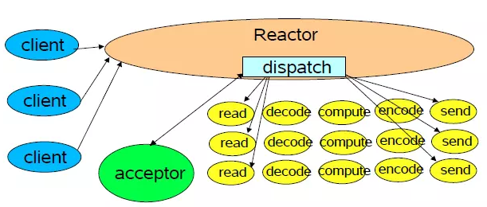
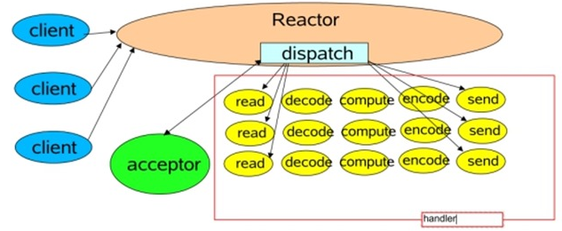
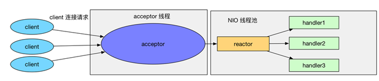
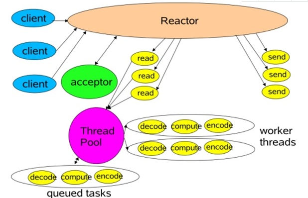
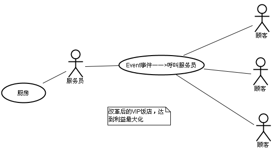
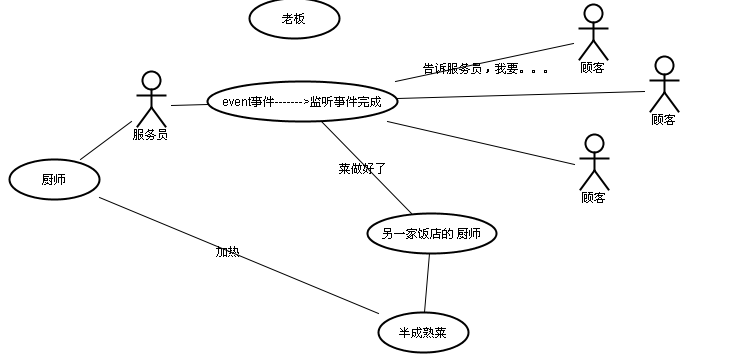
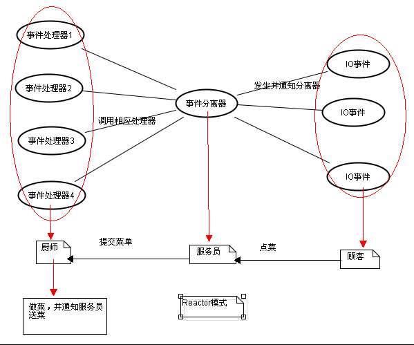
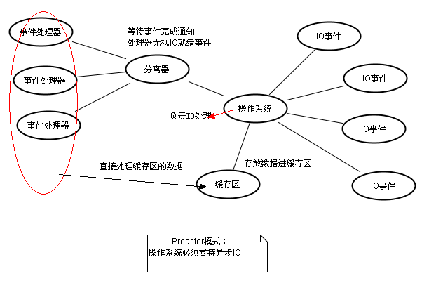

# C++特性开发
- [1.回调函数](#1)
- [2.reactor设计模式](#2)
- [3.Proactor模式](#3)


## <a id="1">1.回调函数</a>
```cpp
1.定义函数指针：typedef void (*callback_t)(void *);

2.void repeat_three_times(callback_t f, void *para)
{
	f(para);
}
repeat_three_times(count_numbers, (void *)8);
给函数指针传参数和调用方式

3.// 定义结构体数组（函数表）并初始化  
typedef struct CmdEntry
{
    PFUNCMD pfuncmd;    // 定义函数指针，用于接收函数的入口地址
    char cHelp[HELP_LEN];
}CmdEntry;
static CmdEntry cmdArray[TABLE_LEN] =
{
    {CreateFile,"CreateFile HELP"},       // 取CreatFile()函数地址，帮助信息
    {OpenFile,"OpenFile HELP"},            // 取OpenFile()函数地址，帮助信息
    {&SaveFile,"SaveFile HELP"},            // 取SaveFile()函数地址，帮助信息  
    {0,0}                                   // 退出
};
可以给cmdArray数组添加一个结构体cmdArray[i] = cmdentry;

6.可以利用多线程传入函数指针

5.	A_SetTestCb(B_UserTestCbDetail);
	A_CallTestCb();
首先A模块里面有全局函数指针，然后模块A对外函提供给模块B，模块A内部定义的全局callback变量与外部模块注册的回调函数绑定起来,用于后续模块A,满足触发条件后,触发回调。A_CallTestCb()调用触发回调函数。

6.结构体赋值函数值方法
	A.callback = a_callback;
	B.callback = &b_callback;
给结构体数组赋值结构体
	struct operation ops[2];
	ops[0] = A;
	ops[1] = B;

7.不用typedef函数指针
int call2(int(*ptr)(),char *p)
int call1(CallBackFun pCallBack,char *p)
typedef int (*CallBackFun)(char *p);
两个等价

8.函数传入常值
func((struct argv){"hello ZiMianLiang",24});
int func(struct argv a)
struct argv
{
    char a[64];
    int b;
};
```

## <a id="2">2.reactor设计模式</a>
参考链接：   
1.Reactor模式详解   
https://www.cnblogs.com/winner-0715/p/8733787.html   
2.Reactor模式   
https://www.jianshu.com/p/eef7ebe28673   

### 2.1reactor介绍
反应器设计模式(Reactor pattern)是一种为处理并发服务请求，并将请求提交到一个或
者多个服务处理程序的事件设计模式。当客户端请求抵达后，服务处理程序使用多路分配策略，由一个非阻塞的线程来接收所有的请求，然后派发这些请求至相关的工作线程进行处理。   

### 2.2什么场景下使用Reactor模式？
对于高并发系统，常会使用Reactor模式，其代替了常用的多线程处理方式，节省系统的资源，提高系统的吞吐量。

下面用比较直观的形式来介绍这种模式的使用场景。 

以餐厅为例，每一个人就餐就是一个事件，顾客会先看下菜单，然后点餐，处理这些就餐事件需要服务人员。就像一个网络服务会有很多的请求，服务器会收到每个请求，然后指派工作线程去处理一样，在多线程处理方式下：    
一个人来就餐，一个服务员去服务，然后客人会看菜单，点菜。 服务员将菜单给后厨。    
二个人来就餐，二个服务员去服务……    
五个人来就餐，五个服务员去服务……   

这类似多线程的处理方式，一个事件到来，就会有一个线程为其服务。很显然这种方式在人少的情况下会有很好的用户体验，每个客人都感觉自己享有了最好的服务。同一时间会来10个客人，老板很开心，但是只有5个服务员，这样就不能一对一服务了，有些客人就不能马上享有服务员为其服务了。综合考虑了一下，老板决定就使用10个服务人员的线程池！

但是这样又有一个比较严重的缺点：如果正在接受服务员服务的客人点菜很慢，其他的客人可能就要等好长时间了。有些脾气火爆的客人可能就等不了走人了。这样，那就引入了Reactor模式。那么，Reactor模式是如何处理这个问题呢？老板后来发现，客人点菜比较慢，大部服务员都在等着客人点菜，其实干的活不是太多。老板之所以能当老板当然有点不一样的地方，终于发现了一个新的方法，那就是：当客人点菜的时候，服务员就可以去招呼其他客人了，等客人点好了菜，直接招呼一声“服务员”，马上就有个服务员过去服务。在用了这个新方法后，老板进行了一次裁员，只留了一个服务员！这就是用单个线程来做多线程的事。实际的餐馆都是用的Reactor模式在服务。

### 2.3reactor处理流程
在处理web请求时，通常有两种体系结构，分别为：thread-based architecture（基于线程）、event-driven architecture（事件驱动）。

actor设计模式是event-driven architecture的一种实现方式，处理多个客户端并发的向服务端请求服务的场景。每种服务在服务端可能由多个方法组成。reactor会解耦并发请求的服务并分发给对应的事件处理器来处理。总体图示如下：



reactor主要由以下几个角色构成：handle、Synchronous Event Demultiplexer、Initiation Dispatcher、Event Handler、Concrete Event Handler。

Handlehandle在linux中一般称为文件描述符，而在window称为句柄，两者的含义一样。handle是事件的发源地。比如一个网络socket、磁盘文件等。而发生在handle上的事件可以有connection、ready for read、ready for write等。

Synchronous Event Demultiplexer同步事件分离器，本质上是系统调用。比如linux中的select、poll、epoll等。比如，select方法会一直阻塞直到handle上有事件发生时才会返回。	Event Handler事件处理器，其会定义一些回调方法或者称为钩子函数，当handle上有事件发生时，回调方法便会执行，一种事件处理机制。

Concrete Event Handler具体的事件处理器，实现了Event Handler。在回调方法中会实现具体的业务逻辑。

Initiation Dispatcher初始分发器，也是reactor角色，提供了注册、删除与转发event handler的方法。当Synchronous Event Demultiplexer检测到handle上有事件发生时，便会通知initiation dispatcher调用特定的event handler的回调方法。

处理流程:   
1.当应用向Initiation Dispatcher注册Concrete Event Handler时，应用会标识出该事件处理器希望Initiation Dispatcher在某种类型的事件发生发生时向其通知，事件与handle关联	2. Initiation Dispatcher要求注册在其上面的Concrete Event Handler传递内部关联的handle，该handle会向操作系统标识

2.当所有的Concrete Event Handler都注册到 Initiation Dispatcher上后，应用会调用handle_events方法来启动Initiation Dispatcher的事件循环，这时Initiation Dispatcher会将每个Concrete Event Handler关联的handle合并，并使用Synchronous Event Demultiplexer来等待这些handle上事件的发生

3.当与某个事件源对应的handle变为ready时，Synchronous Event Demultiplexer便会通知 Initiation Dispatcher。比如tcp的socket变为ready for reading

4. Initiation Dispatcher会触发事件处理器的回调方法。当事件发生时， Initiation Dispatcher会将被一个“key”（表示一个激活的handle）定位和分发给特定的Event Handler的回调方法

5. Initiation Dispatcher调用特定的Concrete Event Handler的回调方法来响应其关联的handle上发生的事件

### 2.4多线程IO的致命缺陷
多线程并发模式，一个连接一个线程的缺点是：缺点在于资源要求太高，系统中创建线程是需要比较高的系统资源的，如果连接数太高，系统无法承受，而且，线程的反复创建-销毁也需要代价。改进方法是：采用基于事件驱动的设计，当有事件触发时，才会调用处理器进行数据处理。使用Reactor模式，对线程的数量进行控制，一个线程处理大量的事件。

### 2.5单/多线程Reactor
单Reactor单线程模型：Reactor线程是个多面手，负责多路分离套接字，Accept新连接，并分派请求到Handler处理器中。Reactor和Hander 处于一条线程执行。



单线程模式的缺点:   
1、 当其中某个 handler 阻塞时， 会导致其他所有的 client 的 handler 都得不到执行， 并且更严重的是， handler 的阻塞也会导致整个服务不能接收新的 client 请求(因为 acceptor 也被阻塞了)。 因为有这么多的缺陷， 因此单线程Reactor 模型用的比较少。这种单线程模型不能充分利用多核资源，所以实际使用的不多。

2、因此，单线程模型仅仅适用于handler 中业务处理组件能快速完成的场景。

多线程的Reactor：在线程Reactor模式基础上，做如下改进：   
（1）将Handler处理器的执行放入线程池，多线程进行业务处理。   
（2）而对于Reactor而言，可以仍为单个线程。如果服务器为多核的CPU，为充分利用系统资源，可以将Reactor拆分为两个线程。
一个简单的图如下：  





## <a id="3">3.Proactor模式</a>
### 3.1 同步 异步 阻塞 非阻塞
在高性能的I/O设计中，有两个比较著名的模式Reactor和Proactor模式，其中Reactor模式用于同步I/O，而Proactor运用于异步I/O操作。
在比较这两个模式之前，我们首先的搞明白几个概念，什么是阻塞和非阻塞，什么是同步和异步,同步和异步是针对应用程序和内核的交互而言的，同步指的是用户进程触发IO操作并等待或者轮询的去查看IO操作是否就绪，而异步是指用户进程触发IO操作以后便开始做自己的事情，而当IO操作已经完成的时候会得到IO完成的通知。而阻塞和非阻塞是针对于进程在访问数据的时候，根据IO操作的就绪状态来采取的不同方式，说白了是一种读取或者写入操作函数的实现方式，阻塞方式下读取或者写入函数将一直等待，而非阻塞方式下，读取或者写入函数会立即返回一个状态值。

一般来说I/O模型可以分为：同步阻塞，同步非阻塞，异步阻塞，异步非阻塞IO。

同步阻塞IO：   
在此种方式下，用户进程在发起一个IO操作以后，必须等待IO操作的完成，只有当真正完成了IO操作以后，用户进程才能运行。JAVA传统的IO模型属于此种方式！

同步非阻塞IO:    
在此种方式下，用户进程发起一个IO操作以后边可返回做其它事情，但是用户进程需要时不时的询问IO操作是否就绪，这就要求用户进程不停的去询问，从而引入不必要的CPU资源浪费。其中目前JAVA的NIO就属于同步非阻塞IO。

异步阻塞IO：  
此种方式下是指应用发起一个IO操作以后，不等待内核IO操作的完成，等内核完成IO操作以后会通知应用程序，这其实就是同步和异步最关键的区别，同步必须等待或者主动的去询问IO是否完成，那么为什么说是阻塞的呢？因为此时是通过select系统调用来完成的，而select函数本身的实现方式是阻塞的，而采用select函数有个好处就是它可以同时监听多个文件句柄，从而提高系统的并发性！

异步非阻塞IO:    
在此种模式下，用户进程只需要发起一个IO操作然后立即返回，等IO操作真正的完成以后，应用程序会得到IO操作完成的通知，此时用户进程只需要对数据进行处理就好了，不需要进行实际的IO读写操作，因为真正的IO读取或者写入操作已经由内核完成了。目前Java中还没有支持此种IO模型。

搞清楚了以上概念以后，我们再回过头来看看，Reactor模式和Proactor模式。首先来看看Reactor模式，Reactor模式应用于同步I/O的场景。我们分别以读操作和写操作为例来看看Reactor中的具体步骤：   
读取操作：
1. 应用程序注册读就需事件和相关联的事件处理器
2. 事件分离器等待事件的发生
3. 当发生读就需事件的时候，事件分离器调用第一步注册的事件处理器
4. 事件处理器首先执行实际的读取操作，然后根据读取到的内容进行进一步的处理

写入操作类似于读取操作，只不过第一步注册的是写就绪事件。   
下面我们来看看Proactor模式中读取操作和写入操作的过程：    
读取操作：   
1. 应用程序初始化一个异步读取操作，然后注册相应的事件处理器，此时事件处理器不关注读取就绪事件，而是关注读取完成事件，这是区别于Reactor的关键。
2. 事件分离器等待读取操作完成事件
3. 在事件分离器等待读取操作完成的时候，操作系统调用内核线程完成读取操作，并将读取的内容放入用户传递过来的缓存区中。这也是区别于Reactor的一点，Proactor中，应用程序需要传递缓存区。
4. 事件分离器捕获到读取完成事件后，激活应用程序注册的事件处理器，事件处理器直接从缓存区读取数据，而不需要进行实际的读取操作。
Proactor中写入操作和读取操作，只不过感兴趣的事件是写入完成事件。

从上面可以看出，Reactor和Proactor模式的主要区别就是真正的读取和写入操作是有谁来完成的，Reactor中需要应用程序自己读取或者写入数据，而Proactor模式中，应用程序不需要进行实际的读写过程，它只需要从缓存区读取或者写入即可，操作系统会读取缓存区或者写入缓存区到真正的IO设备.

综上所述，同步和异步是相对于应用和内核的交互方式而言的，同步需要主动去询问，而异步的时候内核在IO事件发生的时候通知应用程序，而阻塞和非阻塞仅仅是系统在调用系统调用的时候函数的实现方式而已。

说到阻塞,首先得说说I/O等待。I/O等待是不可避免的,那么既然有了等待,就会有阻塞,但是注意,我们说的阻塞是指当前发起I/O操作的进程被阻塞。同步阻塞I/O便是指,当进程调用某些涉及I/O操作的系统调用或库函数时,比如accept()(注意accept也算在了i/o操作)、send()、recv()等,进程便暂停下来,等待I/O操作完成再继续运行。这是一种简单而有效的I/O模型,它可以和多进程结合起来有效的利用CPU资源,但是代价就是多进程的大量内存开销。

比如我们使用非阻塞recv()接收网络数据的时候,如果网卡缓冲区中没有可接收的数据,函数就及时返回,告诉进程没有数据可读了。相比于阻塞I/O,这种非阻塞I/O结合反复的轮询来尝试数据是否就绪,防止进程被阻塞,最大的好处便在于可以在一个进程里同时处理多个I/O操作。但正是由于需要进程执行多次的轮询来查看数据是否就绪,这花费了大量的CPU时间,使得进程处于忙碌等待状态。

非阻塞I/O一般只针对网络I/O有效,我们只要在socket的选项设置中使用O_NONBLOCK即可,这样对于该socket的send()或recv()便采用非阻塞方式。如果服务器想要同时接收多个TCP连接的数据,就必须轮流对每个socket调用接收数据的方法,比如recv()。不管这些socket有没有可以接收的数据,都要询问一遍,假如大部分socket并没有数据可以接收,那么进程便会浪费很多CPU时间用于检查这些socket,这显然不是我们所希望看到的。

阻塞和非阻塞是指当进程访问的数据如果尚未就绪,进程是否需要等待,简单说这相当于函数内部的实现区别,也就是未就绪时是直接返回还是等待就绪;

而同步和异步是指访问数据的机制,同步一般指主动请求并等待I/O操作完毕的方式,当数据就绪后在读写的时候必须阻塞(区别就绪与读写二个阶段,同步的读写必须阻塞),异步则指主动请求数据后便可以继续处理其它任务,随后等待I/O,操作完毕的通知,这可以使进程在数据读写时也不阻塞。(等待"通知")

### 3.2 Reactor和Proactor模式
Reactor模式   



Proactor模式



从上面可以看出，Reactor和Proactor模式的主要区别就是真正的读取和写入操作是有谁来完成的，Reactor中需要应用程序自己读取或者写入数据，而Proactor模式中，应用程序不需要进行实际的读写过程，它只需要从缓存区读取或者写入即可，操作系统会读取缓存区或者写入缓存区到真正的IO设备.   





堵塞、非堵塞的区别是在于第一阶段，即数据准备阶段。无论是堵塞还是非堵塞，都是用应用主动找内核要数据，而read数据的过程是‘堵塞’的，直到数据读取完。

同步、异步的区别在于第二阶段，若由请求者主动的去获取数据，则为同步操作，需要说明的是：read/write操作也是‘堵塞’的，直到数据读取完。

若数据的read都由kernel内核完成了(在内核read数据的过程中，应用进程依旧可以执行其他的任务)，这就是异步操作。
I/O多路复用是指使用一个线程来检查多个文件描述符(Socket)的就绪状态，比如调用select和poll函数，传入多个文件描述符，如果有一个文件描述符就绪，则返回，否则阻塞直到超时。得到就绪状态后进行真正的操作可以在同一个线程里执行，也可以启动线程执行(比如使用线程池)。


## links
  * [目录](<目录.md>)