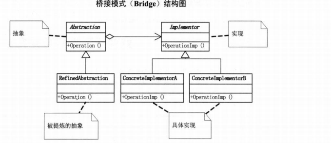

# C++设计模式
- [1.设计模式](#1)
- [2.设计模式修炼](#2)

## <a id="1">1.设计模式</a>
参考连接：  
https://www.cnblogs.com/chengjundu/p/8473564.html   


### 1 工厂模式（衣服工厂）
在工厂模式中，我们在创建对象时不会对客户端暴露创建逻辑，并且是通过使用一个共同的接口来指向新创建的对象。工厂模式作为一种创建模式，一般在创建复杂对象时，考虑使用；在创建简单对象时，建议直接new完成一个实例对象的创建。

由产品构成工厂，即创建一个虚基类产品，不同的工厂构成不同产品，如果需要新的产品可能需要新的基类，直接创建create对应工厂就行，这样不暴露产品特性。缺点就是产品类数据较多时，需要实现大量的工厂类，这无疑增加了代码量。

### 2 策略模式（apc adc）
策略模式是指定义一系列的算法，把它们单独封装起来，并且使它们可以互相替换，使得算法可以独立于使用它的客户端而变化，也是说这些算法所完成的功能类型是一样的，对外接口也是一样的，只是不同的策略为引起环境角色环境角色表现出不同的行为。相比于使用大量的if...else，使用策略模式可以降低复杂度，使得代码更容易维护。

缺点：可能需要定义大量的策略类，并且这些策略类都要提供给客户端。

```cpp
[环境角色]  持有一个策略类的引用，最终给客户端调用。
比如一个hurt(type):根据type不同new一个adc或者apc对象。然后用模板类创建不同的对象，对象根据type new adc apc对象。
也可以用继承的方式来写，创建不同的类。
也可以用函数指针进行实现。
Archer<ApcHurt>* arc = new Archer<ApcHurt>;110     arc->attack();
template<typename T>
class Archer
{
	public:
	 void attack()
{
         m_hurt.blood();
}
 private:
    T m_hurt;
 };
 ```

### 3 适配器模式（队列）
适配器模式可以将一个类的接口转换成客户端希望的另一个接口，使得原来由于接口不兼容而不能在一起工作的那些类可以在一起工作。通俗的讲就是当我们已经有了一些类，而这些类不能满足新的需求，此时就可以考虑是否能将现有的类适配成可以满足新需求的类。适配器类需要继承或依赖已有的类，实现想要的目标接口。

缺点：过多地使用适配器，会让系统非常零乱，不易整体进行把握。比如，明明看到调用的是 A 接口，其实内部被适配成了 B 接口的实现，一个系统如果太多出现这种情况，无异于一场灾难。因此如果不是很有必要，可以不使用适配器，而是直接对系统进行重构。

```cpp
有以下两种方式：
1.使用复合实现适配器模式
有一个双端队列Deque（被适配类），创建一个虚类顺序类抽象目标类Sequence，创建一个栈适配类，对象是双端队列，重新写方法。
2.使用继承实现适配器模式
前面和第一个差不多，不过不在适配类中创建对象，而是直接在适配类继承抽象和被适配类。
```

### 4 单例模式（instance）
```cpp
// 懒汉式单例模式class Singleton
{private:
	Singleton() { }
	static Singleton * pInstance;public:
	static Singleton * GetInstance()
	{
		if (pInstance == nullptr)
			pInstance = new Singleton();
		return pInstance;
	}
};
// 线程安全的单例模式class Singleton
{private:
	Singleton() { }
	~Singleton() { }
	Singleton(const Singleton &);
	Singleton & operator = (const Singleton &);public:
	static Singleton & GetInstance()
	{
		static Singleton instance;
		return instance;
	}
};

单例模式顾名思义，保证一个类仅可以有一个实例化对象，并且提供一个可以访问它的全局接口。实现单例模式必须注意一下几点：
单例类只能由一个实例化对象。
单例类必须自己提供一个实例化对象。

单例类必须提供一个可以访问唯一实例化对象的接口。可以用delete阻止复制拷贝或者nocopy类。声明delet函数，删除函数，可以声明但是不能使用，阻止类的拷贝赋值，但也可以指定给非拷贝控制成员。

单例模式分为懒汉和饿汉两种实现方式。
懒汉单例模式
懒汉：故名思义，不到万不得已就不会去实例化类，也就是说在第一次用到类实例的时候才会去实例化一个对象。在访问量较小，甚至可能不会去访问的情况下，采用懒汉实现，这是以时间换空间。即在类中getinstance中new自己对象，如果是线程安全的懒汉单例模式，需要在new中lock一下。或者在geinstace中创建一个static对象返回一个reference指向local static对象。

饿汉单例模式
饿汉：饿了肯定要饥不择食。所以在单例类定义的时候就进行实例化。在访问量比较大，或者可能访问的线程比较多时，采用饿汉实现，可以实现更好的性能。这是以空间换时间。
Singleton* Singleton::m_pSingleton = new Singleton();即在外面进行定义。
```

### 5 原型模式（clone修改）
原型模式：用原型实例指定创建对象的种类，并且通过拷贝这些原型创建新的对象。通俗的讲就是当需要创建一个新的实例化对象时，我们刚好有一个实例化对象，但是已经存在的实例化对象又不能直接使用。这种情况下拷贝一个现有的实例化对象来用，可能会更方便。

```cpp
以下情形可以考虑使用原型模式：
当new一个对象，非常繁琐复杂时，可以使用原型模式来进行复制一个对象。比如创建对象时，构造函数的参数很多，而自己又不完全的知道每个参数的意义，就可以使用原型模式来创建一个新的对象，不必去理会创建的过程。

当需要new一个新的对象，这个对象和现有的对象区别不大，我们就可以直接复制一个已有的对象，然后稍加修改。

当需要一个对象副本时，比如需要提供对象的数据，同时又需要避免外部对数据对象进行修改，那就拷贝一个对象副本供外部使用。
//提供一个抽象克隆基类Clone。
/具体的实现类 class Sheep:public Clone
```

### 6 模板模式（computer cpu）
模板模式：定义一个操作中的算法的骨架，而将一些步骤延迟到子类中。模板方法使得子类可以不改变一个算法的结构即可重定义该算法的某些特定步骤。

当多个类有相同的方法，并且逻辑相同，只是细节上有差异时，可以考虑使用模板模式。具体的实现上可以将相同的核心算法设计为模板方法，具体的实现细节有子类实现。

缺点:每一个不同的实现都需要一个子类来实现，导致类的个数增加，使得系统更加庞大。以生产电脑为例，电脑生产的过程都是一样的，只是一些装配的器件可能不同而已。

代码就是computer 有虚函数，然后用computerA继承基类虚函数overwrite。分别由电脑abc不同内容。

### 7 建造者模式（建筑builder）
建造者模式：将复杂对象的构建和其表示分离，使得相同的构建过程可以产生不同的表示。以下情形可以考虑使用建造者模式：  

对象的创建复杂，但是其各个部分的子对象创建算法一定。需求变化大，构造复杂对象的子对象经常变化，但将其组合在一起的算法相对稳定。

建造者模式的优点：   
将对象的创建和表示分离，客户端不需要了解具体的构建细节。增加新的产品对象时，只需要增加其具体的建造类即可，不需要修改原来的代码，扩展方便。产品之间差异性大，内部变化较大、较复杂时不建议使用建造者模式。

建造者类：创建和提供实例； Director类：管理建造出来的实例的依赖关系。  
Order具体的产品类    OrderBuilder抽象建造类，提供建造接口。  
具体的建造类class VegetarianOrderBuilder : public OrderBuilder   
具体的建造类class MeatOrderBuilder : public OrderBuilder   
Director类，负责管理实例创建的依赖关系，指挥构建者类创建实例class Director 设置具体的建造类builder   

### 8 外观模式（computer cpu start）
外观模式：为子系统中的一组接口定义一个一致的界面；外观模式提供一个高层的接口，这个接口使得这一子系统更加容易被使用；对于复杂的系统，系统为客户端提供一个简单的接口，把负责的实现过程封装起来，客户端不需要连接系统内部的细节。  

以下情形建议考虑外观模式：  
设计初期阶段，应有意识的将不同层分离，层与层之间建立外观模式。开发阶段，子系统越来越复杂，使用外观模式提供一个简单的调用接口。一个系统可能已经非常难易维护和扩展，但又包含了非常重要的功能，可以为其开发一个外观类，使得新系统可以方便的与其交互。

优点：   
实现了子系统与客户端之间的松耦合关系。客户端屏蔽了子系统组件，减少了客户端所需要处理的对象数据，使得子系统使用起来更方便容易。更好的划分了设计层次，对于后期维护更加的容易。

外观模式其实和模板差不多，以电脑的启动过程为例，客户端只关心电脑开机的、关机的过程，并不需要了解电脑内部子系统的启动过程。电脑start里面由子控件显示屏start，子控件外部设备start等组合而成。

### 9 组合模式（root add leaf）
组合模式：将对象组合成树形结构以表示“部分-整体”的层次结构，组合模式使得客户端对单个对象和组合对象的使用具有一直性。

既然讲到以树形结构表示“部分-整体”，那可以将组合模式想象成一根大树，将大树分成树枝和树叶两部分，树枝上可以再长树枝，也可以长树叶，树叶上则不能再长出别的东西。

```cpp
以下情况可以考虑使用组合模式：希望表示对象的部分-整体层次结构。希望客户端忽略组合对象与单个对象的不同，客户端将统一的使用组合结构中的所有对象。
HeadCompany* headRoot = new HeadCompany("Head Root Company");
155 
156     HeadCompany* childRoot1 = new HeadCompany("Child Company A");
157     ResearchCompany* r1 = new ResearchCompany("Research Company A");
158     SalesCompany* s1 = new SalesCompany("Sales Company A");
159     SalesCompany* s2 = new SalesCompany("Sales Company B");
160     FinanceCompany* f1 = new FinanceCompany("FinanceCompany A");
161     
162     childRoot1->add(r1);
163     childRoot1->add(s1);
164     childRoot1->add(s2);
165     childRoot1->add(f1);
166 
167     HeadCompany* childRoot2 = new HeadCompany("Child Company B");
168     ResearchCompany* r2 = new ResearchCompany("Research Company B");
169     SalesCompany* s3 = new SalesCompany("Sales Company C");
170     SalesCompany* s4 = new SalesCompany("Sales Company D");
171     FinanceCompany* f2 = new FinanceCompany("FinanceCompany B");
172     
173     childRoot2->add(r2);
174     childRoot2->add(s3);
175     childRoot2->add(s4);
176     childRoot2->add(f2);
177 
178     headRoot->add(childRoot1);
179     headRoot->add(childRoot2);
180     headRoot->display(1);
就是root添加不同的树叶。
```

### 10 代理模式（代理）
代理模式：为其它对象提供一种代理以控制这个对象的访问。在某些情况下，一个对象不适合或者不能直接引用另一个对象，而代理对象可以在客户端和目标对象之间起到中介作用。  

优点：    
职责清晰。真实的角色只负责实现实际的业务逻辑，不用关心其它非本职责的事务，通过后期的代理完成具体的任务。这样代码会简洁清晰。
代理对象可以在客户端和目标对象之间起到中介的作用，这样就保护了目标对象。扩展性好。

```cpp
类-》虚类-》类的指针指向目标-》执行。
class ManProxy : public Profession
41 {
42 public:
43     ManProxy(const Gril& gril):m_pMan(new YoungMan(gril)){}
44     ~ManProxy()
45     {
46         delete m_pMan;
47         m_pMan = nullptr;
48     }
49     void profess()
50     {
51         m_pMan->profess();
52     }
53 private:
54     YoungMan* m_pMan;
55 };
```

### 11 享元模式（外部+内部map结合）
享元模式：运用共享技术有效地支持大量细粒度的对象。在有大量对象时，把其中共同的部分抽象出来，如果有相同的业务请求，直接返回内存中已有的对象，避免重新创建。

以下情况可以考虑使用享元模式：系统中有大量的对象，这些对象消耗大量的内存，且这些对象的状态可以被外部化。对于享元模式，需要将对象的信息分为两个部分：内部状态和外部状态。内部状态是指被共享出来的信息，储存在享元对象内部且不随环境变化而改变；外部状态是不可以共享的，它随环境改变而改变，是由客户端控制的。

即将将内部状态作为标识，进行共享。抽象享元类，提供享元类外部接口AbstractConsumer。具体的享元类 class Consumer : public AbstractConsumer。

享元工厂类 class Trusteeship 里面map<string, shared_ptr<Consumer>> m_consumerMap;  

### 12 桥接模式（mobile app）
桥接模式：将抽象部分与实现部分分离，使它们都可以独立变换。

```cpp
以下情形考虑使用桥接模式：
当一个对象有多个变化因素的时候，考虑依赖于抽象的实现，而不是具体的实现。
当多个变化因素在多个对象间共享时，考虑将这部分变化的部分抽象出来再聚合/合成进来。
当一个对象的多个变化因素可以动态变化的时候。
优点：
将实现抽离出来，再实现抽象，使得对象的具体实现依赖于抽象，满足了依赖倒转原则。
更好的可扩展性。可动态的切换实现。桥接模式实现了抽象和实现的分离，在实现桥接模式时，就可以实现动态的选择具体的实现。
具体的App实现类class GameApp:public App
具体的App实现类 class TranslateApp:public App
抽象手机类，提供接口 class MobilePhone appRun(App* app) = 0;  //实现App与手机的桥接
具体的手机实现类 class HuaWei:public MobilePhone
```

### 13 装饰模式（构件依次添加装饰）
装饰模式：动态地给一个对象添加一些额外的功能，它是通过创建一个包装对象，也就是装饰来包裹真实的对象。新增加功能来说，装饰器模式比生产子类更加灵活。

以下情形考虑使用装饰模式：  
需要扩展一个类的功能，或给一个类添加附加职责。
需要动态的给一个对象添加功能，这些功能可以再动态的撤销。
需要增加由一些基本功能的排列组合而产生的非常大量的功能，从而使继承关系变的不现实。

当不能采用生成子类的方法进行扩充时。一种情况是，可能有大量独立的扩展，为支持每一种组合将产生大量的子类，使得子类数目呈爆炸性增长。另一种情况可能是因为类定义被隐藏，或类定义不能用于生成子类。

```cpp
//抽象构件（Component）角色：给出一个抽象接口，以规范准备接收附加责任的对象。
//具体构件（Concrete Component）角色：定义一个将要接收附加责任的类。
//装饰（Decorator）角色：持有一个构件（Component）对象的实例，并实现一个与抽象构件接口一致的接口。
//具体装饰（Concrete Decorator）角色：负责给构件对象添加上附加的责任。
```

### 14 备忘录模式（备忘录记录内部状态）
备忘录模式：在不破坏封装性的前提下，捕获一个对象的内部状态，并在该对象之外保存这个状态。这样以后就可以将该对象恢复到原来保存的状态。

```cpp
备忘录模式中需要定义的角色类：

Originator(发起人)：负责创建一个备忘录Memento，用以记录当前时刻自身的内部状态，并可使用备忘录恢复内部状态。Originator可以根据需要决定Memento存储自己的哪些内部状态。

Memento(备忘录)：负责存储Originator对象的内部状态，并可以防止Originator以外的其他对象访问备忘录。备忘录有两个接口：Caretaker只能看到备忘录的窄接口，他只能将备忘录传递给其他对象。Originator却可看到备忘录的宽接口，允许它访问返回到先前状态所需要的所有数据。

Caretaker(管理者):负责备忘录Memento，不能对Memento的内容进行访问或者操作。
84 int main()
 85 {
 86     GameValue v1 = {0, "Ak", "3K"};
 87     Game game(v1);    //初始值
 88     game.addGrade();
 89     game.showValue();
 90     cout << "----------" << endl;
 91     Caretake care;
 92     care.save(game.saveValue());  //保存当前值
 93     game.addGrade();          //修改当前值
 94     game.replaceArm("M16");
 95     game.replaceCorps("123");
 96     game.showValue();
 97     cout << "----------" << endl;
 98     game.load(care.load());   //恢复初始值
 99     game.showValue();
100     return 0;
101 }
```

### 15 中介者模式（中介添加）
中介者模式：用一个中介对象来封装一系列的对象交互，中介者使各对象不需要显示地相互引用，从而使其耦合松散，而且可以独立地改变它们之前的交互。

如果对象与对象之前存在大量的关联关系，若一个对象改变，常常需要跟踪与之关联的对象，并做出相应的处理，这样势必会造成系统变得复杂，遇到这种情形可以考虑使用中介者模式。当多个对象存在关联关系时，为它们设计一个中介对象，当一个对象改变时，只需要通知它的中介对象，再由它的中介对象通知每个与它相关的对象。  

```cpp
108 int main()
109 {
110     HouseMediator* hMediator = new HouseMediator;
111     Buyer* buyer = new Buyer(hMediator);
112     Seller* seller = new Seller(hMediator);
113 ​
114     hMediator->setBuyer(buyer);
115     hMediator->setSeller(seller);
116 ​
117     buyer->sendMessage("Sell not to sell?");
118     seller->sendMessage("Of course selling!");
119 ​
120     delete buyer;
121     buyer = nullptr;
123     delete seller;
124     seller = nullptr;
126     delete hMediator;
127     hMediator = nullptr;
130     return 0;
131 }
```

### 16 职责链模式（依次职责添加）
职责链模式：使多个对象都有机会处理请求，从而避免请求的发送者和接收者之前的耦合关系，将这些对象连成一条链，并沿着这条链传递请求，直到有一个对象处理它为止。   

职责链上的处理者负责处理请求，客户只需要将请求发送到职责链上即可，无需关心请求的处理细节和请求的传递，所有职责链将请求的发送者和请求的处理者解耦了。   

```cpp
74 int main()
75 {
76     Leader* general = new General(nullptr);
77     Leader* captain = new Captain(general);
78     Leader* monitor = new Monitor(captain);
79     monitor->handleRequest(Level_One);
80 ​
81     delete monitor;
82     monitor = nullptr;
83     delete captain;
84     captain = nullptr;
85     delete general;
86     general = nullptr;
87     return 0;
88 }
```

### 17 观察者模式（注册观测者与被观测者一样变化）
观察者模式：定义对象间的一种一对多的依赖关系，当一个对象的状态发生改变时，所有依赖于它的对象都要得到通知并自动更新。

```cpp
观察者模式从根本上讲必须包含两个角色：观察者和被观察对象。
被观察对象自身应该包含一个容器来存放观察者对象，当被观察者自身发生改变时通知容器内所有的观察者对象自动更新。
观察者对象可以注册到被观察者的中，完成注册后可以检测被观察者的变化，接收被观察者的通知。当然观察者也可以被注销掉，停止对被观察者的监控。
```

```cpp
关键代码：在目标类中增加一个ArrayList来存放观察者们。

#include <iostream>
#include <list>
#include <memory>
using namespace std;
​
class View;
​
//被观察者抽象类   数据模型
class DataModel
{
public:
    virtual ~DataModel(){}
    virtual void addView(View* view) = 0;
    virtual void removeView(View* view) = 0;
    virtual void notify() = 0;   //通知函数
};
​
//观察者抽象类   视图
class View
{
public:
    virtual ~View(){ cout << "~View()" << endl; }
    virtual void update() = 0;
    virtual void setViewName(const string& name) = 0;
    virtual const string& name() = 0;
};

//具体的被观察类， 整数模型
class IntDataModel:public DataModel
{
public:
    ~IntDataModel()
    {
        m_pViewList.clear();
    }
​
    virtual void addView(View* view) override
    {
        shared_ptr<View> temp(view);
        auto iter = find(m_pViewList.begin(), m_pViewList.end(), temp);
        if(iter == m_pViewList.end())
        {
            m_pViewList.push_front(temp);
        }
        else
        {
            cout << "View already exists" << endl;
        }
    }
​
    void removeView(View* view) override
    {
        auto iter = m_pViewList.begin();
        for(; iter != m_pViewList.end(); iter++)
        {
            if((*iter).get() == view)
            {
                m_pViewList.erase(iter);
                cout << "remove view" << endl;
                return;
            }
        }
    }
​
    virtual void notify() override
    {
        auto iter = m_pViewList.begin();
        for(; iter != m_pViewList.end(); iter++)
        {
            (*iter).get()->update();
        }
    }
​
private:
    list<shared_ptr<View>> m_pViewList; 
};
​
//具体的观察者类    表视图
class TableView : public View
{
public:
    TableView() : m_name("unknow"){}
    TableView(const string& name) : m_name(name){}
    ~TableView(){ cout << "~TableView(): " << m_name.data() << endl; }
​
    void setViewName(const string& name)
    {
        m_name = name;
    }
​
    const string& name()
    {
        return m_name;
    }
​
    void update() override
    {
        cout << m_name.data() << " update" << endl;
    }
​
private:
    string m_name;
};
​
int main()
{
    //这里需要补充说明的是在此示例代码中，View一旦被注册到DataModel类之后，DataModel解析时会自动解析掉     * 内部容器中存储的View对象，因此注册后的View对象不需要在手动去delete，再去delete View对象会出错。
    
    View* v1 = new TableView("TableView1");
    View* v2 = new TableView("TableView2");
    View* v3 = new TableView("TableView3");
    View* v4 = new TableView("TableView4");
​
    IntDataModel* model = new IntDataModel;
    model->addView(v1);
    model->addView(v2);
    model->addView(v3);
    model->addView(v4);
​
    model->notify();
​
    cout << "-------------\n" << endl;
​
    model->removeView(v1);
​
    model->notify();
​
    delete model;
    model = nullptr;
​
    return 0;
}
```

## <a id="2">2.设计模式修炼</a>
- [2.1介绍](#2.1)
- [2.2简单工厂](#2.2)
- [2.3策略模式](#2.3)
- [2.4装饰模式](#2.4)
- [2.5代理模式](#2.5)
- [2.6工厂方法模式](#2.6)
- [2.7原型模式](#2.7)
- [2.8模板方法模式](#2.8)
- [2.9外观模式](#2.9)
- [2.10建造者模式](#2.10)
- [2.11观察者模式](#2.11)
- [2.12抽象工厂模式](#2.12)
- [2.13状态模式](#2.13)
- [2.14适配器模式](#2.14)
- [2.15备忘录模式](#2.15)
- [2.16组合模式](#2.16)
- [2.17迭代器模式](#2.17)
- [2.18单例模式](#2.18)
- [2.19桥接模式](#2.19)
- [2.20命令模式](#2.20)
- [2.21职责链模式](#2.21)


### <a id="2.1">2.1介绍</a>
参考链接：   
1.二十三种设计模式修炼手册   
https://www.cnblogs.com/Yee-Q/p/13326782.html   

### 2.1介绍
软件模式并非仅限于设计模式，还包括架构模式、分析模式和过程模式等，在软件生存期的每一个阶段都存在着一些被认同的模式。  

设计模式一般有两种分类方式，一种是根据目的分类（模式是用来做什么的），另一种则是根据范围分类（模式是用来处理类之间的关系还是处理对象之间的关系）。根据这两种分类分别有如下两张表供参考：

| 类型                            | 描述                                           |
| --------------------------------- | ------------------------------------------------ |
| 创建型模式（Creational Patterns） | 用于构建对象，以便它们可以从实现系统中分离出来。 |
| 结构型模式（Structural Patterns） | 用于在许多不同的对象之间形成大型对象结构。 |
| 行为型模式（Behavioral Patterns） | 用于管理对象之间的算法、关系和职责。 |


下面简单对二十三种设计模式进行说明
<table>
	<tbody><tr>
	    <th>模式类别</th>
	    <th>模式名称</th>
	    <th>模式说明</th>  
	</tr>
	<tr>
	    <td rowspan="6">创建型模式</td>
	</tr>
	<tr>
	    <td>抽象工厂模式</td>
	    <td>提供了一个创建一系列相关或相互依赖对象的接口，而无须指定它们具体的类</td>
	</tr>
    <tr>
	    <td>工厂方法模式</td>
	    <td>该类的实例化操作延迟到子类中完成，即由子类来决定究竟该实例化（创建）哪一个类</td>
	</tr>
	<tr>
	    <td>建造者模式</td>
	    <td>将一个复杂对象的构建与它的表示分离，使得同样的构建过程可以创建不同的表示</td>
	</tr>
	<tr>
        <td>原型模式</td>
	    <td>通过给出一个原型对象来指明要创建对象的类型，然后通过复制这个原型对象来创建更多同类型的对象</td>
	</tr>
	<tr>
	    <td>单例模式</td>
	    <td>确保在系统中某一个类只有一个实例，可以自行实例化并向整个系统提供这个实例</td>
	</tr>
	<tr>
	    <td rowspan="8">结构型模式</td>
	</tr>
	<tr>
	    <td>适配器模式</td>
	    <td>将一个接口转换成客户希望的另一个接口，从而使接口不兼容的那些类可以一起工作</td>
	</tr>
	<tr>
	    <td>桥接模式</td>
	    <td>将抽象部分与它的实现部分分离，使它们都可以独立地变化</td>
	</tr>
	<tr>
	    <td>组合模式</td>
	    <td>组合多个对象形成树形结构以表示“整体-部分”的结构层次</td>
	</tr>
	<tr>
	    <td>装饰模式</td>
	    <td>动态地给一个对象增加一些额外的职责</td>
	</tr>
	<tr>
	    <td>外观模式</td>
	    <td>为复杂子系统提供一个一致的接口</td>
	</tr>
	<tr>
	    <td>享元模式</td>
	    <td>通过运用共享技术有效地支持大量细粒度对象的复用</td>
	</tr>
	<tr>
	    <td>代理模式</td>
	    <td>给某一个对象提供一个引用，并由代理对象控制对原对象的引用</td>
	</tr>
    <tr>
	    <td rowspan="13">结构型模式</td>
	</tr>
    <tr>
	    <td>职责链模式</td>
	    <td>避免请求发送者与接收者耦合在一起，让多个对象都有可能接收请求，将这些对象连接成一条链，并且沿着这条链传递请求，直到有对象处理为止</td>
	</tr>
    <tr>
	    <td>职责链模式</td>
	    <td>避免请求发送者与接收者耦合在一起，让多个对象都有可能接收请求，将这些对象连接成一条链，并且沿着这条链传递请求，直到有对象处理为止</td>
	</tr>
    <tr>
	    <td>命令模式</td>
	    <td>将一个请求封装为一个对象，从而使得请求调用者和请求接收者解耦</td>
	</tr>
    <tr>
	    <td>解释器模式</td>
	    <td>描述如何为语言定义一个语法，如何在该语言中表示一个句子，以及如何解释这些句子</td>
	</tr>
    <tr>
	    <td>迭代器模式</td>
	    <td>提供了一种方法来访问聚合对象，而不用暴露这个对象的内部表示</td>
	</tr>
    <tr>
	    <td>中介者模式</td>
	    <td>通过一个中介对象来封装一系列的对象交互，使得各对象不需要显式地相互引用，从而使其耦合松散，而且可以独立地改变它们之间的交互</td>
	</tr>
    <tr>
	    <td>备忘录模式</td>
	    <td>在不破坏封装的前提下，捕获一个对象的内部状态，并在该对象之外保存这个状态，这样可以在以后将对象恢复到原先保存的状态</td>
	</tr>
    <tr>
	    <td>观察者模式</td>
	    <td>定义了对象间的一种一对多依赖关系，使得当每一个对象状态发生改变时，其相关依赖对象皆得到通知并被自动更新</td>
	</tr>
    <tr>
	    <td>状态模式</td>
	    <td>允许将一个对象在其内部状态改变时改变它的行为</td>
	</tr>
    <tr>
	    <td>策略模式</td>
	    <td>定义一系列算法，并将每一个算法封装在一个类中，让它们可以相互替换，策略模式让算法独立于使用它的客户而变化</td>
	</tr>
    <tr>
	    <td>模板方法模式</td>
	    <td>定义一个操作中算法的骨架，而将一些步骤延迟到子类中</td>
	</tr>
    <tr>
	    <td>访问者模式</td>
	    <td>表示将一个作用于某对象结构中的各元素操作，它使得用户可以在不改变各元素的类的前提下定义作用于这些元素的新操作</td>
	</tr>
</tbody></table>

### uml类图介绍
第一行类名称   
第二行类属性或者字段    
第三行类行为或者方法    

+:pubilc  -:private   #:protect     

如果类名词为斜体则为抽象类 。类名称<<>>代表接口，第一行代表接口名称，第二行接口方法。         

继承关系：空心三角形+实线，接口实现：空心三角形+虚线，关联：实线。    

聚合关系：空心菱形+实线。 聚合关系代表弱拥有关系，a包含b，b不是a的一部分。   

合成关系：实心菱形+实线。 合成关系代表强拥有关系，部分和整体关系。    

依赖关系：虚线箭头。
 


### 面向对象设计原则
面向对象设计原则是学习设计模式的基础，每一种设计模式都符合某一种或多种面向对象设计原则。在软件开发中使用这些原则可以提高软件的可维护性和可复用性，让我们可以设计出更加灵活也更容易扩展的软件设计，实现可维护性复用的目标。

#### 单一职责原则
一个对象应该只包含单一的职责，并且该职责被完整地封装在一个类中

一个类承担的职责越多，被复用的可能性越小，并且相当于将这些职责耦合在一起。因此需要将这些职责进行分离，实现高内聚、低耦合的指导方针。

#### 开闭原则
一个软件实体应当对扩展开放，对修改关闭。也就是说在设计一个模块，应当使这个模块可以在不被修改的前提下被扩展。

在开闭原则的定义中，软件实体可以是一个软件模块、一个由多个类组成的局部结构或一个类。

软件的需求会随着时间推移发生变化，如果软件设计符合开闭原则，就可以在扩展时无须修改现有代码，保证稳定性与延续性。

抽象化是满足开闭原则的关键，通过定义一个相对稳定的抽象层，将不同的实现行为在具体实现层中实现。如果需要修改，无须改动抽象层，只需增加新的实体类来实现新的业务功能即可。

#### 里氏代换原则
所有引用基类（父类）的地方必须能透明地使用其子类的对象。说白了就是：在软件中如果能使用其基类对象，那么一定能使用其子类对象。把基类都替换成它的子类，程序不会产生任何错误。但反过来则不成立，如果一个软件实体使用的是一个子类，那么它不一定能使用基类。

里氏代换原则是实现开闭原则的重要方式之一，在程序中尽量使用基类类型来定义对象，而在运行时再确定其子类类型，用子类对象来替代父类对象。

#### 依赖倒换原则
高层模块不应该依赖低层模块，它们都应该依赖抽象。抽象不应该依赖于细节，细节应该依赖于抽象。即代码要依赖于抽象的类，而不依赖于具体的类，要针对接口编程，不要针对实现编程。

如果说开闭原则是面向对象设计的目标的话，那么依赖倒转原则就是面向对象设计的主要手段。下面介绍依赖倒转原则中经常提到的两个概念。

类之间的耦合：在面向对象系统中，两个类之间通常可以发生三种不同的耦合关系（依赖关系）

 1. 零耦合关系：两个类之间没有任何耦合关系
 2. 具体耦合关系：两个具体类之间存在一个类对另一个具体类实例的直接引用
 3. 抽象耦合关系：发生在一个具体类和抽象类之间，也可以发生在两个抽象类之间。依赖倒转原则要求客户端依赖于抽象耦合。

依赖注入：简单来说，依赖注入就是将一个类的对象传入另一个类，注入时应该注入父类对象，而在程序运行时再通过子类对象来覆盖父类对象。依赖注入有三种方式

 1. 构造注入：通过构造函数注入实例变量
 2. 设值注入：通过Setter方法注入实例变量
 3. 接口注入：通过接口方法注入实例变量

#### 接口隔离原则
一旦一个接口太大，则需要将它分割成一些更小的接口，使用该接口的客户端仅需知道与之相关的方法即可。

这里的接口往往有两种不同的含义：

一种是指一个类型所具有的方法的特征的集合，仅仅是逻辑上的概念，接口的划分将直接带来类型的划分。此时可以把接口理解成角色，一个接口只代表一个角色，每个角色都有它特有的一个接口，此时这个原则叫做角色隔离原则。

另一种是指接口仅仅提高客户端需要的行为，即所需的方法。接口应该尽量细化，接口中的方法进来少，每个接口只包含一个客户端所需的角色。

#### 合成复用原则
尽量使用组合对象，而不是继承来达到复用的目的。通俗来说，合成复用原则就是指一个新的对象里通过关联关系（包括组合关系和聚合关系）来使用一些已有对象，使之成为新对象的一部分；新对象通过委派调用已有对象的方法达到复用已有功能的目的。

通过继承来实现复用很简单，子类可以覆盖父类方法，易于扩展。但会破坏系统的封装性，因为继承会将基类的实现细节暴露给子类，这种复用又称为“白箱复用”。

通过组合/聚合来复用是将一个类的对象作为另一个类的对象的一部分。新对象可以调用已有对象的功能，这种复用又称为“黑箱复用”。

#### 迪米特法则
指一个软件实体应尽可能少的与其他实体发生相互作用。当一个模块修改时，就会尽量少的影响其他模块，这是对软件实体之间通信的限制，它要求软件实体之间通信的宽度和深度。

在迪米特法则中，对于一个对象，其朋友包括以下几类：

当前对象本身（this）

以参数形式传入到当前对象方法中的对象

当前对象的成员对象

如果当前对象的成员对象是一个集合，那么集合中的元素也都是朋友

当前对象所创建的对象

任何对象如果满足上面的条件之一，就是当前对象的“朋友”，否则就是“陌生人”。

狭义的迪米特法则：如果两个类之间不必彼此通信，那么这两个类就不应当发生直接的相互作用。如果其中一个类需要调用另一个类的某一个方法的话，可以通过第三者转发这个调用。狭义的迪米特法则可以降低类之间的耦合，但也会造成系统不同模块之间通信效率降低，使得系统的不同模块之间不容易协调。

广义的迪米特法则：指对象之间的信息流量、流向以及信息的影响的控制，主要是对信息隐藏的控制。信息的隐藏可以使各个子系统之间脱耦，每一个模块不依赖于其他模块存在，因此每一个模块都可以独立地在其他地方使用。

### <a id="2.2">2.2简单工厂</a>
根据不同的情况，实列化不同的类。计算器实列，根据运算符号实列不同的类。   
有基础类包含数字和获取结果接口，形成加减乘除的类，最后根据不同运算符号再一一实列。   

```cpp
/// <summary>
/// 运算类
/// </summary>
public class Operation
{
	private double _numberA = 0;
	private double _numberB = 0;
	/// 数字A
	public double NumberA
	{
		get{return _numberA;}
		set{_numberA = value;}
	}
	/// 数字B
	public double NumberB
	{
		get{return _numberB;}
		set{_numberB = value;}
	}
	/// 得到运算结果
	public virtual double getResult()
	{
		double result = 0; 
		return result;
	}    
}

/// <summary>
/// 加法类
/// </summary>
class OperationAdd : Operation
{
	public override double getResult()
	{
		double result = 0; 
		result = NumberA + NumberB;
		return result;
	}
}

public class OperationFactory
{
    public static Operation createOperate(string operate)
    {
        Operation oper = null;
        switch (operate)
        {
            case "+":
                {
                    oper = new OperationAdd();
                    break;
                }
            case "-":
                {
                    oper = new OperationSub();
                    break;
                }
            case "*":
                {
                    oper = new OperationMul();
                    break;
                }
            case "/":
                {
                    oper = new OperationDiv();
                    break;
                }
        }
        return oper;
    }
}
oper = OperationFactory.createOperate("+");
```

### <a id="2.3">2.3策略模式</a>
策略模式封装了不同的算法，之间相互隔离，不会影响使用算法的用户。实列是超市打折活动。    
有基础类，封装成不同算法类，然后建立一个context类，里面是算法基础类指针，传入不同的算法类，context指针指向不同算法，然后进行不同策略调用。      
如果想要策略模式和简单工厂模式结合的化，就再contex中new不同的算法，根据contexx传入不同type新建不同的实列。   

```cpp
abstract class CashSuper
{
	public abstract double acceptCash(double money);
}

class CashRebate : CashSuper
{
	private double moneyRebate = 1d;
	public CashRebate(string moneyRebate)
	{
		this.moneyRebate = double.Parse(moneyRebate);
	}

	public override double acceptCash(double money)
	{
		return money * moneyRebate;
	} 
}

class CashReturn : CashSuper
{
	private double moneyCondition = 0.0d;
	private double moneyReturn = 0.0d;
	
	public CashReturn(string moneyCondition,string moneyReturn)
	{
		this.moneyCondition = double.Parse(moneyCondition);
		this.moneyReturn = double.Parse(moneyReturn);
	}

	public override double acceptCash(double money)
	{
		double result = money;
		if (money >= moneyCondition)
			result=money- Math.Floor(money / moneyCondition) * moneyReturn;
			
		return result;
	} 
}

//收费策略Context
class CashContext
{
    //声明一个现金收费父类对象
    private CashSuper cs;

    //设置策略行为，参数为具体的现金收费子类（正常，打折或返利）
    public CashContext(CashSuper csuper)
    {
        this.cs = csuper;
    }

    //得到现金促销计算结果（利用了多态机制，不同的策略行为导致不同的结果）
    public double GetResult(double money)
    {
        return cs.acceptCash(money);
    }
}

CashContext cc = null;
switch (cbxType.SelectedItem.ToString())
{
	case "正常收费":
		cc = new CashContext(new CashNormal());
		break;
	case "满300返100":
		cc = new CashContext(new CashReturn("300", "100"));
		break;
	case "打8折":
		cc = new CashContext(new CashRebate("0.8"));
		break;
}
double totalPrices = 0d;
totalPrices = cc.GetResult(Convert.ToDouble(txtPrice.Text) * Convert.ToDouble(txtNum.Text));
```
 


简单工厂模式和策略模式对比，简单工厂需要两个类，策略模式只需要context一个类传入type就行。耦合更低。策略模式独立封装不同算法，互不影响。封装了变化。缺点是需要修改switch里面选择不同算法的逻辑。   、

总结就是抽象一个算法抽象一个方法，然后继承出不同算法类，通过相同方法实现不同算法。通过context加载想要的算法，通过相同方法实现不同的方法。


### <a id="2.4">2.4装饰模式</a>
装饰模式:动态给一个对象添加额外的职责，装饰模式比增加子类更方便。实列就是穿衣服依次添加。

component定义一个对象接口，concretecomponent定义以后具体对象给对象添加职责。
decorator装饰抽象类，继承component，从外扩展component类功能，对于component无需知道decorator存在，concreteDecorator具体装饰对象给component添加职责功能。

装饰的方法是：


利用set来进行装饰。利用装饰类a实列化里面的类的addbehaver方法进行调用装饰方法。如果只有concretecomponent没有抽象component，那么装饰decorator可以是concretecomponent子类，同样如果只有一个concreteDecorator，就没有必要创建decorator。

```cpp
class Person
{
	public Person()
	{ }

	private string name;
	public Person(string name)
	{
		this.name = name;
	}

	public virtual void Show()
	{
		Console.WriteLine("装扮的{0}", name);
	}
}


class Finery : Person
{
	protected Person component;

	//打扮
	public void Decorate(Person component)
	{
		this.component = component;
	}

	public override void Show()
	{
		if (component != null)
		{
			component.Show();
		}
	}
}
class TShirts : Finery
{
	public override void Show()
	{
		Console.Write("大T恤 ");
		base.Show();
	}
}

class BigTrouser : Finery
{
	public override void Show()
	{
		Console.Write("垮裤 ");
		base.Show();
	}
}

Person xc = new Person("小菜");
Sneakers pqx = new Sneakers();
BigTrouser kk = new BigTrouser();
TShirts dtx = new TShirts();
pqx.Decorate(xc);
kk.Decorate(pqx);
dtx.Decorate(kk);
dtx.Show();
```

装饰模式是已有的功能添加更多功能，用于系统需要新功能，创建新类，向旧类添加薪的代码，新类创建新的方法和逻辑。

创建新类，继承抽象类创建新的方法，使用，如果是同一个方法可以进行改造。如果有抽象类调用一个方法show，会一次进行调用形成一个联。

### <a id="2.5">2.5代理模式</a>
代理模式：为其它对象提供一种代理以控制这个对象的访问。实列通过别人送东西。

定义一个代理类，传入想要代理得类，在代理类中定义方法调用想要代理得方法，或者新增新逻辑。

代理模式用于以下场景：1.远程代理，为一个对象在不同地址空间提供局部代理，可以隐藏一个对象存在不同地方。2.虚拟代理，创建开销很大的对象，比如代理后新增业务可以显示，避免开销大对象创建。3.安全代理，控制真实对象访问权限。

```c++
//送礼物
interface GiveGift
{
	void GiveDolls();
	void GiveFlowers();
	void GiveChocolate();
}

class Proxy : GiveGift
{
	Pursuit gg;
	public Proxy(SchoolGirl mm)
	{
		gg = new Pursuit(mm);
	}
	public void GiveDolls()
	{
		gg.GiveDolls();
	}
	public void GiveFlowers()
	{
		gg.GiveFlowers();
	}
	public void GiveChocolate()
	{
		gg.GiveChocolate();
	}
}

class Pursuit : GiveGift
{
	SchoolGirl mm;
	public Pursuit(SchoolGirl mm)
	{
		this.mm = mm;
	}
	public void GiveDolls()
	{
		Console.WriteLine(mm.Name + " 送你洋娃娃");
	}
	public void GiveFlowers()
	{
		Console.WriteLine(mm.Name + " 送你鲜花");
	}
	public void GiveChocolate()
	{
		Console.WriteLine(mm.Name + " 送你巧克力");
	}
}

class SchoolGirl
{
	private string name;
	public string Name
	{
		get { return name; }
		set { name = value; }
	}
}

SchoolGirl jiaojiao = new SchoolGirl();
jiaojiao.Name = "李娇娇";
Proxy daili = new Proxy(jiaojiao);
daili.GiveDolls();
daili.GiveFlowers();
daili.GiveChocolate();
Console.Read();
```

总结来说就是创建一个类，在这个类中调用原有类的方法进行封装使用。  

### <a id="2.6">2.6工厂方法模式</a>

简单工厂类是抽象数据+方法，根据运算符不同实列出不同类。实列和简单工厂一样。

工厂方法模式是抽象出一个工厂，实列出不同运算符类，你根据需要调用不同的工厂。在工厂中new不同的运算子类存在数据。就是把一个工厂根据逻辑变成多个工厂。

简单工厂类与工厂方法对比，简单工厂是在工厂中添加逻辑，根据逻辑进行实列化不同的子类，工厂方法类是创建对象接口，实列化不同工厂，让子类决定实列化那个类，不违背开发-封闭原则。

下面例子是简单工厂和工厂方法说明
```cpp
public static LeiFeng CreateLeiFeng(string type)
{
	LeiFeng result = null;
	switch (type)
	{
		case "学雷锋的大学生":
			result = new Undergraduate();
			break;
		case "社区志愿者":
			result = new Volunteer();
			break;

	}
	return result;
}

//学雷锋的大学生工厂
class UndergraduateFactory : IFactory
{
	public LeiFeng CreateLeiFeng()
	{
		return new Undergraduate();
	}
}

//社区志愿者工厂
class VolunteerFactory : IFactory
{
	public LeiFeng CreateLeiFeng()
	{
		return new Volunteer();
	}
}

//简单工厂模式
LeiFeng studentA = CreateLeiFeng("学雷锋的大学生");
studentA.BuyRice();
LeiFeng studentB = CreateLeiFeng("学雷锋的大学生");
studentB.Sweep();
LeiFeng studentC = CreateLeiFeng("学雷锋的大学生");
studentC.Wash();

//工厂方法模式
IFactory factory = new UndergraduateFactory();
LeiFeng student = factory.CreateLeiFeng();

student.BuyRice();
student.Sweep();
student.Wash();
```

### <a id="2.7">2.7原型模式</a>
例子中写简历可以不用创建new多个对象，直接b=c=a进行传引用。实列就是clone。

用原型实列指定创建对象的种类，并且通过拷贝这些原型创建新的对象。从一个对象创建一个可定制的对象。

主要避免使用new创建不同的对象，直接用clone拷贝使用。

```cpp
实列1.c++:
//具体类
class BinarySplitter : public ISplitter{
public:
    virtual ISplitter* clone(){
        return new BinarySplitter(*this);
    }
};

class TxtSplitter: public ISplitter{
public:
    virtual ISplitter* clone(){
        return new TxtSplitter(*this);
    }
};

class PictureSplitter: public ISplitter{
public:
    virtual ISplitter* clone(){
        return new PictureSplitter(*this);
    }
};

class VideoSplitter: public ISplitter{
public:
    virtual ISplitter* clone(){
        return new VideoSplitter(*this);
    }
};

ISplitter * splitter= prototype->clone(); //克隆原型
splitter->split();

实列2：c#
//简历
class Resume : ICloneable
{
	private string name;
	private string sex;
	private string age;

	private WorkExperience work;

	public Resume(string name)
	{
		this.name = name;
		work = new WorkExperience();
	}

	private Resume(WorkExperience work)
	{
		this.work = (WorkExperience)work.Clone();
	}

	//设置个人信息
	public void SetPersonalInfo(string sex, string age)
	{
		this.sex = sex;
		this.age = age;
	}
	//设置工作经历
	public void SetWorkExperience(string workDate, string company)
	{
		work.WorkDate = workDate;
		work.Company = company;
	}

	public Object Clone()
	{
		Resume obj = new Resume(this.work);
		obj.name = this.name;
		obj.sex = this.sex;
		obj.age = this.age;
		return obj;
	}

Resume a = new Resume("大鸟");
a.SetPersonalInfo("男", "29");
a.SetWorkExperience("1998-2000", "XX公司");

Resume b = (Resume)a.Clone();
b.SetWorkExperience("1998-2006", "YY企业");

Resume c = (Resume)a.Clone();
c.SetWorkExperience("1998-2003", "ZZ企业");
```

里面涉及到浅复制和深复制，如果想每个隔离需要传入work传入。

### <a id="2.8">2.8模板方法模式</a>
在类中定义一个算法骨架，将一些步骤推迟到子类实现，类中添加虚函数，实列中选择题中抽象出一个虚函数答案，在子类中填写具体实现。实列就是选择题模板。       

```cpp
namespace 模板方法模式
{
    class Program
    {
        static void Main(string[] args)
        {
            c = new ConcreteClassA();
            c.TemplateMethod();
            c = new ConcreteClassB();
            c.TemplateMethod();

            Console.Read();
        }
    }
    abstract class AbstractClass
    {
        public abstract void PrimitiveOperation1();
        public abstract void PrimitiveOperation2();
        public void TemplateMethod()
        {
            PrimitiveOperation1();
            PrimitiveOperation2();
            Console.WriteLine("");
        }
    }
    class ConcreteClassA : AbstractClass
    {
        public override void PrimitiveOperation1()
        {
            Console.WriteLine("具体类A方法1实现");
        }
        public override void PrimitiveOperation2()
        {
            Console.WriteLine("具体类A方法2实现");
        }
    }
    class ConcreteClassB : AbstractClass
    {
        public override void PrimitiveOperation1()
        {
            Console.WriteLine("具体类B方法1实现");
        }
        public override void PrimitiveOperation2()
        {
            Console.WriteLine("具体类B方法2实现");
        }
    }

}
```

模板方法模式就是把重复得提取出来形成模板，类似语法中模板。实际就是子类虚函数各自实现。

### <a id="2.9">2.9外观模式</a>
为子系统得一组接口提供一个一致界面，定义了高层接口。基金经理下面一堆股票基金。实列股票管理。    

```cpp
//股票1
class Stock1
{
	//卖股票
	public void Sell()
	{
		Console.WriteLine(" 股票1卖出");
	}
	//买股票
	public void Buy()
	{
		Console.WriteLine(" 股票1买入");
	}
}

//股票2
class Stock2
{
	//卖股票
	public void Sell()
	{
		Console.WriteLine(" 股票2卖出");
	}
	//买股票
	public void Buy()
	{
		Console.WriteLine(" 股票2买入");
	}
}

//股票3
class Stock3
{
	//卖股票
	public void Sell()
	{
		Console.WriteLine(" 股票3卖出");
	}
	//买股票
	public void Buy()
	{
		Console.WriteLine(" 股票3买入");
	}
}

//国债1
class NationalDebt1
{
	//卖国债
	public void Sell()
	{
		Console.WriteLine(" 国债1卖出");
	}
	//买国债
	public void Buy()
	{
		Console.WriteLine(" 国债1买入");
	}
}

//房地产1
class Realty1
{
	//卖房地产
	public void Sell()
	{
		Console.WriteLine(" 房产1卖出");
	}
	//买房地产
	public void Buy()
	{
		Console.WriteLine(" 房产1买入");
	}
}

class Fund
{
	Stock1 gu1;
	Stock2 gu2;
	Stock3 gu3;
	NationalDebt1 nd1;
	Realty1 rt1;

	public Fund()
	{
		gu1 = new Stock1();
		gu2 = new Stock2();
		gu3 = new Stock3();
		nd1 = new NationalDebt1();
		rt1 = new Realty1();
	}

	public void BuyFund()
	{
		gu1.Buy();
		gu2.Buy();
		gu3.Buy();
		nd1.Buy();
		rt1.Buy();
	}

	public void SellFund()
	{
		gu1.Sell();
		gu2.Sell();
		gu3.Sell();
		nd1.Sell();
		rt1.Sell();
	}

}
```

### <a id="2.10">2.10建造者模式</a>
如果使用了建造者模式，用户只需要指定类型，具体的建造细节不需要知道。将复杂对象构建和表示分离开来，使用相同的构建创建不同的表示。实列炒饭实列。    

```c#
产品类
class Product
{
	IList<string> parts = new List<string>();

	public void Add(string part)
	{
		parts.Add(part);
	}

	public void Show()
	{
		Console.WriteLine("\n产品 创建 ----");
		foreach (string part in parts)
		{
			Console.WriteLine(part);
		}
	}
}

抽象建造者
abstract class Builder
{
	public abstract void BuildPartA();
	public abstract void BuildPartB();
	public abstract Product GetResult();
}
具体建造者
class ConcreteBuilder1 : Builder
{
	private Product product = new Product();

	public override void BuildPartA()
	{
		product.Add("部件A");
	}

	public override void BuildPartB()
	{
		product.Add("部件B");
	}

	public override Product GetResult()
	{
		return product;
	}
}

class ConcreteBuilder2 : Builder
{
	private Product product = new Product();
	public override void BuildPartA()
	{
		product.Add("部件X");
	}

	public override void BuildPartB()
	{
		product.Add("部件Y");
	}

	public override Product GetResult()
	{
		return product;
	}
}
指挥者
class Director
{
	public void Construct(Builder builder)
	{
		builder.BuildPartA();
		builder.BuildPartB();
	}
}

Director director = new Director();
Builder b1 = new ConcreteBuilder1();
Builder b2 = new ConcreteBuilder2();

director.Construct(b1);
Product p1 = b1.GetResult();
p1.Show();

director.Construct(b2);
Product p2 = b2.GetResult();
p2.Show();
```

先抽象产品，再抽象建造者，再根据抽象建造者创建具体建造者，指挥者中调用具体建造者。

### <a id="2.11">2.11观察者模式</a>
实列前台通知消息，在秘书通知类中维护一个观察者同事类，里面有一个方法依次调用同事类update通知方法。这样就通过秘书调用notify通知同事的update方法。可以抽象观察者，具体不同的对象添加到秘书类中。也可以抽象通知类。

观察者模式也可以叫发布订阅模式，定义了一对多的依赖关系，让多个观察者同事监听某一个主题对象，主题对象状态发生变化，会通知所有观察者对象，使他们能够更新自己。

缺点维护扩展不是很好，优势是解除耦合，双方抽象。

事件委托是一种引用方法类型，一旦为委托分配了方法，委托和该方法具备相同的行为，委托具备参数和返回值，可以看作是函数的抽象，委托的实列就是一个具体的函数。不需要在类中添加和减少观察者类，通知时遍历抽象观察者。  

```c#
abstract class Subject
{
	private IList<Observer> observers = new List<Observer>();

	//增加观察者
	public void Attach(Observer observer)
	{
		observers.Add(observer);
	}
	//移除观察者
	public void Detach(Observer observer)
	{
		observers.Remove(observer);
	}
	//通知
	public void Notify()
	{
		foreach (Observer o in observers)
		{
			o.Update();
		}
	}
}

//具体通知者
class ConcreteSubject : Subject
{
	private string subjectState;

	//具体通知者状态
	public string SubjectState
	{
		get { return subjectState; }
		set { subjectState = value; }
	}
}

abstract class Observer
{
	public abstract void Update();
}

class ConcreteObserver : Observer
{
	private string name;
	private string observerState;
	private ConcreteSubject subject;

	public ConcreteObserver(
		ConcreteSubject subject, string name)
	{
		this.subject = subject;
		this.name = name;
	}
	//更新
	public override void Update()
	{
		observerState = subject.SubjectState;
		Console.WriteLine("观察者{0}的新状态是{1}",
			name, observerState);
	}

	public ConcreteSubject Subject
	{
		get { return subject; }
		set { subject = value; }
	}
}
```

### <a id="2.12">2.12抽象工厂模式</a>
提供一个创建一系列相关或者相关依赖对象的借口，而无需指定他们具体的类。就是将工厂抽象类具体成不同类。就是将计算器抽象再具体成不同承载不同预算符号。各种数据库实列。  

```c#
abstract class AbstractFactory
{
	public abstract AbstractProductA CreateProductA();
	public abstract AbstractProductB CreateProductB();
}

class ConcreteFactory1 : AbstractFactory
{
	public override AbstractProductA CreateProductA()
	{
		return new ProductA1();
	}
	public override AbstractProductB CreateProductB()
	{
		return new ProductB1();
	}
}

class ConcreteFactory2 : AbstractFactory
{
	public override AbstractProductA CreateProductA()
	{
		return new ProductA2();
	}
	public override AbstractProductB CreateProductB()
	{
		return new ProductB2();
	}
}
abstract class AbstractProductA
{
}

abstract class AbstractProductB
{
	public abstract void Interact(AbstractProductA a);
}

class ProductA1 : AbstractProductA
{
}

class ProductB1 : AbstractProductB
{
	public override void Interact(AbstractProductA a)
	{
		Console.WriteLine(this.GetType().Name +
			" interacts with " + a.GetType().Name);
	}
}

class ProductA2 : AbstractProductA
{
}

class ProductB2 : AbstractProductB
{
	public override void Interact(AbstractProductA a)
	{
		Console.WriteLine(this.GetType().Name +
			" interacts with " + a.GetType().Name);
	}
}

class Client
{
	private AbstractProductA AbstractProductA;
	private AbstractProductB AbstractProductB;

	// Constructor 
	public Client(AbstractFactory factory)
	{
		AbstractProductB = factory.CreateProductB();
		AbstractProductA = factory.CreateProductA();
	}

	public void Run()
	{
		AbstractProductB.Interact(AbstractProductA);
	}
}

AbstractFactory factory1 = new ConcreteFactory1();
Client c1 = new Client(factory1);
c1.Run();

AbstractFactory factory2 = new ConcreteFactory2();
Client c2 = new Client(factory2);
c2.Run();
```

### <a id="2.13">2.13状态模式</a>
当一个对象内在状态发生变化时，允许改变其行为，这个对象看起来像是改变其类。把状态判断逻辑转移到不同状态类中，如果状态逻辑很简单就没必要状态模式。

定义一个state状态抽象类，封装和context一个特定状态相关的行为。    
concretestateABC具体状态类，具体状态，每一个子类实现一个与context状态相关得行为。  
context中接受state具体得类，然后调用state得统一方法接口。在concretestateABC具体状态类一次调用相互得接口达到实时更新。可以在自己类中调用函数进行一直等待状态转移

```c#
//抽象状态
public abstract class State
{
	public abstract void WriteProgram(Work w);
}

//上午工作状态
public class ForenoonState : State
{
	public override void WriteProgram(Work w)
	{
		if (w.Hour < 12)
		{
			Console.WriteLine("当前时间：{0}点 上午工作，精神百倍", w.Hour);
		}
		else
		{
			w.SetState(new NoonState());
			w.WriteProgram();
		}
	}
}
//中午工作状态
public class NoonState : State
{
	public override void WriteProgram(Work w)
	{
		if (w.Hour < 13)
		{
			Console.WriteLine("当前时间：{0}点 饿了，午饭；犯困，午休。", w.Hour);
		}
		else
		{
			w.SetState(new AfternoonState());
			w.WriteProgram();
		}
	}
}
//下午工作状态
public class AfternoonState : State
{
	public override void WriteProgram(Work w)
	{
		if (w.Hour < 17)
		{
			Console.WriteLine("当前时间：{0}点 下午状态还不错，继续努力", w.Hour);
		}
		else
		{
			w.SetState(new EveningState());
			w.WriteProgram();
		}
	}
}
//晚间工作状态
public class EveningState : State
{
	public override void WriteProgram(Work w)
	{
		if (w.TaskFinished)
		{
			w.SetState(new RestState());
			w.WriteProgram();
		}
		else
		{
			if (w.Hour < 21)
			{
				Console.WriteLine("当前时间：{0}点 加班哦，疲累之极", w.Hour);
			}
			else
			{
				w.SetState(new SleepingState());
				w.WriteProgram();
			}
		}
	}
}

//睡眠状态
public class SleepingState : State
{
	public override void WriteProgram(Work w)
	{
		Console.WriteLine("当前时间：{0}点 不行了，睡着了。", w.Hour);
	}
}

//下班休息状态
public class RestState : State
{
	public override void WriteProgram(Work w)
	{
		Console.WriteLine("当前时间：{0}点 下班回家了", w.Hour);
	}
}

//工作
public class Work
{
	private State current;
	public Work()
	{
		current = new ForenoonState();
	}

	private double hour;
	public double Hour
	{
		get { return hour; }
		set { hour = value; }
	}

	private bool finish = false;
	public bool TaskFinished
	{
		get { return finish; }
		set { finish = value; }
	}


	public void SetState(State s)
	{
		current = s;
	}

	public void WriteProgram()
	{
		current.WriteProgram(this);//一直等待状态转移
	}
}

//紧急项目
Work emergencyProjects = new Work();
emergencyProjects.Hour = 9;
emergencyProjects.WriteProgram();
emergencyProjects.Hour = 10;
emergencyProjects.WriteProgram();
emergencyProjects.Hour = 12;
emergencyProjects.WriteProgram();
emergencyProjects.Hour = 13;
emergencyProjects.WriteProgram();
emergencyProjects.Hour = 14;
emergencyProjects.WriteProgram();
emergencyProjects.Hour = 17;

//emergencyProjects.WorkFinished = true;
emergencyProjects.TaskFinished = false;

emergencyProjects.WriteProgram();
emergencyProjects.Hour = 19;
emergencyProjects.WriteProgram();
emergencyProjects.Hour = 22;
emergencyProjects.WriteProgram();
```

### <a id="2.14">2.14适配器模式</a>
适配器模式将一个类的接口转换成客户希望的另外一个接口。解决兼容问题。对象适配和类适配。    

适配类继承原有的类，new被适配对象，再封装一个方法调用原有的被适配对象这样就可以适配了。   

```c#
class Program
{
	static void Main(string[] args)
	{
		Target target = new Adapter();
		target.Request();
		Console.Read();
	}
}

class Target
{
	public virtual void Request()
	{
		Console.WriteLine("普通请求");
	}
}

class Adaptee
{
	public void SpecificRequest()
	{
		Console.WriteLine("特殊请求");
	}
}

class Adapter : Target
{
	private Adaptee adaptee = new Adaptee();
	public override void Request()
	{
		adaptee.SpecificRequest();
	}
}
```

### <a id="2.15">2.15备忘录模式</a>
在不破坏封装性前提，捕获对象内部状态，保存对象状态，这样就可以恢复对象状态。实列保存大怪物的状态。    

originator发起人：负责创建一个备忘录memento，用于记录他内部状态，并用于恢复，可根据需要决定memento存储originator哪些状态。   
memento备忘录：负责存储originator状态，并防止originator之外对象访问。备忘录有两个接口，caretaker只能看见备忘录窄接口，originator能看见宽接口。   
caretaker管理者：负责保存好备忘录。

在origiantor创建mentemto，并新建state保存状态，存在恢复状态接口将mentemto的state状态传给origiantor私有state。mentemto将外部的stste赋值mentemto的state，存在恢复状态接口将mentemto的state状态传给origiantor私有state。caretake设置或者获取mentemto。给origiantor传入caretake的mentemto。

类似就是mentemto作为中间变量。

```c#
class Originator
{
	private string state;
	public string State
	{
		get { return state; }
		set { state = value; }
	}

	public Memento CreateMemento()
	{
		return (new Memento(state));
	}

	public void SetMemento(Memento memento)
	{
		state = memento.State;
	}

	public void Show()
	{
		Console.WriteLine("State=" + state);
	}
}

class Memento
{
	private string state;

	public Memento(string state)
	{
		this.state = state;
	}

	public string State
	{
		get { return state; }
	}
}

class Caretaker
{
	private Memento memento;

	public Memento Memento
	{
		get { return memento; }
		set { memento = value; }
	}
}

Originator o = new Originator();
o.State = "On";
o.Show();

Caretaker c = new Caretaker();
c.Memento = o.CreateMemento();

o.State = "Off";
o.Show();

o.SetMemento(c.Memento);
o.Show();
```

### <a id="2.16">2.16组合模式</a>
将对象组合树形结构以表示整体-部分层次结构，试得用户对单个对象和组合对象具备一致性。实列总公司和分公司。

定义一个component抽象类，里面封装了各种方法。添加叶子和根节点，里面再维护一个component list进行维护。root.add(com),com.add(com1)。

```c#
abstract class Company
{
	protected string name;
	public Company(string name)
	{
		this.name = name;
	}
	public abstract void Add(Company c);//增加
	public abstract void Remove(Company c);//移除
	public abstract void Display(int depth);//显示
	public abstract void LineOfDuty();//履行职责

}

class ConcreteCompany : Company
{
	private List<Company> children = new List<Company>();
	public ConcreteCompany(string name)
		: base(name)
	{ }
	public override void Add(Company c)
	{
		children.Add(c);
	}
	public override void Remove(Company c)
	{
		children.Remove(c);
	}
	public override void Display(int depth)
	{
		Console.WriteLine(new String('-', depth) + name);

		foreach (Company component in children)
		{
			component.Display(depth + 2);
		}
	}

	//履行职责
	public override void LineOfDuty()
	{
		foreach (Company component in children)
		{
			component.LineOfDuty();
		}
	}

}

//人力资源部
class HRDepartment : Company
{
	public HRDepartment(string name)
		: base(name)
	{ }
	public override void Add(Company c)
	{
	}
	public override void Remove(Company c)
	{
	}
	public override void Display(int depth)
	{
		Console.WriteLine(new String('-', depth) + name);
	}
	public override void LineOfDuty()
	{
		Console.WriteLine("{0} 员工招聘培训管理", name);
	}
}

//财务部
class FinanceDepartment : Company
{
	public FinanceDepartment(string name)
		: base(name)
	{ }
	public override void Add(Company c)
	{
	}
	public override void Remove(Company c)
	{
	}
	public override void Display(int depth)
	{
		Console.WriteLine(new String('-', depth) + name);
	}
	public override void LineOfDuty()
	{
		Console.WriteLine("{0} 公司财务收支管理", name);
	}

}

ConcreteCompany root = new ConcreteCompany("北京总公司");
root.Add(new HRDepartment("总公司人力资源部"));
root.Add(new FinanceDepartment("总公司财务部"));

ConcreteCompany comp = new ConcreteCompany("上海华东分公司");
comp.Add(new HRDepartment("华东分公司人力资源部"));
comp.Add(new FinanceDepartment("华东分公司财务部"));
root.Add(comp);

ConcreteCompany comp1 = new ConcreteCompany("南京办事处");
comp1.Add(new HRDepartment("南京办事处人力资源部"));
comp1.Add(new FinanceDepartment("南京办事处财务部"));
comp.Add(comp1);

ConcreteCompany comp2 = new ConcreteCompany("杭州办事处");
comp2.Add(new HRDepartment("杭州办事处人力资源部"));
comp2.Add(new FinanceDepartment("杭州办事处财务部"));
comp.Add(comp2);

Console.WriteLine("\n结构图：");
root.Display(1);
Console.WriteLine("\n职责：");
root.LineOfDuty();
```

### <a id="2.17">2.17迭代器模式</a>
提供一个方法顺序访问一个聚合对象的各个元素，不暴露内部表示。实列公交车一次查询买票。

迭代器是分离了对集合对象的遍历行为，抽象出一个迭代器来负责。

```C#
abstract class Aggregate
{
	public abstract Iterator CreateIterator();
}

class ConcreteAggregate : Aggregate
{
	private IList<object> items = new List<object>();
	public override Iterator CreateIterator()
	{
		return new ConcreteIterator(this);
	}

	public int Count
	{
		get { return items.Count; }
	}

	public object this[int index]
	{
		get { return items[index]; }
		set { items.Insert(index, value); }
	}
}

abstract class Iterator
{
	public abstract object First();
	public abstract object Next();
	public abstract bool IsDone();
	public abstract object CurrentItem();
}

class ConcreteIterator : Iterator
{
	private ConcreteAggregate aggregate;
	private int current = 0;

	public ConcreteIterator(ConcreteAggregate aggregate)
	{
		this.aggregate = aggregate;
	}

	public override object First()
	{
		return aggregate[0];
	}

	public override object Next()
	{
		object ret = null;
		current++;

		if (current < aggregate.Count)
		{
			ret = aggregate[current];
		}

		return ret;
	}

	public override object CurrentItem()
	{
		return aggregate[current];
	}

	public override bool IsDone()
	{
		return current >= aggregate.Count ? true : false;
	}

}

class ConcreteIteratorDesc : Iterator
{
	private ConcreteAggregate aggregate;
	private int current = 0;

	public ConcreteIteratorDesc(ConcreteAggregate aggregate)
	{
		this.aggregate = aggregate;
		current = aggregate.Count - 1;
	}

	public override object First()
	{
		return aggregate[aggregate.Count - 1];
	}

	public override object Next()
	{
		object ret = null;
		current--;
		if (current >= 0)
		{
			ret = aggregate[current];
		}

		return ret;
	}

	public override object CurrentItem()
	{
		return aggregate[current];
	}

	public override bool IsDone()
	{
		return current < 0 ? true : false;
	}
}

ConcreteAggregate a = new ConcreteAggregate();
a[0] = "大鸟";
a[1] = "小菜";
a[2] = "行李";
a[3] = "老外";
a[4] = "公交内部员工";
a[5] = "小偷";

Iterator i = new ConcreteIterator(a);
//Iterator i = new ConcreteIteratorDesc(a);
object item = i.First();
while (!i.IsDone())
{
	Console.WriteLine("{0} 请买车票!", i.CurrentItem());
	i.Next();
}
```

### <a id="2.18">2.18单例模式</a>
保证类只有一个实列，并提供一个访问它的全局访问点。

```c#
class Singleton
{
	private static Singleton instance;
	private static readonly object syncRoot = new object();
	private Singleton()
	{
	}

	public static Singleton GetInstance()
	{
		if (instance == null)
		{

			lock (syncRoot)
			{

				if (instance == null)
				{
					instance = new Singleton();
				}
			}
		}
		return instance;
	}
}

Singleton s1 = Singleton.GetInstance();
Singleton s2 = Singleton.GetInstance();

if (s1 == s2)
{
	Console.WriteLine("Objects are the same instance");
}
```

### <a id="2.19">2.19桥接模式</a>
实列手机名牌和软件功能。如果是软件功能抽象出来，新增软件功能缺点是修改需要修改所有软件功能。所以尽量使用合成和聚合，尽量不要使用类继承。大雁聚合就是雁群，大雁合成就是翅膀等。最后是软件一个抽象类，软件功能一个抽象类。

桥接模式就是将抽象部分与他的部分实现分离，可以使他们独立变化。



```c#
class Abstraction
{
	protected Implementor implementor;

	public void SetImplementor(Implementor implementor)
	{
		this.implementor = implementor;
	}

	public virtual void Operation()
	{
		implementor.Operation();
	}

}

class RefinedAbstraction : Abstraction
{
	public override void Operation()
	{
		implementor.Operation();
	}
}

abstract class Implementor
{
	public abstract void Operation();
}

class ConcreteImplementorA : Implementor
{
	public override void Operation()
	{
		Console.WriteLine("具体实现A的方法执行");
	}
}

class ConcreteImplementorB : Implementor
{
	public override void Operation()
	{
		Console.WriteLine("具体实现B的方法执行");
	}
}

Abstraction ab = new RefinedAbstraction();
ab.SetImplementor(new ConcreteImplementorA());
ab.Operation();

ab.SetImplementor(new ConcreteImplementorB());
ab.Operation();
```

### <a id="2.20">2.20命令模式</a>
将一个请求封装为对象，可以试得不同的请求对客户进行修改，对请求队列与记录请求日志，以及可撤销操作。

receive给command，command给invoker

```c#
abstract class Command
{
	protected Receiver receiver;

	public Command(Receiver receiver)
	{
		this.receiver = receiver;
	}

	abstract public void Execute();
}

class ConcreteCommand : Command
{
	public ConcreteCommand(Receiver receiver)
		:
		base(receiver) { }

	public override void Execute()
	{
		receiver.Action();
	}
}

class Receiver
{
	public void Action()
	{
		Console.WriteLine("执行请求！");
	}
}

class Invoker
{
	private Command command;

	public void SetCommand(Command command)
	{
		this.command = command;
	}

	public void ExecuteCommand()
	{
		command.Execute();
	}
}

Receiver r = new Receiver();
Command c = new ConcreteCommand(r);
Invoker i = new Invoker();

// Set and execute command 
i.SetCommand(c);
i.ExecuteCommand();
```

### <a id="2.21">2.21职责链模式</a>


## links
  * [目录](<目录.md>)