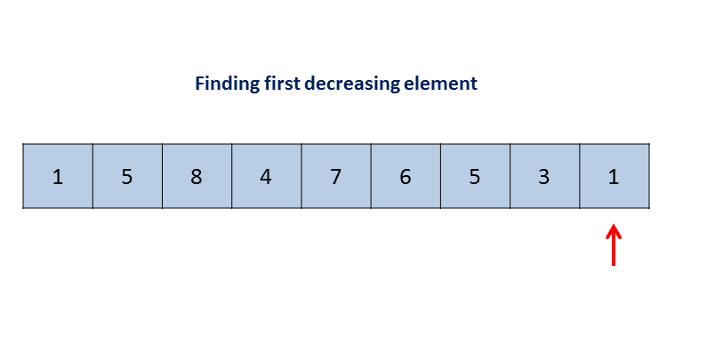
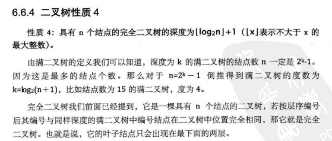
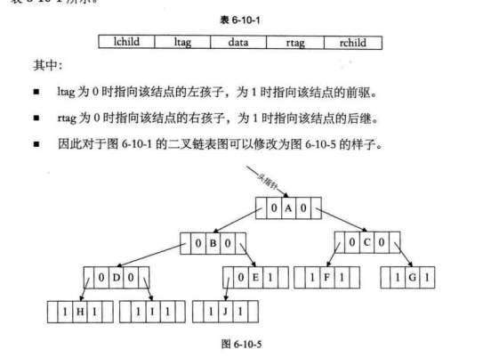
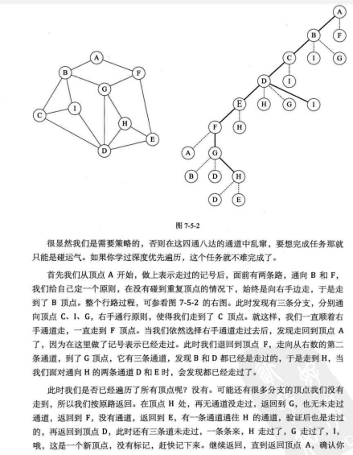
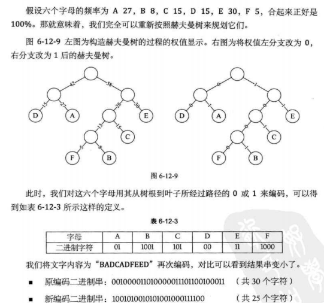
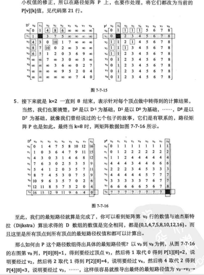
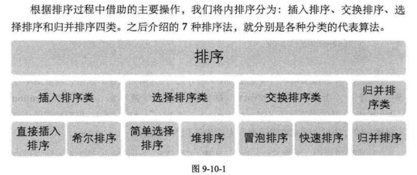
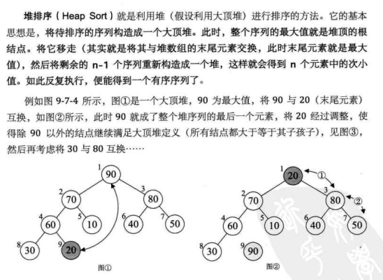
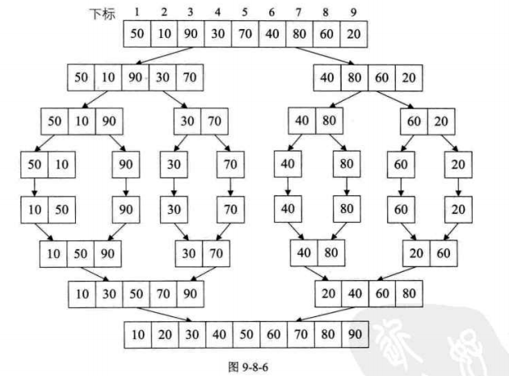

# C++数据结构与算法
- [1.简介](#1)
- [2.算法与数据结构实现](#2)
- [3.leetcode记录](#3)
- [4.大话数据结构](#4)
- [5.大话算法](#5)

参考链接：   
1.数据结构和算法博客   
https://www.cnblogs.com/skywang12345/p/3603935.html   

## <a id="1">1.简介</a>
```cpp
数据结构
线性
  栈
  队列 双端队列 循环队列 优先队列
  散列表 哈希表
  
非线性结构
	二叉树 满二叉树 完全二叉树 二叉树自平衡(红黑树，AVL树，树堆)
	深度优先遍历：前序 中序 后序  广度优先遍历：层序
	二叉堆(最小堆最小在最上面，最大堆最大在最上面。利用完全二叉树交换最后面一个)----可实现优先队列
	
算法
排序算法
	冒泡 选择 插入 希尔O(n2)
	快速 并归 堆 O(nlogn)
	计数 桶 基数 复杂度线性
		冒泡：优化可能后半有序，可设置标志位推出，保存最后一次值下次跳过 起始值跳过。
		鸡尾酒排序：比较交换双向，类似钟摆，先是左到右，后是右到左。减少排序回合，适用大部分有序。
		插入排序：有序和无序，将无序插入有序，进行移位操作。
		选择：选择最大最右，然后最大的放在右边，依次直到排序完成。
		希尔排序：选择上修改，10数增量5-2-1，每5增量形成一组，每组按大小重新挑选成一个数组，然后再按2-1增量拍寻。
		快速排序：分治冒泡，交换排序，选择基准把数分两边，直到不能分。交换有双边和单边循环。双边除基数，头尾两个指针指向数和基数比较，符合分组移动指针，交换值，直到排序完成。
				单边循环有一个指针进行分组
		堆排序：在二叉堆上进行插入，最后输出。
		计数排序：创建最大-最小范围数组，依次找数在对应下标下加1，最后根据数组大小排序。
		桶排序：创建几个分组桶。(最大-最小)/桶数，分组拍寻。
详细可以去ProgramLearnig找。


面试算法
1.判断是否有环：依次遍历比较之前是否有相同值，或者依次放入hash中看重复值，两个指针一个+1一个+2，比较是否相同，类似速度追寻比较。
计算环长：环头依次找到和环头相等值，或者两个指针相差乘以步数相等即环长。
```

排序  

| 排序算法 | 平均时间复杂度 | 最差时间复杂度 | 空间复杂度 | 数据对象稳定性 |
| -------- | -------------- | -------------- | ---------- | -------------------- |
| 冒泡排序 | O(n2)          | O(n2)          | O(1)       | 稳定               |
| 选择排序 | O(n2)          | O(n2)          | O(1)       | 数组不稳定、链表稳定 |
| 插入排序 | O(n2)          | O(n2)          | O(1)       | 稳定               |
| 快速排序 | O(n*log2n)     | O(n2)          | O(log2n)   | 不稳定            |
| 堆排序 | O(n*log2n)     | O(n*log2n)     | O(1)       | 不稳定            |
| 归并排序 | O(n*log2n)     | O(n*log2n)     | O(n)       | 稳定               |
| 希尔排序 | O(n*log2n)     | O(n2)          | O(1)       | 不稳定            |
| 计数排序 | O(n+m)         | O(n+m)         | O(n+m)     | 稳定               |
| 桶排序 | O(n)           | O(n)           | O(m)       | 稳定               |
| 基数排序 | O(k*n)         | O(n2)          |            | 稳定               |

均按从小到大排列   
k：代表数值中的 “数位” 个数   
n：代表数据规模   
m：代表数据的最大值减最小值   

查找  

| 查找算法                 | 平均时间复杂度 | 空间复杂度 | 查找条件 | 数据对象稳定性 |
| ---------------------------- | ---------------- | ---------- | ---------- | -------------------- |
| 顺序查找                 | O(n)             | O(1)       | 无序或有序 | 稳定               |
| 二分查找（折半查找） | O(log2n)         | O(1)       | 有序     | 数组不稳定、链表稳定 |
| 插值查找                 | O(log2(log2n))   | O(1)       | 有序     | 稳定               |
| 斐波那契查找           | O(log2n)         | O(1)       | 有序     | 不稳定            |
| 哈希查找                 | O(1)             | O(n)       | 无序或有序 | 不稳定            |
| 二叉查找树（二叉搜索树查找） | O(log2n)         |            |            | 稳定               |
| 红黑树                    | O(log2n)         |            |            | 不稳定            |
| 2-3树                       | O(log2n - log3n) |            |            | 稳定               |
| B树/B+树                   | O(log2n)         |            | B树/B+树 | 稳定               |
|                              |                  |            |            | 稳定               |

图搜索算法   

| 图搜索算法 | 数据结构 | 遍历时间复杂度 | 空间复杂度 |
| --------------- | ---------- | --------------- | ---------- |
| BFS广度优先搜索 | 邻接矩阵 | BFS广度优先搜索 | 邻接矩阵 |
| 邻接链表    | O(|v|2)    | 邻接链表    | O(|v|2)    |
| O(|v|+|E|)      | O(|v|2)    | O(|v|+|E|)      | O(|v|2)    |
| O(|v|+|E|)      | O(|v|+|E|) | O(|v|+|E|)      | O(|v|+|E|) |
| DFS深度优先搜索 | 邻接矩阵 | DFS深度优先搜索 | 邻接矩阵 |
| 邻接链表    | O(|v|2)    | 邻接链表    | O(|v|2)    |
| O(|v|+|E|)      | O(|v|2)    | O(|v|+|E|)      | O(|v|2)    |
| O(|v|+|E|)      | O(|v|+|E|) | O(|v|+|E|)      | O(|v|+|E|) |

其他算法     

| 算法   | 思想                                                                                                             | 应用                                                 |
| -------- | ------------------------------------------------------------------------------------------------------------------ | ------------------------------------------------------ |
| 分治法 | 把一个复杂的问题分成两个或更多的相同或相似的子问题，直到最后子问题可以简单的直接求解，原问题的解即子问题的解的合并 | 循环赛日程安排问题、排序算法（快速排序、归并排序） |
| 动态规划 | 通过把原问题分解为相对简单的子问题的方式求解复杂问题的方法，适用于有重叠子问题和最优子结构性质的问题 | 背包问题、斐波那契数列                      |
| 贪心法 | 一种在每一步选择中都采取在当前状态下最好或最优（即最有利）的选择，从而希望导致结果是最好或最优的算法 | 旅行推销员问题（最短路径问题）、最小生成树、哈夫曼编码 |


## <a id="2">2.算法与数据结构实现</a>
- [2.1算法与数据结构实现](#2.1)
- [2.2单向链表基本操作](#2.2)


### <a id="2.1">2.1二叉查找树插入和显示</a>
```cpp
二叉树基本结构：
struct TreeList
{
    int data;
    struct TreeList * p_leftleaf;
    struct TreeList * p_rightleaf;
};
二叉查找树：左边小于根节点，右边大于根节点
插入数据方法：
1.通过调用递归函数方法插入数据，一个个找数据，大于右边或者小于左边并为0则插入左边，否则不为0则递归调用
2.通过一个中间指针循环找出适合插入得根结点，最后插入
显示数据方法：左 中 右 也是递归方法
printf("\n data = %d", p_leaf->data);
ShowTreeDataPre(p_leaf->p_leftleaf);
ShowTreeDataPre(p_leaf->p_rightleaf);
```

### <a id="2.2">2.2单向链表基本操作</a>
```cpp
单向链表基础结构：
truct NodeList
{
    int data;
    struct NodeList * p_next;
};

链表插入数据：找到next尾部为0，在next指向插入malloc数据。

在指定位置插入数据：一次查找到指定位置，p_temp = p_ptr->p_next;p_ptr = p_ptr->p_next;插入数据。
查找数据返回位置：指针一次查找，返回位置
升序或降序排序：两个指针指向，依次指向为非0，比较大小冒泡排序
显示数据：指针依次找为非0，依次打印
删除：指针得指针

while(0 != *p_head)
{
    p_ptr = *p_head;
    *p_head = (*p_head)->p_next;
    free(p_ptr);
}
```

## <a id="3">3.eetcode记录</a>

### 1.求数组中和为目标值得
```cpp
1.暴力法，是依次找和为目标值
2从开头，找目标值-第一个值
3.用key value
4.用这样方式
while (low < high){
    if (numbers[low] + numbers[high] == target){
        result.push_back(low+1);
        result.push_back(high+1);
        return result;
    }else{
        numbers[low] + numbers[high] > target ? high-- : low++;
    }
}
如果是求三个数和，可以安装两个和。或者先排序再计算和。
```

### 2 求数组中最长不含重复字符长度
比如aijhgkab，就是a到a。从第一位开始，计算到末尾出现重复长度，保存最长长度。

### 3 求整形数据反转
比如198 891。198/10 =8，sum = 8*10,依次整除直到为0.while（x!=0）

### 4 求两个有序数组中位数
首先判断两个数组为0情况，计算A数组中间值在B组得位置，如果位置值等于两个数组得和一半，即为中间值。如果不等于一半，需要减少一个值计算中间值。如果位置值大于两个数组和，需要递归计算到正确得中间值。如果位置值小于两个数组之和，需要递归计算到正确中间值。
### 5 最长回文子串
求一个字符串最长回文子串，1232134即为12321长度。方法1从1开始遍历找到下一个相同得。方法2字符串反转再求公共字符串。方法3中心扩展，即一个数前后比较。方法4假设回文长度为1~n进行查找比较是否存在。方法5动态规划法即123321是 2332也是依次。

### 6 字符串进行反转
字符串反转，asdfg变成gfdsa，方法1首尾交换，依次交换即可反转。

### 7正则表达式匹配
匹配正则表达式和是字符串是否相同，.*用指针比较，是否相等。叠加比较。

### 8 计算一系列线段包围最大面积
盛最多水的容器，暴力法从1开始计算面积。

### 9 括号生成
```cpp
方法1暴力法检查是否有效。   
方法2递归
void generator(vector<string>& result, int left, int right, string s){
    if (left==0 && right==0){
        result.push_back(s);
        return;
    }
    if (left>0){
        generator(result, left-1, right, s+'(');
    }
    if (right>0 && right>left){
        generator(result, left, right-1, s+')');
    }
}
```

### 10 移除相同元素
```cpp
排序后进行查找，
int removeElement(vector<int>& nums, int val) {
    int pos = 0;
    for (int i=0; i<nums.size(); i++){
        if (nums[i] != val){
            nums[pos++] = nums[i]; 
        }
    }
    return pos;
}

int removeElement(int A[], int n, int elem) {
    int tail = n-1;
    int i = 0;
    while ( i<=tail ){
        if (A[i]==elem){
            A[i] = A[tail--];
            continue;
        }
        i++;
    }
    return tail+1;
}
将后面的排在后面或者将尾部排在后面
```

### 11 下一个数
1234  1243  
方法1 暴力法  
方法2 一遍扫描  



1往后找到两是下降的4比7小。再往找比4大最接近5交换

### 12 组合总和
计算一个数组中和为目标的总和  

递归法


### 13 缺失的第一个正数
给定一个未排序的整数数组，找出其中没有出现的最小的正整数。方法1 排序之后再查找一下

方法2.桶排序，比较索引上得值，放在合适位置上，到时候比较位置上值和索引值，不合适得即为  
方法3 如果 a ^ b = c ，那么 a ^ c = b 与 b ^ c = a 同时成立，利用这一条，可以用于交换两个变量的值。  

### 14 接雨水
给定 n 个非负整数表示每个宽度为 1 的柱子的高度图，计算按此排列的柱子，下雨之后能接多少雨水。输入: [0,1,0,2,1,0,1,3,2,1,2,1]
输出: 6


```cpp
方法1 按行求
整个思路就是，求第 i 层的水，遍历每个位置，如果当前的高度小于 i，并且两边有高度大于等于 i 的，说明这个地方一定有水，水就可以加 11。

方法2 按列求
初始化 ans=0ans=0
从左向右扫描数组：
初始化 {max_left}=0max_left=0 和 {max_right}=0max_right=0
从当前元素向左扫描并更新：
{max_left}=\max({max_left},{height}[j])max_left=max(max_left,height[j])
从当前元素向右扫描并更新：
{max_right}=\max({max_right},{height}[j])max_right=max(max_right,height[j])
将\min({max_left},{max_right}) - {height}[i]min(max_left,max_right)−height[i] 累加到 {ans}ans

方法3
找到数组中从下标 i 到最左端最高的条形块高度 {left\_max}left_max。
找到数组中从下标 i 到最右端最高的条形块高度 {right\_max}right_max。

扫描数组 {height}height 并更新答案：
累加 \min({max\_left}[i],{max\_right}[i]) - {height}[i]min(max_left[i],max_right[i])−height[i] 到 ansans 上
```

### 15 跳跃游戏
给定一个非负整数数组，你最初位于数组的第一个位置。数组中的每个元素代表你在该位置可以跳跃的最大长度。你的目标是使用最少的跳跃次数到达数组的最后一个位置。

方法1 计算每一步内能达到最长长度 ，然后下一步依次到最后一步  
方法2 计算每一步到最后一步最短长度，暴力法  

### 15 图像数组旋转90度
```cpp
方法1 单次循环中旋转 4 个矩形
for( int i=0; i<n/2; i++ ){
    int low=i, high=n-i-1;
    for (int j=low; j<high; j++){
        int tmp;
        tmp = matrix[i][j];
        // left to top 
        matrix[i][j] = matrix[n-j-1][i];
        // bottom to left
        matrix[n-j-1][i] = matrix[n-i-1][n-j-1];
        // right to bottom
        matrix[n-i-1][n-j-1] = matrix[j][n-i-1];
        // top to right
        matrix[j][n-i-1] = tmp;
    }
}
```

### 16 N皇后问题
n 皇后问题研究的是如何将 n 个皇后放置在 n×n 的棋盘上，并且使皇后彼此之间不能相互攻击。

方法1 依次排除前后下上   
方法2 约束编程 它的基本含义是在放置每个皇后以后增加限制。当在棋盘上放置了一个皇后后，立即排除当前行，列和对应的两个对角线。该过程传递了 约束 从而有助于减少需要考虑情况数。

### 17求数组合并区间
方法1 数组根据start数进行排序进行合并

### 18 旋转链表
输入: 1->2->3->4->5->NULL, k = 2  
输出: 4->5->1->2->3->NULL  
方法1：找到断点k = k%len，然后后面的作为head 前面移到末尾  

### 19 不同路径动态规划
个机器人位于一个 m x n 网格的左上角 （起始点在下图中标记为“Start” ）。机器人每次只能向下或者向右移动一步。机器人试图达到网格的右下角（在下图中标记为“Finish”）。问总共有多少条不同的路径？  

```cpp
方法1 动态规划 
vector< vector <int> >  dp (n, vector<int>(m, 1));
    for (int row=1; row<n; row++) {
        for (int col=1; col<m; col++) {
            dp[row][col] = dp[row-1][col] + dp[row][col-1];
        }
    }
return dp[n-1][m-1];

障碍物
如果第一个格点 obstacleGrid[0,0] 是 1，说明有障碍物，那么机器人不能做任何移动，我们返回结果 0。
否则，如果 obstacleGrid[0,0] 是 0，我们初始化这个值为 1 然后继续算法。

遍历第一行，如果有一个格点初始值为 1 ，说明当前节点有障碍物，没有路径可以通过，设值为 0 ；否则设这个值是前一个节点的值 obstacleGrid[i,j] = obstacleGrid[i,j-1]。
遍历第一列，如果有一个格点初始值为 1 ，说明当前节点有障碍物，没有路径可以通过，设值为 0 ；否则设这个值是前一个节点的值 obstacleGrid[i,j] = obstacleGrid[i-1,j]。
现在，从 obstacleGrid[1,1] 开始遍历整个数组，如果某个格点初始不包含任何障碍物，就把值赋为上方和左侧两个格点方案数之和 obstacleGrid[i,j] = obstacleGrid[i-1,j] + obstacleGrid[i,j-1]。
如果这个点有障碍物，设值为 0 ，这可以保证不会对后面的路径产生贡献。
```

最小路径和
暴力  


二维动态规划  


### 20 求平方根
```cpp
res = (res + x / res) / 2多执行几次既可以
( 4 + 2/ 4 ) / 2 = 2.25
( 2.25 + 2/ 2.25 ) / 2 = 1.56944..
( 1.56944..+ 2/1.56944..) / 2 = 1.42189..
( 1.42189..+ 2/1.42189..) / 2 = 1.41423..
```

### 21 求路径
/a/./b/../../c/  
利用堆栈的原理去解决  

### 22 编辑距离
给定两个单词 word1 和 word2，计算出将 word1 转换成 word2 所使用的最少操作数 。  

```cpp
动态规划
//Dynamic Programming
int row, col;
for (row=1; row<m.size(); row++) {
    for(col=1; col<m[row].size(); col++){
        if (word1[row-1] == word2[col-1] ){
            m[row][col] = m[row-1][col-1];
        }else{
            int minValue = min(m[row-1][col-1], m[row-1][col],  m[row][col-1]);
            m[row][col] = minValue + 1;
        }
    }
}
```


### 23 最小覆盖子串
给你一个字符串 S、一个字符串 T，请在字符串 S 里面找出：包含 T 所有字母的最小子串。

方法1采用窗口得方法，即用两个指针依次排查，一前一后。  
初始，leftleft指针和rightright指针都指向SS的第一个元素.   
将 rightright 指针右移，扩张窗口，直到得到一个可行窗口，亦即包含TT的全部字母的窗口。得到可行的窗口后，将lefttleftt指针逐个右移，若得到的窗口依然可行，则更新最小窗口大小。若窗口不再可行，则跳转至 22。  

### 24 组合
给定两个整数 n 和 k，返回 1 ... n 中所有可能的 k 个数的组合。

方法1 依次排列出来  
方法2 利用字典 00011 对应所有数字   

### 25 柱状图中最大的矩形
方法1 暴力法求解  
放法2 分治  

算法
通过观察，可以发现，最大面积矩形存在于以下几种情况：
确定了最矮柱子以后，矩形的宽尽可能往两边延伸。
在最矮柱子左边的最大面积矩形（子问题）。
在最矮柱子右边的最大面积矩形（子问题）。

举个例子：
[6, 4, 5, 2, 4, 3, 9]
这里最矮柱子高度为 2 。以 2 为高的最大子矩阵面积是 2x7=14 。现在，我们考虑上面提到的第二种和第三种情况。我们对高度为 2 柱子的左边和右边采用同样的过程。在 2 的左边， 4 是最小的，形成区域为 4x3=12 。将左边区域再继续分，矩形的面积分别为 6x1=6 和 5x1=5 。同样的，我们可以求出右边区域的面积为 3x3=9, 4x1=4 和 9x1=9 。因此，我们得到最大面积是 16 。

方法3 栈  
在这种方法中，我们维护一个栈。一开始，我们把 -1 放进栈的顶部来表示开始。初始化时，按照从左到右的顺序，我们不断将柱子的序号放进栈中，直到遇到相邻柱子呈下降关系，也就是 a[i-1] > a[i]a[i−1]>a[i] 。现在，我们开始将栈中的序号弹出，直到遇到 stack[j]stack[j] 满足a\big[stack[j]\big] \leq a[i]a[stack[j]]≤a[i] 。每次我们弹出下标时，我们用弹出元素作为高形成的最大面积矩形的宽是当前元素与 stack[top-1]stack[top−1] 之间的那些柱子。也就是当我们弹出 stack[top]stack[top] 时，记当前元素在原数组中的下标为 i ，当前弹出元素为高的最大矩形面积为：

(i-stack[top-1]-1) \times a\big[stack[top]\big].  
(i−stack[top−1]−1)×a[stack[top]].  
更进一步，当我们到达数组的尾部时，我们将栈中剩余元素全部弹出栈。在弹出每一个元素是，我们用下面的式子来求面积： (stack[top]-stack[top-1]) \times a\big[stack[top]\big](stack[top]−stack[top−1])×a[stack[top]]，其中，stack[top]stack[top]表示刚刚被弹出的元素。因此，我们可以通过每次比较新计算的矩形面积来获得最大的矩形面积。  


### 26 格雷编码
格雷编码是一个二进制数字系统，在该系统中，两个连续的数值仅有一个位数的差异。  
给定一个代表编码总位数的非负整数 n，打印其格雷编码序列。格雷编码序列必须以 0 开头  


就是在前面依次加 0 1 叠加就可以

### 27 交错字符串
给定三个字符串 s1, s2, s3, 验证 s3 是否是由 s1 和 s2 交错组成的。输入: s1 = "aabcc", s2 = "dbbca", s3 = "aadbbcbcac"
输出: true

方法1 暴力法列举所有得可能性  
方法2 利用队列得方法，有相同得取出即可，都没有就报错。  
方法3 动态规划  

### 28 二叉树展开为链表
```cpp
给定一个二叉树，原地将它展开为链表。
*          1
*         / \
*        2   5
*       / \   \
*      3   4   6    

*    1
*     \
*      2
*       \
*        3
*         \
*          4
*           \
*            5
*             \
*              6

方法1 递归依次计算

方法2 
将左子树插入到右子树的地方
将原来的右子树接到左子树的最右边节点
考虑新的右子树的根节点，一直重复上边的过程，直到新的右子树为 null
```

### 29 不同的子序列
```cpp
给定一个字符串 S 和一个字符串 T，计算在 S 的子序列中 T 出现的个数。
一个字符串的一个子序列是指，通过删除一些（也可以不删除）字符且不干扰剩余字符相对位置所组成的新字符串。（例如，"ACE" 是 "ABCDE" 的一个子序列，而 "AEC" 不是）

方法1 暴力法
方法2 动态规划 
从0到字符串的长度，即需要一个  dp[ t.size()+1 ] [ s.size()+1 ]  的矩阵。其中，dp[ i ][ j ] 代表当字符串 s 走到 j 位置，字符串 t 走到 i 位置， 有多少次匹配。

其中暴力递归中 
dfs(res, s, t, i, j+1)  对应  dp[ i ][ j ] = dp[ i ][ j-1 ]， 
dfs(res, s, t, i+1, j+1)  对应  dp[ i ][ j ] += dp[ i-1 ][ j-1 ]。
初始化第一行的意义是字符串 s 匹配空字符串的结果， 结果为 1 。
S = "babgbag", T = "bag" 时的 dp 矩阵
```


即遇到相同得计算左边和左边上面和之值，不相同得话保持相同值。

### 30 单词接龙
给定两个单词（beginWord 和 endWord）和一个字典 wordList，找出所有从 beginWord 到 endWord 的最短转换序列。转换需遵循如下规则：   

```cpp
每次转换只能改变一个字母。
转换过程中的中间单词必须是字典中的单词。
beginWord = "hit",
endWord = "cog",
wordList = ["hot","dot","dog","lot","log","cog"]
输出
[
  ["hit","hot","dot","dog","cog"],
  ["hit","hot","lot","log","cog"]
]
利用map或者堆栈进行记录所有路线
```

### 31 分发糖果
老师想给孩子们分发糖果，有 N 个孩子站成了一条直线，老师会根据每个孩子的表现，预先给他们评分。你需要按照以下要求，帮助老师给这些孩子分发糖果：  
每个孩子至少分配到 1 个糖果。相邻的孩子中，评分高的孩子必须获得更多的糖果。

方法1 暴力法，先都赋值1 依次比较 增加   
方法2 用两个数组，一个从左，一个从右比较。大于就加1 ，然后两个数组比较，取大的。即满足要求   

### 32 LRU缓存机制
LRU是Least Recently Used的缩写，即最近最少使用，是一种常用的页面置换算法，选择最近最久未使用的页面予以淘汰。该算法赋予每个页面一个访问字段，用来记录一个页面自上次被访问以来所经历的时间 t，当须淘汰一个页面时，选择现有页面中其 t 值最大的，即最近最少使用的页面予以淘汰。

支持以下操作： 获取数据 get 和 写入数据 put 。  
获取数据 get(key) - 如果密钥 (key) 存在于缓存中，则获取密钥的值（总是正数），否则返回 -1。  
写入数据 put(key, value) - 如果密钥不存在，则写入其数据值。当缓存容量达到上限时，它应该在写入新数据之前删除最近最少使用的数据值，从而为新的数据值留出空间。  
就是双向链表 key-vlaue 去除最后一个  

### 33 直线上最多的点数
给定一个二维平面，平面上有 n 个点，求最多有多少个点在同一条直线上。    
方法 ：暴力查找法   

### 34 逆波兰表达式求值
根据逆波兰表示法，求表达式的值。  
有效的运算符包括 +, -, *, / 。每个运算对象可以是整数，也可以是另一个逆波兰表达式。  

### 35 股票买卖
方法1 暴力穷举法   
方法2 现在，我们完成了「状态」的穷举，我们开始思考每种「状态」有哪些「选择」，应该如何更新「状态」。只看「持有状态」，可以画个状态转移图。   


```cpp
通过这个图可以很清楚地看到，每种状态（0 和 1）是如何转移而来的。根据这个图，我们来写一下状态转移方程：
dp[i][k][0] = max(dp[i-1][k][0], dp[i-1][k][1] + prices[i])
              max(   选择 rest  ,           选择 sell      )

解释：今天我没有持有股票，有两种可能：
要么是我昨天就没有持有，然后今天选择 rest，所以我今天还是没有持有；
要么是我昨天持有股票，但是今天我 sell 了，所以我今天没有持有股票了。
dp[i][k][1] = max(dp[i-1][k][1], dp[i-1][k-1][0] - prices[i])
              max(   选择 rest  ,           选择 buy         )

解释：今天我持有着股票，有两种可能：
要么我昨天就持有着股票，然后今天选择 rest，所以我今天还持有着股票；
要么我昨天本没有持有，但今天我选择 buy，所以今天我就持有股票了。

这个解释应该很清楚了，如果 buy，就要从利润中减去 prices[i]，如果 sell，就要给利润增加 prices[i]。今天的最大利润就是这两种可能选择中较大的那个。而且注意 k 的限制，我们在选择 buy 的时候，把 k 减小了 1，很好理解吧，当然你也可以在 sell 的时候减 1，一样的。

现在，我们已经完成了动态规划中最困难的一步：状态转移方程。如果之前的内容你都可以理解，那么你已经可以秒杀所有问题了，只要套这个框架就行了。不过还差最后一点点，就是定义 base case，即最简单的情况。

dp[-1][k][0] = 0
解释：因为 i 是从 0 开始的，所以 i = -1 意味着还没有开始，这时候的利润当然是 0 。
dp[-1][k][1] = -infinity
解释：还没开始的时候，是不可能持有股票的，用负无穷表示这种不可能。
dp[i][0][0] = 0
解释：因为 k 是从 1 开始的，所以 k = 0 意味着根本不允许交易，这时候利润当然是 0 。
dp[i][0][1] = -infinity
解释：不允许交易的情况下，是不可能持有股票的，用负无穷表示这种不可能。

把上面的状态转移方程总结一下：
base case：
dp[-1][k][0] = dp[i][0][0] = 0
dp[-1][k][1] = dp[i][0][1] = -infinity
状态转移方程：
dp[i][k][0] = max(dp[i-1][k][0], dp[i-1][k][1] + prices[i])
dp[i][k][1] = max(dp[i-1][k][1], dp[i-1][k-1][0] - prices[i])
```

### 36 最短回文串
给定一个字符串 s，你可以通过在字符串前面添加字符将其转换为回文串。找到并返回可以用这种方式转换的最短回文串。   
示例 1:  
输入: "aacecaaa"  
输出: "aaacecaaa"  

方法1 暴力法找到最短回文字符串然后反转添加头或者尾   
方法2 双指针递归方法  
方法3 kmp Knuth-Morris-Pratt 字符串查找算法，简称为 “KMP算法”，常用于在一个文本串S内查找一个模式串P 的出现位置，这个算法由Donald Knuth、Vaughan Pratt、James H. Morris三人于1977年联合发表，故取这3人的姓氏命名此算法。即用前缀和后缀进行比较或者进行反转进行比较    

### 37 寻找重复数
给定一个包含 n + 1 个整数的数组 nums，其数字都在 1 到 n 之间（包括 1 和 n），可知至少存在一个重复的整数。假设只有一个重复的整数，找出这个重复的数。  

方法1 排完序之后再找  
方法2 利用key vvlue  
方法3 弗洛伊德的乌龟和兔子（循环检测）  


双指针，两个一个指向index，慢慢比较两个值

### 38 Nim 游戏
你和你的朋友，两个人一起玩 Nim 游戏：桌子上有一堆石头，每次你们轮流拿掉 1 - 3 块石头。 拿掉最后一块石头的人就是获胜者。你作为先手。   

你们是聪明人，每一步都是最优解。 编写一个函数，来判断你是否可以在给定石头数量的情况下赢得游戏。   
如果堆中石头的数量 nn 不能被 44 整除，那么你总是可以赢得 Nim 游戏的胜利。   

推理   
让我们考虑一些小例子。显而易见的是，如果石头堆中只有一块、两块、或是三块石头，那么在你的回合，你就可以把全部石子拿走，从而在游戏中取胜。而如果就像题目描述那样，堆中恰好有四块石头，你就会失败。因为在这种情况下不管你取走多少石头，总会为你的对手留下几块，使得他可以在游戏中打败你。因此，要想获胜，在你的回合中，必须避免石头堆中的石子数为 4 的情况。

同样地，如果有五块、六块、或是七块石头，你可以控制自己拿取的石头数，总是恰好给你的对手留下四块石头，使他输掉这场比赛。但是如果石头堆里有八块石头，你就不可避免地会输掉，因为不管你从一堆石头中挑出一块、两块还是三块，你的对手都可以选择三块、两块或一块，以确保在再一次轮到你的时候，你会面对四块石头。

显然，它以相同的模式不断重复 n=4,8,12,16,\dotsn=4,8,12,16,…，基本可以看出是 44 的倍数。

### 39数据流的中位数
方法1 将数字存储在可调整大小的容器中。每次需要输出中间值时，对容器进行排序并输出中间值。

方法2 插入排序 保持容易排序  

方法3 用两个堆，保持两个堆平衡  

### 40 判断是否是4的倍数
与01010101比较   

### 41 最大单词长度乘积
给定一个字符串数组 words，找到 length(word[i]) * length(word[j]) 的最大值，并且这两个单词不含有公共字母。你可以认为每个单词只包含小写字母。如果不存在这样的两个单词，返回 0。  

示例 1:    
输入: ["abcw","baz","foo","bar","xtfn","abcdef"]     
输出: 16    

解释: 这两个单词为 "abcw", "xtfn"。   
方法1 用00000000000  代表每一个字母 然后或一下   

### 42 拼接最大数
给定长度分别为 m 和 n 的两个数组，其元素由 0-9 构成，表示两个自然数各位上的数字。现在从这两个数组中选出 k (k <= m + n) 个数字拼接成一个新的数，要求从同一个数组中取出的数字保持其在原数组中的相对顺序。

求满足该条件的最大数。结果返回一个表示该最大数的长度为 k 的数组。  

```cpp
示例 1:
输入:
nums1 = [3, 4, 6, 5]
nums2 = [9, 1, 2, 5, 8, 3]
k = 5
输出:
[9, 8, 6, 5, 3]
方法1 依次从两个数组中找到k k-i个数最大数 用一个数组循环从1 到k进行查找比较
```

### 43 求一个二叉树和
```java
public int pathSum(TreeNode root, int sum) {
    if(root == null) return 0;
    return helper(root, sum) + pathSum(root.left, sum) + pathSum(root.right, sum);
}
int helper(TreeNode root, int sum){
    if(root == null) return 0;
    sum -= root.val;
    return (sum == 0 ? 1 : 0) + helper(root.left, sum) + helper(root.right, sum);
}
```

### 44 求一个字符串中匹配子符串
思路1：穷举法，依次比较比较值是否相等。   
思路2：计算每个字母对应得hashcode值，然后比较hash值。可能存在重复值可以用8421位代替，计算值比较大。  

## <a id="4">4.大话数据结构</a>
- [4.1基础](#4.1)
- [4.2线性表](#4.2)
- [4.3栈和队列](#4.3)
- [4.4树](#4.4)
- [4.5图](#4.5)


### <a id="4.1">4.1基础</a>
时间复杂度：选择复杂度最大得。      


### <a id="4.2">4.2线性表</a>
零个或多个数据元素有限序列。   

#### 1.线性表的顺序存储结构
用数组存放数据，支持插入删除等操作，都是前后数据进行操作。优点：可以快速存取元素，缺点：插入删除需要移动大量元素容易造成存储碎片难以确定存储空间容量。   


#### 2.线性表的链式存储结构----单链表
节点node由数据域和指针域组成。   

只包含一个指针域叫单链表。插入需要malloc，删除需要free。删除插入需要找到依次找到相关位置才能插入删除。当不知道位置时候顺序和链式区别不大， 但是链表操作指针比较效率高。  
整表创建一种是头插法，在头插入即将数据插入头和第二个之间。还有一种尾插法，可以找到尾部再插入或者用r临时指针依次插入next再赋值r给需要插入值。  
整表删除一种是删除从头后面临时r得的值，依次删除，先保存r的next地址，再删除r。再赋值。

静态链表是用数组实现，动态链表是指针。指针域是数组下标域。

```c
/*  随机产生n个元素的值，建立带表头结点的单链线性表L（头插法） */
void CreateListHead(LinkList *L, int n) 
{
	LinkList p;
	int i;
	srand(time(0));                         /* 初始化随机数种子 */
	*L = (LinkList)malloc(sizeof(Node));
	(*L)->next = NULL;                      /*  先建立一个带头结点的单链表 */
	for (i=0; i<n; i++) 
	{
		p = (LinkList)malloc(sizeof(Node)); /*  生成新结点 */
		p->data = rand()%100+1;             /*  随机生成100以内的数字 */
		p->next = (*L)->next;    
		(*L)->next = p;						/*  插入到表头 */
	}
}

/*  随机产生n个元素的值，建立带表头结点的单链线性表L（尾插法） */
void CreateListTail(LinkList *L, int n) 
{
	LinkList p,r;
	int i;
	srand(time(0));                      /* 初始化随机数种子 */
	*L = (LinkList)malloc(sizeof(Node)); /* L为整个线性表 */
	r=*L;                                /* r为指向尾部的结点 */
	for (i=0; i<n; i++) 
	{
		p = (Node *)malloc(sizeof(Node)); /*  生成新结点 */
		p->data = rand()%100+1;           /*  随机生成100以内的数字 */
		r->next=p;                        /* 将表尾终端结点的指针指向新结点 */
		r = p;                            /* 将当前的新结点定义为表尾终端结点 */
	}
	r->next = NULL;                       /* 表示当前链表结束 */
}

/* 初始条件：顺序线性表L已存在。操作结果：将L重置为空表 */
Status ClearList(LinkList *L)
{ 
	LinkList p,q;
	p=(*L)->next;           /*  p指向第一个结点 */
	while(p)                /*  没到表尾 */
	{
		q=p->next;
		free(p);
		p=q;
	}
	(*L)->next=NULL;        /* 头结点指针域为空 */
	return OK;
}
```

#### 3.线性表的链式存储结构----循环链表
单链表终点指针指向头结点，形成单循环链表。单循环链表可以通过使用尾指针优化速度，rear->next->next和head->next一个意思。

两个循环链表合并


#### 4.线性表的链式存储结构----双向链表
两个指针域一个前驱一个后驱。双向比单向多了反向遍历，但是插入和删除需要更改两个指针。空间替代时间。


最后free(p)

### <a id="4.3">4.3栈和队列</a>
栈是限定仅在表尾插入删除的线性表。      
栈是一段插入另一端删除的线性表。    

#### 1.栈与共享空间
栈，数组+size组成。

可以用两栈共享空间，一个从0开始一个从尾部开始，两端开始向中间聚集。

#### 2.链栈
栈的链式存储结构和实现，栈顶放在链表头部。进栈就是顶点指向新的节点，节点next到原有节点。出栈就是反的顶点指向next，删除原有的。


#### 3.应用
四则运算，遇到右括号就进栈，遇到左括号就出栈，后缀表示法

   

  

  

  

#### 4.队列
允许插入的是队尾，删除是对头。线性表有顺序和链式两个，循环链式队列判断满一种是等于设置标志位，一种是（rear+1）%size ==front。 计算队列长度（front-rear +size）%size

```c++
typedef struct QNode	/* 结点结构 */
{
   QElemType data;
   struct QNode *next;
}QNode,*QueuePtr;

typedef struct			/* 队列的链表结构 */
{
   QueuePtr front,rear; /* 队头、队尾指针 */
}LinkQueue;

Status visit(QElemType c)
{
	printf("%d ",c);
	return OK;
}

/* 构造一个空队列Q */
Status InitQueue(LinkQueue *Q)
{ 
	Q->front=Q->rear=(QueuePtr)malloc(sizeof(QNode));
	if(!Q->front)
		exit(OVERFLOW);
	Q->front->next=NULL;
	return OK;
}

/* 销毁队列Q */
Status DestroyQueue(LinkQueue *Q)
{
	while(Q->front)
	{
		 Q->rear=Q->front->next;
		 free(Q->front);
		 Q->front=Q->rear;
	}
	return OK;
}

/* 将Q清为空队列 */
Status ClearQueue(LinkQueue *Q)
{
	QueuePtr p,q;
	Q->rear=Q->front;
	p=Q->front->next;
	Q->front->next=NULL;
	while(p)
	{
		 q=p;
		 p=p->next;
		 free(q);
	}
	return OK;
}

/* 若Q为空队列,则返回TRUE,否则返回FALSE */
Status QueueEmpty(LinkQueue Q)
{ 
	if(Q.front==Q.rear)
		return TRUE;
	else
		return FALSE;
}

/* 求队列的长度 */
int QueueLength(LinkQueue Q)
{ 
	int i=0;
	QueuePtr p;
	p=Q.front;
	while(Q.rear!=p)
	{
		 i++;
		 p=p->next;
	}
	return i;
}

/* 若队列不空,则用e返回Q的队头元素,并返回OK,否则返回ERROR */
Status GetHead(LinkQueue Q,QElemType *e)
{ 
	QueuePtr p;
	if(Q.front==Q.rear)
		return ERROR;
	p=Q.front->next;
	*e=p->data;
	return OK;
}


/* 插入元素e为Q的新的队尾元素 */
Status EnQueue(LinkQueue *Q,QElemType e)
{ 
	QueuePtr s=(QueuePtr)malloc(sizeof(QNode));
	if(!s) /* 存储分配失败 */
		exit(OVERFLOW);
	s->data=e;
	s->next=NULL;
	Q->rear->next=s;	/* 把拥有元素e的新结点s赋值给原队尾结点的后继，见图中① */
	Q->rear=s;		/* 把当前的s设置为队尾结点，rear指向s，见图中② */
	return OK;
}

/* 若队列不空,删除Q的队头元素,用e返回其值,并返回OK,否则返回ERROR */
Status DeQueue(LinkQueue *Q,QElemType *e)
{
	QueuePtr p;
	if(Q->front==Q->rear)
		return ERROR;
	p=Q->front->next;		/* 将欲删除的队头结点暂存给p，见图中① */
	*e=p->data;				/* 将欲删除的队头结点的值赋值给e */
	Q->front->next=p->next;/* 将原队头结点的后继p->next赋值给头结点后继，见图中② */
	if(Q->rear==p)		/* 若队头就是队尾，则删除后将rear指向头结点，见图中③ */
		Q->rear=Q->front;
	free(p);
	return OK;
}

/* 从队头到队尾依次对队列Q中每个元素输出 */
Status QueueTraverse(LinkQueue Q)
{
	QueuePtr p;
	p=Q.front->next;
	while(p)
	{
		 visit(p->data);
		 p=p->next;
	}
	printf("\n");
	return OK;
}
```

### <a id="4.4">4.4树</a>
#### 基本概念
度是指节点的叶子节点个数。深度是只高度，根节点是1层。
树的存储方式有三种：双亲表示法，孩子表示法，孩子兄弟表示法。

- 双亲表示法   
  

  

- 孩子表示法   
每个节点可能有多个孩子，每个节点带有多个指针域。   
方案1：   
  

缺点：浪费指针域

方案2：   
  

- 孩子兄弟表示法
节点有左右节点指针域。类似二叉树。

#### 二叉树
满二叉树，完全二叉树。

  

按照满二叉树编号如果缺少就不是完全二叉树，或者从上往下看，缺少得是最下面得左边就是完全二叉树。

- 1.在i层，第i层最多有2^(i-1)-1个节点。    
- 2.深度i，最多有2^i-1个节点。   

  

  

  

  

  

#### 二叉树存储方式与操作方式
一种是左右节点，一种是数组方式。  

前序遍历：根左右   
中序遍历：左根右   
后序遍历：左右根  
层序遍历：从上往下从左到右。   

  

前驱后驱节点由于空指针域导致浪费，所以在遍历得时候修改空指针过程就是线索化。

```c++
#define OK 1
#define ERROR 0
#define TRUE 1
#define FALSE 0

#define MAXSIZE 100 /* 存储空间初始分配量 */

typedef int Status;	/* Status是函数的类型,其值是函数结果状态代码,如OK等 */
typedef char TElemType;
typedef enum {Link,Thread} PointerTag;	/* Link==0表示指向左右孩子指针, */
										/* Thread==1表示指向前驱或后继的线索 */
typedef  struct BiThrNode	/* 二叉线索存储结点结构 */
{
	TElemType data;	/* 结点数据 */
	struct BiThrNode *lchild, *rchild;	/* 左右孩子指针 */
	PointerTag LTag;
	PointerTag RTag;		/* 左右标志 */
} BiThrNode, *BiThrTree;

TElemType Nil='#'; /* 字符型以空格符为空 */

Status visit(TElemType e)
{
	printf("%c ",e);
	return OK;
}

/* 按前序输入二叉线索树中结点的值,构造二叉线索树T */
/* 0(整型)/空格(字符型)表示空结点 */
Status CreateBiThrTree(BiThrTree *T)
{ 
	TElemType h;
	scanf("%c",&h);

	if(h==Nil)
		*T=NULL;
	else
	{
		*T=(BiThrTree)malloc(sizeof(BiThrNode));
		if(!*T)
			exit(OVERFLOW);
		(*T)->data=h; /* 生成根结点(前序) */
		CreateBiThrTree(&(*T)->lchild); /* 递归构造左子树 */
		if((*T)->lchild) /* 有左孩子 */
			(*T)->LTag=Link;
		CreateBiThrTree(&(*T)->rchild); /* 递归构造右子树 */
		if((*T)->rchild) /* 有右孩子 */
			(*T)->RTag=Link;
	}
	return OK;
}

BiThrTree pre; /* 全局变量,始终指向刚刚访问过的结点 */
/* 中序遍历进行中序线索化 */
void InThreading(BiThrTree p)
{ 
	if(p)
	{
		InThreading(p->lchild); /* 递归左子树线索化 */
		if(!p->lchild) /* 没有左孩子 */
		{
			p->LTag=Thread; /* 前驱线索 */
			p->lchild=pre; /* 左孩子指针指向前驱 */
		}
		if(!pre->rchild) /* 前驱没有右孩子 */
		{
			pre->RTag=Thread; /* 后继线索 */
			pre->rchild=p; /* 前驱右孩子指针指向后继(当前结点p) */
		}
		pre=p; /* 保持pre指向p的前驱 */
		InThreading(p->rchild); /* 递归右子树线索化 */
	}
}

/* 中序遍历二叉树T,并将其中序线索化,Thrt指向头结点 */
Status InOrderThreading(BiThrTree *Thrt,BiThrTree T)
{ 
	*Thrt=(BiThrTree)malloc(sizeof(BiThrNode));
	if(!*Thrt)
		exit(OVERFLOW);
	(*Thrt)->LTag=Link; /* 建头结点 */
	(*Thrt)->RTag=Thread;
	(*Thrt)->rchild=(*Thrt); /* 右指针回指 */
	if(!T) /* 若二叉树空,则左指针回指 */
		(*Thrt)->lchild=*Thrt;
	else
	{
		(*Thrt)->lchild=T;
		pre=(*Thrt);
		InThreading(T); /* 中序遍历进行中序线索化 */
		pre->rchild=*Thrt;
		pre->RTag=Thread; /* 最后一个结点线索化 */
		(*Thrt)->rchild=pre;
	}
	return OK;
}

/* 中序遍历二叉线索树T(头结点)的非递归算法 */
Status InOrderTraverse_Thr(BiThrTree T)
{ 
	BiThrTree p;
	p=T->lchild; /* p指向根结点 */
	while(p!=T)
	{ /* 空树或遍历结束时,p==T */
		while(p->LTag==Link)
			p=p->lchild;
		if(!visit(p->data)) /* 访问其左子树为空的结点 */
			return ERROR;
		while(p->RTag==Thread&&p->rchild!=T)
		{
			p=p->rchild;
			visit(p->data); /* 访问后继结点 */
		}
		p=p->rchild;
	}
	return OK;
}

int main()
{
	BiThrTree H,T;
	printf("请按前序输入二叉树(如:'ABDH##I##EJ###CF##G##')\n");
 	CreateBiThrTree(&T); /* 按前序产生二叉树 */
	InOrderThreading(&H,T); /* 中序遍历,并中序线索化二叉树 */
	printf("中序遍历(输出)二叉线索树:\n");
	InOrderTraverse_Thr(H); /* 中序遍历(输出)二叉线索树 */
	printf("\n");
	
	return 0;
}
```

#### 森林、树、二叉树之间转换

  

  

  

  

  

  

### <a id="4.5">4.5图</a>
  

  

无向图指没有方向得，有向图有方向<A，B>。无向n个顶点，n(n-1)/2个边。有向n个顶点，n(n-1)个边。如果边或者顶点加权重，可以称为网。对于无向图，边数就是各顶点度数和得一半。有向图各个顶点入和出顶点数相等。

  

#### 五种存储结构
- 1.邻接矩阵  

  

如果是有向图就不是对称。

  

  

- 2.邻接表   
如果邻边太少，导致很多空间是1，浪费存储空间。可以采取数组和链表相结合的方式。缺点就是想要知道度必须遍历整个表。     

  

  

  

- 3.十字链表   
将邻接矩阵和邻接表结合起来就是十字链表。  

  

  

headlink和taillink是指除去in/out指针后，剩下的指针。   

- 4.邻接多重表
上面的几个都是从顶点去维护查看的。这个是从边进行查看的。    
 

 

- 5.边集数组
两个数组组成，一个保存顶点信息，一个保存边信息。

 

#### 图的遍历
遍历有两种方法：广度优先遍历和深度优先遍历。

##### 深度优先遍历dfs
总体思路就是从一个顶点开始，往右边进行查找，如果有多个节点记录下来，向右查找，如果遇到找过得节点则向其他节点，最后如果连接得节点都找过了则回头去，直到到最后。   

 

 

 

 

##### 广度优先遍历bfs
 

 

 

##### 代码展示
邻接矩阵
```c++
#define OK 1
#define ERROR 0
#define TRUE 1
#define FALSE 0

typedef int Status;	/* Status是函数的类型,其值是函数结果状态代码，如OK等 */  
typedef int Boolean; /* Boolean是布尔类型,其值是TRUE或FALSE */

typedef char VertexType; /* 顶点类型应由用户定义 */
typedef int EdgeType; /* 边上的权值类型应由用户定义 */

#define MAXSIZE 9 /* 存储空间初始分配量 */
#define MAXEDGE 15
#define MAXVEX 9
#define INFINITY 65535

typedef struct
{
	VertexType vexs[MAXVEX]; /* 顶点表 */
	EdgeType arc[MAXVEX][MAXVEX];/* 邻接矩阵，可看作边表 */
	int numVertexes, numEdges; /* 图中当前的顶点数和边数 */ 
}MGraph;

/* 用到的队列结构与函数********************************** */

/* 循环队列的顺序存储结构 */
typedef struct
{
	int data[MAXSIZE];
	int front;    	/* 头指针 */
	int rear;		/* 尾指针，若队列不空，指向队列尾元素的下一个位置 */
}Queue;

/* 初始化一个空队列Q */
Status InitQueue(Queue *Q)
{
	Q->front=0;
	Q->rear=0;
	return  OK;
}

/* 若队列Q为空队列,则返回TRUE,否则返回FALSE */
Status QueueEmpty(Queue Q)
{ 
	if(Q.front==Q.rear) /* 队列空的标志 */
		return TRUE;
	else
		return FALSE;
}

/* 若队列未满，则插入元素e为Q新的队尾元素 */
Status EnQueue(Queue *Q,int e)
{
	if ((Q->rear+1)%MAXSIZE == Q->front)	/* 队列满的判断 */
		return ERROR;
	Q->data[Q->rear]=e;			/* 将元素e赋值给队尾 */
	Q->rear=(Q->rear+1)%MAXSIZE;/* rear指针向后移一位置， */
								/* 若到最后则转到数组头部 */
	return  OK;
}

/* 若队列不空，则删除Q中队头元素，用e返回其值 */
Status DeQueue(Queue *Q,int *e)
{
	if (Q->front == Q->rear)			/* 队列空的判断 */
		return ERROR;
	*e=Q->data[Q->front];				/* 将队头元素赋值给e */
	Q->front=(Q->front+1)%MAXSIZE;	/* front指针向后移一位置， */
									/* 若到最后则转到数组头部 */
	return  OK;
}
/* ****************************************************** */

void CreateMGraph(MGraph *G)
{
	int i, j;

	G->numEdges=15;
	G->numVertexes=9;

	/* 读入顶点信息，建立顶点表 */
	G->vexs[0]='A';
	G->vexs[1]='B';
	G->vexs[2]='C';
	G->vexs[3]='D';
	G->vexs[4]='E';
	G->vexs[5]='F';
	G->vexs[6]='G';
	G->vexs[7]='H';
	G->vexs[8]='I';


	for (i = 0; i < G->numVertexes; i++)/* 初始化图 */
	{
		for ( j = 0; j < G->numVertexes; j++)
		{
			G->arc[i][j]=0;
		}
	}

	G->arc[0][1]=1;
	G->arc[0][5]=1;

	G->arc[1][2]=1; 
	G->arc[1][8]=1; 
	G->arc[1][6]=1; 
	
	G->arc[2][3]=1; 
	G->arc[2][8]=1; 
	
	G->arc[3][4]=1;
	G->arc[3][7]=1;
	G->arc[3][6]=1;
	G->arc[3][8]=1;

	G->arc[4][5]=1;
	G->arc[4][7]=1;

	G->arc[5][6]=1; 
	
	G->arc[6][7]=1; 

	
	for(i = 0; i < G->numVertexes; i++)
	{
		for(j = i; j < G->numVertexes; j++)
		{
			G->arc[j][i] =G->arc[i][j];
		}
	}

}
 
Boolean visited[MAXVEX]; /* 访问标志的数组 */

/* 邻接矩阵的深度优先递归算法 */
void DFS(MGraph G, int i)
{
	int j;
 	visited[i] = TRUE;
 	printf("%c ", G.vexs[i]);/* 打印顶点，也可以其它操作 */
	for(j = 0; j < G.numVertexes; j++)
		if(G.arc[i][j] == 1 && !visited[j])
 			DFS(G, j);/* 对为访问的邻接顶点递归调用 */
}

/* 邻接矩阵的深度遍历操作 */
void DFSTraverse(MGraph G)
{
	int i;
 	for(i = 0; i < G.numVertexes; i++)
 		visited[i] = FALSE; /* 初始所有顶点状态都是未访问过状态 */
	for(i = 0; i < G.numVertexes; i++)
 		if(!visited[i]) /* 对未访问过的顶点调用DFS，若是连通图，只会执行一次 */ 
			DFS(G, i);
}

/* 邻接矩阵的广度遍历算法 */
void BFSTraverse(MGraph G)
{
	int i, j;
	Queue Q;
	for(i = 0; i < G.numVertexes; i++)
       	visited[i] = FALSE;
    InitQueue(&Q);		/* 初始化一辅助用的队列 */
    for(i = 0; i < G.numVertexes; i++)  /* 对每一个顶点做循环 */
    {
		if (!visited[i])	/* 若是未访问过就处理 */
		{
			visited[i]=TRUE;		/* 设置当前顶点访问过 */
			printf("%c ", G.vexs[i]);/* 打印顶点，也可以其它操作 */
			EnQueue(&Q,i);		/* 将此顶点入队列 */
			while(!QueueEmpty(Q))	/* 若当前队列不为空 */
			{
				DeQueue(&Q,&i);	/* 将队对元素出队列，赋值给i */
				for(j=0;j<G.numVertexes;j++) 
				{ 
					/* 判断其它顶点若与当前顶点存在边且未访问过  */
					if(G.arc[i][j] == 1 && !visited[j]) 
					{ 
 						visited[j]=TRUE;			/* 将找到的此顶点标记为已访问 */
						printf("%c ", G.vexs[j]);	/* 打印顶点 */
						EnQueue(&Q,j);				/* 将找到的此顶点入队列  */
					} 
				} 
			}
		}
	}
}

int main(void)
{    
	MGraph G;
	CreateMGraph(&G);
	printf("\n深度遍历：");
	DFSTraverse(G);
	printf("\n广度遍历：");
	BFSTraverse(G);
	return 0;
}
```

邻接表
```c++
#define OK 1
#define ERROR 0
#define TRUE 1
#define FALSE 0

#define MAXSIZE 9 /* 存储空间初始分配量 */
#define MAXEDGE 15
#define MAXVEX 9
#define INFINITY 65535

typedef int Status;	/* Status是函数的类型,其值是函数结果状态代码,如OK等 */
typedef int Boolean; /* Boolean是布尔类型,其值是TRUE或FALSE */

typedef char VertexType; /* 顶点类型应由用户定义 */   
typedef int EdgeType; /* 边上的权值类型应由用户定义 */

/* 邻接矩阵结构 */
typedef struct
{
	VertexType vexs[MAXVEX]; /* 顶点表 */
	EdgeType arc[MAXVEX][MAXVEX];/* 邻接矩阵,可看作边表 */
	int numVertexes, numEdges; /* 图中当前的顶点数和边数 */ 
}MGraph;

/* 邻接表结构****************** */
typedef struct EdgeNode /* 边表结点 */ 
{
	int adjvex;    /* 邻接点域,存储该顶点对应的下标 */
	int weight;		/* 用于存储权值,对于非网图可以不需要 */
	struct EdgeNode *next; /* 链域,指向下一个邻接点 */ 
}EdgeNode;

typedef struct VertexNode /* 顶点表结点 */ 
{
	int in;	/* 顶点入度 */
	char data; /* 顶点域,存储顶点信息 */
	EdgeNode *firstedge;/* 边表头指针 */   
}VertexNode, AdjList[MAXVEX];

typedef struct
{
	AdjList adjList; 
	int numVertexes,numEdges; /* 图中当前顶点数和边数 */
}graphAdjList,*GraphAdjList;
/* **************************** */

/* 用到的队列结构与函数********************************** */
/* 循环队列的顺序存储结构 */
typedef struct
{
	int data[MAXSIZE];
	int front;    	/* 头指针 */
	int rear;		/* 尾指针,若队列不空,指向队列尾元素的下一个位置 */
}Queue;

/* 初始化一个空队列Q */
Status InitQueue(Queue *Q)
{
	Q->front=0;
	Q->rear=0;
	return  OK;
}

/* 若队列Q为空队列,则返回TRUE,否则返回FALSE */
Status QueueEmpty(Queue Q)
{ 
	if(Q.front==Q.rear) /* 队列空的标志 */
		return TRUE;
	else
		return FALSE;
}

/* 若队列未满,则插入元素e为Q新的队尾元素 */
Status EnQueue(Queue *Q,int e)
{
	if ((Q->rear+1)%MAXSIZE == Q->front)	/* 队列满的判断 */
		return ERROR;
	Q->data[Q->rear]=e;			/* 将元素e赋值给队尾 */
	Q->rear=(Q->rear+1)%MAXSIZE;/* rear指针向后移一位置, */
								/* 若到最后则转到数组头部 */
	return  OK;
}

/* 若队列不空,则删除Q中队头元素,用e返回其值 */
Status DeQueue(Queue *Q,int *e)
{
	if (Q->front == Q->rear)			/* 队列空的判断 */
		return ERROR;
	*e=Q->data[Q->front];				/* 将队头元素赋值给e */
	Q->front=(Q->front+1)%MAXSIZE;	/* front指针向后移一位置, */
									/* 若到最后则转到数组头部 */
	return  OK;
}
/* ****************************************************** */


void CreateMGraph(MGraph *G)
{
	int i, j;

	G->numEdges=15;
	G->numVertexes=9;

	/* 读入顶点信息,建立顶点表 */ 
	G->vexs[0]='A';
	G->vexs[1]='B';
	G->vexs[2]='C';
	G->vexs[3]='D';
	G->vexs[4]='E';
	G->vexs[5]='F';
	G->vexs[6]='G';
	G->vexs[7]='H';
	G->vexs[8]='I';


	for (i = 0; i < G->numVertexes; i++)/* 初始化图 */
	{
		for ( j = 0; j < G->numVertexes; j++)
		{
			G->arc[i][j]=0;
		}
	}

	G->arc[0][1]=1;
	G->arc[0][5]=1;

	G->arc[1][2]=1; 
	G->arc[1][8]=1; 
	G->arc[1][6]=1; 
	
	G->arc[2][3]=1; 
	G->arc[2][8]=1; 
	
	G->arc[3][4]=1;
	G->arc[3][7]=1;
	G->arc[3][6]=1;
	G->arc[3][8]=1;

	G->arc[4][5]=1;
	G->arc[4][7]=1;

	G->arc[5][6]=1; 
	
	G->arc[6][7]=1; 

	
	for(i = 0; i < G->numVertexes; i++)
	{
		for(j = i; j < G->numVertexes; j++)
		{
			G->arc[j][i] =G->arc[i][j];
		}
	}

}
 
/* 利用邻接矩阵构建邻接表 */
void CreateALGraph(MGraph G,GraphAdjList *GL)
{
	int i,j;
	EdgeNode *e;

	*GL = (GraphAdjList)malloc(sizeof(graphAdjList));

	(*GL)->numVertexes=G.numVertexes;
	(*GL)->numEdges=G.numEdges;
	for(i= 0;i <G.numVertexes;i++) /* 读入顶点信息,建立顶点表 */   
	{
		(*GL)->adjList[i].in=0;
		(*GL)->adjList[i].data=G.vexs[i];
		(*GL)->adjList[i].firstedge=NULL; 	/* 将边表置为空表 */
	}
	
	for(i=0;i<G.numVertexes;i++) /* 建立边表 */
	{ 
		for(j=0;j<G.numVertexes;j++)
		{
			if (G.arc[i][j]==1)
			{
				e=(EdgeNode *)malloc(sizeof(EdgeNode));
				e->adjvex=j;					/* 邻接序号为j */                         
				e->next=(*GL)->adjList[i].firstedge;	/* 将当前顶点上的指向的结点指针赋值给e */
				(*GL)->adjList[i].firstedge=e;		/* 将当前顶点的指针指向e */   
				(*GL)->adjList[j].in++;
				
			}
		}
	}
	
}

Boolean visited[MAXSIZE]; /* 访问标志的数组 */

/* 邻接表的深度优先递归算法 */
void DFS(GraphAdjList GL, int i)
{
	EdgeNode *p;
 	visited[i] = TRUE;
 	printf("%c ",GL->adjList[i].data);/* 打印顶点,也可以其它操作 */
	p = GL->adjList[i].firstedge;
	while(p)
	{
 		if(!visited[p->adjvex])
 			DFS(GL, p->adjvex);/* 对为访问的邻接顶点递归调用 */
		p = p->next;
 	}
}

/* 邻接表的深度遍历操作 */
void DFSTraverse(GraphAdjList GL)
{
	int i;
 	for(i = 0; i < GL->numVertexes; i++)
 		visited[i] = FALSE; /* 初始所有顶点状态都是未访问过状态 */
	for(i = 0; i < GL->numVertexes; i++)
 		if(!visited[i]) /* 对未访问过的顶点调用DFS,若是连通图,只会执行一次 */ 
			DFS(GL, i);
}

/* 邻接表的广度遍历算法 */
void BFSTraverse(GraphAdjList GL)
{
	int i;
    EdgeNode *p;
	Queue Q;
	for(i = 0; i < GL->numVertexes; i++)
       	visited[i] = FALSE;
    InitQueue(&Q);
   	for(i = 0; i < GL->numVertexes; i++)
   	{
		if (!visited[i])
		{
			visited[i]=TRUE;
			printf("%c ",GL->adjList[i].data);/* 打印顶点,也可以其它操作 */
			EnQueue(&Q,i);
			while(!QueueEmpty(Q))
			{
				DeQueue(&Q,&i);
				p = GL->adjList[i].firstedge;	/* 找到当前顶点的边表链表头指针 */
				while(p)
				{
					if(!visited[p->adjvex])	/* 若此顶点未被访问 */
 					{
 						visited[p->adjvex]=TRUE;
						printf("%c ",GL->adjList[p->adjvex].data);
						EnQueue(&Q,p->adjvex);	/* 将此顶点入队列 */
					}
					p = p->next;	/* 指针指向下一个邻接点 */
				}
			}
		}
	}
}

int main(void)
{    
	MGraph G;  
	GraphAdjList GL;    
	CreateMGraph(&G);
	CreateALGraph(G,&GL);

	printf("\n深度遍历:");
	DFSTraverse(GL);
	printf("\n广度遍历:");
	BFSTraverse(GL);
	return 0;
}
```


## <a id="5">5.大话算法</a>
- [5.1模式匹配算法（字符串）](#5.1)
- [5.2赫夫曼算法（二叉树）](#5.2)
- [5.3最小生成树（图）](#5.3)
- [5.4最短路径（图）](#5.4)
- [5.5拓步排序（图）](#5.5)
- [5.6关键路径（图）](#5.6)
- [5.7查找](#5.7)
- [5.8排序](#5.8)


### <a id="5.1">5.1模式匹配算法</a>
- [5.1.1朴素模式匹配算法](#5.1.1)
- [5.1.2KMP模式匹配算法](#5.1.2)

#### <a id="5.1.1">5.1.1朴素模式匹配算法</a>
比较两个字符串是否相等，朴素模式匹配算法：  

  

```c++
/* 返回子串T在主串S中第pos个字符之后的位置。若不存在,则函数返回值为0。 */
/* 其中,T非空,1≤pos≤StrLength(S)。 */
int Index(String S, String T, int pos) 
{
	int i = pos;	/* i用于主串S中当前位置下标值，若pos不为1，则从pos位置开始匹配 */
	int j = 1;				/* j用于子串T中当前位置下标值 */
	while (i <= S[0] && j <= T[0]) /* 若i小于S的长度并且j小于T的长度时，循环继续 */
	{
		if (S[i] == T[j]) 	/* 两字母相等则继续 */
      	{
			++i;
         	++j; 
      	} 
      	else 				/* 指针后退重新开始匹配 */
      	{  
         	i = i-j+2;		/* i退回到上次匹配首位的下一位 */
         	j = 1; 			/* j退回到子串T的首位 */
      	}      
	}
	if (j > T[0]) 
		return i-T[0];
	else 
		return 0;
}
```

#### <a id="5.1.2">5.1.2KMP模式匹配算法</a>
参考链接：  
1.从头到尾彻底理解KMP   
https://www.cnblogs.com/zhangtianq/p/5839909.html    

思路：

总结就是比较abcdefg  abcdg。由于g和e不等，a又和bcd不等，所有不需要判断，直接右移四位。进行a和e比较进行。后面依次。  
先计算出next数组，再计算出移动位置。改进得方法去除aaaax aaab比较。直接移动到x。

失配时，模式串向右移动的位数为：已匹配字符数 - 失配字符的上一位字符所对应的最大长度值

- 1.移动实列：  
  

- 2.next数组计算公式：  
  

- 3.计算子字符串公共字符串公式：  
  

- 4.子字符串公共字符串与next数组关系：  
  

- 5.next数组实列：  
  

- 6.移动实列：  
  


>改良版：   

  

  

```c
假设现在文本串S（母符串）匹配到 i 位置，模式串P（子符串）匹配到 j 位置.
	如果j = -1，或者当前字符匹配成功（即S[i] == P[j]），都令i++，j++，继续匹配下一个字符；
	如果j != -1，且当前字符匹配失败（即S[i] != P[j]），则令 i 不变，j = next[j]。此举意味着失配时，
	模式串P相对于文本串S向右移动了j - next [j] 位。
		换言之，当匹配失败时，模式串向右移动的位数为：失配字符所在位置 - 失配字符对应的next 值（next 
		数组的求解会在下文的3.3.3节中详细阐述），即移动的实际位数为：j - next[j]，且此值大于等于1。  

int KmpSearch(char* s, char* p)  
{  
    int i = 0;  
    int j = 0;  
    int sLen = strlen(s);  
    int pLen = strlen(p);  
    while (i < sLen && j < pLen)  
    {  
        //①如果j = -1，或者当前字符匹配成功（即S[i] == P[j]），都令i++，j++      
        if (j == -1 || s[i] == p[j])  
        {  
            i++;  
            j++;  
        }  
        else  
        {  
            //②如果j != -1，且当前字符匹配失败（即S[i] != P[j]），则令 i 不变，j = next[j]      
            //next[j]即为j所对应的next值        
            j = next[j];  
        }  
    }  
    if (j == pLen)  
        return i - j;  
    else  
        return -1;  
}  

正常版本：
/* 通过计算返回子串T的next数组。 */
void get_next(String T, int *next) 
{
	int i,j;
  	i=1;
  	j=0;
  	next[1]=0;
  	while (i<T[0])  /* 此处T[0]表示串T的长度 */
 	{
    	if(j==0 || T[i]== T[j]) 	/* T[i]表示后缀的单个字符，T[j]表示前缀的单个字符 */
		{
      		++i;  
			++j;  
			next[i] = j;
    	} 
		else 
			j= next[j];	/* 若字符不相同，则j值回溯 */
  	}
}

/* 返回子串T在主串S中第pos个字符之后的位置。若不存在，则函数返回值为0。 */
/*  T非空，1≤pos≤StrLength(S)。 */
int Index_KMP(String S, String T, int pos) 
{
	int i = pos;		/* i用于主串S中当前位置下标值，若pos不为1，则从pos位置开始匹配 */
	int j = 1;			/* j用于子串T中当前位置下标值 */
	int next[255];		/* 定义一next数组 */
	get_next(T, next);	/* 对串T作分析，得到next数组 */
	while (i <= S[0] && j <= T[0]) /* 若i小于S的长度并且j小于T的长度时，循环继续 */
	{
		if (j==0 || S[i] == T[j]) 	/* 两字母相等则继续，与朴素算法增加了j=0判断 */
      	{
         	++i;
         	++j; 
      	} 
      	else 			/* 指针后退重新开始匹配 */
      	 	j = next[j];/* j退回合适的位置，i值不变 */
	}
	if (j > T[0]) 
		return i-T[0];
	else 
		return 0;
}

改良版本：
/* 求模式串T的next函数修正值并存入数组nextval */
void get_nextval(String T, int *nextval) 
{
  	int i,j;
  	i=1;
  	j=0;
  	nextval[1]=0;
  	while (i<T[0])  /* 此处T[0]表示串T的长度 */
 	{
    	if(j==0 || T[i]== T[j]) 	/* T[i]表示后缀的单个字符，T[j]表示前缀的单个字符 */
		{
      		++i;  
			++j;  
			if (T[i]!=T[j])      /* 若当前字符与前缀字符不同 */
				nextval[i] = j;	/* 则当前的j为nextval在i位置的值 */
      		else 
				nextval[i] = nextval[j];	/* 如果与前缀字符相同，则将前缀字符的 */
											/* nextval值赋值给nextval在i位置的值 */
    	} 
		else 
			j= nextval[j];			/* 若字符不相同，则j值回溯 */
  	}
}
int Index_KMP1(String S, String T, int pos) 
{
	int i = pos;		/* i用于主串S中当前位置下标值，若pos不为1，则从pos位置开始匹配 */
	int j = 1;			/* j用于子串T中当前位置下标值 */
	int next[255];		/* 定义一next数组 */
	get_nextval(T, next);	/* 对串T作分析，得到next数组 */
	while (i <= S[0] && j <= T[0]) /* 若i小于S的长度并且j小于T的长度时，循环继续 */
	{
		if (j==0 || S[i] == T[j]) 	/* 两字母相等则继续，与朴素算法增加了j=0判断 */
      	{
         	++i;
         	++j; 
      	} 
      	else 			/* 指针后退重新开始匹配 */
      	 	j = next[j];/* j退回合适的位置，i值不变 */
	}
	if (j > T[0]) 
		return i-T[0];
	else 
		return 0;
}
```

### <a id="5.2">5.2赫夫曼算法</a>
压缩编码算法，类似文件压缩。举例就是分数转换成良好优秀等级。

  

带权路径长度wpl最小得二叉树叫赫夫曼树。即使都是赫夫曼树也是有结构差异，有效率差异。

  

  

  

#### 编码实列
  

  

### <a id="5.3">5.3最小生成树</a>
- [5.3.1普里姆算法prim](#5.3.1)
- [5.3.2克鲁斯卡尔算法kruskal](#5.3.2)

电信实施工在村庄之间架设电缆代价最小。有两种算法：普里姆算法和克鲁斯卡尔算法。

### <a id="5.3.1">5.3.1普里姆算法</a>
参考链接：   
https://www.cnblogs.com/ssyfj/p/9488723.html   

实际是贪心算法，维护一个顶点集合，找到一个最小，去除后，找剩下集合最小边。

  

  

```c++
初始状态：V是所有顶点的集合，即V={A,B,C,D,E,F,G}；U和T都是空！ 

第1步：将顶点A加入到U中。 
    此时，U={A}。 
第2步：将顶点B加入到U中。 
    上一步操作之后，U={A}, V-U={B,C,D,E,F,G}；因此，边(A,B)的权值最小。将顶点B添加到U中；此时，U={A,B}。 
第3步：将顶点F加入到U中。 
    上一步操作之后，U={A,B}, V-U={C,D,E,F,G}；因此，边(B,F)的权值最小。将顶点F添加到U中；此时，U={A,B,F}。 
第4步：将顶点E加入到U中。 
    上一步操作之后，U={A,B,F}, V-U={C,D,E,G}；因此，边(F,E)的权值最小。将顶点E添加到U中；此时，U={A,B,F,E}。 
第5步：将顶点D加入到U中。 
    上一步操作之后，U={A,B,F,E}, V-U={C,D,G}；因此，边(E,D)的权值最小。将顶点D添加到U中；此时，U={A,B,F,E,D}。 
第6步：将顶点C加入到U中。 
    上一步操作之后，U={A,B,F,E,D}, V-U={C,G}；因此，边(D,C)的权值最小。将顶点C添加到U中；此时，U={A,B,F,E,D,C}。 
第7步：将顶点G加入到U中。 
    上一步操作之后，U={A,B,F,E,D,C}, V-U={G}；因此，边(E,G)的权值最小。将顶点G添加到U中；此时，U=V。

此时，最小生成树构造完成！它包括的顶点依次是：A B F E D C G。
```

```c++
#define OK 1
#define ERROR 0
#define TRUE 1
#define FALSE 0

#define MAXEDGE 20
#define MAXVEX 20
#define INFINITY 65535

typedef int Status;	/* Status是函数的类型,其值是函数结果状态代码，如OK等 */

typedef struct
{
	int arc[MAXVEX][MAXVEX];
	int numVertexes, numEdges;
}MGraph;

void CreateMGraph(MGraph *G)/* 构件图 */
{
	int i, j;

	/* printf("请输入边数和顶点数:"); */
	G->numEdges=15;
	G->numVertexes=9;

	for (i = 0; i < G->numVertexes; i++)/* 初始化图 */
	{
		for ( j = 0; j < G->numVertexes; j++)
		{
			if (i==j)
				G->arc[i][j]=0;
			else
				G->arc[i][j] = G->arc[j][i] = INFINITY;
		}
	}

	G->arc[0][1]=10;
	G->arc[0][5]=11; 
	G->arc[1][2]=18; 
	G->arc[1][8]=12; 
	G->arc[1][6]=16; 
	G->arc[2][8]=8; 
	G->arc[2][3]=22; 
	G->arc[3][8]=21; 
	G->arc[3][6]=24; 
	G->arc[3][7]=16;
	G->arc[3][4]=20;
	G->arc[4][7]=7; 
	G->arc[4][5]=26; 
	G->arc[5][6]=17; 
	G->arc[6][7]=19; 

	for(i = 0; i < G->numVertexes; i++)
	{
		for(j = i; j < G->numVertexes; j++)
		{
			G->arc[j][i] =G->arc[i][j];
		}
	}

}

/* Prim算法生成最小生成树  */
void MiniSpanTree_Prim(MGraph G)
{
	int min, i, j, k;
	int adjvex[MAXVEX];		/* 保存相关顶点下标 */
	int lowcost[MAXVEX];	/* 保存相关顶点间边的权值 */
	lowcost[0] = 0;/* 初始化第一个权值为0，即v0加入生成树 */
			/* lowcost的值为0，在这里就是此下标的顶点已经加入生成树 */
	adjvex[0] = 0;			/* 初始化第一个顶点下标为0 */
	for(i = 1; i < G.numVertexes; i++)	/* 循环除下标为0外的全部顶点 */
	{
		lowcost[i] = G.arc[0][i];	/* 将v0顶点与之有边的权值存入数组 */
		adjvex[i] = 0;					/* 初始化都为v0的下标 */
	}
	for(i = 1; i < G.numVertexes; i++)
	{
		min = INFINITY;	/* 初始化最小权值为∞， */
						/* 通常设置为不可能的大数字如32767、65535等 */
		j = 1;k = 0;
		while(j < G.numVertexes)	/* 循环全部顶点 */
		{
			if(lowcost[j]!=0 && lowcost[j] < min)/* 如果权值不为0且权值小于min */
			{	
				min = lowcost[j];	/* 则让当前权值成为最小值 */
				k = j;			/* 将当前最小值的下标存入k */
			}
			j++;
		}
		printf("(%d, %d)\n", adjvex[k], k);/* 打印当前顶点边中权值最小的边 */
		lowcost[k] = 0;/* 将当前顶点的权值设置为0,表示此顶点已经完成任务 */
		for(j = 1; j < G.numVertexes; j++)	/* 循环所有顶点 */
		{
			if(lowcost[j]!=0 && G.arc[k][j] < lowcost[j]) 
			{/* 如果下标为k顶点各边权值小于此前这些顶点未被加入生成树权值 */
				lowcost[j] = G.arc[k][j];/* 将较小的权值存入lowcost相应位置 */
				adjvex[j] = k;				/* 将下标为k的顶点存入adjvex */
			}
		}
	}
}

int main(void)
{
	MGraph G;
	CreateMGraph(&G);
	MiniSpanTree_Prim(G);
  
	return 0;
 
}
```

### <a id="5.3.2">5.3.2克鲁斯卡尔算法</a>
参考链接：   
https://www.jianshu.com/p/0bcddbb4a112   

显示所有的边从小到大展示，找边。

  

  

```c++
第1步：将边<E,F>加入R中。
边<E,F>的权值最小，因此将它加入到最小生成树结果R中。
第2步：将边<C,D>加入R中。
上一步操作之后，边<C,D>的权值最小，因此将它加入到最小生成树结果R中。
第3步：将边<D,E>加入R中。
上一步操作之后，边<D,E>的权值最小，因此将它加入到最小生成树结果R中。
第4步：将边<B,F>加入R中。
上一步操作之后，边<C,E>的权值最小，但<C,E>会和已有的边构成回路；因此，跳过边<C,E>。同理，跳过边<C,F>。将边<B,F>加入到最小生成树结果R中。
第5步：将边<E,G>加入R中。
上一步操作之后，边<E,G>的权值最小，因此将它加入到最小生成树结果R中。
第6步：将边<A,B>加入R中。
上一步操作之后，边<F,G>的权值最小，但<F,G>会和已有的边构成回路；因此，跳过边<F,G>。同理，跳过边<B,C>。将边<A,B>加入到最小生成树结果R中。

此时，最小生成树构造完成！它包括的边依次是：<E,F> <C,D> <D,E> <B,F> <E,G> <A,B>。
```

```c++
#include "stdio.h"    
#include "stdlib.h"   
#include "io.h"  
#include "math.h"  
#include "time.h"

#define OK 1
#define ERROR 0
#define TRUE 1
#define FALSE 0

typedef int Status;	/* Status是函数的类型,其值是函数结果状态代码，如OK等 */

#define MAXEDGE 20
#define MAXVEX 20
#define INFINITY 65535

typedef struct
{
	int arc[MAXVEX][MAXVEX];
	int numVertexes, numEdges;
}MGraph;

typedef struct
{
	int begin;
	int end;
	int weight;
}Edge;   /* 对边集数组Edge结构的定义 */

/* 构件图 */
void CreateMGraph(MGraph *G)
{
	int i, j;

	/* printf("请输入边数和顶点数:"); */
	G->numEdges=15;
	G->numVertexes=9;

	for (i = 0; i < G->numVertexes; i++)/* 初始化图 */
	{
		for ( j = 0; j < G->numVertexes; j++)
		{
			if (i==j)
				G->arc[i][j]=0;
			else
				G->arc[i][j] = G->arc[j][i] = INFINITY;
		}
	}

	G->arc[0][1]=10;
	G->arc[0][5]=11; 
	G->arc[1][2]=18; 
	G->arc[1][8]=12; 
	G->arc[1][6]=16; 
	G->arc[2][8]=8; 
	G->arc[2][3]=22; 
	G->arc[3][8]=21; 
	G->arc[3][6]=24; 
	G->arc[3][7]=16;
	G->arc[3][4]=20;
	G->arc[4][7]=7; 
	G->arc[4][5]=26; 
	G->arc[5][6]=17; 
	G->arc[6][7]=19; 

	for(i = 0; i < G->numVertexes; i++)
	{
		for(j = i; j < G->numVertexes; j++)
		{
			G->arc[j][i] =G->arc[i][j];
		}
	}

}

/* 交换权值 以及头和尾 */
void Swapn(Edge *edges,int i, int j)
{
	int temp;
	temp = edges[i].begin;
	edges[i].begin = edges[j].begin;
	edges[j].begin = temp;
	temp = edges[i].end;
	edges[i].end = edges[j].end;
	edges[j].end = temp;
	temp = edges[i].weight;
	edges[i].weight = edges[j].weight;
	edges[j].weight = temp;
}

/* 对权值进行排序 */
void sort(Edge edges[],MGraph *G)
{
	int i, j;
	for ( i = 0; i < G->numEdges; i++)
	{
		for ( j = i + 1; j < G->numEdges; j++)
		{
			if (edges[i].weight > edges[j].weight)
			{
				Swapn(edges, i, j);
			}
		}
	}
	printf("权排序之后的为:\n");
	for (i = 0; i < G->numEdges; i++)
	{
		printf("(%d, %d) %d\n", edges[i].begin, edges[i].end, edges[i].weight);
	}

}

/* 查找连线顶点的尾部下标 */
int Find(int *parent, int f)
{
	while ( parent[f] > 0)
	{
		f = parent[f];
	}
	return f;
}

/* 生成最小生成树 */
void MiniSpanTree_Kruskal(MGraph G)
{
	int i, j, n, m;
	int k = 0;
	int parent[MAXVEX];/* 定义一数组用来判断边与边是否形成环路 */
	
	Edge edges[MAXEDGE];/* 定义边集数组,edge的结构为begin,end,weight,均为整型 */

	/* 用来构建边集数组并排序********************* */
	for ( i = 0; i < G.numVertexes-1; i++)
	{
		for (j = i + 1; j < G.numVertexes; j++)
		{
			if (G.arc[i][j]<INFINITY)
			{
				edges[k].begin = i;
				edges[k].end = j;
				edges[k].weight = G.arc[i][j];
				k++;
			}
		}
	}
	sort(edges, &G);
	/* ******************************************* */


	for (i = 0; i < G.numVertexes; i++)
		parent[i] = 0;	/* 初始化数组值为0 */

	printf("打印最小生成树：\n");
	for (i = 0; i < G.numEdges; i++)	/* 循环每一条边 */
	{
		n = Find(parent,edges[i].begin);
		m = Find(parent,edges[i].end);
		if (n != m) /* 假如n与m不等，说明此边没有与现有的生成树形成环路 */
		{
			parent[n] = m;	/* 将此边的结尾顶点放入下标为起点的parent中。 */
							/* 表示此顶点已经在生成树集合中 */
			printf("(%d, %d) %d\n", edges[i].begin, edges[i].end, edges[i].weight);
		}
	}
}

int main(void)
{
	MGraph G;
	CreateMGraph(&G);
	MiniSpanTree_Kruskal(G);
	return 0;
}

```

### <a id="5.4">5.4最短路径</a>
- [5.4.1迪杰斯特拉算法Dijkstra](#5.4.1)
- [5.4.2佛洛依德floyd](#5.4.2)

实列：地铁路线，到达目的地最少代价。   


### <a id="5.4.1">5.4.1迪杰斯特拉算法</a>
参考链接：   
https://www.cnblogs.com/skywang12345/p/3711512.html#anchor2   

初始时，S中只有起点s；U中是除s之外的顶点，并且U中顶点的路径是"起点s到该顶点的路径"。然后，从U中找出路径最短的顶点，并将其加入到S中；接着，更新U中的顶点和顶点对应的路径。 然后，再从U中找出路径最短的顶点，并将其加入到S中；接着，更新U中的顶点和顶点对应的路径。 ... 重复该操作，直到遍历完所有顶点。算法思路和最小树差不多都是利用顶点来遍历。      

```cpp
初始状态：S是已计算出最短路径的顶点集合，U是未计算除最短路径的顶点的集合！ 
第1步：将顶点D加入到S中。 
    此时，S={D(0)}, U={A(∞),B(∞),C(3),E(4),F(∞),G(∞)}。     注:C(3)表示C到起点D的距离是3。

第2步：将顶点C加入到S中。 
    上一步操作之后，U中顶点C到起点D的距离最短；因此，将C加入到S中，同时更新U中顶点的距离。以顶点F为例，之前F到D的距离为∞；但是将C加入到S之后，F到D的距离为9=(F,C)+(C,D)。 
    此时，S={D(0),C(3)}, U={A(∞),B(23),E(4),F(9),G(∞)}。

第3步：将顶点E加入到S中。 
    上一步操作之后，U中顶点E到起点D的距离最短；因此，将E加入到S中，同时更新U中顶点的距离。还是以顶点F为例，之前F到D的距离为9；但是将E加入到S之后，F到D的距离为6=(F,E)+(E,D)。 
    此时，S={D(0),C(3),E(4)}, U={A(∞),B(23),F(6),G(12)}。

第4步：将顶点F加入到S中。 
    此时，S={D(0),C(3),E(4),F(6)}, U={A(22),B(13),G(12)}。

第5步：将顶点G加入到S中。 
    此时，S={D(0),C(3),E(4),F(6),G(12)}, U={A(22),B(13)}。

第6步：将顶点B加入到S中。 
    此时，S={D(0),C(3),E(4),F(6),G(12),B(13)}, U={A(22)}。

第7步：将顶点A加入到S中。 
    此时，S={D(0),C(3),E(4),F(6),G(12),B(13),A(22)}。

此时，起点D到各个顶点的最短距离就计算出来了：A(22) B(13) C(3) D(0) E(4) F(6) G(12)。
```

  

假设它的起点是 aa ，要求它到各点的最短距离

DijkstraDijkstra 思路是维护一个集合 ss ，集合内的点是已经确定最短路的点，可以视为一个大整体，每次操作找出与集合相邻且距离起点最近的点加入集合中，并确定它的最短路为它的上家的最短路+该边权值，存在 disdis 中.

第一步，我们先把 aa 加入集合，不加粗的点为集合中的点，下同（ s=\{a\}s={a} ; dis[]=\{0,∞,∞,∞,∞,∞,∞,∞\}dis[]={0,∞,∞,∞,∞,∞,∞,∞} ）

第二步，我们找出与集合相邻且距离起点最近的点 bb ，把它加入集合，并确定它的最短路 0+2=2 0+2=2 ，存入数组（ s=\{a,b\}s={a,b} ; dis[]=\{0,2,∞,∞,∞,∞,∞,∞\}dis[]={0,2,∞,∞,∞,∞,∞,∞} ）：

第三步，我们找出与集合相邻且距离起点最近的点 dd ，把它加入集合，并确定它的最短路 2+1=3 2+1=3 ，存入数组（ s=\{a,b,d\}s={a,b,d} ; dis[]=\{0,2,∞,3,∞,∞,∞,∞\}dis[]={0,2,∞,3,∞,∞,∞,∞} ）：

第四步，我们找出与集合相邻且距离起点最近的点 ee ，把它加入集合，并确定它的最短路 3+2=5 3+2=5 （ s=\{a,b,d,e\}s={a,b,d,e} ; dis[]=\{0,2,∞,3,5,∞,∞,∞\}dis[]={0,2,∞,3,5,∞,∞,∞} ）:

第五步，我们找出与集合相邻且距离起点最近的点 ff ，把它加入集合，并确定它的最短路 0+9=9 0+9=9 （ s=\{a,b,d,e,f\}s={a,b,d,e,f} ; dis[]=\{0,2,∞,3,5,9,∞,∞\}dis[]={0,2,∞,3,5,9,∞,∞} ）:

第六步，我们找出与集合相邻且距离起点最近的点 gg ，把它加入集合，并确定它的最短路 5+7=12 5+7=12 （ s=\{a,b,d,e,f,g\}s={a,b,d,e,f,g} ; dis[]=\{0,2,∞,3,5,9,12,∞\}dis[]={0,2,∞,3,5,9,12,∞} ）:

第七步，我们找出与集合相邻且距离起点最近的点 cc ，把它加入集合，并确定它的最短路 5+8=13 5+8=13 （ s=\{a,b,c,d,e,f,g\}s={a,b,c,d,e,f,g} ; dis[]=\{0,2,13,3,5,9,12,∞\}dis[]={0,2,13,3,5,9,12,∞} ）:

第八步，也是最后一步，我们找出与集合相邻且距离起点最近的点 hh ，把它加入集合，并确定它的最短路 13+5=18 13+5=18 （ s=\{a,b,c,d,e,f,g,h\}s={a,b,c,d,e,f,g,h} ; dis[]=\{0,2,13,3,5,9,12,18\}dis[]={0,2,13,3,5,9,12,18} ）:

至此，整个图的最短路被我们求了出来， DijkstraDijkstra 顺利完成！

以上是简单思路，详细思路：

  

  

  

  

就是找最近的顶点，根据顶点找它附件的节点，计算到当前节点到连接节点最短路径长度保存到p数组，节点最短长度保存到d数组。一次到最后就行。
最后根据p数组中的值排序就可以得到最近的顺序。d数组中表示v0到对应位置最短路径。p数组对应位置数值是前驱数值。

```c++
#include "stdio.h"    
#include "stdlib.h"   
#include "io.h"  
#include "math.h"  
#include "time.h"

#define OK 1
#define ERROR 0
#define TRUE 1
#define FALSE 0

#define MAXEDGE 20
#define MAXVEX 20
#define INFINITY 65535

typedef int Status;	/* Status是函数的类型,其值是函数结果状态代码，如OK等 */ 


typedef struct
{
	int vexs[MAXVEX];
	int arc[MAXVEX][MAXVEX];
	int numVertexes, numEdges;
}MGraph;

typedef int Patharc[MAXVEX];    /* 用于存储最短路径下标的数组 */
typedef int ShortPathTable[MAXVEX];/* 用于存储到各点最短路径的权值和 */

/* 构件图 */
void CreateMGraph(MGraph *G)
{
	int i, j;

	/* printf("请输入边数和顶点数:"); */
	G->numEdges=16;
	G->numVertexes=9;

	for (i = 0; i < G->numVertexes; i++)/* 初始化图 */
	{
		G->vexs[i]=i;
	}

	for (i = 0; i < G->numVertexes; i++)/* 初始化图 */
	{
		for ( j = 0; j < G->numVertexes; j++)
		{
			if (i==j)
				G->arc[i][j]=0;
			else
				G->arc[i][j] = G->arc[j][i] = INFINITY;
		}
	}

	G->arc[0][1]=1;
	G->arc[0][2]=5; 
	G->arc[1][2]=3; 
	G->arc[1][3]=7; 
	G->arc[1][4]=5; 

	G->arc[2][4]=1; 
	G->arc[2][5]=7; 
	G->arc[3][4]=2; 
	G->arc[3][6]=3; 
	G->arc[4][5]=3;

	G->arc[4][6]=6;
	G->arc[4][7]=9; 
	G->arc[5][7]=5; 
	G->arc[6][7]=2; 
	G->arc[6][8]=7;

	G->arc[7][8]=4;

	for(i = 0; i < G->numVertexes; i++)
	{
		for(j = i; j < G->numVertexes; j++)
		{
			G->arc[j][i] =G->arc[i][j];
		}
	}

}

/*  Dijkstra算法，求有向网G的v0顶点到其余顶点v的最短路径P[v]及带权长度D[v] */    
/*  P[v]的值为前驱顶点下标,D[v]表示v0到v的最短路径长度和 */  
void ShortestPath_Dijkstra(MGraph G, int v0, Patharc *P, ShortPathTable *D)
{    
	int v,w,k,min;    
	int final[MAXVEX];/* final[w]=1表示求得顶点v0至vw的最短路径 */
	for(v=0; v<G.numVertexes; v++)    /* 初始化数据 */
	{        
		final[v] = 0;			/* 全部顶点初始化为未知最短路径状态 */
		(*D)[v] = G.arc[v0][v];/* 将与v0点有连线的顶点加上权值 */
		(*P)[v] = -1;				/* 初始化路径数组P为-1  */       
	}

	(*D)[v0] = 0;  /* v0至v0路径为0 */  
	final[v0] = 1;    /* v0至v0不需要求路径 */        
	/* 开始主循环，每次求得v0到某个v顶点的最短路径 */   
	for(v=1; v<G.numVertexes; v++)   
	{
		min=INFINITY;    /* 当前所知离v0顶点的最近距离 */        
		for(w=0; w<G.numVertexes; w++) /* 寻找离v0最近的顶点 */    
		{            
			if(!final[w] && (*D)[w]<min)             
			{                   
				k=w;                    
				min = (*D)[w];    /* w顶点离v0顶点更近 */            
			}        
		}        
		final[k] = 1;    /* 将目前找到的最近的顶点置为1 */
		for(w=0; w<G.numVertexes; w++) /* 修正当前最短路径及距离 */
		{
			/* 如果经过v顶点的路径比现在这条路径的长度短的话 */
			if(!final[w] && (min+G.arc[k][w]<(*D)[w]))   
			{ /*  说明找到了更短的路径，修改D[w]和P[w] */
				(*D)[w] = min + G.arc[k][w];  /* 修改当前路径长度 */               
				(*P)[w]=k;        
			}       
		}   
	}
}

int main(void)
{   
	int i,j,v0;
	MGraph G;    
	Patharc P;    
	ShortPathTable D; /* 求某点到其余各点的最短路径 */   
	v0=0;
	
	CreateMGraph(&G);
	
	ShortestPath_Dijkstra(G, v0, &P, &D);  

	printf("最短路径倒序如下:\n");    
	for(i=1;i<G.numVertexes;++i)   
	{       
		printf("v%d - v%d : ",v0,i);
		j=i;
		while(P[j]!=-1)
		{
			printf("%d ",P[j]);
			j=P[j];
		}
		printf("\n");
	}    
	printf("\n源点到各顶点的最短路径长度为:\n");  
	for(i=1;i<G.numVertexes;++i)        
		printf("v%d - v%d : %d \n",G.vexs[0],G.vexs[i],D[i]);     
	return 0;
}
```

### <a id="5.4.2">5.4.2佛洛依德floyd</a>
就是对数组进行操作。

  

  

 

 

```c++
#include "stdio.h"    
#include "stdlib.h"   
#include "io.h"  
#include "math.h"  
#include "time.h"

#define OK 1
#define ERROR 0
#define TRUE 1
#define FALSE 0
#define MAXEDGE 20
#define MAXVEX 20
#define INFINITY 65535

typedef int Status;	/* Status是函数的类型,其值是函数结果状态代码，如OK等 */

typedef struct
{
	int vexs[MAXVEX];
	int arc[MAXVEX][MAXVEX];
	int numVertexes, numEdges;
}MGraph;

typedef int Patharc[MAXVEX][MAXVEX];
typedef int ShortPathTable[MAXVEX][MAXVEX];

/* 构件图 */
void CreateMGraph(MGraph *G)
{
	int i, j;

	/* printf("请输入边数和顶点数:"); */
	G->numEdges=16;
	G->numVertexes=9;

	for (i = 0; i < G->numVertexes; i++)/* 初始化图 */
	{
		G->vexs[i]=i;
	}

	for (i = 0; i < G->numVertexes; i++)/* 初始化图 */
	{
		for ( j = 0; j < G->numVertexes; j++)
		{
			if (i==j)
				G->arc[i][j]=0;
			else
				G->arc[i][j] = G->arc[j][i] = INFINITY;
		}
	}

	G->arc[0][1]=1;
	G->arc[0][2]=5; 
	G->arc[1][2]=3; 
	G->arc[1][3]=7; 
	G->arc[1][4]=5; 

	G->arc[2][4]=1; 
	G->arc[2][5]=7; 
	G->arc[3][4]=2; 
	G->arc[3][6]=3; 
	G->arc[4][5]=3;

	G->arc[4][6]=6;
	G->arc[4][7]=9; 
	G->arc[5][7]=5; 
	G->arc[6][7]=2; 
	G->arc[6][8]=7;

	G->arc[7][8]=4;


	for(i = 0; i < G->numVertexes; i++)
	{
		for(j = i; j < G->numVertexes; j++)
		{
			G->arc[j][i] =G->arc[i][j];
		}
	}

}

/* Floyd算法，求网图G中各顶点v到其余顶点w的最短路径P[v][w]及带权长度D[v][w]。 */    
void ShortestPath_Floyd(MGraph G, Patharc *P, ShortPathTable *D)
{    
	int v,w,k;    
	for(v=0; v<G.numVertexes; ++v) /* 初始化D与P */  
	{        
		for(w=0; w<G.numVertexes; ++w)  
		{
			(*D)[v][w]=G.arc[v][w];	/* D[v][w]值即为对应点间的权值 */
			(*P)[v][w]=w;				/* 初始化P */
		}
	}
	for(k=0; k<G.numVertexes; ++k)   
	{
		for(v=0; v<G.numVertexes; ++v)  
		{        
			for(w=0; w<G.numVertexes; ++w)    
			{
				if ((*D)[v][w]>(*D)[v][k]+(*D)[k][w])
				{/* 如果经过下标为k顶点路径比原两点间路径更短 */
					(*D)[v][w]=(*D)[v][k]+(*D)[k][w];/* 将当前两点间权值设为更小的一个 */
					(*P)[v][w]=(*P)[v][k];/* 路径设置为经过下标为k的顶点 */
				}
			}
		}
	}
}

int main(void)
{    
	int v,w,k;  
	MGraph G;    
	
	Patharc P;    
	ShortPathTable D; /* 求某点到其余各点的最短路径 */   
	
	CreateMGraph(&G);
	
	ShortestPath_Floyd(G,&P,&D);  

	printf("各顶点间最短路径如下:\n");    
	for(v=0; v<G.numVertexes; ++v)   
	{        
		for(w=v+1; w<G.numVertexes; w++)  
		{
			printf("v%d-v%d weight: %d ",v,w,D[v][w]);
			k=P[v][w];				/* 获得第一个路径顶点下标 */
			printf(" path: %d",v);	/* 打印源点 */
			while(k!=w)				/* 如果路径顶点下标不是终点 */
			{
				printf(" -> %d",k);	/* 打印路径顶点 */
				k=P[k][w];			/* 获得下一个路径顶点下标 */
			}
			printf(" -> %d\n",w);	/* 打印终点 */
		}
		printf("\n");
	}

	printf("最短路径D\n");
	for(v=0; v<G.numVertexes; ++v)  
	{        
		for(w=0; w<G.numVertexes; ++w)    
		{
			printf("%d\t",D[v][w]);
		}
		printf("\n");
	}
	printf("最短路径P\n");
	for(v=0; v<G.numVertexes; ++v)  
	{        
		for(w=0; w<G.numVertexes; ++w)    
		{
			printf("%d ",P[v][w]);
		}
		printf("\n");
	}

	return 0;
}
```

### <a id="5.5">5.5拓步排序</a>
理解为公司关系图。就是一个个组成。没有回路。拓扑排序是为了解决工程能否顺序进行的问题。

 

 

 

```C++
#include "stdio.h"    
#include "stdlib.h"   
#include "io.h"  
#include "math.h"  
#include "time.h"

#define OK 1
#define ERROR 0
#define TRUE 1
#define FALSE 0
#define MAXEDGE 20
#define MAXVEX 14
#define INFINITY 65535

typedef int Status;	/* Status是函数的类型,其值是函数结果状态代码，如OK等 */

/* 邻接矩阵结构 */
typedef struct
{
	int vexs[MAXVEX];
	int arc[MAXVEX][MAXVEX];
	int numVertexes, numEdges;
}MGraph;

/* 邻接表结构****************** */
typedef struct EdgeNode /* 边表结点  */
{
	int adjvex;    /* 邻接点域，存储该顶点对应的下标 */
	int weight;		/* 用于存储权值，对于非网图可以不需要 */
	struct EdgeNode *next; /* 链域，指向下一个邻接点 */
}EdgeNode;

typedef struct VertexNode /* 顶点表结点 */
{
	int in;	/* 顶点入度 */
	int data; /* 顶点域，存储顶点信息 */
	EdgeNode *firstedge;/* 边表头指针 */
}VertexNode, AdjList[MAXVEX];

typedef struct
{
	AdjList adjList; 
	int numVertexes,numEdges; /* 图中当前顶点数和边数 */
}graphAdjList,*GraphAdjList;
/* **************************** */

void CreateMGraph(MGraph *G)/* 构件图 */
{
	int i, j;
	
	/* printf("请输入边数和顶点数:"); */
	G->numEdges=MAXEDGE;
	G->numVertexes=MAXVEX;

	for (i = 0; i < G->numVertexes; i++)/* 初始化图 */
	{
		G->vexs[i]=i;
	}

	for (i = 0; i < G->numVertexes; i++)/* 初始化图 */
	{
		for ( j = 0; j < G->numVertexes; j++)
		{
			G->arc[i][j]=0;
		}
	}

	G->arc[0][4]=1;
	G->arc[0][5]=1; 
	G->arc[0][11]=1; 
	G->arc[1][2]=1; 
	G->arc[1][4]=1; 
	G->arc[1][8]=1; 
	G->arc[2][5]=1; 
	G->arc[2][6]=1;
	G->arc[2][9]=1;
	G->arc[3][2]=1; 
	G->arc[3][13]=1;
	G->arc[4][7]=1;
	G->arc[5][8]=1;
	G->arc[5][12]=1; 
	G->arc[6][5]=1; 
	G->arc[8][7]=1;
	G->arc[9][10]=1;
	G->arc[9][11]=1;
	G->arc[10][13]=1;
	G->arc[12][9]=1;

}

/* 利用邻接矩阵构建邻接表 */
void CreateALGraph(MGraph G,GraphAdjList *GL)
{
	int i,j;
	EdgeNode *e;

	*GL = (GraphAdjList)malloc(sizeof(graphAdjList));

	(*GL)->numVertexes=G.numVertexes;
	(*GL)->numEdges=G.numEdges;
	for(i= 0;i <G.numVertexes;i++) /* 读入顶点信息，建立顶点表 */
	{
		(*GL)->adjList[i].in=0;
		(*GL)->adjList[i].data=G.vexs[i];
		(*GL)->adjList[i].firstedge=NULL; 	/* 将边表置为空表 */
	}
	
	for(i=0;i<G.numVertexes;i++) /* 建立边表 */
	{ 
		for(j=0;j<G.numVertexes;j++)
		{
			if (G.arc[i][j]==1)
			{
				e=(EdgeNode *)malloc(sizeof(EdgeNode));
				e->adjvex=j;					/* 邻接序号为j  */                        
				e->next=(*GL)->adjList[i].firstedge;	/* 将当前顶点上的指向的结点指针赋值给e */
				(*GL)->adjList[i].firstedge=e;		/* 将当前顶点的指针指向e  */  
				(*GL)->adjList[j].in++;
				
			}
		}
	}
	
}

/* 拓扑排序，若GL无回路，则输出拓扑排序序列并返回1，若有回路返回0。 */
Status TopologicalSort(GraphAdjList GL)
{    
	EdgeNode *e;    
	int i,k,gettop;   
	int top=0;  /* 用于栈指针下标  */
	int count=0;/* 用于统计输出顶点的个数  */    
	int *stack;	/* 建栈将入度为0的顶点入栈  */   
	stack=(int *)malloc(GL->numVertexes * sizeof(int) );    

	for(i = 0; i<GL->numVertexes; i++)                
		if(0 == GL->adjList[i].in) /* 将入度为0的顶点入栈 */         
			stack[++top]=i;    
	while(top!=0)    
	{        
		gettop=stack[top--];        
		printf("%d -> ",GL->adjList[gettop].data);        
		count++;        /* 输出i号顶点，并计数 */        
		for(e = GL->adjList[gettop].firstedge; e; e = e->next)        
		{            
			k=e->adjvex;            
			if( !(--GL->adjList[k].in) )  /* 将i号顶点的邻接点的入度减1，如果减1后为0，则入栈 */                
				stack[++top]=k;        
		}
	}   
	printf("\n");   
	if(count < GL->numVertexes)        
		return ERROR;    
	else       
		return OK;
}

int main(void)
{    
	MGraph G;  
	GraphAdjList GL; 
	int result;   
	CreateMGraph(&G);
	CreateALGraph(G,&GL);
	result=TopologicalSort(GL);
	printf("result:%d",result);

	return 0;
}
```

 

 

 

通过查找进入节点数目度为0进行遍历。

### <a id="5.6">5.6关键路径（图）</a>
拓扑排序是为了解决工程能否顺序进行的问题。但是由于有时候需要最短时间问题，比如车方向盘、轮胎、发动机等组装时间。分析拓扑关系，找到最关键流程就是最短时间。和最短路径相反是最长时间。

 

 

 

 

```c++
#include "stdio.h"    
#include "stdlib.h"   
#include "io.h"  
#include "math.h"  
#include "time.h"

#define OK 1
#define ERROR 0
#define TRUE 1
#define FALSE 0

#define MAXEDGE 30
#define MAXVEX 30
#define INFINITY 65535

typedef int Status;	/* Status是函数的类型,其值是函数结果状态代码，如OK等 */  

int *etv,*ltv; /* 事件最早发生时间和最迟发生时间数组，全局变量 */
int *stack2;   /* 用于存储拓扑序列的栈 */
int top2;	   /* 用于stack2的指针 */

/* 邻接矩阵结构 */
typedef struct
{
	int vexs[MAXVEX];
	int arc[MAXVEX][MAXVEX];
	int numVertexes, numEdges;
}MGraph;

/* 邻接表结构****************** */
typedef struct EdgeNode /* 边表结点  */
{
	int adjvex;    /* 邻接点域，存储该顶点对应的下标 */
	int weight;		/* 用于存储权值，对于非网图可以不需要 */
	struct EdgeNode *next; /* 链域，指向下一个邻接点 */
}EdgeNode;

typedef struct VertexNode /* 顶点表结点 */
{
	int in;	/* 顶点入度 */
	int data; /* 顶点域，存储顶点信息 */
	EdgeNode *firstedge;/* 边表头指针 */
}VertexNode, AdjList[MAXVEX];

typedef struct
{
	AdjList adjList; 
	int numVertexes,numEdges; /* 图中当前顶点数和边数 */
}graphAdjList,*GraphAdjList;
/* **************************** */


void CreateMGraph(MGraph *G)/* 构件图 */
{
	int i, j;
	/* printf("请输入边数和顶点数:"); */
	G->numEdges=13;
	G->numVertexes=10;

	for (i = 0; i < G->numVertexes; i++)/* 初始化图 */
	{
		G->vexs[i]=i;
	}

	for (i = 0; i < G->numVertexes; i++)/* 初始化图 */
	{
		for ( j = 0; j < G->numVertexes; j++)
		{
			if (i==j)
				G->arc[i][j]=0;
			else
				G->arc[i][j]=INFINITY;
		}
	}

	G->arc[0][1]=3;
	G->arc[0][2]=4; 
	G->arc[1][3]=5; 
	G->arc[1][4]=6; 
	G->arc[2][3]=8; 
	G->arc[2][5]=7; 
	G->arc[3][4]=3;
	G->arc[4][6]=9; 
	G->arc[4][7]=4;
	G->arc[5][7]=6; 
	G->arc[6][9]=2;
	G->arc[7][8]=5;
	G->arc[8][9]=3;

}

/* 利用邻接矩阵构建邻接表 */
void CreateALGraph(MGraph G,GraphAdjList *GL)
{
	int i,j;
	EdgeNode *e;

	*GL = (GraphAdjList)malloc(sizeof(graphAdjList));

	(*GL)->numVertexes=G.numVertexes;
	(*GL)->numEdges=G.numEdges;
	for(i= 0;i <G.numVertexes;i++) /* 读入顶点信息，建立顶点表 */
	{
		(*GL)->adjList[i].in=0;
		(*GL)->adjList[i].data=G.vexs[i];
		(*GL)->adjList[i].firstedge=NULL; 	/* 将边表置为空表 */
	}
	
	for(i=0;i<G.numVertexes;i++) /* 建立边表 */
	{ 
		for(j=0;j<G.numVertexes;j++)
		{
			if (G.arc[i][j]!=0 && G.arc[i][j]<INFINITY)
			{
				e=(EdgeNode *)malloc(sizeof(EdgeNode));
				e->adjvex=j;					/* 邻接序号为j */   
				e->weight=G.arc[i][j];
				e->next=(*GL)->adjList[i].firstedge;	/* 将当前顶点上的指向的结点指针赋值给e */
				(*GL)->adjList[i].firstedge=e;		/* 将当前顶点的指针指向e  */  
				(*GL)->adjList[j].in++;
				
			}
		}
	}
	
}


/* 拓扑排序 */
Status TopologicalSort(GraphAdjList GL)
{    /* 若GL无回路，则输出拓扑排序序列并返回1，若有回路返回0。 */    
	EdgeNode *e;    
	int i,k,gettop;   
	int top=0;  /* 用于栈指针下标  */
	int count=0;/* 用于统计输出顶点的个数 */   
	int *stack;	/* 建栈将入度为0的顶点入栈  */   
	stack=(int *)malloc(GL->numVertexes * sizeof(int) );    
	for(i = 0; i<GL->numVertexes; i++)                
		if(0 == GL->adjList[i].in) /* 将入度为0的顶点入栈 */           
			stack[++top]=i;    

	top2=0;    
	etv=(int *)malloc(GL->numVertexes * sizeof(int) ); /* 事件最早发生时间数组 */    
	for(i=0; i<GL->numVertexes; i++)        
		etv[i]=0;    /* 初始化 */
	stack2=(int *)malloc(GL->numVertexes * sizeof(int) );/* 初始化拓扑序列栈 */

	printf("TopologicalSort:\t");
	while(top!=0)    
	{        
		gettop=stack[top--];        
		printf("%d -> ",GL->adjList[gettop].data);        
		count++;        /* 输出i号顶点，并计数 */ 

		stack2[++top2]=gettop;        /* 将弹出的顶点序号压入拓扑序列的栈 */

		for(e = GL->adjList[gettop].firstedge; e; e = e->next)        
		{            
			k=e->adjvex;            
			if( !(--GL->adjList[k].in) )        /* 将i号顶点的邻接点的入度减1，如果减1后为0，则入栈 */                
				stack[++top]=k; 

			if((etv[gettop] + e->weight)>etv[k])    /* 求各顶点事件的最早发生时间etv值 */                
				etv[k] = etv[gettop] + e->weight;
		}    
	}    
	printf("\n");   
	if(count < GL->numVertexes)        
		return ERROR;    
	else       
		return OK;
}

/* 求关键路径,GL为有向网，输出G的各项关键活动 */
void CriticalPath(GraphAdjList GL) 
{    
	EdgeNode *e;    
	int i,gettop,k,j;    
	int ete,lte;  /* 声明活动最早发生时间和最迟发生时间变量 */        
	TopologicalSort(GL);   /* 求拓扑序列，计算数组etv和stack2的值 */ 
	ltv=(int *)malloc(GL->numVertexes*sizeof(int));/* 事件最早发生时间数组 */   
	for(i=0; i<GL->numVertexes; i++)        
		ltv[i]=etv[GL->numVertexes-1];    /* 初始化 */        
	
	printf("etv:\t");   
	for(i=0; i<GL->numVertexes; i++)        
		printf("%d -> ",etv[i]);    
	printf("\n"); 

	while(top2!=0)    /* 出栈是求ltv */    
	{        
		gettop=stack2[top2--];        
		for(e = GL->adjList[gettop].firstedge; e; e = e->next)        /* 求各顶点事件的最迟发生时间ltv值 */        
		{            
			k=e->adjvex;            
			if(ltv[k] - e->weight < ltv[gettop])               
				ltv[gettop] = ltv[k] - e->weight;        
		}   
	}    
	
	printf("ltv:\t");   
	for(i=0; i<GL->numVertexes; i++)        
		printf("%d -> ",ltv[i]);    
	printf("\n"); 

	for(j=0; j<GL->numVertexes; j++)        /* 求ete,lte和关键活动 */        
	{            
		for(e = GL->adjList[j].firstedge; e; e = e->next)            
		{                
			k=e->adjvex;                
			ete = etv[j];        /* 活动最早发生时间 */                
			lte = ltv[k] - e->weight; /* 活动最迟发生时间 */               
			if(ete == lte)    /* 两者相等即在关键路径上 */                    
				printf("<v%d - v%d> length: %d \n",GL->adjList[j].data,GL->adjList[k].data,e->weight);
		}        
	}
}


int main(void)
{    
	MGraph G;    
	GraphAdjList GL;    
	CreateMGraph(&G);
	CreateALGraph(G,&GL);
	CriticalPath(GL);
	return 0;
}
```


### <a id="5.7">5.7查找</a>
- [5.7.1顺序查找](#5.7.1)
- [5.7.2线性索引查找](#5.7.2)
- [5.7.3二叉树排序（中序查找）](#5.7.3)
- [5.7.4平衡二叉树（AVL）](#5.7.4)
- [5.7.5多路查找树（B树）](#5.7.5)
- [5.7.6散列表查找（哈希表）](#5.7.6)

七大查找算法：   
1. 顺序查找  
2. 二分查找  
3. 插值查找  
4. 斐波那契查找  
5. 树表查找  
6. 分块查找  
7. 哈希查找   

### <a id="5.7.1">5.7.1顺序查找</a>
参考连接：     
1.七大查找算法      
https://blog.csdn.net/yimixgg/article/details/88900038     
https://www.cnblogs.com/maybe2030/p/4715035.html#_label5   


- 1.顺序查找又叫线性查找，从第一个找到最后一个。查找时候可以采用哨兵从最后开始查找这样就不用比较当前和最大值避免越界。  

- 2.折半查找，二分查找，前提是有序。

- 3.插值查找.mid = low + ((key-a[low])/(a[high]-a[low]))*(high-low)。

 

 

- 4.斐波那契查找，利用黄金分割原理来实现得。该数列越往后相邻的两个数的比值越趋向于黄金比例值（0.618）。     

```c++
斐波那契思想与二分法相类似，不过中间点不再是中点，而变成了黄金分割点的附近mid=low+F(k-1)-1,F代表斐波那契数列
对于F(k-1)-1的含义的理解
1.F代表的斐波那契数列
2.k代表斐波那契数列的第k个元素
3.由F[k]=F[k-1]+F[k-2]可以得知，可以得到F[k]-1=(F[k-1]-1)+(F[k-2]-1)+1,这个式子说明只要是顺序表的长度为
F[k]-1,就可以分为(F[k-1]-1)和(F[k-2]-1)两段，另外一个1就是mid位置的元素
4.类似的每一个子段也可以用同样的方式来进行分隔
5.但是顺序表的长度不一定是恰好等于F[k]-1,所以需要将原来的顺序表的长度增加到F[k]-1,这里的k值仅仅需要恰好使
得F[k]-1恰好大于或者等于n,新增位置，都赋值为下标为n-1位置的值就可以了

斐波那契查找与折半查找很相似，他是根据斐波那契序列的特点对有序表进行分割的。他要求开始表中记录的个数为某个斐
波那契数小1，及n=F(k)-1;

开始将k值与第F(k-1)位置的记录进行比较(及mid=low+F(k-1)-1),比较结果也分为三种
1）相等，mid位置的元素即为所求
2）>，low=mid+1,k-=2;
说明：low=mid+1说明待查找的元素在[mid+1,high]范围内，k-=2 说明范围[mid+1,high]内的元素个数
为n-(F(k-1))= Fk-1-F(k-1)=Fk-F(k-1)-1=F(k-2)-1个，所以可以递归的应用斐波那契查找。
3）<，high=mid-1,k-=1。
说明：low=mid+1说明待查找的元素在[low,mid-1]范围内，k-=1 说明范围[low,mid-1]内的元素个数为
F(k-1)-1个，所以可以递归 的应用斐波那契查找。
```

 

注意：折半是加除算法，插值是复杂四则运算，斐波那契简单加减算法。


```c++
#include "stdio.h"    
#include "stdlib.h"   
#include "io.h"  
#include "math.h"  
#include "time.h"

#define OK 1
#define ERROR 0
#define TRUE 1
#define FALSE 0
#define MAXSIZE 100 /* 存储空间初始分配量 */

typedef int Status;	/* Status是函数的类型,其值是函数结果状态代码，如OK等 */ 

int F[100]; /* 斐波那契数列 */

/* 无哨兵顺序查找，a为数组，n为要查找的数组个数，key为要查找的关键字 */
int Sequential_Search(int *a,int n,int key)
{
	int i;
	for(i=1;i<=n;i++)
	{
		if (a[i]==key)
			return i;
	}
	return 0;
}
/* 有哨兵顺序查找 */
int Sequential_Search2(int *a,int n,int key)
{
	int i;
	a[0]=key;
	i=n;
	while(a[i]!=key)
	{
		i--;
	}
	return i;
}

/* 折半查找 */
int Binary_Search(int *a,int n,int key)
{
	int low,high,mid;
	low=1;	/* 定义最低下标为记录首位 */
	high=n;	/* 定义最高下标为记录末位 */
	while(low<=high)
	{
		mid=(low+high)/2;	/* 折半 */
		if (key<a[mid])		/* 若查找值比中值小 */
			high=mid-1;		/* 最高下标调整到中位下标小一位 */
		else if (key>a[mid])/* 若查找值比中值大 */
			low=mid+1;		/* 最低下标调整到中位下标大一位 */
		else
		{
			return mid;		/* 若相等则说明mid即为查找到的位置 */
		}
		
	}
	return 0;
}

/* 插值查找 */
int Interpolation_Search(int *a,int n,int key)
{
	int low,high,mid;
	low=1;	/* 定义最低下标为记录首位 */
	high=n;	/* 定义最高下标为记录末位 */
	while(low<=high)
	{
		mid=low+ (high-low)*(key-a[low])/(a[high]-a[low]); /* 插值 */
		if (key<a[mid])		/* 若查找值比插值小 */
			high=mid-1;		/* 最高下标调整到插值下标小一位 */
		else if (key>a[mid])/* 若查找值比插值大 */
			low=mid+1;		/* 最低下标调整到插值下标大一位 */
		else
			return mid;		/* 若相等则说明mid即为查找到的位置 */
	}
	return 0;
}

/* 斐波那契查找 */
int Fibonacci_Search(int *a,int n,int key)
{
	int low,high,mid,i,k=0;
	low=1;	/* 定义最低下标为记录首位 */
	high=n;	/* 定义最高下标为记录末位 */
	while(n>F[k]-1)
		k++;
	for (i=n;i<F[k]-1;i++)
		a[i]=a[n];
	
	while(low<=high)
	{
		mid=low+F[k-1]-1;
		if (key<a[mid])
		{
			high=mid-1;		
			k=k-1;
		}
		else if (key>a[mid])
		{
			low=mid+1;		
			k=k-2;
		}
		else
		{
			if (mid<=n)
				return mid;		/* 若相等则说明mid即为查找到的位置 */
			else 
				return n;
		}
		
	}
	return 0;
}

int main(void)
{    
	int a[MAXSIZE+1],i,result;
	int arr[MAXSIZE]={0,1,16,24,35,47,59,62,73,88,99};
		
	for(i=0;i<=MAXSIZE;i++)
	{
		a[i]=i;
	}
	result=Sequential_Search(a,MAXSIZE,MAXSIZE);
	printf("Sequential_Search:%d \n",result);
	result=Sequential_Search2(a,MAXSIZE,1);
	printf("Sequential_Search2:%d \n",result);

	result=Binary_Search(arr,10,62);
	printf("Binary_Search:%d \n",result);

	
	result=Interpolation_Search(arr,10,62);
	printf("Interpolation_Search:%d \n",result);
	
	F[0]=0;
	F[1]=1;
	for(i = 2;i < 100;i++)  
	{ 
		F[i] = F[i-1] + F[i-2];  
	} 
	result=Fibonacci_Search(arr,10,62);
	printf("Fibonacci_Search:%d \n",result);
	
	return 0;
}
```

### <a id="5.7.2">5.7.2线性索引查找</a>
索引按照结构分为：线性索引、树形索引、多级索引。线性索引分为：稠密、分块、倒排索引。   

- 1.稠密索引     
是指数据集中每一个记录对应一个索引项。     

- 2.分块索引    
把数据集中记录分成若干块。分块索引到每个索引。    

- 3.倒排索引    
记录每一个属性和属性对应得位置。比如将a book friend每一个单词记录。   

### <a id="5.7.3">5.7.3二叉树排序（中序查找）</a>
线性有序存储，可以采用二分插值菲算法，但是插入删除比较耗时间。中序二叉树插入删除查找中平衡。

```c++
#include "stdio.h"    
#include "stdlib.h"   
#include "io.h"  
#include "math.h"  
#include "time.h"

#define OK 1
#define ERROR 0
#define TRUE 1
#define FALSE 0
#define MAXSIZE 100 /* 存储空间初始分配量 */

typedef int Status;	/* Status是函数的类型,其值是函数结果状态代码，如OK等 */ 

/* 二叉树的二叉链表结点结构定义 */
typedef  struct BiTNode	/* 结点结构 */
{
	int data;	/* 结点数据 */
	struct BiTNode *lchild, *rchild;	/* 左右孩子指针 */
} BiTNode, *BiTree;


/* 递归查找二叉排序树T中是否存在key, */
/* 指针f指向T的双亲，其初始调用值为NULL */
/* 若查找成功，则指针p指向该数据元素结点，并返回TRUE */
/* 否则指针p指向查找路径上访问的最后一个结点并返回FALSE */
Status SearchBST(BiTree T, int key, BiTree f, BiTree *p) 
{  
	if (!T)	/*  查找不成功 */
	{ 
		*p = f;  
		return FALSE; 
	}
	else if (key==T->data) /*  查找成功 */
	{ 
		*p = T;  
		return TRUE; 
	} 
	else if (key<T->data) 
		return SearchBST(T->lchild, key, T, p);  /*  在左子树中继续查找 */
	else  
		return SearchBST(T->rchild, key, T, p);  /*  在右子树中继续查找 */
}


/*  当二叉排序树T中不存在关键字等于key的数据元素时， */
/*  插入key并返回TRUE，否则返回FALSE */
Status InsertBST(BiTree *T, int key) 
{  
	BiTree p,s;
	if (!SearchBST(*T, key, NULL, &p)) /* 查找不成功 */
	{
		s = (BiTree)malloc(sizeof(BiTNode));
		s->data = key;  
		s->lchild = s->rchild = NULL;  
		if (!p) 
			*T = s;			/*  插入s为新的根结点 */
		else if (key<p->data) 
			p->lchild = s;	/*  插入s为左孩子 */
		else 
			p->rchild = s;  /*  插入s为右孩子 */
		return TRUE;
	} 
	else 
		return FALSE;  /*  树中已有关键字相同的结点，不再插入 */
}

/* 从二叉排序树中删除结点p，并重接它的左或右子树。 */
Status Delete(BiTree *p)
{
	BiTree q,s;
	if((*p)->rchild==NULL) /* 右子树空则只需重接它的左子树（待删结点是叶子也走此分支) */
	{
		q=*p; *p=(*p)->lchild; free(q);
	}
	else if((*p)->lchild==NULL) /* 只需重接它的右子树 */
	{
		q=*p; *p=(*p)->rchild; free(q);
	}
	else /* 左右子树均不空 */
	{
		q=*p; s=(*p)->lchild;
		while(s->rchild) /* 转左，然后向右到尽头（找待删结点的前驱） */
		{
			q=s;
			s=s->rchild;
		}
		(*p)->data=s->data; /*  s指向被删结点的直接前驱（将被删结点前驱的值取代被删结点的值） */
		if(q!=*p)
			q->rchild=s->lchild; /*  重接q的右子树 */ 
		else
			q->lchild=s->lchild; /*  重接q的左子树 */
		free(s);
	}
	return TRUE;
}

/* 若二叉排序树T中存在关键字等于key的数据元素时，则删除该数据元素结点, */
/* 并返回TRUE；否则返回FALSE。 */
Status DeleteBST(BiTree *T,int key)
{ 
	if(!*T) /* 不存在关键字等于key的数据元素 */ 
		return FALSE;
	else
	{
		if (key==(*T)->data) /* 找到关键字等于key的数据元素 */ 
			return Delete(T);
		else if (key<(*T)->data)
			return DeleteBST(&(*T)->lchild,key);
		else
			return DeleteBST(&(*T)->rchild,key);
		 
	}
}

int main(void)
{    
	int i;
	int a[10]={62,88,58,47,35,73,51,99,37,93};
	BiTree T=NULL;
	
	for(i=0;i<10;i++)
	{
		InsertBST(&T, a[i]);
	}
	DeleteBST(&T,93);
	DeleteBST(&T,47);
    printf("本样例建议断点跟踪查看二叉排序树结构");
	return 0;
}
```

查找字节比较当前节点，相等返回，不等比较值根据值传入左右节点。插入时候先查找再放到左右节点。删除时候分析当前节点左右是否为空不为空需要找到前驱节点。

删除节点   

 

 

 

 

 

 

找到右边得最右边一个最小值替换就行。     

### <a id="5.7.4">5.7.4平衡二叉树（AVL）</a>
二叉平衡树是一种二叉排序树，每一个节点左右节点高度相差最多1。将左子树高度减去右子树高度的值称为平衡因子BF。前提也得二叉排序树，大小要求。

 

构建二叉平衡树就是构建二叉排序树过程，如果插入节点破坏平衡性，就进行调整旋转，形成新的平衡树。

举例：   

 

 

 

 

 

 

 

将左子树高度减去右子树高度的值称为平衡因子BF。当最小不平衡子树根平衡因子大于1就右旋，小于-1就左旋。当最小不平衡树bf和子树bf符号相反时候，需要对节点先进行一次旋转以使得符号相等，再反方向旋转完成平衡操作。所谓右旋或者左旋就是根与子树进行交换。

 

```c++
#include "stdio.h"    
#include "stdlib.h"   
#include "io.h"  
#include "math.h"  
#include "time.h"

#define OK 1
#define ERROR 0
#define TRUE 1
#define FALSE 0
#define MAXSIZE 100 /* 存储空间初始分配量 */

typedef int Status;	/* Status是函数的类型,其值是函数结果状态代码，如OK等 */ 


/* 二叉树的二叉链表结点结构定义 */
typedef  struct BiTNode	/* 结点结构 */
{
	int data;	/* 结点数据 */
	int bf; /*  结点的平衡因子 */ 
	struct BiTNode *lchild, *rchild;	/* 左右孩子指针 */
} BiTNode, *BiTree;


/* 对以p为根的二叉排序树作右旋处理， */
/* 处理之后p指向新的树根结点，即旋转处理之前的左子树的根结点 */
void R_Rotate(BiTree *P)
{ 
	BiTree L;
	L=(*P)->lchild; /*  L指向P的左子树根结点 */ 
	(*P)->lchild=L->rchild; /*  L的右子树挂接为P的左子树 */ 
	L->rchild=(*P);
	*P=L; /*  P指向新的根结点 */ 
}

/* 对以P为根的二叉排序树作左旋处理， */
/* 处理之后P指向新的树根结点，即旋转处理之前的右子树的根结点0  */
void L_Rotate(BiTree *P)
{ 
	BiTree R;
	R=(*P)->rchild; /*  R指向P的右子树根结点 */ 
	(*P)->rchild=R->lchild; /* R的左子树挂接为P的右子树 */ 
	R->lchild=(*P);
	*P=R; /*  P指向新的根结点 */ 
}

#define LH +1 /*  左高 */ 
#define EH 0  /*  等高 */ 
#define RH -1 /*  右高 */ 

/*  对以指针T所指结点为根的二叉树作左平衡旋转处理 */
/*  本算法结束时，指针T指向新的根结点 */
void LeftBalance(BiTree *T)
{ 
	BiTree L,Lr;
	L=(*T)->lchild; /*  L指向T的左子树根结点 */ 
	switch(L->bf)
	{ /*  检查T的左子树的平衡度，并作相应平衡处理 */ 
		 case LH: /*  新结点插入在T的左孩子的左子树上，要作单右旋处理 */ 
			(*T)->bf=L->bf=EH;
			R_Rotate(T);
			break;
		 case RH: /*  新结点插入在T的左孩子的右子树上，要作双旋处理 */ 
			Lr=L->rchild; /*  Lr指向T的左孩子的右子树根 */ 
			switch(Lr->bf)
			{ /*  修改T及其左孩子的平衡因子 */ 
				case LH: (*T)->bf=RH;
						 L->bf=EH;
						 break;
				case EH: (*T)->bf=L->bf=EH;
						 break;
				case RH: (*T)->bf=EH;
						 L->bf=LH;
						 break;
			}
			Lr->bf=EH;
			L_Rotate(&(*T)->lchild); /*  对T的左子树作左旋平衡处理 */ 
			R_Rotate(T); /*  对T作右旋平衡处理 */ 
	}
}

/*  对以指针T所指结点为根的二叉树作右平衡旋转处理， */ 
/*  本算法结束时，指针T指向新的根结点 */ 
void RightBalance(BiTree *T)
{ 
	BiTree R,Rl;
	R=(*T)->rchild; /*  R指向T的右子树根结点 */ 
	switch(R->bf)
	{ /*  检查T的右子树的平衡度，并作相应平衡处理 */ 
	 case RH: /*  新结点插入在T的右孩子的右子树上，要作单左旋处理 */ 
			  (*T)->bf=R->bf=EH;
			  L_Rotate(T);
			  break;
	 case LH: /*  新结点插入在T的右孩子的左子树上，要作双旋处理 */ 
			  Rl=R->lchild; /*  Rl指向T的右孩子的左子树根 */ 
			  switch(Rl->bf)
			  { /*  修改T及其右孩子的平衡因子 */ 
				case RH: (*T)->bf=LH;
						 R->bf=EH;
						 break;
				case EH: (*T)->bf=R->bf=EH;
						 break;
				case LH: (*T)->bf=EH;
						 R->bf=RH;
						 break;
			  }
			  Rl->bf=EH;
			  R_Rotate(&(*T)->rchild); /*  对T的右子树作右旋平衡处理 */ 
			  L_Rotate(T); /*  对T作左旋平衡处理 */ 
	}
}

/*  若在平衡的二叉排序树T中不存在和e有相同关键字的结点，则插入一个 */ 
/*  数据元素为e的新结点，并返回1，否则返回0。若因插入而使二叉排序树 */ 
/*  失去平衡，则作平衡旋转处理，布尔变量taller反映T长高与否。 */
Status InsertAVL(BiTree *T,int e,Status *taller)
{  
	if(!*T)
	{ /*  插入新结点，树“长高”，置taller为TRUE */ 
		 *T=(BiTree)malloc(sizeof(BiTNode));
		 (*T)->data=e; (*T)->lchild=(*T)->rchild=NULL; (*T)->bf=EH;
		 *taller=TRUE;
	}
	else
	{
		if (e==(*T)->data)
		{ /*  树中已存在和e有相同关键字的结点则不再插入 */ 
			*taller=FALSE; return FALSE;
		}
		if (e<(*T)->data)
		{ /*  应继续在T的左子树中进行搜索 */ 
			if(!InsertAVL(&(*T)->lchild,e,taller)) /*  未插入 */ 
				return FALSE;
			if(*taller) /*   已插入到T的左子树中且左子树“长高” */ 
				switch((*T)->bf) /*  检查T的平衡度 */ 
				{
					case LH: /*  原本左子树比右子树高，需要作左平衡处理 */ 
							LeftBalance(T);	*taller=FALSE; break;
					case EH: /*  原本左、右子树等高，现因左子树增高而使树增高 */ 
							(*T)->bf=LH; *taller=TRUE; break;
					case RH: /*  原本右子树比左子树高，现左、右子树等高 */  
							(*T)->bf=EH; *taller=FALSE; break;
				}
		}
		else
		{ /*  应继续在T的右子树中进行搜索 */ 
			if(!InsertAVL(&(*T)->rchild,e,taller)) /*  未插入 */ 
				return FALSE;
			if(*taller) /*  已插入到T的右子树且右子树“长高” */ 
				switch((*T)->bf) /*  检查T的平衡度 */ 
				{
					case LH: /*  原本左子树比右子树高，现左、右子树等高 */ 
							(*T)->bf=EH; *taller=FALSE;	break;
					case EH: /*  原本左、右子树等高，现因右子树增高而使树增高  */
							(*T)->bf=RH; *taller=TRUE; break;
					case RH: /*  原本右子树比左子树高，需要作右平衡处理 */ 
							RightBalance(T); *taller=FALSE; break;
				}
		}
	}
	return TRUE;
}

int main(void)
{    
	int i;
	int a[10]={3,2,1,4,5,6,7,10,9,8};
	BiTree T=NULL;
	Status taller;
	for(i=0;i<10;i++)
	{
		InsertAVL(&T,a[i],&taller);
	}
	printf("本样例建议断点跟踪查看平衡二叉树结构");
	return 0;
}
```

 

### <a id="5.7.5">5.7.5多路查找树（B树）</a>
普通树或二叉树等一个结点只能存一个元素，比如BST、AVL、红黑等都是为了内存而设计； B树每个结点可以有n个元素和n+1个孩子，减少树的高度，减少树的度，所以可以降低内存读取外存的次数；( 对二叉查找树的改进。它的设计思想是，将相关数据尽量集中在一起，以便一次读取多个数据，减少硬盘操作次数）。B树为了 磁盘 或其它 存储设备 而设计的一种 多叉平衡查找树；

四种特殊形式：2-3树，2-3-4树，B+树，B-树。   

#### 1.2-3树   
 

 

插入：   

 

 

 

 

删除：   

 

 

 

 

 

#### 2.2-3-4树   
2-3树得扩展，一个4结点包含小中大三个元素和四个孩子或没有孩子。  

 

 

#### 3.B树    
2-3、2-3-4都是B树得特例。高度低，度多适合硬盘存储数据。    

 

```c++
#include "stdio.h"    
#include "stdlib.h"   
#include "io.h"  
#include "math.h"  
#include "time.h"

#define OK 1
#define ERROR 0
#define TRUE 1
#define FALSE 0

#define MAXSIZE 100 /* 存储空间初始分配量 */

#define m 3 /*  B树的阶，暂设为3 */ 
#define N 17 /*  数据元素个数 */ 
#define MAX 5 /*  字符串最大长度+1  */

typedef int Status;	/* Status是函数的类型,其值是函数结果状态代码，如OK等 */ 

typedef struct BTNode
{
	int keynum; /*  结点中关键字个数，即结点的大小 */ 
	struct BTNode *parent; /*  指向双亲结点 */ 
	struct Node /*  结点向量类型 */ 
	{
		 int key; /*  关键字向量 */ 
		 struct BTNode *ptr; /*  子树指针向量 */ 
		 int recptr; /*  记录指针向量 */ 
	}node[m+1]; /*  key,recptr的0号单元未用 */ 
}BTNode,*BTree; /*  B树结点和B树的类型 */ 

typedef struct
{
	BTNode *pt; /*  指向找到的结点 */ 
	int i; /*  1..m，在结点中的关键字序号 */ 
	int tag; /*  1:查找成功，O:查找失败 */ 
}Result; /*  B树的查找结果类型 */ 

/*  在p->node[1..keynum].key中查找i,使得p->node[i].key≤K＜p->node[i+1].key */ 
int Search(BTree p, int K)
{ 
	int i=0,j;
	for(j=1;j<=p->keynum;j++)
	 if(p->node[j].key<=K)
	   i=j;
	return i;
}

/*  在m阶B树T上查找关键字K，返回结果(pt,i,tag)。若查找成功，则特征值 */ 
/*  tag=1，指针pt所指结点中第i个关键字等于K；否则特征值tag=0，等于K的  */
/*  关键字应插入在指针Pt所指结点中第i和第i+1个关键字之间。 */
Result SearchBTree(BTree T, int K)
{ 
	BTree p=T,q=NULL; /*  初始化，p指向待查结点，q指向p的双亲  */
	Status found=FALSE;
	int i=0;
	Result r;
	while(p&&!found)
	{
	 i=Search(p,K); /*  p->node[i].key≤K<p->node[i+1].key  */
	 if(i>0&&p->node[i].key==K) /*  找到待查关键字 */ 
	   found=TRUE;
	 else
	 {
	   q=p;
	   p=p->node[i].ptr;
	 }
	}
	r.i=i;
	if(found) /*  查找成功  */
	{
	 r.pt=p;
	 r.tag=1;
	}
	else /*   查找不成功，返回K的插入位置信息 */ 
	{
	 r.pt=q;
	 r.tag=0;
	}
	return r;
}

/* 将r->key、r和ap分别插入到q->key[i+1]、q->recptr[i+1]和q->ptr[i+1]中 */ 
void Insert(BTree *q,int i,int key,BTree ap)
{ 
	int j;
	for(j=(*q)->keynum;j>i;j--) /*  空出(*q)->node[i+1]  */
		(*q)->node[j+1]=(*q)->node[j];
	(*q)->node[i+1].key=key;
	(*q)->node[i+1].ptr=ap;
	(*q)->node[i+1].recptr=key;
	(*q)->keynum++;
}

/* 将结点q分裂成两个结点，前一半保留，后一半移入新生结点ap */ 
void split(BTree *q,BTree *ap)
{ 
	int i,s=(m+1)/2;
	*ap=(BTree)malloc(sizeof(BTNode)); /*  生成新结点ap */ 
	(*ap)->node[0].ptr=(*q)->node[s].ptr; /*  后一半移入ap */ 
	for(i=s+1;i<=m;i++)
	{
		 (*ap)->node[i-s]=(*q)->node[i];
		 if((*ap)->node[i-s].ptr)
			(*ap)->node[i-s].ptr->parent=*ap;
	}
	(*ap)->keynum=m-s;
	(*ap)->parent=(*q)->parent;
	(*q)->keynum=s-1; /*  q的前一半保留，修改keynum */ 
}

/* 生成含信息(T,r,ap)的新的根结点&T，原T和ap为子树指针 */ 
void NewRoot(BTree *T,int key,BTree ap)
{ 
	BTree p;
	p=(BTree)malloc(sizeof(BTNode));
	p->node[0].ptr=*T;
	*T=p;
	if((*T)->node[0].ptr)
		(*T)->node[0].ptr->parent=*T;
	(*T)->parent=NULL;
	(*T)->keynum=1;
	(*T)->node[1].key=key;
	(*T)->node[1].recptr=key;
	(*T)->node[1].ptr=ap;
	if((*T)->node[1].ptr)
		(*T)->node[1].ptr->parent=*T;
}

/*  在m阶B树T上结点*q的key[i]与key[i+1]之间插入关键字K的指针r。若引起 */ 
/*  结点过大,则沿双亲链进行必要的结点分裂调整,使T仍是m阶B树。 */
void InsertBTree(BTree *T,int key,BTree q,int i)
{ 
	BTree ap=NULL;
	Status finished=FALSE;
	int s;
	int rx;
	rx=key;
	while(q&&!finished)
	{
		Insert(&q,i,rx,ap); /*  将r->key、r和ap分别插入到q->key[i+1]、q->recptr[i+1]和q->ptr[i+1]中  */
		if(q->keynum<m)
			finished=TRUE; /*  插入完成 */ 
		else
		{ /*  分裂结点*q */ 
			s=(m+1)/2;
			rx=q->node[s].recptr;
			split(&q,&ap); /*  将q->key[s+1..m],q->ptr[s..m]和q->recptr[s+1..m]移入新结点*ap  */
			q=q->parent;
			if(q)
				i=Search(q,key); /*  在双亲结点*q中查找rx->key的插入位置  */
		}
	}
	if(!finished) /*  T是空树(参数q初值为NULL)或根结点已分裂为结点*q和*ap */ 
		NewRoot(T,rx,ap); /*  生成含信息(T,rx,ap)的新的根结点*T，原T和ap为子树指针 */ 
}

void print(BTNode c,int i) /*  TraverseDSTable()调用的函数  */
{
	printf("(%d)",c.node[i].key);
}

int main()
{
	int r[N]={22,16,41,58,8,11,12,16,17,22,23,31,41,52,58,59,61};
	BTree T=NULL;
	Result s;
	int i;
	for(i=0;i<N;i++)
	{
		s=SearchBTree(T,r[i]);
		if(!s.tag)
			InsertBTree(&T,r[i],s.pt,s.i);
	}
	printf("\n请输入待查找记录的关键字: ");
	scanf("%d",&i);
	s=SearchBTree(T,i);
	if(s.tag)
		print(*(s.pt),s.i);
	else
		printf("没找到");
	printf("\n");

	return 0;
}
```


#### 4.B+树    
b+树是叶子节点之间也用指针关联。   

 

 

 

### <a id="5.7.6">5.7.6散列表查找（哈希表）</a>
散列技术是记录的存储位置和关键字对应位置对应关系f。f又称哈希函数。散列技术就是一种存储方式也是一种查找方式。

#### 散列构造法
- 1.直接定址法
f(key) = a * key + b,比如1980 1981变成x-1980 = 0，1.   

- 2.数字分析法
比如是电话号码进行分类。

- 3.平方取中法
1234平方1522756取中间三位227.

- 4.折叠法

 

- 5.除留余数法

 

- 6.随机数法

 

#### 散列冲突解决方法
- 1.开发地址法

 

如果还是冲突的话就再执行，一直找到空的位置。

- 2.再散列函数法

 

- 3.链地址法

 

- 4.公共溢出区法
为冲突的关键字建立一个公共溢出区。

```c++
#include "stdio.h"    
#include "stdlib.h"   
#include "io.h"  
#include "math.h"  
#include "time.h"

#define OK 1
#define ERROR 0
#define TRUE 1
#define FALSE 0

#define MAXSIZE 100 /* 存储空间初始分配量 */

#define SUCCESS 1
#define UNSUCCESS 0
#define HASHSIZE 12 /* 定义散列表长为数组的长度 */
#define NULLKEY -32768 

typedef int Status;	/* Status是函数的类型,其值是函数结果状态代码，如OK等 */ 

typedef struct
{
   int *elem; /* 数据元素存储基址，动态分配数组 */
   int count; /*  当前数据元素个数 */
}HashTable;

int m=0; /* 散列表表长，全局变量 */

/* 初始化散列表 */
Status InitHashTable(HashTable *H)
{
	int i;
	m=HASHSIZE;
	H->count=m;
	H->elem=(int *)malloc(m*sizeof(int));
	for(i=0;i<m;i++)
		H->elem[i]=NULLKEY; 
	return OK;
}

/* 散列函数 */
int Hash(int key)
{
	return key % m; /* 除留余数法 */
}

/* 插入关键字进散列表 */
void InsertHash(HashTable *H,int key)
{
	int addr = Hash(key); /* 求散列地址 */
	while (H->elem[addr] != NULLKEY) /* 如果不为空，则冲突 */
	{
		addr = (addr+1) % m; /* 开放定址法的线性探测 */
	}
	H->elem[addr] = key; /* 直到有空位后插入关键字 */
}

/* 散列表查找关键字 */
Status SearchHash(HashTable H,int key,int *addr)
{
	*addr = Hash(key);  /* 求散列地址 */
	while(H.elem[*addr] != key) /* 如果不为空，则冲突 */
	{
		*addr = (*addr+1) % m; /* 开放定址法的线性探测 */
		if (H.elem[*addr] == NULLKEY || *addr == Hash(key)) /* 如果循环回到原点 */
			return UNSUCCESS;	/* 则说明关键字不存在 */
	}
	return SUCCESS;
}

int main()
{
	int arr[HASHSIZE]={12,67,56,16,25,37,22,29,15,47,48,34};
	int i,p,key,result;
	HashTable H;

	key=39;

	InitHashTable(&H);
	for(i=0;i<m;i++)
		 InsertHash(&H,arr[i]);
	
	result=SearchHash(H,key,&p);
	if (result)
		printf("查找 %d 的地址为：%d \n",key,p);
	else
		printf("查找 %d 失败。\n",key);

	for(i=0;i<m;i++)
	{
		key=arr[i];
		SearchHash(H,key,&p);
		printf("查找 %d 的地址为：%d \n",key,p);
	}

	return 0;
}
```

### <a id="5.8">5.8排序</a>
- [5.8.1冒泡排序](#5.8.1)
- [5.8.2简单选择排序](#5.8.2)
- [5.8.3直接插入排序](#5.8.3)
- [5.8.4希尔排序](#5.8.4)
- [5.8.5堆排序](#5.8.5)
- [5.8.6归并排序](#5.8.6)
- [5.8.7快速排序](#5.8.7)
- [5.8.8计数排序](#5.8.8)
- [5.8.9桶排序](#5.8.9)
- [5.8.10基数排序](#5.8.10)


参考链接：   
1.十大经典排序算法（动图演示）   
https://www.cnblogs.com/onepixel/articles/7674659.html   

排序中相等的元素，排序前和排序后不一致则认为排序方法不稳定。内排序记录放在内存中，外排序是内外数据交换。内排序：插入，交换，选择，并归。




十种常见排序算法可以分为两大类：  
比较类排序：通过比较来决定元素间的相对次序，由于其时间复杂度不能突破O(nlogn)，因此也称为非线性时间比较类排序。  
非比较类排序：不通过比较来决定元素间的相对次序，它可以突破基于比较排序的时间下界，以线性时间运行，因此也称为线性时间非比较类排序。   


### <a id="5.8.1">5.8.1冒泡排序</a>
是一种交换排序，两两相邻比较。进化方式在中间加标志位取消部分排序。

冒泡排序是一种简单的排序算法。它重复地走访过要排序的数列，一次比较两个元素，如果它们的顺序错误就把它们交换过来。走访数列的工作是重复地进行直到没有再需要交换，也就是说该数列已经排序完成。这个算法的名字由来是因为越小的元素会经由交换慢慢“浮”到数列的顶端。    

算法描述  
1.比较相邻的元素。如果第一个比第二个大，就交换它们两个；  
2.对每一对相邻元素作同样的工作，从开始第一对到结尾的最后一对，这样在最后的元素应该会是最大的数；  
3.针对所有的元素重复以上的步骤，除了最后一个；  
4.重复步骤1~3，直到排序完成。  


### <a id="5.8.2">5.8.2简单选择排序</a>
选择排序就是选择最小得或者最大得，依次进行选择然后排序。

选择排序(Selection-sort)是一种简单直观的排序算法。它的工作原理：首先在未排序序列中找到最小（大）元素，存放到排序序列的起始位置，然后，再从剩余未排序元素中继续寻找最小（大）元素，然后放到已排序序列的末尾。以此类推，直到所有元素均排序完毕 。 

算法描述   
n个记录的直接选择排序可经过n-1趟直接选择排序得到有序结果。具体算法描述如下：   
1.初始状态：无序区为R[1..n]，有序区为空；   
2.第i趟排序(i=1,2,3…n-1)开始时，当前有序区和无序区分别为R[1..i-1]和R(i..n）。该趟排序从当前无序区中-选出关键字最小的记录 R[k]，将它与无序区的第1个记录R交换，使R[1..i]和R[i+1..n)分别变为记录个数增加1个的新有序区和记录个数减少1个的新无序区；  
3.n-1趟结束，数组有序化了。  


### <a id="5.8.3">5.8.3直接插入排序</a>
将一个记录插入到排好序得有序得表。从而得到一个新得，记录数增1得有序表。其实就是多一个空格，将空格往后移动，对比空格前后得大小，如果大于空格前面得数则移动后面，小于则一串数字得最前面。

插入排序（Insertion-Sort）的算法描述是一种简单直观的排序算法。它的工作原理是通过构建有序序列，对于未排序数据，在已排序序列中从后向前扫描，找到相应位置并插入。

算法描述   
一般来说，插入排序都采用in-place在数组上实现。具体算法描述如下：   
1.从第一个元素开始，该元素可以认为已经被排序；   
2.取出下一个元素，在已经排序的元素序列中从后向前扫描；   
3.如果该元素（已排序）大于新元素，将该元素移到下一位置；   
4.重复步骤3，直到找到已排序的元素小于或者等于新元素的位置；   
5.将新元素插入到该位置后；   
6.重复步骤2~5。  


### <a id="5.8.4">5.8.4希尔排序</a>
就是将一个数组进行分组对比，越到后面粒度越小。移动的概率越小。   

1959年Shell发明，第一个突破O(n2)的排序算法，是简单插入排序的改进版。它与插入排序的不同之处在于，它会优先比较距离较远的元素。希尔排序又叫缩小增量排序。   

算法描述   
先将整个待排序的记录序列分割成为若干子序列分别进行直接插入排序，具体算法描述：    
1.选择一个增量序列t1，t2，…，tk，其中ti>tj，tk=1；  
2.按增量序列个数k，对序列进行k 趟排序；   
3,每趟排序，根据对应的增量ti，将待排序列分割成若干长度为m 的子序列，分别对各子表进行直接插入排序。仅增量因子为1 时，整个序列作为一个表来处理，表长度即为整个序列的长度。  


<details>
  <summary>代码</summary>
  <pre><code>
#include <stdio.h>    
#include <string.h>
#include <ctype.h>      
#include <stdlib.h>   
#include <io.h>  
#include <math.h>  
#include <time.h>
#define OK 1
#define ERROR 0
#define TRUE 1
#define FALSE 0
#define MAX_LENGTH_INSERT_SORT 7 /* 用于快速排序时判断是否选用插入排序阙值 */
typedef int Status; 
#define MAXSIZE 10000  /* 用于要排序数组个数最大值，可根据需要修改 */
typedef struct
{
	int r[MAXSIZE+1];	/* 用于存储要排序数组，r[0]用作哨兵或临时变量 */
	int length;			/* 用于记录顺序表的长度 */
}SqList;
/* 交换L中数组r的下标为i和j的值 */
void swap(SqList *L,int i,int j) 
{ 
	int temp=L->r[i]; 
	L->r[i]=L->r[j]; 
	L->r[j]=temp; 
}
void print(SqList L)
{
	int i;
	for(i=1;i<L.length;i++)
		printf("%d,",L.r[i]);
	printf("%d",L.r[i]);
	printf("\n");
}
/* 对顺序表L作交换排序（冒泡排序初级版） */
void BubbleSort0(SqList *L)
{ 
	int i,j;
	for(i=1;i<L->length;i++)
	{
		for(j=i+1;j<=L->length;j++)
		{
			if(L->r[i]>L->r[j])
			{
				 swap(L,i,j);/* 交换L->r[i]与L->r[j]的值 */
			}
		}
	}
}
/* 对顺序表L作冒泡排序 */
void BubbleSort(SqList *L)
{ 
	int i,j;
	for(i=1;i<L->length;i++)
	{
		for(j=L->length-1;j>=i;j--)  /* 注意j是从后往前循环 */
		{
			if(L->r[j]>L->r[j+1]) /* 若前者大于后者（注意这里与上一算法的差异）*/
			{
				 swap(L,j,j+1);/* 交换L->r[j]与L->r[j+1]的值 */
			}
		}
	}
}
/* 对顺序表L作改进冒泡算法 */
void BubbleSort2(SqList *L)
{ 
	int i,j;
	Status flag=TRUE;			/* flag用来作为标记 */
	for(i=1;i<L->length && flag;i++) /* 若flag为true说明有过数据交换，否则停止循环 */
	{
		flag=FALSE;				/* 初始为False */
		for(j=L->length-1;j>=i;j--)
		{
			if(L->r[j]>L->r[j+1])
			{
				 swap(L,j,j+1);	/* 交换L->r[j]与L->r[j+1]的值 */
				 flag=TRUE;		/* 如果有数据交换，则flag为true */
			}
		}
	}
}
/* 对顺序表L作简单选择排序 */
void SelectSort(SqList *L)
{
	int i,j,min;
	for(i=1;i<L->length;i++)
	{ 
		min = i;						/* 将当前下标定义为最小值下标 */
		for (j = i+1;j<=L->length;j++)/* 循环之后的数据 */
        {
			if (L->r[min]>L->r[j])	/* 如果有小于当前最小值的关键字 */
                min = j;				/* 将此关键字的下标赋值给min */
        }
		if(i!=min)						/* 若min不等于i，说明找到最小值，交换 */
			swap(L,i,min);				/* 交换L->r[i]与L->r[min]的值 */
	}
}
/* 对顺序表L作直接插入排序 */
void InsertSort(SqList *L)
{ 
	int i,j;
	for(i=2;i<=L->length;i++)
	{
		if (L->r[i]<L->r[i-1]) /* 需将L->r[i]插入有序子表 */
		{
			L->r[0]=L->r[i]; /* 设置哨兵 */
			for(j=i-1;L->r[j]>L->r[0];j--)
				L->r[j+1]=L->r[j]; /* 记录后移 */
			L->r[j+1]=L->r[0]; /* 插入到正确位置 */
		}
	}
}
/* 对顺序表L作希尔排序 */
void ShellSort(SqList *L)
{
	int i,j,k=0;
	int increment=L->length;
	do
	{
		increment=increment/3+1;/* 增量序列 */
		for(i=increment+1;i<=L->length;i++)
		{
			if (L->r[i]<L->r[i-increment])/*  需将L->r[i]插入有序增量子表 */ 
			{ 
				L->r[0]=L->r[i]; /*  暂存在L->r[0] */
				for(j=i-increment;j>0 && L->r[0]<L->r[j];j-=increment)
					L->r[j+increment]=L->r[j]; /*  记录后移，查找插入位置 */
				L->r[j+increment]=L->r[0]; /*  插入 */
			}
		}
		printf("	第%d趟排序结果: ",++k);
		print(*L);
	}
	while(increment>1);
}
/* 堆排序********************************** */
/* 已知L->r[s..m]中记录的关键字除L->r[s]之外均满足堆的定义， */
/* 本函数调整L->r[s]的关键字,使L->r[s..m]成为一个大顶堆 */
void HeapAdjust(SqList *L,int s,int m)
{ 
	int temp,j;
	temp=L->r[s];
	for(j=2*s;j<=m;j*=2) /* 沿关键字较大的孩子结点向下筛选 */
	{
		if(j<m && L->r[j]<L->r[j+1])
			++j; /* j为关键字中较大的记录的下标 */
		if(temp>=L->r[j])
			break; /* rc应插入在位置s上 */
		L->r[s]=L->r[j];
		s=j;
	}
	L->r[s]=temp; /* 插入 */
}
/*  对顺序表L进行堆排序 */
void HeapSort(SqList *L)
{
	int i;
	for(i=L->length/2;i>0;i--) /*  把L中的r构建成一个大根堆 */
		 HeapAdjust(L,i,L->length);
	for(i=L->length;i>1;i--)
	{ 
		 swap(L,1,i); /* 将堆顶记录和当前未经排序子序列的最后一个记录交换 */
		 HeapAdjust(L,1,i-1); /*  将L->r[1..i-1]重新调整为大根堆 */
	}
}
/* **************************************** */
/* 归并排序********************************** */
/* 将有序的SR[i..m]和SR[m+1..n]归并为有序的TR[i..n] */
void Merge(int SR[],int TR[],int i,int m,int n)
{
	int j,k,l;
	for(j=m+1,k=i;i<=m && j<=n;k++)	/* 将SR中记录由小到大地并入TR */
	{
		if (SR[i]<SR[j])
			TR[k]=SR[i++];
		else
			TR[k]=SR[j++];
	}
	if(i<=m)
	{
		for(l=0;l<=m-i;l++)
			TR[k+l]=SR[i+l];		/* 将剩余的SR[i..m]复制到TR */
	}
	if(j<=n)
	{
		for(l=0;l<=n-j;l++)
			TR[k+l]=SR[j+l];		/* 将剩余的SR[j..n]复制到TR */
	}
}
/* 递归法 */
/* 将SR[s..t]归并排序为TR1[s..t] */
void MSort(int SR[],int TR1[],int s, int t)
{
	int m;
	int TR2[MAXSIZE+1];
	if(s==t)
		TR1[s]=SR[s];
	else
	{
		m=(s+t)/2;				/* 将SR[s..t]平分为SR[s..m]和SR[m+1..t] */
		MSort(SR,TR2,s,m);		/* 递归地将SR[s..m]归并为有序的TR2[s..m] */
		MSort(SR,TR2,m+1,t);	/* 递归地将SR[m+1..t]归并为有序的TR2[m+1..t] */
		Merge(TR2,TR1,s,m,t);	/* 将TR2[s..m]和TR2[m+1..t]归并到TR1[s..t] */
	}
}
/* 对顺序表L作归并排序 */
void MergeSort(SqList *L)
{ 
 	MSort(L->r,L->r,1,L->length);
}
/* 非递归法 */
/* 将SR[]中相邻长度为s的子序列两两归并到TR[] */
void MergePass(int SR[],int TR[],int s,int n)
{
	int i=1;
	int j;
	while(i <= n-2*s+1)
	{/* 两两归并 */
		Merge(SR,TR,i,i+s-1,i+2*s-1);
		i=i+2*s;        
	}
	if(i<n-s+1) /* 归并最后两个序列 */
		Merge(SR,TR,i,i+s-1,n);
	else /* 若最后只剩下单个子序列 */
		for(j =i;j <= n;j++)
			TR[j] = SR[j];
}
/* 对顺序表L作归并非递归排序 */
void MergeSort2(SqList *L)
{
	int* TR=(int*)malloc(L->length * sizeof(int));/* 申请额外空间 */
    int k=1;
	while(k<L->length)
	{
		MergePass(L->r,TR,k,L->length);
		k=2*k;/* 子序列长度加倍 */
		MergePass(TR,L->r,k,L->length);
		k=2*k;/* 子序列长度加倍 */       
	}
}
/* **************************************** */
/* 快速排序******************************** */
/* 交换顺序表L中子表的记录，使枢轴记录到位，并返回其所在位置 */
/* 此时在它之前(后)的记录均不大(小)于它。 */
int Partition(SqList *L,int low,int high)
{ 
	int pivotkey;
	pivotkey=L->r[low]; /* 用子表的第一个记录作枢轴记录 */
	while(low<high) /*  从表的两端交替地向中间扫描 */
	{ 
		 while(low<high&&L->r[high]>=pivotkey)
			high--;
		 swap(L,low,high);/* 将比枢轴记录小的记录交换到低端 */
		 while(low<high&&L->r[low]<=pivotkey)
			low++;
		 swap(L,low,high);/* 将比枢轴记录大的记录交换到高端 */
	}
	return low; /* 返回枢轴所在位置 */
}
/* 对顺序表L中的子序列L->r[low..high]作快速排序 */
void QSort(SqList *L,int low,int high)
{ 
	int pivot;
	if(low<high)
	{
			pivot=Partition(L,low,high); /*  将L->r[low..high]一分为二，算出枢轴值pivot */
			QSort(L,low,pivot-1);		/*  对低子表递归排序 */
			QSort(L,pivot+1,high);		/*  对高子表递归排序 */
	}
}
/* 对顺序表L作快速排序 */
void QuickSort(SqList *L)
{ 
	QSort(L,1,L->length);
}
/* **************************************** */
/* 改进后快速排序******************************** */
/* 快速排序优化算法 */
int Partition1(SqList *L,int low,int high)
{ 
	int pivotkey;
	int m = low + (high - low) / 2; /* 计算数组中间的元素的下标 */  
	if (L->r[low]>L->r[high])			
		swap(L,low,high);	/* 交换左端与右端数据，保证左端较小 */
	if (L->r[m]>L->r[high])
		swap(L,high,m);		/* 交换中间与右端数据，保证中间较小 */
	if (L->r[m]>L->r[low])
		swap(L,m,low);		/* 交换中间与左端数据，保证左端较小 */
	pivotkey=L->r[low]; /* 用子表的第一个记录作枢轴记录 */
	L->r[0]=pivotkey;  /* 将枢轴关键字备份到L->r[0] */
	while(low<high) /*  从表的两端交替地向中间扫描 */
	{ 
		 while(low<high&&L->r[high]>=pivotkey)
			high--;
		 L->r[low]=L->r[high];
		 while(low<high&&L->r[low]<=pivotkey)
			low++;
		 L->r[high]=L->r[low];
	}
	L->r[low]=L->r[0];
	return low; /* 返回枢轴所在位置 */
}
void QSort1(SqList *L,int low,int high)
{ 
	int pivot;
	if((high-low)>MAX_LENGTH_INSERT_SORT)
	{
		while(low<high)
		{
			pivot=Partition1(L,low,high); /*  将L->r[low..high]一分为二，算出枢轴值pivot */
			QSort1(L,low,pivot-1);		/*  对低子表递归排序 */
			/* QSort(L,pivot+1,high);		/*  对高子表递归排序 */
			low=pivot+1;	/* 尾递归 */
		}
	}
	else
		InsertSort(L);
}
/* 对顺序表L作快速排序 */
void QuickSort1(SqList *L)
{ 
	QSort1(L,1,L->length);
}
/* **************************************** */
#define N 9
int main()
{
   int i;
   /* int d[N]={9,1,5,8,3,7,4,6,2}; */
   int d[N]={50,10,90,30,70,40,80,60,20};
   /* int d[N]={9,8,7,6,5,4,3,2,1}; */
   SqList l0,l1,l2,l3,l4,l5,l6,l7,l8,l9,l10;
   for(i=0;i<N;i++)
     l0.r[i+1]=d[i];
   l0.length=N;
   l1=l2=l3=l4=l5=l6=l7=l8=l9=l10=l0;
   printf("排序前:\n");
   print(l0);
   printf("初级冒泡排序:\n");
   BubbleSort0(&l0);
   print(l0);
   printf("冒泡排序:\n");
   BubbleSort(&l1);
   print(l1);
   printf("改进冒泡排序:\n");
   BubbleSort2(&l2);
   print(l2); 
   printf("选择排序:\n");
   SelectSort(&l3);
   print(l3);
   printf("直接插入排序:\n");
   InsertSort(&l4);
   print(l4);
   printf("希尔排序:\n");
   ShellSort(&l5);
   print(l5);
   printf("堆排序:\n");
   HeapSort(&l6);
   print(l6);
   printf("归并排序（递归）:\n");
   MergeSort(&l7);
   print(l7);
   printf("归并排序（非递归）:\n");
   MergeSort2(&l8);
   print(l8);
   printf("快速排序:\n");
   QuickSort(&l9);
   print(l9);
   printf("改进快速排序:\n");
   QuickSort1(&l10);
   print(l10);
    /*大数据排序*/
	/* 
	srand(time(0));  
	int Max=10000;
	int d[10000];
	int i;
	SqList l0;
	for(i=0;i<Max;i++)
		d[i]=rand()%Max+1;
	for(i=0;i<Max;i++)
		l0.r[i+1]=d[i];
	l0.length=Max;
	MergeSort(l0);
	print(l0);
	*/
	return 0;
}
  </code></pre>
</details>


### <a id="5.8.5">5.8.5堆排序</a>
主要用二叉树进行排序最小堆和最大堆。堆排序如果删除最大小顶后，把末尾的移动到头再与子节点比较。一次到最后。排序的时候首先将每个数放在堆中，从最下面开始选择排序，保就是将最大的先移动到最上面，然后从下到上再到另外一个节点保证最大的两个是大值，然后交换最下面和顶点，这样就保证最大的在最下面，最后变成层级从低到高。      

堆排序（Heapsort）是指利用堆这种数据结构所设计的一种排序算法。堆积是一个近似完全二叉树的结构，并同时满足堆积的性质：即子结点的键值或索引总是小于（或者大于）它的父节点。   

算法描述      
1.将初始待排序关键字序列(R1,R2….Rn)构建成大顶堆，此堆为初始的无序区；   
2.将堆顶元素R[1]与最后一个元素R[n]交换，此时得到新的无序区(R1,R2,……Rn-1)和新的有序区(Rn),且满足R[1,2…n-1]<=R[n]；   
3.由于交换后新的堆顶R[1]可能违反堆的性质，因此需要对当前无序区(R1,R2,……Rn-1)调整为新堆，然后再次将R[1]与无序区最后一个元素交换，得到新的无序区(R1,R2….Rn-2)和新的有序区(Rn-1,Rn)。不断重复此过程直到有序区的元素个数为n-1，则整个排序过程完成。   





### <a id="5.8.6">5.8.6归并排序</a>
初始序列分为n个序列进行排序。最后归并。从折半折半折半分，进行分类排序，最后将一半一半进行merge比较合并。可以用递归方式或者非递归while方式。          

归并排序是建立在归并操作上的一种有效的排序算法。该算法是采用分治法（Divide and Conquer）的一个非常典型的应用。将已有序的子序列合并，得到完全有序的序列；即先使每个子序列有序，再使子序列段间有序。若将两个有序表合并成一个有序表，称为2-路归并。    

算法描述     
1.把长度为n的输入序列分成两个长度为n/2的子序列；    
2.对这两个子序列分别采用归并排序；     
3.将两个排序好的子序列合并成一个最终的排序序列。     





### <a id="5.8.7">5.8.7快速排序</a>
就是取一个数，大的放一边，小的放一边。一次分直到结束。   

快速排序的基本思想：通过一趟排序将待排记录分隔成独立的两部分，其中一部分记录的关键字均比另一部分的关键字小，则可分别对这两部分记录继续进行排序，以达到整个序列有序。   

算法描述     
快速排序使用分治法来把一个串（list）分为两个子串（sub-lists）。具体算法描述如下：      
1.从数列中挑出一个元素，称为 “基准”（pivot）；   
2.重新排序数列，所有元素比基准值小的摆放在基准前面，所有元素比基准值大的摆在基准的后面（相同的数可以到任一边）。在这个分区退出之后，该基准就处于数列的中间位置。这个称为分区（partition）操作；   
3.递归地（recursive）把小于基准值元素的子数列和大于基准值元素的子数列排序。   


### <a id="5.8.8">5.8.8计数排序</a>
计数排序不是基于比较的排序算法，其核心在于将输入的数据值转化为键存储在额外开辟的数组空间中。 作为一种线性时间复杂度的排序，计数排序要求输入的数据必须是有确定范围的整数。   

算法描述   
1.找出待排序的数组中最大和最小的元素；  
2.统计数组中每个值为i的元素出现的次数，存入数组C的第i项；  
3.对所有的计数累加（从C中的第一个元素开始，每一项和前一项相加）；  
4.反向填充目标数组：将每个元素i放在新数组的第C(i)项，每放一个元素就将C(i)减去1。   


### <a id="5.8.9">5.8.9桶排序</a>
桶排序是计数排序的升级版。它利用了函数的映射关系，高效与否的关键就在于这个映射函数的确定。桶排序 (Bucket sort)的工作的原理：假设输入数据服从均匀分布，将数据分到有限数量的桶里，每个桶再分别排序（有可能再使用别的排序算法或是以递归方式继续使用桶排序进行排）。  

算法描述   
1.设置一个定量的数组当作空桶；  
2.遍历输入数据，并且把数据一个一个放到对应的桶里去；   
3.对每个不是空的桶进行排序；   
4.从不是空的桶里把排好序的数据拼接起来。   


### <a id="5.8.10">5.8.10基数排序</a>
类似字典找数从低位开始找。   

基数排序是按照低位先排序，然后收集；再按照高位排序，然后再收集；依次类推，直到最高位。有时候有些属性是有优先级顺序的，先按低优先级排序，再按高优先级排序。最后的次序就是高优先级高的在前，高优先级相同的低优先级高的在前。    

算法描述     
1.取得数组中的最大数，并取得位数；   
2.arr为原始数组，从最低位开始取每个位组成radix数组；    
3.对radix进行计数排序（利用计数排序适用于小范围数的特点）；   


## links
  * [目录](<目录.md>)