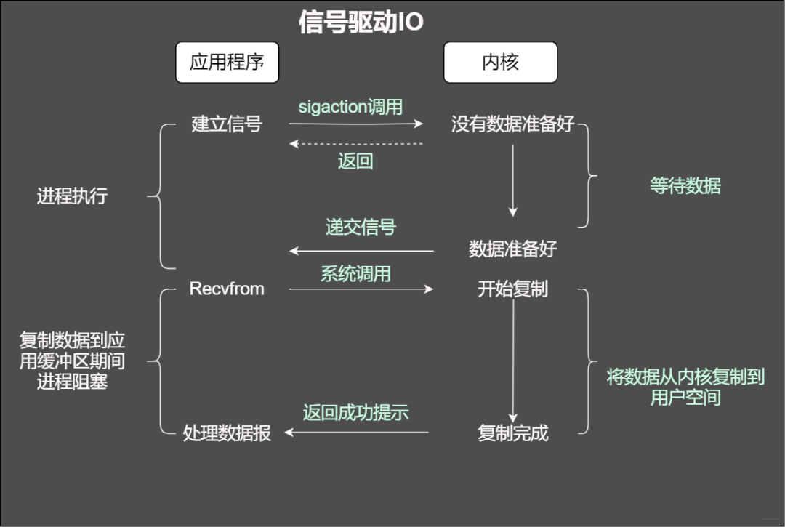

# C++数据结构与算法
- [1.一场B站服务端开发面试之旅](#1)
- [2.代码大全](#2)

## <a id="1">1.一场B站服务端开发面试之旅</a>
参考连接：   
1.一场B站服务端开发面试之旅       
https://blog.csdn.net/csdnsevenn/article/details/108988732?utm_medium=distribute.pc_aggpage_search_result.none-task-blog-2~all~sobaiduend~default-2-108988732.nonecase&utm_term=b%E7%AB%99%E9%9D%A2%E8%AF%95%E9%A2%98&spm=1000.2123.3001.4430    

### 1.操作系统相关
#### 自旋锁和一般锁的区别是什么？为什么要使用自旋锁？
当一个线程在获取锁的时候，如果这个锁已经被其它线程获取，那么这个线程不会破门而入，而是循环等待，但是嗷嗷待哺，需要不断地嗷嗷叫判断锁是否被成功获取，直到获取到锁才会退出循环。

#### 自旋锁通常会出现哪些问题?
如果某个线程拿着锁死不放手，其它线程没法拿到这把锁，只好等待获取锁的线程进入循环等待的状态，等待不是睡觉，还是会消耗CPU，等待久了就会导致CPU的使用率太高。

#### 那么自旋锁和其它锁到底有啥不同？
从线程状态来看，自旋锁的状态是运行-运行-运行。而非自旋锁的状态是运行---阻塞---运行，所以自旋锁会更高效。

不管是什么锁，都是为了实现保护共享资源而提出的一种锁机制，都是为了对某项资源的互斥使用。对于互斥锁而言，如果资源已经被占用，那么资源的申请者只会进入睡眠的状态。而自旋锁不会引起调用者睡眠，而是一直循环在那里查看该自旋锁的保持着是否已经释放了锁。

#### 那么在Java中如何去实现一个自旋锁
方法lock利用的CAS，当线程A获取锁的时候，成功获取不会进入while循环。如果此时线程A没有释放锁，当线程B来获取锁的时候，由于不满足CAS，就会进入whilei循环，不断判断是否满足CAS，直到线程A调用unlock释放。

#### 自旋锁有哪些优点？
因为运行在用户态，没有上下文的线程状态切换，线程一直处于active，减少了不必要的上下文切换，从而执行速度较快

因为非自旋锁在没有获取锁的情况下会进入阻塞状态，从而进入内核态，此时就需要线程的上下文切换，因为阻塞后进入内核调度状态，会导致用户态和内核态之间的切换，影响锁的性能。

#### 阻塞IO
我们知道在调用某个函数的时候无非就是两种情况，要么马上返回，然后根据返回值进行接下来的业务处理。当在使用阻塞IO的时候，应用程序会被无情的挂起，等待内核完成操作，因为此时的内核可能将CPU时间切换到了其它需要的进程中，在我们的应用程序看来感觉被卡主(阻塞)了。

#### 非阻塞IO
当使用非阻塞函数的时候，和阻塞IO类比，内核会立即返回，返回后获得足够的CPU时间继续做其它的事情。

#### IO复用模型
当使用fgets等待标准输入的时候，如果此时套接字有数据但不能读出。IO多路复用意味着可以将标准输入、套接字等都当做IO的一路，任何一路IO有事件发生，都将通知相应的应用程序去处理相应的IO事件，在我们看来就反复同时可以处理多个事情。这就是IO复用。

#### 信号驱动IO
在信号驱动式 I/O 模型中，应用程序使用套接口进行信号驱动 I/O，并安装一个信号处理函数，进程继续运行并不阻塞。当数据准备好时，进程会收到一个 SIGIO 信号，可以在信号处理函数中调用 I/O 操作函数处理数据。

#### 异步IO
用程序告知内核启动某个操作，并让内核在整个操作（包括将数据从内核拷贝到应用程序的缓冲区）完成后通知应用程序。那么和信号驱动有啥不一样?

#### 讲讲select和epoll的区别？
这里一样的套路，先说出两者的用途，然后两者的优缺点。

select的缺点

1.select返回的是含有整个句柄的数组，应用程序需要遍历整个数组才能发现哪些句柄发生了事件

2.select的触发方式是水平触发，应用程序如果没有完成对一个已经就绪的文件描述符进行IO操作，那么之后每次select调用还是会将这些文件描述符通知进程

3.内核 / 用户空间内存拷贝问题，select每次都会改变内核中的句柄数据结构集，因而每次select调用时都需要从用户空间向内核空间复制所有的句柄数据结构，产生巨大的开销

4.单个进程能够监视的文件描述符的数量存在最大限制，通常是1024，当然可以更改数量

#### epoll实现
epoll在内核中会维护一个红黑树和一个双向链表，红黑树存放通过epoll_ctl方法向epoll对象中添加进来的事件，所以不需要每次调用epoll_wait都全量复制所有的事件结构。双向链表存放就绪的事件，所有添加到epoll中的事件都会与设备(网卡)驱动程序建立回调关系，也就是说，当相应的事件发生时会调用这个回调方法，这个回调方法在内核中叫ep_poll_callback,它会将发生的事件添加到rdlist双链表中。调用epoll_wait就会直接返回链表中的就绪事件，效率高。

select适合少量活跃连接，一般几千。

epoll适合大量不太活跃的连接。

#### 乐观锁和悲观锁了解吗？
这个问题延伸的问题会很多，比如线程安全，CAS原理，优缺点等。

啥是悲观和乐观，咋们面试的时候不得乐观一些。想给面试来一波官方解释，然后大白话解释一波就差不多了。

官方：悲观锁是总是假设最坏的情况，每次那数据都认为别人会修改它，所以每次去那数据都要上锁，这样别人去拿这个数据就会阻塞。乐观锁就不一样了，总是觉得一切都是最好的安排，每次拿数据都认为别人不会修改，所以也就不上锁，但是在更新的时候会判断这个期间别人有没有更新这个数据。

#### 什么是缓存穿透？如何避免？什么是缓存雪崩？何如避免？
缓存穿透

一般来说，缓存系统会通过key去缓存查询，如果不存在对应的value，就应该去后端系统查找（比如DB）。这个时候如果一些恶意的请求到来，就会故意查询不存在的key,当某一时刻的请求量很大，就会对后端系统造成很大的压力。这就叫做缓存穿透。

如何避免？

对查询结果为空的情况也进行缓存，缓存时间设置短一点，或者该key对应的数据insert了之后清理缓存。对一定不存在的key进行过滤。可以把所有的可能存在的key放到一个大的Bitmap中，查询时通过该bitmap过滤。

缓存雪崩

当缓存服务器重启或者大量缓存集中在某一个时间段失效，这样在失效的时候，会给后端系统带来很大压力。导致系统崩溃。

如何避免？

在缓存失效后，通过加锁或者队列来控制读数据库写缓存的线程数量。比如对某个key只允许一个线程查询数据和写缓存，其他线程等待。

做二级缓存，A1为原始缓存，A2为拷贝缓存，A1失效时，可以访问A2，A1缓存失效时间设置为短期，A2设置为长期。

不同的key，设置不同的过期时间，让缓存失效的时间点尽量均匀。

### 2.redis相关
#### redis的淘汰删除策略了解吗？
Redis中通过maxmemory参数来设定内存的使用上限，如果Redis所使用内存超过设定的最大值，那么会根据配置文件中的策略选取要删除的key来删除，从而留出新的键值空间。主要的六种淘汰key策略：
- 1.volatile-lru   
在键空间中设置过期时间，移除哪些最近最少使用的key，占着茅坑不拉屎的key   

- 2.allkeys-lru   
移除最近最少使用的key   

- 3.volatile-random   
在键空间中设置过期时间，随机移除一个key   

- 4.allkeys-random 
随机移除一个key   
   
- 5.noeviction   
当内存使用达到阀值的时候，所有引起申请内存的命令会报错；   

#### 如何去淘汰这些key
- 定时删除   
很简单，设置一个闹钟，闹钟响了就删除即可。这种方式对于内存来说还是比较友好，内存不需要啥额外的操作，直接通过定时器就可保证尽快的删除。对于CPU来说就有点麻烦了，如果过期键比较多，那么定时器也就多，这删除操作就会占用太多的CPU资源。   

- 惰性删除   
每次从键空间获取键的时候检查键的过期时间，如果过期了，删除完事。   

- 定期删除   
每隔一段时间就去数据库检查，删除过期的键。  

这种方案是定时删除和惰性删除的中和方法，既通过限制删除操作执行的时长来减少对CPU时间的影响，也能减少内存的浪费。但是难点在于间隔时长需要根据业务情况而定。  

### 3.Mysql
#### Mysql中使用的锁有哪些？什么时候使用行锁，什么时候会使用表锁？
InnoDB中的行锁是通过索引上的索引项实现，主要特点是，只有通过索引条件检索数据，InnoDB才会使用行级锁，否则InnoDB将使用表锁。

这里注意，在Mysql中，行级锁不是锁记录而是锁索引。索引又分为主键索引和非主键索引两种。如果在一条语句中操作了非主键索引，Mysql会锁定该非主键索引，再锁定相关的主键索引。

#### 了解B+树吗？B+树什么时候会出现结点分裂？
将已满结点进行分裂，将已满节点后M/2节点生成一个新节点，将新节点的第一个元素指向父节点。

父节点出现已满，将父节点继续分裂。

一直分裂，如果根节点已满，则需要分类根节点，此时树的高度增加。

#### undo日志和redo日志分别是干嘛的？
redo log重做日志是InnDB存储引擎层的，用来保证事务安全。在事务提交之前，每个修改操作都会记录变更后的数据，保存的是物理日志-数据，防止发生故障的时间点，有脏页未写入磁盘，在重启mysql的时候，根据redo log进行重做从而达到事务的持久性

undo log回滚日志保存了事务发生之前的数据的一个版本，可以用于回滚，同时也提供多版本并发控制下的读。

#### mysql的binlog日志什么时候会使用？
首先应该知道binlog是一个二进制文件，记录所有增删改操作，节点之间的复制都会依靠binlog来完成。从底层原理来说，binlog有三个模式

- 模式1--row模式   
每一行的数据被修改就会记录在日志中，然后在slave段对相同的数据进行修改。比如说"update xx where id in(1,2,3,4,5)"，使用此模式就会记录5条记录

- 模式2--statement模式   
修改数据的sql会记录到master的binlog中。slave在复制的时候sql thread会解析成和原来maseter端执行过的相同的sql在此执行

- 模式3--mixed模式  
mixed模式即混合模式，Mysql会根据执行的每一条具体sql区分对待记录的日志形式。那么binlog的主从同步流程到底是咋样的

流程简述：    
Master执行完增删改操作后都会记录binlog日志,当需要同步的时候会主动通知slave节点，slave收到通知后使用IO THREAD主动去master读取binlog写入relay日志(中转日志),然后使 SQL THREAD完成对relay日志的解析然后入库操作,完成同步。

### 4.基本数据结构
#### 使用LRU时，如果短时间内会出现大量只会使用一次的数据，可能导致之前大量高频使用的缓存被删除，请问有什么解决办法?

#### 了解过循环链表吗？它的长度怎么计算？
他的主要特点是链表中的最后一个节点的指针域指向头结点，整个链表形成一个环。*这里*循环链表判断链表结束的标志是，判断尾节点是不是指向头结点

#### 哪种数据结构可以支持快速插入，删除，查找等操作？
思考这个问题的时候，我们不凡复习下不错的二分查找，它依赖数组随机访问的特性，其查找时间复杂度为O(log n)。如果我们将元素放入链表中，二分查找还好使吗？这就是今天和大家分享的跳表：
假设使用单链表存储n个元素，其中元素有序如下图所示:

从链表中查找一个元素，自然从头开始遍历找到需要查找的元素，此时的时间复杂度为O(n)。那采用什么方法可以提高查询的效率呢？问就是加索引，如何加，我们从这部分数据中抽取几个元素出来作为单独的一个链表，如下图所示。

假设此时咋们查找元素16，首先一级索引处寻找，当找到元素14的时候，下一个节点的值为18，意味着我们寻找的数在这两个数的中间。此时直接从14节点指针下移到下面的原始链表中，继续遍历，正好下一个元素就是我们寻找的16。好了，我们小结一下，如果从原始链表中寻找元素16，需要遍历比较8次，如果通过索引链表寻找我们只需要5次即可。

我们继续查找元素16，此时比较次数变为4次。这样看来，加一层索引查找的次数就变少，如果有n个元素到底有多少索引？

假设我们按照每两个结点就抽出一个结点作为上一层的索引节点，第一层所以节点个数n/2，第二层为n/4,第x级索引的结点个数是第x-1级索引的结点个数的1/2，那第x级索引结点的个数就是n/(2^x)。假设索引有y级，我们可以得到n/(2^y)=2，从而求得y=log2n-1。

这么多索引是不是就很浪费内存嘞？    
假设原始链表大小为n，那第一级索引大约有 n/2 个结点，第二级索引大约有 n/4 个结点，以此类推，每上升一级就减少一半，直到剩下 2 个结点。如果我们把每层索引的结点数写出来，就是一个等比数列。这几级索引的结点总和就是 n/2+n/4+n/8…+8+4+2=n-2 。所以，跳表的空间复杂度是 O(n) 。那还能不能降低一些呢。机智的你应该就考虑到假设每三个结点抽取一个节点作为索引链表的节点。

#### 跳表与二叉查找树
两者其查找的时间复杂度均为O(logn) ，那跳表还有哪些优势？

这种结构会导致二叉查找树的查找效率变为 O(n),。

#### 跳表与红黑树
说实话，红黑树确实比较复杂，面试的时候让你写红黑树，你就给他大嘴巴子？

红黑树需要通过左右旋的方式去维持树大小平衡。而跳表是通过随机函数来维护前面提到的 “ 平衡性 ” 。当我们往跳表中插入数据的时候，我们可以选择同时将这个数据插入到部分索引层中。如何选择加入哪些索引层呢？
我们通过一个随机函数，来决定将这个结点插入到哪几级索引中，比如随机函数生成了值 K ，那我们就将这个结点添加到第一级到第 K 级这 K 级索引中。当我们往跳表中插入数据的时候，我们可以选择同时将这个数据插入到部分索引层中。

## <a id="2">2.代码大全</a>
### 软件开发
1. 软件开发有以项目开发为目的，有以生长构造慢慢添加功能，有需求分析迭代功能添加开发等集中方式。
2. 程序组织、类设计、数据库设计、业务规则超时等设计、用户页面设计、资源管理线程等、安全性cookie配置文件设计、性能、可伸缩性。
3. 熟练使用防御式编程，使用断言异常机制，错误处理。

### 变量
1. 变量初始化，输入输出分开定义。变量尽可能得存活时间短。减少作用域，使用之前才赋值，理想情况是使用得时候进行定义缩短作用域实际由于好看整理。如果一个常量定义为const。注意计数num重置。类中构造函数初始化分配内存，析构函数释放。局部和全局重名优先以局部覆盖。一个变量一个作用。相同作用得变量函数放在一起减少作用域。
2. 变量定义意在告诉别人是干什么得不要告诉别人怎么做。使用对仗词first last beign end等或者状态名词。变量对象用小驼峰，方法用大驼峰。g_全局、m_成员变量、枚举_枚举、c_类型、s_static。

3. 整数负值、除0、溢出、中间相乘溢出。浮点精度问题、加减计算、等量判断。全局变量注意锁，可以用访问器转换数据抽象避免直接操作。
4. if后面跟正确的判断条件。常见的情景放在ifelseif前面。
4. 重构原因：

数量级重构：数据转换成类。数组变对象。    
语句级重构：语句拆分。    
子程序重构：参数优化，函数拆分。    
类重构：值对象变引用对象，引用对象变值对象。    

3. 逻辑判断多个if可以用and进行组合变成短路判断。越常见得在越前面。用列表查询代替逻辑表达式。相似循环合并，判断优于循环。最忙得放在循环里面，扁平化处理。自顶而下、自下而上、风险todo、功能导向、t字导向。

## links
  * [目录](<目录.md>)