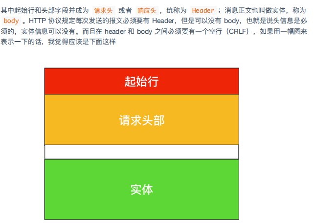
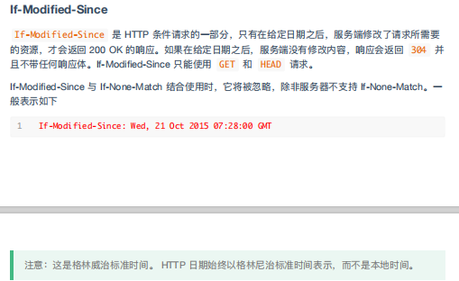
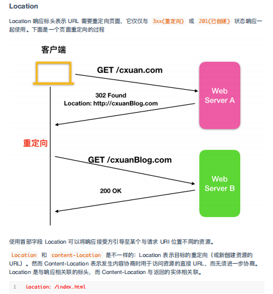
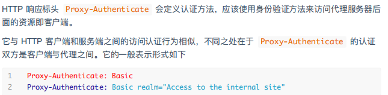
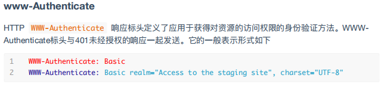
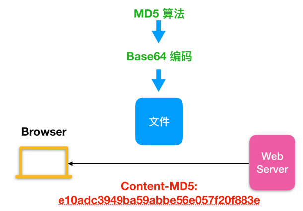
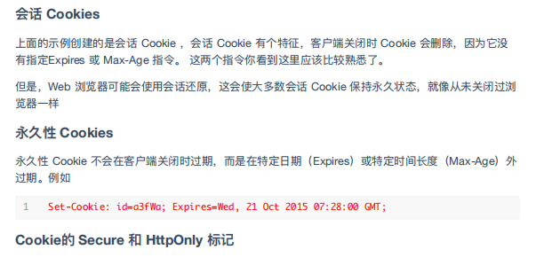
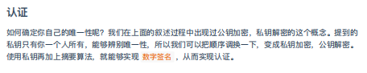

# C++http相关
- [1.http基础](#1)
- [2.http报文](#2)
- [3.http标头](#3)
- [4.http内容协商](#4)
- [5.http认证](#5)
- [6.http缓存](#6)
- [7.httpCROS跨域](#7)
- [8.http条件请求](#8)
- [9.http的Cookies和session](#9)
- [10.https](#10)
- [11.http请求方法](#11)


参考连接：    
1.gspiritling博客   
http://http.kancloud.spiritling.wiki/851892    

2.HTTP1.1协议-RFC2616-中文版   
https://blog.csdn.net/runner_diego/article/details/51379116   


## <a id="1">1.http基础</a>
```js
HTTP 协议始于三十年前蒂姆·伯纳斯 - 李的一篇论文；
HTTP/0.9 是个简单的文本协议，只能获取文本资源；
HTTP/1.0 确立了大部分现在使用的技术，但它不是正式标准；
HTTP/1.1 是目前互联网上使用最广泛的协议，功能也非常完善；
HTTP/2 基于 Google 的 SPDY 协议，注重性能改善，但还未普及；
HTTP/3 基于 Google 的 QUIC 协议，是将来的发展方向。

常见代理：
匿名代理：完全”隐匿“了被代理的机器，外界看到的只是代理服务器；
透明代理：外界知道是代理，也知道是客户端；
正向代理：靠近客户端，代表客户端向服务器发送请求；
反向代理：靠近服务器端，代表服务器响应客户端的请求。

可以做的事情：
负载均衡：把访问的请求均匀的分散到多台机器，实现访问的集群化；
内容缓存：暂存上下行的数据，减轻后端的压力；
内容防护：隐匿Ip,使用WAF等工具抵御网路的攻击，保护被代理的机器；
数据处理：提供压缩、加密等额外的功能。
```


目前最主流web服务器apache，nginx，IIS。

CDN：即内容分发网络，应用http中缓存和代理技术，代替源站响应客户端请求。部署在各地边缘服务器，通过中心服务器得负载均衡、内容分发、功能调度等功能模块，就近选择合适得服务器。主要关键技术：内容存储和分发技术。

WAF：是web application firewall。网络应用防火墙，与硬件“防火墙类似”，是应用层面的“防火墙”，专门检测HTTP流量，是防护WEB应用的安全即使WAF通常位于WEB服务器之前，可以阻止如SQL注入，跨站脚本等攻击。应用较多得是ModSecurity。

webservice：是一种远程调用技术。使用wsdl定义服务接口，使用http传输soap或者xml消息。


## <a id="2">2.http报文</a>




举例：   
http://www.example.com:80/path/to/myfile.html?key1=value1&key2=value2#SomewhereInTheDocument   


```js
锚点用来定位当前页面中的某个位置
② 有什么用：可以快速的让主要内容展示给用户浏览
③ 怎么用呢：

如下    
Ⅰ、HTML中
<body>     
<!-- 使用链接a标签中的href属性，#开头表示定位到指定锚点 -->    
 <a href="#hash">去吧，皮卡丘~</a>          

 <!-- 假如这里很多内容，我用hr加样式撑开页面高度 -->    
 <hr style="margin-top: 1000px; margin-bottom: 1000px;">    

 <!-- 需要定位到这里，使用ID来设置锚点 -->     
 <p id="hash">皮卡，这里就是你要浏览的内容了。</p>         

 <!-- 假如这里很多内容，我用hr加样式撑开页面高度 -->     
 hr style="margin-bottom: 1000px;"> 
</body>    

Ⅱ、JavaScript中location.hash = 'pikaqiu'; 
// 运行之后，浏览器的URL中后面就带上了#pikaqiu，页面也及时定位到#pikaqiu的内容上 

// 如果URL中已经带有#pikaqiu锚点，那么定位也就失效，解决方案就是先清空锚点，再赋值，
perfect location.hash = ''; 
location.hash = 'pikaqiu';
```

## <a id="3">3.http标头</a>
- [3.1通用标头](#3.1)
- [3.2请求标头](#3.2)
- [3.3响应标头](#3.3)
- [3.4实体标头](#3.4)

http 1.1 标头分为四种：通用标头，实体标头，请求标头，响应标头。


### <a id="3.1">3.1通用标头</a>
通用消息主要用于传达有关消息本身的消息，而不是他所懈怠的内容，他们提供一般消息并控制如何处理和处理消息。不限于请求和响应报文。大部分两个都显示。

```c++
Cache-Control
Connection
Date
Pragma
Trailer
Transfer-Encoding
Upgrade
Via
Warning
```

#### 1. Cache-Control  
这个执行影响请求响应的缓存服务器从而控制缓存目标，不仅有缓存服务器还有内部缓存也会影响链路, rfc2616。


- 可缓存：no-cache、no-store、private、public
- 有效期： max-age、s-maxage、max-stale、min-fresh
- 重新验证加载： must-revalidate、proxy-revalidate
- 其他：only-if-cached、no-transform

使用no-cache为了防止从缓存中返回资源，不是no-store不缓存，每次服务器接受到客户端请求，都会返回最新资源给客户端。max-age缓存服务器判断自己时间和max-age大小，如果比max-age小缓存有效，返回缓存，比max-age大，不返回缓存。max-age=0缓存服务器请求转发到服务器。s-maxage用于共有服务器。must-revalidate资源过期，没有验证成功使用过期数据。


pubilc只出现再客户端响应可以被任何缓存所缓存。分共享和私有缓存。min-fresh请求中要求缓存服务器返回时间内数据。max-stable请求中过期都接受数据。only-if-cached当缓存资源才返回。


#### 2.Connection   
使用tcp管理连接，一种是持久性一种是非持久性。Connection: Keep-Alive
Keep-Alive: timeout=5, max=1000一起使用。Connection: close。

#### 3.Date   
Date: Wed, 21 Oct 2015 07:28:00 GMT。

#### 4.Pragma  
报文指令，遗留字段，Pragma: no-cache。

#### 5.Trailer
报文末端的首部一览，首部字段 Trailer 会事先说明在报文主体后记录了哪些首部字段。可应用在 HTTP/1.1 版本分块传输编码时。Transfer-Encoding: chunked
Trailer: Expires。用例中指定首部至为expiress，再报文主体之后首部字段为expires。

#### 6.Transfer-Encoding
Transfer-Encoding: chunked.规定了传输报文主体时采用的编码方式。HTTP/1.1 的传输编码方式仅对分块传输编码有效。


#### 7.Upgrade
用于指定http及其他协议是否可以使用更高版本进行通信。


#### 8.VIA


#### 8.Warning


### <a id="3.2">3.2请求标头</a>
```c++
Accept
Accept-Charset
Accept-Encoding
Accept-Language
Authorization
Expect
From
Host
If-Match
If-Modified-Since
If-None-Match
If-Range
If-Unmodified-Since
Max-Forwards
Proxy-Authorization
RangeReferer
TE
User-Agent
```

请求标头用于客户端发送http请求到服务器使用的字段。


#### 1.Accept 


#### 2.Accept-Charset 


#### 3.Accept-Encoding


#### 4.Accept-Language


#### 5.Authorization
用于向服务器认证用户代理得凭证。


#### 6.Expect


#### 7.From
用来告诉服务器使用用户得电子邮件地址。


#### 8.Host


#### 9.if-Match


#### 10.If-Modified-Since



#### 11.If-None-Match


#### 12.If-Range


#### 13.If-Unmodified-Since


#### 14.Max-Forwards


#### 15.Proxy-Authorization


#### 16.Range


#### 17.Referer


#### 18.TE


#### 19.User-Agent


### <a id="3.3">3.3响应标头</a>
```c++
Accept-Ranges
Age
ETag
Location
Proxy-Authenticate
Retry-After
Server
Vary
www-Authenticate
```


#### 1.Accept-Ranges
首部字段Accept-Ranges是用来告知客户端服务器是否能处理范围请求，以指定获取服务器某个部分资源。


#### 2.Age


#### 3.ETag


#### 4.Location



#### 5.Proxy-Authenticate



#### 6.Retry-After


#### 7.Server


#### 8.Vary


#### 9.www-Authenticate



#### 10.Access-Control-Allow-Origin


### <a id="3.4">3.4实体标头</a>
```c++
Allow
Content-Encoding
Content-Language
Content-Length
Content-Location
Content-MD5
Content-Range
Content-Type
Expires
Last-Modified
```


#### 1.Allow


#### 2.Content-Encoding


#### 3.Content-Language


#### 4.Content-Length


#### 5.Content-Location


#### 6.Content-MD5




#### 7.Content-Range


#### 8.Content-Type


#### 9.Expires


#### 10.Last-Modified


## <a id="4">4.http内容协商</a>


客户端用accept告诉服务器希望接受什么数据，服务器用content告诉客户端发送了什么数据。


## <a id="5">5.http认证</a>
rfc7235定义了认证框架。


### 1.Proxy-Authenticate


禁止访问：403代理服务器有效凭证不足?

### 2.WWW-Authenticate和Proxy-Authenticate


## <a id="6">6.http缓存</a>
缓存主要分为两个类别：私有和共享缓存。cache-control：private/public。


通过etag区别不同的用户，通过cacahe进行控制。

## <a id="7">7.http CROS跨域</a>
cross origin resource share跨资源共享。协议+主机+端口。浏览器内置xmlhttprequest对象更新网页无需刷新页面、加载后从服务器请求获取数据、在后台讲数据发送到服务器。

### 7.1简单请求


### 7.2预检请求
预检请求通过option向另外一个域上发送http请求，用来确定请求是否安全发送。


### 7.3带凭证的请求


### 7.4跨域响应标头
```c++
Access-Control-Allow-Origin
Access-Control-Allow-Credentials
Access-Control-Allow-Headers
Access-Control-Allow-Methods
Access-Control-Expose-Headers
Access-Control-Max-Age
Access-Control-Request-Headers
Access-Control-Request-Method
Origin
```

#### 7.4.1Access-Control-Allow-Origin
服务器告诉源。  


#### 7.4.2Access-Control-Allow-Credentials
服务器告诉预检请求凭证。  


#### 7.4.3Access-Control-Allow-Headers
服务器告诉可以通过的标头。  


#### 7.4.4Access-Control-Allow-Methods
服务器告诉预检请求方法。


#### 7.4.5Access-Control-Expose-Headers
公开非core的列出的请求头。   


#### 7.4.6Access-Control-Max-Age


#### 7.4.7Access-Control-Request-Headers


#### 7.4.8Access-Control-Request-Method


#### 7.4.9Origin


## <a id="8">8.http条件请求</a>
验证请求、缓存，通过etag进行检查。


```c++
If-Match
If-None-Match
If-Modified-Since
If-Unmodified-Since
If-Range
```


### 8.1断点续传


## <a id="9">9.http的Cookies和session</a>
cookies包括web cookie和浏览器cookie。http cookie是http无状态补充和改良。三个目的会话管理、个性化、追踪。cookie跨域有问题。





session。  


json web token。  


## <a id="10">10.https</a>
http没有用户验证、数据加密。https可以加密、数据一致性、身份验证。先和ssl通信，再由ssl和tcp通信。





## <a id="11">11.http请求方法</a>
### 1.get post方法


## links
  * [目录](<目录.md>)