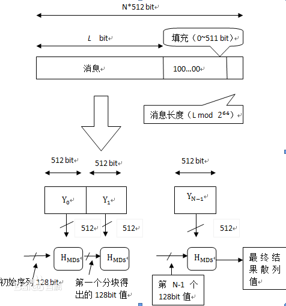

# MD5
- [MD5介绍](#1)


参考链接  
1.md5入门     
https://blog.csdn.net/noricky/article/details/81946368   

2.MD5算法的C++实现  
http://www.cppblog.com/ant/archive/2007/09/11/31886.html  

3.github md5  
https://github.com/JieweiWei/md5  

4.C语言实现MD5  
https://blog.csdn.net/xhhjin/article/details/8450686 

5.MD5算法原理和流程  
https://www.zybuluo.com/DingCao-HJJ/note/202937

## <a id="1">MD5介绍</a>
MD5即Message-Digest Algorithm 5（信息-摘要算法 5）第五代，用于确保信息传输完整一致。是计算机广泛使用的散列算法之一（又译摘要算法、哈希算法），主流编程语言普遍已有MD5实现。  
将数据（如汉字）运算为另一固定长度值，是散列算法的基础原理，MD5的前身有MD2、MD3和MD4。md5算法定义在RFC 1321中，由Ron Rivest（RSA公司）在1992年提出。然而很多学者已经找出了构造md5冲突的方法。这些人中包括中国山东大学的王教授和Hans Dobbertin。所以，单纯使用md5的信息认证模式变得不可靠了。但并不是说md5不能够使用。  

MD5已经广泛使用在为文件传输提供一定的可靠性方面。例如，服务器预先提供一个MD5校验和，用户下载完文件以后，用MD5算法计算下载文件的MD5校验和，然后通过检查这两个校验和是否一致，就能判断下载的文件是否出错。  
MD5的典型应用是对一段Message(字节串)产生fingerprint(指纹)，以防止被“篡改”。举个例子，你将一段话写在一个叫 readme.txt文件中，并对这个readme.txt产生一个MD5的值并记录在案，然后你可以传播这个文件给别人，别人如果修改了文件中的任何内容，你对这个文件重新计算MD5时就会发现（两个MD5值不相同）。如果再有一个第三方的认证机构，用MD5还可以防止文件作者的“抵赖”，这就是所谓的数字签名应用。  

MD5是输入不定长度信息，输出固定长度128-bits的算法。经过程序流程，生成四个32位数据，最后联合起来成为一个128-bits散列。基本方式为，求余、取余、调整长度、与链接变量进行循环运算。得出结果。  



### MD5算法的简单步骤
```shell
1.通过添加一个1和若干个0的方式，把输入数据长度（按照字节算）变成64m+56.信息计算前先要进行位补位，设补位后信息的长度为
LEN(bit)，则LEN%512 = 448(bit)，即数据扩展至K*512+448(bit)。即K*64+56(byte)，K为整数。补位操作始终要执行，即使补
位前信息的长度对512求余的结果是448。
2.添加8个字节长度到输入数据中去，这样输入数据长度变成了64的倍数 
3.把数据划分成块，每块64个字节 
4.初始情况下，输出为：                                                                    
    m_state[0] = 0x67452301L;
    m_state[1] = 0xefcdab89L;
    m_state[2] = 0x98badcfeL;
    m_state[3] = 0x10325476L; 
5.分别对每块进行计算。输出最后结果。
```

### MD5算法的详细步骤：
```shell
1.填充
填充输入信息至N*512+448(即填充后的位数模512得448)
填充内容为一个1和若干个0，即第一个为1其他都是0
填充完毕后，添加一个64位的字段，字段表示的是原字段长度（单位是位,bit），如果原字段长度超过64位(即输入信息长度超过
4EB，1EB=1024PB,但是就现在来说这是几乎不可能的)，就取低64位。 
这样就使得信息长度为N*512+448+64=（N+1）*512。

2.初始化变量
四个幻数：
A=0x01234567，
B=0x89ABCDEF，
C=0xFEDCBA98，
D=0x76543210。

3.运算
1.每一分组的算法流程如下：
（1）第一分组需要将上面四个链接变量复制到另外四个变量中：A到a，B到b，C到c，D到d。
（2）从第二分组开始的变量为上一分组的运算结果，即A = a， B = b， C = c， D = d。
2.循环的次数是分组的个数（N+1）
3.将每一512字节细分成16个小组，每个小组64位（8个字节）
4.定义一些运算：
&是与,|是或,~是非,^是异或,<<是循环移位

#define F(x,y,z) ((x & y) | (~x & z))
#define G(x,y,z) ((x & z) | (y & ~z))
#define H(x,y,z) (x^y^z)
#define I(x,y,z) (y ^ (x | ~z))
#define ROTATE_LEFT(x,n) ((x << n) | (x >> (32-n)))
#define FF(a,b,c,d,x,s,ac) \
          { \
          a += F(b,c,d) + x + ac; \
          a = ROTATE_LEFT(a,s); \
          a += b; \
          }
#define GG(a,b,c,d,x,s,ac) \
          { \
          a += G(b,c,d) + x + ac; \
          a = ROTATE_LEFT(a,s); \
          a += b; \
          }
#define HH(a,b,c,d,x,s,ac) \
          { \
          a += H(b,c,d) + x + ac; \
          a = ROTATE_LEFT(a,s); \
          a += b; \
          }
#define II(a,b,c,d,x,s,ac) \
          { \
          a += I(b,c,d) + x + ac; \
          a = ROTATE_LEFT(a,s); \
          a += b; \
          }          

F(X,Y,Z)=(X&Y)|((~X)&Z)  
G(X,Y,Z)=(X&Z)|(Y&(~Z))  
H(X,Y,Z)=X^Y^Z  
I(X,Y,Z)=Y^(X|(~Z))
FF(a,b,c,d,Mj,s,ti)表示a=b+((a+F(b,c,d)+Mj+ti)<<s)  
GG(a,b,c,d,Mj,s,ti)表示a=b+((a+G(b,c,d)+Mj+ti)<<s)  
HH(a,b,c,d,Mj,s,ti)表示a=b+((a+H(b,c,d)+Mj+ti)<<s)  
II(a,b,c,d,Mj,s,ti)表示a=b+((a+I(b,c,d)+Mj+ti)<<s)  
5.四轮运算分别是：

第一轮  
 a=FF(a,b,c,d,M0,7,0xd76aa478)  
 b=FF(d,a,b,c,M1,12,0xe8c7b756)  
 c=FF(c,d,a,b,M2,17,0x242070db)  
 d=FF(b,c,d,a,M3,22,0xc1bdceee)  
 a=FF(a,b,c,d,M4,7,0xf57c0faf)  
 b=FF(d,a,b,c,M5,12,0x4787c62a)  
 c=FF(c,d,a,b,M6,17,0xa8304613)  
 d=FF(b,c,d,a,M7,22,0xfd469501)  
 a=FF(a,b,c,d,M8,7,0x698098d8)  
 b=FF(d,a,b,c,M9,12,0x8b44f7af)  
 c=FF(c,d,a,b,M10,17,0xffff5bb1)  
 d=FF(b,c,d,a,M11,22,0x895cd7be)  
 a=FF(a,b,c,d,M12,7,0x6b901122)  
 b=FF(d,a,b,c,M13,12,0xfd987193)  
 c=FF(c,d,a,b,M14,17,0xa679438e)  
 d=FF(b,c,d,a,M15,22,0x49b40821)  
 
 第二轮  
 a=GG(a,b,c,d,M1,5,0xf61e2562)  
 b=GG(d,a,b,c,M6,9,0xc040b340)  
 c=GG(c,d,a,b,M11,14,0x265e5a51)  
 d=GG(b,c,d,a,M0,20,0xe9b6c7aa)  
 a=GG(a,b,c,d,M5,5,0xd62f105d)  
 b=GG(d,a,b,c,M10,9,0x02441453)  
 c=GG(c,d,a,b,M15,14,0xd8a1e681)  
 d=GG(b,c,d,a,M4,20,0xe7d3fbc8)  
 a=GG(a,b,c,d,M9,5,0x21e1cde6)  
 b=GG(d,a,b,c,M14,9,0xc33707d6)  
 c=GG(c,d,a,b,M3,14,0xf4d50d87)  
 d=GG(b,c,d,a,M8,20,0x455a14ed)  
 a=GG(a,b,c,d,M13,5,0xa9e3e905)  
 b=GG(d,a,b,c,M2,9,0xfcefa3f8)  
 c=GG(c,d,a,b,M7,14,0x676f02d9)  
 d=GG(b,c,d,a,M12,20,0x8d2a4c8a)  
 
 第三轮  
 a=HH(a,b,c,d,M5,4,0xfffa3942)  
 b=HH(d,a,b,c,M8,11,0x8771f681)  
 c=HH(c,d,a,b,M11,16,0x6d9d6122)  
 d=HH(b,c,d,a,M14,23,0xfde5380c)  
 a=HH(a,b,c,d,M1,4,0xa4beea44)  
 b=HH(d,a,b,c,M4,11,0x4bdecfa9)  
 c=HH(c,d,a,b,M7,16,0xf6bb4b60)  
 d=HH(b,c,d,a,M10,23,0xbebfbc70)  
 a=HH(a,b,c,d,M13,4,0x289b7ec6)  
 b=HH(d,a,b,c,M0,11,0xeaa127fa)  
 c=HH(c,d,a,b,M3,16,0xd4ef3085)  
 d=HH(b,c,d,a,M6,23,0x04881d05)  
 a=HH(a,b,c,d,M9,4,0xd9d4d039)  
 b=HH(d,a,b,c,M12,11,0xe6db99e5)  
 c=HH(c,d,a,b,M15,16,0x1fa27cf8)  
 d=HH(b,c,d,a,M2,23,0xc4ac5665)  
 
 第四轮  
 a=II(a,b,c,d,M0,6,0xf4292244)  
 b=II(d,a,b,c,M7,10,0x432aff97)  
 c=II(c,d,a,b,M14,15,0xab9423a7)  
 d=II(b,c,d,a,M5,21,0xfc93a039)  
 a=II(a,b,c,d,M12,6,0x655b59c3)  
 b=II(d,a,b,c,M3,10,0x8f0ccc92)  
 c=II(c,d,a,b,M10,15,0xffeff47d)  
 d=II(b,c,d,a,M1,21,0x85845dd1)  
 a=II(a,b,c,d,M8,6,0x6fa87e4f)  
 b=II(d,a,b,c,M15,10,0xfe2ce6e0)  
 c=II(c,d,a,b,M6,15,0xa3014314)  
 d=II(b,c,d,a,M13,21,0x4e0811a1)  
 a=II(a,b,c,d,M4,6,0xf7537e82)  
 b=II(d,a,b,c,M11,10,0xbd3af235)  
 c=II(c,d,a,b,M2,15,0x2ad7d2bb)  
 d=II(b,c,d,a,M9,21,0xeb86d391) 
6.每轮循环后，将A，B，C，D分别加上a，b，c，d，然后进入下一循环。

将输入信息text的位数按照特定的方法填充至512的整数倍，然后每512位为一个分组M[i]进行处理。
每个分组又将分为16个32位的子分组，经过一系列循环后将产4个32位的散列值a, b, c, d，作为下一个分组的输入。
最终，将a, b, c, d组合起来即可得到text的MD5值。

处理完所有的512位的分组后，得到一组新的A,B,C,D的值，将这些值按ABCD的顺序级联，然后输出。这里还要注意，输出的MD5是按内存中数值的排列顺序，所以我们要分别对A,B,C,D的值做一个小端规则的转换。
举个例子：A有32位，分成4个字节A1A2A3A4。输出A的时候，要这样输出：A4A3 A2A1。这样就能输出正确的MD5了。
```


补位-分组-循环-计算-结束

### 注意
1.注意多种编程语音中差异   
2.注意转义字符  

## links
  * [目录](<目录.md>)