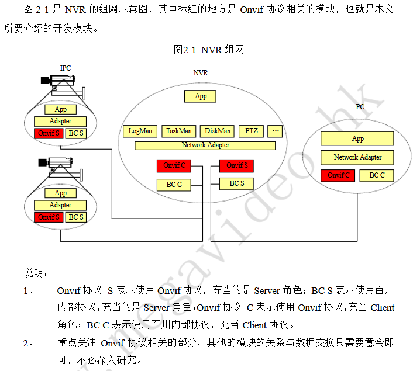

# OnVif
- [技术理解](#1)

参考链接  
1.ONVIF协议学习笔记   
https://www.cnblogs.com/lsdb/p/9157302.html   

2.Web Services  
https://www.runoob.com/webservices/ws-platform.html    

3.ONVIF协议网络摄像机（IPC）客户端程序开发   
https://blog.csdn.net/benkaoya/article/details/72453403   

## <a id="1">技术理解</a>
ONVIF = 服务端 + 客户端 =（Web Services + RTSP）+ 客户端 = （（WSDL + SOAP） + RTSP） + 客户端  

WSDL是服务端用来向客户端描述自己实现哪些请求、发送请求时需要带上哪些参数xml组织格式；  
SOAP是客户端向服务端发送请求时的参数的xml组织格式;  

Web Services实现摄像头控制（比如一些参数配置、摄象头的上下左右（PTZ）控制）；RTSP实现报像头视频传输。  
Web Services具摄像头控制具体到技术交互实现上，其实和http差不多，客户端以类似http post的格式向服务端发送请求，然后服务端响应客户端请求。   

比如GetStatus请求长这样（POST的data部份就是soap格式）：  
```xml
POST /onvif/device_service HTTP/1.1
Host: 192.168.220.128
Content-Type: application/soap+xml; charset=utf-8
Content-Length: 333

<?xml version="1.0" encoding="utf-8"?>
<s:Envelope xmlns:s="http://www.w3.org/2003/05/soap-envelope" xmlns:tptz="http://www.onvif.org/ver20/ptz/wsdl" xmlns:tt="http://www.onvif.org/ver10/schema">
  <s:Body>
    <tptz:GetStatus>
      <tptz:ProfileToken>prof0</tptz:ProfileToken>
    </tptz:GetStatus>
  </s:Body>
</s:Envelope>
```



## links
  * [目录](<目录.md>)