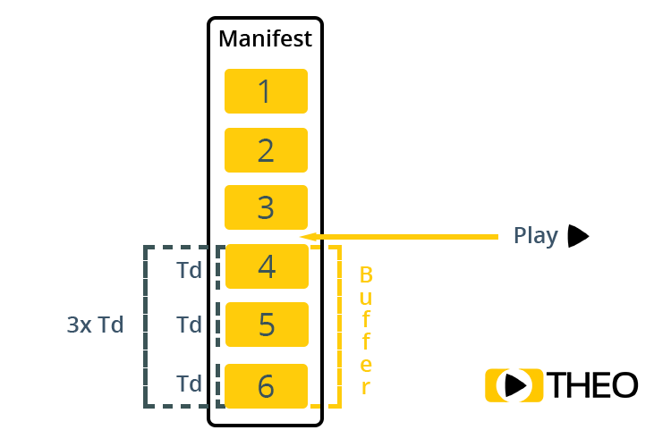

# 低延时HLS原理和实现
- [简介](#1)

参考链接  
1.ONVIF协议学习笔记   
https://blog.csdn.net/weixin_39970103/article/details/90047813  

## <a id="1">简介</a>
LHLS（Low Latency HLS），顾名思义，是一种以降低HLS协议时延为目标的方案，但它还没有被写入标准协议中。  

HLS流分为两部分，m3u8文件和多媒体数据文件(.m4s或.ts)。以TS文件为例，m3u8文件描述了每个TS的时长和url。在点播或直播时，客户端首先下载m3u8文件，然后根据m3u8文件下载TS，进行解析和播放。客户端通过m3u8文件有没有结尾标识来辨别点播流和直播流。在点播系统中，m3u8文件是已经写好的，会有一个结尾标识。客户端可以从一开始就获得总的播放时长，并按照m3u8文件中TS的顺序下载和播放；在直播系统中，m3u8文件是一直更新的，没有结尾标识，所以客户端需要重复下载它。  

HLS协议规定直播时，客户端不应该选择开始时间到最后一个segment结束时间间隔小于最后一个segment时长加两倍的目标时长的segment作为首个segment进行播放。也就是说，一般而言，客户端应该从m3u8文件中倒数第三个或倒数第四个segment开始播放。如下图所示，客户端应该选择标号为3的segment作为起始的segment播放。由此可见，HLS直播系统至少会产生3个segment时长之和的时延，假设每个segment时长6s，再加上客户端会有缓存（假设为1s）和传输时延，总体的时延可能会达到20s。    

### LHLS降低时延原理
LHLS的就是为了降低HLS的时延而提出的。它的原理是：LHLS是在上述带来时延的三个segment中，第一个封装完成，第二个正在封装，第三个还开始没封装的时候，就把三个的url都写入m3u8文件，如下图所示。这时候客户端发现m3u8文件里已经有三个segment的url了，就开始播放第一个segment了。这样，就减少了几乎是第二个和第三个segment时长之和（12s左右）的延时。   

### LHLS直播的实现
清楚HLS和LHLS的原理之后，认为支持HLS直播的客户端也是支持LHLS的。我们需要做的是，在服务器端，采集到一个segment的第一帧数据并把它封装到segment中之后，把这个segment的url写进m3u8文件（TS格式是支持数据一帧一帧的封装的）。这时候客户端就可以发起请求下载这个segment，但实际上这个segment还没有封装完成。  
- 1.采集视频数据并封装：  
摄像头采集视频数据，并封装到TS文件中。第一帧数据封装完成时，将TS的url写入m3u8文件。  

- 2.发送动态大小文件：  
我们想要实现的是客户端只发起一次请求，服务器端每有一帧数据封装到segment，就向客户端发送这一帧的数据。上述所说即服务器需要实现可以发送动态大小的文件。我们使用的服务器是nginx，世界一大部分web服务器都在使用nginx，它的性能是超过老牌服务器Apache的。我们通过查阅资料和阅读nginx服务器源码得到，nginx并没有发送动态大小文件的功能。  
于是，在nginx源码基础上增加了发送动态大小文件功能。  

- 3.下载和播放LHLS直播流：  
支持播放HLS直播流播放器都可以支持我们的LHLS直播。我们使用google的开源播放器ExoPlayer作为客户端，下载和播放LHLS直播流。  

>小结
LHLS相比于HLS直播，降低了两倍segment时长的时延。由于其优秀的低时延性能，很有希望成为未来直播行业的发展趋势。

## links
  * [目录](<目录.md>)