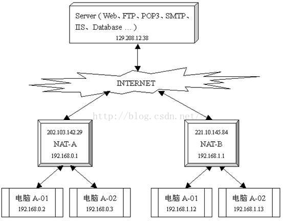
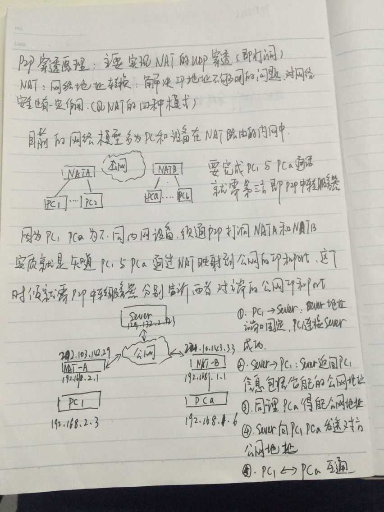
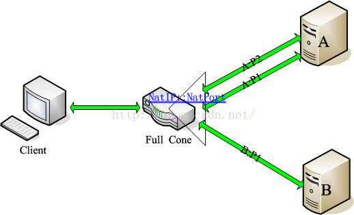
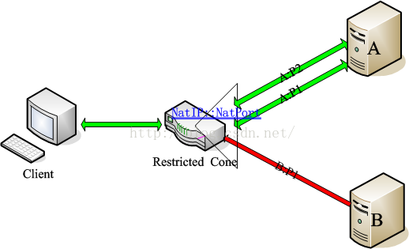
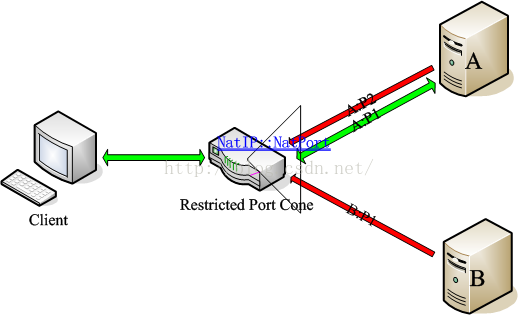
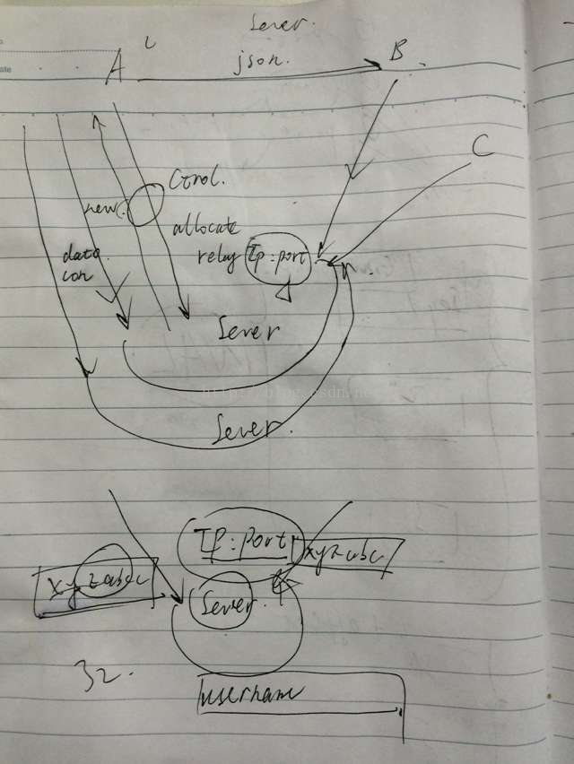
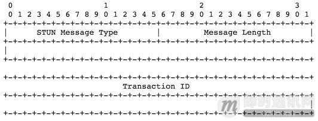
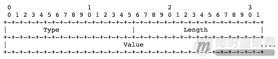
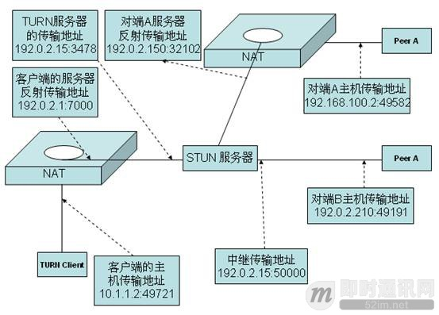

# P2P穿透及TURN转发简要说明
- [P2P穿透及TURN转发简要说明](#1)
- [NAT介绍](#2)
- [转发原理](#3)
- [P2P技术之STUN、TURN、ICE详解](#4)

参考链接  
1.P2P穿透及TURN转发简要说明  
https://blog.csdn.net/yuanchunsi/article/details/53302694  

2.P2P技术之STUN、TURN、ICE详解  
https://www.cnblogs.com/mlgjb/p/8243690.html  

## <a id="1">P2P穿透及TURN转发简要说明</a>




## <a id="2">NAT介绍</a>
### 全锥形NAT


IP、端口都不受限。只要客户端由内到外打通一个洞之后（NatIP:NatPort -> A:P1），其他IP的主机(B)或端口(A:P2)都可以使用这个洞发送数据到客户端。

映射关系为：Client->NatIP:NatPort->Any，即任何外部主机都可通过NatIP:NatPort发送数据到Clietn上。

### 受限锥形NAT


IP受限，端口不受限。当客户端由内到外打通一个洞之后(NatIP:NatPort -> A:P1)，A机器可以使用他的其他端口（P2）主动连接客户端，但B机器则不被允许。

映射关系为：Client-> NatIP:NatPort->A，即只有来自A的数据包才能通过NatIP:NatPort发送到Client上。

### 端口受限锥型


IP、端口都受限。返回的数据只接受曾经打洞成功的对象（A:P1），由A:P2、B:P1发起的数据将不被NatIP:NatPort接收。

映射关系为：Client->NatIP:NatPort->A:P1，即只有来自A:P1的数据才可通过NatIP:NatPort发送到Client上。

### 对称型NAT


对称型NAT具有端口受限锥型的受限特性。但更重要的是，他对每个外部主机或端口的会话都会映射为不同的端口（洞）。只有来自相同的内部地址（IP:PORT）并且发送到相同外部地址（X:x）的请求，在NAT上才映射为相同的外网端口，即相同的映射。一个外部地址（X:x）对应一个NAT上的映射，如上图红色三角，每个映射仅接收来自他绑定的外部地址的数据。注：X在这里意为任意一台外部主机，x为这台主机上的任意一个端口。
映射关系为：Client->NatIP:Pa1->A:P1，当Client访问B:P1时，映射关系变为：  
Client->NatIP:Pb->B:P1，同理，NatIP:Pa2也就是Client访问A:P2时的映射。  

这里我们主要是是简单讲解一下UDP实现NAT的穿透（俗称打洞）。当然TCP与之相似，可以以此类推。NAT最开始出现在路由器上。详细的大家可以在网上查下资料，NAT的全称是Network Address Translator中文称之为网络地址转换。  
NAT分为两大类，NAT和NAPT（Network Address Port Translator）这个不用说了，端口地址转换。  

用于实例，简单的说，实现P2P需要一个中转服务器。也就是需要一个第三方。（一会儿我们来说为什么需要一个第三方）

以简单的通迅来讲，首先我们来看一个示例图。
```js
A<——————>B  A与B之间进行的通迅
A的IP地址为222.182.100.1
B的IP地址为222.182.100.2
如果这两个用户都是采用的全球唯一的IP地址，那么他们通迅很简单，也不需要实现P2P。
A<------------------>Nat<-------------------->B
如果其中一方为内网用户，及IP地址不为全球唯一IP,就会出现通过路由器进行通迅。
那么在经过路由器的时候，路由器会出现映射IP地址与端口的情况。
如：A为内网用户。B为外网用户。则B的IP地图为全球唯一IP地址。可以直接通迅。
A的IP地址为：192.168.1.100 端口为1025
经过路由器向B进行通迅，路由器将会产生一个一分钟到几小时不定的一个Session，这个Session映射了内网A的IP地址及其接收信息的端口。
那么路由向B发送信息的时候，IP地址及端口就变成了222.182.100.1:3645(假设)
这个时候实际上A就是在进行路由NAT的穿透，
如果我们在B向A发送信息的时候采用192.168.1.100:1025这样的IP和端口，是找不到A的，因为这个IP不是全球唯一IP。
那么B需要的是在收到A的信息的时候，获取其IP地址和端口，那么获取到的就是222.182.100.1:3645这个路由器的映射Session地址。
B现在只需要向这个映射地址发送消息，路由器就会自动将消息发送到对应的A方去。否则路由器将当作无用包，将这个消息丢弃。
那如，我们现在就实现了局域网向某单个固定外网机器发送消息。
如果再来一台C端，也是外网的IP。C通过222.182.100.1:3645向A发送消息，A是否能收到呢？答案是否定的，A不能收到。为什么？因为路由在映射A的穿透时就记录了B的地址，也就是除了B向这个映射点发送消息可以通向A，其它的地址是不行的。路由器此时会将其当作无用包消息给丢弃掉。
那怎么办呢？只有A再向C发送一个穿透，C才可以向A发送消息。

以上我们只是说了一点基本的理论。接下来我们要实现什么？不同内网通过internet网进行通迅。
再来，我们举个图例

A<----------->NatA<---------->NatB<---------->B
A的地址是：192.168.1.100端口4000
B的地址是：192.168.1.100端口4000
它们两个都是内网的地址。及局域网内部地址。并不是全球唯一地址。
两个路由：
NatA的地址是：222.182.100.1
NatB的地址是：222.182.100.2
这两个路由是外网的地址，及全球唯一地址。

现在我们要实现A与B的通迅。
因为A与B都不是外网地址。所以A不可能向192.168.1.100发送消息。这消息只会它自己收到，因为这个IP是它自己的。同样B也不可以。
那么A向NatB发送消息，B能收到吗？答案是否定的，不能收到。刚才我们提到过。因为路由没有映射B的地址。A并不知道这个Session就连NatB也不知道这个Session因为B没有向A发送消息，并不产生这个Session。
就算B和A同时向双方的路由发送消息，产生的Session，A和B也得不到。因为在路由上就把这个消息当做为无用包给丢弃掉了。

那么这样的情况我们要进行通迅怎么办呢？
对，就是刚才我们提到的第三方。第三方是个什么方呢？
第三方必须是一个拥有固定外网IP的服务方。及一个外网服务器。全唯一IP地址。

图例：
假定我们这个第三方为C
C  IP:222.182.100.3端口4001
A<----------->NatA<--------------->C<-------------------->NatB<------------->B
                    ↑______________________________↑                                                          

原理如下
A通过路由向C发送消息，C获取A的在路由上的Session地址，映射的IP和端口
B同样。
这时候C就有了A和B的地址。
C可以和A、B进行通迅，但是A和B还不行。
现在C需要通知A方B的映射IP和端口。也要通知B方A的映射IP和端口。
这样A就有了B的映射地址，B也有了A的。但是现在还不能进行通迅。
因为在路由上A和B都只有对C的穿透。并没有相互之前的穿透。
那么A要向B发送消息怎么办呢？需要C向B发送一个消息告诉B方A的地址让B向这个地址发送一个消息，对A进行一个穿透。
这样A就可以向B发送消息了。在A向B发送消息的同时，A也在向B进行穿透。
这样就可以实现相互的通迅了。如果有多个端点，也就以此类推了。
宗上所述就是P2P的UDP实现原理了。TCP也是一样的。提示一点。Session在路由上是有时限的，一分钟到几小时不定。不同的路由不同的时间，为了保持这个Session的存在，你需要在固定时间点进行通迅，保持这个穿透，否则就得重新穿透。

值得注意的一点。
路由上的映射有两种情况
第一种情况是：Cone NAT
第二种情况是：Symmetric NAT
我们以上的实现是以Cone Nat为基础的。为什么呢？因为Cone Nat在映射的时候端口是不变的。无论你内网有多少台机器，向外网发送消息在路由上映射的端口都是不变的。
而Symmetric Nat则相反，一个映射一个端口。如果碰到这种情况只有祝你好运了，最好不要猜。(十有八九猜不到。所以不推荐猜)
```

## <a id="3">转发原理</a>
主要功能：通过第三方服务器进行数据转发

* 流程一TURN：  
客户端和设备端通过websocket进行发送call open 等信令进行通信。    
设备端收到open信令，开始做初始化和准备createturn。用turn服务器下发的用户名和密码进行授权认证，此处控制通道用于授权认证相关操作，授权认证成功建立数据通道。数据通道传输媒体流数据（此流程过于复杂，且每一次数据通道建立都会消耗一个端口）。  


* 流程二RELAY：  
服务器ip和port固定，设备端和客户端使用相同id，通过服务器配对。配对成功进行通信，省去了整个通道呼叫的流程。    
图如下：  



## <a id="4">P2P技术之STUN、TURN、ICE详解</a>
很多时候，我们希望网络中的两台主机能够直接进行通信，即所谓的P2P通信，而不需要其他公共服务器的中转。由于主机可能位于防火墙或NAT之后，在进行P2P通信之前，我们需要进行检测以确认它们之间能否进行P2P通信以及如何通信。这种技术通常称为NAT穿透（NAT Traversal）。最常见的NAT穿透是基于UDP的技术，如RFC3489中定义的STUN协议。英文全称是Simple Traversal of UDP Through NATs，即简单的用UDP穿透NAT。在新的RFC5389修订中把STUN协议定位于为穿透NAT提供工具，而不是一个完整的解决方案，英文全称是Session Traversal Utilities for NAT，即NAT会话穿透效用。RFC5389与RFC3489除了名称变化外，最大的区别是支持TCP穿透。  

TURN，首先在RFC5766中定义，英文全称是Traversal Using Relays around NAT:Relay Extensions to Session Traversal Utilities for NAT，即使用中继穿透NAT:STUN的扩展。`简单的说，TURN与STURN的共同点都是通过修改应用层中的私网地址达到NAT穿透的效果，异同点是TURN是通过两方通讯的“中间人”方式实现穿透。`    

### RFC3489/STUN
STUN（Simple Traversal of User Datagram Protocol Through Network Address Translators），即简单的用UDP穿透NAT，是个轻量级的协议，是基于UDP的完整的穿透NAT的解决方案。它允许应用程序发现它们与公共互联网之间存在的NAT和防火墙及其他类型。它也可以让应用程序确定NAT分配给它们的公网IP地址和端口号。STUN是一种Client/Server的协议，也是一种Request/Response的协议，默认端口号是3478。  

#### 报文结构
所有的STUN消息都包含20个字节的消息头，包括16位的消息类型，16位的消息长度和128位的事务ID。  


消息头之后是0或多个属性，每个属性进行TLV编码，包括16位的属性类型、16位的属性长度和变长属性值。  


客户通过带外方式获得STUN服务器信息后，就打开对应的地址和端口的连接，并开始与STUN服务器进行TLS协商。一旦打开了连接，客户就通过TCP协议发送共享私密请求，服务器生成共享私密响应。STUN在客户和服务器间使用共享私密，用作捆绑请求和捆绑响应中的密匙。之后，客户使用UDP协议向STUN服务器发送捆绑请求，当捆绑请求消息到达服务器的时候，它可能经过了一个或者多个NAT。结果是STUN服务器收到的捆绑请求消息的源IP地址被映射成最靠近STUN服务器的NAT的IP地址，STUN服务器把这个源IP地址和端口号复制到一个捆绑响应消息中，发送回拥有这个IP地址和端口号的客户端。

当STUN客户端收到捆绑响应消息之后，它会将自己发送捆绑请求时绑定的本地IP地址和端口号同捆绑响应消息中的IP地址和端口号进行比较，如果不匹配，就表示客户端正处于一个或者多个NAT的前面。

在Full-Cone NAT的情况下，在捆绑响应消息中的IP地址和端口是属于公网的，公网上的任何主机都可以使用这个IP地址和端口号向这个应用程序发送数据包，应用程序只需要在刚才发送捆绑请求的IP地址和端口上监听即可。

当然，客户可能并不在一个Full-Cone NAT的前面，实际上，它并不知道自己在一个什么类型的NAT的前面。为了确定NAT的类型，客户端使用附加的捆绑请求。具体过程是很灵活的，但一般都会像下面这样工作：客户端再发送一个捆绑请求，这次发往另一个IP地址，但是使用的是跟上一次同一个源IP地址和源端口号，如果返回的数据包里面的IP地址和端口号和第一次返回的数据包中的不同，客户端就会知道它是在一个对称NAT的前面。客户端为了确认自己是否在一个完全锥形NAT的前面，客户端可以发送一个带有标志的捆绑请求，这个标志告诉服务器使用另一个IP地址和端口发送捆绑响应。换句话说，如果客户端使X/Y的IP地址端口对向A/B的IP地址端口对发送捆绑请求，服务器就会使用源IP地址和源端口号为C/D的地址端口对向X/Y发送捆绑响应。如果客户端收到了这个响应，它就知道它是在一个Full-Cone NAT前面。

STUN协议允许客户端请求服务器从收到捆绑请求的IP地址往回发捆绑响应，但是要使用不同的端口号。这可以用来检查客户端是否在Port Restricted Cone NAT的前面还是在Restricted Cone NAT的前面。

### RFC5389/STUN
STUN协议在RFC5389中被重新命名为Session Traversal Utilities for NAT，即NAT会话穿透效用。在这里，NAT会话穿透效用被定位为一个用于其他解决NAT穿透问题协议的协议。它可以用于终端设备检查由NAT分配给终端的IP地址和端口号。同时，它也被用来检查两个终端之间的连接性，好比是一种维持NAT绑定表项的保活协议。STUN可以用于多种NAT类型，并不需要它们提供特殊的行为。

STUN本身不再是一种完整的NAT穿透解决方案，它相当于是一种NAT穿透解决方案中的工具。这是与RFC3489/STUN版本相比最重要的改变。

目前定义了三种STUN用途：
```js
Interactive Connectivity Establishment（ICE）[MMUSIC-ICE]，交互式连接建立
Client-initiated connections for SIP [SIP-OUTBOUND]，用于SIP的客户端初始化连接
NAT Behavior Discovery [BEHAVE-NAT]，NAT行为发现
```

RFC5389与RFC3489的不同点如下：
```js
去掉STUN是一种完整的NAT穿透方案的概念，现在是一种用于提供NAT穿透解决方案的工具。因而，协议的名称变为NAT会话穿透效用；
定义了STUN的用途；
去掉了STUN关于NAT类型检测和绑定生命期发现的用法，去掉了RESPONSE-ADDRESS、CHANGED-ADDRESS、CHANGE-REQUEST、SOURCE-ADDRESS和REFLECTED-FROM属性；
增加了一个固定的32位的魔术字字段，事务ID字段减少了32位长度；
增加了XOR-MAPPED-ADDRESS属性，若魔术字在捆绑请求中出现时，该属性包括在捆绑响应中。否则，RFC3489中的行为是保留的（换句话说，捆绑响应中包括MAPPED-ADDRESS）；
介绍了消息类型字段的正式结构，带有一对明确的位来标识Request、Response、Error-Response或Indication消息。因此，消息类型字段被划分为类别和方法两部分；
明确的指出了STUN的最高2位是0b00，当用于ICE时可以简单的与RTP包区分开来；
增加指纹属性来提供一种明确的方法来检测当STUN协议多路复用时，STUN与其他协议之间的差异；
增加支持IPv6，IPv4客户端可以获取一个IPv6映射地址，反之亦然；
增加一个long-term-credential-based认证机制；
增加了SOFTWARE、REALM、NONCE和ALTERNATE-SERVER属性；
去掉了共享密匙方法，因此PASSWORD属性也去掉了；
去掉了使用连续10秒侦听STUN响应来识别一个攻击的做法；
改变事务计时器来增加TCP友好性；
去掉了STUN例子如集中分离控制和媒体面，代替的，在使用STUN协议时提供了更多的信息；
定义了一类填充机制来改变长度属性的说明；
REALM、SERVER、原因语句和NONCE限制在127个字符，USERNAME限制在513个字节以内；
为TCP和TLS改变了DNS SRV规程，UDP仍然和以前保持一致。
```

### TURN详解
TURN，在RFC5766中定义，英文全称Traversal Using Relays around NAT（TURN）：Relay Extensions to Session Traversal Utilities for NAT（STUN），即使用中继穿透NAT：STUN的中继扩展。简单的说，TURN与STUN的共同点都是通过修改应用层中的私网地址达到NAT穿透的效果，异同点是TURN是通过两方通讯的“中间人”方式实现穿透。

如果一个主机位于NAT的后面，在某些情况下它不能够与其他主机点对点直接连接。在这些情况下，它需要使用中间网点提供的中继连接服务。TURN协议就是用来允许主机控制中继的操作并且使用中继与对端交换数据。TURN与其他中继控制协议不同的是它能够允许一个客户端使用一个中继地址与多个对端连接。

TURN协议被设计为ICE的一部分，用于NAT穿越，虽然如此，它也可以在没有ICE的地方单独使用。



### ICE简明介绍
ICE的全称Interactive Connectivity Establishment（互动式连接建立），由IETF的MMUSIC工作组开发出来的，它所提供的是一种框架，使各种NAT穿透技术可以实现统一。ICE跟STUN和TURN不一样，ICE不是一种协议，而是一个框架（Framework），它整合了STUN和TURN。


如上图所示，如果A想与B通信，那么其过程如下：  
1）A收集所有的IP地址，并找出其中可以从STUN服务器和TURN服务器收到流量的地址；  
2）A向STUN服务器发送一份地址列表，然后按照排序的地址列表向B发送启动信息，目的是实现节点间的通信；  
3）B向启动信息中的每一个地址发送一条STUN请求；  
4）A将第一条接收到的STUN请求的回复信息发送给B；  
5）B接到STUN回复后，从中找出那些可在A和B之间实现通信的地址；  
6）利用列表中的排序列最高的地址进一步的设备间通信。  

## links
  * [目录](<目录.md>)