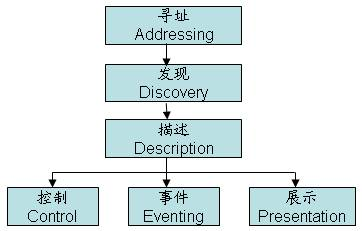

# UPnP基本原理介绍
- [UPnP基本原理介绍](#1)


参考链接  
1.UPnP基本原理以及在NAT中的应用  
https://blog.csdn.net/ljclx1748/article/details/8732663   

2.UPnP基本原理介绍   
https://blog.csdn.net/braddoris/article/details/41576515  

## <a id="1">UPnP基本原理介绍</a>
UPnP是通用即插即用（Universal Plug and Play）的缩写，主要用于设备的智能互联互通，使用UPnP协议不需要设备驱动程序，它可以运行在目前几乎所有的操作系统平台上，使得在办公室、家庭和其他公共场所方便地构建设备互联互通成为可能。  

本文介绍了UPnP所定义的基本协议（如SSDP、GENA、SOAP等），重点分析了UPnP实现的基本工作流程，并通过抓包工具捕获数据包，对各种流程传递的协议报文进行详尽分析，最后结合NAT技术，重点叙述UPnP在NAT技术中的应用。  

UPnP最大的愿景是希望任何设备一旦连接上网络，所有在网络上的设备马上就能知道有新设备加入，这些设备彼此之间能互相通信，更能直接使用或者控制它，一切都不需要人工设置，完全的即插即用。

服务、设备和控制点是UPnP网络的基本组件，它们之间的关系图如图1所示：


* 设备（Device）  
UPnP网络中定义的设备具有很广泛的含义，各种各样的家电、电脑外设、智能设备、无线设备、个人电脑等等都可以称之为设备。一台UPnP设备可以是多个服务的载体或多个子设备的嵌套。

* 服务（Service）  
在UPnP网络中，最小的控制单元就是服务。服务描述的是指设备在不同情况下的动作和设备的状态。例如，时钟服务可以表述为时间变化值、当前的时间值以及设置时间和读取时间两个活动，通过这些动作，就可以控制服务。

* 控制点（Control Point）  
在UPnP网络中，控制点指的是可以发现并控制其他设备的控制设备。在UPnP网络中，设备可以和控制点合并，为同一台设备，同时具有设备的功能和控制点的功能，即可以作为设备提供服务，也可以作为控制点发现和控制其他设备。



1、 首先控制点和设备都先获取IP地址后才能进行下一步的工作；  
2、 控制点首先要寻找整个网络上的UPnP设备，同时网络上的设备也要宣告自身的存在；  
3、 控制点要取得设备的描述，包括这些设备提供什么样的服务；   
4、 控制点发出动作信息给设备；  
5、 控制点监听设备的状态，当状态改变时作出相应的处理动作；   

### 发现阶段的报文交互
设备发现是UPnP网络实现的第一步，设备发现是由简单发现协议SSDP（Simple Service Discovery Protocol）来定义的。设备发现分两种情况：  

主动告知  
设备加入到网络中，设备发现过程允许设备向网络上的控制点告知它提供的服务，并且定期发送。
```js
NOTIFY * HTTP/1.1
HOST:239.255.255.250:1900
CACHE-CONTROL: max-age = seconds until advertisement expires
LOCATION: URL for UPnP description for root device
NT: search target(服务类型)
NTS: ssdp:alive
USN: advertisement UUID(不同服务的统一服务名，标示相同类型服务能力)
```

注意：上图location字段是网关向外通告了自己的IP地址以及UpnP监听的端口号，后续由设备向端口号2800发起TCP连接，利用XML来进行后续的描述、表示、控制等操作。  

利用查询来发现  
控制点加入到网络中时，设备发现过程允许控制点寻找网络上感兴趣的设备，并使得控制点获得设备能力的描述，同时控制点也可以向设备发送命令，侦听设备状态的改变，并将设备展示给用户。  

查询消息  
```js
M-SEARCH * HTTP/1.1
HOST: 239.255.255.250:1900
MAN: ssdp:discover
MX:seconds to delay response
ST:search target


各个参数所表达的含义
MX：设置设备响应最长等待时间，设备响应在0和这个值之间随机选择响应延迟的值
ST：设置服务查询的目标，它必须是下面的类型：
     ssdp:all 搜索所有设备和服务
     upnp:rootdevice 仅搜索网络中的根设备
     uuid:device-UUID 查询UUID标识的设备
     urn:schemas-upnp-org:device:device-
     type:version查询device-Type字段指定的设备类型，设备类型和版本由UPNP组织定义
     urn:schemas-upnp-org:service:service-
     type:version 查询service-Type字段指定的服务类型，服务类型和版本由UPNP组织定义

响应消息

HTTP/1.1 200 OK
CACHE-CONTROL: max-age = seconds until  advertisement expires
DATE: when reponse was generated
EXT:
LOCATION: URL for UPnP description for root device
SERVER: OS/Version UPNP/1.0 product/version
ST: search target
USN: advertisement UUID

各参数的意义
max-age指定通知消息存活时间，如果超过此时间间隔，控制点可以认为设备不存在
DATE： 指定响应生成的时间                                
EXT：向控制点确认MAN头域已经被设备理解
LOCATION：包含根设备描述得URL地址
SERVER：包含操作系统名，版本，产品名和产品版本信息。
ST：内容和意义与查询请求的相应字段相同
USN：表示不同服务的统一服务名，它提供了一种标识出相同类型服务的能力。

当在网关设备上去使能UpnP功能时，设备会向外发送SSDP的byebye消息。
SSDP：byebye消息

NOTIFY * HTTP/1.1
HOST:239.255.255.250:1900
NT:search target
NTS: ssdp:byebye
USN: advertisement UUID
```

描述阶段的报文交互  

UPnP网络结构的第二步是设备描述。在控制点发现了一个设备之后，控制点仍然对设备知之甚少，控制点可能仅仅知道设备或服务的UPnP类型，设备的UUID和设备描述的URL地址。为了让控制点更多的了解设备和它的功能或者与设备交互，控制点必须从发现消息中得到设备描述的URL，通过URL取回设备描述。  

设备描述是由设备制造商提供的，采用XML表述，并且遵循UPnP设备模版。此模版是由UPnP工作委员会生成的。设备描述包括制造商信息，包括模块名称和编号，序列号，制造商名称，制造商网站的URL等。对于一个物理设备可以包含多个逻辑设备，多个逻辑设备既可以是一个根设备其中嵌入多个设备，也可以是多个根设备的方式实现。  

```js
GET /InternetGatewayDevice.xml HTTP/1.1
Accept: text/xml, application/xml
User-Agent: Mozilla/4.0 (compatible; UPnP/1.0; Windows NT/5.1)
Host: 192.168.1.1:2800
Connection: Keep-Alive
Cache-Control: no-cache
Pragma: no-cache


HTTP/1.1 200 OK
Server:Unknown/0.0 UPnP/1.0 Conexant-EmWeb/R6_1_0
Connection: close Content-Type: text/xml
Expires: Thu, 01 Jan 1970 00:00:00 GMT
Cache-Control: no-cache Pragma: no-cache

<?xml version="1.0"?>
<root xmlns="urn:schemas-upnp-org:device-1-0">
  <specVersion>
    <major>1</major>
    <minor>0</minor>
  </specVersion>
  <URLBase>http://192.168.1.1:2800/</URLBase>
  <device>
    <deviceType>urn:schemas-upnp-org:device:InternetGatewayDevice:1</deviceType>
    <friendlyName>Huawei-3Com IGD</friendlyName>
<manufacturer>Huawei-3Com</manufacturer>
<manufacturerURL>http://aolynk.huawei-3com.com/</manufacturerURL>
<modelDescription>Huawei-3Com UPnP IGD in ISOS 9.0.8.9</modelDescription>
<modelName>IGD</modelName>
<modelNumber>9.0.8.9</modelNumber>
<modelURL>http://www.vendor.com/model</modelURL>
<serialNumber>Prototype</serialNumber>
<UDN>uuid:ab270226-590c-8539-3c7d-8ee91a399470</UDN>
<UPC>Universal Product Code</UPC>
        <iconList>
      <icon>
```

控制阶段的报文交互  

设备控制是UPnP网络的第三步。控制点先发送一个控制行为请求，要求设备开始服务，然后再按设备的URL发送相应的控制消息，控制消息是放置在XML文件中的那些SOAP格式的信息，最后，服务返回响应信息，指出服务是成功或是失败。对其中一个控制阶段所建立的TCP连接的如图21所示：  

```js
POST /EmWeb/UPnP/Control/4 HTTP/1.1
Content-Type: text/xml; charset="utf-8"
SOAPAction: "urn:schemas-upnp-org:service:WANIPConnection:1#GetSpecificPortMappingEntry"
User-Agent: Mozilla/4.0 (compatible; UPnP/1.0; Windows 9x)
Host: 192.168.1.1:2800
Content-Length: 625
Connection: Keep-Alive
Cache-Control: no-cache
Pragma: no-cache
 

<?xml version="1.0"?>
<SOAP-ENV:Envelope xmlns:SOAP-ENV="http://schemas.xmlsoap.org/soap/envelope/" SOAP-ENV:encodingStyle="http://schemas.xmlsoap.org/soap/encoding/"><SOAP-ENV:Body><m:GetSpecificPortMappingEntryxmlns:m="urn:schemas-upnp-org:service:WANIPConnection:1"><NewRemoteHostxmlns:dt="urn:schemas-microsoft-com:datatypes"dt:dt="string"></NewRemoteHost><NewExternalPortxmlns:dt="urn:schemas-microsoft-com:datatypes"dt:dt="ui2">25118</NewExternalPort><NewProtocolxmlns:dt="urn:schemas-microsoft-com:datatypes"dt:dt="string">TCP</NewProtocol></m:GetSpecificPortMappingEntry></SOAP-ENV:Body></SOAP-ENV:Envelope>
 

HTTP/1.1 200 OK
Server: Unknown/0.0 UPnP/1.0 Conexant-EmWeb/R6_1_0
Connection: close
Content-Type: text/xml; charset=utf-8
Expires: Thu, 01 Jan 1970 00:00:00 GMT
Cache-Control: no-cache
Pragma: no-cache
 

<s:Envelope
   xmlns:s="http://schemas.xmlsoap.org/soap/envelope/"
   s:encodingStyle="http://schemas.xmlsoap.org/soap/encoding/">
  <s:Body>
<u:GetSpecificPortMappingEntryResponse xmlns:u="urn:schemas-upnp-org:service:WANIPConnection:1"><NewInternalPort>25118</NewInternalPort><NewInternalClient>192.168.1.2</NewInternalClient><NewEnabled>1</NewEnabled><NewPortMappingDescription>BitComet (192.168.1.2:25118) 25118 TCP</NewPortMappingDescription><NewLeaseDuration>0</NewLeaseDuration></u:GetSpecificPortMappingEntryResponse>
  </s:Body>
</s:Envelope>
```
通过上面可以看出，PC利用通过UPnP向网关发送的SOAP格式的控制消息，请求BitComet的TCP的25118端口映射，网关返回OK消息。

事件阶段和展示阶段的报文交互  

设备事件是UPnP网络的第四步。一个服务的UPnP描述包括服务响应的动作列表和运行时模拟服务状态的变量列表。当这些变量改变时，就会产生一个事件，系统将修改事件列表的内容，事件服务器将事件向整个网络广播。控制点也可以事先向事件服务器预约事件信息，保证控制点感兴趣的事件及时准确的传送过来。事件消息放在xml文件中，格式是GENA。在UpnP的自动端口映射没有该报文的交互。  

```js
NOTIFY delivery path HTTP/1.1
HOST: delivery host:delivery port
CONTENT-TYPE: text/xml
NT: upnp:event
NTS: upnp:propchange
SID: uuid:subscription-UUID
SEQ: event key
<e:propertyset xmlns:e="urn:schemas-upnp-org:event-1-0">
 <e:property>
 <variableName>new value</variableName>
 </e:property>
  Other variable names and values (if any) go here
</e:propertyset>
```
 


## links
  * [目录](<目录.md>)