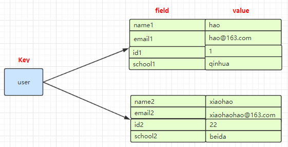
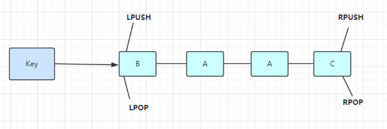
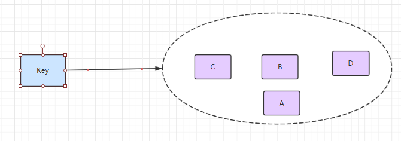
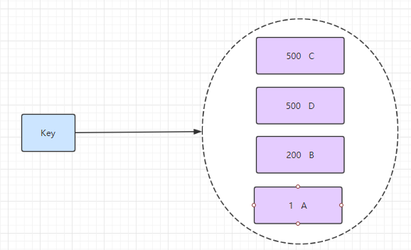

# redis
- [redis安装](#1)
- [redis使用](#2)
- [redis介绍](#3)
- [redis数据库设计](#4)

## <a id="1">redis安装</a>
参考链接：  
1.官方下载地址  
https://redis.io/download  

6.0.4版本编译  
wget http://download.redis.io/releases/redis-6.0.4.tar.gz   
tar xzf redis-6.0.4.tar.gz     
cd redis-6.0.4   
make    
编译会出现server错误，暂时没找到解决方法   

4.0.11版本编译出现centos redis libjemalloc.a(jemalloc.o): unrecognized relocation错误      
可以尝试采用make MALLOC=libc     

### 编译hiredis
参考链接：   
1.C++操作Redis的简单例子   
https://www.jianshu.com/p/11f4c7c71953   

下载hredis  
https://github.com/redis/hiredis  
解压之后，同样的   
make  
sudo make install  

/usr/local/include/hiredis
/usr/local/lib/

## <a id="1">redis使用</a>
参考链接：  
1.命令help   
https://redis.io/commands   

```cpp
运行服务端
src/redis-server

运行客户端
src/redis-cli
```

### 服务端相关命令
- 配置密码   
requirePass: 在redis.conf加入密码，验证可以使用在客户端auth password验证。如果使用了redis.conf需要./redis-server redis.conf运行。可以在rediscodesktopmanger中连接。  

- 配置开机启动   
1.在系统服务目录里创建redis.service文件
vim /etc/systemd/system/redis.service
写入以下内容：
```bash
[Unit]
Description=redis-server
After=network.target
[Service]
Type=forking
ExecStart=/usr/local/redis/bin/redis-server /usr/local/redis/bin/redis.conf
PrivateTmp=true
[Install]
WantedBy=multi-user.target

配置描述： 
Description:描述服务 
After:描述服务类别 
[Service]服务运行参数的设置 
Type=forking是后台运行的形式 
ExecStart为服务的具体运行命令 
ExecReload为重启命令 
ExecStop为停止命令 
PrivateTmp=True表示给服务分配独立的临时空间 
注意：[Service]的启动、重启、停止命令全部要求使用绝对路径 
[Install]运行级别下服务安装的相关设置，可设置为多用户，即系统运行级别为3
```
2.开启redis-server    
systemctl start redis.service #如果服务是开启状态，使用此命令会启动失败。   
3.开启成功，将服务加入开机自启    
systemctl enable redis.service #注意后面不能跟空格    


### 客户端相关命令
#### 配置相关
- CONFIG GET * ：使用 * 号获取所有配置项。
- CONFIG SET CONFIG_SETTING_NAME NEW_CONFIG_VALUE：CONFIG SET loglevel "notice" 过修改 redis.conf 文件或
使用 CONFIG set 命令来修改配置。   

redis.conf在src/目录下
redis.conf 配置项说明如下：  
<table class="reference">
<tbody><tr><th>序号</th><th>配置项</th><th>说明</th></tr>
<tr><td>
1</td>
<td><pre class="prettyprint prettyprinted" style=""><span class="pln">daemonize </span><span class="kwd">no</span></pre></td>
<td>Redis 默认不是以守护进程的方式运行，可以通过该配置项修改，使用 yes 启用守护进程（Windows 不支持守护线程的配置为 no ）
</td></tr>
<tr><td>
2</td> 
<td><pre class="prettyprint prettyprinted" style=""><span class="pln">pidfile </span><span class="pun">/</span><span class="kwd">var</span><span class="pun">/</span><span class="pln">run</span><span class="pun">/</span><span class="pln">redis</span><span class="pun">.</span><span class="pln">pid</span></pre></td> 
<td>
当 Redis 以守护进程方式运行时，Redis 默认会把 pid 写入 /var/run/redis.pid 文件，可以通过 pidfile 指定
</td></tr>
<tr><td>
3</td> 
<td>
<pre class="prettyprint prettyprinted" style=""><span class="pln">port </span><span class="lit">6379</span></pre>
</td> 
<td>
指定 Redis 监听端口，默认端口为 6379，作者在自己的一篇博文中解释了为什么选用 6379 作为默认端口，因为 6379 在手机按键上 MERZ 对应的号码，而 MERZ 取自意大利歌女 Alessia Merz 的名字
 </td></tr>
<tr><td>
4</td> 
<td><pre class="prettyprint prettyprinted" style=""><span class="pln">bind </span><span class="lit">127.0</span><span class="pun">.</span><span class="lit">0.1</span></pre>
</td> 
<td>绑定的主机地址
 </td></tr>
<tr><td>
5</td> 
<td> <pre class="prettyprint prettyprinted" style=""><span class="pln">timeout </span><span class="lit">300</span></pre></td> 
<td>
当客户端闲置多长秒后关闭连接，如果指定为 0 ，表示关闭该功能
</td></tr>
<tr><td>
6</td> 
<td> <pre class="prettyprint prettyprinted" style=""><span class="pln">loglevel notice</span></pre></td> 
<td>
指定日志记录级别，Redis 总共支持四个级别：debug、verbose、notice、warning，默认为 notice
 </td></tr>
<tr><td>
7</td> 
<td><pre class="prettyprint prettyprinted" style=""><span class="pln">logfile stdout</span></pre></td> 
<td>日志记录方式，默认为标准输出，如果配置 Redis 为守护进程方式运行，而这里又配置为日志记录方式为标准输出，则日志将会发送给 /dev/null
 </td></tr>
<tr><td>
8</td> 
<td> <pre class="prettyprint prettyprinted" style=""><span class="pln">databases </span><span class="lit">16</span></pre></td> 
<td>设置数据库的数量，默认数据库为0，可以使用SELECT <dbid>命令在连接上指定数据库id
</dbid></td></tr> 
<tr><td>
9</td> 
<td>
<pre class="prettyprint prettyprinted" style=""><span class="pln">save </span><span class="str">&lt;seconds&gt;</span><span class="pln"> </span><span class="str">&lt;changes&gt;</span></pre>
<p>Redis 默认配置文件中提供了三个条件：</p>
<p><strong>save 900 1</strong></p>
<p><strong>save 300 10</strong></p>
<p><strong>save 60 10000</strong></p>
<p>分别表示 900 秒（15 分钟）内有 1 个更改，300 秒（5 分钟）内有 10 个更改以及 60 秒内有 10000 个更改。</p>
</td> 
<td>
指定在多长时间内，有多少次更新操作，就将数据同步到数据文件，可以多个条件配合
 </td></tr>
<tr><td>
10</td> 
<td><pre class="prettyprint prettyprinted" style=""><span class="pln">rdbcompression yes</span></pre></td> 
<td>
指定存储至本地数据库时是否压缩数据，默认为 yes，Redis 采用 LZF 压缩，如果为了节省 CPU 时间，可以关闭该选项，但会导致数据库文件变的巨大
 </td></tr> 
<tr><td>
11</td> 
<td> <pre class="prettyprint prettyprinted" style=""><span class="pln">dbfilename </span><span class="kwd">dump</span><span class="pun">.</span><span class="pln">rdb</span></pre></td> 
<td>指定本地数据库文件名，默认值为 dump.rdb
 </td></tr>
<tr><td>
12</td> 
<td> <pre class="prettyprint prettyprinted" style=""><span class="pln">dir </span><span class="pun">./</span></pre></td> 
<td>指定本地数据库存放目录
 </td></tr>
<tr><td>
13</td> 
<td> <pre class="prettyprint prettyprinted" style=""><span class="pln">slaveof </span><span class="str">&lt;masterip&gt;</span><span class="pln"> </span><span class="str">&lt;masterport&gt;</span></pre> </td> 
<td>设置当本机为 slave 服务时，设置 master 服务的 IP 地址及端口，在 Redis 启动时，它会自动从 master 进行数据同步
</td></tr> 
<tr><td>
14</td> 
<td>  <pre class="prettyprint prettyprinted" style=""><span class="pln">masterauth </span><span class="pun">&lt;</span><span class="pln">master</span><span class="pun">-</span><span class="pln">password</span><span class="pun">&gt;</span></pre></td> 
<td>当 master 服务设置了密码保护时，slav 服务连接 master 的密码 
</td></tr> 
<tr><td> 
15</td> 
<td> <pre class="prettyprint prettyprinted" style=""><span class="pln">requirepass foobared</span></pre></td> 
<td>设置 Redis 连接密码，如果配置了连接密码，客户端在连接 Redis 时需要通过 AUTH &lt;password&gt; 命令提供密码，默认关闭
 </td></tr>
<tr><td>
16</td> 
<td> <pre class="prettyprint prettyprinted" style=""><span class="pln"> maxclients </span><span class="lit">128</span></pre></td> 
<td>设置同一时间最大客户端连接数，默认无限制，Redis 可以同时打开的客户端连接数为 Redis 进程可以打开的最大文件描述符数，如果设置 maxclients 0，表示不作限制。当客户端连接数到达限制时，Redis 会关闭新的连接并向客户端返回 max number of clients reached 错误信息
</td></tr> 
<tr><td>
17</td> 
<td> <pre class="prettyprint prettyprinted" style=""><span class="pln">maxmemory </span><span class="str">&lt;bytes&gt;</span></pre></td> 
<td>指定 Redis 最大内存限制，Redis 在启动时会把数据加载到内存中，达到最大内存后，Redis 会先尝试清除已到期或即将到期的 Key，当此方法处理 后，仍然到达最大内存设置，将无法再进行写入操作，但仍然可以进行读取操作。Redis 新的 vm 机制，会把 Key 存放内存，Value 会存放在 swap 区
</td></tr>
<tr><td>
18</td> 
<td><pre class="prettyprint prettyprinted" style=""><span class="pln">appendonly </span><span class="kwd">no</span></pre></td> 
<td>
指定是否在每次更新操作后进行日志记录，Redis 在默认情况下是异步的把数据写入磁盘，如果不开启，可能会在断电时导致一段时间内的数据丢失。因为  redis 本身同步数据文件是按上面 save 条件来同步的，所以有的数据会在一段时间内只存在于内存中。默认为 no
</td></tr>
<tr><td>
19</td> 
<td><pre class="prettyprint prettyprinted" style=""><span class="pln">appendfilename appendonly</span><span class="pun">.</span><span class="pln">aof</span></pre></td> 
<td>指定更新日志文件名，默认为 appendonly.aof
</td></tr>
<tr><td>
20</td> 
<td><pre class="prettyprint prettyprinted" style=""><span class="pln">appendfsync everysec</span></pre></td> 
<td>
<p>指定更新日志条件，共有 3 个可选值： </p>
<ul><li>
<strong>no</strong>：表示等操作系统进行数据缓存同步到磁盘（快） </li><li>
<strong>always</strong>：表示每次更新操作后手动调用 fsync() 将数据写到磁盘（慢，安全） </li><li>
<strong>everysec</strong>：表示每秒同步一次（折中，默认值）</li></ul>
</td></tr>
<tr><td>
21</td> 
<td><pre class="prettyprint prettyprinted" style=""><span class="pln">vm</span><span class="pun">-</span><span class="pln">enabled </span><span class="kwd">no</span></pre></td> 
<td>
指定是否启用虚拟内存机制，默认值为 no，简单的介绍一下，VM 机制将数据分页存放，由 Redis 将访问量较少的页即冷数据 swap 到磁盘上，访问多的页面由磁盘自动换出到内存中（在后面的文章我会仔细分析 Redis 的 VM 机制）
</td></tr>
<tr><td>
22</td> 
<td><pre class="prettyprint prettyprinted" style=""><span class="pln">vm</span><span class="pun">-</span><span class="pln">swap</span><span class="pun">-</span><span class="pln">file </span><span class="pun">/</span><span class="pln">tmp</span><span class="pun">/</span><span class="pln">redis</span><span class="pun">.</span><span class="pln">swap</span></pre></td> 
<td>
虚拟内存文件路径，默认值为 /tmp/redis.swap，不可多个 Redis 实例共享
</td></tr>
<tr><td>
23</td> 
<td> <pre class="prettyprint prettyprinted" style=""><span class="pln">vm</span><span class="pun">-</span><span class="pln">max</span><span class="pun">-</span><span class="pln">memory </span><span class="lit">0</span></pre></td> 
<td>将所有大于 vm-max-memory 的数据存入虚拟内存，无论 vm-max-memory 设置多小，所有索引数据都是内存存储的(Redis 的索引数据 就是 keys)，也就是说，当 vm-max-memory 设置为 0 的时候，其实是所有 value 都存在于磁盘。默认值为 0
</td></tr>
<tr><td>
24</td> 
<td><pre class="prettyprint prettyprinted" style=""><span class="pln">vm</span><span class="pun">-</span><span class="pln">page</span><span class="pun">-</span><span class="pln">size </span><span class="lit">32</span></pre> </td> 
<td>Redis swap 文件分成了很多的 page，一个对象可以保存在多个 page 上面，但一个 page 上不能被多个对象共享，vm-page-size 是要根据存储的 数据大小来设定的，作者建议如果存储很多小对象，page 大小最好设置为 32 或者 64bytes；如果存储很大大对象，则可以使用更大的 page，如果不确定，就使用默认值
</td></tr>
<tr><td>
25</td> 
<td><pre class="prettyprint prettyprinted" style=""><span class="pln">vm</span><span class="pun">-</span><span class="pln">pages </span><span class="lit">134217728</span></pre></td> 
<td>设置 swap 文件中的 page 数量，由于页表（一种表示页面空闲或使用的 bitmap）是在放在内存中的，，在磁盘上每 8 个 pages 将消耗 1byte 的内存。
</td></tr>
<tr><td>
26</td> 
<td><pre class="prettyprint prettyprinted" style=""><span class="pln">vm</span><span class="pun">-</span><span class="pln">max</span><span class="pun">-</span><span class="pln">threads </span><span class="lit">4</span></pre>
</td> 
<td>
设置访问swap文件的线程数,最好不要超过机器的核数,如果设置为0,那么所有对swap文件的操作都是串行的，可能会造成比较长时间的延迟。默认值为4
</td></tr>
<tr><td>
27</td> 
<td><pre class="prettyprint prettyprinted" style=""><span class="pln">glueoutputbuf yes</span></pre>
</td> 
<td>
 设置在向客户端应答时，是否把较小的包合并为一个包发送，默认为开启
</td></tr>
<tr><td>
28</td> 
<td>
<pre class="prettyprint prettyprinted" style=""><span class="pln">hash</span><span class="pun">-</span><span class="pln">max</span><span class="pun">-</span><span class="pln">zipmap</span><span class="pun">-</span><span class="pln">entries </span><span class="lit">64</span><span class="pln">
hash</span><span class="pun">-</span><span class="pln">max</span><span class="pun">-</span><span class="pln">zipmap</span><span class="pun">-</span><span class="pln">value </span><span class="lit">512</span></pre>
</td> 
<td>指定在超过一定的数量或者最大的元素超过某一临界值时，采用一种特殊的哈希算法
</td></tr>
<tr><td>
29</td> 
<td><pre class="prettyprint prettyprinted" style=""><span class="pln">activerehashing yes</span></pre>
</td> 
<td>
指定是否激活重置哈希，默认为开启（后面在介绍 Redis 的哈希算法时具体介绍）
</td></tr>
<tr><td>
30</td> 
<td>
<pre class="prettyprint prettyprinted" style=""><span class="pln">include </span><span class="pun">/</span><span class="pln">path</span><span class="pun">/</span><span class="pln">to</span><span class="pun">/</span><span class="kwd">local</span><span class="pun">.</span><span class="pln">conf</span></pre>
</td> 
<td>
指定包含其它的配置文件，可以在同一主机上多个Redis实例之间使用同一份配置文件，而同时各个实例又拥有自己的特定配置文件</td></tr></tbody></table>

## <a id="3">redis介绍</a>
### 数据结构
在 redis 中一共有5种数据结构：  
- String——字符串
- Hash——字典 
- List——列表
- Set——集合
- Sorted Set——有序集合


各自的使用场景：
#### 1.String——字符串  
String 数据结构是简单的 key-value 类型，value 不仅可以是 String，也可以是数字（当数字类型用 Long 可以表示的时候encoding 就是整型，其他都存储在 sdshdr 当做字符串）。使用 Strings 类型，可以完全实现目前 Memcached 的功能，并且效率更高。还可以享受 Redis 的定时持久化（可以选择 RDB 模式或者 AOF 模式），操作日志及 Replication 等功能。除了提供与 Memcached 一样的 get、set、incr、decr 等操作外，Redis 还提供了下面一些操作：
- LEN niushuai：O(1)获取字符串长度
- APPEND niushuai redis：往字符串 append 内容，而且采用智能分配内存（每次2倍）
- 设置和获取字符串的某一段内容
- 设置及获取字符串的某一位（bit）
- 批量设置一系列字符串的内容
- 原子计数器
- GETSET 命令的妙用，请于清空旧值的同时设置一个新值，配合原子计数器使用

```bash
127.0.0.1:6379> set hello world
OK
127.0.0.1:6379> get hello
"world"
127.0.0.1:6379> del hello
(integer) 1
127.0.0.1:6379> get hello
(nil)
127.0.0.1:6379> get counter
"2"
127.0.0.1:6379> incr counter
(integer) 3
127.0.0.1:6379> get counter
"3"
127.0.0.1:6379> incrby counter 100
(integer) 103
127.0.0.1:6379> get counter
"103"
127.0.0.1:6379> decr counter
(integer) 102
127.0.0.1:6379> get counter
"102"
```

#### 2.Hash——字典
在 Memcached 中，我们经常将一些结构化的信息打包成 hashmap，在客户端序列化后存储为一个字符串的值（一般是 JSON 格式），比如用户的昵称、年龄、性别、积分等。这时候在需要修改其中某一项时，通常需要将字符串（JSON）取出来，然后进行反序列化，修改某一项的值，再序列化成字符串（JSON）存储回去。简单修改一个属性就干这么多事情，消耗必定是很大的，也不适用于一些可能并发操作的场合（比如两个并发的操作都需要修改积分）。而 Redis 的 Hash 结构可以使你像在数据库中 Update 一个属性一样只修改某一项属性值。
- 存储、读取、修改用户属性    



```bash
127.0.0.1:6379> hset user name1 hao
(integer) 1
127.0.0.1:6379> hset user email1 hao@163.com
(integer) 1
127.0.0.1:6379> hgetall user
1) "name1"
2) "hao"
3) "email1"
4) "hao@163.com"
127.0.0.1:6379> hget user user
(nil)
127.0.0.1:6379> hget user name1
"hao"
127.0.0.1:6379> hset user name2 xiaohao
(integer) 1
127.0.0.1:6379> hset user email2 xiaohao@163.com
(integer) 1
127.0.0.1:6379> hgetall user
1) "name1"
2) "hao"
3) "email1"
4) "hao@163.com"
5) "name2"
6) "xiaohao"
7) "email2"
8) "xiaohao@163.com"
```

#### 3.List——列表
List 说白了就是链表（redis 使用双端链表实现的 List），相信学过数据结构知识的人都应该能理解其结构。使用 List 结构，我们可以轻松地实现最新消息排行等功能（比如新浪微博的 TimeLine ）。List 的另一个应用就是消息队列，可以利用 List 的 *PUSH 操作，将任务存在 List 中，然后工作线程再用 POP 操作将任务取出进行执行。Redis 还提供了操作 List 中某一段元素的 API，你可以直接查询，删除 List 中某一段的元素。
- 微博 TimeLine
- 消息队列

使用列表的技巧
- lpush+lpop=Stack(栈)
- lpush+rpop=Queue（队列）
- lpush+ltrim=Capped Collection（有限集合）
- lpush+brpop=Message Queue（消息队列）



```bash
127.0.0.1:6379> lpush mylist 1 2 ll ls mem
(integer) 5
127.0.0.1:6379> lrange mylist 0 -1
1) "mem"
2) "ls"
3) "ll"
4) "2"
5) "1"
127.0.0.1:6379>
```

#### 4.Set——集合
Set 就是一个集合，集合的概念就是一堆不重复值的组合。利用 Redis 提供的 Set 数据结构，可以存储一些集合性的数据。比如在微博应用中，可以将一个用户所有的关注人存在一个集合中，将其所有粉丝存在一个集合。因为 Redis 非常人性化的为集合提供了求交集、并集、差集等操作，那么就可以非常方便的实现如共同关注、共同喜好、二度好友等功能，对上面的所有集合操作，你还可以使用不同的命令选择将结果返回给客户端还是存集到一个新的集合中。
- 共同好友、二度好友
- 利用唯一性，可以统计访问网站的所有独立 IP
- 好友推荐的时候，根据 tag 求交集，大于某个 threshold 就可以推荐

使用：命令都是以s开头的  sset 、srem、scard、smembers、sismember  



```bash
127.0.0.1:6379> sadd myset hao hao1 xiaohao hao
(integer) 3
127.0.0.1:6379> SMEMBERS myset
1) "xiaohao"
2) "hao1"
3) "hao"
127.0.0.1:6379> SISMEMBER myset hao
(integer) 1
```

#### 5.Sorted Set——有序集合
和Sets相比，Sorted Sets是将 Set 中的元素增加了一个权重参数 score，使得集合中的元素能够按 score 进行有序排列，比如一个存储全班同学成绩的 Sorted Sets，其集合 value 可以是同学的学号，而 score 就可以是其考试得分，这样在数据插入集合的时候，就已经进行了天然的排序。另外还可以用 Sorted Sets 来做带权重的队列，比如普通消息的 score 为1，重要消息的 score 为2，然后工作线程可以选择按 score 的倒序来获取工作任务。让重要的任务优先执行。
- 带有权重的元素，比如一个游戏的用户得分排行榜
- 比较复杂的数据结构，一般用到的场景不算太多

使用： 有序集合的命令都是 以z开头 zadd 、zrange、zscore



```bash
127.0.0.1:6379> zadd myscoreset 100 hao 90 xiaohao
(integer) 2
127.0.0.1:6379> ZRANGE myscoreset 0 -1
1) "xiaohao"
2) "hao"
127.0.0.1:6379> ZSCORE myscoreset hao
"100"
```

### redis 其他功能使用场景
#### 1.订阅-发布系统
Pub/Sub 从字面上理解就是发布（Publish）与订阅（Subscribe），在 Redis 中，你可以设定对某一个 key 值进行消息发布及消息订阅，当一个 key 值上进行了消息发布后，所有订阅它的客户端都会收到相应的消息。这一功能最明显的用法就是用作实时消息系统，比如普通的即时聊天，群聊等功能。

#### 2.事务——Transactions
谁说 NoSQL 都不支持事务，虽然 Redis 的 Transactions 提供的并不是严格的 ACID 的事务（比如一串用 EXEC 提交执行的命令，在执行中服务器宕机，那么会有一部分命令执行了，剩下的没执行），但是这个 Transactions 还是提供了基本的命令打包执行的功能（在服务器不出问题的情况下，可以保证一连串的命令是顺序在一起执行的，中间有会有其它客户端命令插进来执行）。Redis 还提供了一个 Watch 功能，你可以对一个 key 进行 Watch，然后再执行 Transactions，在这过程中，如果这个 Watched 的值进行了修改，那么这个 Transactions 会发现并拒绝执行。

## <a id="4">redis数据库设计</a>
参考链接：  
1.Redis键值设计    
https://blog.csdn.net/iloveyin/article/details/7105181   
  
### 1.关系型数据库模型  
```redis
关系型数据转化为KV数据库，方法如下：
key 表名：主键值：列名
value 列值
一般使用冒号做分割符，这是不成文的规矩。

+---------+----------------+-------------+---------------------+
| user_id | name           | login_times | last_login_time     |
+---------+----------------+-------------+---------------------+
|       1 | ken thompson   |           5 | 2011-01-01 00:00:00 |
|       2 | dennis ritchie |           1 | 2011-02-01 00:00:00 |
|       3 | Joe Armstrong  |           2 | 2011-03-01 00:00:00 |
+---------+----------------+-------------+---------------------+
user_id表的主键
name表示用户名
login_times表示该用户的登录次数，每次用户登录
login_times会自增
last_login_time更新为当前时间

Set login:1:login_times 5
Set login:2:login_times 1
Set login:3:login_times 2

Set login:1:last_login_time 2011-1-1
Set login:2:last_login_time 2011-2-1
Set login:3:last_login_time 2011-3-1

set login:1:name ken thompson
set login:2:name dennis ritchie
set login:3:name Joe Armstrong

一般用户是无法知道自己的id的，只知道自己的用户名，所以还必须有一个从name到id的映射关系
set "login:ken thompson:id"      1
set "login:dennis ritchie:id"    2
set "login: Joe Armstrong:id"    3

python举例:
uid = r.get("login:%s:id" % name)  #获得用户的id
ret = r.incr("login:%s:login_times" % uid) #自增用户的登录次数
ret = r.set("login:%s:last_login_time" % uid, datetime.datetime.now())#更新该用户的最后登录时间

获得保存的是最近的N个登录用户
ret = r.lpush("login:last_login_times", uid) #把当前登录人添加到链表里
ret = redis.ltrim("login:last_login_times", 0, N-1) #保持链表只有N位

这样需要获得最新登录人的id，如下的代码即可
last_login_list = r.lrange("login:last_login_times", 0, N-1)

求登录次数最多的人，对于排序，积分榜这类需求，sorted set非常的适合，我们把用户和登录次数统一存储在一个sorted set里。
zadd login:login_times 5 1
zadd login:login_times 1 2
zadd login:login_times 2 3

这样假如某个用户登录，额外维护一个sorted set，代码如此
#对该用户的登录次数自增1
ret = r.zincrby("login:login_times", 1, uid)
那么如何获得登录次数最多的用户呢，逆序排列取的排名第N的用户即可
ret = r.zrevrange("login:login_times", 0, N-1)
```


## links
  * [目录](<目录.md>)