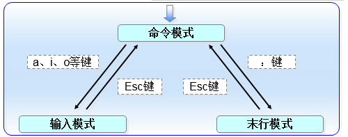

# vim
- [vim](#1)


## <a id="1">vim</a>
```shell
Vim编辑器中设置了三种模式—命令模式、末行模式和编辑模式。
命令模式：控制光标移动，可对文本进行复制、粘贴、删除和查找等工作。
输入模式：正常的文本录入。
末行模式：保存或退出文档，以及设置编辑环境。
```



```shell
命令模式
命令	作用
dd	删除（剪切）光标所在整行
5dd	删除（剪切）从光标处开始的5行
yy	复制光标所在整行
5yy	复制从光标处开始的5行
n	显示搜索命令定位到的下一个字符串
N	显示搜索命令定位到的上一个字符串
u	撤销上一步的操作
p	将之前删除（dd）或复制（yy）过的数据粘贴到光标后面

模式模式
:w	保存
:q	退出
:q!	强制退出（放弃对文档的修改内容）
:wq!	强制保存退出
:set nu	显示行号
:set nonu	不显示行号
:命令	执行该命令
:整数	跳转到该行
:s/one/two	将当前光标所在行的第一个one替换成two
:s/one/two/g	将当前光标所在行的所有one替换成two
:%s/one/two/g	将全文中的所有one替换成two
?字符串	在文本中从下至上搜索该字符串
/字符串	在文本中从上至下搜索该字符串
打开文件到某一行 vim +3 xx.txt
打开到某一个字符  vim +/asd xx.txt
```

## links
  * [目录](<目录.md>)