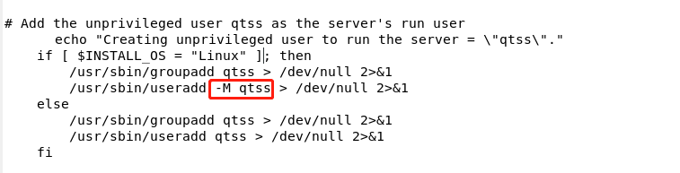

# 4.DSS软件安装使用
- [DSS编译搭建](#1)
- [DSS应用](#2)

## <a id="1">DSS编译搭建</a>
本文主要记录CentOS7 搭建Darwin Stream Server6.0.3流媒体服务。    
### 参考链接： 
1.CentOS7 搭建Darwin Stream Server6.0.3流媒体服务  
https://blog.csdn.net/dqxiaoxiao/article/details/97610907  

2.Darwin Stream Server6.0.3及补丁下载  
https://download.csdn.net/download/tom_zhxc1794/10912552  

3.备用编译安装  
https://blog.csdn.net/sheji105/article/details/73823945  
https://www.jianshu.com/p/aeb77355e314  

4.链接  
https://www.jianshu.com/p/aeb77355e314  

5.遇到问题  
https://www.bbsmax.com/A/1O5EOo3az7/  

6.官网  
https://macosforge.github.io/dss/  
  
### 1.准备工作
yum install patch make gcc g++ 安装必要的软件，如果安装失败需要可以到：
http://www.rpmfind.net/linux/rpm2html/search.php? 寻找合适的rpm软件。

### 2.准备源码
在官网上 https://macosforge.github.io/dss/  源码下载完成后，需要解压tar包，后面需要进行安装补丁文件所以也要下载补丁文件。
https://download.csdn.net/download/tom_zhxc1794/10912552 。
dss-6.0.3.patch和dss-hh-20080728-1.patch,将下载好的两个补丁文件放到解压好的DarwinStreamingSrvr6.0.3-Source目录中。 

### 3.修改源码
进入源码目录,找到APICommonCode/QTSSModuleUtils.cpp文件,修改  
IPComponentStr IPComponentStr::sLocalIPCompStr("127.0.0.*"); 把它改为  
IPComponentStr IPComponentStr::sLocalIPCompStr("*.*.*.*");(不修改的话只允许本地推流)。  
然后给源码安装补丁文件，进入DarwinStreamingSrvr6.0.3-Source目录，并打补丁：  
patch -p1 < dss-6.0.3.patch  
接着打另一个补丁  
patch -p1 < dss-hh-20080728-1.patch  

### 4.编译  
进入源码目录，创建Darwin 用户qtss：  
groupadd qtss   
useradd qtss -g qtss  
编译Buildit，运行 ./Buildit。然后继续执行 ./buildtarball 。这两个执行需要sudo进行执行，避免出现编译错误。  
最后显示success就是编译安装成功。  

### 5.安装使用
最后生成的*.tar.gz压缩文件，进入DarwinStreamingSrvr-Linux  
cd DarwinStreamingSrvr-Linux。  
编辑Install，查找 Linux，然后你会发现，在下面，这里 -M qtss，改成 -m,因为 -M 是执行不了，得改成 -m 才能执行。



改完之后，可以安装了  ./Install。  
安装完成，那么，需要检测一下是不是OK。  


很明显，一切正常，1220端口也起来了，这个端口是用来网页登陆的 ，Darwin进程也起来了.


在服务器中的浏览器中输入：http://127.0.0.1:1220 ,并输入对应刚刚设置的用户名和密码。  
点击登录然后它让你进行密码的重新设置，点击Next然后它让你选择是否流媒体经过SSL安装验证，暂时不选择。  
点击Next然后需要设置媒体路径，默认的就是/usr/local/movies/。  
然后是选择是否经过80端口通过防火墙。  
我们也没有选择，我们选择在CentOS7中将防火墙关闭，点击Finish然后我们看到服务正在运行中。  
然后我们将用VLC Player测试一下媒体(M)-->打开网络串流(N),切换到 "网络" 选项卡输入链接：  
rtsp://你的Darwin流媒体服务IP/sample_50kbit.3gp

### 6.直接使用DSS
下载Darwin Streaming Server v5.5.5 Linux安装包，解包DarwinStreamingSrvr5.5.5-Linux.tar.gz文件。  
安装后至少需要安装以下5个组件，确保软件安能正常安装及运行：  
yum -y install gcc gcc-c++ perl ld-linux.so.2 libstdc++.so.6 (glibc.i686暂不用如果不行再加)   
启动及开机自动启动：  
sudo /usr/local/sbin/DarwinStreamingServer 启动服务  
sudo /usr/local/sbin/streamingadminserver.pl  启动web  
开机自动启动：  
mv /root/rtsp_server.sh /etc/rc.d/init.d  
cd /etc/rc.d/init.d  
chmod +x rtsp_server.sh  
chkconfig --add rtsp_server.sh  
chkconfig rtsp_server.sh on  
开机启动脚本设置完  


### 7.鉴权及其他
如果在启动服务后面加-D可以进行debug进行运行。  
如果需要鉴权的话，可以在设置的movie目录下新增qtaccess文件  
```shell
AuthName rtsptest
AuthUserFile /etc/streaming/qtusers
AuthGroupFile /etc/streaming/qtgroups
require user admin athnkk
require group admin
```
如果要新增用户需要用 qtpasswd新增用户修改密码。 

### 8.问题
- 1.ffmpeg推流到DarwinStreamServer返回401  
问题产生原因:服务器只允许本地推流  
解决方法1:修改源码,在编译源码安装篇处理(如编译安装步骤3)  
解决方法2:在DarwinStreamServer的movies目录中添加一个qtaccess文件,内容为:  
```shell
<Limit WRITE> 
require any-user 
</Limit>
<Limit READ>
require any-user
</Limit>
```

- 2.如果远程服务器没有设置公网ip  ffmpeg时会返回404  
问题产生原因:DarwinStreamServer不知道自己已经身处公网环境(呆萌可爱)  
解决方法:ip addr add dev eth0 [公网IP]，向eth0添加一个公网地址就解决问题了  
用ip addr查看是否添加成功  
添加之后别忘了重启DarwinStreamServer!!!  

- 3.在一切看上去都正常的时候,ffmpeg推流又报错:av_interleaved_write_frame(): Broken pipe  
问题产生原因:ffmpeg到DarwinStreamServer 服务器端的udp传输不稳定  
解决方法:在 -f rtsp后面加上 -rtsp_transport tcp !!!强制使用tcp  

- 4.点播mp4文件返回405不支持文件格式  
需要使用mp4box工具进行hint处理。或者使用ffmpeg。  

## <a id="2">DSS应用</a>


### 中继
参考链接：  
1.Darwin Streaming Server Relay Setting  
https://www.bbsmax.com/A/KE5Q7VMkzL/   

2.Darwin Stream server（DSS服务器）的Relay（中继/转发）设置  
https://blog.csdn.net/sunxiaopengsun/article/details/73457681  

A与B机安装perl和Darwin Streaming Server，C机安装VLC播放器。  
A设置如下:  
单击playlist，选择按钮New Media Playlist。  
name处填写playlist的名字，  
mount point处填写与playlist同名的sdp文件名。  
Play Mode中选择Sequential Looped，以保证播放不停止。  
Available Content中，可以拖拽媒体文件到右侧的Items in this playlist。  
建立新的relay。单击左侧relay Settings，在右侧选择New Relay。  
Source Settings中：
Source Hostname or IP Address中填写源数据ip。因为是将本机的playlist转给其它地址，所以，Source Hostname or IP Address中填写的是127.0.0.1。  
Mount Point就填写要播放的playlist的名字（/v.sdp）。   
Request incoming Stream中填写A机的DSS用户名和密码。  
Destination Settings中：Hostname or IP Address填写B机IP地址。  
Base Port中填写将送达B机的端口号（需要填写来建立连接）。Multicast TTL填写最多可以中继的级数。    
最后启动。  

B设置如下:  
将A机DSS安装目录下的playlist文件夹中的与mount point同名的文件夹中的v.sdp文件拷贝到B机的媒体文件夹中。在B机上编辑v.sdp文件，找到第一个以“m=”开头的行，将0改为前面在Relay Setting中配置的Base Port（i.e.9000）；继续找到下一个以“m=”开头的行，将0改为Base Port+2（i.e.9002）。  
在B机建立新的relay。单击左侧relay Settings，在右侧选择New Relay。  
Source Settings中：  
Source Hostname or IP Address中填写源数据IP。因为是接收A机的playlist，所以，Source Hostname or IP Address中填写的是A机的IP地址。  
Mount Point就填写要播放的playlist的名字（/v.sdp）。  
Request incoming Stream中填写A机的DSS用户名和密码。  
Destination Settings中：  
Hostname or IP Address填写目的IP地址。因为是接收A机的playlist，所以，Source Hostname or IP Address中填写的是127.0.0.1。  
Base Port中填写将送达B机的端口号（需要填写来建立连接，与4中相同）。  
Multicast TTL填写最多可以中继的级数。  

### DarwinStreamServer 简单测试 720P 2Mbps 4Mbps码流 RTSP 20路推20路拉  
参考链接：  
1.Darwin Streaming Server Relay Setting   
https://my.oschina.net/u/3776585/blog/1633309  

ffmpeg -re -i 。/test.mp4 -c copy -rtsp_transport udp -f rtsp rtsp://$IP:$PORT/test.sdp


## links
  * [目录](<目录.md>)