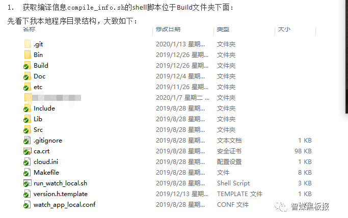
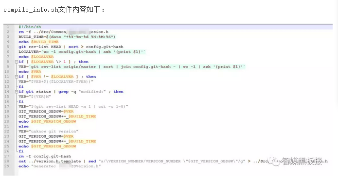
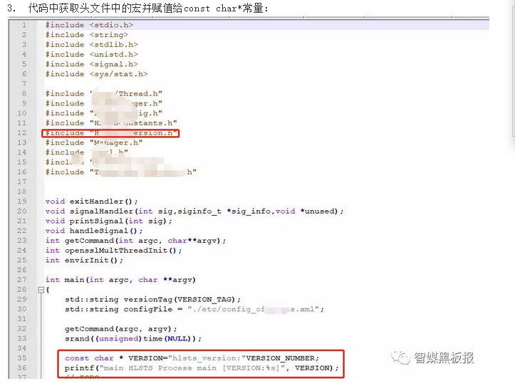

# svn git 操作
- [Git常见操作文档](#1)
- [Git常见问题](#2)
- [给中间件和可执行程序打上GIT版本和编译时间](#3)


### <a id="1">Git常见操作文档</a>
#### 1.参考链接  

* 1.本地代码上传到git  
https://blog.csdn.net/u011961856/article/details/79687374  
* 2.本地项目关联到远程git仓库  
https://blog.csdn.net/vi_error/article/details/80608793  
* 3.Git远程操作详解  
http://www.ruanyifeng.com/blog/2014/06/git_remote.html  
* 4.Git基本配置  
https://www.jianshu.com/p/6e1de95828a8
* 5.《Git权威指南》  
http://www.worldhello.net/gotgithub/  
https://git-scm.com/book/zh/v2  

#### 2.本地代码上传到git
在git中远程库的名字就是origin。 

##### 1.远端操作  
github上创建自己的Repository，点击NewRepository，创建空得工程。  

##### 2.设置仓库级别的用户名和邮箱  
```shell
git config -l：查看当前全部的配置
git status：查看仓库当前的状态
#全局级配置，如果没有仓库级别的特殊配置，默认读取这个配置
git config --global user.name "name"
git config --global user.email "email"
#仓库级配置，一般一个项目配置一次
git config user.name "name"
git config user.email "email"
```

##### 3.完全空白项目与github关联，在本地目录下
```shell
git init：创建一个.git文件夹
git add . ：将项目的所有文件添加到本地仓库
git commit -m "注释语句" ：add的文件commit到仓库
git remote add origin http://ip:60360/name/videods.git或者
git@ip:60360:name/mediaps.git
将本地的仓库关联到github上，添加url在.git中config文件可查看。可以选择ssh方式或者http方式。
选择ssh方式需要在git上添加ssh私钥，生成ssh方式如下：
ssh-keygen -t rsa -C "18963609524@189.cn" 创建ssh，将id_rsa.pub内容复制到git sshkey中。
选择http方式，在关联github输入Username和Password，如果输错了需要修改凭据。
如果不小心将git远程地址配错了，git remote rm origin清除后重新关联。
git push -u origin master：上传代码到github远程仓库
```

##### 4.本地文件与github有文件的项目关联
```shell
git init：初始化
git remote add origin http/gitssh地址：设置remote地址
git pull origin master：获取远程仓库master分支上的内容
git branch --set-upstream-to=origin/master master：将当前分支设置为远程仓库的master分支
git add . ：全部文件加入git版本管理
git commit -m "注释"：提交文件 使用-m 编写注释
git push：推送到远程分支
```

##### 5.可能遇到问题：  
* 1.git push http地址时候 报 HTTP Basic: Access denied 错误  
本地git配置的用户名、密码与gitlabs上注册的用户名、密码不一致。  
  * a. 如果账号密码有变动 用这个命令 git config –system –unset credential.helper 重新输入账号密码。如果再git bash窗口没
       有权限操作，可以在开始附件中window系统中右击选择管理员运行。  
  * b. 如果用了第一个命令 还不能解决问题那么 用这个命令： 
       git config –global http.emptyAuth true
  * c.如果以上两个方法不起作用，那么采用以下方法：
      进入控制面板》用户账号》凭据管理器》windows凭据》普通凭据，在里面找到git，点开编辑密码，更新为最新密码之后就可以正常操作了。


##### 6.本地文件与github有文件的项目关联
```s
1. 运行 gc ，生成 pack 文件（后面的 --prune=now 表示对之前的所有提交做修剪，有的时候仅仅 gc 一下.git 文件就会小很多）$ git gc --prune=now2. 找出最大的三个文件（看自己需要）$ git verify-pack -v .git/objects/pack/*.idx | sort -k 3 -n | tail -3
# 示例输出：
#1debc758cf31a649c2fc5b0c59ea1b7f01416636 blob   4925660 3655422 14351
#c43a8da9476f97e84b52e0b34034f8c2d93b4d90 blob   154188651 152549294 12546842
#2272096493d061489349e0a312df00dcd0ec19a2 blob   155414465 153754005 1650961363. 查看那些大文件究竟是谁（c43a8da 是上面大文件的hash码）$ git rev-list --objects --all | grep c43a8da
# c43a8da9476f97e84b52e0b34034f8c2d93b4d90 data/bigfile4.移除对该文件的引用（也就是 data/bigfile）$ git filter-branch --force --index-filter "git rm --cached --ignore-unmatch 'data/bigfile'"  --prune-empty --tag-name-filter cat -- --all5.进行 repack $ git for-each-ref --format='delete %(refname)' refs/original | git update-ref --stdin
$ git reflog expire --expire=now --all
$ git gc --prune=now6.查看 pack 的空间使用情况$ git count-objects -v

一：常规办法
1.删除无用的分支
$ git branch -d <branch_name>
2.删除无用的tag
$ git tag -d <tag_name>
3.清理本地版本库
$ git gc --prune=now

二：高级办法
注意高级办法会导致push冲突，需要强制提交，其他人pull也会遇到冲突，建议重新克隆。
！！！注意这些操作都很危险，建议找个示例库进行测试，确保自己完全掌握之后再实际操作。
1.完全重建版本库
$ rm -rf .git
$ git init
$ git add .
$ git cm "first commit"
$ git remote add origin <your_github_repo_url>
$ git push -f -u origin master
2.有选择性的合并历史提交
$ git rebase -i <first_commit>
会进入一个如下所示的文件
  1 pick ba07c7d add bootstrap theme and format import
  2 pick 7d905b8 add newline at file last line
  3 pick 037313c fn up_first_char rename to caps
  4 pick 34e647e add fn of && use for index.jsp
  5 pick 0175f03 rename common include
  6 pick 7f3f665 update group name && update config
将想合并的提交的pick改成s，如
  1 pick ba07c7d add bootstrap theme and format import
  2 pick 7d905b8 add newline at file last line
  3 pick 037313c fn up_first_char rename to caps
  4 s 34e647e add fn of && use for index.jsp
  5 pick 0175f03 rename common include
  6 pick 7f3f665 update group name && update config
这样第四个提交就会合并进入第三个提交。
等合并完提交之后再运行
$ git push -f
$ git gc --prune=now
```

##### 7.总结Git的所有套路
https://mp.weixin.qq.com/s?__biz=MzAxODQxMDM0Mw==&mid=2247485544&idx=1&sn=afc9d9f72d811ec847fa64108d5c7412&chksm=9bd7f660aca07f7643f31bf16ab56ba695d964cdadde2aebc72e6817074504890fb09d2a80ca&scene=21#wechat_redirect

```c++
本地 Git 的三个分区分别是：working directory，stage/index area，commit history。

working directory是「工作目录」，也就是我们肉眼能够看到的文件，后文我们称其为work dir区。

当我们在work dir中执行git add相关命令后，就会把work dir中的修改添加到「暂存区」stage area（或者叫index 
area）中去，后文我们称暂存区为stage区。

当stage中存在修改时，我们使用git commit相关命令之后，就会把stage中的修改保存到「提交历史」commit histor
y中，也就是HEAD指针指向的位置。后文我们称「提交历史」为history区。

关于commit history我们多说几句，任何修改只要进入commit history，基本可以认为永远不会丢失了。每个commit都有一个唯一的 Hash 值，我们经常说的HEAD或者master分支，都可以理解为一个指向某个commit的指针。

work dir和stage区域的状态，可以通过命令git status来查看，history区域的提交历史可以通过git log命令来查看。

需求一，如何把work dir中的修改加入stage。
使用 git add 相关的命令就行了。顺便一提，add有个别名叫做stage，也就是说你可能见到git stage相关的命令，这个命令和git add命令是完全一样的。

需求二，如何把stage中的修改还原到work dir中。
比如我先将当前work dir中的修改添加到stage中，然后又对work dir中的文件进行了修改，但是又后悔了，如何把work dir中的全部或部分文件还原成stage中的样子呢？
git checkout a.txt

需求三，将stage区的文件添加到history区。
git commit -m '一些描述'
git commit --amend
这样就是把错别字的修改和之前的那个commit中的修改合并，作为一个commit提交到history区。

需求四，将history区的文件还原到stage区。
git reset a.txt
这个命令是一个简写，实际上reset命令的完整写法如下：
$ git reset --mixed HEAD a.txt

需求五，将work dir的修改提交到history区。
这个需求很简单啦，先git add然后git commit就行了，或者一个快捷方法是使用命令git commit -a。

需求六，将history区的历史提交还原到work dir中。
依然是使用checkout命令，但是和之前的使用方式有一些不同：
$ git checkout HEAD .

需求七，合并多个commit。
$ git reset 17bd20c
$ git add .
$ git commit -m 'balabala'

需求八，HEAD回退导致commit在git log无法看怎么得到Hash？
git reflog
```


#### gitlab参考
##### Git global setup
```shell
git config --global user.name "name"
git config --global user.email "18963609524@189.cn"
```

##### Create a new repository
```shell
git clone git@ip:name/videopaasplat.git
cd videopaasplat
touch README.md
git add README.md
git commit -m "add README"
git push -u origin master
```

##### Push an existing folder
```shell
cd existing_folder
git init
git remote add origin git@ip:name/videopaasplat.git
git add .
git commit -m "Initial commit"
git push -u origin master
```

##### Push an existing Git repository
```shell
cd existing_repo
git remote rename origin old-origin
git remote add origin git@ip:name/videopaasplat.git
git push -u origin --all
git push -u origin --tags
```

### <a id="1">Git常见操作文档</a>

### <a id="3">给中间件和可执行程序打上GIT版本和编译时间</a>
```c++
https://mp.weixin.qq.com/s/YbbBKlVY15TFjtTKoeDJtw

问题背景：
平时开发很多的C/C++后台服务或者中间件，这些成果物以可执行的二进制程序或者以动态库、静态库的形式部署在线上。一旦将该服务上线，出问题后一般都需要我们确定该程序的版本分支和版本号，下面介绍一种简单方法将程序的编译信息硬编译到二进制成果物中。

解决目标：
给成果物符号文件中加上git提交版本号和编译日期，允许通过strings或者nm命令查询该成果物的符号文件，然后通过grep过滤编译信息。

解决思路：
1. 通过shell脚本获取代码的提交分支git信息，获取系统当时编译日期和时间；
2. 能够将1步骤上获取到的编译信息用一个模板文件version.h文件的宏进行定义；
3. 代码入口处include该头文件，同时将该宏赋值给const char*字符常量指针；
4. makefile编译之前进行123步骤，将获取到的编译信息编译到成果物的符号文件中；
5. 线上出问题后，需要确定成果物的编译信息时，通过strings和grep命令组合查询即可。

具体实现：
1. 获取编译信息compile_info.sh的shell脚本位于Build文件夹下面：
先看下我本地程序目录结构，大致如下：
```





```c++
代码解释：
第1行：说明这是个shell脚本；
第2行：这就是我们要生成的文件，如果以前的老文件存在，则强制删除毕竟我们需要这次编译生成最细的编译信息；
第3行：获取当前编译时间并格式化；
第5行：运行 git 命令。git rev-list HEAD 获取推送到服务器内容的提交列表，然后使用管道 | 将其结果发送给 sort 命令进行排序，之后使用 > 作输出重定向，生成 config.git-hash 文件；
第6行：调用一个 shell 命令：使用 wc 计算 config.git-hash 的行数，然后使用 awk 将其输出到一个变量 LOCALVER 中；
第8行到第20行：如果 $LOCALVER > 1 —— 注意有 > 的转义；并且，在变量赋值时无需 $ 符号，但是在使用时需要添加 $ —— 那么使用“git rev-list origin/master | sort | join config.git-hash – | wc -l | awk ‘{print $1}’”对 VER 进行赋值。这一段命令我们前面已经解释过，这里不解释。如果 $VER != $LOCALVER，则将 VER 与 LOCALVER 拼接在一起。然后我们检查 git status 是不是 modified，如果是的话则在后面添加一个 M。然后，我们使用 cut 命令取前七位。最后，我们将这个值赋GIT_VERSION。注意，我们在 $VER 前面增加了一个 r，当然你也可以不加，根据自己的需要；第21行到第24行，如果 $LOCALVER <= 1，则直接给 GIT_VERSION 和 VER 初始值；
第27行，删除 config.git-hash 文件；

2. 生成头文件：
第28行：使用 cat 命令打开模板文件，利用管道将其传递给 sed（一个无需打开文件即可编辑的编辑）发给 sed 的命令是“s/\$FULL_VERSION/$FULL_VERSION/g”，s 代表替换，s/AAA/BBB/ 表示将 AAA 用 BBB 替换，g 表示全局。注意，这里的 AAA 是正则表达式，因此，我们在查找文件中的 $FULL_VERSION 的时候，需要将 $ 转义。而后面的 $GIT_VERSION 则是取 shell 变量的值。最后输出重定向到 ../Src/Common/*version.h 文件。

其中我们通过该脚本的执行，已经将git提交前八位版本号和编译时间已经用宏VERSION_NUMBER进行了定义，后面只需要在代码包含该头文件和使用该宏即可，即可以把其打印到日志里也可以硬编译到二进制符号文件中。
```



```C++
4. 我们可以在后面日志中打印该符号常量，这样当出现问题时，查看日志即可获得当时的编译信息；

5. 编译出来的成果物中查询过滤：
由于赋值给字符常量指针，我们可以在成果物的符号文件中用命令行查找该宏的信息：
strings 成果物名称|grep "成果物前缀_version"
```


## links
  * [目录](<目录.md>)