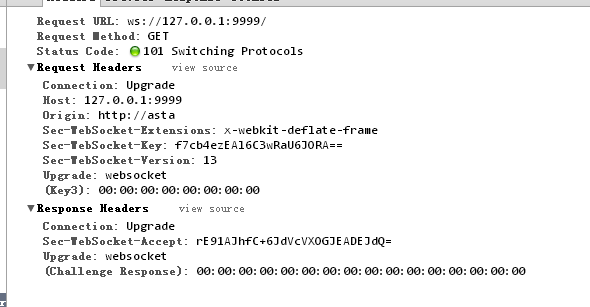

# go搭建web
- [http相关](#1)
- [go相关](#2)
- [数据库](#3)
- [session和数据存储](#4)
- [文本处理](#5)
- [模板处理](#6)
- [web服务](#7)

参考连接：    
1.Go Blog server code and content   
https://github.com/golang/blog     

## <a id="1">http相关</a>
```go
Web服务器的工作原理可以简单地归纳为：
客户机通过TCP/IP协议建立到服务器的TCP连接
客户端向服务器发送HTTP协议请求包，请求服务器里的资源文档
服务器向客户机发送HTTP协议应答包，如果请求的资源包含有动态语言的内容，那么服务器会调用动态语言的解释引擎负责处理“动态内容”，并将处理得到的数据返回给客户端
客户机与服务器断开。由客户端解释HTML文档，在客户端屏幕上渲染图形结果

一个简单的HTTP事务就是这样实现的，看起来很复杂，原理其实是挺简单的。需要注意的是客户机与服务器之间的通信是非持久连接的，也就是当服务器发送了应答后就与客户机断开连接，等待下一次请求。

URL(Uniform Resource Locator)是“统一资源定位符”的英文缩写，用于描述一个网络上的资源, 基本格式如下
scheme://host[:port#]/path/.../[?query-string][#anchor]
scheme         指定底层使用的协议(例如：http, https, ftp)
host           HTTP服务器的IP地址或者域名
port#          HTTP服务器的默认端口是80，这种情况下端口号可以省略。如果使用了别的端口，必须指明，例如 http://www.cnblogs.com:8080/
path           访问资源的路径
query-string   发送给http服务器的数据
anchor         锚

HTTP协议是无状态的，同一个客户端的这次请求和上次请求是没有对应关系的，对HTTP服务器来说，它并不知道这两个请求是否来自同一个客户端。为了解决这个问题， Web程序引入了Cookie机制来维护连接的可持续状态。

GET提交的数据会放在URL之后，以?分割URL和传输数据，参数之间以&相连，如EditPosts.aspx?name=test1&id=123456。POST方法是把提交的数据放在HTTP包的body中。

GET提交的数据大小有限制（因为浏览器对URL的长度有限制），而POST方法提交的数据没有限制。

HTTP是一个无状态的面向连接的协议，无状态不代表HTTP不能保持TCP连接，更不能代表HTTP使用的是UDP协议（面对无连接）。从HTTP/1.1起，默认都开启了Keep-Alive保持连接特性，简单地说，当一个网页打开完成后，客户端和服务器之间用于传输HTTP数据的TCP连接不会关闭，如果客户端再次访问这个服务器上的网页，会继续使用这一条已经建立的TCP连接。Keep-Alive不会永久保持连接，它有一个保持时间，可以在不同服务器软件（如Apache）中设置这个时间。
```

## <a id="2">go相关</a>
```go
fmt.Println("username:", template.HTMLEscapeString(r.Form.Get("username"))) //输出到服务器端
fmt.Println("password:", template.HTMLEscapeString(r.Form.Get("password")))
template.HTMLEscape(w, []byte(r.Form.Get("username"))) //输出到客户端

import "text/template"
...
t, err := template.New("foo").Parse(`{{define "T"}}Hello, {{.}}!{{end}}`)
err = t.ExecuteTemplate(out, "T", "<script>alert('you have been pwned')</script>")
输出
Hello, <script>alert('you have been pwned')</script>!

使用template.HTML类型
import "html/template"
...
t, err := template.New("foo").Parse(`{{define "T"}}Hello, {{.}}!{{end}}`)
err = t.ExecuteTemplate(out, "T", template.HTML("<script>alert('you have been pwned')</script>"))

输出
Hello, <script>alert('you have been pwned')</script>!

要使表单能够上传文件，首先第一步就是要添加form的enctype属性，enctype属性有如下三种情况:

application/x-www-form-urlencoded   表示在发送前编码所有字符（默认）
multipart/form-data	  不对字符编码。在使用包含文件上传控件的表单时，必须使用该值。
text/plain	  空格转换为 "+" 加号，但不对特殊字符编码。
```

## <a id="3">数据库</a>
```go
Mysql
go get -u github.com/go-sql-driver/mysql
[username[:password]@][protocol[(address)]]/dbname[?param1=value1&...&paramN=valueN]
username:password@protocol(address)/dbname?param=value

Conn是一个数据库连接的接口定义，他定义了一系列方法，这个Conn只能应用在一个goroutine里面，不能使用在多个goroutine里面
Stmt是一种准备好的状态，和Conn相关联，而且只能应用于一个goroutine中，不能应用于多个goroutine。
打开数据库格式
user@unix(/path/to/socket)/dbname?charset=utf8
user:password@tcp(localhost:5555)/dbname?charset=utf8
user:password@/dbname
user:password@tcp([de:ad:be:ef::ca:fe]:80)/dbname

db, err := sql.Open("mysql", "astaxie:astaxie@/test?charset=utf8")

//插入数据
stmt, err := db.Prepare("INSERT INTO userinfo SET username=?,department=?,created=?")
res, err := stmt.Exec("astaxie", "研发部门", "2012-12-09")
id, err := res.LastInsertId()
stmt, err = db.Prepare("update userinfo set username=? where uid=?")
res, err = stmt.Exec("astaxieupdate", id)
affect, err := res.RowsAffected()
fmt.Println(affect)

//查询数据
rows, err := db.Query("SELECT * FROM userinfo")
for rows.Next() {
    var uid int
    var username string
    var department string
    var created string
    err = rows.Scan(&uid, &username, &department, &created)
    checkErr(err)
    fmt.Println(uid)
    fmt.Println(username)
    fmt.Println(department)
    fmt.Println(created)
	}
//删除数据
stmt, err = db.Prepare("delete from userinfo where uid=?")
res, err = stmt.Exec(id)
affect, err = res.RowsAffected()
fmt.Println(affect)
db.Close()

db.Prepare()函数用来返回准备要执行的sql操作，然后返回准备完毕的执行状态。
stmt.Exec()函数用来执行stmt准备好的SQL语句
db.Query()函数用来直接执行Sql返回Rows结果。
```

## <a id="4">session和数据存储</a>
```go
cookie，简而言之就是在本地计算机保存一些用户操作的历史信息（当然包括登录信息），并在用户再次访问该站点时浏览器通过HTTP协议将本地cookie内容发送给服务器，从而完成验证，或继续上一步操作。

session，简而言之就是在服务器上保存用户操作的历史信息。服务器使用session id来标识session，session id由服务器负责产生，保证随机性与唯一性，相当于一个随机密钥，避免在握手或传输中暴露用户真实密码。但该方式下，仍然需要将发送请求的客户端与session进行对应，所以可以借助cookie机制来获取客户端的标识（即session id），也可以通过GET方式将id提交给服务器。

cookie是有时间限制的，根据生命期不同分成两种：会话cookie和持久cookie；如果不设置过期时间，则表示这个cookie的生命周期为从创建到浏览器关闭为止，只要关闭浏览器窗口，cookie就消失了。这种生命期为浏览会话期的cookie被称为会话cookie。会话cookie一般不保存在硬盘上而是保存在内存里。如果设置了过期时间(setMaxAge(606024))，浏览器就会把cookie保存到硬盘上，关闭后再次打开浏览器，这些cookie依然有效直到超过设定的过期时间。存储在硬盘上的cookie可以在不同的浏览器进程间共享，比如两个IE窗口。而对于保存在内存的cookie，不同的浏览器有不同的处理方式。

如何发送这个session的唯一标识这一步上。考虑到HTTP协议的定义，数据无非可以放到请求行、头域或Body里，所以一般来说会有两种常用的方式：cookie和URL重写。

1.Cookie 服务端通过设置Set-cookie头就可以将session的标识符传送到客户端，而客户端此后的每一次请求都会带上这个标识符，另外一般包含session信息的cookie会将失效时间设置为0(会话cookie)，即浏览器进程有效时间。至于浏览器怎么处理这个0，每个浏览器都有自己的方案，但差别都不会太大(一般体现在新建浏览器窗口的时候)；

2.URL重写 所谓URL重写，就是在返回给用户的页面里的所有的URL后面追加session标识符，这样用户在收到响应之后，无论点击响应页面里的哪个链接或提交表单，都会自动带上session标识符，从而就实现了会话的保持。虽然这种做法比较麻烦，但是，如果客户端禁用了cookie的话，此种方案将会是首选。

对Session的处理基本就 设置值、读取值、删除值以及获取当前sessionID这四个操作，所以我们的Session接口也就实现这四个操作。
如何有效的防止session劫持呢？

其中一个解决方案就是sessionID的值只允许cookie设置，而不是通过URL重置方式设置，同时设置cookie的httponly为true,这个属性是设置是否可通过客户端脚本访问这个设置的cookie，第一这个可以防止这个cookie被XSS读取从而引起session劫持，第二cookie设置不会像URL重置方式那么容易获取sessionID。

第二步就是在每个请求里面加上token，实现类似前面章节里面讲的防止form重复递交类似的功能，我们在每个请求里面加上一个隐藏的token，然后每次验证这个token，从而保证用户的请求都是唯一性。

还有一个解决方案就是，我们给session额外设置一个创建时间的值，一旦过了一定的时间，我们销毁这个sessionID，重新生成新的session，这样可以一定程度上防止session劫持的问题。
```

## <a id="5">文本处理</a>
```go
如果在我们不知道他的结构的情况下，我们把他解析到interface{}里面

var f interface{}err := json.Unmarshal(b, &f)
这个时候f里面存储了一个map类型，他们的key是string，值存储在空的interface{}里
f = map[string]interface{}{
	"Name": "Wednesday",
	"Age":  6,
	"Parents": []interface{}{
		"Gomez",
		"Morticia",
	},
}

那么如何来访问这些数据呢？通过断言的方式：
m := f.(map[string]interface{})
```

## <a id="6">模板处理</a>
我们使用template包来进行模板处理，使用类似Parse、ParseFile、Execute等方法从文件或者字符串加载模板

Go语言的模板通过{{}}来包含需要在渲染时被替换的字段，{{.}}表示当前的对象

模板中含有了未导出的字段，那么就会报错

## <a id="7">web服务</a>
WebSocket的协议颇为简单，在第一次handshake通过以后，连接便建立成功，其后的通讯数据都是以”\x00″开头，以”\xFF”结尾。在客户端，这个是透明的，WebSocket组件会自动将原始数据“掐头去尾”。

浏览器发出WebSocket连接请求，然后服务器发出回应，然后连接建立成功，这个过程通常称为“握手” (handshaking)。请看下面的请求和反馈信息：



请求中的"Sec-WebSocket-Key"是随机的，对于整天跟编码打交道的程序员，一眼就可以看出来：这个是一个经过base64编码后的数据。服务器端接收到这个请求之后需要把这个字符串连接上一个固定的字符串：
258EAFA5-E914-47DA-95CA-C5AB0DC85B11

即：f7cb4ezEAl6C3wRaU6JORA==连接上那一串固定字符串，生成一个这样的字符串：
f7cb4ezEAl6C3wRaU6JORA==258EAFA5-E914-47DA-95CA-C5AB0DC85B11

对该字符串先用 sha1安全散列算法计算出二进制的值，然后用base64对其进行编码，即可以得到握手后的字符串：
rE91AJhfC+6JdVcVXOGJEADEJdQ=
将之作为响应头Sec-WebSocket-Accept的值反馈给客户端。

RPC工作原理

RPC就是想实现函数调用模式的网络化。客户端就像调用本地函数一样，然后客户端把这些参数打包之后通过网络传递到服务端，服务端解包到处理过程中执行，然后执行的结果反馈给客户端。

运行时,一次客户机对服务器的RPC调用,其内部操作大致有如下十步：
1.调用客户端句柄；执行传送参数
2.调用本地系统内核发送网络消息
3.消息传送到远程主机
4.服务器句柄得到消息并取得参数
5.执行远程过程
6.执行的过程将结果返回服务器句柄
7.服务器句柄返回结果，调用远程系统内核
8.消息传回本地主机
9.客户句柄由内核接收消息
10.客户接收句柄返回的数据

Go标准包中已经提供了对RPC的支持，而且支持三个级别的RPC：TCP、HTTP、JSONRPC。

预防CSRF攻击    
1.限制postget使用2.使用token发送token给客户端，服务器获取进行验证   

Gdb编译   
go build -gcflags "-N -l" gdbfile.go   

安装gotests插件自动生成测试代码:   
go get -u -v github.com/cweill/gotests/...   


## links
  * [目录](<目录.md>)