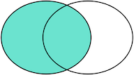
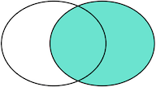

# mysql
- [mysql数据库概述](#1)
- [mysql数据库基础](#2)
- [SQL语句](#3)


## <a id="1">mysql数据库概述</a>
```mysql
数据（data）：描述事物的符号记录称为数据。
数据库（DataBase，DB）：是长期存储在计算机内、有组织的、可共享的大量数据的集合，具有永久存储、有组织、可共享三个基本特点。
数据库管理系统（DataBase Management System，DBMS）：是位于用户与操作系统之间的一层数据管理软件。
数据库系统（DataBase System，DBS）：是有数据库、数据库管理系统（及其应用开发工具）、应用程序和数据库管理员（DataBase Administrator DBA）组成的存储、管理、处理和维护数据的系统。
实体（entity）：客观存在并可相互区别的事物称为实体。
属性（attribute）：实体所具有的某一特性称为属性。
码（key）：唯一标识实体的属性集称为码。
实体型（entity type）：用实体名及其属性名集合来抽象和刻画同类实体，称为实体型。
实体集（entity set）：同一实体型的集合称为实体集。
联系（relationship）：实体之间的联系通常是指不同实体集之间的联系。
模式（schema）：模式也称逻辑模式，是数据库全体数据的逻辑结构和特征的描述，是所有用户的公共数据视图。
外模式（external schema）：外模式也称子模式（subschema）或用户模式，它是数据库用户（包括应用程序员和最终用户）能够看见和使用的局部数据的逻辑结构和特征的描述，是数据库用户的数据视图，是与某一应用有关的数据的逻辑表示。
内模式（internal schema）：内模式也称为存储模式（storage schema），一个数据库只有一个内模式。他是数据物理结构和存储方式的描述，是数据库在数据库内部的组织方式。
```

数据库按照数据结构来组织、存储和管理数据，实际上，数据库一共有三种模型：  
- 层次模型
- 网状模型
- 关系模型
 - 关系（relation）：一个关系对应通常说的一张表
 - 元组（tuple）：表中的一行即为一个元组
 - 属性（attribute）：表中的一列即为一个属性
 - 码（key）：表中可以唯一确定一个元组的某个属性组
 - 域（domain）：一组具有相同数据类型的值的集合
 - 分量：元组中的一个属性值
 - 关系模式：对关系的描述，一般表示为 关系名(属性1, 属性2, ..., 属性n)
- 面向对象数据模型（object oriented data model）
- 对象关系数据模型（object relational data model）
- 半结构化数据模型（semistructure data model）

数据类型  
对于一个关系表，除了定义每一列的名称外，还需要定义每一列的数据类型。关系数据库支持的标准数据类型包括数值、字符串、时间等：
```mysql
名称	类型	说明
INT	整型	4字节整数类型，范围约+/-21亿
BIGINT	长整型	8字节整数类型，范围约+/-922亿亿
REAL	浮点型	4字节浮点数，范围约+/-1038
DOUBLE	浮点型	8字节浮点数，范围约+/-10308
DECIMAL(M,N)	高精度小数	由用户指定精度的小数，例如，DECIMAL(20,10)表示一共20位，其中小数10位，通常用于财务计算
CHAR(N)	定长字符串	存储指定长度的字符串，例如，CHAR(100)总是存储100个字符的字符串
VARCHAR(N)	变长字符串	存储可变长度的字符串，例如，VARCHAR(100)可以存储0~100个字符的字符串
BOOLEAN	布尔类型	存储True或者False
DATE	日期类型	存储日期，例如，2018-06-22
TIME	时间类型	存储时间，例如，12:20:59
DATETIME	日期和时间类型	存储日期+时间，例如，2018-06-22 12:20:59

主流关系数据库
目前，主流的关系数据库主要分为以下几类：
商用数据库，例如：Oracle，SQL Server，DB2等；
开源数据库，例如：MySQL，PostgreSQL等；
桌面数据库，以微软Access为代表，适合桌面应用程序使用；
嵌入式数据库，以Sqlite为代表，适合手机应用和桌面程序。
```

虽然SQL已经被ANSI组织定义为标准，不幸地是，各个不同的数据库对标准的SQL支持不太一致。并且，大部分数据库都在标准的SQL上做了扩展。也就是说，如果只使用标准SQL，理论上所有数据库都可以支持，但如果使用某个特定数据库的扩展SQL，换一个数据库就不能执行了。例如，Oracle把自己扩展的SQL称为PL/SQL，Microsoft把自己扩展的SQL称为T-SQL。

SQL语言关键字不区分大小写！！！但是，针对不同的数据库，对于表名和列名，有的数据库区分大小写，有的数据库不区分大小写。同一个数据库，有的在Linux上区分大小写，有的在Windows上不区分大小写。


>所以，本教程约定：SQL关键字总是大写，以示突出，表名和列名均使用小写。

## <a id="2">mysql数据库基础</a>
- 基本关系操作：查询（选择、投影、连接（等值连接、自然连接、外连接（左外连接、右外连接））、除、并、差、交、笛卡尔积等）、插入、删除、修改
- 关系模型中的三类完整性约束：实体完整性、参照完整性、用户定义的完整性

数据库完整性   
- 数据库的完整性是指数据的正确性和相容性。
 - 完整性：为了防止数据库中存在不符合语义（不正确）的数据。
 - 安全性：为了保护数据库防止恶意破坏和非法存取。
- 触发器：是用户定义在关系表中的一类由事件驱动的特殊过程。

关系数据理论  
- 数据依赖是一个关系内部属性与属性之间的一种约束关系，是通过属性间值的相等与否体现出来的数据间相关联系。
- 最重要的数据依赖：函数依赖、多值依赖。

范式     
- 第一范式（1NF）：属性（字段）是最小单位不可再分。
- 第二范式（2NF）：满足 1NF，每个非主属性完全依赖于主键（消除 1NF 非主属性对码的部分函数依赖）。
- 第三范式（3NF）：满足 2NF，任何非主属性不依赖于其他非主属性（消除 2NF 主属性对码的传递函数依赖）。
- 鲍依斯-科得范式（BCNF）：满足 3NF，任何非主属性不能对主键子集依赖（消除 3NF 主属性对码的部分和传递函数依赖）。
- 第四范式（4NF）：满足 3NF，属性之间不能有非平凡且非函数依赖的多值依赖（消除 3NF 非平凡且非函数依赖的多值依赖）。

数据库恢复   
- 事务：是用户定义的一个数据库操作序列，这些操作要么全做，要么全不做，是一个不可分割的工作单位。
- 事物的 ACID 特性：原子性、一致性、隔离性、持续性。
- 恢复的实现技术：建立冗余数据 -> 利用冗余数据实施数据库恢复。
- 建立冗余数据常用技术：数据转储（动态海量转储、动态增量转储、静态海量转储、静态增量转储）、登记日志文件。

并发控制  
- 事务是并发控制的基本单位。
- 并发操作带来的数据不一致性包括：丢失修改、不可重复读、读 “脏” 数据。
- 并发控制主要技术：封锁、时间戳、乐观控制法、多版本并发控制等。
- 基本封锁类型：排他锁（X 锁 / 写锁）、共享锁（S 锁 / 读锁）。
- 活锁死锁：
 - 活锁：事务永远处于等待状态，可通过先来先服务的策略避免。
 - 死锁：事物永远不能结束


关系数据库是建立在关系模型上的。而关系模型本质上就是若干个存储数据的二维表，可以把它们看作很多Excel表。

表的每一行称为记录（Record），记录是一个逻辑意义上的数据。  
表的每一列称为字段（Column），同一个表的每一行记录都拥有相同的若干字段。  

字段定义了数据类型（整型、浮点型、字符串、日期等），以及是否允许为NULL。注意NULL表示字段数据不存在。一个整型字段如果为NULL不表示它的值为0，同样的，一个字符串型字段为NULL也不表示它的值为空串''。

通常情况下，字段应该避免允许为NULL。不允许为NULL可以简化查询条件，加快查询速度，也利于应用程序读取数据后无需判断是否为NULL。

### 主键
在关系数据库中，关系是通过主键和外键来维护的。

对于关系表，有个很重要的约束，就是任意两条记录不能重复。不能重复不是指两条记录不完全相同，而是指能够通过某个字段唯一区分出不同的记录，这个字段被称为主键。

所以，选取主键的一个基本原则是：不使用任何业务相关的字段作为主键。

作为主键最好是完全业务无关的字段，我们一般把这个字段命名为id。常见的可作为id字段的类型有：
自增整数类型：数据库会在插入数据时自动为每一条记录分配一个自增整数，这样我们就完全不用担心主键重复，也不用自己预先生成主键；
全局唯一GUID类型：使用一种全局唯一的字符串作为主键，类似8f55d96b-8acc-4636-8cb8-76bf8abc2f57。GUID算法通过网卡MAC地址、时间戳和随机数保证任意计算机在任意时间生成的字符串都是不同的，大部分编程语言都内置了GUID算法，可以自己预算出主键。


### 联合主键
关系数据库实际上还允许通过多个字段唯一标识记录，即两个或更多的字段都设置为主键，这种主键被称为联合主键。

对于联合主键，允许一列有重复，只要不是所有主键列都重复即可：  
没有必要的情况下，我们尽量不使用联合主键，因为它给关系表带来了复杂度的上升。   

### 外键
由于一个班级可以有多个学生，在关系模型中，这两个表的关系可以称为“一对多”，即一个classes的记录可以对应多个students表的记录。
为了表达这种一对多的关系，我们需要在students表中加入一列class_id，让它的值与classes表的某条记录相对应在students表中，通过class_id的字段，可以把数据与另一张表关联起来，这种列称为外键。   

```mysql
外键并不是通过列名实现的，而是通过定义外键约束实现的：
ALTER TABLE students
ADD CONSTRAINT fk_class_id
FOREIGN KEY (class_id)
REFERENCES classes (id);

其中，外键约束的名称fk_class_id可以任意，FOREIGN KEY (class_id)指定了class_id作为外键，REFERENCES classes (id)指定了这个外键将关联到classes表的id列（即classes表的主键）。

通过定义外键约束，关系数据库可以保证无法插入无效的数据。即如果classes表不存在id=99的记录，students表就无法插入class_id=99的记录。

由于外键约束会降低数据库的性能，大部分互联网应用程序为了追求速度，并不设置外键约束，而是仅靠应用程序自身来保证逻辑的正确性。这种情况下，class_id仅仅是一个普通的列，只是它起到了外键的作用而已。

要删除一个外键约束，也是通过ALTER TABLE实现的：
ALTER TABLE students
DROP FOREIGN KEY fk_class_id;

注意：删除外键约束并没有删除外键这一列。删除列是通过DROP COLUMN ...实现的。

多对多关系实际上是通过两个一对多关系实现的，即通过一个中间表，关联两个一对多关系，就形成了多对多关系：即用一个 表结合两个表形成
```

### 索引
在关系数据库中，如果有上万甚至上亿条记录，在查找记录的时候，想要获得非常快的速度，就需要使用索引。

索引是关系数据库中对某一列或多个列的值进行预排序的数据结构。通过使用索引，可以让数据库系统不必扫描整个表，而是直接定位到符合条件的记录，这样就大大加快了查询速度。

```mysql
如果要经常根据score列进行查询，就可以对score列创建索引：
ALTER TABLE students
ADD INDEX idx_score (score);

使用ADD INDEX idx_score (score)就创建了一个名称为idx_score，使用列score的索引。索引名称是任意的，索引如果有多列，可以在括号里依次写上，例如：
ALTER TABLE students
ADD INDEX idx_name_score (name, score);

可以对一张表创建多个索引。索引的优点是提高了查询效率，缺点是在插入、更新和删除记录时，需要同时修改索引，因此，索引越多，插入、更新和删除记录的速度就越慢。

对于主键，关系数据库会自动对其创建主键索引。使用主键索引的效率是最高的，因为主键会保证绝对唯一。
```

### 唯一索引
```mysql
ALTER TABLE students
ADD UNIQUE INDEX uni_name (name);

通过UNIQUE关键字我们就添加了一个唯一索引。

也可以只对某一列添加一个唯一约束而不创建唯一索引：
ALTER TABLE students
ADD CONSTRAINT uni_name UNIQUE (name);

这种情况下，name列没有索引，但仍然具有唯一性保证。

无论是否创建索引，对于用户和应用程序来说，使用关系数据库不会有任何区别。这里的意思是说，当我们在数据库中查询时，如果有相应的索引可用，数据库系统就会自动使用索引来提高查询效率，如果没有索引，查询也能正常执行，只是速度会变慢。因此，索引可以在使用数据库的过程中逐步优化。
```

## <a id="3">SQL语句</a>
| 对象类型 | 对象       | 操作类型                                               |
| ---------- | ------------ | ---------------------------------------------------------- |
| 数据库模式 | 模式       | CREATE SCHEMA                                              |
|            | 基本表    | CREATE SCHEMA，ALTER TABLE                                |
|            | 视图       | CREATE VIEW                                                |
|            | 索引       | CREATE INDEX                                               |
| 数据     | 基本表和视图 | SELECT，INSERT，UPDATE，DELETE，REFERENCES，ALL PRIVILEGES |
|            | 属性列    | SELECT，INSERT，UPDATE，REFERENCES，ALL PRIVILEGES     |

### 3.1查询语句
#### 条件查询
使用SELECT查询的基本语句SELECT * FROM <表名>可以查询一个表的所有行和所有列的数据。SELECT查询的结果是一个二维表。  
SELECT 100+200;

虽然SELECT可以用作计算，但它并不是SQL的强项。但是，不带FROM子句的SELECT语句有一个有用的用途，就是用来判断当前到数据库的连接是否有效。许多检测工具会执行一条SELECT 1;来测试数据库连接。

SELECT语句可以通过WHERE条件来设定查询条件，查询结果是满足查询条件的记录。例如，要指定条件“分数在80分或以上的学生”，写成WHERE条件就是SELECT * FROM students WHERE score >= 80。

```mysql
条件查询的语法就是：
SELECT * FROM <表名> WHERE <条件表达式>

条件表达式可以用<条件1> AND <条件2>表达满足条件1并且满足条件2

第二种条件是<条件1> OR <条件2>，表示满足条件1或者满足条件2。

第三种条件是NOT <条件>，表示“不符合该条件”的记录。

要组合三个或者更多的条件，就需要用小括号()表示如何进行条件运算。
如果不加括号，条件运算按照NOT、AND、OR的优先级进行。
```

#### 投影查询
使用SELECT * FROM <表名> WHERE <条件>可以选出表中的若干条记录。我们注意到返回的二维表结构和原表是相同的，即结果集的所有列与原表的所有列都一一对应。

如果我们只希望返回某些列的数据，而不是所有列的数据，我们可以用SELECT 列1, 列2, 列3 FROM ...，让结果集仅包含指定列。这种操作称为投影查询。

使用SELECT 列1, 列2, 列3 FROM ...时，还可以给每一列起个别名，这样，结果集的列名就可以与原表的列名不同。它的语法是SELECT 列1 别名1, 列2 别名2, 列3 别名3 FROM ...。

#### 排序
我们使用SELECT查询时，细心的读者可能注意到，查询结果集通常是按照id排序的，也就是根据主键排序。这也是大部分数据库的做法。如果我们要根据其他条件排序怎么办？可以加上ORDER BY子句。例如按照成绩从低到高进行排序.如果要反过来，按照成绩从高到底排序，我们可以加上DESC表示“倒序”：

如果score列有相同的数据，要进一步排序，可以继续添加列名。例如，使用ORDER BY score DESC, gender表示先按score列倒序，如果有相同分数的，再按gender列排序

SELECT id, name, gender, score FROM students ORDER BY score DESC, gender;

如果有WHERE子句，那么ORDER BY子句要放到WHERE子句后面。

#### 分页
使用SELECT查询时，如果结果集数据量很大，比如几万行数据，放在一个页面显示的话数据量太大，不如分页显示，每次显示100条。

因此，分页实际上就是从结果集中“截取”出第M~N条记录。这个查询可以通过LIMIT <M> OFFSET <N>子句实现。我们先把所有学生按照成绩从高到低进行排序：

把结果集分页，每页3条记录。要获取第1页的记录，可以使用LIMIT 3 OFFSET 0：

SELECT id, name, gender, score FROM students ORDER BY score DESC LIMIT 3 OFFSET 1;

LIMIT 3 OFFSET 0表示，对结果集从0号记录开始，最多取3条。注意SQL记录集的索引从0开始。如果要查询第2页，把OFFSET设定为3：查询第3页的时候，OFFSET应该设定为6:

OFFSET是可选的，如果只写LIMIT 15，那么相当于LIMIT 15 OFFSET 0。

在MySQL中，LIMIT 15 OFFSET 30还可以简写成LIMIT 30, 15。

#### 聚合查询
如果我们要统计一张表的数据量，例如，想查询students表一共有多少条记录，难道必须用SELECT * FROM students查出来然后再数一数有多少行吗？

这个方法当然可以，但是比较弱智。对于统计总数、平均数这类计算，SQL提供了专门的聚合函数，使用聚合函数进行查询，就是聚合查询，它可以快速获得结果。COUNT(*)表示查询所有列的行数，要注意聚合的计算结果虽然是一个数字，但查询的结果仍然是一个二维表，只是这个二维表只有一行一列，并且列名是COUNT(*)。

通常，使用聚合查询时，我们应该给列名设置一个别名，便于处理结果：

SELECT COUNT(*) num FROM students;
SELECT COUNT(*) boys FROM students WHERE gender = 'M';

除了COUNT()函数外，SQL还提供了如下聚合函数：

函数	说明
SUM	计算某一列的合计值，该列必须为数值类型
AVG	计算某一列的平均值，该列必须为数值类型
MAX	计算某一列的最大值
MIN	计算某一列的最小值

要特别注意：如果聚合查询的WHERE条件没有匹配到任何行，COUNT()会返回0，而SUM()、AVG()、MAX()和MIN()会返回NULL：

分组
对于聚合查询，SQL还提供了“分组聚合”的功能。我们观察下面的聚合查询。

SELECT COUNT(*) num FROM students GROUP BY class_id;
SELECT class_id, COUNT(*) num FROM students GROUP BY class_id;

我们想统计各班的男生和女生人数：
SELECT class_id, gender, COUNT(*) num FROM students GROUP BY class_id, gender;

#### 多表查询
SELECT查询不但可以从一张表查询数据，还可以从多张表同时查询数据。查询多张表的语法是：SELECT * FROM <表1> <表2>。

这种一次查询两个表的数据，查询的结果也是一个二维表，它是students表和classes表的“乘积”，即students表的每一行与classes表的每一行都两两拼在一起返回。结果集的列数是students表和classes表的列数之和，行数是students表和classes表的行数之积。

上述查询的结果集有两列id和两列name，两列id是因为其中一列是students表的id，而另一列是classes表的id，但是在结果集中，不好区分。两列name同理。

```mysql
可以利用投影查询的“设置列的别名”来给两个表各自的id和name列起别名：
SELECT
    students.id sid,
    students.name,
    students.gender,
    students.score,
    classes.id cid,
    classes.name cname
FROM students, classes;

SQL还允许给表设置一个别名，让我们在投影查询中引用起来稍微简洁一点：
SELECT
    s.id sid,
    s.name,
    s.gender,
    s.score,
    c.id cid,
    c.name cname
FROM students s, classes c;

SELECT
    s.id sid,
    s.name,
    s.gender,
    s.score,
    c.id cid,
    c.name cname
FROM students s, classes c
WHERE s.gender = 'M' AND c.id = 1;
```
#### 连接查询
连接查询是另一种类型的多表查询。连接查询对多个表进行JOIN运算，简单地说，就是先确定一个主表作为结果集，然后，把其他表的行有选择性地“连接”在主表结果集上。

```mysql
SELECT s.id, s.name, s.class_id, c.name class_name, s.gender, s.score
FROM students s
INNER JOIN classes c
ON s.class_id = c.id;
```

注意INNER JOIN查询的写法是：
先确定主表，仍然使用FROM <表1>的语法；  
再确定需要连接的表，使用INNER JOIN <表2>的语法；   
然后确定连接条件，使用ON <条件...>，这里的条件是s.class_id = c.id，表示students表的class_id列与classes表的id列相同的行需要连接；  
可选：加上WHERE子句、ORDER BY等子句。  

INNER JOIN只返回同时存在于两张表的行数据，由于students表的class_id包含1，2，3，classes表的id包含1，2，3，4，所以，INNER JOIN根据条件s.class_id = c.id返回的结果集仅包含1，2，3。

RIGHT OUTER JOIN返回右表都存在的行。如果某一行仅在右表存在，那么结果集就会以NULL填充剩下的字段。   
LEFT OUTER JOIN则返回左表都存在的行。如果我们给students表增加一行，并添加class_id=5，由于classes表并不存在id=5的行，所以，LEFT OUTER JOIN的结果会增加一行，对应的class_name是NULL：  
最后，我们使用FULL OUTER JOIN，它会把两张表的所有记录全部选择出来，并且，自动把对方不存在的列填充为NULL：

我们把tableA看作左表，把tableB看成右表，那么INNER JOIN是选出两张表都存在的记录：


LEFT OUTER JOIN是选出左表存在的记录：



RIGHT OUTER JOIN是选出右表存在的记录：



FULL OUTER JOIN则是选出左右表都存在的记录：


### 3.2修改数据
#### INSERT语句
```mysql
INSERT语句的基本语法是：

INSERT INTO <表名> (字段1, 字段2, ...) VALUES (值1, 值2, ...);
INSERT INTO students (class_id, name, gender, score) VALUES
  (1, '大宝', 'M', 87),
  (2, '二宝', 'M', 81);
```

#### UPDATE语句
```mysql
UPDATE语句的基本语法是：

UPDATE <表名> SET 字段1=值1, 字段2=值2, ... WHERE ...;
UPDATE students SET name='小牛', score=77 WHERE id>=5 AND id<=7;

如果WHERE条件没有匹配到任何记录，UPDATE语句不会报错，也不会有任何记录被更新

最后，要特别小心的是，UPDATE语句可以没有WHERE条件，例如：

UPDATE students SET score=60;

这时，整个表的所有记录都会被更新。所以，在执行UPDATE语句时要非常小心，最好先用SELECT语句来测试WHERE条件是否筛选出了期望的记录集，然后再用UPDATE更新。
```

#### DELETE语句
```mysql
DELETE语句的基本语法是：

DELETE FROM <表名> WHERE ...;

注意到DELETE语句的WHERE条件也是用来筛选需要删除的行，因此和UPDATE类似，DELETE语句也可以一次删除多条记录：

DELETE FROM students WHERE id>=5 AND id<=7;

最后，要特别小心的是，和UPDATE类似，不带WHERE条件的DELETE语句会删除整个表的数据：
DELETE FROM students;

这时，整个表的所有记录都会被删除。所以，在执行DELETE语句时也要非常小心，最好先用SELECT语句来测试WHERE条件是否筛选出了期望的记录集，然后再用DELETE删除。
```

### 3.2mysql操作语句
```mysql
创建一个新数据库，使用命令：
mysql> CREATE DATABASE test;

要删除一个数据库，使用命令：
mysql> DROP DATABASE test;
注意：删除一个数据库将导致该数据库的所有表全部被删除。

对一个数据库进行操作时，要首先将其切换为当前数据库：
mysql> USE test;

列出当前数据库的所有表，使用命令：
mysql> SHOW TABLES;

要查看一个表的结构，使用命令：
mysql> DESC students;

可以使用以下命令查看创建表的SQL语句：
mysql> SHOW CREATE TABLE students;

创建表使用CREATE TABLE语句，而删除表使用DROP TABLE语句：
mysql> DROP TABLE students;

修改表就比较复杂。如果要给students表新增一列birth，使用：
ALTER TABLE students ADD COLUMN birth VARCHAR(10) NOT NULL;

改表就比较复杂。如果要给students表新增一列birth，使用：
ALTER TABLE students ADD COLUMN birth VARCHAR(10) NOT NULL;

要修改birth列，例如把列名改为birthday，类型改为VARCHAR(20)：
ALTER TABLE students CHANGE COLUMN birth birhday VARCHAR(20) NOT NULL;

要删除列，使用：
ALTER TABLE students DROP COLUMN birthday;
```

## links
  * [目录](<目录.md>)