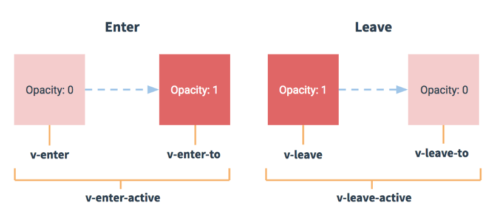

# Vue教程
- [手把手教你搭建管理后台](#1)
- [语法](#2)
- [实例](#3)
- [语法升级](#4)


## <a id="1">手把手教你搭建管理后台</a>
参考链接：   
1.手把手教你搭建管理后台     
https://github.com/lifetea/vue-admin#Install    

2.管理后台最新技术          
https://github.com/gcddblue/vue-admin-webapp   

3.vue最新实战项目教程    
https://github.com/liangxiaojuan/vue-todos     

### 1.软件安装
```js
安装vue环境
#安装vue
npm i --save-dev vue 
#安装vue-router(路由)
npm i --save-dev vue-router
#安装vuex
npm i --save-dev vuex
#安装vue-resource(网络请求)
npm i --save-dev vue-resource

#安装webpack到全局
npm i -g webpack
#安装webpack到项目
npm i --save-dev webpack
#安装webpack-dev-server(须和webpack版本兼容)
npm i --save-dev webpack-dev-server

#安装babel
npm i --save-dev babel-cli babel-core
#转换es2015
npm i --save-dev babel-preset-es2015 babel-preset-es2015-loose
#兼容es3
npm i --save-dev babel-plugin-transform-es2015-modules-commonjs  babel-plugin-transform-es3-member-expression-literals babel-plugin-transform-es3-property-literals
```

### 2.web-admin配套修改

## <a id="2">语法</a>
- [2.1模板语法](#2.1)
- [2.2条件与循环语句](#2.2)
- [2.3属性](#2.3)
- [2.4样式](#2.4)
- [2.5事件](#2.5)
- [2.6表单](#2.6)
- [2.7组件](#2.7)
- [2.8指令](#2.8)
- [2.9路由](#2.9)
- [2.10过渡&动画](#2.10)
- [2.11混入](#2.11)
- [2.12Ajax](#2.12)
- [2.13响应接口](#2.13)


Vue.js 使用了基于 HTML 的模版语法，允许开发者声明式地将 DOM 绑定至底层 Vue 实例的数据。

Vue.js 的核心是一个允许你采用简洁的模板语法来声明式的将数据渲染进 DOM 的系统。

结合响应系统，在应用状态改变时， Vue 能够智能地计算出重新渲染组件的最小代价并应用到 DOM 操作上。

直接下载并用 script 标签引入，Vue 会被注册为一个全局变量。   

```c++
对于制作原型或学习，你可以这样使用最新版本：

<script src="https://cdn.jsdelivr.net/npm/vue/dist/vue.js"></script>
对于生产环境，我们推荐链接到一个明确的版本号和构建文件，以避免新版本造成的不可预期的破坏：

<script src="https://cdn.jsdelivr.net/npm/vue@2.6.12"></script>
如果你使用原生 ES Modules，这里也有一个兼容 ES Module 的构建文件：

<script type="module">
  import Vue from 'https://cdn.jsdelivr.net/npm/vue@2.6.12/dist/vue.esm.browser.js'
</script>

完整版：同时包含编译器和运行时的版本。

编译器：用来将模板字符串编译成为 JavaScript 渲染函数的代码。

运行时：用来创建 Vue 实例、渲染并处理虚拟 DOM 等的代码。基本上就是除去编译器的其它一切。
```


### <a id="2.1">2.1模板语法</a>
```js
<div id="vue_det">
    <h1>site : {{site}}</h1>
    <h1>url : {{url}}</h1>
    <h1>{{details()}}</h1>
</div>
<script type="text/javascript">
    var vm = new Vue({
        el: '#vue_det',
        data: {
            site: "菜鸟教程",
            url: "www.runoob.com",
            alexa: "10000"
        },
        methods: {
            details: function() {
                return  this.site + " - 学的不仅是技术，更是梦想！";
            }
        }
    })
</script>

data 用于定义属性，实例中有三个属性分别为：site、url、alexa。
methods 用于定义的函数，可以通过 return 来返回函数值。
{{ }} 用于输出对象属性和函数返回值。

当一个 Vue 实例被创建时，它向 Vue 的响应式系统中加入了其 data 对象中能找到的所有的属性。当这些属性的值发生改变时，html 视图将也会产生相应的变化。

除了数据属性，Vue 实例还提供了一些有用的实例属性与方法。它们都有前缀 $，以便与用户定义的属性区分开来。
document.write(vm.$data === data) // true
```

#### 插值
##### a.插入文本
数据绑定最常见的形式就是使用 {{...}}（双大括号）的文本插值：
```js
文本插值
<div id="app">
  <p>{{ message }}</p>
</div>
```

##### b.插入Html
使用 v-html 指令用于输出 html 代码：
```js
v-html 指令
<div id="app">
    <div v-html="message"></div>
</div>
    
<script>
new Vue({
  el: '#app',
  data: {
    message: '<h1>菜鸟教程</h1>'
  }
})
</script>
```

##### c.插入属性
HTML 属性中的值应使用 v-bind 指令。

以下实例判断 use 的值，如果为 true 使用 class1 类的样式，否则不使用该类：
```js
v-bind 指令
<div id="app">
  <label for="r1">修改颜色</label><input type="checkbox" v-model="use" id="r1">
  <br><br>
  <div v-bind:class="{'class1': use}">
    v-bind:class 指令
  </div>
</div>
    
<script>
new Vue({
    el: '#app',
  data:{
      use: false
  }
});
</script>
```

##### d.插入表达式
Vue.js 都提供了完全的 JavaScript 表达式支持。
```js
JavaScript 表达式
<div id="app">
    {{5+5}}<br>
    {{ ok ? 'YES' : 'NO' }}<br>
    {{ message.split('').reverse().join('') }}
    <div v-bind:id="'list-' + id">菜鸟教程</div>
</div>
    
<script>
new Vue({
  el: '#app',
  data: {
    ok: true,
    message: 'RUNOOB',
    id : 1
  }
})
</script>
```

#### 指令
指令是带有 v- 前缀的特殊属性。

指令用于在表达式的值改变时，将某些行为应用到 DOM 上。如下例子：
```js
<body>
<div id="app">
    <p v-if="seen">现在你看到我了</p>
    <template v-if="ok">
      <h1>菜鸟教程</h1>
      <p>学的不仅是技术，更是梦想！</p>
      <p>哈哈哈，打字辛苦啊！！！</p>
    </template>
</div>
    
<script>
new Vue({
  el: '#app',
  data: {
    seen: true,
    ok: true
  }
})
</script>
</body>
这里， v-if 指令将根据表达式 seen 的值(true 或 false )来决定是否插入 p 元素。

参数
参数在指令后以冒号指明。例如， v-bind 指令被用来响应地更新 HTML 属性：
<div id="app">
    <pre><a v-bind:href="url">菜鸟教程</a></pre>
</div>
    
<script>
new Vue({
  el: '#app',
  data: {
    url: 'http://www.runoob.com'
  }
})
</script>
在这里 href 是参数，告知 v-bind 指令将该元素的 href 属性与表达式 url 的值绑定。

另一个例子是 v-on 指令，它用于监听 DOM 事件：
<a v-on:click="doSomething">
在这里参数是监听的事件名。

修饰符
修饰符是以半角句号 . 指明的特殊后缀，用于指出一个指令应该以特殊方式绑定。例如，.prevent 修饰符告诉 v-on 指令对于触发的事件调用 event.preventDefault()：
<form v-on:submit.prevent="onSubmit"></form>
```

#### 用户输入
在 input 输入框中我们可以使用 v-model 指令来实现双向数据绑定：
```js
双向数据绑定
<div id="app">
    <p>{{ message }}</p>
    <input v-model="message">
</div>
    
<script>
new Vue({
  el: '#app',
  data: {
    message: 'Runoob!'
  }
})
</script>
input -> message -> p
v-model 指令用来在 input、select、textarea、checkbox、radio 等表单控件元素上创建双向数据绑定，根据表单上的值，自动更新绑定的元素的值。

按钮的事件我们可以使用 v-on 监听事件，并对用户的输入进行响应。
以下实例在用户点击按钮后对字符串进行反转操作：
<div id="app">
    <p>{{ message }}</p>
    <button v-on:click="reverseMessage">反转字符串</button>
</div>
    
<script>
new Vue({
  el: '#app',
  data: {
    message: 'Runoob!'
  },
  methods: {
    reverseMessage: function () {
      this.message = this.message.split('').reverse().join('')
    }
  }
})
</script>
```

#### 过滤器
Vue.js 允许你自定义过滤器，被用作一些常见的文本格式化。由"管道符"指示, 格式如下：
```js
<!-- 在两个大括号中 -->
{{ message | capitalize }}

<!-- 在 v-bind 指令中 -->
<div v-bind:id="rawId | formatId"></div>
过滤器函数接受表达式的值作为第一个参数。

以下实例对输入的字符串第一个字母转为大写：

实例
<div id="app">
  {{ message | capitalize }}
</div>
    
<script>
new Vue({
  el: '#app',
  data: {
    message: 'runoob'
  },
  filters: {
    capitalize: function (value) {
      if (!value) return ''
      value = value.toString()
      return value.charAt(0).toUpperCase() + value.slice(1)
    }
  }
})
</script>

过滤器可以串联：

{{ message | filterA | filterB }}
过滤器是 JavaScript 函数，因此可以接受参数：

{{ message | filterA('arg1', arg2) }}
这里，message 是第一个参数，字符串 'arg1' 将传给过滤器作为第二个参数， arg2 表达式的值将被求值然后传给过滤器作为第三个参数。
```

#### 缩写
```js
v-bind 缩写
Vue.js 为两个最为常用的指令提供了特别的缩写：

<!-- 完整语法 -->
<a v-bind:href="url"></a>
<!-- 缩写 -->
<a :href="url"></a>
v-on 缩写
<!-- 完整语法 -->
<a v-on:click="doSomething"></a>
<!-- 缩写 -->
<a @click="doSomething"></a>
```

### <a id="2.2">2.2条件与循环语句</a>
#### 条件语句
```js
1.条件判断
v-if
条件判断使用 v-if 指令：
v-if 指令
在元素 和 template 中使用 v-if 指令：

<div id="app">
    <p v-if="seen">现在你看到我了</p>
    <template v-if="ok">
      <h1>菜鸟教程</h1>
      <p>学的不仅是技术，更是梦想！</p>
      <p>哈哈哈，打字辛苦啊！！！</p>
    </template>
</div>
    
<script>
new Vue({
  el: '#app',
  data: {
    seen: true,
    ok: true
  }
})
</script>
这里， v-if 指令将根据表达式 seen 的值(true 或 false )来决定是否插入 p 元素。

在字符串模板中，如 Handlebars ，我们得像这样写一个条件块：
<!-- Handlebars 模板 -->
{{#if ok}}
  <h1>Yes</h1>
{{/if}}
v-else
可以用 v-else 指令给 v-if 添加一个 "else" 块：

2.v-else 指令
随机生成一个数字，判断是否大于0.5，然后输出对应信息：

<div id="app">
    <div v-if="Math.random() > 0.5">
      Sorry
    </div>
    <div v-else>
      Not sorry
    </div>
</div>
    
<script>
new Vue({
  el: '#app'
})
</script>

3.v-else-if
v-else-if 在 2.1.0 新增，顾名思义，用作 v-if 的 else-if 块。可以链式的多次使用：
v-else 指令
判断 type 变量的值：

<div id="app">
    <div v-if="type === 'A'">
      A
    </div>
    <div v-else-if="type === 'B'">
      B
    </div>
    <div v-else-if="type === 'C'">
      C
    </div>
    <div v-else>
      Not A/B/C
    </div>
</div>
    
<script>
new Vue({
  el: '#app',
  data: {
    type: 'C'
  }
})
</script>
v-else 、v-else-if 必须跟在 v-if 或者 v-else-if之后。

4.v-show
我们也可以使用 v-show 指令来根据条件展示元素：

v-show 指令
<h1 v-show="ok">Hello!</h1>
```

#### 循环语句
循环使用 v-for 指令。

v-for 指令需要以 site in sites 形式的特殊语法， sites 是源数据数组并且 site 是数组元素迭代的别名。

```js
v-for 可以绑定数据到数组来渲染一个列表：
v-for 指令
<div id="app">
  <ol>
    <li v-for="site in sites">
      {{ site.name }}
    </li>
  </ol>
</div>
 
<script>
new Vue({
  el: '#app',
  data: {
    sites: [
      { name: 'Runoob' },
      { name: 'Google' },
      { name: 'Taobao' }
    ]
  }
})
</script>

模板中使用 v-for：
v-for
<ul>
  <template v-for="site in sites">
    <li>{{ site.name }}</li>
    <li>--------------</li>
  </template>
</ul>

v-for 迭代对象
v-for 可以通过一个对象的属性来迭代数据：
v-for
<div id="app">
  <ul>
    <li v-for="value in object">
    {{ value }}
    </li>
  </ul>
</div>
 
<script>
new Vue({
  el: '#app',
  data: {
    object: {
      name: '菜鸟教程',
      url: 'http://www.runoob.com',
      slogan: '学的不仅是技术，更是梦想！'
    }
  }
})
</script>

你也可以提供第二个的参数为键名：
v-for
<div id="app">
  <ul>
    <li v-for="(value, key) in object">
    {{ key }} : {{ value }}
    </li>
  </ul>
</div>

第三个参数为索引：
v-for
<div id="app">
  <ul>
    <li v-for="(value, key, index) in object">
     {{ index }}. {{ key }} : {{ value }}
    </li>
  </ul>
</div>

v-for 迭代整数
v-for 也可以循环整数
v-for
<div id="app">
  <ul>
    <li v-for="n in 10">
     {{ n }}
    </li>
  </ul>
</div>
```

### <a id="2.3">2.3属性</a>
#### 计算属性
计算属性关键词: computed。   

计算属性在处理一些复杂逻辑时是很有用的。   

```js
<div id="app">
  <p>原始字符串: {{ message }}</p>
  <p>计算后反转字符串: {{ reversedMessage }}</p>
</div>
 
<script>
var vm = new Vue({
  el: '#app',
  data: {
    message: 'Runoob!'
  },
  computed: {
    // 计算属性的 getter
    reversedMessage: function () {
      // `this` 指向 vm 实例
      return this.message.split('').reverse().join('')
    }
  }
})
</script>
我们可以使用 methods 来替代 computed，效果上两个都是一样的，但是 computed 是基于它的依赖缓存，只有相关依赖发生改变时才会重新取值。而使用 methods ，在重新渲染的时候，函数总会重新调用执行。

computed setter
computed 属性默认只有 getter ，不过在需要时你也可以提供一个 setter ：
var vm = new Vue({
  el: '#app',
  data: {
    name: 'Google',
    url: 'http://www.google.com'
  },
  computed: {
    site: {
      // getter
      get: function () {
        return this.name + ' ' + this.url
      },
      // setter
      set: function (newValue) {
        var names = newValue.split(' ')
        this.name = names[0]
        this.url = names[names.length - 1]
      }
    }
  }
})
// 调用 setter， vm.name 和 vm.url 也会被对应更新
vm.site = '菜鸟教程 http://www.runoob.com';
document.write('name: ' + vm.name);
document.write('<br>');
document.write('url: ' + vm.url);
```

#### Vue.js 监听属性
本章节，我们将为大家介绍 Vue.js 监听属性 watch，我们可以通过 watch 来响应数据的变化。
```js
<div id = "computed_props">
    千米 : <input type = "text" v-model = "kilometers">
    米 : <input type = "text" v-model = "meters">
</div>
<p id="info"></p>
<script type = "text/javascript">
    var vm = new Vue({
    el: '#computed_props',
    data: {
        kilometers : 0,
        meters:0
    },
    methods: {
    },
    computed :{
    },
    watch : {
        kilometers:function(val) {
            this.kilometers = val;
            this.meters = this.kilometers * 1000
        },
        meters : function (val) {
            this.kilometers = val/ 1000;
            this.meters = val;
        }
    }
    });
    // $watch 是一个实例方法
    vm.$watch('kilometers', function (newValue, oldValue) {
    // 这个回调将在 vm.kilometers 改变后调用
    document.getElementById ("info").innerHTML = "修改前值为: " + oldValue + "，修改后值为: " + newValue;
})
</script>
```

### <a id="2.4">2.4样式</a>
class 与 style 是 HTML 元素的属性，用于设置元素的样式，我们可以用 v-bind 来设置样式属性。   

#### Vue.js class
 
```js
可以在对象中传入更多属性用来动态切换多个 class.:
<style>
.active {
	width: 100px;
	height: 100px;
	background: green;
}
.text-danger {
	background: red;
}
</style>
</head>
<body>
<div id="app">
  <div class="static"
     v-bind:class="{ 'active': isActive, 'text-danger': hasError }">
  </div>
</div>
<script>
new Vue({
  el: '#app',
  data: {
    isActive: true,
	hasError: false
  }
})
</script>

也可以直接绑定数据里的一个对象:
<div id="app">
  <div v-bind:class="classObject"></div>
</div>
<script>
new Vue({
  el: '#app',
  data: {
    classObject: {
      active: true,
      'text-danger': true
    }
  }
})
</script>

也可以在这里绑定返回对象的计算属性。这是一个常用且强大的模式:
<style>
.base {
  width: 100px;
  height: 100px;
}
.active {
  background: green;
}
.text-danger {
  background: red;
}
</style>
</head>
<body>
<div id="app">
  <div v-bind:class="classObject"></div>
</div>
<script>
new Vue({
  el: '#app',
  data: {
    isActive: true,
    error: {
      value: true,
      type: 'fatal'
    }
  },
  computed: {
    classObject: function () {  //返回到classobject，对应css的值。
      return {
        'base': true,
        'active': this.isActive && !this.error.value,
        'text-danger': this.error.value && this.error.type === 'fatal',
      }
    }
  }
})
</script>

可以把一个数组传给 v-bind:class 
<style>
.active {
	width: 100px;
	height: 100px;
	background: green;
}
.text-danger {
	background: red;
}
</style>
</head>
<body>
<div id="app">
	<div v-bind:class="[activeClass, errorClass]"></div>  //直接返回多个css数组不用判断
</div>

<script>
new Vue({
  el: '#app',
  data: {
    activeClass: 'active',
    errorClass: 'text-danger'
  }
})
</script>
类似<div class="active text-danger"></div>

可以将判断值与css结合
<div v-bind:class="[errorClass ,isActive ? activeClass : '']"></div>
```

#### Vue.js style(内联样式)
```js
可以在 v-bind:style 直接设置样式
<div id="app">
    <div v-bind:style="{ color: activeColor, fontSize: fontSize + 'px' }">菜鸟教程</div>
</div>

也可以直接绑定到一个样式对象，让模板更清晰
<div id="app">
  <div v-bind:style="styleObject">菜鸟教程</div>
</div>

v-bind:style 可以使用数组将多个样式对象应用到一个元素上
<div id="app">
  <div v-bind:style="[baseStyles, overridingStyles]">菜鸟教程</div>
</div>
```

### <a id="2.5">2.5事件</a>
事件监听可以使用 v-on 指令

```c++
通常情况下，我们需要使用一个方法来调用 JavaScript 方法
<div id="app">
   <!-- `greet` 是在下面定义的方法名 -->
  <button v-on:click="greet">Greet</button>
</div>
 
<script>
var app = new Vue({
  el: '#app',
  data: {
    name: 'Vue.js'
  },
  // 在 `methods` 对象中定义方法
  methods: {
    greet: function (event) {
      // `this` 在方法里指当前 Vue 实例
      alert('Hello ' + this.name + '!')
      // `event` 是原生 DOM 事件
      if (event) {
          alert(event.target.tagName)
      }
    }
  }
})
// 也可以用 JavaScript 直接调用方法
app.greet() // -> 'Hello Vue.js!'
</script>

除了直接绑定到一个方法，也可以用内联 JavaScript 语句
<div id="app">
  <button v-on:click="say('hi')">Say hi</button>
  <button v-on:click="say('what')">Say what</button>
</div>
 
<script>
new Vue({
  el: '#app',
  methods: {
    say: function (message) {
      alert(message)
    }
  }
})
</script>


Vue.js 为 v-on 提供了事件修饰符来处理 DOM 事件细节，如：event.preventDefault() 或 event.stopPropagation()。
Vue.js 通过由点 . 表示的指令后缀来调用修饰符。
.stop - 阻止冒泡
.prevent - 阻止默认事件
.capture - 阻止捕获
.self - 只监听触发该元素的事件
.once - 只触发一次
.left - 左键事件
.right - 右键事件
.middle - 中间滚轮事件

<-- 阻止单击事件冒泡 -->
<a v-on:click.stop="doThis"></a>
<-- 提交事件不再重载页面 -->
<form v-on:submit.prevent="onSubmit"></form>
<!-- 修饰符可以串联  -->
<a v-on:click.stop.prevent="doThat"></a>
<!-- 只有修饰符 -->
<form v-on:submit.prevent></form>
<!-- 添加事件侦听器时使用事件捕获模式 -->
<div v-on:click.capture="doThis">...</div>
<!-- 只当事件在该元素本身（而不是子元素）触发时触发回调 -->
<div v-on:click.self="doThat">...</div>
<!-- click 事件只能点击一次，2.1.4版本新增 -->
<a v-on:click.once="doThis"></a>

Vue 允许为 v-on 在监听键盘事件时添加按键修饰符：
<!-- 只有在 keyCode 是 13 时调用 vm.submit() -->
<input v-on:keyup.13="submit">
记住所有的 keyCode 比较困难，所以 Vue 为最常用的按键提供了别名：
<!-- 同上 -->
<input v-on:keyup.enter="submit">
<!-- 缩写语法 -->
<input @keyup.enter="submit">
全部的按键别名：
.enter
.tab
.delete (捕获 "删除" 和 "退格" 键)
.esc
.space
.up
.down
.left
.right
.ctrl
.alt
.shift
.meta
```

### <a id="2.6">2.6表单</a>
可以用 v-model 指令在表单控件元素上创建双向数据绑定，v-model 会根据控件类型自动选取正确的方法来更新元素。

```js
<div id="app">
  <p>input 元素：</p>
  <input v-model="message" placeholder="编辑我……">
  <p>消息是: {{ message }}</p>
    
  <p>textarea 元素：</p>
  <p style="white-space: pre">{{ message2 }}</p>
  <textarea v-model="message2" placeholder="多行文本输入……"></textarea>
</div>
 
<script>
new Vue({
  el: '#app',
  data: {
    message: 'Runoob',
    message2: '菜鸟教程http://www.runoob.com'
  }
})
</script>

复选框
复选框如果是一个为逻辑值，如果是多个则绑定到同一个数组
<div id="app">
  <p>单个复选框：</p>
  <input type="checkbox" id="checkbox" v-model="checked">
  <label for="checkbox">{{ checked }}</label>
    
  <p>多个复选框：</p>
  <input type="checkbox" id="runoob" value="Runoob" v-model="checkedNames">
  <label for="runoob">Runoob</label>
  <input type="checkbox" id="google" value="Google" v-model="checkedNames">
  <label for="google">Google</label>
  <input type="checkbox" id="taobao" value="Taobao" v-model="checkedNames">
  <label for="taobao">taobao</label>
  <br>
  <span>选择的值为: {{ checkedNames }}</span>
</div>
 
<script>
new Vue({
  el: '#app',
  data: {
    checked : false,
    checkedNames: []
  }
})
</script>

单选按钮
<div id="app">
  <input type="radio" id="runoob" value="Runoob" v-model="picked">
  <label for="runoob">Runoob</label>
  <br>
  <input type="radio" id="google" value="Google" v-model="picked">
  <label for="google">Google</label>
  <br>
  <span>选中值为: {{ picked }}</span>
</div>
 
<script>
new Vue({
  el: '#app',
  data: {
    picked : 'Runoob'
  }
})
</script>

select 列表
<div id="app">
  <select v-model="selected" name="fruit">
    <option value="">选择一个网站</option>
    <option value="www.runoob.com">Runoob</option>
    <option value="www.google.com">Google</option>
  </select>
 
  <div id="output">
      选择的网站是: {{selected}}
  </div>
</div>
 
<script>
new Vue({
  el: '#app',
  data: {
    selected: '' 
  }
})
</script>

修饰符
.lazy
在默认情况下， v-model 在 input 事件中同步输入框的值与数据，但你可以添加一个修饰符 lazy ，从而转变为在 change 事件中同步：

<!-- 在 "change" 而不是 "input" 事件中更新 -->
<input v-model.lazy="msg" >
.number
如果想自动将用户的输入值转为 Number 类型（如果原值的转换结果为 NaN 则返回原值），可以添加一个修饰符 number 给 v-model 来处理输入值：

<input v-model.number="age" type="number">
这通常很有用，因为在 type="number" 时 HTML 中输入的值也总是会返回字符串类型。

.trim
如果要自动过滤用户输入的首尾空格，可以添加 trim 修饰符到 v-model 上过滤输入：

<input v-model.trim="msg">
```

### <a id="2.7">2.7组件</a>
组件（Component）是 Vue.js 最强大的功能之一。   

组件可以扩展 HTML 元素，封装可重用的代码。   

组件系统让我们可以用独立可复用的小组件来构建大型应用，几乎任意类型的应用的界面都可以抽象为一个组件树.   

#### 1.组件基础
```c++
注册一个全局组件语法格式如下：       
Vue.component(tagName, options)     
tagName 为组件名，options 为配置选项。注册后，我们可以使用以下方式来调用组件：    
<tagName></tagName>

1.全局组件实例
注册一个简单的全局组件 runoob，并使用它：
<div id="app">
    <runoob></runoob>  //定义了一个组件
</div>
<script>
// 注册
Vue.component('runoob', {
  template: '<h1>自定义组件!</h1>'
})
// 创建根实例
new Vue({
  el: '#app'
})
</script>

2.局部组件
我们也可以在实例选项中注册局部组件，这样组件只能在这个实例中使用：
局部组件实例
注册一个简单的局部组件 runoob，并使用它：
<div id="app">
    <runoob></runoob>
</div>
 
<script>
var Child = {
  template: '<h1>自定义组件!</h1>'
}
// 创建根实例
new Vue({
  el: '#app',
  components: {
    // <runoob> 将只在父模板可用
    'runoob': Child
  }
})
</script>

3.Prop
prop 是子组件用来接受父组件传递过来的数据的一个自定义属性。
父组件的数据需要通过 props 把数据传给子组件，子组件需要显式地用 props 选项声明 "prop"：
<div id="app">
    <child message="hello!"></child>
</div>
 
<script>
// 注册
Vue.component('child', {
  // 声明 props
  props: ['message'],  //定于message属性 将hello属性得值传给message
  // 同样也可以在 vm 实例中像 "this.message" 这样使用
  template: '<span>{{ message }}</span>'
})
// 创建根实例
new Vue({
  el: '#app'
})
</script>

4.动态 Prop
类似于用 v-bind 绑定 HTML 特性到一个表达式，也可以用 v-bind 动态绑定 props 的值到父组件的数据中。每当父组件的数据变化时，该变化也会传导给子组件：
<div id="app">
    <div>
      <input v-model="parentMsg">
      <br>
      <child v-bind:message="parentMsg"></child> //将messsage和parentmsg值绑定
    </div>
</div>
 
<script>
// 注册
Vue.component('child', {
  // 声明 props
  props: ['message'],
  // 同样也可以在 vm 实例中像 "this.message" 这样使用
  template: '<span>{{ message }}</span>'
})
// 创建根实例
new Vue({
  el: '#app',
  data: {
    parentMsg: '父组件内容'
  }
})
</script>

5.用 v-bind 指令将 todo 传到每一个重复的组件中
<div id="app">
    <ol>
    <todo-item v-for="item in sites" v-bind:todo="item"></todo-item>   //遍历todo中属性item值。
      </ol>
</div>
 
<script>
Vue.component('todo-item', {
  props: ['todo'],
  template: '<li>{{ todo.text }}</li>'  输出todo属性
})
new Vue({
  el: '#app',
  data: {
    sites: [
      { text: 'Runoob' },
      { text: 'Google' },
      { text: 'Taobao' }
    ]
  }
})
</script>
注意: prop 是单向绑定的：当父组件的属性变化时，将传导给子组件，但是不会反过来。

6.Prop 验证
组件可以为 props 指定验证要求。

为了定制 prop 的验证方式，你可以为 props 中的值提供一个带有验证需求的对象，而不是一个字符串数组。例如：
Vue.component('my-component', {
  props: {
    // 基础的类型检查 (`null` 和 `undefined` 会通过任何类型验证)
    propA: Number,
    // 多个可能的类型
    propB: [String, Number],
    // 必填的字符串
    propC: {
      type: String,
      required: true
    },
    // 带有默认值的数字
    propD: {
      type: Number,
      default: 100
    },
    // 带有默认值的对象
    propE: {
      type: Object,
      // 对象或数组默认值必须从一个工厂函数获取
      default: function () {
        return { message: 'hello' }
      }
    },
    // 自定义验证函数
    propF: {
      validator: function (value) {
        // 这个值必须匹配下列字符串中的一个
        return ['success', 'warning', 'danger'].indexOf(value) !== -1
      }
    }
  }
})
当 prop 验证失败的时候，(开发环境构建版本的) Vue 将会产生一个控制台的警告。

type 可以是下面原生构造器：
String
Number
Boolean
Array
Object
Date
Function
Symbol
type 也可以是一个自定义构造器，使用 instanceof 检测。
```

#### 2.组件自定义事件
父组件是使用 props 传递数据给子组件，但如果子组件要把数据传递回去，就需要使用自定义事件！我们可以使用 v-on 绑定自定义事件, 每个 Vue 实例都实现了事件接口(Events interface)，即：

使用 $on(eventName) 监听事件     
使用 $emit(eventName) 触发事件    

另外，父组件可以在使用子组件的地方直接用 v-on 来监听子组件触发的事件。以下实例中子组件已经和它外部完全解耦了。它所做的只是触发一个父组件关心的内部事件。

```c++
1.自定义组件
<div id="app">
    <div id="counter-event-example">
      <p>{{ total }}</p>
      <button-counter v-on:increment="incrementTotal"></button-counter>
      <button-counter v-on:increment="incrementTotal"></button-counter>
    </div>
</div>
 
<script>
Vue.component('button-counter', {
  template: '<button v-on:click="incrementHandler">{{ counter }}</button>',
  data: function () {
    return {
      counter: 0
    }
  },
  methods: {
    incrementHandler: function () {
      this.counter += 1
      this.$emit('increment')
    }
  },
})
new Vue({
  el: '#counter-event-example',
  data: {
    total: 0
  },
  methods: {
    incrementTotal: function () {
      this.total += 1
    }
  }
})
</script>

如果你想在某个组件的根元素上监听一个原生事件。可以使用 .native 修饰 v-on 。例如：
<my-component v-on:click.native="doTheThing"></my-component>

上面例子中，可以看到 button-counter 组件中的 data 不是一个对象，而是一个函数：
data: function () {
  return {
    count: 0
  }
}
这样的好处就是每个实例可以维护一份被返回对象的独立的拷贝，如果 data 是一个对象则会影响到其他实例，如下所示：
<div id="components-demo3" class="demo">
    <button-counter2></button-counter2>
    <button-counter2></button-counter2>
    <button-counter2></button-counter2>
</div>
 
<script>
var buttonCounter2Data = {
  count: 0
}
Vue.component('button-counter2', {
    /*
    data: function () {
        // data 选项是一个函数，组件不相互影响
        return {
            count: 0
        }
    },
    */
    data: function () {
        // data 选项是一个对象，会影响到其他实例
        return buttonCounter2Data
    },
    template: '<button v-on:click="count++">点击了 {{ count }} 次。</button>'
})
new Vue({ el: '#components-demo3' })
</script>

2.自定义组件的 v-model
组件上的 v-model 默认会利用名为 value 的 prop 和名为 input 的事件。
<input v-model="parentData">
等价于：
<input 
    :value="parentData"
    @input="parentData = $event.target.value"
>
以下实例自定义组件 runoob-input，父组件的 num 的初始值是 100，更改子组件的值能实时更新父组件的 num：
<div id="app">
    <runoob-input v-model="num"></runoob-input>
    <p>输入的数字为:{{num}}</p>
</div>
<script>
Vue.component('runoob-input', {
    template: `
    <p>   <!-- 包含了名为 input 的事件 -->
      <input
       ref="input"
       :value="value"  //value属性值传给num?
       @input="$emit('input', $event.target.value)"
      >
    </p>
    `,
    props: ['value'], // 名为 value 的 prop
})
   
new Vue({
    el: '#app',
    data: {
        num: 100,
    }
})
</script>

由于 v-model 默认传的是 value，不是 checked，所以对于对于复选框或者单选框的组件时，我们需要使用 model 选项，model 选项可以指定当前的事件类型和传入的 props。

<div id="app">
    <base-checkbox v-model="lovingVue"></base-checkbox> 
     <div v-show="lovingVue"> 
        如果选择框打勾我就会显示。 
    </div>
</div> 
<script>
// 注册
Vue.component('base-checkbox', {
 
  model: {
    prop: 'checked',
    event: 'change'  // onchange 事件
  },
  props: {
    checked: Boolean
  },
   
  template: `
    <input
      type="checkbox"
      v-bind:checked="checked"
      v-on:change="$emit('change', $event.target.checked)"
    >
  `
})
// 创建根实例
new Vue({
  el: '#app',
  data: {
    lovingVue: true
  }
})
</script>
实例中 lovingVue 的值会传给 checked 的 prop，同时当 <base-checkbox> 触发 change 事件时， lovingVue 的值也会更新。
```

### <a id="2.8">2.8指令</a>

#### 1.自定义指令
除了默认设置的核心指令( v-model 和 v-show ), Vue 也允许注册自定义指令。

下面我们注册一个全局指令 v-focus, 该指令的功能是在页面加载时，元素获得焦点：
```c++
1.全局指令
<div id="app">
    <p>页面载入时，input 元素自动获取焦点：</p>
    <input v-focus>
</div>
 
<script>
// 注册一个全局自定义指令 v-focus
Vue.directive('focus', {
  // 当绑定元素插入到 DOM 中。
  inserted: function (el) {
    // 聚焦元素
    el.focus()
  }
})
// 创建根实例
new Vue({
  el: '#app'
})
</script>

2.局部指令
我们也可以在实例使用 directives 选项来注册局部指令，这样指令只能在这个实例中使用：
<div id="app">
  <p>页面载入时，input 元素自动获取焦点：</p>
  <input v-focus>
</div>
 
<script>
// 创建根实例
new Vue({
  el: '#app',
  directives: {
    // 注册一个局部的自定义指令 v-focus
    focus: {
      // 指令的定义
      inserted: function (el) {
        // 聚焦元素
        el.focus()
      }
    }
  }
})
</script>

3.钩子函数
directives: {
  // 注册一个局部的自定义指令 v-focus
  focus: {
    // 指令的定义
    inserted: function (el) {
      // 聚焦元素
      el.focus()
    }
  }
}
指令定义函数提供了几个钩子函数（可选）：
1.bind: 只调用一次，指令第一次绑定到元素时调用，用这个钩子函数可以定义一个在绑定时执行一次的初始化动作。
2.inserted: 被绑定元素插入父节点时调用（父节点存在即可调用，不必存在于 document 中）。
3.update: 被绑定元素所在的模板更新时调用，而不论绑定值是否变化。通过比较更新前后的绑定值，可以忽略不必要的模板更新（详细的钩子函数参数见下）。
4.componentUpdated: 被绑定元素所在模板完成一次更新周期时调用。
5.unbind: 只调用一次， 指令与元素解绑时调用。

钩子函数的参数有：
1.el: 指令所绑定的元素，可以用来直接操作 DOM 。
2.binding: 一个对象，包含以下属性：
name: 指令名，不包括 v- 前缀。
value: 指令的绑定值， 例如： v-my-directive="1 + 1", value 的值是 2。
oldValue: 指令绑定的前一个值，仅在 update 和 componentUpdated 钩子中可用。无论值是否改变都可用。
expression: 绑定值的表达式或变量名。 例如 v-my-directive="1 + 1" ， expression 的值是 "1 + 1"。
arg: 传给指令的参数。例如 v-my-directive:foo， arg 的值是 "foo"。
modifiers: 一个包含修饰符的对象。 例如： v-my-directive.foo.bar, 修饰符对象 modifiers 的值是 { foo: true, bar: true }。
vnode: Vue 编译生成的虚拟节点。
oldVnode: 上一个虚拟节点，仅在 update 和 componentUpdated 钩子中可用。

<div id="app"  v-runoob:hello.a.b="message">
</div>
<script>
Vue.directive('runoob', {
  bind: function (el, binding, vnode) {
    var s = JSON.stringify
    el.innerHTML =
      'name: '       + s(binding.name) + '<br>' +
      'value: '      + s(binding.value) + '<br>' +
      'expression: ' + s(binding.expression) + '<br>' +
      'argument: '   + s(binding.arg) + '<br>' +
      'modifiers: '  + s(binding.modifiers) + '<br>' +
      'vnode keys: ' + Object.keys(vnode).join(', ')
  }
})
new Vue({
  el: '#app',
  data: {
    message: '菜鸟教程!'
  }
})
</script>

name: "runoob"
value: "菜鸟教程!"
expression: "message"
argument: "hello"
modifiers: {"a":true,"b":true}
vnode keys: tag, data, children, text, elm, ns, context, functionalContext, key, componentOptions, componentInstance, parent, raw, isStatic, isRootInsert, isComment, isCloned, isOnce

有时候我们不需要其他钩子函数，我们可以简写函数，如下格式：
Vue.directive('runoob', function (el, binding) {
  // 设置指令的背景颜色
  el.style.backgroundColor = binding.value.color
})

<div id="app">
    <div v-runoob="{ color: 'green', text: '菜鸟教程!' }"></div>
</div>
<script>
Vue.directive('runoob', function (el, binding) {
    // 简写方式设置文本及背景颜色
    el.innerHTML = binding.value.text //value是={}中data值 ，传菜鸟
    el.style.backgroundColor = binding.value.color   //value是={}中data值 ，传green
})
new Vue({
  el: '#app'
})
</script>
```

### <a id="2.9">2.9路由</a>
Vue.js 路由允许我们通过不同的 URL 访问不同的内容。

通过 Vue.js 可以实现多视图的单页Web应用（single page web application，SPA）。

Vue.js 路由需要载入 vue-router 库

#### 1.下载
1、直接下载 / CDN    
https://unpkg.com/vue-router/dist/vue-router.js    

NPM   
推荐使用淘宝镜像：   
cnpm install vue-router   

#### 2.简单实例
Vue.js + vue-router 可以很简单的实现单页应用。router-link是一个组件，该组件用于设置一个导航链接，切换不同 HTML 内容。 to 属性为目标地址， 即要显示的内容。以下实例中我们将 vue-router 加进来，然后配置组件和路由映射，再告诉 vue-router 在哪里渲染它们。代码如下所示：
```c++
<script src="https://cdn.staticfile.org/vue/2.4.2/vue.min.js"></script>
<script src="https://cdn.staticfile.org/vue-router/2.7.0/vue-router.min.js"></script>
</head>
<body>
<div id="app">
  <h1>Hello App!</h1>
  <p>
    <!-- 使用 router-link 组件来导航. -->
    <!-- 通过传入 `to` 属性指定链接. -->
    <!-- <router-link> 默认会被渲染成一个 `<a>` 标签 -->
    <router-link to="/foo">Go to Foo</router-link>
    <router-link to="/bar">Go to Bar</router-link>
  </p>
  <!-- 路由出口 -->
  <!-- 路由匹配到的组件将渲染在这里 -->
  <router-view></router-view>
</div>

<script>
// 0. 如果使用模块化机制编程，導入Vue和VueRouter，要调用 Vue.use(VueRouter)

// 1. 定义（路由）组件。
// 可以从其他文件 import 进来
const Foo = { template: '<div>foo</div>' }
const Bar = { template: '<div>bar</div>' }

// 2. 定义路由
// 每个路由应该映射一个组件。 其中"component" 可以是
// 通过 Vue.extend() 创建的组件构造器，
// 或者，只是一个组件配置对象。
// 我们晚点再讨论嵌套路由。
const routes = [
  { path: '/foo', component: Foo },
  { path: '/bar', component: Bar }
]

// 3. 创建 router 实例，然后传 `routes` 配置
// 你还可以传别的配置参数, 不过先这么简单着吧。
const router = new VueRouter({
  routes // （缩写）相当于 routes: routes
})

// 4. 创建和挂载根实例。
// 记得要通过 router 配置参数注入路由，
// 从而让整个应用都有路由功能
const app = new Vue({
  router
}).$mount('#app')

// 现在，应用已经启动了！
</script>

点击过的导航链接都会加上样式 class ="router-link-exact-active router-link-active"。

<router-link> 相关属性
1.to
表示目标路由的链接。 当被点击后，内部会立刻把 to 的值传到 router.push()，所以这个值可以是一个字符串或者是描述目标位置的对象。
<!-- 字符串 -->
<router-link to="home">Home</router-link>
<!-- 渲染结果 -->
<a href="home">Home</a>
<!-- 使用 v-bind 的 JS 表达式 -->
<router-link v-bind:to="'home'">Home</router-link>
<!-- 不写 v-bind 也可以，就像绑定别的属性一样 -->
<router-link :to="'home'">Home</router-link>
<!-- 同上 -->
<router-link :to="{ path: 'home' }">Home</router-link>
<!-- 命名的路由 -->
<router-link :to="{ name: 'user', params: { userId: 123 }}">User</router-link>
<!-- 带查询参数，下面的结果为 /register?plan=private -->
<router-link :to="{ path: 'register', query: { plan: 'private' }}">Register</router-link>

2.replace
设置 replace 属性的话，当点击时，会调用 router.replace() 而不是 router.push()，导航后不会留下 history 记录。
<router-link :to="{ path: '/abc'}" replace></router-link>

3.append
设置 append 属性后，则在当前 (相对) 路径前添加其路径。例如，我们从 /a 导航到一个相对路径 b，如果没有配置 append，则路径为 /b，如果配了，则为 /a/b
<router-link :to="{ path: 'relative/path'}" append></router-link>

4.tag
有时候想要 <router-link> 渲染成某种标签，例如 <li>。 于是我们使用 tag prop 类指定何种标签，同样它还是会监听点击，触发导航。变成li标签没有下划线
<router-link to="/foo" tag="li">foo</router-link>
<!-- 渲染结果 -->
<li>foo</li>

5.active-class
设置 链接激活时使用的 CSS 类名。可以通过以下代码来替代。
<style>
   ._active{
      background-color : red;
   }
</style>
<p>
   <router-link v-bind:to = "{ path: '/route1'}" active-class = "_active">Router Link 1</router-link>
   <router-link v-bind:to = "{ path: '/route2'}" tag = "span">Router Link 2</router-link>
</p>

6.exact-active-class
配置当链接被精确匹配的时候应该激活的 class。可以通过以下代码来替代。
<p>
   <router-link v-bind:to = "{ path: '/route1'}" exact-active-class = "_active">Router Link 1</router-link>
   <router-link v-bind:to = "{ path: '/route2'}" tag = "span">Router Link 2</router-link>
</p>

7.event
声明可以用来触发导航的事件。可以是一个字符串或是一个包含字符串的数组。
<router-link v-bind:to = "{ path: '/route1'}" event = "mouseover">Router Link 1</router-link>
以上代码设置了 event 为 mouseover ，及在鼠标移动到 Router Link 1 上时导航的 HTML 内容会发生改变。

NPM 路由实例
路由实例
你也可以在 Github 上下载：https://github.com/chrisvfritz/vue-2.0-simple-routing-example
下载完后，解压该目录，重命名目录为 vue-demo，vu 并进入该目录，执行以下命令：
# 安装依赖，使用淘宝资源命令 cnpm
cnpm install
# 启动应用，地址为 localhost:8080
cnpm run dev
如果你需要发布到正式环境可以执行以下命令：
cnpm run build
执行成功后，访问 http://localhost:8080 即可看到如下界面
```

### <a id="2.10">2.10过渡&动画</a>
#### 1.过渡
Vue 在插入、更新或者移除 DOM 时，提供多种不同方式的应用过渡效果。Vue 提供了内置的过渡封装组件，该组件用于包裹要实现过渡效果的组件。
```c++
语法格式
<transition name = "nameoftransition">
   <div></div>
</transition>

我们可以通过以下实例来理解 Vue 的过渡是如何实现的：
<style>
/* 可以设置不同的进入和离开动画 */
/* 设置持续时间和动画函数 */
.fade-enter-active, .fade-leave-active {
    transition: opacity 2s
}
.fade-enter, .fade-leave-to /* .fade-leave-active, 2.1.8 版本以下 */ {
    opacity: 0
}
</style>
</head>
<body>
<div id = "databinding">
<button v-on:click = "show = !show">点我</button>
<transition name = "fade">
    <p v-show = "show" v-bind:style = "styleobj">动画实例</p>
</transition>
</div>
<script type = "text/javascript">
var vm = new Vue({
el: '#databinding',
    data: {
        show:true,
        styleobj :{
            fontSize:'30px',
            color:'red'
        }
    },
    methods : {
    }
});
</script>

实例中通过点击 "点我" 按钮将变量 show 的值从 true 变为 false。如果为 true 显示子元素 p 标签的内容。
下面这段代码展示了 transition 标签包裹了 p 标签：
<transition name = "fade">
    <p v-show = "show" v-bind:style = "styleobj">动画实例</p>
</transition>

过渡其实就是一个淡入淡出的效果。Vue在元素显示与隐藏的过渡中，提供了 6 个 class 来切换：

v-enter：定义进入过渡的开始状态。在元素被插入之前生效，在元素被插入之后的下一帧移除。

v-enter-active：定义进入过渡生效时的状态。在整个进入过渡的阶段中应用，在元素被插入之前生效，在过渡/动画完成之后移除。这个类可以被用来定义进入过渡的过程时间，延迟和曲线函数。

v-enter-to: 2.1.8版及以上 定义进入过渡的结束状态。在元素被插入之后下一帧生效 (与此同时 v-enter 被移除)，在过渡/动画完成之后移除。

v-leave: 定义离开过渡的开始状态。在离开过渡被触发时立刻生效，下一帧被移除。

v-leave-active：定义离开过渡生效时的状态。在整个离开过渡的阶段中应用，在离开过渡被触发时立刻生效，在过渡/动画完成之后移除。这个类可以被用来定义离开过渡的过程时间，延迟和曲线函数。

v-leave-to: 2.1.8版及以上 定义离开过渡的结束状态。在离开过渡被触发之后下一帧生效 (与此同时 v-leave 被删除)，在过渡/动画完成之后移除。
```



```c++
对于这些在过渡中切换的类名来说，如果你使用一个没有名字的 <transition>，则 v- 是这些类名的默认前缀。如果你使用了 <transition name="my-transition">，那么 v-enter 会替换为 my-transition-enter。
v-enter-active 和 v-leave-active 可以控制进入/离开过渡的不同的缓和曲线，在下面章节会有个示例说明。

通常我们都使用 CSS 过渡来实现效果。
如下实例：
<div id = "databinding">
<button v-on:click = "show = !show">点我</button>
<transition name="slide-fade">
    <p v-if="show">hello</p>
</transition>
</div>
<script type = "text/javascript">
new Vue({
    el: '#databinding',
    data: {
        show: true
    }
})
</script>
```

#### 2.动画
CSS 动画用法类似 CSS 过渡，但是在动画中 v-enter 类名在节点插入 DOM 后不会立即删除，而是在 animationend 事件触发时删除。
```c++
<style>
.bounce-enter-active {
  animation: bounce-in .5s;
}
.bounce-leave-active {
  animation: bounce-in .5s reverse;
}
@keyframes bounce-in {
  0% {
    transform: scale(0);
  }
  50% {
    transform: scale(1.5);
  }
  100% {
    transform: scale(1);
  }
}
</style>
</head>
<body>
<div id = "databinding">
<button v-on:click = "show = !show">点我</button>
<transition name="bounce">
    <p v-if="show">菜鸟教程 -- 学的不仅是技术，更是梦想！！！</p>
</transition>
</div>
<script type = "text/javascript">
new Vue({
    el: '#databinding',
    data: {
        show: true
    }
})
</script>

自定义过渡的类名
我们可以通过以下特性来自定义过渡类名：
enter-class
enter-active-class
enter-to-class (2.1.8+)
leave-class
leave-active-class
leave-to-class (2.1.8+)

<script src="https://cdn.staticfile.org/vue/2.2.2/vue.min.js"></script>
<link href="https://cdn.jsdelivr.net/npm/animate.css@3.5.1" rel="stylesheet" type="text/css">
</head>
<body>
<div id = "databinding">
<button v-on:click = "show = !show">点我</button>
<transition
    name="custom-classes-transition"
    enter-active-class="animated tada"
    leave-active-class="animated bounceOutRight"
>
    <p v-if="show">菜鸟教程 -- 学的不仅是技术，更是梦想！！！</p>
</transition>
</div>
<script type = "text/javascript">
new Vue({
    el: '#databinding',
    data: {
        show: true
    }
})
</script>

同时使用过渡和动画
Vue 为了知道过渡的完成，必须设置相应的事件监听器。它可以是 transitionend 或 animationend ，这取决于给元素应用的 CSS 规则。如果你使用其中任何一种，Vue 能自动识别类型并设置监听。

但是，在一些场景中，你需要给同一个元素同时设置两种过渡动效，比如 animation 很快的被触发并完成了，而 transition 效果还没结束。在这种情况中，你就需要使用 type 特性并设置 animation 或 transition 来明确声明你需要 Vue 监听的类型。

显性的过渡持续时间
在很多情况下，Vue 可以自动得出过渡效果的完成时机。默认情况下，Vue 会等待其在过渡效果的根元素的第一个 transitionend 或 animationend 事件。然而也可以不这样设定——比如，我们可以拥有一个精心编排的一系列过渡效果，其中一些嵌套的内部元素相比于过渡效果的根元素有延迟的或更长的过渡效果。

在这种情况下你可以用 <transition> 组件上的 duration 属性定制一个显性的过渡持续时间 (以毫秒计)：
<transition :duration="1000">...</transition>
你也可以定制进入和移出的持续时间：
<transition :duration="{ enter: 500, leave: 800 }">...</transition>

JavaScript 钩子
HTML 代码：
<transition
  v-on:before-enter="beforeEnter"
  v-on:enter="enter"
  v-on:after-enter="afterEnter"
  v-on:enter-cancelled="enterCancelled"
  v-on:before-leave="beforeLeave"
  v-on:leave="leave"
  v-on:after-leave="afterLeave"
  v-on:leave-cancelled="leaveCancelled"
>
  <!-- ... -->
</transition>

// ...
methods: {
  // --------
  // 进入中
  // --------
 
  beforeEnter: function (el) {
    // ...
  },
  // 此回调函数是可选项的设置
  // 与 CSS 结合时使用
  enter: function (el, done) {
    // ...
    done()
  },
  afterEnter: function (el) {
    // ...
  },
  enterCancelled: function (el) {
    // ...
  },
 
  // --------
  // 离开时
  // --------
 
  beforeLeave: function (el) {
    // ...
  },
  // 此回调函数是可选项的设置
  // 与 CSS 结合时使用
  leave: function (el, done) {
    // ...
    done()
  },
  afterLeave: function (el) {
    // ...
  },
  // leaveCancelled 只用于 v-show 中
  leaveCancelled: function (el) {
    // ...
  }
}

这些钩子函数可以结合 CSS transitions/animations 使用，也可以单独使用。

当只用 JavaScript 过渡的时候，在 enter 和 leave 中必须使用 done 进行回调。否则，它们将被同步调用，过渡会立即完成。

推荐对于仅使用 JavaScript 过渡的元素添加 v-bind:css="false"，Vue 会跳过 CSS 的检测。这也可以避免过渡过程中 CSS 的影响。

一个使用 Velocity.js 的简单例子：

实例
<div id = "databinding">
<button v-on:click = "show = !show">点我</button>
<transition
    v-on:before-enter="beforeEnter"
    v-on:enter="enter"
    v-on:leave="leave"
    v-bind:css="false"
  >
    <p v-if="show">菜鸟教程 -- 学的不仅是技术，更是梦想！！！</p>
</transition>
</div>
<script type = "text/javascript">
new Vue({
  el: '#databinding',
  data: {
    show: false
  },
  methods: {
    beforeEnter: function (el) {
      el.style.opacity = 0
      el.style.transformOrigin = 'left'
    },
    enter: function (el, done) {
      Velocity(el, { opacity: 1, fontSize: '1.4em' }, { duration: 300 })
      Velocity(el, { fontSize: '1em' }, { complete: done })
    },
    leave: function (el, done) {
      Velocity(el, { translateX: '15px', rotateZ: '50deg' }, { duration: 600 })
      Velocity(el, { rotateZ: '100deg' }, { loop: 2 })
      Velocity(el, {
        rotateZ: '45deg',
        translateY: '30px',
        translateX: '30px',
        opacity: 0
      }, { complete: done })
    }
  }
})
</script>

初始渲染的过渡
可以通过 appear 特性设置节点在初始渲染的过渡

<transition appear>
  <!-- ... -->
</transition>
这里默认和进入/离开过渡一样，同样也可以自定义 CSS 类名。

<transition
  appear
  appear-class="custom-appear-class"
  appear-to-class="custom-appear-to-class" (2.1.8+)
  appear-active-class="custom-appear-active-class"
>
  <!-- ... -->
</transition>
自定义 JavaScript 钩子：

<transition
  appear
  v-on:before-appear="customBeforeAppearHook"
  v-on:appear="customAppearHook"
  v-on:after-appear="customAfterAppearHook"
  v-on:appear-cancelled="customAppearCancelledHook"
>
  <!-- ... -->
</transition>
多个元素的过渡
我们可以设置多个元素的过渡，一般列表与描述：

需要注意的是当有相同标签名的元素切换时，需要通过 key 特性设置唯一的值来标记以让 Vue 区分它们，否则 Vue 为了效率只会替换相同标签内部的内容。

<transition>
  <table v-if="items.length > 0">
    <!-- ... -->
  </table>
  <p v-else>抱歉，没有找到您查找的内容。</p>
</transition>
如下实例：

<transition>
  <button v-if="isEditing" key="save">
    Save
  </button>
  <button v-else key="edit">
    Edit
  </button>
</transition>
在一些场景中，也可以通过给同一个元素的 key 特性设置不同的状态来代替 v-if 和 v-else，上面的例子可以重写为：

<transition>
  <button v-bind:key="isEditing">
    {{ isEditing ? 'Save' : 'Edit' }}
  </button>
</transition>
使用多个 v-if 的多个元素的过渡可以重写为绑定了动态属性的单个元素过渡。例如：

<transition>
  <button v-if="docState === 'saved'" key="saved">
    Edit
  </button>
  <button v-if="docState === 'edited'" key="edited">
    Save
  </button>
  <button v-if="docState === 'editing'" key="editing">
    Cancel
  </button>
</transition>
可以重写为：

<transition>
  <button v-bind:key="docState">
    {{ buttonMessage }}
  </button>
</transition>

// ...
computed: {
  buttonMessage: function () {
    switch (this.docState) {
      case 'saved': return 'Edit'
      case 'edited': return 'Save'
      case 'editing': return 'Cancel'
    }
  }
}
```

### <a id="2.11">2.11混入</a>
混入 (mixins)定义了一部分可复用的方法或者计算属性。混入对象可以包含任意组件选项。当组件使用混入对象时，所有混入对象的选项将被混入该组件本身的选项。

来看一个简单的实例：
```c
var vm = new Vue({
    el: '#databinding',
    data: {
    },
    methods : {
    },
});
// 定义一个混入对象
var myMixin = {
    created: function () {
        this.startmixin()
    },
    methods: {
        startmixin: function () {
            document.write("欢迎来到混入实例");
        }
    }
};
var Component = Vue.extend({
    mixins: [myMixin]
})
var component = new Component();

1.选项合并
当组件和混入对象含有同名选项时，这些选项将以恰当的方式混合。比如，数据对象在内部会进行浅合并 (一层属性深度)，在和组件的数据发生冲突时以组件数据优先。以下实例中，Vue 实例与混入对象包含了相同的方法。从输出结果可以看出两个选项合并了。
var mixin = {
    created: function () {
        document.write('混入调用' + '<br>')
    }
}
new Vue({
    mixins: [mixin],
        created: function () {
        document.write('组件调用' + '<br>')
    }
});
输出结果为：
混入调用
组件调用

如果 methods 选项中有相同的函数名，则 Vue 实例优先级会较高。如下实例，Vue 实例与混入对象的 methods 选项都包含了相同的函数：
    methods: {
        hellworld: function () {
            document.write('HelloWorld 方法' + '<br>');
        },
        samemethod: function () {
            document.write('Mixin：相同方法名' + '<br>');
        }
    }
};
var vm = new Vue({
    mixins: [mixin],
    methods: {
        start: function () {
            document.write('start 方法' + '<br>');
        },
        samemethod: function () {
            document.write('Main：相同方法名' + '<br>');
        }
    }
});
vm.hellworld();
vm.start();
vm.samemethod();
从输出结果 methods 选项中如果碰到相同的函数名则 Vue 实例有更高的优先级会执行输出。类似c++得构造函数。

2.全局混入
也可以全局注册混入对象。注意使用！ 一旦使用全局混入对象，将会影响到 所有 之后创建的 Vue 实例。使用恰当时，可以为自定义对象注入处理逻辑。
// 为自定义的选项 'myOption' 注入一个处理器。
Vue.mixin({
  created: function () {
    var myOption = this.$options.myOption
    if (myOption) {
      console.log(myOption)
    }
  }
})
 
new Vue({
  myOption: 'hello!'
})
// => "hello!"
```

### <a id="2.12">2.12Ajax</a>
#### 1.Ajax(axios)
Vue.js 2.0 版本推荐使用 axios 来完成 ajax 请求。Axios 是一个基于 Promise 的 HTTP 库，可以用在浏览器和 node.js 中。   
Github开源地址： https://github.com/axios/axios    

```c++
使用 cdn:
<script src="https://unpkg.com/axios/dist/axios.min.js"></script>
或
<script src="https://cdn.staticfile.org/axios/0.18.0/axios.min.js"></script>
使用 npm:
$ npm install axios
使用 bower:
$ bower install axios
使用 yarn:
$ yarn add axios

new Vue({
  el: '#app',
  data () {
    return {
      info: null
    }
  },
  mounted () {
    axios
      .get('https://www.runoob.com/try/ajax/json_demo.json')
      .then(response => (this.info = response))
      .catch(function (error) { // 请求失败处理
        console.log(error);
      });
  }
})

1.GET 实例
<div id="app">
  <h1>网站列表</h1>
  <div
    v-for="site in info"
  >
    {{ site.name }}
  </div>
</div>
<script type = "text/javascript">
new Vue({
  el: '#app',
  data () {
    return {
      info: null
    }
  },
  mounted () {
    axios
      .get('https://www.runoob.com/try/ajax/json_demo.json')
      .then(response => (this.info = response.data.sites))
      .catch(function (error) { // 请求失败处理
        console.log(error);
      });
  }
})
</script>

传递参数说明
// 直接在 URL 上添加参数 ID=12345
axios.get('/user?ID=12345')
  .then(function (response) {
    console.log(response);
  })
  .catch(function (error) {
    console.log(error);
  });
 
// 也可以通过 params 设置参数：
axios.get('/user', {
    params: {
      ID: 12345
    }
  })
  .then(function (response) {
    console.log(response);
  })
  .catch(function (error) {
    console.log(error);
  });

2.POST 实例
new Vue({
  el: '#app',
  data () {
    return {
      info: null
    }
  },
  mounted () {
    axios
      .post('https://www.runoob.com/try/ajax/demo_axios_post.php')
      .then(response => (this.info = response))
      .catch(function (error) { // 请求失败处理
        console.log(error);
      });
  }
})
传递参数说明
axios.post('/user', {
    firstName: 'Fred',        // 参数 firstName
    lastName: 'Flintstone'    // 参数 lastName
  })
  .then(function (response) {
    console.log(response);
  })
  .catch(function (error) {
    console.log(error);
  });

3.执行多个并发请求
实例
function getUserAccount() {
  return axios.get('/user/12345');
}
 
function getUserPermissions() {
  return axios.get('/user/12345/permissions');
}
axios.all([getUserAccount(), getUserPermissions()])
  .then(axios.spread(function (acct, perms) {
    // 两个请求现在都执行完成
  }));

4.axios API
可以通过向 axios 传递相关配置来创建请求。
实例
axios(config)
// 发送 POST 请求
axios({
  method: 'post',
  url: '/user/12345',
  data: {
    firstName: 'Fred',
    lastName: 'Flintstone'
  }
});
//  GET 请求远程图片
axios({
  method:'get',
  url:'http://bit.ly/2mTM3nY',
  responseType:'stream'
})
  .then(function(response) {
  response.data.pipe(fs.createWriteStream('ada_lovelace.jpg'))
});
axios(url[, config])
// 发送 GET 请求（默认的方法）
axios('/user/12345');

5.请求方法的别名
为方便使用，官方为所有支持的请求方法提供了别名，可以直接使用别名来发起请求：
axios.request(config)
axios.get(url[, config])
axios.delete(url[, config])
axios.head(url[, config])
axios.post(url[, data[, config]])
axios.put(url[, data[, config]])
axios.patch(url[, data[, config]])
注意：在使用别名方法时， url、method、data 这些属性都不必在配置中指定。

6.并发
处理并发请求的助手函数：
axios.all(iterable)
axios.spread(callback)

7.请求配置项
下面是创建请求时可用的配置选项，注意只有 url 是必需的。如果没有指定 method，请求将默认使用 get 方法。
{
  // `url` 是用于请求的服务器 URL
  url: "/user",

  // `method` 是创建请求时使用的方法
  method: "get", // 默认是 get

  // `baseURL` 将自动加在 `url` 前面，除非 `url` 是一个绝对 URL。
  // 它可以通过设置一个 `baseURL` 便于为 axios 实例的方法传递相对 URL
  baseURL: "https://some-domain.com/api/",

  // `transformRequest` 允许在向服务器发送前，修改请求数据
  // 只能用在 "PUT", "POST" 和 "PATCH" 这几个请求方法
  // 后面数组中的函数必须返回一个字符串，或 ArrayBuffer，或 Stream
  transformRequest: [function (data) {
    // 对 data 进行任意转换处理

    return data;
  }],

  // `transformResponse` 在传递给 then/catch 前，允许修改响应数据
  transformResponse: [function (data) {
    // 对 data 进行任意转换处理

    return data;
  }],

  // `headers` 是即将被发送的自定义请求头
  headers: {"X-Requested-With": "XMLHttpRequest"},

  // `params` 是即将与请求一起发送的 URL 参数
  // 必须是一个无格式对象(plain object)或 URLSearchParams 对象
  params: {
    ID: 12345
  },

  // `paramsSerializer` 是一个负责 `params` 序列化的函数
  // (e.g. https://www.npmjs.com/package/qs, http://api.jquery.com/jquery.param/)
  paramsSerializer: function(params) {
    return Qs.stringify(params, {arrayFormat: "brackets"})
  },

  // `data` 是作为请求主体被发送的数据
  // 只适用于这些请求方法 "PUT", "POST", 和 "PATCH"
  // 在没有设置 `transformRequest` 时，必须是以下类型之一：
  // - string, plain object, ArrayBuffer, ArrayBufferView, URLSearchParams
  // - 浏览器专属：FormData, File, Blob
  // - Node 专属： Stream
  data: {
    firstName: "Fred"
  },

  // `timeout` 指定请求超时的毫秒数(0 表示无超时时间)
  // 如果请求花费了超过 `timeout` 的时间，请求将被中断
  timeout: 1000,

  // `withCredentials` 表示跨域请求时是否需要使用凭证
  withCredentials: false, // 默认的

  // `adapter` 允许自定义处理请求，以使测试更轻松
  // 返回一个 promise 并应用一个有效的响应 (查阅 [response docs](#response-api)).
  adapter: function (config) {
    /* ... */
  },

  // `auth` 表示应该使用 HTTP 基础验证，并提供凭据
  // 这将设置一个 `Authorization` 头，覆写掉现有的任意使用 `headers` 设置的自定义 `Authorization`头
  auth: {
    username: "janedoe",
    password: "s00pers3cret"
  },

  // `responseType` 表示服务器响应的数据类型，可以是 "arraybuffer", "blob", "document", "json", "text", "stream"
  responseType: "json", // 默认的

  // `xsrfCookieName` 是用作 xsrf token 的值的cookie的名称
  xsrfCookieName: "XSRF-TOKEN", // default

  // `xsrfHeaderName` 是承载 xsrf token 的值的 HTTP 头的名称
  xsrfHeaderName: "X-XSRF-TOKEN", // 默认的

  // `onUploadProgress` 允许为上传处理进度事件
  onUploadProgress: function (progressEvent) {
    // 对原生进度事件的处理
  },

  // `onDownloadProgress` 允许为下载处理进度事件
  onDownloadProgress: function (progressEvent) {
    // 对原生进度事件的处理
  },

  // `maxContentLength` 定义允许的响应内容的最大尺寸
  maxContentLength: 2000,

  // `validateStatus` 定义对于给定的HTTP 响应状态码是 resolve 或 reject  promise 。如果 `validateStatus` 返回 `true` (或者设置为 `null` 或 `undefined`)，promise 将被 resolve; 否则，promise 将被 rejecte
  validateStatus: function (status) {
    return status &gt;= 200 &amp;&amp; status &lt; 300; // 默认的
  },

  // `maxRedirects` 定义在 node.js 中 follow 的最大重定向数目
  // 如果设置为0，将不会 follow 任何重定向
  maxRedirects: 5, // 默认的

  // `httpAgent` 和 `httpsAgent` 分别在 node.js 中用于定义在执行 http 和 https 时使用的自定义代理。允许像这样配置选项：
  // `keepAlive` 默认没有启用
  httpAgent: new http.Agent({ keepAlive: true }),
  httpsAgent: new https.Agent({ keepAlive: true }),

  // "proxy" 定义代理服务器的主机名称和端口
  // `auth` 表示 HTTP 基础验证应当用于连接代理，并提供凭据
  // 这将会设置一个 `Proxy-Authorization` 头，覆写掉已有的通过使用 `header` 设置的自定义 `Proxy-Authorization` 头。
  proxy: {
    host: "127.0.0.1",
    port: 9000,
    auth: : {
      username: "mikeymike",
      password: "rapunz3l"
    }
  },

  // `cancelToken` 指定用于取消请求的 cancel token
  // （查看后面的 Cancellation 这节了解更多）
  cancelToken: new CancelToken(function (cancel) {
  })
}

8.响应结构
axios请求的响应包含以下信息：
{
  // `data` 由服务器提供的响应
  data: {},

  // `status`  HTTP 状态码
  status: 200,

  // `statusText` 来自服务器响应的 HTTP 状态信息
  statusText: "OK",

  // `headers` 服务器响应的头
  headers: {},

  // `config` 是为请求提供的配置信息
  config: {}
}

使用 then 时，会接收下面这样的响应：
axios.get("/user/12345")
  .then(function(response) {
    console.log(response.data);
    console.log(response.status);
    console.log(response.statusText);
    console.log(response.headers);
    console.log(response.config);
  });

9.配置的默认值
你可以指定将被用在各个请求的配置默认值。
全局的 axios 默认值：
axios.defaults.baseURL = 'https://api.example.com';
axios.defaults.headers.common['Authorization'] = AUTH_TOKEN;
axios.defaults.headers.post['Content-Type'] = 'application/x-www-form-urlencoded';

自定义实例默认值：
// 创建实例时设置配置的默认值
var instance = axios.create({
  baseURL: 'https://api.example.com'
});
// 在实例已创建后修改默认值
instance.defaults.headers.common['Authorization'] = AUTH_TOKEN;

10.配置的优先顺序
配置会以一个优先顺序进行合并。这个顺序是：在 lib/defaults.js 找到的库的默认值，然后是实例的 defaults 属性，最后是请求的 config 参数。后者将优先于前者。这里是一个例子：

// 使用由库提供的配置的默认值来创建实例
// 此时超时配置的默认值是 `0`
var instance = axios.create();

// 覆写库的超时默认值
// 现在，在超时前，所有请求都会等待 2.5 秒
instance.defaults.timeout = 2500;

// 为已知需要花费很长时间的请求覆写超时设置
instance.get('/longRequest', {
  timeout: 5000
});

11.拦截器
在请求或响应被 then 或 catch 处理前拦截它们。

// 添加请求拦截器
axios.interceptors.request.use(function (config) {
    // 在发送请求之前做些什么
    return config;
  }, function (error) {
    // 对请求错误做些什么
    return Promise.reject(error);
  });

// 添加响应拦截器
axios.interceptors.response.use(function (response) {
    // 对响应数据做点什么
    return response;
  }, function (error) {
    // 对响应错误做点什么
    return Promise.reject(error);
  });

如果你想在稍后移除拦截器，可以这样：

var myInterceptor = axios.interceptors.request.use(function () {/*...*/});
axios.interceptors.request.eject(myInterceptor);
可以为自定义 axios 实例添加拦截器。

var instance = axios.create();
instance.interceptors.request.use(function () {/*...*/});

错误处理：
axios.get('/user/12345')
  .catch(function (error) {
    if (error.response) {
      // 请求已发出，但服务器响应的状态码不在 2xx 范围内
      console.log(error.response.data);
      console.log(error.response.status);
      console.log(error.response.headers);
    } else {
      // Something happened in setting up the request that triggered an Error
      console.log('Error', error.message);
    }
    console.log(error.config);
  });

可以使用 validateStatus 配置选项定义一个自定义 HTTP 状态码的错误范围。
axios.get('/user/12345', {
  validateStatus: function (status) {
    return status < 500; // 状态码在大于或等于500时才会 reject
  }
})

12.取消
使用 cancel token 取消请求。

Axios 的 cancel token API 基于cancelable promises proposal

可以使用 CancelToken.source 工厂方法创建 cancel token，像这样：
var CancelToken = axios.CancelToken;
var source = CancelToken.source();

axios.get('/user/12345', {
  cancelToken: source.token
}).catch(function(thrown) {
  if (axios.isCancel(thrown)) {
    console.log('Request canceled', thrown.message);
  } else {
    // 处理错误
  }
});

// 取消请求（message 参数是可选的）
source.cancel('Operation canceled by the user.');

还可以通过传递一个 executor 函数到 CancelToken 的构造函数来创建 cancel token：

var CancelToken = axios.CancelToken;
var cancel;

axios.get('/user/12345', {
  cancelToken: new CancelToken(function executor(c) {
    // executor 函数接收一个 cancel 函数作为参数
    cancel = c;
  })
});

// 取消请求
cancel();
注意：可以使用同一个 cancel token 取消多个请求。

13.请求时使用 application/x-www-form-urlencoded
axios 会默认序列化 JavaScript 对象为 JSON。 如果想使用 application/x-www-form-urlencoded 格式，你可以使用下面的配置。

浏览器

在浏览器环境，你可以使用 URLSearchParams API：

const params = new URLSearchParams();
params.append('param1', 'value1');
params.append('param2', 'value2');
axios.post('/foo', params);
URLSearchParams 不是所有的浏览器均支持。

除此之外，你可以使用 qs 库来编码数据:

const qs = require('qs');
axios.post('/foo', qs.stringify({ 'bar': 123 }));

// Or in another way (ES6),

import qs from 'qs';
const data = { 'bar': 123 };
const options = {
  method: 'POST',
  headers: { 'content-type': 'application/x-www-form-urlencoded' },
  data: qs.stringify(data),
  url,
};
axios(options);
```

#### 2.Ajax(vue-resource)
Vue 要实现异步加载需要使用到 vue-resource 库。Vue.js 2.0 版本推荐使用 axios 来完成 ajax 请求。

```c++
<script src="https://cdn.staticfile.org/vue-resource/1.5.1/vue-resource.min.js"></script>

1.Get 请求
以下是一个简单的 Get 请求实例，请求地址是一个简单的 txt 文本：
实例
<div id="box">
	<input type="button" @click="get()" value="点我异步获取数据(Get)">
</div>
<script type = "text/javascript">
window.onload = function(){
var vm = new Vue({
    el:'#box',
    data:{
        msg:'Hello World!',
    },
    methods:{
        get:function(){
            //发送get请求
            this.$http.get('/try/ajax/ajax_info.txt').then(function(res){
                document.write(res.body);    
            },function(){
                console.log('请求失败处理');
            });
        }
    }
});
}
</script>

如果需要传递数据，可以使用 this.$http.get('get.php',{params : jsonData}) 格式，第二个参数 jsonData 就是传到后端的数据。
this.$http.get('get.php',{params : {a:1,b:2}}).then(function(res){
    document.write(res.body);    
},function(res){
    console.log(res.status);
});

2.post请求
post 发送数据到后端，需要第三个参数 {emulateJSON:true}。
emulateJSON 的作用： 如果Web服务器无法处理编码为 application/json 的请求，你可以启用 emulateJSON 选项。
实例
window.onload = function(){
    var vm = new Vue({
        el:'#box',
        data:{
            msg:'Hello World!',
        },
        methods:{
            post:function(){
                //发送 post 请求
                this.$http.post('/try/ajax/demo_test_post.php',{name:"菜鸟教程",url:"http://www.runoob.com"},{emulateJSON:true}).then(function(res){
                    document.write(res.body);    
                },function(res){
                    console.log(res.status);
                });
            }
        }
    });
}

3.语法 & API
你可以使用全局对象方式 Vue.http 或者在一个 Vue 实例的内部使用 this.$http来发起 HTTP 请求。

// 基于全局Vue对象使用http
Vue.http.get('/someUrl', [options]).then(successCallback, errorCallback);
Vue.http.post('/someUrl', [body], [options]).then(successCallback, errorCallback);

// 在一个Vue实例内使用$http
this.$http.get('/someUrl', [options]).then(successCallback, errorCallback);
this.$http.post('/someUrl', [body], [options]).then(successCallback, errorCallback);

vue-resource 提供了 7 种请求 API(REST 风格)：
get(url, [options])
head(url, [options])
delete(url, [options])
jsonp(url, [options])
post(url, [body], [options])
put(url, [body], [options])
patch(url, [body], [options])
```

options 参数说明:    

| 参数      | 类型                   | 描述                                                                                   | title 4 |
| ----------- | ------------------------ | ---------------------------------------------------------------------------------------- | ------- |
| url         | string                   | 请求的目标URL                                                                       |         |
| body        | Object, FormData, string | 作为请求体发送的数据                                                           |         |
| headers     | Object                   | 作为请求头部发送的头部对象                                                  |         |
| params      | Object                   | 作为URL参数的参数对象                                                           |         |
| method      | string                   | HTTP方法 (例如GET，POST，...)                                                      |         |
| timeout     | number                   | 请求超时（单位：毫秒） (0表示永不超时)                                  |         |
| before      | function(request)        | 在请求发送之前修改请求的回调函数                                         |         |
| progress    | function(event)          | 用于处理上传进度的回调函数 ProgressEvent                                    |         |
| credentials | boolean                  | 是否需要出示用于跨站点请求的凭据                                         |         |
| emulateHTTP | boolean                  | 是否需要通过设置X-HTTP-Method-Override头部并且以传统POST方式发送PUT，PATCH和DELETE请求。 |         |
| emulateJSON | boolean                  | 设置请求体的类型为application/x-www-form-urlencoded                             |         |

通过如下属性和方法处理一个请求获取到的响应对象：     

| 属性     | 类型               | 描述                                              |
| ---------- | -------------------- | --------------------------------------------------- |
| url        | string               | 响应的 URL 源                                   |
| body       | Object, Blob, string | 响应体数据                                     |
| headers    | Header               | 请求头部对象                                  |
| ok         | boolean              | 当 HTTP 响应码为 200 到 299 之间的数值时该值为 true |
| status     | number               | HTTP 响应码                                      |
| statusText | string               | HTTP 响应状态                                   |
| 方法     | 类型               | 描述                                              |
| text()     | 约定值            | 以字符串方式返回响应体                   |
| json()     | 约定值            | 以格式化后的 json 对象方式返回响应体 |
| blob()     | 约定值            | 以二进制 Blob 对象方式返回响应体       |

```c++
window.onload = function () {
  new Vue({
    el: '#app',
    data: {
      keyword: '',
      result: ''
    },
    methods: {
      sendJsonP(keyword) {
        let url = 'https://www.baidu.com/sugrec?pre=1&p=3&ie=utf-8&json=1&prod=pc&from=pc_web';
        this.$http.jsonp(url, {
          params: {
            wd: keyword
          },
          jsonp: 'cb'//jsonp默认是callback,百度缩写成了cb，所以需要指定下                     }
        }).then(res => {
          if (res.data.g) {
            this.result = res.data.g.map(x => x['q']);
          } else {
            this.result = [];
          }
        });
      }
    }
  });
}

<script src="https://cdn.staticfile.org/vue/2.4.2/vue.min.js"></script>
<script src="https://cdn.staticfile.org/vue-resource/1.5.1/vue-resource.min.js"></script>
<div id="app">
    请输入关键字：<input type="text" v-model="keyword" @keyup="sendJsonP(keyword)">
    <ul>
        <li v-for="r in result">{{r}}</li>
    </ul>
</div>
```

### <a id="2.13">2.13响应接口</a>
Vue 可以添加数据动态响应接口。例如以下实例，我们通过使用 $watch 属性来实现数据的监听，$watch 必须添加在 Vue 实例之外才能实现正确的响应。实例中通过点击按钮计数器会加 1。setTimeout 设置 10 秒后计算器的值加上 20 。
```c++
<div id = "app">
    <p style = "font-size:25px;">计数器: {{ counter }}</p>
    <button @click = "counter++" style = "font-size:25px;">点我</button>
</div>
<script type = "text/javascript">
var vm = new Vue({
    el: '#app',
    data: {
        counter: 1
    }
});
vm.$watch('counter', function(nval, oval) {
    alert('计数器值的变化 :' + oval + ' 变为 ' + nval + '!');
});
setTimeout(
    function(){
        vm.counter += 20;
    },10000
);
</script>

Vue 不允许在已经创建的实例上动态添加新的根级响应式属性。Vue 不能检测到对象属性的添加或删除，最好的方式就是在初始化实例前声明根级响应式属性，哪怕只是一个空值。如果我们需要在运行过程中实现属性的添加或删除，则可以使用全局 Vue，Vue.set 和 Vue.delete 方法。

1.Vue.set
Vue.set 方法用于设置对象的属性，它可以解决 Vue 无法检测添加属性的限制，语法格式如下：
Vue.set( target, key, value )
参数说明：
target: 可以是对象或数组
key : 可以是字符串或数字
value: 可以是任何类型

<div id = "app">
   <p style = "font-size:25px;">计数器: {{ products.id }}</p>
   <button @click = "products.id++" style = "font-size:25px;">点我</button>
</div>
<script type = "text/javascript">
var myproduct = {"id":1, name:"book", "price":"20.00"};
var vm = new Vue({
   el: '#app',
   data: {
      products: myproduct
   }
});
vm.products.qty = "1";  //新增属性
console.log(vm);
vm.$watch('products.id', function(nval, oval) {
   alert('计数器值的变化 :' + oval + ' 变为 ' + nval + '!');
});
</script>

在以上实例中，使用以下代码在开始时创建了一个变量 myproduct：
var myproduct = {"id":1, name:"book", "price":"20.00"};
该变量在赋值给了 Vue 实例的 data 对象：
var vm = new Vue({ el: '#app', data: { products: myproduct } });
如果我们想给 myproduct 数组添加一个或多个属性，我们可以在 Vue 实例创建后使用以下代码：
vm.products.qty = "1";

在产品中添加了数量属性 qty，但是 get/set 方法只可用于 id，name 和 price 属性，却不能在 qty 属性中使用。
我们不能通过添加 Vue 对象来实现响应。 Vue 主要在开始时创建所有属性。 如果我们要实现这个功能，可以通过 Vue.set 来实现：
<div id = "app">
<p style = "font-size:25px;">计数器: {{ products.id }}</p>
<button @click = "products.id++" style = "font-size:25px;">点我</button>
</div>
<script type = "text/javascript">
var myproduct = {"id":1, name:"book", "price":"20.00"};
var vm = new Vue({
   el: '#app',
   data: {
      products: myproduct
   }
});
Vue.set(myproduct, 'qty', 1);
console.log(vm);
vm.$watch('products.id', function(nval, oval) {
   alert('计数器值的变化 :' + oval + ' 变为 ' + nval + '!');
});
</script>

2.Vue.delete
Vue.delete 用于删除动态添加的属性 语法格式：
Vue.delete( target, key )
参数说明：
target: 可以是对象或数组
key : 可以是字符串或数字

<div id = "app">
   <p style = "font-size:25px;">计数器: {{ products.id }}</p>
   <button @click = "products.id++" style = "font-size:25px;">点我</button>
</div>
<script type = "text/javascript">
var myproduct = {"id":1, name:"book", "price":"20.00"};
var vm = new Vue({
   el: '#app',
   data: {
      products: myproduct
   }
});
Vue.delete(myproduct, 'price');
console.log(vm);
vm.$watch('products.id', function(nval, oval) {
   alert('计数器值的变化 :' + oval + ' 变为 ' + nval + '!');
});
</script>
```

## <a id="3">实例</a>
### 1.导航菜单实例
创建一个简单的导航菜单：
```c++
<!DOCTYPE html>
<html>
<head>
    <meta charset="utf-8">
    <meta http-equiv="X-UA-Compatible" content="IE=edge">
    <meta name="viewport" content="width=device-width, initial-scale=1">
    <title>Vue.js 导航菜单</title>
    <script src="https://cdn.staticfile.org/vue/2.4.2/vue.min.js"></script>
    <style>

	*{
		margin:0;
		padding:0;
	}

	body{
		font:15px/1.3 'Open Sans', sans-serif;
		color: #5e5b64;
		text-align:center;
	}

	a, a:visited {
		outline:none;
		color:#389dc1;
	}

	a:hover{
		text-decoration:none;
	}

	section, footer, header, aside, nav{
		display: block;
	}

	/*-------------------------
		菜鸟
	--------------------------*/

	nav{
		display:inline-block;
		margin:60px auto 45px;
		background-color:#5597b4;
		box-shadow:0 1px 1px #ccc;
		border-radius:2px;
	}

	nav a{
		display:inline-block;
		padding: 18px 30px;
		color:#fff !important;
		font-weight:bold;
		font-size:16px;
		text-decoration:none !important;
		line-height:1;
		text-transform: uppercase;
		background-color:transparent;

		-webkit-transition:background-color 0.25s;
		-moz-transition:background-color 0.25s;
		transition:background-color 0.25s;
	}

	nav a:first-child{
		border-radius:2px 0 0 2px;
	}

	nav a:last-child{
		border-radius:0 2px 2px 0;
	}

	nav.home .home,
	nav.projects .projects,
	nav.services .services,
	nav.contact .contact{
		background-color:#e35885;
	}

	p{
		font-size:22px;
		font-weight:bold;
		color:#7d9098;
	}

	p b{
		color:#ffffff;
		display:inline-block;
		padding:5px 10px;
		background-color:#c4d7e0;
		border-radius:2px;
		text-transform:uppercase;
		font-size:18px;
	}

    </style>

</head>
<body>

<div id="main">

	<!-- 激活的菜单样式为  active 类 -->
	<!-- 为了阻止链接在点击时跳转，我们使用了 "prevent" 修饰符 (preventDefault 的简称)。 -->

	<nav v-bind:class="active" v-on:click.prevent>

		<!-- 当菜单上的链接被点击时，我们调用了 makeActive 方法, 该方法在 Vue 实例中创建。 -->

		<a href="#" class="home" v-on:click="makeActive('home')">Home</a>
		<a href="#" class="projects" v-on:click="makeActive('projects')">Projects</a>
		<a href="#" class="services" v-on:click="makeActive('services')">Services</a>
		<a href="#" class="contact" v-on:click="makeActive('contact')">Contact</a>
	</nav>

 	<!-- 以下 "active" 变量会根据当前选中的值来自动变换 -->

	<p>您选择了 <b>{{active}} 菜单</b></p>
</div>

<script>
// 创建一个新的 Vue 实例
var demo = new Vue({
	// DOM 元素，挂载视图模型
	el: '#main',

	// 定义属性，并设置初始值
	data: {
		active: 'home'
	},

	// 点击菜单使用的函数
	methods: {
		makeActive: function(item){
			// 模型改变，视图会自动更新
			this.active = item;
		}
	}
});
</script>
</body>
</html>
```

### 2.编辑文本实例
```c++
<!DOCTYPE html>
<html>
<head>
    <meta charset="utf-8">
    <meta http-equiv="X-UA-Compatible" content="IE=edge">
    <meta name="viewport" content="width=device-width, initial-scale=1">
    <title>Vue.js 文本编辑</title>
    <script src="https://cdn.staticfile.org/vue/2.4.2/vue.min.js"></script>
    <style>
    /* 隐藏未编译的变量 */

    [v-cloak] {
      display: none;
    }

    *{
        margin:0;
        padding:0;
    }

    body{
        font:15px/1.3 'Open Sans', sans-serif;
        color: #5e5b64;
        text-align:center;
    }

    a, a:visited {
        outline:none;
        color:#389dc1;
    }

    a:hover{
        text-decoration:none;
    }

    section, footer, header, aside, nav{
        display: block;
    }


    /*-------------------------
        编辑框
    --------------------------*/

    .tooltip{
        background-color:#5c9bb7;

        background-image:-webkit-linear-gradient(top, #5c9bb7, #5392ad);
        background-image:-moz-linear-gradient(top, #5c9bb7, #5392ad);
        background-image:linear-gradient(top, #5c9bb7, #5392ad);

        box-shadow: 0 1px 1px #ccc;
        border-radius:3px;
        width: 290px;
        padding: 10px;

        position: absolute;
        left:50%;
        margin-left:-150px;
        top: 80px;
    }

    .tooltip:after{
        /* 提示信息 */
        content:'';
        position:absolute;
        border:6px solid #5190ac;
        border-color:#5190ac transparent transparent;
        width:0;
        height:0;
        bottom:-12px;
        left:50%;
        margin-left:-6px;
    }

    .tooltip input{
        border: none;
        width: 100%;
        line-height: 34px;
        border-radius: 3px;
        box-shadow: 0 2px 6px #bbb inset;
        text-align: center;
        font-size: 16px;
        font-family: inherit;
        color: #8d9395;
        font-weight: bold;
        outline: none;
    }

    p{
        font-size:22px;
        font-weight:bold;
        color:#6d8088;
        height: 30px;
        cursor:default;
    }

    p b{
        color:#ffffff;
        display:inline-block;
        padding:5px 10px;
        background-color:#c4d7e0;
        border-radius:2px;
        text-transform:uppercase;
        font-size:18px;
    }

    p:before{
        content:'✎';
        display:inline-block;
        margin-right:5px;
        font-weight:normal;
        vertical-align: text-bottom;
    }

    #main{
        height:300px;
        position:relative;
        padding-top: 150px;
    }
    </style>

</head>
<body>

<!-- v-cloak 隐藏未编译的变量，直到 Vue 实例准备就绪。 -->
<!-- 元素点击后 hideTooltp() 方法被调用 -->

<div id="main" v-cloak v-on:click="hideTooltip">

    <!-- 这是一个提示框
         v-on:clock.stop 是一个点击事件处理器，stop 修饰符用于阻止事件传递
         v-if 用来判断 show_tooltip 为 true 时才显示 -->

    <div class="tooltip" v-on:click.stop v-if="show_tooltip">

        <!-- v-model 绑定了文本域的内容
         在文本域内容改变时，对应的变量也会实时改变  -->

        <input type="text" v-model="text_content" />
    </div>

    <!-- 点击后调用 "toggleTooltip" 方法并阻止事件传递 -->

    <!--  "text_content" 变量根据文本域内容的变化而变化 -->

    <p v-on:click.stop="toggleTooltip">{{text_content}}</p>

</div>

<script>
var demo = new Vue({
    el: '#main',
    data: {
        show_tooltip: false,
        text_content: '点我，并编辑内容。'
    },
    methods: {
        hideTooltip: function(){
            // 在模型改变时，视图也会自动更新
            this.show_tooltip = false;
        },
        toggleTooltip: function(){
            this.show_tooltip = !this.show_tooltip;
        }
    }
})
</script>
</body>
</html>
```

### 3.编辑文本实例
```c++
<!DOCTYPE html>
<html>
<head>
    <meta charset="utf-8">
    <meta http-equiv="X-UA-Compatible" content="IE=edge">
    <meta name="viewport" content="width=device-width, initial-scale=1">
    <title>Vue.js 订单表单</title>
    <script src="https://cdn.staticfile.org/vue/2.4.2/vue.min.js"></script>
    <style>
    /*  隐藏未编译的变量 */

    [v-cloak] {
      display: none;
    }

    *{
    	margin:0;
    	padding:0;
    }

    body{
    	font:15px/1.3 'Open Sans', sans-serif;
    	color: #5e5b64;
    	text-align:center;
    }

    a, a:visited {
    	outline:none;
    	color:#389dc1;
    }

    a:hover{
    	text-decoration:none;
    }

    section, footer, header, aside, nav{
    	display: block;
    }

    /*-------------------------
    	订单表单
    --------------------------*/

    form{
    	background-color: #61a1bc;
    	border-radius: 2px;
    	box-shadow: 0 1px 1px #ccc;
    	width: 400px;
    	padding: 35px 60px;
    	margin: 50px auto;
    }

    form h1{
    	color:#fff;
    	font-size:64px;
    	font-family:'Cookie', cursive;
    	font-weight: normal;
    	line-height:1;
    	text-shadow:0 3px 0 rgba(0,0,0,0.1);
    }

    form ul{
    	list-style:none;
    	color:#fff;
    	font-size:20px;
    	font-weight:bold;
    	text-align: left;
    	margin:20px 0 15px;
    }

    form ul li{
    	padding:20px 30px;
    	background-color:#e35885;
    	margin-bottom:8px;
    	box-shadow:0 1px 1px rgba(0,0,0,0.1);
    	cursor:pointer;
    }

    form ul li span{
    	float:right;
    }

    form ul li.active{
    	background-color:#8ec16d;
    }

    div.total{
    	border-top:1px solid rgba(255,255,255,0.5);
    	padding:15px 30px;
    	font-size:20px;
    	font-weight:bold;
    	text-align: left;
    	color:#fff;
    }

    div.total span{
    	float:right;
    }
    </style>

</head>
<body>

<!-- v-cloak 隐藏未编译的变量，直到 Vue 实例准备就绪。 -->

<form id="main" v-cloak>

	<h1>Services</h1>

	<ul>

		<!-- 循环输出 services 数组, 设置选项点击后的样式 -->

		<li v-for="service in services" v-on:click="toggleActive(service)" v-bind:class="{ 'active': service.active}">

			<!-- 显示订单中的服务名，价格
                 Vue.js 定义了货币过滤器，用于格式化价格 -->

			{{service.name}} <span>{{service.price | currency}}</span>

		</li>
	</ul>

	<div class="total">

		<!-- 计算所有服务的价格，并格式化货币 -->

		Total: <span>{{total() | currency}}</span>
        
	</div>

</form>
<script>

// 自定义过滤器 "currency". 
Vue.filter('currency', function (value) {
    return '$' + value.toFixed(2);
});

var demo = new Vue({
    el: '#main',
    data: {
    	// 定义模型属性 the model properties. The view will loop
        // 视图将循环输出数组的数据
        services: [
        	{
        		name: 'Web Development',
        		price: 300,
        		active:true
        	},{
        		name: 'Design',
        		price: 400,
        		active:false
        	},{
        		name: 'Integration',
        		price: 250,
        		active:false
        	},{
        		name: 'Training',
        		price: 220,
        		active:false
        	}
        ]
    },
    methods: {
    	toggleActive: function(s){
            s.active = !s.active;
    	},
    	total: function(){

        	var total = 0;

        	this.services.forEach(function(s){
        		if (s.active){
        			total+= s.price;
        		}
        	});

    	   return total;
        }
    }
});
	
</script>
</body>
</html>
```

### 4.搜索页面实例
```c++
<!DOCTYPE html>
<html>
<head>
    <meta charset="utf-8">
    <meta http-equiv="X-UA-Compatible" content="IE=edge">
    <meta name="viewport" content="width=device-width, initial-scale=1">
    <title>Vue.js 搜索页面</title>
    <script src="https://cdn.staticfile.org/vue/2.4.2/vue.min.js"></script>
    
    <style>
    /* 隐藏未编译的变量 */

    [v-cloak] {
      display: none;
    }

    *{
        margin:0;
        padding:0;
    }

    body{
        font:15px/1.3 'Open Sans', sans-serif;
        color: #5e5b64;
        text-align:center;
    }

    a, a:visited {
        outline:none;
        color:#389dc1;
    }

    a:hover{
        text-decoration:none;
    }

    section, footer, header, aside, nav{
        display: block;
    }


    /*-------------------------
        搜索输入框
    --------------------------*/

    .bar{
        background-color:#5c9bb7;

        background-image:-webkit-linear-gradient(top, #5c9bb7, #5392ad);
        background-image:-moz-linear-gradient(top, #5c9bb7, #5392ad);
        background-image:linear-gradient(top, #5c9bb7, #5392ad);

        box-shadow: 0 1px 1px #ccc;
        border-radius: 2px;
        width: 400px;
        padding: 14px;
        margin: 45px auto 20px;
        position:relative;
    }

    .bar input{
        background:#fff no-repeat 13px 13px;
        background-image:url(data:image/png;base64,iVBORw0KGgoAAAANSUhEUgAAABAAAAAQCAYAAAAf8/9hAAAAGXRFWHRTb2Z0d2FyZQBBZG9iZSBJbWFnZVJlYWR5ccllPAAAAyBpVFh0WE1MOmNvbS5hZG9iZS54bXAAAAAAADw/eHBhY2tldCBiZWdpbj0i77u/IiBpZD0iVzVNME1wQ2VoaUh6cmVTek5UY3prYzlkIj8+IDx4OnhtcG1ldGEgeG1sbnM6eD0iYWRvYmU6bnM6bWV0YS8iIHg6eG1wdGs9IkFkb2JlIFhNUCBDb3JlIDUuMC1jMDYwIDYxLjEzNDc3NywgMjAxMC8wMi8xMi0xNzozMjowMCAgICAgICAgIj4gPHJkZjpSREYgeG1sbnM6cmRmPSJodHRwOi8vd3d3LnczLm9yZy8xOTk5LzAyLzIyLXJkZi1zeW50YXgtbnMjIj4gPHJkZjpEZXNjcmlwdGlvbiByZGY6YWJvdXQ9IiIgeG1sbnM6eG1wPSJodHRwOi8vbnMuYWRvYmUuY29tL3hhcC8xLjAvIiB4bWxuczp4bXBNTT0iaHR0cDovL25zLmFkb2JlLmNvbS94YXAvMS4wL21tLyIgeG1sbnM6c3RSZWY9Imh0dHA6Ly9ucy5hZG9iZS5jb20veGFwLzEuMC9zVHlwZS9SZXNvdXJjZVJlZiMiIHhtcDpDcmVhdG9yVG9vbD0iQWRvYmUgUGhvdG9zaG9wIENTNSBXaW5kb3dzIiB4bXBNTTpJbnN0YW5jZUlEPSJ4bXAuaWlkOkU5NEY0RTlFMTA4NzExRTM5RTEzQkFBQzMyRjkyQzVBIiB4bXBNTTpEb2N1bWVudElEPSJ4bXAuZGlkOkU5NEY0RTlGMTA4NzExRTM5RTEzQkFBQzMyRjkyQzVBIj4gPHhtcE1NOkRlcml2ZWRGcm9tIHN0UmVmOmluc3RhbmNlSUQ9InhtcC5paWQ6RTk0RjRFOUMxMDg3MTFFMzlFMTNCQUFDMzJGOTJDNUEiIHN0UmVmOmRvY3VtZW50SUQ9InhtcC5kaWQ6RTk0RjRFOUQxMDg3MTFFMzlFMTNCQUFDMzJGOTJDNUEiLz4gPC9yZGY6RGVzY3JpcHRpb24+IDwvcmRmOlJERj4gPC94OnhtcG1ldGE+IDw/eHBhY2tldCBlbmQ9InIiPz4DjA/RAAABK0lEQVR42pTSQUdEURjG8dOY0TqmPkGmRcqYD9CmzZAWJRHVRIa0iFYtM6uofYaiEW2SRJtEi9YxIklp07ZkWswu0v/wnByve7vm5ee8M+85zz1jbt9Os+WiGkYdYxjCOx5wgFeXUHmtBSzpcCGa+5BJTCjEP+0nKWAT8xqe4ArPGEEVC1hHEbs2oBwdXkM7mj/JLZrad437sCGHOfUtcziutuYu2v8XUFF/4f6vMK/YgAH1HxkBYV60AR31gxkBYd6xAeF3VzMCwvzOBpypX8V4yuFRzX2d2gD/l5yjH4fYQEnzkj4fae5rJulF2sMXVrAsaTWttRFu4Osb+1jEDT71/ZveyhouTch2fINQL9hKefKjuYFfuznXWzXMTabyrvfyIV3M4vhXgAEAUMs7K0J9UJAAAAAASUVORK5CYII=);

        border: none;
        width: 100%;
        line-height: 19px;
        padding: 11px 0;

        border-radius: 2px;
        box-shadow: 0 2px 8px #c4c4c4 inset;
        text-align: left;
        font-size: 14px;
        font-family: inherit;
        color: #738289;
        font-weight: bold;
        outline: none;
        text-indent: 40px;
    }

    ul{
        list-style: none;
        width: 428px;
        margin: 0 auto;
        text-align: left;
    }

    ul li{
        border-bottom: 1px solid #ddd;
        padding: 10px;
        overflow: hidden;
    }

    ul li img{
        width:60px;
        height:60px;
        float:left;
        border:none;
    }

    ul li p{
        margin-left: 75px;
        font-weight: bold;
        padding-top: 12px;
        color:#6e7a7f;
    }
    </style>

</head>
<body>

<form id="main" v-cloak>

    <div class="bar">
        <!-- searchString 模型与文本域创建绑定 -->

        <input type="text" v-model="searchString" placeholder="输入搜索内容" />
    </div>

    <ul>
        <!-- 循环输出数据 -->
             
        <li v-for="article in filteredArticles">
            <a v-bind:href="article.url"></a>
            <p>{{article.title}}</p>
        </li>
    </ul>

</form>
<script>

var demo = new Vue({
    el: '#main',
    data: {
        searchString: "",

        // 数据模型，实际环境你可以根据 Ajax 来获取

        articles: [
            {
                "title": "What You Need To Know About CSS Variables",
                "url": "https://www.runoob.com/css/css-tutorial.html",
                "image": "https://static.runoob.com/images/icon/css.png"
            },
            {
                "title": "Freebie: 4 Great Looking Pricing Tables",
                "url": "https://www.runoob.com/html/html-tutorial.html",
                "image": "https://static.runoob.com/images/icon/html.png"
            },
            {
                "title": "20 Interesting JavaScript and CSS Libraries for February 2016",
                "url": "https://www.runoob.com/css3/css3-tutorial.html",
                "image": "https://static.runoob.com/images/icon/css3.png"
            },
            {
                "title": "Quick Tip: The Easiest Way To Make Responsive Headers",
                "url": "https://www.runoob.com/css3/css3-tutorial.html",
                "image": "https://static.runoob.com/images/icon/css3.png"
            },
            {
                "title": "Learn SQL In 20 Minutes",
                "url": "https://www.runoob.com/sql/sql-tutorial.html",
                "image": "https://static.runoob.com/images/icon/sql.png"
            },
            {
                "title": "Creating Your First Desktop App With HTML, JS and Electron",
                "url": "https://www.runoob.com/js/js-tutorial.html",
                "image": "https://static.runoob.com/images/icon/html.png"
            }
        ]
    },
    computed: {
        // 计算数学，匹配搜索
        filteredArticles: function () {
            var articles_array = this.articles,
                searchString = this.searchString;

            if(!searchString){
                return articles_array;
            }

            searchString = searchString.trim().toLowerCase();

            articles_array = articles_array.filter(function(item){
                if(item.title.toLowerCase().indexOf(searchString) !== -1){
                    return item;
                }
            })

            // 返回过来后的数组
            return articles_array;;
        }
    }
});
</script>
</body>
</html>
```

### 5.切换不同布局实例
```c++
<!DOCTYPE html>
<html>
<head>
    <meta charset="utf-8">
    <meta http-equiv="X-UA-Compatible" content="IE=edge">
    <meta name="viewport" content="width=device-width, initial-scale=1">
    <title>Vue.js 切换不同显示布局</title>
    <script src="https://cdn.staticfile.org/vue/2.4.2/vue.min.js"></script>
    <style>
    /* 隐藏未编译的变量 */

    [v-cloak] {
      display: none;
    }

    *{
    	margin:0;
    	padding:0;
    }

    body{
    	font:15px/1.3 'Open Sans', sans-serif;
    	color: #5e5b64;
    	text-align:center;
    }

    a, a:visited {
    	outline:none;
    	color:#389dc1;
    }

    a:hover{
    	text-decoration:none;
    }

    section, footer, header, aside, nav{
    	display: block;
    }

    /*-------------------------
    	搜索框
    --------------------------*/

    .bar{
    	background-color:#5c9bb7;

    	background-image:-webkit-linear-gradient(top, #5c9bb7, #5392ad);
    	background-image:-moz-linear-gradient(top, #5c9bb7, #5392ad);
    	background-image:linear-gradient(top, #5c9bb7, #5392ad);

    	box-shadow: 0 1px 1px #ccc;
    	border-radius: 2px;
    	width: 580px;
    	padding: 10px;
    	margin: 45px auto 25px;
    	position:relative;
    	text-align:right;
    	line-height: 1;
    }

    .bar a{
    	background:#4987a1 center center no-repeat;
    	width:32px;
    	height:32px;
    	display:inline-block;
    	text-decoration:none !important;
    	margin-right:5px;
    	border-radius:2px;
    	cursor:pointer;
    }

    .bar a.active{
    	background-color:#c14694;
    }

    .bar a.list-icon{
    	background-image:url(data:image/png;base64,iVBORw0KGgoAAAANSUhEUgAAABAAAAAQCAYAAAAf8/9hAAAAGXRFWHRTb2Z0d2FyZQBBZG9iZSBJbWFnZVJlYWR5ccllPAAAAyBpVFh0WE1MOmNvbS5hZG9iZS54bXAAAAAAADw/eHBhY2tldCBiZWdpbj0i77u/IiBpZD0iVzVNME1wQ2VoaUh6cmVTek5UY3prYzlkIj8+IDx4OnhtcG1ldGEgeG1sbnM6eD0iYWRvYmU6bnM6bWV0YS8iIHg6eG1wdGs9IkFkb2JlIFhNUCBDb3JlIDUuMC1jMDYwIDYxLjEzNDc3NywgMjAxMC8wMi8xMi0xNzozMjowMCAgICAgICAgIj4gPHJkZjpSREYgeG1sbnM6cmRmPSJodHRwOi8vd3d3LnczLm9yZy8xOTk5LzAyLzIyLXJkZi1zeW50YXgtbnMjIj4gPHJkZjpEZXNjcmlwdGlvbiByZGY6YWJvdXQ9IiIgeG1sbnM6eG1wPSJodHRwOi8vbnMuYWRvYmUuY29tL3hhcC8xLjAvIiB4bWxuczp4bXBNTT0iaHR0cDovL25zLmFkb2JlLmNvbS94YXAvMS4wL21tLyIgeG1sbnM6c3RSZWY9Imh0dHA6Ly9ucy5hZG9iZS5jb20veGFwLzEuMC9zVHlwZS9SZXNvdXJjZVJlZiMiIHhtcDpDcmVhdG9yVG9vbD0iQWRvYmUgUGhvdG9zaG9wIENTNSBXaW5kb3dzIiB4bXBNTTpJbnN0YW5jZUlEPSJ4bXAuaWlkOkYzNkFCQ0ZBMTBCRTExRTM5NDk4RDFEM0E5RkQ1NEZCIiB4bXBNTTpEb2N1bWVudElEPSJ4bXAuZGlkOkYzNkFCQ0ZCMTBCRTExRTM5NDk4RDFEM0E5RkQ1NEZCIj4gPHhtcE1NOkRlcml2ZWRGcm9tIHN0UmVmOmluc3RhbmNlSUQ9InhtcC5paWQ6RjM2QUJDRjgxMEJFMTFFMzk0OThEMUQzQTlGRDU0RkIiIHN0UmVmOmRvY3VtZW50SUQ9InhtcC5kaWQ6RjM2QUJDRjkxMEJFMTFFMzk0OThEMUQzQTlGRDU0RkIiLz4gPC9yZGY6RGVzY3JpcHRpb24+IDwvcmRmOlJERj4gPC94OnhtcG1ldGE+IDw/eHBhY2tldCBlbmQ9InIiPz7h1bLqAAAAWUlEQVR42mL8////BwYGBn4GCACxBRlIAIxAA/4jaXoPEkMyjJ+A/g9MDJQBRhYg8RFqMwg8RJIUINYLFDmBUi+ADQAF1n8ofk9yIAy6WPg4GgtDMRYAAgwAdLYwLAoIwPgAAAAASUVORK5CYII=);
    }

    .bar a.grid-icon{
    	background-image:url(data:image/png;base64,iVBORw0KGgoAAAANSUhEUgAAABAAAAAQCAYAAAAf8/9hAAAAGXRFWHRTb2Z0d2FyZQBBZG9iZSBJbWFnZVJlYWR5ccllPAAAAyBpVFh0WE1MOmNvbS5hZG9iZS54bXAAAAAAADw/eHBhY2tldCBiZWdpbj0i77u/IiBpZD0iVzVNME1wQ2VoaUh6cmVTek5UY3prYzlkIj8+IDx4OnhtcG1ldGEgeG1sbnM6eD0iYWRvYmU6bnM6bWV0YS8iIHg6eG1wdGs9IkFkb2JlIFhNUCBDb3JlIDUuMC1jMDYwIDYxLjEzNDc3NywgMjAxMC8wMi8xMi0xNzozMjowMCAgICAgICAgIj4gPHJkZjpSREYgeG1sbnM6cmRmPSJodHRwOi8vd3d3LnczLm9yZy8xOTk5LzAyLzIyLXJkZi1zeW50YXgtbnMjIj4gPHJkZjpEZXNjcmlwdGlvbiByZGY6YWJvdXQ9IiIgeG1sbnM6eG1wPSJodHRwOi8vbnMuYWRvYmUuY29tL3hhcC8xLjAvIiB4bWxuczp4bXBNTT0iaHR0cDovL25zLmFkb2JlLmNvbS94YXAvMS4wL21tLyIgeG1sbnM6c3RSZWY9Imh0dHA6Ly9ucy5hZG9iZS5jb20veGFwLzEuMC9zVHlwZS9SZXNvdXJjZVJlZiMiIHhtcDpDcmVhdG9yVG9vbD0iQWRvYmUgUGhvdG9zaG9wIENTNSBXaW5kb3dzIiB4bXBNTTpJbnN0YW5jZUlEPSJ4bXAuaWlkOjBEQkMyQzE0MTBCRjExRTNBMDlGRTYyOTlBNDdCN0I4IiB4bXBNTTpEb2N1bWVudElEPSJ4bXAuZGlkOjBEQkMyQzE1MTBCRjExRTNBMDlGRTYyOTlBNDdCN0I4Ij4gPHhtcE1NOkRlcml2ZWRGcm9tIHN0UmVmOmluc3RhbmNlSUQ9InhtcC5paWQ6MERCQzJDMTIxMEJGMTFFM0EwOUZFNjI5OUE0N0I3QjgiIHN0UmVmOmRvY3VtZW50SUQ9InhtcC5kaWQ6MERCQzJDMTMxMEJGMTFFM0EwOUZFNjI5OUE0N0I3QjgiLz4gPC9yZGY6RGVzY3JpcHRpb24+IDwvcmRmOlJERj4gPC94OnhtcG1ldGE+IDw/eHBhY2tldCBlbmQ9InIiPz4MjPshAAAAXklEQVR42mL4////h/8I8B6IGaCYKHFGEMnAwCDIAAHvgZgRyiZKnImBQsACxB+hNoDAQyQ5osQZIT4gH1DsBZABH6AB8x/JaQzEig++WPiII7Rxio/GwmCIBYAAAwAwVIzMp1R0aQAAAABJRU5ErkJggg==);
    }

    .bar input{
    	background:#fff no-repeat 13px 13px;

    	border: none;
    	width: 100%;
    	line-height: 19px;
    	padding: 11px 0;

    	border-radius: 2px;
    	box-shadow: 0 2px 8px #c4c4c4 inset;
    	text-align: left;
    	font-size: 14px;
    	font-family: inherit;
    	color: #738289;
    	font-weight: bold;
    	outline: none;
    	text-indent: 40px;
    }

    /*-------------------------
    	列表布局
    --------------------------*/

    ul.list{
    	list-style: none;
    	width: 500px;
    	margin: 0 auto;
    	text-align: left;
    }

    ul.list li{
    	border-bottom: 1px solid #ddd;
    	padding: 10px;
    	overflow: hidden;
    }

    ul.list li img{
    	width:120px;
    	height:120px;
    	float:left;
    	border:none;
    }

    ul.list li p{
    	margin-left: 135px;
    	font-weight: bold;
    	color:#6e7a7f;
    }

    /*-------------------------
    	网格布局
    --------------------------*/

    ul.grid{
    	list-style: none;
    	width: 570px;
    	margin: 0 auto;
    	text-align: left;
    }

    ul.grid li{
    	padding: 2px;
    	float:left;
    }

    ul.grid li img{
    	width:280px;
    	height:280px;
    	object-fit: cover;
    	display:block;
    	border:none;
    }
    </style>

</head>
<body>

<form id="main" v-cloak>

	<div class="bar">

		<!-- 两个按钮用于切换不同的列表布局 -->

		<a class="list-icon" v-bind:class="{ 'active': layout == 'list'}" v-on:click="layout = 'list'"></a>
		<a class="grid-icon" v-bind:class="{ 'active': layout == 'grid'}" v-on:click="layout = 'grid'"></a>
	</div>

	<!-- 我们设置了两套布局页面。使用哪套依赖于 "layout" 绑定 -->

	<ul v-if="layout == 'grid'" class="grid">
		<!-- 使用大图，没有文本 -->
		<li v-for="a in articles">
			<a v-bind:href="a.url" target="_blank"></a>
		</li>
	</ul>

	<ul v-if="layout == 'list'" class="list">
		<!-- 使用小图及标题 -->
		<li v-for="a in articles">
			<a v-bind:href="a.url" target="_blank"></a>
			<p>{{a.title}}</p>
		</li>
	</ul>

</form>
<script>

    var demo = new Vue({
    	el: '#main',
    	data: {
            // 视图模型，可能的值是 "grid" 或 "list"。
    		layout: 'grid',

            articles: [{
                "title": "HTML 教程",
                "url": "https://www.runoob.com/html/html-tutorial.html",
                "image": {
                    "large": "https://static.runoob.com/images/mix/htmlbig.png",
                    "small": "https://static.runoob.com/images/icon/html.png"
                }
            },
            {
                "title": "CSS 教程",
                "url": "https://www.runoob.com/css/css-tutorial.html",
                "image": {
                    "large": "https://static.runoob.com/images/mix/cssbig.png",
                    "small": "https://static.runoob.com/images/icon/css.png"
                }
            },
            {
                "title": "JS 教程",
                "url": "https://www.runoob.com/js/js-tutorial.html",
                "image": {
                    "large": "https://static.runoob.com/images/mix/jsbig.jpeg",
                    "small": "https://static.runoob.com/images/icon/js.png"
                }
            },
            {
                "title": "SQL  教程",
                "url": "https://www.runoob.com/sql/sql-tutorial.html",
                "image": {
                    "large": "https://static.runoob.com/images/mix/sqlbig.png",
                    "small": "https://static.runoob.com/images/icon/sql.png"
                }
            },
            {
                "title": "Ajax 教程",
                "url": "https://www.runoob.com/ajax/ajax-tutorial.html",
                "image": {
                    "large": "https://static.runoob.com/images/mix/ajaxbig.png",
                    "small": "https://static.runoob.com/images/icon/ajax.png"
                }
            },
            {
                "title": "Python 教程",
                "url": "https://www.runoob.com/python/python-tutorial.html",
                "image": {
                    "large": "https://static.runoob.com/images/mix/pythonbig.png",
                    "small": "https://static.runoob.com/images/icon/python.png"
                }
            }]

    	}
    });
	
</script>
</body>
</html>
```

## <a id="4">语法升级</a>
- [4.1模板语法](#4.1)
- [4.2常见关键字](#4.2)

### <a id="4.1">4.1template</a>
template的作用是模板占位符，可帮助我们包裹元素，但在循环过程当中，template不会被渲染到页面上。

图div用v-for做了列表循环，现在想要span也一起循环：
1.直接用v-for对span也循环一次
2.在div和span外面包裹一个div，给这个div加循环
3.若你不想额外增加一个div，此时应该使用template来实现（推荐）

### <a id="4.2">4.2常见关键字</a>
```c++
属性
v-if/v-for ：判断和循环。
v-bind：动态地绑定一个或多个特性、或一个组件 prop 到表达式。v-bind:style+v-bind:class
v-on：指令用于监听DOM事件 形式如：v-on:click  缩写为 @click。v-on:click="greet"
v-model：在表单控件或者组件上创建双向绑定。
v-show:根据条件展示元素的选项

vue
el：id
data：数据
computed：计算属性，getter settter
method：函数调用，computer是属性调用，有缓存。
watch：侦听器监听数据变化和响应。

组件
componen：组件。一个组件的 data 选项必须是一个函数，因此每个实例可以维护一份被返回对象的独立的拷贝。
prop：通过 Prop 向子组件传递数据。所有的 prop 都使得其父子 prop 之间形成了一个单向下行绑定：父级 prop 的更新会向下流动到子组件中，但是反过来则不行。
emit：子组件可以通过调用内建的 $emit 方法并传入事件名称来触发一个事件。
model：关键字，组件双向绑定属性。
组件合并：当组件和混入对象含有同名选项时，这些选项将以恰当的方式进行“合并”

componen：组件。
directive：自定义一个指令和组件一样用。
use：插件。通过全局方法 Vue.use() 使用插件。它需要在你调用 new Vue() 启动应用之前完成
filter：过滤器。继续调用同样被定义为接收单个参数的过滤器函数 filterB，将 filterA 的结果传递到 filterB 中。{{ message | filterA | filterB }}。
```

## links
  * [目录](<目录.md>)