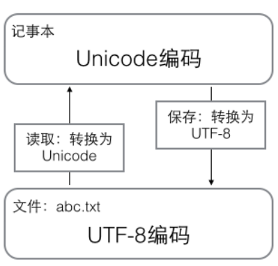
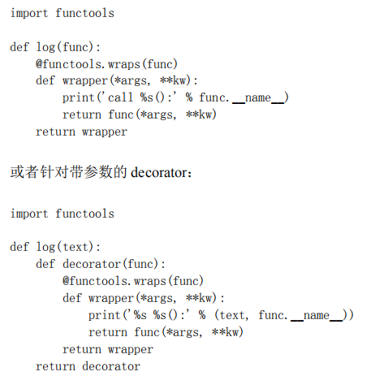
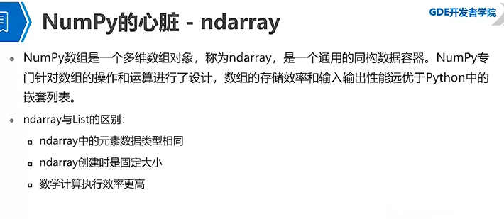
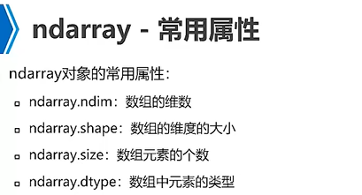
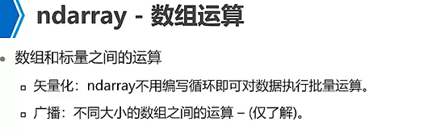
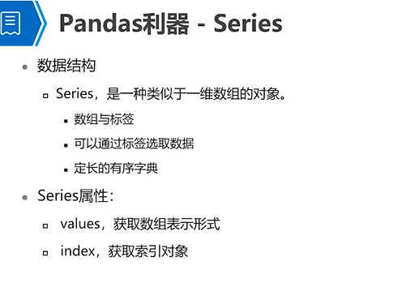
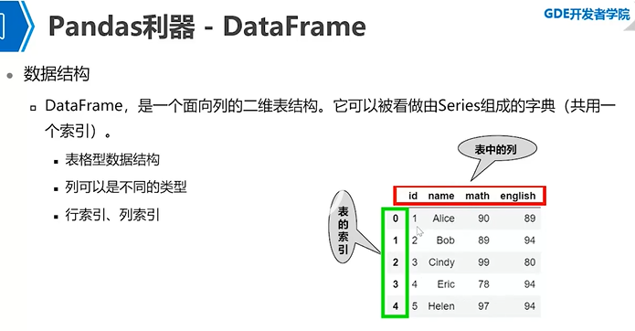

# python
- [搭建环境](#0)
- [快速入门](#1)
- [数据分析库](#2)
- [实用的Python库](#3)
- [BeautifulSoup解析与正则表达式](#4)

## <a id="0">搭建环境</a>
```python
1.Anaconda2安装
Anaconda2的下载：https://www.anaconda.com/distribution/
进行安装
2.opencv安装
opencv库下载好以后，进入安装目录的build\python\2.7的目录，这里面有两个目录,一个是64位的一个是32位的，里面都包含着一个cv2.pyd文件，复制与你安装Anaconda位数相同的里面的cv2.pyd文件，将其粘贴到Anaconda安装目录的Lib\site-packages目录下。
如果不行得话，可以手动安装，先先下载一个whl文件，关于opencv的，下载地址在这里：https://www.lfd.uci.edu/~gohlke/pythonlibs/#opencv。
当时下载红色的那个（对应的是cv3.4版，python3.6版） 
现在应该3.4.1了，最新的肯定没问题，只是pip 时候名字对应，跟自己python3.x，win_x对应就好 win32是32位，amd64是64位。
下完了，放到conda对应的文件夹里： 
可以在pycharm terminal在输入
cd C:\Anaconda3\Lib\site-packages\
输入打开命令行：
pip install opencv_python-3.4.6-cp37-cp37m-win_amd64.whl 
差不多完成了。
3.tensorflow安装
TensorFlow即可以支持CPU，也可以支持CPU+GPU。前者的环境需求简单，后者需要额外的支持。具备了上述安装条件（CPU或GPU）之后，TensorFlow可以通过两种方式进行安装。一是”native” pip，二是Anaconda。
Anaconda配置tensorflow
1.检查Anaconda是否成功安装：conda --version
2.检测目前安装了哪些环境：conda info --envs
3.检查目前有哪些版本的python可以安装：conda search --full-name python
4.安装不同版本的python：conda create --name tensorflow python=3.6最好安装3.6或者3.5
5.按照提示，激活之：activate tensorflow
6.确保名叫tensorflow的环境已经被成功添加：conda info --envs
7.检查新环境中的python版本：python --version
8.退出当前环境：deactivate
9.切换环境：activate tensorflow
安装tensorflow
1.一种尝试
安装CPU版本输入
安装GPU版本输入
Pip install --ignore-installed --upgrade tensorflow-gpu
（网络不好，多下载几次就成功了） 
2.另一种尝试：pip install tensorflow
3.配置pycharm中使用tensorflw得python.exe
安装完设置pycharm选择anaconda下anaconda2/envs/python.exe
File-》setting-》project interpreter-》选择设置-》add-》conda environment-》exsitingt environmeng-》选择anaconda2/envs/tensorflow下python.exe。
参考链接：https://blog.csdn.net/Eppley/article/details/79297503

4.sklearn等搭建
自2007年发布以来，scikit-learn已经成为Python重要的机器学习库了。scikit-learn简称sklearn，支持包括分类、回归、降维和聚类四大机器学习算法。还包含了特征提取、数据处理和模型评估三大模块。
  sklearn是Scipy的扩展，建立在NumPy和matplotlib库的基础上。利用这几大模块的优势，可以大大提高机器学习的效率。
  sklearn拥有着完善的文档，上手容易，具有着丰富的API，在学术界颇受欢迎。sklearn已经封装了大量的机器学习算法，包括LIBSVM和LIBINEAR。同时sklearn内置了大量数据集，节省了获取和整理数据集的时间。
在anaconda2里面添加tensorflow sklearn等库，一个利用pip install 有时候网络不好 还有一种是用anaconda2 navigater界面
安装sklearn可以通过pip install安装
pip install keras
pip install Keras-2.2.4-py2.py3-none-any.whl 可以下载在：https://www.lfd.uci.edu/~gohlke/pythonlibs/#opencv，然后通过pip安装也可以通过pip uninstall卸载。
pip install sklearn
```

## <a id="1">快速入门</a>
- [基础](#1.1)
- [函数](#1.2)
- [数据结构](#1.3)

参考链接：  
https://www.liaoxuefeng.com/wiki/1016959663602400  

### <a id="1.1">基础</a>
- 打印  
打印：print("hello world") 既可以用“”也可以用‘ 。  
print('The quick brown fox', 'jumps over', 'the lazy dog')  遇到逗号“,”会输出一个空格 。  

- 输入  
func_num = input()；
print(func_num)；  
这是因为 input()返回的数据类型是 str，str 不能直接和整数比较，必须先把 str 转换成整数。Python 提供了 int()函数来完成这件事情：s = input('birth: ')；birth = int(s)；  

- #：注释  
其他每一行都是一个语句，当语句以冒号:结尾时，缩进的语句视为代码块。  
请务必注意，Python 程序是大小写敏感的，如果写错了大小写。  
Python使用缩进组织代码块，请务必遵守约定俗成的习惯，坚持使用4个空格的缩进。  

- 数据类型  
整数，浮点型  
字符串：\转义‘。\n\t等。以\\表示的字符就是\。允许用 r''\\\\“表示''内部的字符串默认不转义。用'''...'''的格式表示多行内容。  
布尔型  
空值：不代表是0  
变量：//，称为地板除，两个整数的除法仍然是整数：  
格式化： '%2d-%02d' % (3, 1)    ' 3-01'  

- 编码  
中国制定了 GB2312 编码，用来把中文编进去。Unicode 标准也在不断发展，但最常用的是用两个字节表示一个字符（如果要用到非常偏僻的字符，就需要 4 个字节）。本着节约的精神，又出现了把 Unicode 编码转化为“可变长编码”的 UTF-8 编码。ASCII编码实际上可以被看成是UTF-8编码的一部分，所以，大量只支持ASCII编码的历史遗留软件可以在 UTF-8 编码下继续工作。  


提供了 ord()函数获取字符的整数表示，chr()函数把编码转换为对应的字符：  
以 Unicode 表示的 str 通过 encode()方法可以编码为指定的 bytes， '中文'.encode('utf-8')    
str 包含多少个字符，可以用 len()函数    
#!/usr/bin/env python3# -*- coding: utf-8 -*-  

- if  
根据 Python 的缩进规则，如果 if 语句判断是 True，就把缩进的两行 print语句执行了，否则，什么也不做。也可以给 if 添加一个 else 语句，意思是，如果 if 判断是 False，不要执行 if 的内容，去把 else 执行了。注意不要少写了冒号:。  
```js
age = 3
if age >= 18:
	print('adult')
elif age >= 6:
	print('teenager')
else:
	print('kid')
```

- for  
Python 的循环有两种，一种是 for...in 循环，依次把 list 或 tuple 中的每个元素迭代出来，  
```js
names = ['Michael', 'Bob', 'Tracy']
for name in names:
	print(name)
```
所以 for x in ...循环就是把每个元素代入变量 x，然后执行缩进块的语句。  
Python提供一个 range()函数，可以生成一个整数序列，再通过 list()函数可以转换为 list。比如 range(5)生成的序列是从 0 开始小于 5 的整数：list(range(5))。
第二种循环是 while 循环，只要条件满足，就不断循环，条件不满足时退出循环。比如我们要计算 100 以内所有奇数之和，可以用 while 循环实现：
```js
sum = 0
n = 99
while n > 0:
 sum = sum + n
 n = n - 2
print(sum)
```

- 数据类型转换   
Int float str bool  
函数名其实就是指向一个函数对象的引用，完全可以把函数名赋给一个变量，相当于给这个函数起了一个“别名”： a = abs # 变量 a 指向 abs 函数 a(-1) # 所以也可以通过 a 调用 ab。  

- 切片   
取list tuple 一部分数据可用切片silce。  
L = ['Michael' 'Sarah' 'Trac' 'Bob' 'Jack']   L[0:3] ['Michael', 'Sarah', 'Tracy'] L[0:3]表示，从索引 0 开始取，直到索引 3 为止，但不包括索引 3。即索引 0，1，2，正好是 3 个元素。  
 (0, 1, 2, 3, 4, 5)[:3]   'ABCDEFG'[::2]  

- 生成器generator  
定义生成器一个方法，创建生成器很简单将列表生成式中【】改为（）。g = (x * x for x in range(10))   
print(next(g));打印值    
for n in g:   
... print(n)  
定义生成器另一个方法如果一个函数定义中包含 yield 关键字，那么这个函数就不再是一个普通函数，而是一个 generator：  
```js
def fib(max):
 n, a, b = 0, 0, 1
 while n < max:
 yield b
 a, b = b, a + b
 n = n + 1
 return 'done'
```
generator 和函数的执行流程不一样。函数是顺序执行，遇到 return 语句或者最后一行函数语句就返回。而变成generator 的函数，在每次调用 next()的时候执行，遇到 yield 语句返回，再次执行时从上次返回的 yield 语句处继续执行。要理解 generator 的工作原理，它是在 for 循环的过程中不断计算出下一个元素，并在适当的条件结束 for 循环。对于函数改成的 generator 来说，遇到 return 语句或者执行到函数体最后一行语句，就是结束 generator的指令，for 循环随之结束。   

- 迭代器
可以直接作用于 for 循环的数据类型有以下几种：  
一类是集合数据类型，如 list、tuple、dict、set、str 等  
一类是 generator，包括生成器和带 yield 的 generator function这些可以直接作用于 for 循环的对象统称为可迭代对象：Iterable。   
可以使用 isinstance()判断一个对象是否是 Iterable 对象：  
isinstance([], Iterable)  
可以被 next()函数调用并不断返回下一个值的对象称为迭代器：Iterator。  
可以使用 isinstance()判断一个对象是否是 Iterator 对象：  
isinstance([], Iterator)  
生成器都是 Iterator 对象，但 list、dict、str 虽然是 Iterable，却不是Iterator。  
把 list、dict、str 等 Iterable 变成 Iterator 可以使用 iter()函数： isinstance(iter([]), Iterator) 

- map reduce  
Map：ap()函数接收两个参数，一个是函数，一个是 Iterable，map 将传入的函数依次作用到序列的每个元素，并把结果作为新的Iterator 返回。  
```js
>>> def f(x):
... return x * x
...
>>> r = map(f, [1, 2, 3, 4, 5, 6, 7, 8, 9])
>>> list(r)
[1, 4, 9, 16, 25, 36, 49, 64, 81]
```

Reduce：reduce 把一个函数作用在一个序列[x1, x2, x3, ...]上，这个函数必须接收两个参数，reduce 把结果继续和序列的下一个元素做累积计算，其效果就是：  
reduce(f, [x1, x2, x3, x4]) = f(f(f(x1, x2), x3), x4)  可用以求和。  

- filter 过滤序列  
和 map()类似，filter()也接收一个函数和一个序列。和 map()不同的时，filter()把传入的函数依次作用于每个元素，然后根据返回值是 True 还是 False 决定保留还是丢弃该元素。  
Filter过滤素数。注意到 filter()函数返回的是一个 Iterator，也就是一个惰性序列，所以要强迫 filter()完成计算结果，需要用 list()函数获得所有结果并返回list。  

- sorted
Python 内置的 sorted()函数就可以对 list 进行排序：  
```js
>>> sorted([36, 5, -12, 9, -21])
[-21, -12, 5, 9, 36]
此外，sorted()函数也是一个高阶函数，它还可以接收一个 key 函数来实现自定义的排序，例如按绝对值大小排序：
>>> sorted([36, 5, -12, 9, -21], key=abs)
[5, 9, -12, -21, 36]
sorted(['bob', 'about', 'Zoo', 'Credit'], key=str.lower)
```

- 模块
在 Python 中，一个.py 文件就称之为一个模块（Module）。使用模块还可以避免函数名和变量名冲突。相同名字的函数和变量完全可以分别存在不同的模块中，因此，我们自己在编写模块时，不必考虑名字会与其他模块冲突。但是也要注意，尽量不要与内置函数名字冲突点这里查看 Python 的所有内置函数。

你也许还想到，如果不同的人编写的模块名相同怎么办？为了避免模块名冲突，Python 又引入了按目录来组织模块的方法，称为包（Package）。现在，假设我们的 abc 和 xyz 这两个模块名字与其他模块冲突了，于是我们可以通过包来组织模块，避免冲突。方法是选择一个顶层包名，比如 mycompany，按照如下目录存放。

请注意，每一个包目录下面都会有一个__init__.py 的文件，这个文件是必须存在的，否则，Python 就把这个目录当成普通目录，而不是一个包。__init__.py 可以是空文件，也可以有 Python 代码，因为__init__.py 本身就是一个模块，而它的模块名就是 mycompany。
Sys：模块sys 模块有一个 argv 变量，用 list 存储了命令行的所有参数。argv 至少有一个元素，因为第一个参数永远是该.py 文件的名称，例如：运行 python3 hello.py Michael。  

在一个模块中，我们可能会定义很多函数和变量，但有的函数和变量我们希望给别人使用，有的函数和变量我们希望仅仅在模块内部使用。在Python 中，是通过_前缀来实现的。正常的函数和变量名是公开的（public），可以被直接引用。

类似__xxx__这样的变量是特殊变量，可以被直接引用，但是有特殊用途，比如上面的__author__，__name__就是特殊变量，hello 模块定义的文档注释也可以用特殊变量__doc__访问，我们自己的变量一般不要用这种变量名。类似_xxx 和__xxx 这样的函数或变量就是非公开的（private），不应该被直接引用，比如_abc，__abc 等；  

我们在模块里公开 greeting()函数，而把内部逻辑用 private 函数隐藏起来了，这样，调用 greeting()函数不用关心内部的 private 函数细节，这也是一种非常有用的代码封装和抽象的方法。

- 对象
```python
在 Python 中，所有数据类型都可以视为对象，当然也可以自定义对象。自定义的对象数据类型就是面向对象中的类（Class）的概念。
class Student(object):
 def __init__(self, name, score):
 self.name = name
 self.score = score
 def print_score(self):
 print('%s: %s' % (self.name, self.score))

bart = Student('Bart Simpson', 59)
lisa = Student('Lisa Simpson', 87)
bart.print_score()
class 后面紧接着是类名，即 Student，类名通常是大写开头的单词，紧接着是(object)，表示该类是从哪个类继承下来的，继承的概念我们后面再讲，通常，如果没有合适的继承类，就使用 object 类，这是所有类最终都会继承的类。
由于类可以起到模板的作用，因此，可以在创建实例的时候，把一些我们认为必须绑定的属性强制填写进去。通过定义一个特殊的__init__方法，在创建实例的时候，就把 name，score 等属性绑上去。注意到__init__方法的第一个参数永远是 self，表示创建的实例本身，
因此，在__init__方法内部，就可以把各种属性绑定到 self，因为 self就指向创建的实例本身。
如果要让内部属性不被外部访问，可以把属性的名称前加上两个下划线__，在 Python 中，实例的变量名如果以__开头，就变成了一个私有变量（private），只有内部可以访问，外部不能访问.
class Student(object):
 def __init__(self, name, score):
 self.__name = name
 self.__score = score
需要注意的是，在 Python 中，变量名类似__xxx__的，也就是以双下划线开头，并且以双下划线结尾的，是特殊变量，特殊变量是可以直接访问的，不是 private 变量，所以，不能用__name__、__score__这样的变量名。双下划线开头的实例变量是不是一定不能从外部访问呢？其实也不是。不能直接访问__name 是因为 Python 解释器对外把__name 变量改成了_Student__name，所以，仍然可以通过_Student__name 来访问__name 变量。
在 OOP 程序设计中，当我们定义一个 class 的时候，可以从某个现有的class 继承，新的 class 称为子类（Subclass），而被继承的 class 称为基类、父类或超类（Base class、Super class）。
判断一个变量是否是某个类型可以用 isinstance()判断。

当我们拿到一个对象的引用时，如何知道这个对象是什么类型、有哪些方法呢？
使用 type()来判断对象类型，使用 type()函数， type(123)。
使用 isinstance()，一个对象是否是某种类型。
使用 dir()，如果要获得一个对象的所有属性和方法，可以使用 dir()函数，它返回
一个包含字符串的 list，比如，获得一个 str 对象的所有属性和方法。
仅仅把属性和方法列出来是不够的，配合 getattr()、setattr()以及hasattr()，我们可以直接操作一个对象的状态。
hasattr(obj, 'x')     #有属性'x'
setattr(obj, 'y', 19)  #设置一个属性'y'
getattr(obj, 'y')     #获取属性'y'
```

- 实例
```python
Slot：如果我们想要限制实例的属性怎么办？比如，只允许对 Student实例添加 name 和 age 属性。为了达到限制的目的，Python 允许在定义 class 的时候，定义一个特殊的__slots__变量，来限制该 class 实例能添加的属性：
class Student(object):
 __slots__ = ('name', 'age') # 用 tuple 定义允许绑定的属性名称
由于'score'没有被放到__slots__中，所以不能绑定 score 属性，试图绑定 score 将得到 AttributeError 的错误
使用__slots__要注意，__slots__定义的属性仅对当前类实例起作用，对继承的子类是不起作用的
Property：有没有既能检查参数，又可以用类似属性这样简单的方式来访问类的变量呢？对于追求完美的 Python 程序员来说，这是必须要做到的！还记得装饰器（decorator）可以给函数动态加上功能吗？对于类的方法，装饰器一样起作用。Python 内置的@property 装饰器就是负责把一个方法变成属性调用的。
@property 的实现比较复杂，我们先考察如何使用。把一个 getter 方法变成属性，只需要加上@property 就可以了，此时，@property 本身又创建了另一个装饰器@score.setter，负责把一个 setter 方法变成属性赋值。还可以定义只读属性，只定义 getter 方法，不定义 setter 方法就是一个只读属性：
class Student(object):
 @property
 def birth(self):
 return self._birth
 @birth.setter
 def birth(self, value):
 self._birth = value
 @property
 def age(self):
 return 2015 - self._birth
上面的 birth 是可读写属性，而 age 就是一个只读属性，因为 age 可以根据 birth 和当前时间计算出来。
def __getattr__(self, attr):
	if attr=='score':
		return 99
这实际上可以把一个类的所有属性和方法调用全部动态化处理了，不需要任何特殊手段。现在很多网站都搞 REST API，比如新浪微博、豆瓣啥的，调用 API 的URL 类似如果要写 SDK，给每个 URL 对应的 API 都写一个方法，那得累死，而且，API 一旦改动，SDK 也要改。利用完全动态的__getattr__，我们可以写出一个链式调用.
```

- class
```python
更好的方法是为这样的枚举类型定义一个 class 类型，然后，每个常量
都是 class 的一个唯一实例。Python 提供了 Enum 类来实现这个功能：
from enum import Enum
Month = Enum('Month', ('Jan', 'Feb', 'Mar', 'Apr', 'May', 'Jun', 'Jul', 
'Aug', 'Sep', 'Oct', 'Nov', 'Dec'))
我们说 class 的定义是运行时动态创建的，而创建 class 的方法就是使用type()函数。type()函数既可以返回一个对象的类型，又可以创建出新的类型，比如，
我们可以通过 type()函数创建出 Hello 类，而无需通过 class Hello(object)...的定义：
要创建一个 class 对象，type()函数依次传入 3 个参数。正常情况下，我们都用 class Xxx...来定义类，但是，type()函数也允许
我们动态创建出类来，也就是说，动态语言本身支持运行期动态创建类，这和静态语言有非常大的不同，要在静态语言运行期创建类，必须构造源代码字符串再调用编译器，或者借助一些工具生成字节码实现，本质上都是动态编译，会非常复杂。
除了使用 type()动态创建类以外，要控制类的创建行为，还可以使用metaclass。metaclass，直译为元类，简单的解释就是：当我们定义了类以后，就可以根据这个类创建出实例，所以：先定义类，然后创建实例。正常情况下，你不会碰到需要使用 metaclass 的情况。
```

- 调试 测试
```python
Logging模块 assert print  启动 Python 解释器时可以用-O 参数来关闭 assert。
    logging.basicConfig(level=logging.INFO)
    logging.info('logging info');
logging.error('logging error');
启动 Python 的调试器 pdb，让程序以单步方式运行，可以随时查看运行状态。我们先准备好程序然后启动：
$ python3 -m pdb err.py
> 
/Users/michael/Github/learn-python3/samples/debug/err.py(2)<module>()
-> s = '0'
以参数-m pdb 启动后，pdb 定位到下一步要执行的代码-> s = '0'。输入命令 l 来查看代码
类似gdb
测试：为了编写单元测试，我们需要引入 Python 自带的 unittest 模块。对每一类测试都需要编写一个 test_xxx()方法。由于 unittest.TestCase提供了很多内置的条件判断，我们只需要调用这些方法就可以断言输出是否是我们所期望的。最常用的断言就是 assertEqual()。setUp()和 tearDown()方法有什么用呢？设想你的测试需要启动一个数据库，这时，就可以在 setUp()方法中连接数据库，在 tearDown()方法中关闭数据库，这样，不必在每个测试方法中重复相同的代码。
```

- IO stringIO byteIO 操作文件和目录
```python
第一种是 CPU 等着，也就是程序暂停执行后续代码，等 100M 的数据在 10 秒后写入磁盘，再接着往下执行，这种模式称为同步 IO；
另一种方法是 CPU 不等待，只是告诉磁盘，“您老慢慢写，不着急，我接着干别的事去了”，于是，后续代码可以立刻接着执行，这种模式称为异步 IO。
很明显，使用异步 IO 来编写程序性能会远远高于同步 IO，但是异步 IO的缺点是编程模型复杂。想想看，你得知道什么时候通知你“汉堡做好了”，而通知你的方法也各不相同。如果是服务员跑过来找到你，这是回调模式，如果服务员发短信通知你，你就得不停地检查手机，这是轮询模式。总之，异步 IO 的复杂度远远高于同步 IO。
 f = open('/Users/michael/test.txt', 'r')。如果文件打开成功，接下来，调用 read()方法可以一次读取文件的全部内容，Python 把内容读到内存，用一个 str 对象表示。调用 read()会一次性读取文件的全部内容，如果文件有 10G，内存就爆了，所以，要保险起见，可以反复调用 read(size)方法，每次最多读取size 个字节的内容。另外，调用 readline()可以每次读取一行内容，调用 readlines()一次读取所有内容并按行返回 list。因此，要根据需要决
定怎么调用。f = open('/Users/michael/gbk.txt', 'r', encoding='gbk', errors='ignore')
>>> f = open('/Users/michael/test.txt', 'w')
>>> f.write('Hello, world!')
>>> f.close()
很多时候，数据读写不一定是文件，也可以在内存中读写。StringIO 顾名思义就是在内存中读写 str。要把 str 写入 StringIO，我们需要先创建一个 StringIO，然后，像文件一样写入即可。
StringIO操作的只能是str，如果要操作二进制数据，就需要使用BytesIO。
如果我们要操作文件、目录，可以在命令行下面输入操作系统提供的各种命令来完成。比如 dir、cp 等命令。其实操作系统提供的命令只是简单地调用了操作系统提供的接口函数，Python 内置的 os 模块也可以直接调用操作系统提供的接口函数。
os.environ，os.environ.get('PATH')，os.path.abspath('.')，os.mkdir('/Users/michael/testdir')，os.rmdir('/Users/michael/testdir')，os.path.split()，os.path.splitext()可以直接让你得到文件扩展名。>>> os.rename('test.txt', 'test.py')
# 删掉文件:
>>> os.remove('test.py')
幸运的是 shutil 模块提供了 copyfile()的函数，你还可以在 shutil 模块中找到很多实用函数，它们可以看做是 os 模块的补充。 [x for x in os.listdir('.') if os.path.isdir(x)]。
```

- 序列化
```python
我们把变量从内存中变成可存储或传输的过程称之为序列化，在 Python中叫 pickling，在其他语言中也被称之为 serialization，marshalling，flattening 等等，都是一个意思。反过来，把变量内容从序列化的对象重新读到内存里称之为反序列化，即 unpickling。Python 提供了 pickle 模块来实现序列化。 
import pickle
d = dict(name='Bob', age=20, score=88)
>>> pickle.dumps(d)
pickle.dumps()方法把任意对象序列化成一个 bytes，然后，就可以把这
个 bytes 写入文件。或者用另一个方法 pickle.dump()直接把对象序列化
后写入一个 file-like Object。当我们要把对象从磁盘读到内存时，可以先把内容读到一个 bytes，然后用 pickle.loads()方法反序列化出对象，也可以直接用 pickle.load()方法从一个 file-like Object 中直接反序列化出对象。我们打开另一个Python 命令行来反序列化刚才保存的对象。Pickle 的问题和所有其他编程语言特有的序列化问题一样，就是它只能用于 Python，并且可能不同版本的 Python 彼此都不兼容，因此，只能用 Pickle 保存那些不重要的数据，不能成功地反序列化也没关系。
JSON：如果我们要在不同的编程语言之间传递对象，就必须把对象序列化为标准格式，比如 XML，但更好的方法是序列化为 JSON，因为 JSON 表示出来就是一个字符串，可以被所有语言读取，也可以方便地存储到磁盘。或者通过网络传输。JSON 不仅是标准格式，并且比 XML 更快，而且可以直接在 Web 页面中读取，非常方便。JSON 表示的对象就是标准的 JavaScript 语言的对象，JSON 和 Python内置的数据类型对应如下：
JSON 类型 Python 类型
{}  dict
[]  list
"string" str
1234.56 int 或 float
true/false True/False
null None
dumps()方法返回一个 str，内容就是标准的 JSON。json.dumps(d)。要把 JSON 反序列化为 Python 对象，用 loads()或者对应的 load()方法，前者把 JSON 的字符串反序列化，后者从 file-like Object 中读取字符串并反序列化：json.loads(json_str)。
```

- 进程 线程
```python
子进程永远返回 0，而父进程返回子进程的 ID。这样做的理由是，一个父进程可以 fork 出很多子进程，所以，父进程要记下每个子进程的 ID，而子进程只需要调用 getppid()就可以拿到父进程的 ID。Python 的 os 模块封装了常见的系统调用，其中就包括 fork，可以在
Python 程序中轻松创建子进程。 Windows 没有 fork 调用。multiprocessing 模块就是跨平台版本的多进程模块。
如果要启动大量的子进程，可以用进程池的方式批量创建子进程。p = Pool(4)。由于 Pool 的默认大小是 CPU 的核数，如果你不幸拥有 8 核 CPU，你要提交至少 9 个子进程才能看到上面的等待效果。p.apply_async(long_time_task, args=(i,))。subprocess 模块可以让我们非常方便地启动一个子进程，然后控制其输入和输出。
subprocess 模块可以让我们非常方便地启动一个子进程，然后控制其输入和输出。r = subprocess.call(['nslookup', 'www.python.org'])。Process 之间肯定是需要通信的，操作系统提供了很多机制来实现进程间的通信。Python 的 multiprocessing 模块包装了底层的机制，提供了Queue、Pipes 等多种方式来交换数据。
# 写数据进程执行的代码:
def write(q):
 print('Process to write: %s' % os.getpid())
 for value in ['A', 'B', 'C']:
 print('Put %s to queue...' % value)
 q.put(value)
 time.sleep(random.random())
# 读数据进程执行的代码:
def read(q):
 print('Process to read: %s' % os.getpid())
 while True:
 value = q.get(True)
 print('Get %s from queue.' % value)

if __name__=='__main__':
 # 父进程创建 Queue，并传给各个子进程：
 q = Queue()
 pw = Process(target=write, args=(q,))
 pr = Process(target=read, args=(q,))
 # 启动子进程 pw，写入:
 pw.start()
 # 启动子进程 pr，读取:
 pr.start()
 # 等待 pw 结束:
 pw.join()
 # pr 进程里是死循环，无法等待其结束，只能强行终止:
 pr.terminate()

Python 的标准库提供了两个模块：_thread 和 threading，_thread 是低级模块，threading 是高级模块，对_thread 进行了封装。绝大多数情况下，我们只需要使用 threading 这个高级模块。t = threading.Thread(target=loop, name='LoopThread')
t.start()
t.join()
由于锁只有一个，无论多少线程，同一时刻最多只有一个线程持有该锁，所以，不会造成修改的冲突。创建一个锁就是通过threading.Lock()来实现。当多个线程同时执行 lock.acquire()时，只有一个线程能成功地获取锁，然后继续执行代码，其他线程就继续等待直到获得锁为止。ThreadLocal 最常用的地方就是为每个线程绑定一个数据库连接，HTTP请求，用户身份信息等，这样一个线程的所有调用到的处理函数都可以非常方便地访问这些资源。一个 ThreadLocal 变量虽然是全局变量，但每个线程都只能读写自己线程的独立副本，互不干扰。ThreadLocal 解决了参数在一个线程中各个函数之间互相传递的问题。
```

- 正则表达式
```python
在正则表达式中，如果直接给出字符，就是精确匹配。用\d 可以匹配一个数字，\w 可以匹配一个字母或数字。
要匹配变长的字符，在正则表达式中，用*表示任意个字符（包括 0 个），用+表示至少一个字符，用?表示 0 个或 1 个字符，用{n}表示 n 个字符，用{n,m}表示 n-m 个字符。
如果要匹配'010-12345'的正则是\d{3}\-\d{3,8}。
要做更精确地匹配，可以用[]表示范围，比如： [0-9a-zA-Z\_]可以匹配一个数字、字母或者下划线； [0-9a-zA-Z\_]+可以匹配至少由一个数字、字母或者下划线组成的字符串，比如'a100'，'0_Z'，'Py3000'等等；
^表示行的开头，^\d 表示必须以数字开头。
$表示行的结束，\d$表示必须以数字结束。
Python 提供 re 模块，包含所有正则表达式的功能。由于 Python 的字符串本身也用\转义。import re  >>> re.match(r'^\d{3}\-\d{3,8}$', '010-12345')。
re.split(r'\s+', 'a b c') 切分字符串
除了简单地判断是否匹配之外，正则表达式还有提取子串的强大功能。用()表示的就是要提取的分组（Group）。注意到 group(0)永远是原始字符串，group(1)、group(2)……表示第 1、2、……个子串。
当我们在 Python 中使用正则表达式时，re 模块内部会干两件事情：
1. 编译正则表达式，如果正则表达式的字符串本身不合法，会报错；
2. 用编译后的正则表达式去匹配字符串。
>>> import re
# 编译:
>>> re_telephone = re.compile(r'^(\d{3})-(\d{3,8})$')
# 使用：
>>> re_telephone.match('010-12345').groups()
('010', '12345')
>>> re_telephone.match('010-8086').groups()
('010', '8086')
```

-  内建模块
```python
datetime 是 Python 处理日期和时间的标准库
now = datetime.now() # 获取当前 datetime
dt = datetime(2015, 4, 19, 12, 20) # 用指定日期时间创建 datetime
dt.timestamp() # 把 timestamp 转换为 datetime
collections 是 Python 内建的一个集合模块，提供了许多有用的集合类。namedtuple 是一个函数，它用来创建一个自定义的 tuple 对象，并且规定了 tuple 元素的个数，并可以用属性而不是索引来引用 tuple 的某个元素。
deque 是为了高效实现插入和删除操作的双向列表，适合用于队列和栈。使用 list 存储数据时，按索引访问元素很快，但是插入和删除元素就很慢了，因为 list 是线性存储，数据量大的时候，插入和删除效率很低。
OrderedDict：使用 dict 时，Key 是无序的。在对 dict 做迭代时，我们无法确定 Key的顺序。如果要保持 Key 的顺序，可以用 OrderedDict。
Defaultdict：使用 dict 时，如果引用的 Key 不存在，就会抛出 KeyError。如果希望key 不存在时，返回一个默认值，就可以用 defaultdict。
Counter 是一个简单的计数器，例如，统计字符出现的个数。
Base64 是一种用 64 个字符来表示任意二进制数据的方法。所以，Base64 编码会把 3 字节的二进制数据编码为 4 字节的文本数据，长度增加 33%，好处是编码后的文本数据可以在邮件正文、网页等直接显示。如果要编码的二进制数据不是 3 的倍数，最后会剩下 1 个或 2 个字节怎么办？Base64 用\x00 字节在末尾补足后，再在编码的末尾加上 1 个或 2个=号，表示补了多少字节，解码的时候，会自动去掉。>>> import base64
>>> base64.b64encode(b'binary\x00string')
b'YmluYXJ5AHN0cmluZw=='
>>> base64.b64decode(b'YmluYXJ5AHN0cmluZw==')
b'binary\x00string'
hashlib 提供了常见的摘要算法，如 MD5，SHA1 等等。
itertools 提供了非常有用的用于操作迭代对象的函数。
Python 提供了 HTMLParser 来非常方便地解析 HTML，只需简单几行代码。
urllib 提供了一系列用于操作 URL 的功能。urllib 的 request 模块可以非常方便地抓取 URL 内容，也就是发送一个GET 请求到指定的页面，然后返回 HTTP 的响应。
PIL：操作图像。
virtualenv 就是用来为一个应用创建一套“隔离”的 Python 运行环境。


- if __name__ == '__main__' 
一个python的文件有两种使用的方法，第一是直接作为脚本执行，第二是import到其他的python脚本中被调用（模块重用）执行。因此if __name__ == 'main': 的作用就是控制这两种情况执行代码的过程，在if __name__ == 'main': 下的代码只有在第一种情况下（即文件作为脚本直接执行）才会被执行，而import到其他脚本中是不会被执行的。
每个python模块（python文件，也就是此处的test.py和import_test.py）都包含内置的变量__name__,当运行模块被执行的时候，__name__等于文件名（包含了后缀.py）；如果import到其他模块中，则__name__等于模块名称（不包含后缀.py）。而“__main__”等于当前执行文件的名称（包含了后缀.py）。进而当模块被直接执行时，__name__ == 'main'结果为真。同样举例说明，我们在test.py脚本的if __name__=="__main__":之前加入print __name__，即将__name__打印出来。文件内容和结果如下。
```

- gui模块
```python
我们编写的 Python 代码会调用内置的 Tkinter，Tkinter 封装了访问 Tk的接口。from tkinter import *。pack()方法把 Widget 加入到父容器中，并实现布局。pack()是最简单的布局，grid()可以实现更复杂的布局。
from tkinter import *
import tkinter.messagebox as messagebox

class Application(Frame):
    def __init__(self, master=None):
        Frame.__init__(self, master)
        self.pack()
        self.createWidgets()

    def hello(self):
        name = self.nameInput.get() or 'world';
        messagebox.showinfo('Message', 'Hello, %s' % name)

    def createWidgets(self):
        #self.helloLabel = Label(self, text='Hello, world!');
        #self.helloLabel.pack();
        #self.quitButton = Button(self, text='Quit', command=self.quit);
        #self.quitButton.pack();

        self.nameInput = Entry(self)
        self.nameInput.pack()
        self.alertButton = Button(self, text='Hello',command=self.hello)
        self.alertButton.pack()

def function_tkinter():
    app = Application();
    # 设置窗口标题:
    app.master.title('Hello World');
    # 主消息循环:
    app.mainloop();
```


-  网络编程
```python
import socket
# 创建一个 socket:
s = socket.socket(socket.AF_INET, socket.SOCK_STREAM)
# 建立连接:
s.connect(('www.sina.com.cn', 80))
s.send(b'GET / HTTP/1.1\r\nHost: www.sina.com.cn\r\nConnection: 
close\r\n\r\n')
d = s.recv(1024)
接收数据时，调用 recv(max)方法，一次最多接收指定的字节数，因此，在一个 while 循环中反复接收，直到 recv()返回空数据，表示接收完毕，退出循环。
# 关闭连接:
s.close()
s.bind(('127.0.0.1', 9999))
紧接着，调用 listen()方法开始监听端口，传入的参数指定等待连接的最大数量：
s.listen(5)
SMTP 发送邮件import smtplib
Python 内置一个 poplib 模块，实现了 POP3 协议，可以直接用来收邮件。
1.1.39 数据库
要操作关系数据库，首先需要连接到数据库，一个数据库连接称为Connection；连接到数据库后，需要打开游标，称之为 Cursor，通过 Cursor 执行 SQL语句，然后，获得执行结果。import sqlite3
def function_sqllite():
    # 连接到 SQLite 数据库,数据库文件是 test.db,如果文件不存在，会自动在当前目录创建:
    conn = sqlite3.connect('test.db');
    # 创建一个 Cursor:
    cursor = conn.cursor();
    #cursor.execute('create table user (id varchar(20) primary key, name varchar(20))');
    #cursor.execute('insert into user (id, name) values (\'1\',\'Michael\')');
    print(cursor.rowcount);

    cursor.execute('select * from user where id=?', '1');
    values = cursor.fetchall();
    print(values);

    cursor.close();
    conn.commit();# 提交事务:
    conn.close();# 关闭 Connection:
使用 Cursor 对象执行 select 语句时，通过 featchall()可以拿到结果集。结果集是一个 list，每个元素都是一个 tuple，对应一行记录
```

- web框架
```python
1.1.34 除了 Flask，常见的 Python Web 框架还有：
 Django：全能型 Web 框架；
 web.py：一个小巧的 Web 框架；
 Bottle：和 Flask 类似的 Web 框架；
 Tornado：Facebook 的开源异步 Web 框架。 

除了 Jinja2，常见的模板还有：
 Mako：用<% ... %>和${xxx}的一个模板；
 Cheetah：也是用<% ... %>和${xxx}的一个模板；
 Django：Django 是一站式框架，内置一个用和{{ xxx }}
的模板。
```

- 异步
```python
asyncio 的编程模型就是一个消息循环。我们从 asyncio 模块中直接获取一个 EventLoop 的引用，然后把需要执行的协程扔到 EventLoop 中执行，就实现了异步 IO。
asyncio 提供了完善的异步 IO 支持；异步操作需要在 coroutine 中通过 yield from 完成；多个 coroutine 可以封装成一组 Task 然后并发执行。
asyncio 实现了 TCP、UDP、SSL 等协议，aiohttp 则是基于 asyncio 实现的 HTTP 框架。
协程，又称微线程，纤程。英文名 Coroutine。看起来 A、B 的执行有点像多线程，但协程的特点在于是一个线程执行，那和多线程比，协程有何优势？最大的优势就是协程极高的执行效率。因为子程序切换不是线程切换，而是由程序自身控制，因此，没有线程切换的开销，和多线程比，线程数量越多，协程的性能优势就越明显。第二大优势就是不需要多线程的锁机制，因为只有一个线程，也不存在同时写变量冲突，在协程中控制共享资源不加锁，只需要判断状态就好了，所以执行效率比多线程高很多。
Python 对协程的支持是通过 generator 实现的。在 generator 中，我们不但可以通过 for 循环来迭代，还可以不断调用next()函数获取由 yield 语句返回的下一个值。
import threading
import asyncio

@asyncio.coroutine
def hello():
 print('Hello world! (%s)' % threading.currentThread())
 yield from asyncio.sleep(1)
 print('Hello again! (%s)' % threading.currentThread())

loop = asyncio.get_event_loop()
tasks = [hello(), hello()]
loop.run_until_complete(asyncio.wait(tasks))
loop.close()
Coroutine函数是多线程的。可见 3 个连接由一个线程通过 coroutine 并发完成。
只需要做两步简单的替换：
1. 把@asyncio.coroutine 替换为 async；
2. 把 yield from 替换为 await。
async def hello():
 print("Hello world!")
 r = await asyncio.sleep(1)
 print("Hello again!")
```

- 打包
```python
【Terminal】打开终端，输入命令pip install pyinstaller
输入命令 pyinstaller，回车显示安装成功
输入命令 pyinstaller --console --onefile jingyan_frame.py
```

### <a id="1.2">函数</a>
- 函数默认参数  
如果没有return，函数执行完毕返回none。Retrun none可以简写为return。  
如果你已经把 my_abs()的函数定义保存为 abstest.py 文件了，那么，可以在该文件的当前目录下启动 Python 解释器，用 from abstest import my_abs 来导入 my_abs()函数，注意 abstest 是文件名（不含.py 扩展名）。  
数据类型检查可以用内置函数 isinstance()实现：  
if not isinstance(x, (int, float)):  
	raise TypeError('bad operand type')  

函数可以返回多个值x, y = move(100, 100, 60, math.pi / 6)  return nx, ny  r = move(100, 100, 60, math.pi / 6)这样也行。返回是一个tuple。在语法上，返回一个 tuple 可以省略括号，而多个变量可以同时接收一个 tuple，按位置赋给对应的值，所以，Python 的函数返回多值其实就是返回一个 tuple，但写起来更方便。  

def power(x, n=2):第二参数默认值2兼容。当函数有多个参数时，把变化大的参数放前面，变化小的参数放后面。默认参数必须指向不变对象！否在多次调用默认值会变，用list就会变。为什么要设计 str、None 这样的不变对象呢？因为不变对象一旦创建，对象内部的数据就不能修改，这样就减少了由于修改数据导致的错误。此外，由于对象不变，多任务环境下同时读取对象不需要加锁，同时读一点问题都没有。我们在编写程序时，如果可以设计一个不变对象，那就尽量设计成不变对象。  

注：由于 abs 函数实际上是定义在__builtin__模块中的，所以要让修改abs 变量的指向在其它模块也生效，要用__builtin__.abs = 10。
把函数作为参数传入，这样的函数称为高阶函数，函数式编程就是指这种高度抽象的编程范式。  

- 函数可变参数  
可变参数：输入参数个数不确定，可以用list tupledef calc(numbers):   calc([1, 2, 3])  

可以将函数参数变为可变从参数def calc(*numbers):定义可变参数和定义一个 list 或 tuple 参数相比，仅仅在参数前面加了一个*号。在函数内部，参数 numbers 接收到的是一个 tuple，因此，函数代码完全不变。但是，调用该函数时，可以传入任意个参数，包括 0 个参数： calc(1, 3, 5, 7)。如果要传入list或者tuple，这么调用calc(*nums)。*nums 表示把 nums 这个 list 的所有元素作为可变参数传进去。这种写法相当有用，而且很常见。  
关键字参数：关键字参数允许你传入 0 个或任意个含参数名的参数，这些关键字参数在函数内部自动组装为一个 dict。  
```js
>>> person('Bob', 35, city='Beijing')
name: Bob age: 35 other: {'city': 'Beijing'}
>>> person('Adam', 45, gender='M', job='Engineer')
name: Adam age: 45 other: {'gender': 'M', 'job': 'Engineer'}
关键字参数有什么用？它可以扩展函数的功能。比如，在 person 函数里，我们保证能接收到 name 和 age 这两个参数，但是，如果调用者愿意提供更多的参数，我们也能收到。试想你正在做一个用户注册的功能，除了用户名和年龄是必填项外，其他都是可选项，利用关键字参数来定义这个函数就能满足注册的需求。
>>> extra = {'city': 'Beijing', 'job': 'Engineer'
>>> person('Jack', 24, **extra)
name: Jack age: 24 other: {'city': 'Beijing', 'job': 'Engineer'}
```

- 命名关键字参数  
关键字参数可以通过if in检查。或者用如果要限制关键字参数的名字，就可以用命名关键字参数，例如，只接收 city 和 job 作为关键字参数。和关键字参数**kw 不同，命名关键字参数需要一个特殊分隔符*，*后面的参数被视为命名关键字参数。这种方式定义的函数如下：
def person(name, age, *, city, job):
 print(name, age, city, job)
命名关键字参数必须传入参数名，这和位置参数不同。如果没有传入参数名，调用将报错：
person('Jack', 24, city='Beijing', job='Engineer')
Jack 24 Beijing Engineer
def person(name, age, *, city='Beijing', job):这样定义即有默认值。
使用命名关键字参数时，要特别注意，*不是参数，而是特殊分隔符。
在 Python 中定义函数，可以用必选参数、默认参数、可变参数、关键字参数和命名关键字参数，这 5 种参数都可以组合使用，除了可变参数无法和命名关键字参数混合。但是请注意，参数定义的顺序必须是：必选参数、默认参数、可变参数/命名关键字参数和关键字参数。
def f1(a, b, c=0, *args, **kw):
	print('a =', a, 'b =', b, 'c =', c, 'args =', args, 'kw =', kw)
def f2(a, b, c=0, *, d, **kw):
	print('a =', a, 'b =', b, 'c =', c, 'd =', d, 'kw =', kw)

- 高阶函数 闭包   
函数作为返回值：高阶函数除了可以接受函数作为参数外，还可以把函数作为结果值返回。  
```js
def lazy_sum(*args):
 def sum():
 ax = 0
 for n in args:
 ax = ax + n
 return ax
 return sum
当我们调用 lazy_sum()时，返回的并不是求和结果，而是求和函数。
请再注意一点，当我们调用 lazy_sum()时，每次调用都会返回一个新的函数，即使传入相同的参数。
在这个例子中，我们在函数 lazy_sum 中又定义了函数 sum，并且，内部函数 sum 可以引用外部函数 lazy_sum 的参数和局部变量，当 lazy_sum 返回函数 sum 时，相关参数和变量都保存在返回的函数中，这种称为“闭包（Closure）”的程序结构拥有极大的威力。
闭包：注意到返回的函数在其定义内部引用了局部变量 args，所以，当一个函数返回了一个函数后，其内部的局部变量还被新函数引用，所以，闭包用起来简单，实现起来可不容易。返回闭包时牢记的一点就是：返回函数不要引用任何循环变量，或者后续会发生变化的变量。
def count():
 fs = []
 for i in range(1, 4):
 def f():
 return i*i
 fs.append(f)
 return fs
f1, f2, f3 = count()
9 9 9
def count():
 def f(j):
 def g():
 return j*j
 return g
 fs = []
 for i in range(1, 4):
 fs.append(f(i)) # f(i)立刻被执行，因此 i 的当前值被传入 f()
 return fs
1 4 9
```

- 匿名函数   
```python
关键字 lambda 表示匿名函数，冒号前面的 x 表示函数参数。
lambda x: x * x
def f(x):
 return x * x
匿名函数有个限制，就是只能有一个表达式，不用写 return，返回值就是该表达式的结果。
>>> f = lambda x: x * x
>>> f
<function <lambda> at 0x101c6ef28>
>>> f(5)
25
用匿名函数有个好处，因为函数没有名字，不必担心函数名冲突。此外，匿名函数也是一个函数对象，也可以把匿名函数赋值给一个变量，再利用变量来调用该函数：
```

- 装饰器
```python
由于函数也是一个对象，而且函数对象可以被赋值给变量，所以，通过变量也能调用该函数。
函数对象有一个__name__属性，可以拿到函数的名字。现在，假设我们要增强 now()函数的功能，比如，在函数调用前后自动打印日志，但又不希望修改 now()函数的定义，这种在代码运行期间动态增加功能的方式，称之为“装饰器”（Decorator）。本质上，decorator 就是一个返回函数的高阶函数。所以，我们要定义一个能打印日志的 decorator，可以定义如下：
def log(func):
 def wrapper(*args, **kw):
 print('call %s():' % func.__name__)
 return func(*args, **kw)
 return wrapper
@log
def now():
 print('2015-3-25')
观察上面的 log，因为它是一个 decorator，所以接受一个函数作为参数，并返回一个函数。我们要借助 Python 的@语法，把 decorator 置于函数的定义处：调用 now()函数，不仅会运行 now()函数本身，还会在运行 now()函数前。把@log 放到 now()函数的定义处，相当于执行了语句：now = log(now)。由于 log()是一个 decorator，返回一个函数，所以，原来的 now()函数仍然存在，只是现在同名的 now 变量指向了新的函数，于是调用 now()将执行新函数，即在 log()函数中返回的 wrapper()函数。
还可以用log（“”）添加额外信息，就是两层嵌套。now = log('execute')(now)
```


@unique 装饰器可以帮助我们检查保证没有重复值   

- 偏函数
```python
Python 的 functools 模块提供了很多有用的功能，其中一个就是偏函数（Partial function）。在介绍函数参数的时候，我们讲到，通过设定参数的默认值，可以降低
函数调用的难度。而偏函数也可以做到这一点。举例如下：int()函数可以把字符串转换为整数，当仅传入字符串时，int()函数默认按十进制转换。
functools.partial 就是帮助我们创建一个偏函数的，不需要我们自己定义 int2()，可以直接使用下面的代码创建一个新的函数 int2
>>> import functools
>>> int2 = functools.partial(int, base=2)
>>> int2('1000000')
64
>>> int2('1010101')
85
所以，简单总结 functools.partial 的作用就是，把一个函数的某些参数给固定住（也就是设置默认值），返回一个新的函数，调用这个新函数会更简单。
最后，创建偏函数时，实际上可以接收函数对象、*args 和**kw 这 3 个
参数。
```

### <a id="1.3">数据结构</a>
- list tuple  
Python 内置的一种数据类型是列表：list。list是一种有序的集合，可以随时添加和删除其中的元素。  
```js
(1)classmates = ['Michael', 'Bob', 'Tracy']。
(2)用 len()函数可以获得 list 元素的个数。
(3)classmates[0]。如果要取最后一个元素，除了计算索引位置外，还可以用-1 做索引，直
接获取最后一个元素。
(4)list 是一个可变的有序表，所以，可以往 list 中追加元素到末尾：classmates.append('Adam')。
(5)可以把元素插入到指定的位置，比如索引号为 1 的位置：classmates.insert(1, 'Jack')。
(6)要删除 list 末尾的元素，用 pop()方法：classmates.pop()。
(7)要删除指定位置的元素，用 pop(i)方法，其中 i 是索引位置：classmates.pop(1)。
(8)某个元素替换成别的元素，可以直接赋值给对应的索引位置：classmates[1] = 'Sarah'。
(9)list 里面的元素的数据类型也可以不同，比如： L = ['Apple', 123, True]。
(10)list 元素也可以是另一个 list，比如： s = ['python', 'java', ['asp', 'php'], 'scheme']。len(s)4要注意 s 只有 4 个元素，其中 s[2]又是一个 list，如果拆开写就更容易理解了。  
tuple另一种有序列表叫元组：tuple。
tuple 和 list 非常类似，但是 tuple 一旦初始化就不能修改。classmates = ('Michael', 'Bob', 'Tracy')。classmates 这个 tuple 不能变了，它也没有 append()，insert()这样的方法。其他获取元素的方法和 list 是一样的，你可以正常地使用
classmates[0]，classmates[-1]，但不能赋值成另外的元素。不可变的 tuple 有什么意义？因为 tuple 不可变，所以代码更安全。如果可能，能用 tuple 代替 list 就尽量用 tuple。
要定义一个只有 1 个元素的 tuple，如果你这么定义t = (1)。定义的不是 tuple，是 1 这个数！这是因为括号()既可以表示 tuple，又可以表示数学公式中的小括号，这就产生了歧义，因此，Python 规定，这种情况下，按小括号进行计算，计算结果自然是 1。  t = (，1)。
Python 在显示只有 1 个元素的 tuple 时，也会加一个逗号,，以免你误解成数学计算意义上的括号。  
一个“可变的”tuple：t = ('a', 'b', ['A', 'B'])。tuple所谓的“不变”是说，tuple 的每个元素，指向永远不变。即指向'a'，就不能改成指向'b'，指向一个 list，就不能改成指向其他对象，但指向的这个 list 本身是可变的！
```

- Dict  
Python 内置了字典：dict 的支持，dict 全称 dictionary，在其他语言称为 map，使用键-值（key-value）存储，具有极快的查找速度。 d = {'Michael': 95, 'Bob': 75, 'Tracy': 85}。d['Michael']。  
假设字典包含了 1 万个汉字，我们要查某一个字，一个办法是把字典从第一页往后翻，直到找到我们想要的字为止，这种方法就是在 list 中查找元素的方法，list 越大，查找越慢。第二种方法是先在字典的索引表里（比如部首表）查这个字对应的页码，然后直接翻到该页，找到这个字。无论找哪个字，这种查找速度都非常快，不会随着字典大小的增加而变慢。dict 就是第二种实现方式。由于一个 key 只能对应一个 value，所以，多次对一个 key 放入 value，后面的值会把前面的值冲掉。如果 key 不存在，dict 就会报错。要避免 key 不存在的错误，有两种办法，一是通过 in 判断 key 是否存在。二是通过 dict 提供的 get 方法，如果 key 不存在，可以返回 None，或者自己指定的 value。  
要删除一个 key，用 pop(key)方法，对应的 value 也会从 dict 中删除。  
请务必注意，dict 内部存放的顺序和 key 放入的顺序是没有关系的。和 list 比较，dict 有以下几个特点：  
1. 查找和插入的速度极快，不会随着 key 的增加而增加；
2. 需要占用大量的内存，内存浪费多。

dict可以用在需要高速查找的很多地方，在Python代码中几乎无处不在，正确使用 dict 非常重要，需要牢记的第一条就是 dict 的 key 必须是不可变对象。  

- Set  
set 和 dict 类似，也是一组 key 的集合，但不存储 value。由于 key 不能重复，所以，在 set 中，没有重复的 key。要创建一个 set，需要提供一个 list 作为输入集合：s = set([1, 2, 3])。注意，传入的参数[1, 2, 3]是一个 list，而显示的{1, 2, 3}只是告诉你这个 set 内部有 1，2，3 这 3 个元素，显示的顺序也不表示 set 是有序的。重复元素在 set 中自动被过滤。  
通过 add(key)方法可以添加元素到 set 中，可以重复添加，但不会有效果。  
通过 remove(key)方法可以删除元素。set 可以看成数学意义上的无序和无重复元素的集合，因此，两个 set 可以做数学意义上的交集、并集等操作。  
```python
s1 = set([1, 2, 3])
>>> s2 = set([2, 3, 4])
>>> s1 & s2
{2, 3}
>>> s1 | s2
{1, 2, 3, 4}
set 和 dict 的唯一区别仅在于没有存储对应的 value，但是，set 的原理和dict 一样，所以，同样不可以放入可变对象，因为无法判断两个可变对象是否相等，也就无法保证 set 内部“不会有重复元素”。试试把 list 放入set，看看是否会报错。
str 是不变对象，而 list 是可变对象。
a = 'abc'
>>> a.replace('a', 'A')
'Abc'
>>> a
'abc'
```
所以，对于不变对象来说，调用对象自身的任意方法，也不会改变该对象自身的内容。相反，这些方法会创建新的对象并返回，这样，就保证了不可变对象本身永远是不可变的。  
要始终牢记的是，a 是变量，而'abc'才是字符串对象！有些时候，我们经常说，对象 a 的内容是'abc'，但其实是指，a 本身是一个变量，它指向的对象的内容才是'abc'。当我们调用 a.replace('a', 'A')时，实际上调用方法 replace 是作用在字符串对象'abc'上的，而这个方法虽然名字叫 replace，但却没有改变字符串'abc'的内容。相反，replace 方法创建了一个新字符串'Abc'并返回，如果我们用变量 b 指向该新字符串，就容易理解了，变量 a 仍指向原有的字符串'abc'，但变量 b 却指向新字符串'Abc'了。  

- 迭代和列表表达式  
默认情况下，dict 迭代的是 key。如果要迭代 value，可以用 for value in d.values()，如果要同时迭代 key 和 value，可以用 for k, v in d.items()。那么，如何判断一个对象是可迭代对象呢？方法是通过 collections 模块的 Iterable 类型判断。迭代都可以用for进行使用。  
Python 内置的 enumerate 函数可以把一个 list 变成索引-元素对，这样就可以在 for 循环中同时迭代索引和元素本身：  
for i, value in enumerate(['A', 'B', 'C']):  
... print(i, value)  
列表表达式【 】写列表生成式时，把要生成的元素 x * x 放到前面，后面跟 for 循环，就可以把 list 创建出来，十分有用，多写几次，很快就可以熟悉这种语法。  
 [d for d in os.listdir('.')]  
 [x * x for x in range(1, 11) if x % 2 == 0]  
生成list   


## <a id="2">数据分析库</a>
### Numpy






### Pandas




## <a id="3">实用的Python库</a>
### 基础库  
#### Pendulum   
对于那些在 python 中处理日期时间时会感到沮丧的人来说，Pendulum 很适合你。它是一个简化日期时间操作的 Python 包。  
pip install pendulum  

#### keyboard   
键盘/鼠标监听及控制
pip install keyboard

#### zipfile   
https://www.cnblogs.com/gufengchen/archive/2019/05/31/10956009.html  
https://www.cnblogs.com/fyqq0403/p/9710420.html  
zip解压缩   
 
#### csv    
https://www.cnblogs.com/liangxiyang/p/11272155.html      
csv文件读取

#### openpyxl 
https://www.cnblogs.com/Forever77/p/11135124.html   
http://www.360doc.com/content/18/0517/09/695509_754607112.shtml    
excel文件读取 可以修改读写 比xlwt好   

#### panda处理文件
https://www.cnblogs.com/Forever77/p/11298173.html     
panda处理文件读取 可以修改读写 比xlwt好    


#### pyecharts  
pyecharts是一款将python与echarts结合的强大的数据可视化工具。  
```py
pip install pyecharts  
pip install -i https://pypi.tuna.tsinghua.edu.cn/simple pyecharts  
//导入柱状图-Bar
from pyecharts import Bar
//设置行名
columns = ["Jan", "Feb", "Mar", "Apr", "May", "Jun", "Jul", "Aug", "Sep", "Oct", "Nov", "Dec"]
//设置数据
data1 = [2.0, 4.9, 7.0, 23.2, 25.6, 76.7, 135.6, 162.2, 32.6, 20.0, 6.4, 3.3]
data2 = [2.6, 5.9, 9.0, 26.4, 28.7, 70.7, 175.6, 182.2, 48.7, 18.8, 6.0, 2.3]
//设置柱状图的主标题与副标题
bar = Bar("柱状图", "一年的降水量与蒸发量")
//添加柱状图的数据及配置项
bar.add("降水量", columns, data1, mark_line=["average"], mark_point=["max", "min"])
bar.add("蒸发量", columns, data2, mark_line=["average"], mark_point=["max", "min"])
//生成本地文件（默认为.html文件）
bar.render()
```

### 网络库  
#### Wget  
从网络上提取数据是数据科学家的重要任务之一。Wget 是一个免费的实用程序，可以用于从网络上下载非交互式的文件。它支持 HTTP、HTTPS 和 FTP 协议，以及通过 HTTP 的代理进行文件检索。  
pip install wget  

### 机器学习相关  
#### imbalanced-learn  
可以看出，当每个类的样本数量基本相同时，大多数分类算法的效果是最好的，即需要保持数据平衡。但现实案例中大多是不平衡的数据集，这些数据集对机器学习算法的学习阶段和后续预测都有很大影响。幸运的是，这个库就是用来解决此问题的。它与 scikit-learn 兼容，是 scikit-lear-contrib 项目的一部分。下次当你遇到不平衡的数据集时，请尝试使用它。  
pip install -U imbalanced-learn  
conda install -c conda-forge imbalanced-learn  

#### FlashText  
在 NLP 任务中，清理文本数据往往需要替换句子中的关键字或从句子中提取关键字。通常，这种操作可以使用正则表达式来完成，但是如果要搜索的术语数量达到数千个，这就会变得很麻烦。Python 的 FlashText 模块是基于 FlashText 算法为这种情况提供了一个合适的替代方案。FlashText 最棒的一点是，不管搜索词的数量如何，运行时间都是相同的。你可以在这里了解更多内容。   
pip install flashtext  

#### Fuzzywuzzy  
这个库的名字听起来很奇怪，但是在字符串匹配方面，fuzzywuzzy 是一个非常有用的库。可以很方便地实现计算字符串匹配度、令牌匹配度等操作，也可以很方便地匹配保存在不同数据库中的记录。   
pip install fuzzywuzzy  

#### PyFlux  
时间序列分析是机器学习领域中最常见的问题之一。PyFlux 是 Python 中的一个开源库，它是为处理时间序列问题而构建的。该库拥有一系列优秀的现代时间序列模型，包括但不限于 ARIMA、GARCH 和 VAR 模型。简而言之，PyFlux 为时间序列建模提供了一种概率方法。  
pip install pyflux  

#### Ipyvolume  
结果展示也是数据科学中的一个重要方面。能够将结果进行可视化将具有很大优势。IPyvolume 是一个可以在 Jupyter notebook 中可视化三维体和图形（例如三维散点图等）的 Python 库，并且只需要少量配置。但它目前还是 1.0 之前的版本阶段。用一个比较恰当的比喻来解释就是：IPyvolume 的 volshow 对于三维数组就像 matplotlib 的 imshow 对于二维数组一样好用。可以在这里获取更多。  
pip install ipyvolume  
conda install -c conda-forge ipyvolume  

#### Dash  
Dash 是一个高效的用于构建 web 应用程序的 Python 框架。它是在 Flask、Plotly.js 和 React.js 基础上设计而成的，绑定了很多比如下拉框、滑动条和图表的现代 UI 元素，你可以直接使用 Python 代码来写相关分析，而无需再使用 javascript。Dash 非常适合构建数据可视化应用程序。然后，这些应用程序可以在 web 浏览器中呈现。   
ip install dash==0.29.0  # 核心 dash 后端  
pip install dash-html-components==0.13.2  # HTML 组件  
pip install dash-core-components==0.36.0  # 增强组件   
pip install dash-table==3.1.3  # 交互式 DataTable 组件（最新！）   

## <a id="4">BeautifulSoup解析与正则表达式</a>
参考链接：  
1.正则表达式  
https://www.runoob.com/python/python-reg-expressions.html  

### BeautifulSoup
BeautifulSoup返回对象。    
#beautifulsoup解析后，获取所需的数据  通过选择标签    
```python
times = soup.select('div.actions > span')    
says = soup.select('div.status-saying > blockquote')    
for say in says:  
    #转换数据类型，不然会报错   
    say = str(say)   
    # 正则表达式获取必要数据   
    say = re.search('<p>(.*?)</p>',say)   

altertdata = "字符串"
pattern_error = '(?=<a name=).*?(</a>)'
finditerdate = re.finditer(pattern_error, altertdata)
for f in finditerdate:#如果是a name date就走这个判断
	date = f.group()

get请求
参数也可以传递列表
payload = {'key1': 'value1', 'key2': ['value2', 'value3']}
r = requests.get('http://httpbin.org/get', params=payload)
print(r.url)
http://httpbin.org/get?key1=value1&key2=value2&key2=value3
r.text 返回headers中的编码解析的结果，可以通过r.encoding = 'gbk'来变更解码方式
r.content返回二进制结果
r.json()返回JSON格式，可能抛出异常
r.status_code
r.raw返回原始socket respons，需要加参数stream=True
r = requests.get('https://api.github.com/events', stream=True)
r.raw
<requests.packages.urllib3.response.HTTPResponse object at 0x101194810>
都是r的方法

传入header cookie
data = requests.get('http://movie.douban.com/top250/', headers=headers, stream=True)
url = 'http://httpbin.org/cookies'
r = requests.get(url, cookies=dict(cookies_are='working'))
 r.text
'{"cookies": {"cookies_are": "working"}}'

Post请求
传递表单
r = requests.post('http://httpbin.org/post', data = {'key':'value'})

传递文件
url = 'http://httpbin.org/post'
>>> files = {'file': open('report.xls', 'rb')}
>>> r = requests.post(url, files=files)

Get携带session
session，自动保存cookies，可以设置请求参数，下次请求自动带上请求参数
s = requests.Session()
s.get('http://httpbin.org/cookies/set/sessioncookie/123456789')
r = s.get('http://httpbin.org/cookies')
print(r.text)
# '{"cookies": {"sessioncookie": "123456789"}}'

SSL证书验证
>>> requests.get('https://kennethreitz.com', verify=True)
requests.exceptions.SSLError: hostname 'kennethreitz.com' doesn't match either of '*.herokuapp.com', 'herokuapp.com'

Stream
如果设置stream为True，请求连接不会被关闭，除非读取所有数据或者调用Response.close。

Content
resp.text返回的是Unicode型的数据。
resp.content返回的是bytes型也就是二进制的数据。
（resp.json()返回的是json格式数据）
r.raw返回原始socket respons

Beautiful Soup将复杂HTML文档转换成一个复杂的树形结构,每个节点都是Python对象,所有对象可以归纳为4种:Tag NavigableString BeautifulSoup Comment
（1）Tag 是什么？通俗点讲就是 HTML 中的一个个标签，如下使用：
print soup.title
#<title>The Dormouse's story</title>
print soup.head
#<head><title>The Dormouse's story</title></head>
print soup.a
#<a class="sister" href="http://example.com/elsie" id="link1"><!-- Elsie --></a>
print soup.p
#<p class="title" name="dromouse"><b>The Dormouse's story</b></p>

对于 Tag，它有两个重要的属性，是 name 和 attrs。
如果我们想要单独获取某个属性，可以这样，例如我们获取它的 class 叫什么
print soup.p['class']
#['title']
还可以这样，利用get方法，传入属性的名称，二者是等价的
print soup.p.get('class')
#['title']
我们可以对这些属性和内容等等进行修改，例如
soup.p['class']="newClass"
print soup.p
#<p class="newClass" name="dromouse"><b>The Dormouse's story</b></p>
还可以对这个属性进行删除，例如
del soup.p['class']
print soup.p
#<p name="dromouse"><b>The Dormouse's story</b></p>
（2）NavigableString
既然我们已经得到了标签的内容，那么问题来了，我们要想获取标签内部的文字怎么办呢？很简单，用 .string 即可，例如
print soup.p.string
#The Dormouse's story
这样我们就轻松获取到了标签里面的内容，想想如果用正则表达式要多麻烦。它的类型是一个 NavigableString，翻译过来叫 可以遍历的字符串，不过我们最好还是称它英文名字吧。
print type(soup.p.string)
#<class 'bs4.element.NavigableString'>
来检查一下它的类型
print type(soup.p.string)
#<class 'bs4.element.NavigableString'>

（3）BeautifulSoup
BeautifulSoup 对象表示的是一个文档的全部内容.大部分时候,可以把它当作 Tag 对象，是一个特殊的 Tag，我们可以分别获取它的类型，名称，以及属性来感受一下

（4）Comment
Comment 对象是一个特殊类型的 NavigableString 对象，其实输出的内容仍然不包括注释符号，但是如果不好好处理它，可能会对我们的文本处理造成意想不到的麻烦。
我们找一个带注释的标签
print soup.a
print soup.a.string
print type(soup.a.string)
运行结果如下
<a class="sister" href="http://example.com/elsie" id="link1"><!-- Elsie --></a>
 Elsie 
<class 'bs4.element.Comment'>
a 标签里的内容实际上是注释，但是如果我们利用 .string 来输出它的内容，我们发现它已经把注释符号去掉了，所以这可能会给我们带来不必要的麻烦。
另外我们打印输出下它的类型，发现它是一个 Comment 类型，所以，我们在使用前最好做一下判断，判断代码如下
if type(soup.a.string)==bs4.element.Comment:
  print soup.a.string
上面的代码中，我们首先判断了它的类型，是否为 Comment 类型，然后再进行其他操作，如打印输出。

遍历文档树
（1）直接子节点
要点：.contents属性
tag 的 .content 属性可以将tag的子节点以列表的方式输出。它返回的不是一个 list，不过我们可以通过遍历获取所有子节点。输出方式为列表，我们可以用列表索引来获取它的某一个元素。soup.head.contents[0]。
.children返回的不是一个 list，不过我们可以通过遍历获取所有子节点。我们打印输出 .children 看一下，可以发现它是一个 list 生成器对象
（2）所有子孙节点
.contents 和 .children 属性仅包含tag的直接子节点，.descendants 属性可以对所有tag的子孙节点进行递归循环，和 children类似，我们也需要遍历获取其中的内容。
for child in soup.descendants:
  print child
（3）节点内容
知识点：.string 属性

如果tag只有一个 NavigableString 类型子节点,那么这个tag可以使用 .string 得到子节点。如果一个tag仅有一个子节点,那么这个tag也可以使用 .string 方法,输出结果与当前唯一子节点的 .string 结果相同。
通俗点说就是：如果一个标签里面没有标签了，那么 .string 就会返回标签里面的内容。如果标签里面只有唯一的一个标签了，那么 .string 也会返回最里面的内容。
如果tag包含了多个子节点,tag就无法确定，string 方法应该调用哪个子节点的内容, .string 的输出结果是 None。
（4）多个内容
知识点： .strings .stripped_strings 属性
.strings
获取多个内容，不过需要遍历获取，比如下面的例子
for string in soup.strings:
  print(repr(string))
.stripped_strings
输出的字符串中可能包含了很多空格或空行,使用 .stripped_strings 可以去除多余空白内容。
（5）父节点
 知识点： .parent 属性
（6）全部父节点
 知识点：.parents 属性
通过元素的 .parents 属性可以递归得到元素的所有父辈节点。
（7）兄弟节点
    知识点：.next_sibling .previous_sibling 属性
兄弟节点可以理解为和本节点处在统一级的节点，.next_sibling 属性获取了该节点的下一个兄弟节点，.previous_sibling 则与之相反，如果节点不存在，则返回 None
注意：实际文档中的tag的 .next_sibling 和 .previous_sibling 属性通常是字符串或空白，因为空白或者换行也可以被视作一个节点，所以得到的结果可能是空白或者换行
（8）全部兄弟节点
   知识点：.next_siblings .previous_siblings 属性
通过 .next_siblings 和 .previous_siblings 属性可以对当前节点的兄弟节点迭代输出
（9）前后节点
   知识点：.next_element .previous_element 属性
与 .next_sibling .previous_sibling 不同，它并不是针对于兄弟节点，而是在所有节点，不分层次
比如 head 节点为
<head><title>The Dormouse's story</title></head>
那么它的下一个节点便是 title，它是不分层次关系的
（10）所有前后节点
    知识点：.next_elements .previous_elements 属性

通过 .next_elements 和 .previous_elements 的迭代器就可以向前或向后访问文档的解析内容,就好像文档正在被解析一样

搜索文档树
（1）find_all( name , attrs , recursive , text , **kwargs )
find_all() 方法搜索当前tag的所有tag子节点,并判断是否符合过滤器的条件。
1）name 参数
name 参数可以查找所有名字为 name 的tag,字符串对象会被自动忽略掉
A.传字符串
最简单的过滤器是字符串.在搜索方法中传入一个字符串参数,Beautiful Soup会查找与字符串完整匹配的内容,下面的例子用于查找文档中所有的<b>标签
soup.find_all('b')
# [<b>The Dormouse's story</b>]
B.传正则表达式
如果传入正则表达式作为参数,Beautiful Soup会通过正则表达式的 match() 来匹配内容.下面例子中找出所有以b开头的标签,这表示<body>和<b>标签都应该被找到
import re
for tag in soup.find_all(re.compile("^b")):
    print(tag.name)
C.传列表
如果传入列表参数,Beautiful Soup会将与列表中任一元素匹配的内容返回.下面代码找到文档中所有<a>标签和<b>标签
soup.find_all(["a", "b"])
D.传 True
True 可以匹配任何值,下面代码查找到所有的tag,但是不会返回字符串节点
for tag in soup.find_all(True):
    print(tag.name)
E.传方法
如果没有合适过滤器,那么还可以定义一个方法,方法只接受一个元素参数 [4] ,如果这个方法返回 True 表示当前元素匹配并且被找到,如果不是则反回 False
下面方法校验了当前元素,如果包含 class 属性却不包含 id 属性,那么将返回 True:
def has_class_but_no_id(tag):
    return tag.has_attr('class') and not tag.has_attr('id')
def has_class_but_no_id(tag):
    return tag.has_attr('class') and not tag.has_attr('id')
将这个方法作为参数传入 find_all() 方法,将得到所有<p>标签:


soup.find_all(has_class_but_no_id)
2）keyword 参数
注意：如果一个指定名字的参数不是搜索内置的参数名,搜索时会把该参数当作指定名字tag的属性来搜索,如果包含一个名字为 id 的参数,Beautiful Soup会搜索每个tag的”id”属性
soup.find_all(id='link2')
如果传入 href 参数,Beautiful Soup会搜索每个tag的”href”属性
soup.find_all(href=re.compile("elsie"))
# [<a class="sister" href="http://example.com/elsie" id="link1">Elsie</a>]
使用多个指定名字的参数可以同时过滤tag的多个属性
soup.find_all(href=re.compile("elsie"), id='link1')
# [<a class="sister" href="http://example.com/elsie" id="link1">three</a>]
在这里我们想用 class 过滤，不过 class 是 python 的关键词，这怎么办？加个下划线就可以
soup.find_all("a", class_="sister")
有些tag属性在搜索不能使用,比如HTML5中的 data-* 属性
data_soup = BeautifulSoup('<div data-foo="value">foo!</div>')
data_soup.find_all(data-foo="value")
但是可以通过 find_all() 方法的 attrs 参数定义一个字典参数来搜索包含特殊属性的tag
data_soup.find_all(attrs={"data-foo": "value"})
3）text 参数
通过 text 参数可以搜搜文档中的字符串内容.与 name 参数的可选值一样, text 参数接受 字符串 , 正则表达式 , 列表, True
soup.find_all(text="Elsie")
4）limit 参数
find_all() 方法返回全部的搜索结构,如果文档树很大那么搜索会很慢.如果我们不需要全部结果,可以使用 limit 参数限制返回结果的数量.效果与SQL中的limit关键字类似,当搜索到的结果数量达到 limit 的限制时,就停止搜索返回结果.
文档树中有3个tag符合搜索条件,但结果只返回了2个,因为我们限制了返回数量
5）recursive 参数
调用tag的 find_all() 方法时,Beautiful Soup会检索当前tag的所有子孙节点,如果只想搜索tag的直接子节点,可以使用参数 recursive=False .

（2）find( name , attrs , recursive , text , **kwargs )
它与 find_all() 方法唯一的区别是 find_all() 方法的返回结果是值包含一个元素的列表,而 find() 方法直接返回结果

（3）find_parents()  find_parent()
find_all() 和 find() 只搜索当前节点的所有子节点,孙子节点等. find_parents() 和 find_parent() 用来搜索当前节点的父辈节点,搜索方法与普通tag的搜索方法相同,搜索文档搜索文档包含的内容

（4）find_next_siblings()  find_next_sibling()
这2个方法通过 .next_siblings 属性对当 tag 的所有后面解析的兄弟 tag 节点进行迭代, find_next_siblings() 方法返回所有符合条件的后面的兄弟节点,find_next_sibling() 只返回符合条件的后面的第一个tag节点

（5）find_previous_siblings()  find_previous_sibling()
这2个方法通过 .previous_siblings 属性对当前 tag 的前面解析的兄弟 tag 节点进行迭代, find_previous_siblings() 方法返回所有符合条件的前面的兄弟节点, find_previous_sibling() 方法返回第一个符合条件的前面的兄弟节点

（6）find_all_next()  find_next()
这2个方法通过 .next_elements 属性对当前 tag 的之后的 tag 和字符串进行迭代, find_all_next() 方法返回所有符合条件的节点, find_next() 方法返回第一个符合条件的节点

（7）find_all_previous() 和 find_previous()
这2个方法通过 .previous_elements 属性对当前节点前面的 tag 和字符串进行迭代, find_all_previous() 方法返回所有符合条件的节点, find_previous()方法返回第一个符合条件的节点

CSS选择器
我们在写 CSS 时，标签名不加任何修饰，类名前加点，id名前加 #，在这里我们也可以利用类似的方法来筛选元素，用到的方法是 soup.select()，返回类型是 list
（1）通过标签名查找
print soup.select('title') 
（2）通过类名查找
print soup.select('.sister')
（3）通过 id 名查找
print soup.select('#link1')
（4）组合查找
组合查找即和写 class 文件时，标签名与类名、id名进行的组合原理是一样的，例如查找 p 标签中，id 等于 link1的内容，二者需要用空格分开
print soup.select('p #link1')
直接子标签查找
print soup.select("head > title")
（5）属性查找
查找时还可以加入属性元素，属性需要用中括号括起来，注意属性和标签属于同一节点，所以中间不能加空格，否则会无法匹配到。
print soup.select('a[class="sister"]')
同样，属性仍然可以与上述查找方式组合，不在同一节点的空格隔开，同一节点的不加空格
print soup.select('p a[href="http://example.com/elsie"]')
以上的 select 方法返回的结果都是列表形式，可以遍历形式输出，然后用 get_text() 方法来获取它的内容。

```
### 正则表达式
```python
ine = "Cats are smarter than dogs";
searchObj = re.search( r'(.*) are (.*?) .*', line, re.M|re.I)
if searchObj:
   print "searchObj.group() : ", searchObj.group()
   print "searchObj.group(1) : ", searchObj.group(1)
   print "searchObj.group(2) : ", searchObj.group(2)
else:
   print "Nothing found!!"

flags : 可选，表示匹配模式，比如忽略大小写，多行模式等，具体参数为：
re.I 忽略大小写
re.L 表示特殊字符集 \w, \W, \b, \B, \s, \S 依赖于当前环境
re.M 多行模式
re.S 即为 . 并且包括换行符在内的任意字符（. 不包括换行符）
re.U 表示特殊字符集 \w, \W, \b, \B, \d, \D, \s, \S 依赖于 Unicode 字符属性数据库
re.X 为了增加可读性，忽略空格和 # 后面的注释

it = re.finditer(r"\d+","12a32bc43jf3") 
for match in it: 
    print (match.group() )

^	匹配字符串的开头
$	匹配字符串的末尾。
.	匹配任意字符，除了换行符，当re.DOTALL标记被指定时，则可以匹配包括换行符的任意字符。
[...]	用来表示一组字符,单独列出：[amk] 匹配 'a'，'m'或'k'
[^...]	不在[]中的字符：[^abc] 匹配除了a,b,c之外的字符。
re*	匹配0个或多个的表达式。
re+	匹配1个或多个的表达式。
re?	匹配0个或1个由前面的正则表达式定义的片段，非贪婪方式
re{ n}	精确匹配 n 个前面表达式。例如， o{2} 不能匹配 "Bob" 中的 "o"，但是能匹配 "food" 中的两个 o。
re{ n,}	匹配 n 个前面表达式。例如， o{2,} 不能匹配"Bob"中的"o"，但能匹配 "foooood"中的所有 o。"o{1,}" 等价于 "o+"。"o{0,}" 则等价于 "o*"。
re{ n, m}	匹配 n 到 m 次由前面的正则表达式定义的片段，贪婪方式
a| b	匹配a或b
(re)	对正则表达式分组并记住匹配的文本
(?imx)	正则表达式包含三种可选标志：i, m, 或 x 。只影响括号中的区域。
(?-imx)	正则表达式关闭 i, m, 或 x 可选标志。只影响括号中的区域。
(?: re)	类似 (...), 但是不表示一个组
(?imx: re)	在括号中使用i, m, 或 x 可选标志
(?-imx: re)	在括号中不使用i, m, 或 x 可选标志
(?#...)	注释.
(?= re)	前向肯定界定符。如果所含正则表达式，以 ... 表示，在当前位置成功匹配时成功，否则失败。但一旦所含表达式已经尝试，匹配引擎根本没有提高；模式的剩余部分还要尝试界定符的右边。
(?! re)	前向否定界定符。与肯定界定符相反；当所含表达式不能在字符串当前位置匹配时成功
(?> re)	匹配的独立模式，省去回溯。
\w	匹配字母数字及下划线
\W	匹配非字母数字及下划线
\s	匹配任意空白字符，等价于 [\t\n\r\f].
\S	匹配任意非空字符
\d	匹配任意数字，等价于 [0-9].
\D	匹配任意非数字
\A	匹配字符串开始
\Z	匹配字符串结束，如果是存在换行，只匹配到换行前的结束字符串。
\z	匹配字符串结束
\G	匹配最后匹配完成的位置。
\b	匹配一个单词边界，也就是指单词和空格间的位置。例如， 'er\b' 可以匹配"never" 中的 'er'，但不能匹配 "verb" 中的 'er'。
\B	匹配非单词边界。'er\B' 能匹配 "verb" 中的 'er'，但不能匹配 "never" 中的 'er'。
\n, \t, 等.	匹配一个换行符。匹配一个制表符。等
\1...\9	匹配第n个分组的内容。
\10	匹配第n个分组的内容，如果它经匹配。否则指的是八进制字符码的表达式。

[^aeiou]	除了aeiou字母以外的所有字符
[^0-9]	匹配除了数字外的字符
```

## links
  * [目录](<目录.md>)
