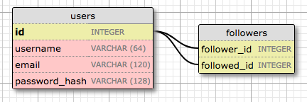
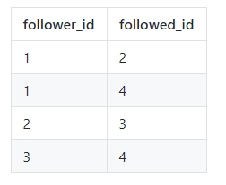
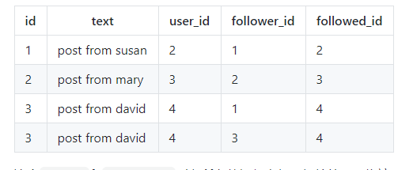

# flask
- [安装](#1)
- [模板](#2)
- [Web表单](#3)
- [数据库](#4)
- [用户登录个人主页和头像](#5)
- [粉丝、分页、邮件](#6)
- [Ajax](#7)
- [docker](#8)
- [应用程序编程接口（API）](#9)


参考链接：   
https://github.com/luhuisicnu/The-Flask-Mega-Tutorial-zh   

## <a id="1">安装</a>
```python
安装   
pip install flask     
用import语句来导入它：
import flask   

在Python中，包含__init__.py文件的子目录被视为一个可导入的包。 当你导入一个包时，__init__.py会执行并定义这个包暴露给外界的属性。
创建一个名为app的包来存放整个应用吧。记得切换到microblog目录下，并执行如下命令：
(venv) $ mkdir app

在其下创建文件__init__.py，输入如下的代码：
from flask import Flask
app = Flask(__name__)
from app import routes
上面的脚本仅仅是从flask中导入的类Flask，并以此类创建了一个应用程序对象。
传递给Flask类的__name__变量是一个Python预定义的变量，它表示当前调用它的模块的名字。
当需要加载相关的资源，如我将在第二章讲到的模板文件，Flask就使用这个位置作为起点来计算绝对路径。
代码的最后，应用程序导入尚未存在的routes模块。

其一，这里有两个实体名为app。 app包由app目录和__init__.py脚本来定义构成，并在from app import routes语句中被引用。 app变量被定义为__init__.py脚本中的Flask类的一个实例，以至于它成为app包的属性。

其二，routes模块是在底部导入的，而不是在脚本的顶部。 最下面的导入是解决循环导入的问题，这是Flask应用程序的常见问题。 你将会看到routes模块需要导入在这个脚本中定义的app变量，因此将routes的导入放在底部可以避免由于这两个文件之间的相互引用而导致的错误。

下面的项目结构图：
microblog/
  venv/
  app/
    __init__.py
    routes.py
  microblog.py

microblog.py的Python脚本。 它仅拥有一个导入应用程序实例的行：
from app import app
Flask应用程序实例被称为app，是app包的成员。from app import app语句从app包导入其成员app变量。 如果你觉得这很混乱，你可以重命名包或者变量。

app/routes.py中的第一个视图函数的代码：
from app import app
@app.route('/')
@app.route('/index')
def index():
    return "Hello, World!"

函数上面的两个奇怪的＠app.route行是装饰器，这是Python语言的一个独特功能。 装饰器会修改跟在其后的函数。 
装饰器的常见模式是使用它们将函数注册为某些事件的回调函数。 在这种情况下，＠app.route修饰器在作为参数给出的URL和函数之间创建一个关联。 在这个例子中，有两个装饰器，它们将URL /和/index索引关联到这个函数。 
这意味着，当Web浏览器请求这两个URL中的任何一个时，Flask将调用该函数并将其返回值作为响应传递回浏览器。这样做是为了在运行这个应用程序的时候会稍微有一点点意义。

在运行之前，需要通过设置FLASK_APP环境变量告诉Flask如何导入它：
(venv) $ export FLASK_APP=microblog.py
使用Microsoft Windows操作系统，在上面的命令中使用set替换export

运行如下命令来运行你的第一个Web应用吧：
(venv) $ flask run
 * Serving Flask app "microblog"
 * Running on http://127.0.0.1:5000/ (Press CTRL+C to quit)

在终端会话中直接设置的环境变量不会永久生效，因此你不得不在每次新开终端时设定 FLASK_APP 环境变量，从 1.0 版本开始，Flask 允许你设置只会在运行flask命令时自动注册生效的环境变量，要实现这点，你需要安装 python-dotenv：
(venv) $ pip install python-dotenv
此时，在项目的根目录下新建一个名为 .flaskenv 的文件，其内容是：
FLASK_APP=microblog.py
通过此项设置，FLASK_APP就可以自动加载了，如果你钟爱手动设定环境变量，那也不错，只是记得每次启动终端后要设定它。

我已将依赖包的列表保存到requirements.txt文件中：
$ python3 -m venv venv
$ source venv/bin/activate
(venv) $ pip install -r requirements.txt
```

## <a id="2">模板</a>
```python
from flask import render_template
from app import app

@app.route('/')
@app.route('/index')
def index():
    user = {'username': 'Miguel'}
    return render_template('index.html', title='Home', user=user)

render_template()函数调用Flask框架原生依赖的Jinja2模板引擎。 Jinja2用render_template()函数传入的参数中的相应值替换{{...}}块。
```

### 条件语句     
```python
模板也支持在{%...％}块内使用控制语句。 index.html模板的下一个版本添加了一个条件语句：
<html>
    <head>
        
        <title>{{ title }} - Microblog</title>
        
        <title>Welcome to Microblog!</title>
        
    </head>
    <body>
        <h1>Hello, {{ user.username }}!</h1>
    </body>
</html>
现在，模板变得聪明点儿了，如果视图函数忘记给渲染函数传入一个名为title的关键字参数，那么模板将显示一个默认的标题，而不是显示一个空的标题。 你可以通过在视图函数的render_template()调用中去除title参数来试试这个条件语句是如何生效的。
```

### 循环
```python
from flask import render_template
from app import app
@app.route('/')
@app.route('/index')
def index():
    user = {'username': 'Miguel'}
    posts = [
        {
            'author': {'username': 'John'},
            'body': 'Beautiful day in Portland!'
        },
        {
            'author': {'username': 'Susan'},
            'body': 'The Avengers movie was so cool!'
        }
    ]
    return render_template('index.html', title='Home', user=user, posts=posts)

<html>
    <head>
        
        <title>{{ title }} - Microblog</title>
        
        <title>Welcome to Microblog</title>
        
    </head>
    <body>
        <h1>Hi, {{ user.username }}!</h1>
        
        <div><p>{{ post.author.username }} says: <b>{{ post.body }}</b></p></div>
        
    </body>
</html>
```

### 模板的继承
```python
<html>
    <head>
      
      <title>{{ title }} - Microblog</title>
      
      <title>Welcome to Microblog</title>
      
    </head>
    <body>
        <div>Microblog: <a href="/index">Home</a></div>
        <hr>
        
    </body>
</html>

在这个模板中，我使用block控制语句来定义派生模板可以插入代码的位置。 block被赋予一个唯一的名称，派生的模板可以在提供其内容时进行引用。
通过从基础模板base.html继承HTML元素，我现在可以简化模板index.html了：



    <h1>Hi, {{ user.username }}!</h1>
    
    <div><p>{{ post.author.username }} says: <b>{{ post.body }}</b></p></div>
    

extends语句用来建立了两个模板之间的继承关系，这样Jinja2才知道当要求呈现index.html时，需要将其嵌入到base.html中。 而两个模板中匹配的block语句和其名称content，让Jinja2知道如何将这两个模板合并成在一起。
```

## <a id="3">Web表单</a>
Web表单是所有Web应用程序中最基本的组成部分之一。 我将使用表单来为用户发表动态和登录认证提供途径。使用Flask-WTF插件来处理本应用中的Web表单，它对WTForms进行了浅层次的封装以便和Flask完美结合。    
(venv) $ pip install flask-wtf    

### 配置
有几种途径来为应用指定配置选项。最基本的解决方案是使用app.config对象，它是一个类似字典的对象，可以将配置以键值的方式存储其中。例如，你可以这样做：  
```python
app = Flask(__name__)
app.config['SECRET_KEY'] = 'you-will-never-guess'
# ... add more variables here as needed
```

### 用户登录表单
Flask-WTF插件使用Python类来表示Web表单。表单类只需将表单的字段定义为类属性即可。   
定义用户登录表单来做一个开始吧，它会要求用户输入username和password，并提供一个“remember me”的复选框和提交按钮：
```python
from flask_wtf import FlaskForm
from wtforms import StringField, PasswordField, BooleanField, SubmitField
from wtforms.validators import DataRequired
class LoginForm(FlaskForm):
    username = StringField('Username', validators=[DataRequired()])
    password = PasswordField('Password', validators=[DataRequired()])
    remember_me = BooleanField('Remember Me')
    submit = SubmitField('Sign In')

大多数Flask插件使用flask_ <name>命名约定来导入

把登录模板存储在文件*app/templates/login.html *中，代码如下：


    <h1>Sign In</h1>
    <form action="" method="post" novalidate>
        {{ form.hidden_tag() }}
        <p>
            {{ form.username.label }}<br>
            {{ form.username(size=32) }}
        </p>
        <p>
            {{ form.password.label }}<br>
            {{ form.password(size=32) }}
        </p>
        <p>{{ form.remember_me() }} {{ form.remember_me.label }}</p>
        <p>{{ form.submit() }}</p>
    </form>

HTML<form>元素被用作Web表单的容器。 表单的action属性告诉浏览器在提交用户在表单中输入的信息时应该请求的URL。 当action设置为空字符串时，表单将被提交给当前地址栏中的URL，即当前页面。 method属性指定了将表单提交给服务器时应该使用的HTTP请求方法。 默认情况下是用GET请求发送，但几乎在所有情况下，使用POST请求会提供更好的用户体验，因为这种类型的请求可以在请求的主体中提交表单数据， GET请求将表单字段添加到URL，会使浏览器地址栏变得混乱。

视图函数也存储到app/routes.py模块中，代码如下：
from flask import render_template
from app import app
from app.forms import LoginForm
# ...
@app.route('/login')
def login():
    form = LoginForm()
    return render_template('login.html', title='Sign In', form=form)
从forms.py导入LoginForm类，并生成了一个实例传入模板。form=form的语法看起来奇怪，这是Python函数或方法传入关键字参数的方式，左边的form代表在模板中引用的变量名称，右边则是传入的form实例。这就是获取表单字段渲染结果的所有代码了。

可能遇到urtlib2 python版本问题，在使用urllib2的地方改成urllib.request即可。或者修改validators.py库

接受和验证用户提交的数据：
from flask import render_template, flash, redirect

@app.route('/login', methods=['GET', 'POST'])
def login():
    form = LoginForm()
    if form.validate_on_submit():
        flash('Login requested for user {}, remember_me={}'.format(
            form.username.data, form.remember_me.data))
        return redirect('/index')
    return render_template('login.html', title='Sign In', form=form)

这个版本中的第一个新东西是路由装饰器中的methods参数。 它告诉Flask这个视图函数接受GET和POST请求，并覆盖了默认的GET。 HTTP协议规定对GET请求需要返回信息给客户端（本例中是浏览器）。 本应用的所有GET请求都是如此。 当浏览器向服务器提交表单数据时，通常会使用POST请求（实际上用GET请求也可以，但这不是推荐的做法）。之前的“Method Not Allowed”错误正是由于视图函数还未配置允许POST请求。 通过传入methods参数，你就能告诉Flask哪些请求方法可以被接受。

form.validate_on_submit()实例方法会执行form校验的工作。当浏览器发起GET请求的时候，它返回False，这样视图函数就会跳过if块中的代码，直接转到视图函数的最后一句来渲染模板。

当用户在浏览器点击提交按钮后，浏览器会发送POST请求。form.validate_on_submit()就会获取到所有的数据，运行字段各自的验证器，全部通过之后就会返回True，这表示数据有效。不过，一旦有任意一个字段未通过验证，这个实例方法就会返回False，引发类似GET请求那样的表单的渲染并返回给用户。稍后我会在添加代码以实现在验证失败的时候显示一条错误消息。

当form.validate_on_submit()返回True时，登录视图函数调用从Flask导入的两个新函数。 flash()函数是向用户显示消息的有效途径。 许多应用使用这个技术来让用户知道某个动作是否成功。我将使用这种机制作为临时解决方案，因为我没有基础架构来真正地登录用户。 显示一条消息来确认应用已经收到登录认证凭据，我认为对当前来说已经足够了。

登录视图函数中使用的第二个新函数是redirect()。这个函数指引浏览器自动重定向到它的参数所关联的URL。当前视图函数使用它将用户重定向到应用的主页。

当你调用flash()函数后，Flask会存储这个消息，但是却不会奇迹般地直接出现在页面上。模板需要将消息渲染到基础模板中，才能让所有派生出来的模板都能显示出来。更新后的基础模板代码如下：
<html>
    <head>
        
        <title>{{ title }} - microblog</title>
        
        <title>microblog</title>
        
    </head>
    <body>
        <div>
            Microblog:
            <a href="/index">Home</a>
            <a href="/login">Login</a>
        </div>
        <hr>
        
        
        <ul>
            
            <li>{{ message }}</li>
            
        </ul>
        
        
        
    </body>
</html>
此处我用了with结构在当前模板的上下文中来将get_flashed_messages()的结果赋值给变量messages。get_flashed_messages()是Flask中的一个函数，它返回用flash()注册过的消息列表。接下来的条件结构用来检查变量messages是否包含元素，如果有，则在<ul>元素中，为每条消息用<li>元素来包裹渲染。这种渲染的样式结果看起来不会美观，之后会有主题讲到Web应用的样式。

闪现消息的一个有趣的属性是，一旦通过get_flashed_messages函数请求了一次，它们就会从消息列表中移除，所以在调用flash()函数后它们只会出现一次。

时机成熟，再次测试表单吧，将username和password字段留空并点击提交按钮来观察DataRequired验证器是如何中断提交处理流程的。

这是给username和password字段添加了验证描述性错误消息渲染逻辑之后的登录模板：




    <h1>Sign In</h1>
    <form action="" method="post" novalidate>
        {{ form.hidden_tag() }}
        <p>
            {{ form.username.label }}<br>
            {{ form.username(size=32) }}<br>
            
            <span style="color: red;">[{{ error }}]</span>
            
        </p>
        <p>
            {{ form.password.label }}<br>
            {{ form.password(size=32) }}<br>
            
            <span style="color: red;">[{{ error }}]</span>
            
        </p>
        <p>{{ form.remember_me() }} {{ form.remember_me.label }}</p>
        <p>{{ form.submit() }}</p>
    </form>

我做的唯一的改变是，在username和password字段之后添加for循环以便用红色字体来渲染验证器添加的错误信息。通常情况下，拥有验证器的字段都会用form.<field_name>.errors来渲染错误信息。 一个字段的验证错误信息结果是一个列表，因为字段可以附加多个验证器，并且多个验证器都可能会提供错误消息以显示给用户。

如果你尝试在未填写username和password字段的情况下提交表单，就可以看到显眼的红色错误信息了。

为了更好地管理这些链接，Flask提供了一个名为url_for()的函数，它使用URL到视图函数的内部映射关系来生成URL。 例如，url_for('login')返回/login，url_for('index')返回/index。 url_for()的参数是endpoint名称，也就是视图函数的名字。

你可能会问，为什么使用函数名称而不是URL？ 事实是，URL比起视图函数名称变更的可能性更高。 稍后你会了解到的第二个原因是，一些URL中包含动态组件，手动生成这些URL需要连接多个元素，枯燥乏味且容易出错。 url_for()生成这种复杂的URL就方便许多。
```

## <a id="4">数据库</a>
```python
第一个是Flask-SQLAlchemy,第二个插件是Flask-Migrate
命令来安装Flask-SQLAlchemy插件：
(venv) $ pip install flask-sqlalchemy
pip install flask-migrate
```

### Flask-SQLAlchemy配置
```python
给配置文件添加两个新的配置项：
import os
basedir = os.path.abspath(os.path.dirname(__file__))

class Config(object):
    # ...
    SQLALCHEMY_DATABASE_URI = os.environ.get('DATABASE_URL') or \
        'sqlite:///' + os.path.join(basedir, 'app.db')
    SQLALCHEMY_TRACK_MODIFICATIONS = False
Flask-SQLAlchemy插件从SQLALCHEMY_DATABASE_URI配置变量中获取应用的数据库的位置。
SQLALCHEMY_TRACK_MODIFICATIONS配置项用于设置数据发生变更之后是否发送信号给应用，我不需要这项功能，因此将其设置为False。

在应用实例化之后进行实例化和注册操作。app/__init__.py文件变更如下：
from flask import Flask
from config import Config
from flask_sqlalchemy import SQLAlchemy
from flask_migrate import Migrate
app = Flask(__name__)
app.config.from_object(Config)
db = SQLAlchemy(app)
migrate = Migrate(app, db)
from app import routes, models

存储到新建的模块app/models.py中，代码如下：
from app import db
class User(db.Model):
    id = db.Column(db.Integer, primary_key=True)
    username = db.Column(db.String(64), index=True, unique=True)
    email = db.Column(db.String(120), index=True, unique=True)
    password_hash = db.Column(db.String(128))
    def __repr__(self):
        return '<User {}>'.format(self.username)    

Flask-Migrate添加了flask db子命令来管理与数据库迁移相关的所有事情。 那么让我们通过运行flask db init来创建microblog的迁移存储库：
(venv) $ flask db init

flask db migrate子命令生成这些自动迁移：
flask db migrate -m "users table"
有两个函数叫upgrade()和downgrade()。 upgrade()函数应用迁移，downgrade()函数回滚迁移
```

## <a id="5">用户登录个人主页和头像</a>
```python
from werkzeug.security import generate_password_hash, check_password_hash
class User(db.Model):
    # ...

    def set_password(self, password):
        self.password_hash = generate_password_hash(password)

    def check_password(self, password):
        return check_password_hash(self.password_hash, password)

以下是这些新方法的示例用法：
>>> u = User(username='susan', email='susan@example.com')
>>> u.set_password('mypassword')
>>> u.check_password('anotherpassword')
False
>>> u.check_password('mypassword')
True

Flask-Login。 该插件管理用户登录状态，以便用户可以登录到应用，然后用户在导航到该应用的其他页面时，应用会“记得”该用户已经登录。它还提供了“记住我”的功能，允许用户在关闭浏览器窗口后再次访问应用时保持登录状态。

Flask-Login需要在app/__init__py中的应用实例之后被创建和初始化。 该插件初始化代码如下：
from flask_login import LoginManager
app = Flask(__name__)
login = LoginManager(app)

1.is_authenticated: 一个用来表示用户是否通过登录认证的属性，用True和False表示。
2.is_active: 如果用户账户是活跃的，那么这个属性是True，否则就是False（译者注：活跃用户的定义是该用户的登录状态是否通过用户名密码登录，通过“记住我”功能保持登录状态的用户是非活跃的）。
3.is_anonymous: 常规用户的该属性是False，对特定的匿名用户是True。
4.get_id(): 返回用户的唯一id的方法，返回值类型是字符串(Python 2下返回unicode字符串).
```
### 个人主页
```python
作为创建个人主页的第一步，让我们为其URL /user/ 新建一个对应的视图函数。
@app.route('/user/<username>')
@login_required
def user(username):
    user = User.query.filter_by(username=username).first_or_404()
    posts = [
        {'author': user, 'body': 'Test post #1'},
        {'author': user, 'body': 'Test post #2'}
    ]
    return render_template('user.html', user=user, posts=posts)

装饰该视图函数的@app.route装饰器看起来和之前的有点不一样。 本例中被<和>包裹的URL <username>是动态的。 当一个路由包含动态组件时，Flask将接受该部分URL中的任何文本，并将以实际文本作为参数调用该视图函数。 例如，如果客户端浏览器请求URL /user/susan，则视图函数将被调用，其参数username被设置为'susan'。 因为这个视图函数只能被已登录的用户访问，所以我添加了@login_required装饰器。
会尝试在数据库中以用户名来查询和加载用户。 之前你见过通过调用all()来得到所有的结果的查询，或是调用first()来得到结果中的第一个或者结果集为空时返回None的查询。 在本视图函数中，我使用了first()的变种方法，名为first_or_404()，当有结果时它的工作方式与first()完全相同，但是在没有结果的情况下会自动发送404 error给客户端。 以这种方式执行查询，我省去检查用户是否返回的步骤，因为当用户名不存在于数据库中时，函数将不会返回，而是会引发404异常。

user.html模板如下所示：


    <h1>User: {{ user.username }}</h1>
    <hr>
    
    <p>
    {{ post.author.username }} says: <b>{{ post.body }}</b>
    </p>
    


将会在顶部的导航栏中添加这个入口链接，以便用户可以轻松查看自己的个人资料：
    <div>
      Microblog:
      <a href="{{ url_for('index') }}">Home</a>
      
      <a href="{{ url_for('login') }}">Login</a>
      
      <a href="{{ url_for('user', username=current_user.username) }}">Profile</a>
      <a href="{{ url_for('logout') }}">Logout</a>
      
    </div>
```
### 头像
```python
使用Gravatar为所有用户提供图片服务
from hashlib import md5
>>> 'https://www.gravatar.com/avatar/' + md5(b'john@example.com').hexdigest()
'https://www.gravatar.com/avatar/d4c74594d841139328695756648b6bd6'
如果你想看一个实际的例子，我自己的Gravatar URL是 https://www.gravatar.com/avatar/729e26a2a2c7ff24a71958d4aa4e5f35

可以通过向URL的查询字符串添加s参数来请求不同大小的图片。 例如，要获得我自己128x128像素的头像，该URL是 https://www.gravatar.com/avatar/729e26a2a2c7ff24a71958d4aa4e5f35?s=128

另一个可传递给Gravatar的有趣参数是d，它让Gravatar为没有向服务注册头像的用户提供的随机头像。 我最喜欢的随机头像类型是“identicon”

由于头像与用户相关联，所以将生成头像URL的逻辑添加到用户模型是有道理的。

from hashlib import md5
class User(UserMixin, db.Model):
    def avatar(self, size):
        digest = md5(self.email.lower().encode('utf-8')).hexdigest()
        return 'https://www.gravatar.com/avatar/{}?d=identicon&s={}'.format(
            digest, size)

将头像图片插入到个人主页的模板中：


    <table>
        <tr valign="top">
            <td></td>
            <td><h1>User: {{ user.username }}</h1></td>
        </tr>
    </table>
    <hr>
    
    <p>
    {{ post.author.username }} says: <b>{{ post.body }}</b>
    </p>
    

```

## <a id="6">粉丝、分页、邮件</a>
followers表是关系的关联表。 此表中的外键都指向用户表中的数据行，因为它将用户关联到用户。 该表中的每个记录代表关注者和被关注者的一个关系。



假设followers关系表中数据表达的是用户john关注用户susan和 david，用户susan关注用户mary，用户mary关注用户david。这些的数据如下表所示：



执行join操作的结果如下：



```python
@app.route('/', methods=['GET', 'POST'])
@app.route('/index', methods=['GET', 'POST'])
@login_required
def index():
    # ...
    page = request.args.get('page', 1, type=int)
    posts = current_user.followed_posts().paginate(
        page, app.config['POSTS_PER_PAGE'], False)
    return render_template('index.html', title='Home', form=form,
                           posts=posts.items)

@app.route('/explore')
@login_required
def explore():
    page = request.args.get('page', 1, type=int)
    posts = Post.query.order_by(Post.timestamp.desc()).paginate(
        page, app.config['POSTS_PER_PAGE'], False)
    return render_template("index.html", title='Explore', posts=posts.items)

page = request.args.get('page', 1, type=int)获取后面参数，http://localhost:5000/index?page=3
```

### 邮件
```python
Flask有一个名为Flask-Mail的流行插件，可以使任务变得非常简单。 和往常一样，该插件是用pip安装的：
(venv) $ pip install flask-mail
密码重置链接将包含有一个安全令牌。 为了生成这些令牌，我将使用JSON Web Tokens，它也有一个流行的Python包：
(venv) $ pip install pyjwt

想使用一个模拟的电子邮件服务器，Python提供了一个非常好用的方法，你可以使用下面的命令在第二个终端中启动它：
(venv) $ python -m smtpd -n -c DebuggingServer localhost:8025

要配置此服务器，需要设置两个环境变量：
(venv) $ export MAIL_SERVER=localhost
(venv) $ export MAIL_PORT=8025
如果你希望真实地发送电子邮件，则需要使用真实的电子邮件服务器。 那么你只需要为它设置MAIL_SERVER、MAIL_PORT、MAIL_USE_TLS、MAIL_USERNAME和MAIL_PASSWORD环境变量。 如果你想要快速解决方案，可以使用Gmail帐户发送电子邮件，并使用以下设置：
(venv) $ export MAIL_SERVER=smtp.googlemail.com
(venv) $ export MAIL_PORT=587
(venv) $ export MAIL_USE_TLS=1
(venv) $ export MAIL_USERNAME=<your-gmail-username>
(venv) $ export MAIL_PASSWORD=<your-gmail-password>
如果你使用的是Microsoft Windows，则需要在上面的每个export语句中将export替换为set。

datetime.now()调用返回我所处位置的本地时间，而datetime.utcnow()调用则返回UTC时区中的时间。Moment.js是一个小型的JavaScript开源库，它将日期和时间转换成目前可以想象到的所有格式。
```

## <a id="7">Ajax</a>
异步（Ajax）请求类似于我在应用中创建的路由和视图函数，唯一的区别是它不返回HTML或重定向，而是返回数据，格式为XML或更常见的JSON。

### 来自服务器的Ajax
```python
from flask import jsonify
from app.translate import translate

@app.route('/translate', methods=['POST'])
@login_required
def translate_text():
    return jsonify({'text': translate(request.form['text'],
                                      request.form['source_language'],
                                      request.form['dest_language'])})
在这个函数中做的是调用上一节中的translate()函数，直接从通过请求提交的数据中传递三个参数。 将结果合并到单个键text下的字典中，字典作为参数传递给Flask的jsonify()函数，该函数将字典转换为JSON格式的有效载荷。 jsonify()返回的值是将被发送回客户端的HTTP响应。
例如，如果客户希望将字符串“Hello，World！”翻译成西班牙语，则来自该请求的响应将具有以下有效载荷：
{ "text": "Hola, Mundo!" }
```

### 来自客户端的Ajax
```python
在浏览器中运行的JavaScript代码如何获取需要发送到服务器中运行的翻译函数的三个参数。 为了获得文本，我需要找到包含用户动态正文的DOM内的节点并获取它的内容。 为了便于识别包含用户动态的DOM节点，我将为它们附加一个唯一的ID。 如果你查看*_post.html*模板，则呈现用户动态正文的行只会读取{{post.body}}。 我要做的是将这些内容包装在一个<span>元素中。 这不会在视觉上改变任何东西，但它给了我一个可以插入标识符的地方：
app/templates/_post.html：给每条用户动态添加ID。
<span id="post{{ post.id }}">{{ post.body }}</span>


    ...
    <script>
        function translate(sourceElem, destElem, sourceLang, destLang) {
            $(destElem).html('');
            $.post('/translate', {
                text: $(sourceElem).text(),
                source_language: sourceLang,
                dest_language: destLang
            }).done(function(response) {
                $(destElem).text(response['text'])
            }).fail(function() {
                $(destElem).text("{{ _('Error: Could not contact server.') }}");
            });
        }
    </script>

```

## <a id="8">docker</a>
这是Microblog的一份基础的Dockerfile：  
```python
FROM python:3.6-alpine

RUN adduser -D microblog

WORKDIR /home/microblog

COPY requirements.txt requirements.txt
RUN python -m venv venv
RUN venv/bin/pip install -r requirements.txt
RUN venv/bin/pip install gunicorn

COPY app app
COPY migrations migrations
COPY microblog.py config.py boot.sh ./
RUN chmod +x boot.sh

ENV FLASK_APP microblog.py

RUN chown -R microblog:microblog ./
USER microblog

EXPOSE 5000
ENTRYPOINT ["./boot.sh"]


Dockerfile中的每一行都是一条命令。 FROM命令指定将在其上构建新镜像的基础容器镜像。 这样一来，你从一个现有的镜像开始，添加或改变一些东西，并最终得到一个派生的镜像。 镜像由名称和标签来标记，它们之间用冒号分隔。 该标签用作版本控制机制，允许容器镜像提供多个版本。 我选择的镜像的名称是python，它是Python的官方Docker镜像。 该镜像的标签允许你指定解释器版本和基础操作系统。 3.6-alpine标签选择安装在Alpine Linux上的Python 3.6解释器。 由于其体积小，Alpine Linux发行版比起更常见的发行版（例如Ubuntu）会更多地被使用。 你可以在Python镜像库中查看Python镜像可用的标签。

RUN命令在容器的上下文中执行任意命令。 这与你在shell提示符下输入命令相似。 adduser -D microblog命令创建一个名为microblog的新用户。 大多数容器镜像都使用root作为默认用户，但以root身份运行应用程序并不是一个好习惯，所以我创建了自己的用户。

WORKDIR命令设置将要安装应用程序的默认目录。 当我在上面创建microblog用户时，会自动创建了一个主目录，所以现在我将该目录设置为默认目录。 在Dockerfile中的任何剩余命令执行以及运行容器时，其当前目录为这个默认目录。

COPY命令将文件从你的机器复制到容器文件系统。 该命令需要两个或更多参数，源文件/目录和目标文件/目录。 源文件必须与Dockerfile所在的目录相关。 目的地可以是绝对路径，也可以是相对于在之前的WORKDIR命令中设置的目录的路径。 在这第一个COPY命令中，我将requirements.txt文件复制到容器文件系统的microblog用户的主目录中。

容器中有了requirements.txt文件，我就可以使用RUN命令创建一个虚拟环境。 首先我创建它，然后在其中安装所有依赖。 由于依赖文件仅包含通用依赖项，因此我明确安装gunicorn，以将其用作Web服务器。 当然，我也可以在我的requirements.txt文件中添加gunicorn。

接下来的三个COPY命令从顶级目录中复制app包，含有数据库迁移的migrations目录以及中的microblog.py和config.py脚本。 我还复制了一个新文件，boot.sh，我将在下面讨论它。

RUN chmod命令确保将这个新的boot.sh文件正确设置为可执行文件。 如果你使用的是基于Unix的文件系统，并且你的源文件已被标记为可执行文件，则复制的文件将会已是可执行的。 我显式地对其进行授权，是因为在Windows上很难设置可执行位。 如果你正在使用Mac OS X或Linux，你可能不需要这个步骤，但有了它也不会有什么问题。

ENV命令在容器中设置环境变量。我需要设置FLASK_APP，它是flask命令所依赖的。

下面的RUN chown命令将存储在 /home/microblog 中的所有目录和文件的所有者设置为新的microblog用户。 尽管我在Dockerfile的顶部附近创建了该用户，但所有命令的默认用户仍为root，因此所有这些文件的属主都需要切换到microblog用户，以便在容器启动时该用户可以正确运行这些文件。

下一行中的USER命令使得这个新的microblog用户成为任何后续指令的默认用户，并且也是容器启动时的默认用户。

EXPOSE命令配置该容器将用于服务的端口。 这是必要的，以便Docker可以适当地在容器中配置网络。 我选择了标准的Flask端口5000，但这其实可以是任意端口。

最后，ENTRYPOINT命令定义了容器启动时应该执行的默认命令。 这是启动应用程序Web服务器的命令。 为了保持良好的代码组织逻辑，我决定为此创建一个单独的脚本，正是我之前复制到容器的boot.sh文件。 这里是这个脚本的内容：

boot.sh：Docker容器启动脚本。

#!/bin/sh
source venv/bin/activate
flask db upgrade
flask translate compile
exec gunicorn -b :5000 --access-logfile - --error-logfile - microblog:app
```

## <a id="9">应用程序编程接口（API）</a>
```python
blueprint的__init__.py文件中创建blueprint对象，这与应用程序中的其他blueprint类似：
app/api/__init__.py: API blueprint 构造器。

from flask import Blueprint
bp = Blueprint('api', __name__)
from app.api import users, errors, tokens

from app.api import bp
@bp.route('/users/<int:id>', methods=['GET'])
def get_user(id):
    pass

@bp.route('/users', methods=['GET'])
def get_users():
    pass

@bp.route('/users/<int:id>/followers', methods=['GET'])
def get_followers(id):
    pass

@bp.route('/users/<int:id>/followed', methods=['GET'])
def get_followed(id):
    pass

@bp.route('/users', methods=['POST'])
def create_user():
    pass

@bp.route('/users/<int:id>', methods=['PUT'])
def update_user(id):
    pass

app/__init__.py：应用中注册API blueprint。
# ...
def create_app(config_class=Config):
    app = Flask(__name__)
    # ...
    from app.api import bp as api_bp
    app.register_blueprint(api_bp, url_prefix='/api')

    # ...

举例：
http GET http://localhost:5000/api/users/1
HTTP/1.0 200 OK
Content-Length: 457
Content-Type: application/json
Date: Mon, 27 Nov 2017 20:19:01 GMT
Server: Werkzeug/0.12.2 Python/3.6.3
{
    "_links": {
        "avatar": "https://www.gravatar.com/avatar/993c...2724?d=identicon&s=128",
        "followed": "/api/users/1/followed",
        "followers": "/api/users/1/followers",
        "self": "/api/users/1"
    },
    "about_me": "Hello! I'm the author of the Flask Mega-Tutorial.",
    "followed_count": 0,
    "follower_count": 1,
    "id": 1,
    "last_seen": "2017-11-26T07:40:52.942865Z",
    "post_count": 10,
    "username": "miguel"
}

@bp.route('/users', methods=['GET'])
def get_users():
    page = request.args.get('page', 1, type=int)
    per_page = min(request.args.get('per_page', 10, type=int), 100)
    data = User.to_collection_dict(User.query, page, per_page, 'api.get_users')
    return jsonify(data)
@bp.route('/users/<int:id>/followers', methods=['GET'])

def get_followers(id):
    user = User.query.get_or_404(id)
    page = request.args.get('page', 1, type=int)
    per_page = min(request.args.get('per_page', 10, type=int), 100)
    data = User.to_collection_dict(user.followers, page, per_page,
                                   'api.get_followers', id=id)
    return jsonify(data)

@bp.route('/users/<int:id>/followed', methods=['GET'])
def get_followed(id):
    user = User.query.get_or_404(id)
    page = request.args.get('page', 1, type=int)
    per_page = min(request.args.get('per_page', 10, type=int), 100)
    data = User.to_collection_dict(user.followed, page, per_page,
                                   'api.get_followed', id=id)
    return jsonify(data)

@bp.route('/users', methods=['POST'])
def create_user():
    data = request.get_json() or {}
    if 'username' not in data or 'email' not in data or 'password' not in data:
        return bad_request('must include username, email and password fields')
    if User.query.filter_by(username=data['username']).first():
        return bad_request('please use a different username')
    if User.query.filter_by(email=data['email']).first():
        return bad_request('please use a different email address')
    user = User()
    user.from_dict(data, new_user=True)
    db.session.add(user)
    db.session.commit()
    response = jsonify(user.to_dict())
    response.status_code = 201
    response.headers['Location'] = url_for('api.get_user', id=user.id)
    return response
```

## links
  * [目录](<目录.md>)