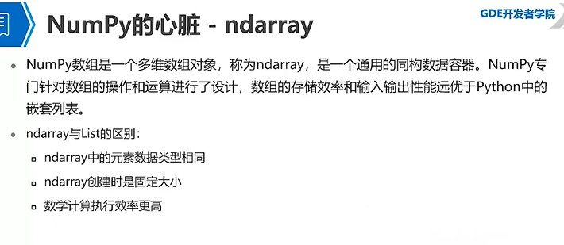
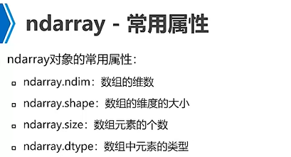

# python
- [快速入门](#1)
- [数据分析库](#2)
- [实用的Python库](#3)


## <a id="1">快速入门</a>
参考链接：  
https://www.liaoxuefeng.com/wiki/1016959663602400  

### 基础
- 打印  
打印：print("hello world") 既可以用“”也可以用‘ 。  
print('The quick brown fox', 'jumps over', 'the lazy dog')  遇到逗号“,”会输出一个空格 。  

- 输入  
func_num = input()；
print(func_num)；  
这是因为 input()返回的数据类型是 str，str 不能直接和整数比较，必须先把 str 转换成整数。Python 提供了 int()函数来完成这件事情：s = input('birth: ')；birth = int(s)；  

- #：注释  
其他每一行都是一个语句，当语句以冒号:结尾时，缩进的语句视为代码块。  
请务必注意，Python 程序是大小写敏感的，如果写错了大小写。  
Python使用缩进组织代码块，请务必遵守约定俗成的习惯，坚持使用4个空格的缩进。  

- 数据类型  
整数，浮点型  
字符串：\转义‘。\n\t等。以\\表示的字符就是\。允许用 r''\\\\“表示''内部的字符串默认不转义。用'''...'''的格式表示多行内容。  
布尔型  
空值：不代表是0  
变量：//，称为地板除，两个整数的除法仍然是整数：  
格式化： '%2d-%02d' % (3, 1)    ' 3-01'  

- 编码  
中国制定了 GB2312 编码，用来把中文编进去。Unicode 标准也在不断发展，但最常用的是用两个字节表示一个字符（如果要用到非常偏僻的字符，就需要 4 个字节）。本着节约的精神，又出现了把 Unicode 编码转化为“可变长编码”的 UTF-8 编码。ASCII编码实际上可以被看成是UTF-8编码的一部分，所以，大量只支持ASCII编码的历史遗留软件可以在 UTF-8 编码下继续工作。  


提供了 ord()函数获取字符的整数表示，chr()函数把编码转换为对应的字符：  
以 Unicode 表示的 str 通过 encode()方法可以编码为指定的 bytes， '中文'.encode('utf-8')    
str 包含多少个字符，可以用 len()函数    
#!/usr/bin/env python3# -*- coding: utf-8 -*-  

- if  
根据 Python 的缩进规则，如果 if 语句判断是 True，就把缩进的两行 print语句执行了，否则，什么也不做。也可以给 if 添加一个 else 语句，意思是，如果 if 判断是 False，不要执行 if 的内容，去把 else 执行了。注意不要少写了冒号:。  
```js
age = 3
if age >= 18:
	print('adult')
elif age >= 6:
	print('teenager')
else:
	print('kid')
```

- for  
Python 的循环有两种，一种是 for...in 循环，依次把 list 或 tuple 中的每个元素迭代出来，  
```js
names = ['Michael', 'Bob', 'Tracy']
for name in names:
	print(name)
```
所以 for x in ...循环就是把每个元素代入变量 x，然后执行缩进块的语句。  
Python提供一个 range()函数，可以生成一个整数序列，再通过 list()函数可以转换为 list。比如 range(5)生成的序列是从 0 开始小于 5 的整数：list(range(5))。
第二种循环是 while 循环，只要条件满足，就不断循环，条件不满足时退出循环。比如我们要计算 100 以内所有奇数之和，可以用 while 循环实现：
```js
sum = 0
n = 99
while n > 0:
 sum = sum + n
 n = n - 2
print(sum)
```

- 数据类型转换   
Int float str bool  
函数名其实就是指向一个函数对象的引用，完全可以把函数名赋给一个变量，相当于给这个函数起了一个“别名”： a = abs # 变量 a 指向 abs 函数 a(-1) # 所以也可以通过 a 调用 ab。  

- 切片   
取list tuple 一部分数据可用切片silce。  
L = ['Michael' 'Sarah' 'Trac' 'Bob' 'Jack']   L[0:3] ['Michael', 'Sarah', 'Tracy'] L[0:3]表示，从索引 0 开始取，直到索引 3 为止，但不包括索引 3。即索引 0，1，2，正好是 3 个元素。  
 (0, 1, 2, 3, 4, 5)[:3]   'ABCDEFG'[::2]  

- 生成器generator  
定义生成器一个方法，创建生成器很简单将列表生成式中【】改为（）。g = (x * x for x in range(10))   
print(next(g));打印值    
for n in g:   
... print(n)  
定义生成器另一个方法如果一个函数定义中包含 yield 关键字，那么这个函数就不再是一个普通函数，而是一个 generator：  
```js
def fib(max):
 n, a, b = 0, 0, 1
 while n < max:
 yield b
 a, b = b, a + b
 n = n + 1
 return 'done'
```
generator 和函数的执行流程不一样。函数是顺序执行，遇到 return 语句或者最后一行函数语句就返回。而变成generator 的函数，在每次调用 next()的时候执行，遇到 yield 语句返回，再次执行时从上次返回的 yield 语句处继续执行。要理解 generator 的工作原理，它是在 for 循环的过程中不断计算出下一个元素，并在适当的条件结束 for 循环。对于函数改成的 generator 来说，遇到 return 语句或者执行到函数体最后一行语句，就是结束 generator的指令，for 循环随之结束。   

- 迭代器
可以直接作用于 for 循环的数据类型有以下几种：  
一类是集合数据类型，如 list、tuple、dict、set、str 等  
一类是 generator，包括生成器和带 yield 的 generator function这些可以直接作用于 for 循环的对象统称为可迭代对象：Iterable。   
可以使用 isinstance()判断一个对象是否是 Iterable 对象：  
isinstance([], Iterable)  
可以被 next()函数调用并不断返回下一个值的对象称为迭代器：Iterator。  
可以使用 isinstance()判断一个对象是否是 Iterator 对象：  
isinstance([], Iterator)  
生成器都是 Iterator 对象，但 list、dict、str 虽然是 Iterable，却不是Iterator。  
把 list、dict、str 等 Iterable 变成 Iterator 可以使用 iter()函数： isinstance(iter([]), Iterator) 

- map reduce  
Map：ap()函数接收两个参数，一个是函数，一个是 Iterable，map 将传入的函数依次作用到序列的每个元素，并把结果作为新的Iterator 返回。  
```js
>>> def f(x):
... return x * x
...
>>> r = map(f, [1, 2, 3, 4, 5, 6, 7, 8, 9])
>>> list(r)
[1, 4, 9, 16, 25, 36, 49, 64, 81]
```

Reduce：reduce 把一个函数作用在一个序列[x1, x2, x3, ...]上，这个函数必须接收两个参数，reduce 把结果继续和序列的下一个元素做累积计算，其效果就是：  
reduce(f, [x1, x2, x3, x4]) = f(f(f(x1, x2), x3), x4)  可用以求和。  

- filter 过滤序列  
和 map()类似，filter()也接收一个函数和一个序列。和 map()不同的时，filter()把传入的函数依次作用于每个元素，然后根据返回值是 True 还是 False 决定保留还是丢弃该元素。  
Filter过滤素数。注意到 filter()函数返回的是一个 Iterator，也就是一个惰性序列，所以要强迫 filter()完成计算结果，需要用 list()函数获得所有结果并返回list。  

- sorted
Python 内置的 sorted()函数就可以对 list 进行排序：  
```js
>>> sorted([36, 5, -12, 9, -21])
[-21, -12, 5, 9, 36]
此外，sorted()函数也是一个高阶函数，它还可以接收一个 key 函数来实现自定义的排序，例如按绝对值大小排序：
>>> sorted([36, 5, -12, 9, -21], key=abs)
[5, 9, -12, -21, 36]
sorted(['bob', 'about', 'Zoo', 'Credit'], key=str.lower)
```


### 函数
- 函数默认参数  
如果没有return，函数执行完毕返回none。Retrun none可以简写为return。  
如果你已经把 my_abs()的函数定义保存为 abstest.py 文件了，那么，可以在该文件的当前目录下启动 Python 解释器，用 from abstest import my_abs 来导入 my_abs()函数，注意 abstest 是文件名（不含.py 扩展名）。  
数据类型检查可以用内置函数 isinstance()实现：  
if not isinstance(x, (int, float)):  
	raise TypeError('bad operand type')  

函数可以返回多个值x, y = move(100, 100, 60, math.pi / 6)  return nx, ny  r = move(100, 100, 60, math.pi / 6)这样也行。返回是一个tuple。在语法上，返回一个 tuple 可以省略括号，而多个变量可以同时接收一个 tuple，按位置赋给对应的值，所以，Python 的函数返回多值其实就是返回一个 tuple，但写起来更方便。  

def power(x, n=2):第二参数默认值2兼容。当函数有多个参数时，把变化大的参数放前面，变化小的参数放后面。默认参数必须指向不变对象！否在多次调用默认值会变，用list就会变。为什么要设计 str、None 这样的不变对象呢？因为不变对象一旦创建，对象内部的数据就不能修改，这样就减少了由于修改数据导致的错误。此外，由于对象不变，多任务环境下同时读取对象不需要加锁，同时读一点问题都没有。我们在编写程序时，如果可以设计一个不变对象，那就尽量设计成不变对象。  

注：由于 abs 函数实际上是定义在__builtin__模块中的，所以要让修改abs 变量的指向在其它模块也生效，要用__builtin__.abs = 10。
把函数作为参数传入，这样的函数称为高阶函数，函数式编程就是指这种高度抽象的编程范式。  

- 函数可变参数  
可变参数：输入参数个数不确定，可以用list tupledef calc(numbers):   calc([1, 2, 3])  

可以将函数参数变为可变从参数def calc(*numbers):定义可变参数和定义一个 list 或 tuple 参数相比，仅仅在参数前面加了一个*号。在函数内部，参数 numbers 接收到的是一个 tuple，因此，函数代码完全不变。但是，调用该函数时，可以传入任意个参数，包括 0 个参数： calc(1, 3, 5, 7)。如果要传入list或者tuple，这么调用calc(*nums)。*nums 表示把 nums 这个 list 的所有元素作为可变参数传进去。这种写法相当有用，而且很常见。  
关键字参数：关键字参数允许你传入 0 个或任意个含参数名的参数，这些关键字参数在函数内部自动组装为一个 dict。  
```js
>>> person('Bob', 35, city='Beijing')
name: Bob age: 35 other: {'city': 'Beijing'}
>>> person('Adam', 45, gender='M', job='Engineer')
name: Adam age: 45 other: {'gender': 'M', 'job': 'Engineer'}
关键字参数有什么用？它可以扩展函数的功能。比如，在 person 函数里，我们保证能接收到 name 和 age 这两个参数，但是，如果调用者愿意提供更多的参数，我们也能收到。试想你正在做一个用户注册的功能，除了用户名和年龄是必填项外，其他都是可选项，利用关键字参数来定义这个函数就能满足注册的需求。
>>> extra = {'city': 'Beijing', 'job': 'Engineer'
>>> person('Jack', 24, **extra)
name: Jack age: 24 other: {'city': 'Beijing', 'job': 'Engineer'}
```

- 命名关键字参数  
关键字参数可以通过if in检查。或者用如果要限制关键字参数的名字，就可以用命名关键字参数，例如，只接收 city 和 job 作为关键字参数。和关键字参数**kw 不同，命名关键字参数需要一个特殊分隔符*，*后面的参数被视为命名关键字参数。这种方式定义的函数如下：
def person(name, age, *, city, job):
 print(name, age, city, job)
命名关键字参数必须传入参数名，这和位置参数不同。如果没有传入参数名，调用将报错：
person('Jack', 24, city='Beijing', job='Engineer')
Jack 24 Beijing Engineer
def person(name, age, *, city='Beijing', job):这样定义即有默认值。
使用命名关键字参数时，要特别注意，*不是参数，而是特殊分隔符。
在 Python 中定义函数，可以用必选参数、默认参数、可变参数、关键字参数和命名关键字参数，这 5 种参数都可以组合使用，除了可变参数无法和命名关键字参数混合。但是请注意，参数定义的顺序必须是：必选参数、默认参数、可变参数/命名关键字参数和关键字参数。
def f1(a, b, c=0, *args, **kw):
	print('a =', a, 'b =', b, 'c =', c, 'args =', args, 'kw =', kw)
def f2(a, b, c=0, *, d, **kw):
	print('a =', a, 'b =', b, 'c =', c, 'd =', d, 'kw =', kw)

- 高阶函数 闭包   
函数作为返回值：高阶函数除了可以接受函数作为参数外，还可以把函数作为结果值返回。  
```js
def lazy_sum(*args):
 def sum():
 ax = 0
 for n in args:
 ax = ax + n
 return ax
 return sum
当我们调用 lazy_sum()时，返回的并不是求和结果，而是求和函数。
请再注意一点，当我们调用 lazy_sum()时，每次调用都会返回一个新的函数，即使传入相同的参数。
在这个例子中，我们在函数 lazy_sum 中又定义了函数 sum，并且，内部函数 sum 可以引用外部函数 lazy_sum 的参数和局部变量，当 lazy_sum 返回函数 sum 时，相关参数和变量都保存在返回的函数中，这种称为“闭包（Closure）”的程序结构拥有极大的威力。
闭包：注意到返回的函数在其定义内部引用了局部变量 args，所以，当一个函数返回了一个函数后，其内部的局部变量还被新函数引用，所以，闭包用起来简单，实现起来可不容易。返回闭包时牢记的一点就是：返回函数不要引用任何循环变量，或者后续会发生变化的变量。
def count():
 fs = []
 for i in range(1, 4):
 def f():
 return i*i
 fs.append(f)
 return fs
f1, f2, f3 = count()
9 9 9
def count():
 def f(j):
 def g():
 return j*j
 return g
 fs = []
 for i in range(1, 4):
 fs.append(f(i)) # f(i)立刻被执行，因此 i 的当前值被传入 f()
 return fs
1 4 9
```


### 数据结构
- list tuple  
Python 内置的一种数据类型是列表：list。list是一种有序的集合，可以随时添加和删除其中的元素。  
```js
(1)classmates = ['Michael', 'Bob', 'Tracy']。
(2)用 len()函数可以获得 list 元素的个数。
(3)classmates[0]。如果要取最后一个元素，除了计算索引位置外，还可以用-1 做索引，直
接获取最后一个元素。
(4)list 是一个可变的有序表，所以，可以往 list 中追加元素到末尾：classmates.append('Adam')。
(5)可以把元素插入到指定的位置，比如索引号为 1 的位置：classmates.insert(1, 'Jack')。
(6)要删除 list 末尾的元素，用 pop()方法：classmates.pop()。
(7)要删除指定位置的元素，用 pop(i)方法，其中 i 是索引位置：classmates.pop(1)。
(8)某个元素替换成别的元素，可以直接赋值给对应的索引位置：classmates[1] = 'Sarah'。
(9)list 里面的元素的数据类型也可以不同，比如： L = ['Apple', 123, True]。
(10)list 元素也可以是另一个 list，比如： s = ['python', 'java', ['asp', 'php'], 'scheme']。len(s)4要注意 s 只有 4 个元素，其中 s[2]又是一个 list，如果拆开写就更容易理解了。  
tuple另一种有序列表叫元组：tuple。
tuple 和 list 非常类似，但是 tuple 一旦初始化就不能修改。classmates = ('Michael', 'Bob', 'Tracy')。classmates 这个 tuple 不能变了，它也没有 append()，insert()这样的方法。其他获取元素的方法和 list 是一样的，你可以正常地使用
classmates[0]，classmates[-1]，但不能赋值成另外的元素。不可变的 tuple 有什么意义？因为 tuple 不可变，所以代码更安全。如果可能，能用 tuple 代替 list 就尽量用 tuple。
要定义一个只有 1 个元素的 tuple，如果你这么定义t = (1)。定义的不是 tuple，是 1 这个数！这是因为括号()既可以表示 tuple，又可以表示数学公式中的小括号，这就产生了歧义，因此，Python 规定，这种情况下，按小括号进行计算，计算结果自然是 1。  t = (，1)。
Python 在显示只有 1 个元素的 tuple 时，也会加一个逗号,，以免你误解成数学计算意义上的括号。  
一个“可变的”tuple：t = ('a', 'b', ['A', 'B'])。tuple所谓的“不变”是说，tuple 的每个元素，指向永远不变。即指向'a'，就不能改成指向'b'，指向一个 list，就不能改成指向其他对象，但指向的这个 list 本身是可变的！
```

- Dict  
Python 内置了字典：dict 的支持，dict 全称 dictionary，在其他语言称为 map，使用键-值（key-value）存储，具有极快的查找速度。 d = {'Michael': 95, 'Bob': 75, 'Tracy': 85}。d['Michael']。  
假设字典包含了 1 万个汉字，我们要查某一个字，一个办法是把字典从第一页往后翻，直到找到我们想要的字为止，这种方法就是在 list 中查找元素的方法，list 越大，查找越慢。第二种方法是先在字典的索引表里（比如部首表）查这个字对应的页码，然后直接翻到该页，找到这个字。无论找哪个字，这种查找速度都非常快，不会随着字典大小的增加而变慢。dict 就是第二种实现方式。由于一个 key 只能对应一个 value，所以，多次对一个 key 放入 value，后面的值会把前面的值冲掉。如果 key 不存在，dict 就会报错。要避免 key 不存在的错误，有两种办法，一是通过 in 判断 key 是否存在。二是通过 dict 提供的 get 方法，如果 key 不存在，可以返回 None，或者自己指定的 value。  
要删除一个 key，用 pop(key)方法，对应的 value 也会从 dict 中删除。  
请务必注意，dict 内部存放的顺序和 key 放入的顺序是没有关系的。和 list 比较，dict 有以下几个特点：  
1. 查找和插入的速度极快，不会随着 key 的增加而增加；
2. 需要占用大量的内存，内存浪费多。

dict可以用在需要高速查找的很多地方，在Python代码中几乎无处不在，正确使用 dict 非常重要，需要牢记的第一条就是 dict 的 key 必须是不可变对象。  

- Set  
set 和 dict 类似，也是一组 key 的集合，但不存储 value。由于 key 不能重复，所以，在 set 中，没有重复的 key。要创建一个 set，需要提供一个 list 作为输入集合：s = set([1, 2, 3])。注意，传入的参数[1, 2, 3]是一个 list，而显示的{1, 2, 3}只是告诉你这个 set 内部有 1，2，3 这 3 个元素，显示的顺序也不表示 set 是有序的。重复元素在 set 中自动被过滤。  
通过 add(key)方法可以添加元素到 set 中，可以重复添加，但不会有效果。  
通过 remove(key)方法可以删除元素。set 可以看成数学意义上的无序和无重复元素的集合，因此，两个 set 可以做数学意义上的交集、并集等操作。  
```python
s1 = set([1, 2, 3])
>>> s2 = set([2, 3, 4])
>>> s1 & s2
{2, 3}
>>> s1 | s2
{1, 2, 3, 4}
set 和 dict 的唯一区别仅在于没有存储对应的 value，但是，set 的原理和dict 一样，所以，同样不可以放入可变对象，因为无法判断两个可变对象是否相等，也就无法保证 set 内部“不会有重复元素”。试试把 list 放入set，看看是否会报错。
str 是不变对象，而 list 是可变对象。
a = 'abc'
>>> a.replace('a', 'A')
'Abc'
>>> a
'abc'
```
所以，对于不变对象来说，调用对象自身的任意方法，也不会改变该对象自身的内容。相反，这些方法会创建新的对象并返回，这样，就保证了不可变对象本身永远是不可变的。  
要始终牢记的是，a 是变量，而'abc'才是字符串对象！有些时候，我们经常说，对象 a 的内容是'abc'，但其实是指，a 本身是一个变量，它指向的对象的内容才是'abc'。当我们调用 a.replace('a', 'A')时，实际上调用方法 replace 是作用在字符串对象'abc'上的，而这个方法虽然名字叫 replace，但却没有改变字符串'abc'的内容。相反，replace 方法创建了一个新字符串'Abc'并返回，如果我们用变量 b 指向该新字符串，就容易理解了，变量 a 仍指向原有的字符串'abc'，但变量 b 却指向新字符串'Abc'了。  

- 迭代和列表表达式  
默认情况下，dict 迭代的是 key。如果要迭代 value，可以用 for value in d.values()，如果要同时迭代 key 和 value，可以用 for k, v in d.items()。那么，如何判断一个对象是可迭代对象呢？方法是通过 collections 模块的 Iterable 类型判断。迭代都可以用for进行使用。  
Python 内置的 enumerate 函数可以把一个 list 变成索引-元素对，这样就可以在 for 循环中同时迭代索引和元素本身：  
for i, value in enumerate(['A', 'B', 'C']):  
... print(i, value)  
列表表达式【 】写列表生成式时，把要生成的元素 x * x 放到前面，后面跟 for 循环，就可以把 list 创建出来，十分有用，多写几次，很快就可以熟悉这种语法。  
 [d for d in os.listdir('.')]  
 [x * x for x in range(1, 11) if x % 2 == 0]  
生成list   

## <a id="2">数据分析库</a>
### Numpy





### Pandas


## <a id="3">实用的Python库</a>
### 基础库  
#### Pendulum   
对于那些在 python 中处理日期时间时会感到沮丧的人来说，Pendulum 很适合你。它是一个简化日期时间操作的 Python 包。  
pip install pendulum  

#### keyboard   
键盘/鼠标监听及控制
pip install keyboard

#### zipfile   
https://www.cnblogs.com/gufengchen/archive/2019/05/31/10956009.html  
https://www.cnblogs.com/fyqq0403/p/9710420.html  
zip解压缩   
 
#### csv    
https://www.cnblogs.com/liangxiyang/p/11272155.html      
csv文件读取

#### openpyxl 
https://www.cnblogs.com/Forever77/p/11135124.html   
http://www.360doc.com/content/18/0517/09/695509_754607112.shtml    
excel文件读取 可以修改读写 比xlwt好   

#### panda处理文件
https://www.cnblogs.com/Forever77/p/11298173.html     
panda处理文件读取 可以修改读写 比xlwt好    


#### pyecharts  
pyecharts是一款将python与echarts结合的强大的数据可视化工具。  
```py
pip install pyecharts  
pip install -i https://pypi.tuna.tsinghua.edu.cn/simple pyecharts  
//导入柱状图-Bar
from pyecharts import Bar
//设置行名
columns = ["Jan", "Feb", "Mar", "Apr", "May", "Jun", "Jul", "Aug", "Sep", "Oct", "Nov", "Dec"]
//设置数据
data1 = [2.0, 4.9, 7.0, 23.2, 25.6, 76.7, 135.6, 162.2, 32.6, 20.0, 6.4, 3.3]
data2 = [2.6, 5.9, 9.0, 26.4, 28.7, 70.7, 175.6, 182.2, 48.7, 18.8, 6.0, 2.3]
//设置柱状图的主标题与副标题
bar = Bar("柱状图", "一年的降水量与蒸发量")
//添加柱状图的数据及配置项
bar.add("降水量", columns, data1, mark_line=["average"], mark_point=["max", "min"])
bar.add("蒸发量", columns, data2, mark_line=["average"], mark_point=["max", "min"])
//生成本地文件（默认为.html文件）
bar.render()
```

### 网络库  
#### Wget  
从网络上提取数据是数据科学家的重要任务之一。Wget 是一个免费的实用程序，可以用于从网络上下载非交互式的文件。它支持 HTTP、HTTPS 和 FTP 协议，以及通过 HTTP 的代理进行文件检索。  
pip install wget  

### 机器学习相关  
#### imbalanced-learn  
可以看出，当每个类的样本数量基本相同时，大多数分类算法的效果是最好的，即需要保持数据平衡。但现实案例中大多是不平衡的数据集，这些数据集对机器学习算法的学习阶段和后续预测都有很大影响。幸运的是，这个库就是用来解决此问题的。它与 scikit-learn 兼容，是 scikit-lear-contrib 项目的一部分。下次当你遇到不平衡的数据集时，请尝试使用它。  
pip install -U imbalanced-learn  
conda install -c conda-forge imbalanced-learn  

#### FlashText  
在 NLP 任务中，清理文本数据往往需要替换句子中的关键字或从句子中提取关键字。通常，这种操作可以使用正则表达式来完成，但是如果要搜索的术语数量达到数千个，这就会变得很麻烦。Python 的 FlashText 模块是基于 FlashText 算法为这种情况提供了一个合适的替代方案。FlashText 最棒的一点是，不管搜索词的数量如何，运行时间都是相同的。你可以在这里了解更多内容。   
pip install flashtext  

#### Fuzzywuzzy  
这个库的名字听起来很奇怪，但是在字符串匹配方面，fuzzywuzzy 是一个非常有用的库。可以很方便地实现计算字符串匹配度、令牌匹配度等操作，也可以很方便地匹配保存在不同数据库中的记录。   
pip install fuzzywuzzy  

#### PyFlux  
时间序列分析是机器学习领域中最常见的问题之一。PyFlux 是 Python 中的一个开源库，它是为处理时间序列问题而构建的。该库拥有一系列优秀的现代时间序列模型，包括但不限于 ARIMA、GARCH 和 VAR 模型。简而言之，PyFlux 为时间序列建模提供了一种概率方法。  
pip install pyflux  

#### Ipyvolume  
结果展示也是数据科学中的一个重要方面。能够将结果进行可视化将具有很大优势。IPyvolume 是一个可以在 Jupyter notebook 中可视化三维体和图形（例如三维散点图等）的 Python 库，并且只需要少量配置。但它目前还是 1.0 之前的版本阶段。用一个比较恰当的比喻来解释就是：IPyvolume 的 volshow 对于三维数组就像 matplotlib 的 imshow 对于二维数组一样好用。可以在这里获取更多。  
pip install ipyvolume  
conda install -c conda-forge ipyvolume  

#### Dash  
Dash 是一个高效的用于构建 web 应用程序的 Python 框架。它是在 Flask、Plotly.js 和 React.js 基础上设计而成的，绑定了很多比如下拉框、滑动条和图表的现代 UI 元素，你可以直接使用 Python 代码来写相关分析，而无需再使用 javascript。Dash 非常适合构建数据可视化应用程序。然后，这些应用程序可以在 web 浏览器中呈现。   
ip install dash==0.29.0  # 核心 dash 后端  
pip install dash-html-components==0.13.2  # HTML 组件  
pip install dash-core-components==0.36.0  # 增强组件   
pip install dash-table==3.1.3  # 交互式 DataTable 组件（最新！）   


## links
  * [目录](<目录.md>)
