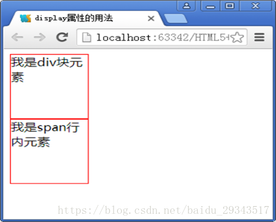
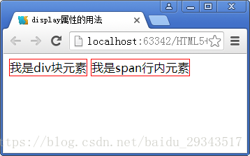
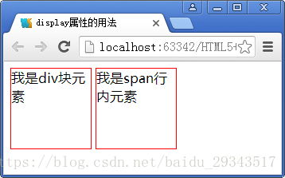
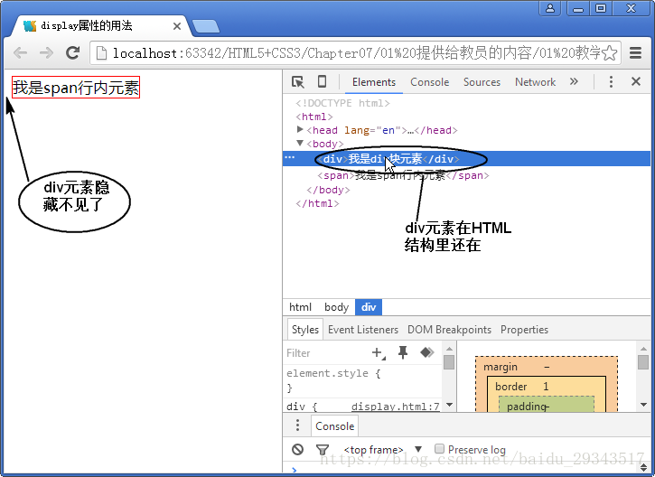
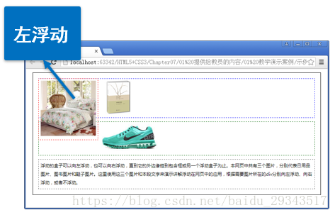
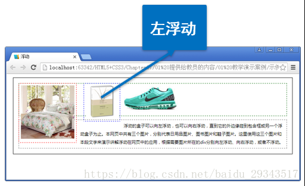
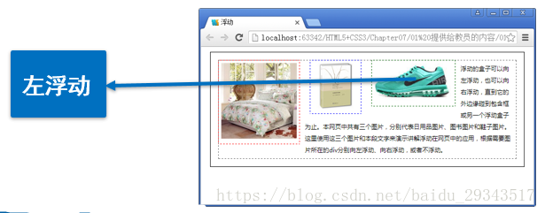
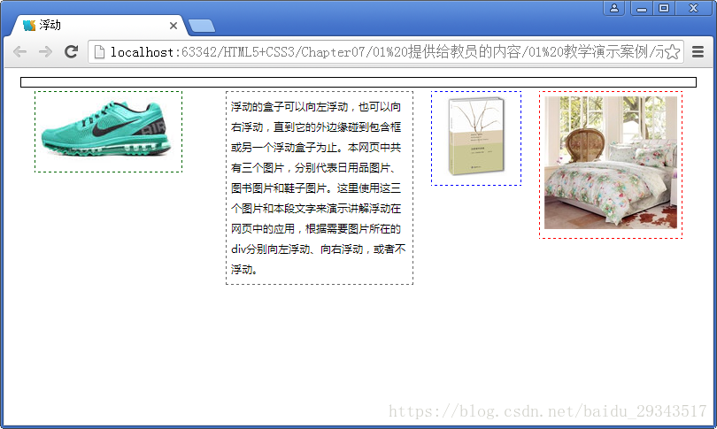
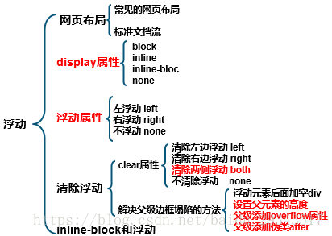

# html
- [HTML5网页布局及display属性总结](#1)

## <a id="1">HTML5网页布局及display属性总结</a>
参考链接：   
1.https://blog.csdn.net/baidu_29343517/article/details/82049246    

### display
标准文档流组成：
```javascript
块级元素（block）：<h1>…<h6>、<p>、<div>、列表
内联元素（inline）：<span>、<a>、、<strong>...
注：内联标签可以包含于块级标签中，成为它的子元素，而反过来则不成立
例如：h1中可以嵌套span元素，但是span中不能嵌套h1元素
```

display属性：   

| 值          | 说明                                                           |
| ------------ | ---------------------------------------------------------------- |
| block        | 块级元素的默认值，元素会被显示为块级元素，该元素前后会带有换行符 |
| inline       | 内联元素的默认值。元素会被显示为内联元素，该元素前后没有换行符 |
| inline-block | 行内块元素，元素既具有内联元素的特性，也具有块元素的特性 |
| none         | 设置元素不会被显示                                      |

display:block;  
【显示为块元素，能让行内元素显示宽高，能让行内元素具有块元素的特征】



display:inline;  
【显示为行内元素，能让块元素具有行内元素的特征】



display:inline-block;  
【吸取行内元素和块元素共同的特征，既能排在一行，又能显示宽高】



display:none;  
【元素在页面上看不见，隐藏了，但是在源代码中依然存在】



总结：   
1. 块级元素与行级元素的转变（block、inline）
2. 控制块元素排到一行（inline-block）
3. 控制元素的显示和隐藏（none）

### float属性
块元素排在一行的方法：   
float属性：  

| 属性值 | 说明                                           |
| ------ | ------------------------------------------------ |
| left   | 元素向左浮动                               |
| right  | 元素向右浮动                               |
| none   | 默认值。元素不浮动，并会显示在其文本中出现的位置 |

设置浮动以后依次浮动之后会跟在前面浮动的元素后面，并且浮动以后层级提高，后面的元素会排上去，浮动元素有可能会盖在未浮动元素的上面。

例如：
```js
<body>
<div id="father">
  <div class="layer01"></div>
  <div class="layer02"></div>
  <div class="layer03"></div>
  <div class="layer04">浮动的盒子</div>
</div>
</body>
```

依次设置三个图片所在<div>左浮动   
.layer01 {   
       border:1px #F00 dashed;  
       float:left;  }   



.layer02 {   
       border:1px #00F dashed;   
       float:left;  }   



.layer03 {  
       border:1px #060 dashed;   
       float:left;  }   



```js
inline - block和float的区别：
1. display:inline-block
①可以让元素排在一行，并且支持宽度和高度，代码实现起来方便
②位置方向不可控制，会解析空格
③IE 6、IE 7上不支持

2. float
①可以让元素排在一行并且支持宽度和高度，可以决定排列方向
②float浮动以后元素脱离文档流，会对周围元素产生影响，必须在它的父级上添加清除浮动的样式
```

### 边框塌陷
layer04设置宽度和右浮动后，为什么边框塌陷了？     
浮动元素脱离标准文档流，父集里面没内容了就剩下了最上面的一个框     



清除浮动

### clear属性

| 属性值 | 说明                         |
| ------ | ------------------------------ |
| left   | 在左侧不允许浮动元素 |
| right  | 在右侧不允许浮动元素 |
| both   | 在左、右两侧不允许浮动元素 |
| none   | 默认值。允许浮动元素出现在两侧 |


### 解决父级边框塌陷的方法
#### 1. 浮动元素后面加空div
```js
<div id="father">
  <div class="layer01"></div>
  <div class="layer02"></div>
  <div class="layer03"></div>
  <div class="layer04">浮动的盒子……</div>
  <div class="clear"></div>
</div>

.clear{  clear: both;  margin: 0; padding: 0;  }
```
太多空元素会造成阅读困难

#### 2. 设置父元素的高度
```js
<div id="father">
  <div class="layer01"></div>
  <div class="layer02"></div>
  <div class="layer03"></div>
  <div class="layer04">浮动的盒子……</div>
</div>
#father {height: 400px; border:1px #000 solid; }

高度不可控，不灵活
```

#### 3. 父级添加overflow属性
```js
<div id="father">
  <div class="layer01"></div>
  <div class="layer02"></div>
  <div class="layer03"></div>
  <div class="layer04">浮动的盒子……</div>
</div>
#father {overflow: hidden;border:1px #000 solid; }
```

| 属性值 | 说明                                                 |
| ------- | ------------------------------------------------------ |
| visible | 默认值。内容不会被修剪，会呈现在盒子之外 |
| hidden  | 内容会被修剪，并且其余内容是不可见的 |
| scroll  | 内容会被修剪，但是浏览器会显示滚动条以便查看其余内容 |
| auto    | 如果内容被修剪，则浏览器会显示滚动条以便查看其余的内容 |

scroll和auto的区别是在使用auto时，横向如果不需要滚动滚动条就会消失

#### 4. 父级添加伪类after
```js
<div id="father" class="clear">
  <div class="layer01"></div>
  <div class="layer02"></div>
  <div class="layer03"></div>
  <div class="layer04">浮动的盒子……</div>
</div>

.clear:after{
    content: '';          /*在clear类后面添加内容为空*/
    display: block;      /*把添加的内容转化为块元素*/
    clear: both;         /*清除这个元素两边的浮动*/
}
最好的方法，企业里都这么用
```

>清除浮动，防止父级边框塌陷的四种方法优缺点：
1. 浮动元素后面加空div：简单，空div会造成HTML代码冗余
2. 设置父元素的高度：简单，元素固定高会降低扩展性
3. 父级添加overflow属性：简单，下拉列表框的场景不能用
4. 父级添加伪类after：写法比上面稍微复杂一点，但是没有副作用，推荐使用



## links
  * [目录](<目录.md>)