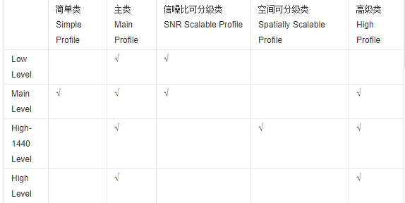

# 基础概念介绍
- [GOP（Group of picture）](#1)
- [CABAC / CAVLC 帧场编码](#2)
- [Deblocking / FORCE_IDR](#3)
- [frame/tff/bff](#4)
- [码流/码率](#5)
- [采样率](#6)
- [比特率](#7)
- [常见编码模式](#8)
- [帧速率](#9)
- [分辨率](#10)
- [高清视频](#11)
- [QP](#12)
- [PSNR](#13)
- [profile level](#14)
- 
- 
- 
- 
- 
- 
- 
- 
- 

## <a id="1">GOP（Group of picture）</a>
两个IDR帧之间的距离。增加关键帧个数可改善质量，但是同时增加带宽和网络负载。GOP=30，30FPS，即每个I帧之间相差1s。需要说明的是，通过提高GOP值来提高图像质量是有限度的，在遇到场景切换的情况时，H.264编码器会自动强制插入一个I帧，此时实际的GOP值被缩短了。另一方面，在一个GOP中，P、B帧是由I帧预测得到的，当I帧的图像质量比较差时，直到下一个GOP开始才有可能得以恢复，所以GOP值也不宜设置过大。过长的GOP还会影响Seek操作的响应速度，Seek操作需要先解码得到本GOP内的I帧及之前的N个预测帧才可以，GOP值越长，需要解码的预测帧就越多，seek响应的时间也越长。

##  <a id="2">CABAC / CAVLC 帧场编码</a>
H.264/AVC标准中两种熵编码方法：CABAC叫自适应二进制算数编码，CAVLC叫前后自适应可变长度编码。其实就是帧编码和场编码。
CABAC：是一种无损编码方式，画质好，X264就会舍弃一些较小的DCT系数，码率降低，可以将码率再降低10-15%（特别是在高码率情况下），会降低编码和解码的速速。
CAVLC：占用更少的CPU资源，但会影响压缩性能。
帧：当采样视频信号时，如果是通过逐行扫描，那么得到的信号就是一帧图像，通常帧频为25帧每秒（PAL制）、30帧每秒（NTSC制）；
场：当采样视频信号时，如果是通过隔行扫描（奇、偶数行），那么一帧图像就被分成了两场，通常场频为50Hz（PAL制）、60Hz（NTSC制）；
帧频、场频的由来：最早由于抗干扰和滤波技术的限制，电视图像的场频通常与电网频率（交流电）相一致，于是根据各地交流电频率不同就有了欧洲和中国等PAL制的50Hz和北美等NTSC制的60Hz，但是现在并没有这样的限制了，帧频可以和场频一样，或者场频可以更高。
帧编码、场编码方式：逐行视频帧内邻近行空间相关性较强，因此当活动量非常小或者静止的图像比较适宜采用帧编码方式；而场内相邻行之间的时间相关性较强，对运动量较大的运动图像则适宜采用场编码方式。

## <a id="3">Deblocking / FORCE_IDR</a>
Deblocking：开启会减少块效应
FORCE_IDR：是否让每个I帧变成IDR帧，如果是IDR帧，支持随机访问。

## <a id="4">frame / tff / bff</a>
frame 将两场合并作为一帧进行编码
tff Enable interlaced mode (开启隔行编码并设置上半场在前)
bff Enable interlaced mode。
PAFF 和MBAFF：当对隔行扫描图像进行编码时，每帧包括两个场，由于两个场之间存在较大的扫描间隔，这样，对运动图像来说，帧中相邻两行之间的空间相关性相对于逐行扫描时就会减小，因此这时对两个场分别进行编码会更节省码流。
对帧来说，存在三种可选的编码方式：将两场合并作为一帧进行编码(frame 方式)或将两场分别编码(field 方式)或将两场合并起来作为一帧，但不同的是将帧中垂直相邻的两个宏块合并为宏块对进行编码；前两种称为PAFF 编码，对运动区域进行编码时field 方式有效，对非运区域编码时，由于相邻两行有较大的相关性，因而frame 方式会更有效。当图像同时存在运动区域和非运动区域时，在MB 层次上，对运动区域采取field 方式，对非运动区域采取frame 方式会更加有效，这种方式就称为MBAFF，预测的单位是宏块对。

## <a id="5">码流/码率</a>
码流(Data Rate)是指视频文件在单位时间内使用的数据流量，也叫码率或码流率，通俗就是取样率，画面质量控制中最重要的部分，一般是kb/s或者Mb/s。一般来说同样分辨率下，视频文件的码流越大，压缩比就越小，画面质量就越高，说明单位时间内取样率越大，精度就越高，处理出来的文件就越接近原始文件，图像质量越好，要求播放设备的解码能力也越高。
　　当然，码流越大，文件体积也越大，其计算公式是文件体积=时间X码率/8。例如，网络上常见的一部90分钟1Mbps码流的720P RMVB文件，其体积就=5400秒×1Mb/8=675MB。
　　通常来说，一个视频文件包括了画面及声音，而我们所说的一个视频文件码流率大小，一般是指视频文件中音频及视频信息码流率的总和。
以以国内最流行，大家最熟悉的RMVB视频文件为例，RMVB中的VB，指的是VBR，中文含义是可变比特率，表示RMVB采用的是动态编码的方式，把较高的采样率用于复杂的动态画面(歌舞、飞车、战争、动作等)，而把较低的采样率用于静态画面，达到画质与体积可兼得的效果。

## <a id="6">采样率</a>
采样率（也称为采样速度或者采样频率）定义了每秒从连续信号中提取并组成离散信号的采样个数，它用赫兹（Hz）来表示。采样率是指将模拟信号转换成数字信号时的采样频率，也就是单位时间内采样多少点。一个采样点数据有多少个比特。比特率是指每秒传送的比特(bit)数。单位为 bps(Bit Per Second)，比特率越高，传送的数据越大，音质越好.比特率 =采样率 x 采用位数 x声道数.
采样率类似于动态影像的帧数，比如电影的采样率是24赫兹，PAL制式的采样率是25赫兹，NTSC制式的采样率是30赫兹。当我们把采样到的一个个静止画面再以采样率同样的速度回放时，看到的就是连续的画面。同样的道理，把以44.1kHZ采样率记录的CD以同样的速率播放时，就能听到连续的声音。显然，这个采样率越高，听到的声音和看到的图像就越连贯。当然，人的听觉和视觉器官能分辨的采样率是有限的，基本上高于44.1kHZ采样的声音，绝大部分人已经觉察不到其中的分别了。
而声音的位数就相当于画面的颜色数，表示每个取样的数据量，当然数据量越大，回放的声音越准确，不过受人的器官的机能限制，16位的声音和24位的画面基本已经是普通人类的极限了，更高位数就只能靠仪器才能分辨出来了。比如电话就是3kHZ取样的7位声音，而CD是44.1kHZ取样的16位声音，所以CD就比电话更清楚。
当你理解了以上这两个概念，比特率就很容易理解了。以电话为例，每秒3000次取样，每个取样是7比特，那么电话的比特率是21000。 而CD是每秒 44100次取样，两个声道，每个取样是13位PCM编码，所以CD的比特率是44100*2*13=1146600，也就是说CD每秒的数据量大约是 144KB，而一张CD的容量是74分等于4440秒，就是639360KB＝640MB。
码率和取样率最根本的差别就是码率是针对源文件来讲的。

## <a id="7">比特率</a>
比特率是指每秒传送的比特(bit)数。单位为bps(Bit Per Second)，比特率越高，传送的数据越大。在视频领域,比特率常翻译为码率 !!!
比特率表示经过编码（压缩）后的音、视频数据每秒钟需要用多少个比特来表示，而比特就是二进制里面最小的单位，要么是0，要么是1。比特率就是比特率越高，音、视频的质量就越好，但编码后的文件就越大；如果比特率越少则情况刚好相反。
比特率是指数字声音、视频由模拟格式转化成数字格式的采样率，采样率越高，还原后的音质、画质就越好。

## <a id="8">常见编码模式</a>
VBR（Variable Bitrate）动态比特率 也就是没有固定的比特率，压缩软件在压缩时根据音频数据即时确定使用什么比特率，这是以质量为前提兼顾文件大小的方式，推荐编码模式；
ABR（Average Bitrate）平均比特率 是VBR的一种插值参数。LAME针对CBR不佳的文件体积比和VBR生成文件大小不定的特点独创了这种编码模式。ABR在指定的文件大小内，以每50帧（30帧约1秒）为一段，低频和不敏感频率使用相对低的流量，高频和大动态表现时使用高流量，可以做为VBR和CBR的一种折衷选择。
CBR（Constant Bitrate），常数比特率 指文件从头到尾都是一种位速率。相对于VBR和ABR来讲，它压缩出来的文件体积很大，而且音质相对于VBR和ABR不会有明显的提高。

## <a id="9">帧速率</a>
帧速率也称为FPS(Frames PerSecond)的缩写——帧/秒。是指每秒钟刷新的图片的帧数，也可以理解为图形处理器每秒钟能够刷新几次。越高的帧速率可以得到更流畅、更逼真的动画。每秒钟帧数(FPS)越多，所显示就会越流畅。

## <a id="10">分辨率</a>
帧大小每一帧就是一副图像。640*480分辨率的视频，建议视频的码速率设置在700以上，音频采样率44100就行了。
一个音频编码率为128Kbps，视频编码率为800Kbps的文件，其总编码率为928Kbps，意思是经过编码后的数据每秒钟需要用928K比特来表示。
计算输出文件大小公式：（音频编码率（KBit为单位）/8 +视频编码率（KBit为单位）/8）×影片总长度（秒为单位）=文件大小（MB为单位）。不同的编码需要不同的系统资源，大概可以认为是H.264>VC-1>MPEG2。相对于MPEG2，VC-1的压缩比更高，但相对于H.264而言，编码解码的计算则要稍小一些，一般来说，VC-1多为 “.wmv”后缀，但这都不是绝对的，具体的编码格式还是要通过软件来查询。
总的来说，从压缩比上来看，H.264的压缩比率更高一些，也就是同样的视频，通过H.264编码算法压出来的视频容量要比VC-1的更小，但是VC-1 格式的视频在解码计算方面则更小一些，一般通过高性能的CPU就可以很流畅的观看高清视频。相信这也是目前NVIDIA Geforce 8系列显卡不能完全解码VC-1视频的主要原因。

## <a id="11">高清视频</a>
目前的高清视频编码格式主要有H.264、VC-1、MPEG-2、MPEG-4、DivX、XviD、WMA-HD以及X264。
事实上，现在网络上流传的高清视频主要以两类文件的方式存在：一类是经过MPEG-2标准压缩，以tp和ts为后缀的视频流文件;一类是经过WMV-HD(Windows Media Video HighDefinition)标准压缩过的wmv文件，还有少数文件后缀为avi或mpg，其性质与wmv是一样的。真正效果好的高清视频更多地以H.264与VC-1这两种主流的编码格式流传。一般来说，H.264格式以“.avi”、“.mkv”以及“.ts”封装比较常见。

## <a id="12">QP</a>
介于0~31之间，值越小，量化越精细，图像质量就越高，而产生的码流也越长。

## <a id="13">PSNR</a>
允许计算峰值信噪比(PSNR,Peak signal-to-noise ratio),编码结束后在屏幕上显示PSNR计算结果。开启与否与输出的视频质量无关，关闭后会带来微小的速度提升。

## <a id="14">profile level</a>
MPEG-2按压缩比大小的不同分成五个档次（profile），每一个档次又按图像清晰度的不同分成四种图像格式，或称为级别（level）。五个档次四种级别共有20种组合，但实际应用中有些组合不太可能出现，较常用的是11种组合（下表中标识“√”的项）。这11种组合分别应用在不同的场合，如MP@ML。
分别是BP、EP、MP、HP：

　　1、BP-Baseline Profile：基本画质。支持I/P 帧，只支持无交错（Progressive）和CAVLC；
　　2、EP-Extended profile：进阶画质。支持I/P/B/SP/SI 帧，只支持无交错（Progressive）和CAVLC；
　　3、MP-Main profile：主流画质。提供I/P/B 帧，支持无交错（Progressive）和交错（Interlaced），也支持CAVLC 和CABAC 的支持；
　　4、HP-High profile：高级画质。在main Profile 的基础上增加了8x8内部预测、自定义量化、无损视频编码和更多的YUV 格式；
H.264规定了三种档次，每个档次支持一组特定的编码功能，并支持一类特定的应用。
1）基本档次：利用I片和P片支持帧内和帧间编码，支持利用基于上下文的自适应的变长编码进行的熵编码（CAVLC）。主要用于可视电话、会议电视、无线通信等实时视频通信；
2）主要档次：支持隔行视频，采用B片的帧间编码和采用加权预测的帧内编码；支持利用基于上下文的自适应的算术编码（CABAC）。主要用于数字广播电视与数字视频存储；
3）扩展档次：支持码流之间有效的切换（SP和SI片）、改进误码性能（数据分割），但不支持隔行视频和CABAC。主要用于网络的视频流，如视频点播。

## 

## 

## 

## 

## 

## 

## 

## 

## 

## 

## 

## 

## 

## 

## 

## links
  * [目录](<音视频入门到精通目录.md>)
  * 下一节: [音视频入门](<音视频入门.md>)