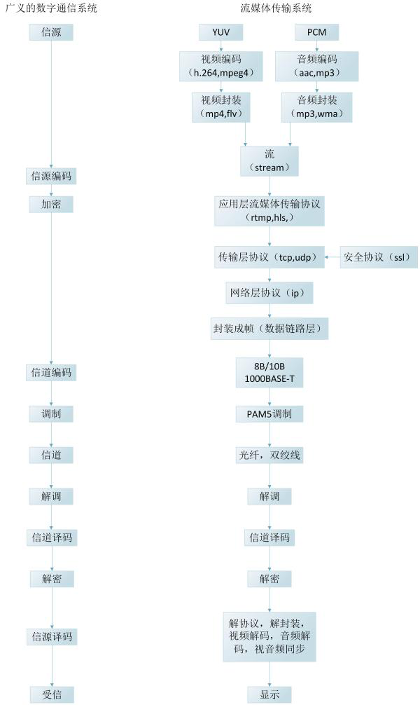

# 音视频入门
- [2.1音视频通信流程](#1)
- [2.2视音频格式简介](#2)
- [2.3DTS&PTS](#3)
- [2.4mpeg4视频中，I帧、p帧、B帧的判定](#4)
- [2.5 数字视频](#5)


## <a id="1">2.1音视频通信流程</a>


## <a id="2">2.2视音频格式简介</a>
视频、图像、音频的格式。包括MP4，FLV这样的封装格式，也包括H264，MPEG2这样的编码格式，还包括420 422 444这样的取样格式，甚至RGB，HSV，YUV这样的彩色空间也可以算作一种格式，将来在应用时还可能会遇到RTMP，HLS这样的流媒体传输协议或者其他的协议，都可以算作格式。  

## <a id="3">2.3DTS&PTS</a>


## <a id="4">2.4mpeg4视频中，I帧、p帧、B帧的判定</a>
mpeg4的每一帧开头是固定的：00 00 01 b6，那么我们如何判断当前帧属于什么帧呢？在接下来的2bit，将会告诉我们答案。注意：是2bit，不是byte，下面是各类型帧与2bit的对应关系：
　　00: I Frame  
　　01: P Frame  
10: B Frame　
为了更好地说明，我们举几个例子，以下是16进制显示的视频编码：  
00 00 01 b6 10 34 78 97 09 87 06 57 87 ……                         I帧  
00 00 01 b6 50 78 34 20 cc 66 b3 89 ……                            P帧  
00 00 01 b6 96 88 99 06 54 34 78 90 98 ……                         B帧  
下面我们来分析一下为什么他们分别是I、P、B帧  
　　0x10 = 0001 0000  
　　0x50 = 0101 0000  
　　0x96 = 1001 0100　  
大家看红色的2bit，再对照开头说的帧与2bit的对应关系，是不是符合了呢？  
下面给出一段c++代码供大家参考：
```  
switch(buf[i] & (BYTE)0xc0)
{
case 0x00:
    //I Frame
    break;
case 0x40:
    //P Frame
    break;
case 0x80:
    //B Frame
    break;
default:
    break;
}
```

## <a id="5">2.5 数字视频</a>
CATV 频道中，550MHz～750MHz 的 200MHz 带宽中，如果传送模拟电视，每个节目需 8MHz 带宽，充其量只能传送 25 套节目。如果传送数字电视节目，采用 64QAM 调制，其频谱利用率为 5.3，如每路节目用 MPEG-2压缩为 4Mbps，实际只需 4÷5.3≈0.75MHz 带宽，于是在同样的 200MHz 带宽中可传送数字电视节目。  
RGB：任何彩色图像可由不同比例的红色、绿色和蓝色组合而成，即三基色原理。
YCbCr(YUV)：Y=0.299R+0587G+0.114B   Cb=0564(B－Y)   Cr=0.713(R－Y)  
R=Y+1.402Cr     G=Y-0.344Cb-0.714Cr    B=Y+1.772Cb  
有三种不同的彩色电视取样格式:  
4:4:4，Y，Cb 和 Cr 具有同样的水平和垂直清晰度，不论水平方向还是垂直方向，每 4 个亮度像素相应的有 4 个 Cb 和 4 个 Cr 色度像素  
4:2:2，这时彩色分量和亮度分量具有同样的垂直清晰度，但水平清晰度彩色分量是亮度分
量的一半。水平方向上，每 4 个亮度像素具有 2 个 Cb 和 2 个 Cr  
4:2:0，在水平和垂直清晰度方面， Cb 和 Cr 都是 Y 的一半。  
量化值 Qp，取得太大，视频图像显得粗糙；取得太小，视频图像质量好，但带宽浪费过大。一般认为，每个取样值采用 8 个比特表示，即 256 个灰度级，是比较合理的。

 |  1   |  2  |  
 |  ----  | ----  |    
 | fs＝13.5MHz | （亮度信号，即 Y 信号） |   
 | fs＝6.75MHz | （色差信号，即 Cb、 Cr 信号） | 

彩色电视采用 4:2:2 格式时（垂直方向 Cb、 Cr 和 Y 具有同等清晰度，水平方向 Cb、 Cr 只是 Y一半）， Y 和 Cb、 Cr 取样频率如上，则电视信号总数码率为：13.5×8＋2×6.75×8＝216Mbps  
当会议电视采用 CIF 格式时，帧频为 25 帧/秒，总码率为：352×288×25×8＝20.28Mbps
这些都是没有经过压缩的码率  
- 【色彩插值】，图像阵列中，每个像素值只有一个颜色的色调值，另外两个颜色的色调必须利用相邻像素之间的相关性，通过数据计算获得。相邻像素复制法、双线性插值算法以及双三次多项式插值等等
- 【色彩校正】，配置 RGB 色彩滤镜阵列的 CMOS 图像传感器的光谱响应曲线，为了补偿这种差异，必须对图像的像素值进行的变换处理。
- 【伽马校正】，显示器的输出强度和输出电压的相应大致呈幂指数关系输出的强度随着输入电压的增长成指数增长。通常我们就把这个幂指数称为伽马（gamma）。
- 【图像增强】，实际应用中图像传感器的输出图像经过上述的处理并不是完美的，图像质量获得的改进也是有限的，加之噪声、光照等原因，需要进一步处理，丢弃无用的信息，保留我们感兴趣的重要信息。 图像增强作为一种重要的图像处理技术，目的无非就是两个： 第一更适合人眼的感觉；第二有利于后续的分析处理。图像增强主要包括直方图均衡、平滑滤波、中值滤波、锐化等内容。
- 【白平衡】白平衡指的就是对白色物体的还原理解白平衡，涉及到另一个重要的概念：色温。所谓色温，简而言之，就是定量地以开尔文温度表示色彩。 色温越高， 蓝色成分就越多； 色温越低， 红色成分就越多，在摄影、摄像时，不同色温光源下拍摄物体，获得的图像不可避免会出现色彩上的偏差。为了很获得现实际世界中各种色彩的图像，必须消除环境中光源色温的影响，即进行白平衡处理。

## links
  * [目录](<音视频入门到精通目录.md>)
  * 下一节: [图片入门](<1.3图片入门.md>)