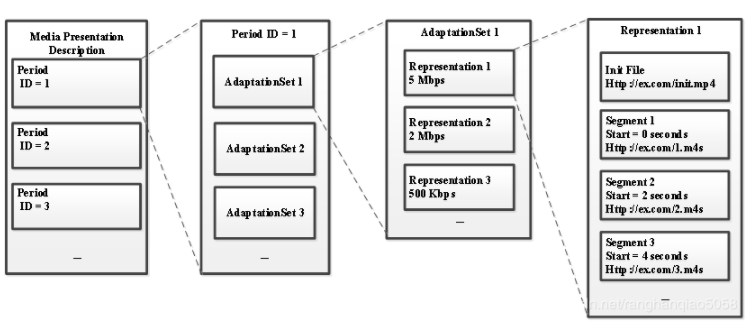
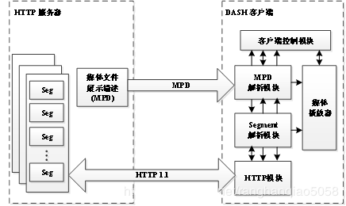

# 2.11MPEG-DASH
- [11.1简介](#11.1)
- [11.2DASH结构内容](#11.2)

1.MPEG-DASH简介  
https://blog.csdn.net/TonyGoing/article/details/77141306  

## <a id="11.1">11.1简介</a>
DASH的全称是Dynamic Adaptive Streaming over HTTP。DASH是一种新的视频传输协议，由微软、苹果、Adobe等公司共同主导完成，MPEG-DASH是一种码流自适应的技术，它可以在网络上(利用HTTP web servers)传输高质量的媒体流。其主要特点是视频切片和基于HTTP传输，可以利用现有的HTTP网络架构（专门的服务器和CDN等）传输流媒体。MPEG-DASH可以实现动态无缝适应实时的网络条件并提供高质量的播放内容，拥有更少的卡顿，极大地提升了用户体验。  
DASH整个系统可以分成服务器和客户端两个模块，视频片段的封装格式，支持MPEG-2 TS、MP4等多种格式，并且，可以使用h.265,H.264,AVS,VP9等多种编码器进行编码。服务器端通过MPD（media presentation description）文件来描述媒体信息，包括，是直播还是点播、视频切片的大小，有几种不同的码率以及每个视频片段对应的URL地址等。客户端通过MPD文件就可以知道整个将要播放的媒体信息。  
与已有的采用 RTP 的方法相比，HTTP 不需要考虑防火墙的问题，并且可以充分利用已有的系统架构，如缓存、CDN 等。DASH本身也可以通过 WebSocket 和上层 push 等技术来支持低延迟的流推送, 而且不同于 HLS、HDS 和 Smooth Streaming，DASH 不关心编解码器，因此它可以接受任何编码格式编码的内容，如 HEVC、H.264、VP9 等。由于其多方面的优势，目前全景视频也主要采用 DASH 协议进行传输，而且DASH协议针对全景视频的的特性加入了一些特定功能以适应去全景视频的传输。  

## <a id="11.2">11.2DASH结构内容</a>
MPEG-DASH传输系统架构由HTTP服务器和DASH客户端两部分组成。HTTP服务器存储着DASH文件，主要包含两部分：媒体描述文件MPD和DASH媒体文件。DASH媒体文件主要由分段媒体文件和头信息文件两部分组成。  
客户端根据实时网络情况进行下载的演示图，首先HTTP 服务器端将媒体文件切分成一个个时间长度相等的小分片，每个分片被编码为不同大小的码率；这些分片可以通过GET请求下载，客户端通过评估自身的性能和带宽情况，下载相应码率的切片。码率切换以媒体分段为单位，当网络带宽较好时，客户端可以请求对应时间较高码率的媒体分段；而当带宽变差时，客户端则下载对应码率较低的下一个媒体分段。由于不同质量的媒体分段在时间上都是相互对齐的，因此不同质量的媒体分段之间切换时，画面是自然流畅的。  
为了精确描述DASH的结构内容，MPEG-DASH引入了Media Presentation Description (MPD)的概念。MPD是一个XML文件，它完整描述了DASH内容的所有信息，包括各类音视频参数、内容分段时长、不同媒体分段的码率和分辨率以及对应的访问地址URL等等，客户端通过首先下载并解析MPD文件，可获取到与自身性能和带宽最匹配的媒体分段。下图比较清晰地说明了MPD文件的分层结构关系。  

- period
一个DASH文件可以包含一个或多个Periods，每个Period代表一段连续的视频片段，假设一段码流有60s被划分为3个Periods，Period1为0-15s，Period2为16-40s，Period3为41-60s。在同一个Period内，可用的媒体内容的类型及其各个可用码率(Representation)都不会发生变更。直播情况下，MPD文件会发生实时变化，需要周期性地去服务器请求新的MPD文件，服务器可能会移除已过时的Period，添加新的Period，而新的Period中可能会出现新的可用码率，或者移除上一个Period中存在的某些码率。  

- AdaptationSet  
 	一个Period由一个或多个AdaptationSets组成。例如，一个自适应集包含同一视频内容的多个不同比特率的视频分段，另一个自适应集包含同一音频内容的多个不同比特率的视频分段。每个AdaptationSet包含了逻辑一致的可供切换的不同码率的码流（Representation)。例如，这些Representation具有相同的codec、language、resolution以及音频通道数(5.1，stereo等)。这些Representation中可能包含一个(ISO profile)或多个(TS profile)media content components，因为ISO profile的mp4或fmp4 segment中通常只含有一个视频或者音频内容，而TS profile中的TS segment同时含有视频和音频内容，当同时含有多个media component content时，每个被复用的media content component将被单独描述。  

- Representation
 	一个AdaptationSet由一组媒体内容配置可切换的Representations构成。每个Representation表示同一媒体内容但编码参数互不相同的音视频数据。包含了相同媒体内容的不同配置，即不同的分辨率、码率等，以供客户端根据自身的网络条件和性能限制来选择合适的版本下载播放。  

- Representation
一个AdaptationSet由一组媒体内容配置可切换的Representations构成。每个Representation表示同一媒体内容但编码参数互不相同的音视频数据。包含了相同媒体内容的不同配置，即不同的分辨率、码率等，以供客户端根据自身的网络条件和性能限制来选择合适的版本下载播放。  

- Segment  
每个Representation中的内容按时间或者其他规则被切分成一段段Segments，使得客户端在播放时能够灵活地在不同的Representations之间进行切换。每个Segment都有一个唯一的与之对应的URL地址，也可能由相同的URL与不同的byte range指定。DASH客户端可以通过HTTP协议来获取URL对应的分片数据。MPD中描述Segment URL的形式包括Segment list，Segment template，Single segment。  

如图所示，DASH客户端根据MPD-URL向服务器发送请求获取MPD，客户端首先解析MPD内容，得到服务器端DASH文件的内容信息，包括视频分辨率、视频内容种类、分段情况、帧率、码率以及各个媒体内容的URL地址等媒体配置信息。DASH客户端通过分析上述DASH文件内容信息，根据当前网络状态以及客户端缓冲区的大小等选择合适的媒体版本。然后通过向服务器发送请求，根据媒体URL下载对应的媒体文件进行流式传输。客户端收到对应的媒体文件之后，进行解封装得到裸码流，最后送入解码器进行解码播放。  
Dash.js通过js基于dash的内核  

## links
  * [目录](<音视频入门到精通目录.md>)
  * 下一节: [2.12HLS](<2.12HLS.md>)