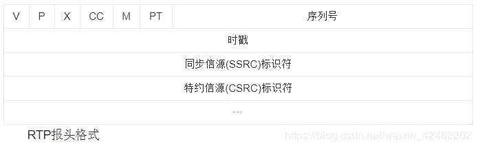

# 2.4RTSP
- [4.1 RTSP概述](#4.1)
- [4.2 RTSP状态](#4.2)
- [4.3 RTSP协议消息](#4.3)
- [4.4 SDP协议解析](#4.4)
- [4.5 资源预订协议RSVP协议](#4.5)
- [4.6 从零开始写一个RTSP服务器](#4.6)

## <a id="4.1">4.1 RTSP概述</a>
实时流协议RTSP（Real Time Streaming Protocol）最早由Real Networks和Netscape公司共同提出，它位于RTP和RTCP之上，其目的是希望通过IP网络有效地传输多媒体数据。RTSP在体系结构上位于RTP和RTCP之上，它使用TCP或RTP完成数据传输。HTTP与RTSP相比，HTTP传送HTML，而RTP传送的是多媒体数据。HTTP请求由客户机发出，服务器作出响应；使用RTSP时，客户机和服务器都可以发出请求，即RTSP可以是双向的。   
作为一个应用层协议，RTSP提供了一个可供扩展的框架，它的意义在于使得实时流媒体数据的受控和点播变得可能。总的说来，RTSP是一个流媒体表示协议，主要用来控制具有实时特性的数据发送，但它本身并不传输数据，而是必须依赖于下层传输协议所提供的某些服务。RTSP可以对流媒体提供诸如播放、 暂停、快进等操作，它负责定义具体的控制消息、操作方法、状态码等，此外还描述了与RTP间的交互操作。
RTSP在制定时较多地参考了HTTP/1.1协议，甚至许多描述与HTTP/1.1完全相同。RTSP之所以特意使用与HTTP/1.1类似的语 法和操作，在很大程度上是为了兼容现有的Web基础结构，正因如此，HTTP/1.1的扩展机制大都可以直接引入到RTSP中。  
由RTSP控制的媒体流集合可以用表示描述（Presentation Description）来定义，所谓表示是指流媒体服务器提供给客户机的一个或者多个媒体流的集合，而表示描述则包含了一个表示中各个媒体流的相关信 息，如数据编码/解码算法、网络地址、媒体流的内容等。
虽然RTSP服务器同样也使用标识符来区别每一流连接会话（Session），但RTSP连接并没有被绑定到传输层连接（如TCP等），也就是说在 整个RTSP连接期间，RTSP用户可打开或者关闭多个对RTSP服务器的可靠传输连接以发出RTSP 请求。此外，RTSP连接也可以基于面向无连接的传输协议（如UDP等）。  
RTSP协议目前支持以下操作：  
检索媒体：允许用户通过HTTP或者其它方法向媒体服务器提交一个表示描述。如表示是组播的，则表示描述就包含用于该媒体流的组播地址和端口号；如果表示是单播的,为了安全在表示描述中应该只提供目的地址。  
邀请加入：媒体服务器可以被邀请参加正在进行的会议，或者在表示中回放媒体，或者在表示中录制全部媒体或其子集，非常适合于分布式教学。，会议中几方可轮流按远程控制按钮。  
添加媒体：通知用户新加入的可利用媒体流，这对现场讲座来讲显得尤其有用。与HTTP/1.1类似，RTSP请求也可以交由代理、通道或者缓存来进行处理。如服务器告诉用户可获得附加媒体内容，对现场讲座显得尤其有用。  

## <a id="4.2">4.2 RTSP状态</a>
RTSP控制通过单独协议发送的流，与控制通道无关。例如，RTSP控制可通过TCP连接，而数据流通过UDP。因此，即使媒体服务器没有收到请求，数据也会继续发送。在连接生命期，单个媒体流可通过不同TCP连接顺序发出请求来控制。所以，服务器需要维持能联系流与RTSP请求的连接状态。RTSP中很多方法与状态无关，但下列方法在定义服务器流资源的分配与应用上起着重要的作用：   
SETUP：让服务器给流分配资源，启动RTSP连接。   
PLAY与RECORD：启动SETUP 分配流的数据传输。   
PAUSE：临时停止流，而不释放服务器资源。   
TEARDOWN：释放流的资源，RTSP连接停止。 
标识状态的RTSP方法使用连接头段识别RTSP连接，为响应SETUP请求，服务器连接产生连接标识。   

## <a id="4.3">4.3 RTSP协议消息</a>
- [4.3.1 RTSP消息格式](#4.3.1)
- [4.3.2 rtsp交互过程](#4.3.2)
- [4.3.3 rtsp中常用方法](#4.3.3)

### <a id="4.3.1">4.3.1 RTSP消息格式</a>
RTSP的消息有两大类 --- 请求消息(request), 回应消息(response)。  
```Go
请求消息：
方法 URI RTSP版本 CR LF 
消息头 CR LF CR LF 
消息体 CR LF 

如下：
DESCRIBE rtsp://192.168.1.211 RTSP/1.0
CSeq: 1
Accept: application/sdp
User-Agent: magnus-fc
其中方法包括OPTION回应中所有的命令,URI是接受方的地址,例如:rtsp://192.168.20.136。RTSP版本一般都是 RTSP/1.0。每行后面的CR LF表示回车换行，需要接受端有相应的解析，最后一个消息头需要有两个CR LF。
回应消息：
RTSP版本 状态码 解释 CR LF 
消息头 CR LF CR LF 
消息体 CR LF 
如下：
RTSP/1.0 200 OK
CSeq: 1
Server: GrandStream Rtsp Server V100R001
Content-Type: application/sdp
Content-length: 256
Content-Base: rtsp://192.168.1.211/0

v=0
o=StreamingServer 3331435948 1116907222000 IN IP4 192.168.1.211
s=h264.mp4
c=IN IP4 0.0.0.0
t=0 0
a=control:*
m=video 0 RTP/AVP 96
a=control:trackID=0
a=rtpmap:96 H264/90000
m=audio 0 RTP/AVP 97
a=control:trackID=1
a=rtpmap:97 G726-16/8000
其中RTSP版本一般都是RTSP/1.0, 状态码是一个数值, 200表示成功, 解释是与状态码对应的文本解释.
```

### <a id="4.3.2">4.3.2 rtsp交互过程</a>
```Go
简单的rtsp交互过程: 
C表示rtsp客户端, S表示rtsp服务端

1. C->S:OPTION request //询问S有哪些方法可用
1. S->C:OPTION response //S回应信息中包括提供的所有可用方法

2. C->S:DESCRIBE request //要求得到S提供的媒体初始化描述信息
2. S->C:DESCRIBE response //S回应媒体初始化描述信息，主要是sdp

3. C->S:SETUP request //设置会话的属性，以及传输模式，提醒S建立会话
3. S->C:SETUP response //S建立会话，返回会话标识符，以及会话相关信息

4. C->S:PLAY request //C请求播放
4. S->C:PLAY response //S回应该请求的信息

S->C:发送流媒体数据

5. C->S:TEARDOWN request //C请求关闭会话
5. S->C:TEARDOWN response //S回应该请求
```
上述的过程是标准的、友好的rtsp流程，但实际的需求中并不一定按部就班来。 其 中第3和4步是必需的！第一步，只要服务器客户端约定好，有哪些方法可用，则option请求可以不要。第二步，如果我们有其他途径得到媒体初始化描述信 息（比如http请求等等），则我们也不需要通过rtsp中的describe请求来完成。第五步，可以根据系统需求的设计来决定是否需要。  

### <a id="4.3.3">4.3.3 rtsp中常用方法</a>
```Go
OPTION
目的是得到服务器提供的可用方法:
OPTIONS rtsp://192.168.20.136:5000/xxx666 RTSP/1.0
CSeq: 1 //每个消息都有序号来标记，第一个包通常是option请求消息
User-Agent: VLC media player (LIVE555 Streaming Media v2005.11.10)

服务器的回应信息包括提供的一些方法,例如:
RTSP/1.0 200 OK 
Server: UServer 0.9.7_rc1
Cseq: 1 //每个回应消息的cseq数值和请求消息的cseq相对应
Public: OPTIONS, DESCRIBE, SETUP, TEARDOWN, PLAY, PAUSE, SCALE,GET_PARAMETER //服务器提供的可用的方法

DESCRIBE 
C向S发起DESCRIBE请求,为了得到会话描述信息(SDP):
DESCRIBE rtsp://192.168.20.136:5000/xxx666 RTSP/1.0
CSeq: 2
token: 
Accept: application/sdp
User-Agent: VLC media player (LIVE555 Streaming Media v2005.11.10) 

服务器回应一些对此会话的描述信息(sdp):
RTSP/1.0 200 OK 
Server: UServer 0.9.7_rc1 
Cseq: 2 
x-prev-url: rtsp://192.168.20.136:5000 
x-next-url: rtsp://192.168.20.136:5000 
x-Accept-Retransmit: our-retransmit 
x-Accept-Dynamic-Rate: 1 
Cache-Control: must-revalidate 
Last-Modified: Fri, 10 Nov 2006 12:34:38 GMT 
Date: Fri, 10 Nov 2006 12:34:38 GMT 
Expires: Fri, 10 Nov 2006 12:34:38 GMT 
Content-Base: rtsp://192.168.20.136:5000/xxx666/ 
Content-Length: 344 
Content-Type: application/sdp 

v=0 //以下都是sdp信息  
o=OnewaveUServerNG 1451516402 1025358037 IN IP4 192.168.20.136 
s=/xxx666 
u=http:/// 
e=admin@ 
c=IN IP4 0.0.0.0 
t=0 0 
a=isma-compliance:1,1.0,1 
a=range:npt=0- 
m=video 0 RTP/AVP 96 //m表示媒体描述，下面是对会话中视频通道的媒体描述
a=rtpmap:96 MP4V-ES/90000 
a=fmtp:96 profile-level-id=245;config=000001B0F5000001B509000001000000012000C888B0E0E0FA62D089028307 a=control:trackID=0 //trackID＝0表示视频流用的是通道0

SETUP 
客户端提醒服务器建立会话,并确定传输模式:
SETUP rtsp://192.168.20.136:5000/xxx666/trackID=0 RTSP/1.0 
CSeq: 3 
Transport: RTP/AVP/TCP;unicast;interleaved=0-1 
User-Agent: VLC media player (LIVE555 Streaming Media v2005.11.10)
//uri中 带有trackID＝0，表示对该通道进行设置。Transport参数设置了传输模式，包的结构。接下来的数据包头部第二个字节位置就是 interleaved，它的值是每个通道都不同的，trackID＝0的interleaved值有两个0或1，0表示rtp包，1表示rtcp包，接 受端根据interleaved的值来区别是哪种数据包。

服务器回应信息:
RTSP/1.0 200 OK 
Server: UServer 0.9.7_rc1 
Cseq: 3 
Session: 6310936469860791894 //服务器回应的会话标识符
Cache-Control: no-cache 
Transport: RTP/AVP/TCP;unicast;interleaved=0-1;ssrc=6B8B4567

PLAY 
客户端发送播放请求:
PLAY rtsp://192.168.20.136:5000/xxx666 RTSP/1.0 
CSeq: 4 
Session: 6310936469860791894 
Range: npt=0.000- //设置播放时间的范围
User-Agent: VLC media player (LIVE555 Streaming Media v2005.11.10)

服务器回应信息:
RTSP/1.0 200 OK 
Server: UServer 0.9.7_rc1 
Cseq: 4 
Session: 6310936469860791894 
Range: npt=0.000000- 
RTP-Info: url=trackID=0;seq=17040;rtptime=1467265309 
//seq和rtptime都是rtp包中的信息
Range——播放时间
Range: npt=0.0-end
Range:clock=20100318T021919.35Z-20100318T031919.80Z
Scale——播放速度
Scale: 1.0

5.5 TEARDOWN 
客户端发起关闭请求:
TEARDOWN rtsp://192.168.20.136:5000/xxx666 RTSP/1.0 
CSeq: 5 
Session: 6310936469860791894 
User-Agent: VLC media player (LIVE555 Streaming Media v2005.11.10) 

服务器回应:
RTSP/1.0 200 OK 
Server: UServer 0.9.7_rc1 
Cseq: 5 
Session: 6310936469860791894 
Connection: Close 
```
以上方法都是交互过程中最为常用的, 其它还有一些重要的方法如get/set_parameter,pause,redirect等等 

## <a id="4.4">4.4 SDP协议解析</a>
```Go
sdp的格式：
v=<version>
o=<username> <session id> <version> <network type> <address type> <address>
s=<session name>
i=<session description>
u=<URI>
e=<email address>
p=<phone number>
c=<network type> <address type> <connection address>
b=<modifier>:<bandwidth-value>
t=<start time> <stop time>
r=<repeat interval> <active duration> <list of offsets from start-time>
z=<adjustment time> <offset> <adjustment time> <offset> ....
k=<method>
k=<method>:<encryption key>
a=<attribute>
a=<attribute>:<value>
m=<media> <port> <transport> <fmt list>

v = （协议版本）
o = （所有者/创建者和会话标识符）
s = （会话名称）
i = * （会话信息）
u = * （URI 描述）
e = * （Email 地址）
p = * （电话号码）
c = * （连接信息）
b = * （带宽信息）
z = * （时间区域调整）
k = * （加密密钥）
a = * （0 个或多个会话属性行）

时间描述：
t = （会话活动时间）
r = * （0或多次重复次数）
 
媒体描述：
m = （媒体名称和传输地址）
i = * （媒体标题）
c = * （连接信息 — 如果包含在会话层则该字段可选）
b = * （带宽信息）
k = * （加密密钥）
a = * （0 个或多个媒体属性行）
```

SDP一会话描述协议一描述SAP、sIP和RTSR会话的协议,是一种文件描述协议,是由服务器生成的描述媒体文件编码信息以及所在服务器的链接等的信息。在多媒体会话中sDP传送有关媒体流的信息,使会话描述的参人方加人会话。sDP主要用于Intemet网中,但也可以在其它网络环境下使用。SDP十分通用,可描述其它网络环境中的会话,但主要用于Intemet中。在Intemet环境下,sDP有两个主要目的:一是表明会话存在,二是传送足够信息给接收方,以便能加人、参加该会话。SDP所传达的信息包括:会话名称和目的,会话活动时间,组成会话媒体种类,接收这些媒体的控制信息(如地址、端口、格式、带宽和会议管理人员资料等)。  
 
>总结：在RTSP交互过程中，只要在客户端发出Describe请求的时候，服务端回应的时候会有SDP消息发出，用SDP来描述会话情况和内容，方便客户端能够加入该会话，

参考链接：
1.SDP协议详细总结
https://blog.csdn.net/weixin_42462202/article/details/90710599

## <a id="4.5">4.5 资源预订协议RSVP协议</a>
　 由于音频和视频数据流比传统数据对网络的延时更敏感，要在网络中传输高质量的音频、视频信息，除带宽要求之外，还需其他更多的条件。RSVP(ResourceReserveProtocol)是正在开发的Internet上的资源预订协议，使用RSVP预留一部分网络资源（即带宽），能在一定程度上为流媒体的传输提供QoS。在某些试验性的系统如网络视频会议工具vic中就集成了RSVP。   
　 RSVP运行在传输层，在IP上层。与ICMP和IGMP相比，它是一个控制协议。 RSVP协议的两个重要概念是流与预定。流是从发送者到一个或多个接收者的连接特征，通过IP包中"流标记"来认证。发送一个流前，发送者传输一个路径信息到目的接收方，这个信息包括源IP地址、目的IP地址和一个流规格。这个流规格是由流的速率和延迟组成的，这是流的QoS需要的。接收者实现预定后，基于接收者的模式能够实现一种分布式解决方案。   
　 RSVP领域的发展是非常迅速的，但目前并没有在任何一种网络上得到证实，它的应用只是局限在测试的小Intranet网络上。因为RSVP的预定必须建立在完全流方式的基础上，其可扩展性问题倍受关注。  

## <a id="4.6">4.6从零开始写一个RTSP服务器</a>
>参考连接:
https://blog.csdn.net/weixin_42462202/article/details/98986535

- [4.6.1会话描述](#4.6.1)
- [4.6.2RTP OVER TCP](#4.6.2)

### <a id="4.6.1">4.6.1会话描述</a>
RTSP是一个实时传输流协议，是一个应用层的协议。通常说的RTSP包括RTSP协议、RTP协议、RTCP协议。对于这些协议的作用简单的理解如下：  
RTSP协议：负责服务器与客户端之间的请求与响应  
RTP协议：负责传输媒体数据  
RTCP协议：在RTP传输过程中提供传输信息  
AAC音频格rtsp承载与rtp和rtcp之上，rtsp并不会发送媒体数据，而是使用rtp协议传输  
rtp并没有规定发送方式，可以选择udp发送或者tcp发送  
```Go
RTSP请求的常用方法
方法	描述
OPTIONS	获取服务端提供的可用方法
DESCRIBE	向服务端获取对应会话的媒体描述信息
SETUP	向服务端发起建立请求，建立连接会话
PLAY	向服务端发起播放请求
TEARDOWN	向服务端发起关闭连接会话请求

DESCRIBE
C–>S
DESCRIBE rtsp://192.168.31.115:8554/live RTSP/1.0\r\n
CSeq: 3\r\n
Accept: application/sdp\r\n
客户端向服务器请求媒体描述文件，格式为sdp
S–>C

RTSP/1.0 200 OK\r\n
CSeq: 3\r\n
Content-length: 146\r\n
Content-type: application/sdp\r\n
\r\n

v=0\r\n
o=- 91565340853 1 in IP4 192.168.31.115\r\n
t=0 0\r\n
a=contol:*\r\n
m=video 0 RTP/AVP 96\r\n
a=rtpmap:96 H264/90000\r\n
a=framerate:25\r\n
a=control:track0\r\n

SETUP

C–>S

SETUP rtsp://192.168.31.115:8554/live/track0 RTSP/1.0\r\n
CSeq: 4\r\n
Transport: RTP/AVP;unicast;client_port=54492-54493\r\n
\r\n

客户端发送建立请求，请求建立连接会话，准备接收音视频数据
解析一下Transport: RTP/AVP;unicast;client_port=54492-54493\r\n
RTP/AVP：表示RTP通过UDP发送，如果是RTP/AVP/TCP则表示RTP通过TCP发送
unicast：表示单播，如果是multicast则表示多播
client_port=54492-54493：由于这里希望采用的是RTP OVER UDP，所以客户端发送了两个用于传输数据的端口，客户端已经将这两个端口绑定到两个udp套接字上，54492表示是RTP端口，54493表示RTCP端口(RTP端口为某个偶数，RTCP端口为RTP端口+1)
S–>C

RTSP/1.0 200 OK\r\n
CSeq: 4\r\n
Transport: RTP/AVP;unicast;client_port=54492-54493;server_port=56400-56401\r\n
Session: 66334873\r\n
\r\n
服务端接收到请求之后，得知客户端要求采用RTP OVER UDP发送数据，单播，客户端用于传输RTP数据的端口为54492，RTCP的端口为54493
服务器也有两个udp套接字，绑定好两个端口，一个用于传输RTP，一个用于传输RTCP，这里的端口号为56400-56401
之后客户端会使用54492-54493这两端口和服务器通过udp传输数据，服务器会使用56400-56401这两端口和这个客户端传输数据
sdp格式由多行的type=value组成
sdp会话描述由一个会话级描述和多个媒体级描述组成。会话级描述的作用域是整个会话，媒体级描述描述的是一个视频流或者音频流
会话级描述由v=开始到第一个媒体级描述结束
媒体级描述由m=开始到下一个媒体级描述结束
v=0\r\n
o=- 91565340853 1 in IP4 192.168.31.115\r\n
t=0 0\r\n
a=contol:*\r\n
m=video 0 RTP/AVP 96\r\n
a=rtpmap:96 H264/90000\r\n
a=framerate:25\r\n
a=control:track0\r\n	

v=0
表示sdp的版本
o=- 91565340853 1 IN IP4 192.168.31.115
格式为 o=<用户名> <会话id> <会话版本> <网络类型><地址类型> <地址>
用户名：-
会话id：91565340853，表示rtsp://192.168.31.115:8554/live请求中的live这个会话
会话版本：1
网络类型：IN，表示internet
地址类型：IP4，表示ipv4
地址：192.168.31.115，表示服务器的地址
m=video 0 RTP/AVP 96\r\n
格式为 m=<媒体类型> <端口号> <传输协议> <媒体格式 >
媒体类型：video
端口号：0，为什么是0？因为上面在SETUP过程会告知端口号，所以这里就不需要了
传输协议：RTP/AVP，表示RTP OVER UDP，如果是RTP/AVP/TCP，表示RTP OVER TCP
媒体格式：表示负载类型(payload type)，一般使用96表示H.264
a=rtpmap:96 H264/90000
格式为a=rtpmap:<媒体格式><编码格式>/<时钟频率>
a=framerate:25
表示帧率
a=control:track0
表示这路视频流在这个会话中的编号
rtp包由rtp头部和rtp荷载构成
```



- 版本号(V)：2Bit，用来标志使用RTP版本
- 填充位§：1Bit，如果该位置位，则该RTP包的尾部就包含填充的附加字节
- 扩展位(X)：1Bit，如果该位置位，则该RTP包的固定头部后面就跟着一个扩展头部
- CSRC技术器(CC)：4Bit，含有固定头部后面跟着的CSRC的数据
- 标记位(M)：1Bit，该位的解释由配置文档来承担
- 载荷类型(PT)：7Bit，标识了RTP载荷的类型
- 序列号(SN)：16Bit，发送方在每发送完一个RTP包后就将该域的值增加1，可以由该域检测包的丢失及恢复
包的序列。序列号的初始值是随机的
- 时间戳：32比特，记录了该包中数据的第一个字节的采样时刻
- 同步源标识符(SSRC)：32比特，同步源就是RTP包源的来源。在同一个RTP会话中不能有两个相同的SSRC值
- 贡献源列表(CSRC List)：0-15项，每项32比特，这个不常用
- rtp荷载，rtp载荷为音频或者视频数据

### <a id="4.6.2">4.6.2RTP OVER TCP</a>
一种情况是是rtsp采用tcp，rtp、rtcp采用udp，则偶数端口是rtp奇数端口是rtcp。RTP默认是采用UDP发送的，格式为RTP头+RTP载荷。   

还有一种情况是，如果是使用TCP，那么需要在RTP头之前再加上四个字节。RTP和RTCP的channel是在RTSP的SETUP过程中，客户端发送给服务端的。      
第一个字节：$，辨识符  
第二个字节：通道，在SETUP的过程中获取  
第三第四个字节：	RTP包的大小，最多只能12位，第三个字节保存高4位，第四个字节保存低8位  

setup差异：   
Transport: RTP/AVP/TCP;unicast;interleaved=0-1。    
RTP/AVP/TCP表示使用RTP OVER TCP，interleaved=0-1表示这个会话连接的RTP channel为0，RTCP channel为1。   

Transport: RTP/AVP;unicast;client_port=54492-54493。   
RTP/AVP表示使用udp，client_port=54492-54493表示RTP、RTCP端口0。      

rtp载荷如果是h264，如果是单个nalu打包，一整个NALU的数据放入RTP包的载荷。    
rtp载荷如果是h264，如果分片打包，则RTP包的载荷第一个字节位FU Indicator（高三位：与NALU第一个字节的高三位相同，后面是28），第二个字节位FU Header（start打包的第一个RTP包，end打包的最后一个RTP包，NALU的TypeIP）。   

rtp载荷如果是aac，其中RTP载荷的一个字节为0x00，第二个字节为0x10，第三个字节和第四个字节保存AAC Data的大小，最多只能保存13bit，第三个字节保存数据大小的高八位，第四个字节的高5位保存数据大小的低5位。   

假设音频的采样率位44100，即每秒钟采样44100次

AAC一般将1024次采样编码成一帧，所以一秒就有44100/1024=43帧

RTP包发送的每一帧数据的时间增量为44100/43=1025

每一帧数据的时间间隔为1000/43=23ms

## links
  * [目录](<音视频入门到精通目录.md>)
  * 下一节: [2.5AAC](<2.5AAC.md>)