# 2.7MP4封装格式
- [7.1 MP4概述](#7.1)
- [7.2 MP4结构](#7.2)
- [7.3 MP4术语解释及知识补充](#7.3)
- [7.4 Mp4info工具各个参数介绍](#7.4)
- [7.5MP4中如何seek](#7.5)

## <a id="7.1">7.1 MP4概述</a>
最开始MP4指的是音频（MP3的升级版），即MPEG-2 AAC标准。随后MP4概念被转移到视频上，对应的是MPEG-4标准。而现在我们流行的叫法，多半是指能播放MPEG-4标准编码格式视频的播放器。但是这篇文章介绍的内容跟上面这些都无关，我们要讨论的是MP4文件封装格式，对应的标准为ISO/IEC 14496-12，即信息技术 视听对象编码的第12部分：ISO 基本媒体文件格式（Information technology Coding of audio-visual objects Part 12: ISO base media file format）。ISO/IEC组织指定的标准一般用数字表示，ISO/IEC 14496即MPEG-4标准。  
MP4视频文件封装格式是基于QuickTime容器格式定义的，因此参考QuickTime的格式定义对理解MP4文件格式很有帮助。MP4文件格式是一个十分开放的容器，几乎可以用来描述所有的媒体结构，MP4文件中的媒体描述与媒体数据是分开的，并且媒体数据的组织也很自由，不一定要按照时间顺序排列，甚至媒体数据可以直接引用其他文件。同时，MP4也支持流媒体。MP4目前被广泛用于封装h.264视频和AAC音频，是高清视频的代表。  

1.MP4文件格式  
https://www.cnblogs.com/ranson7zop/p/7889272.html  
2.MP4文件格式解析  
https://www.cnblogs.com/boonya/p/8572052.html  
3.mp4文件格式解析  
https://www.jianshu.com/p/529c3729f357  

7.2 MP4结构
## <a id="7.2">7.2 MP4结构</a>
MP4文件中的所有数据都装在box（QuickTime中为atom）中，也就是说MP4文件由若干个box组成，每个box有类型和长度，可以将box理解为一个数据对象块。box中可以包含另一个box，这种box称为container box。一个MP4文件首先会有且只有一个“ftyp”类型的box，作为MP4格式的标志并包含关于文件的一些信息；之后会有且只有一个“moov”类型的box（Movie Box），它是一种container box，子box包含了媒体的metadata信息；MP4文件的媒体数据包含在“mdat”类型的box（Midia Data Box）中，该类型的box也是container box，可以有多个，也可以没有（当媒体数据全部引用其他文件时），媒体数据的结构由metadata进行描述。  
下面是一些概念：  
track  表示一些sample的集合，对于媒体数据来说，track表示一个视频或音频序列。  
hint track  这个特殊的track并不包含媒体数据，而是包含了一些将其他数据track打包成流媒体的指示信息。  
sample  对于非hint track来说，video sample即为一帧视频，或一组连续视频帧，audio sample即为一段连续的压缩音频，它们统称sample。对于hint track，sample定义一个或多个流媒体包的格式。  
sample table  指明sampe时序和物理布局的表。  
chunk 一个track的几个sample组成的单元。  
在本文中，我们不讨论涉及hint的内容，只关注包含媒体数据的本地MP4文件。下图为一个典型的MP4文件的结构树。  
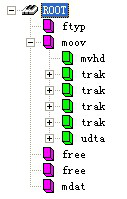

首先需要说明的是，box中的字节序为网络字节序，也就是大端字节序（Big-Endian），简单的说，就是一个32位的4字节整数存储方式为高位字节在内存的低端。Box由header和body组成，其中header统一指明box的大小和类型，body根据类型有不同的意义和格式。  
标准的box开头的4个字节（32位）为box size，该大小包括box header和box body整个box的大小，这样我们就可以在文件中定位各个box。如果size为1，则表示这个box的大小为large size，真正的size值要在largesize域上得到。（实际上只有“mdat”类型的box才有可能用到large size。）如果size为0，表示该box为文件的最后一个box，文件结尾即为该box结尾。（同样只存在于“mdat”类型的box中。）
size后面紧跟的32位为box type，一般是4个字符，如“ftyp”、“moov”等，这些box type都是已经预定义好的，分别表示固定的意义。如果是“uuid”，表示该box为用户扩展类型。如果box type是未定义的，应该将其忽略。  

- File Type Box（ftyp）：该box有且只有1个，并且只能被包含在文件层，而不能被其他box包含。该box应该被放在文件的最开始，指示该MP4文件应用的相关信息。“ftyp” body依次包括1个32位的major brand（4个字符），1个32位的minor version（整数）和1个以32位（4个字符）为单位元素的数组compatible brands。这些都是用来指示文件应用级别的信息。该box的字节实例如下：  
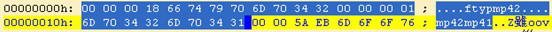

- Movie Box（moov）：该box包含了文件媒体的metadata信息，“moov”是一个container box，具体内容信息由子box诠释。同File Type Box一样，该box有且只有一个，且只被包含在文件层。一般情况下，“moov”会紧随“ftyp”出现。一般情况下（限于篇幅，本文只讲解常见的MP4文件结构），“moov”中会包含1个“mvhd”和若干个“trak”。其中“mvhd”为header box，一般作为“moov”的第一个子box出现（对于其他container box来说，header box都应作为首个子box出现）。“trak”包含了一个track的相关信息，是一个container box。下图为部分“moov”的字节实例，其中红色部分为box header，绿色为“mvhd”，黄色为一部分“trak”。  
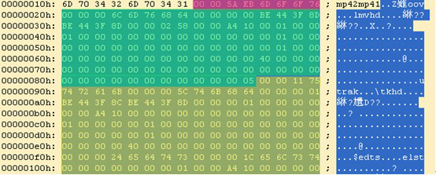

- Movie Header Box（mvhd）：“mvhd”结构如下表。  
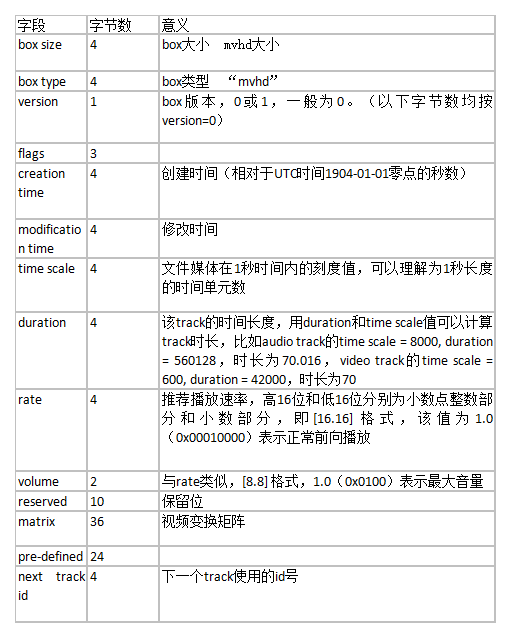

“mvhd”的字节实例如下图，各字段已经用颜色区分开：  
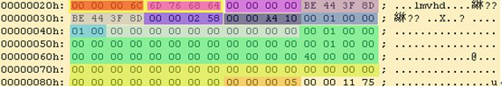

- Track Box（trak）：“trak”也是一个container box，其子box包含了该track的媒体数据引用和描述（hint track除外）。一个MP4文件中的媒体可以包含多个track，且至少有一个track，这些track之间彼此独立，有自己的时间和空间信息。“trak”必须包含一个“tkhd”和一个“mdia”，此外还有很多可选的box（略）。其中“tkhd”为track header box，“mdia”为media box，该box是一个包含一些track媒体数据信息box的container box。 “trak”的部分字节实例如下图，其中黄色为“trak”box的头，绿色为“tkhd”，蓝色为“edts”（一个可选box），红色为一部分“mdia”。  

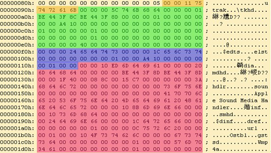

- Track Header Box（tkhd）：“tkhd”结构如下表。 

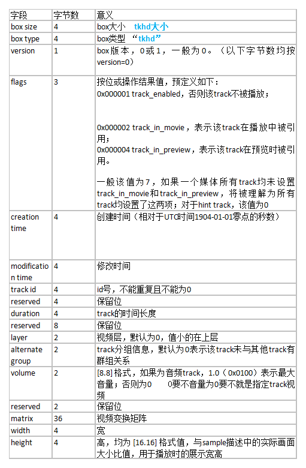

“tkhd”的字节实例如下图，各字段已经用颜色区分开：  

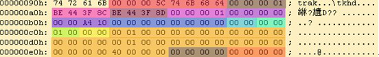

- Media Box（mdia）： “mdia”也是个container box，其子box的结构和种类还是比较复杂的。先来看一个“mdia”的实例结构树图。  

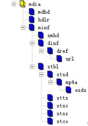

总体来说，“mdia”定义了track媒体类型以及sample数据，描述sample信息。一般“mdia”包含一个“mdhd”，一个“hdlr”和一个“minf”，其中“mdhd”为media header box，“hdlr”为handler reference box，“minf”为media information box。下面依次看一下这几个box的结构。  

- Media Header Box（mdhd）：“mdhd”结构如下表。  

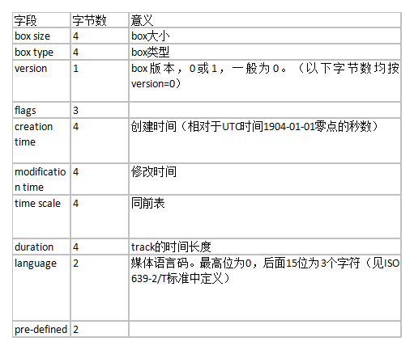

“mdhd”的字节实例如下图，各字段已经用颜色区分开：

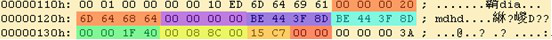

- Handler Reference Box（hdlr）：“hdlr”解释了媒体的播放过程信息，该box也可以被包含在meta box（meta）中。“hdlr”结构如下表。  
```Go
字段	字节数	意义
box size	4	box大小
box type	4	box类型
version	1	box版本，0或1，一般为0。（以下字节数均按version=0）
flags	3	 
pre-defined	4	 
handler type	4	在media box中，该值为4个字符：
“vide”— video track
“soun”— audio track
“hint”— hint track
reserved	12	 
name	不定	track type name，以‘\0’结尾的字符串
```

“hdlr”的字节实例如下图，各字段已经用颜色区分开：  

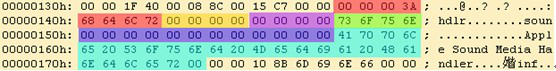

- Media Information Box（minf）：“minf”存储了解释track媒体数据的handler-specific信息，media handler用这些信息将媒体时间映射到媒体数据并进行处理。“minf”中的信息格式和内容与媒体类型以及解释媒体数据的media handler密切相关，其他media handler不知道如何解释这些信息。“minf”是一个container box，其实际内容由子box说明。一般情况下，“minf”包含一个header box，一个“dinf”和一个“stbl”，其中，header box根据track type（即media handler type）分为“vmhd”、“smhd”、“hmhd”和“nmhd”，“dinf”为data information box，“stbl”为sample table box。下面分别介绍。下图为“minf”部分字节实例，其中红色为box header，蓝色为“smhd”，绿色为“dinf”，黄色为一部分“stbl”。  

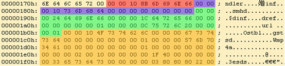

- Media Information Header Box（vmhd、smhd、hmhd、nmhd）  
- Video Media Header Box（vmhd）   
```Go
字段	字节数	意义
box size	4	box大小
box type	4	box类型
version	    1	box版本，0或1，一般为0。（以下字节数均按version=0）
flags	    3	 
graphics mode	4	视频合成模式，为0时拷贝原始图像，否则与opcolor进行合成
opcolor	   2×3	｛red，green，blue｝
```

- Video Media Header Box（vmhd）   

```Go
字段	字节数	意义
box size	4	box大小
box type	4	box类型
version	1	box版本，0或1，一般为0。（以下字节数均按version=0）
flags	3	 
balance	2	立体声平衡，[8.8] 格式值，一般为0，-1.0表示全部左声道，1.0表示全部右声道
reserved	2	 
```

- Hint Media Header Box（hmhd）  
    略  
- Null Media Header Box（nmhd）  
非视音频媒体使用该box，略。  

- Data Information Box（dinf）：“dinf”解释如何定位媒体信息，是一个container box。“dinf”一般包含一个“dref”，即data reference box；“dref”下会包含若干个“url”或“urn”，这些box组成一个表，用来定位track数据。简单的说，track可以被分成若干段，每一段都可以根据“url”或“urn”指向的地址来获取数据，sample描述中会用这些片段的序号将这些片段组成一个完整的track。一般情况下，当数据被完全包含在文件中时，“url”或“urn”中的定位字符串是空的。
“dref”的字节结构如下表。 

```Go
字段	字节数	意义
box size	4	box大小
box type	4	box类型
version	1	box版本，0或1，一般为0。（以下字节数均按version=0）
flags	3	 
entry count	4	“url”或“urn”表的元素个数
“url”或“urn”列表	不定	 
```

“url”或“urn”都是box，“url”的内容为字符串（location string），“urn”的内容为一对字符串（name string and location string）。当“url”或“urn”的box flag为1时，字符串均为空。  
下面是一个“dinf”的字节实例图。其中黄色为“dinf”的box header，由红色部分我们知道包含的“url”或“urn”个数为1，红色后面为“url”box的内容。紫色为“url”的box header（根据box type我们知道是个“url”），绿色为box flag，值为1，说明“url”中的字符串为空，表示track数据已包含在文件中。  

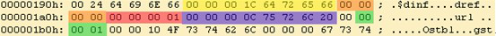

- Sample Table Box（stbl）：  “stbl”几乎是普通的MP4文件中最复杂的一个box了，首先需要回忆一下sample的概念。sample是媒体数据存储的单位，存储在media的chunk中，chunk和sample的长度均可互不相同，如下图所示。
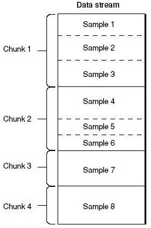

“stbl”包含了关于track中sample所有时间和位置的信息，以及sample的编解码等信息。利用这个表，可以解释sample的时序、类型、大小以及在各自存储容器中的位置。“stbl”是一个container box，其子box包括：sample description box（stsd）、time to sample box（stts）、sample size box（stsz或stz2）、sample to chunk box（stsc）、chunk offset box（stco或co64）、composition time to sample box（ctts）、sync sample box（stss）等。  
“stsd”必不可少，且至少包含一个条目，该box包含了data reference box进行sample数据检索的信息。没有“stsd”就无法计算media sample的存储位置。“stsd”包含了编码的信息，其存储的信息随媒体类型不同而不同。  

- Sample Description Box（stsd）
box header和version字段后会有一个entry count字段，根据entry的个数，每个entry会有type信息，如“vide”、“sund”等，根据type不同sample description会提供不同的信息，例如对于video track，会有“VisualSampleEntry”类型信息，对于audio track会有“AudioSampleEntry”类型信息。视频的编码类型、宽高、长度，音频的声道、采样等信息都会出现在这个box中。

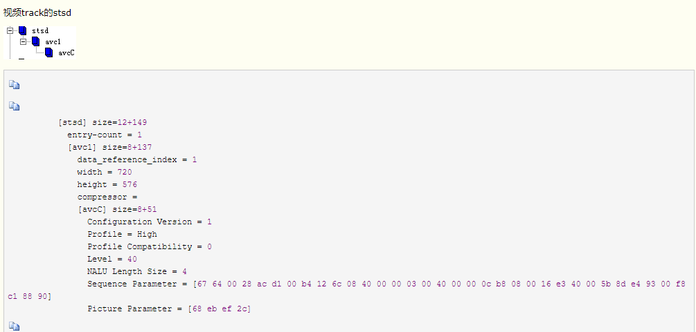

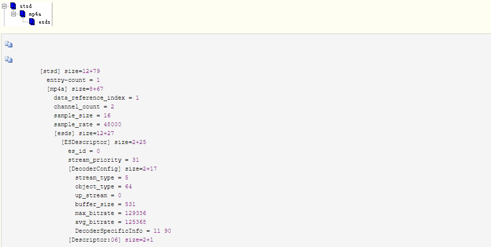

- Time To Sample Box（stts）
“stts”存储了sample的duration，描述了sample时序的映射方法，我们通过它可以找到任何时间的sample。“stts”可以包含一个压缩的表来映射时间和sample序号，用其他的表来提供每个sample的长度和指针。表中每个条目提供了在同一个时间偏移量里面连续的sample序号，以及samples的偏移量。递增这些偏移量，就可以建立一个完整的time to sample表。

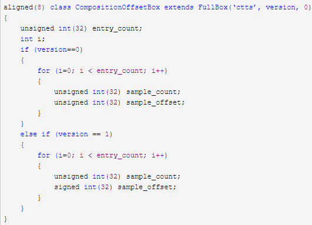

- Sample Size Box（stsz）
“stsz” 定义了每个sample的大小，包含了媒体中全部sample的数目和一张给出每个sample大小的表。这个box相对来说体积是比较大的。四个字节其实就是每一帧得大小。  

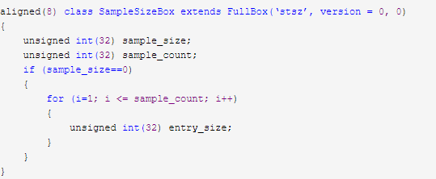

- Sample To Chunk Box（stsc）
用chunk组织sample可以方便优化数据获取，一个thunk包含一个或多个sample。“stsc”中用一个表描述了sample与chunk的映射关系，查看这张表就可以找到包含指定sample的thunk，从而找到这个sample。  

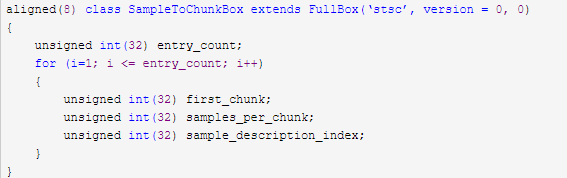

- Sync Sample Box（stss）
“stss”确定media中的关键帧。对于压缩媒体数据，关键帧是一系列压缩序列的开始帧，其解压缩时不依赖以前的帧，而后续帧的解压缩将依赖于这个关键帧。“stss”可以非常紧凑的标记媒体内的随机存取点，它包含一个sample序号表，表内的每一项严格按照sample的序号排列，说明了媒体中的哪一个sample是关键帧。如果此表不存在，说明每一个sample都是一个关键帧，是一个随机存取点。四个字节其实和fps值也有关系。

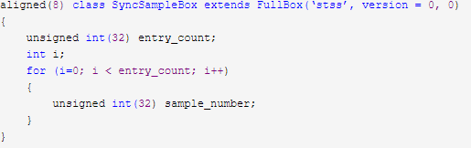

- Chunk Offset Box（stco）
“stco”定义了每个thunk在媒体流中的位置。位置有两种可能，32位的和64位的，后者对非常大的电影很有用。在一个表中只会有一种可能，这个位置是在整个文件中的，而不是在任何box中的，这样做就可以直接在文件中找到媒体数据，而不用解释box。需要注意的是一旦前面的box有了任何改变，这张表都要重新建立，因为位置信息已经改变了。  

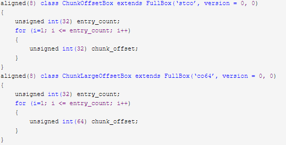

><font color=red>主要归纳为：co64指定每个chunk在媒体流中的位置。Mdata数据即为数据，占绝大空间。Stsc指定chunk中包含多少sample。Stsz指定每个sample得大小。Stss指定关键帧sample得位置即fps值。Stts即dts-sample映射。</font>

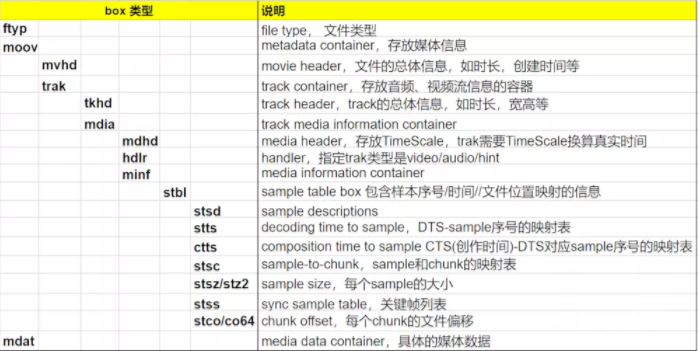

><font color=red>ftyp：表明文件类型。
mdat：具体的媒体数据。
moov box：包含一系列的子box， 通过解析这些子box，获得编码信息、数据信息等。</font>

- Free Space Box（free或skip）：“free”中的内容是无关紧要的，可以被忽略。该box被删除后，不会对播放产生任何影响。
- Meida Data Box（mdat）：该box包含于文件层，可以有多个，也可以没有（当媒体数据全部为外部文件引用时），用来存储媒体数据。数据直接跟在box type字段后面，具体数据结构的意义需要参考metadata（主要在sample table中描述）。普通MP4文件的结构就讲完了，可能会比较乱，下面这张图是常见的box的树结构图，可以用来大致了解MP4文件的构造。

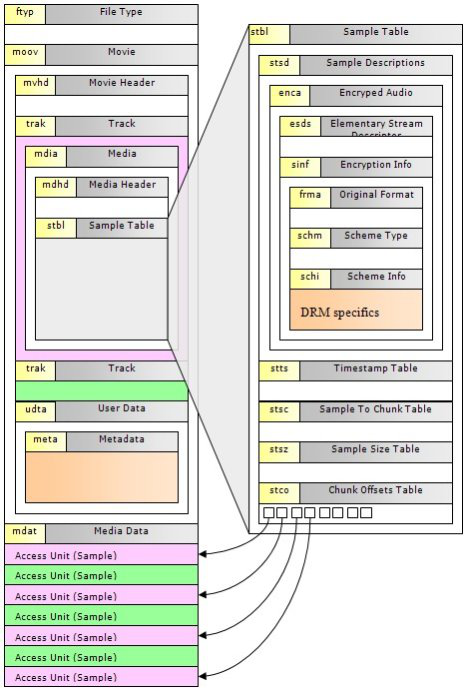


## <a id="7.3">7.3 MP4术语解释及知识补充</a>
```Go
box：由唯一类型标识符和长度定义的面向对象的构件
container box：用来容纳一组相关box的box，container box通常都不是fullbox
chunk：同一轨道的一组连续的采样
hint track：不包含媒体数据，但包含了将一个或多个轨打包到流频道的指示
media data box：用来容纳实体数据的box
movie box：子box定义了元数据（metadata）的容器box
sample：与单个时间戳相关联的所有数据，video sample即为一帧视频，或一组连续视频帧，audio sample即为一段连续的压缩音频
sample description：定义和描述轨中的采样的格式的结构
sample table：指明sampe时序和物理布局的表
track：按时间排序的相关的采样，对于媒体数据来说，track表示一个视频或音频序列
```
整个box以box header开头，box header中包含了box的大小（size）和类型（type）等信息。其中，size指明了整个box所占用的大小，包括header部分，如果box很大(例如存放具体视频数据的mdat box)，超过了uint32的最大数值，size就被设置为1，并用接下来的8位uint64的largesize来存放大小。box中的字节序为网络字节序，也就是大端字节序（Big-Endian）。  
“stbl”包含了关于track中sample所有时间和位置的信息，以及sample的编解码等信息。利用这个表，可以解释sample的时序、类型、大小以及在各自存储容器中的位置。“stbl”是一个container box，其子box包括：sample description box（stsd）、time to sample box（stts）、sample size box（stsz或stz2）、sample to chunk box（stsc）、chunk offset box（stco或co64）、composition time to sample box（ctts）、sync sample box（stss）等。“stsd”必不可少，且至少包含一个条目，该box包含了data reference box进行sample数据检索的信息。没有“stsd”就无法计算media sample的存储位置。“stsd”包含了编码的信息，其存储的信息随媒体类型不同而不同。  

## <a id="7.4">7.4 Mp4info工具各个参数介绍</a>
```Go
mp4文件基本信息
audio信息：
smplrate：sample rate(采样率)。
channel：通道个数。
bitrate：比特率。
audiosamplenum：音频sample的个数。
video信息：
width、height：视频的宽/高。
bitrate：比特率(码率)，秒为单位。等于视频总的大小/时长。
frames：视频帧数。
fps：帧率(frame per second)。
total_time：时间长度，ms为单位。等于duration/timescale。
timescale：时间的粒度，1000表示1000个单位为1s。
duration：时间粒度的个数。
videosamplenum：视频sample的个数。
```
## <a id="7.5">7.5MP4中如何seek</a>
我们需要seek到30s。  
需要做如下工作：  
- 1.使用timescale将目标时间标准化。timescale为90000，30*90000=2700000。
- 2.通过time-to-sample box(stts)找到指定track的给定时间之前的第一个sample number。2700000/3000 = 900。900应该是一帧大概占用多少timescale=90000/100。
- 3.通过sync sample table(stss)查询sample number之前的第一个sync sample。对应为795的sample。
- 4.通过sample-to-chunk table(stsc)查找到对应的chunk number。对应的chunk号是假设是400。
- 5.通过chunk offset box(stco或co64)查找到对应chunk在文件中的起始偏移量。第14个chunk的offset是3481072。
最后使用sample-to-chunk box(stsc)和sample size box(stsz)的信息计算出该chunk中需要读取的sample在文件中的起始偏移量，即完成 seek。


## links
  * [目录](<音视频入门到精通目录.md>)
  * 下一节: [2.8FLV封装格式](<2.8FLV封装格式.md>)