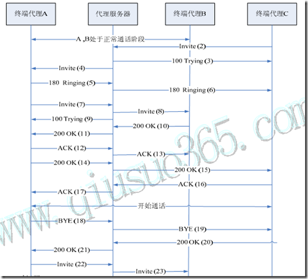

# 8.1SIP
- [8.1SIP](#8.1)
- [8.2SIP基本场景分析](#8.2)
- [8.3SIP报文浅析](#8.3)
- [8.4SIP报文实列](#8.4)


参考链接：  
1.SIP基本场景分析  
https://blog.csdn.net/weixin_34310127/article/details/85530065?depth_1-utm_source=distribute.pc_relevant.none-task-blog-BlogCommendFromBaidu-2&utm_source=distribute.pc_relevant.none-task-blog-BlogCommendFromBaidu-2  

2.语音业务VOIP开发之SIP协议篇（二） —— SIP报文浅析  
https://blog.csdn.net/zqixiao_09/article/details/79519575  

3.SIP响应状态码对照详解  
https://blog.csdn.net/kafeiwuzhuren/article/details/7242791   

## <a id="8.1">8.1SIP简介</a>
SIP（Session Initiation Protocol，会话初始协议）是一个基于文本的应用层控制协议，用于创建、修改和释放一个或多个参与者的会话。SIP 是一种源于互联网的IP 语音会话控制协议，具有灵活、易于实现、便于扩展等特点。这些会话可以是Internet多媒体会议、IP电话或多媒体分发。会话的参与者可以通过组播（multicast）、网状单播（unicast）或两者的混合体进行通信。  

SIP 的一个重要特点是它不定义要建立的会话的类型，而只定义应该如何管理会话。有了这种灵活性，也就意味着SIP可以用于众多应用和服务中，包括交互式游戏、音乐和视频点播以及语音、视频和 Web 会议。    

SIP 独立于传输层。SIP 使用用户数据报协议(UDP) 以及传输控制协议(TCP)，将独立于底层基础设施的用户灵活地连接起来。SIP 支持多设备功能调整和协商。如果服务或会话启动了视频和语音，则仍然可以将语音传输到不支持视频的设备，也可以使用其他设备功能，如单向视频流传输功能。   

SIP 会话使用多达四个主要组件：SIP 用户代理、SIP 注册服务器、SIP 代理服务器和 SIP 重定向服务器。这些系统通过传输包括了 SDP 协议（用于定义消息的内容和特点）的消息来完成 SIP 会话。  

* 用户代理  
SIP 用户代理(UA) 是终端用户设备，如用于创建和管理 SIP 会话的移动电话、多媒体手持设备、PC、PDA 等。用户代理客户机发出消息。用户代理服务器对消息进行响应。  
* 注册服务器  
SIP 注册服务器是包含域中所有用户代理的位置的数据库。在 SIP 通信中，这些服务器会检索出对方的 IP 地址和其他相关信息，并将其发送到 SIP 代理服务器。  
* 代理服务器  
SIP 代理服务器接受 SIP UA 的会话请求并查询 SIP 注册服务器，获取收件方 UA 的地址信息。然后，它将会话邀请信息直接转发给收件方 UA（如果它位于同一域中）或代理服务器（如果 UA 位于另一域中）。  
* 重定向服务器  
SIP 重定向服务器允许 SIP 代理服务器将 SIP 会话邀请信息定向到外部域。SIP 重定向服务器可以与 SIP 注册服务器和 SIP 代理服务器同在一个硬件上。  

SIP通过以下逻辑功能来完成通信：  
- 用户定位功能：确定参与通信的终端用户位置。
- 用户通信能力协商功能：确定参与通信的媒体终端类型和具体参数。
- 用户是否参与交互功能：确定某个终端是否加入某个特定会话中。
- 建立呼叫和控制呼叫功能：包括向被叫“振铃”、确定主叫和被叫的呼叫参数、呼叫重定向、呼叫转移、终止呼叫等。

常用的SIP请求消息如下：  
- INVITE：表示主叫用户发起会话请求，邀请其他用户加入一个会话。也可以用在呼叫建立后用于更新会话（此时该INVITE又称为Re-invite）。
- ACK：客户端向服务器端证实它已经收到了对INVITE请求的最终响应。
- PRACK：表示对1xx响应消息的确认请求消息。
- BYE：表示终止一个已经建立的呼叫。
- CANCEL：表示在收到对请求的最终响应之前取消该请求，对于已完成的请求则无影响。
- REGISTER：表示客户端向SIP服务器端注册列在To字段中的地址信息。
- OPTIONS：表示查询被叫的相关信息和功能。

常用的一些响应消息：  
- 100试呼叫（Trying）
- 180振铃（Ringing）
- 181呼叫正在前转（Call is Being Forwarded）
- 200成功响应（OK）
- 302临时迁移（Moved Temporarily）
- 400错误请求（Bad Request）
- 401未授权（Unauthorized）
- 403禁止（Forbidden）
- 404用户不存在（Not Found）
- 408请求超时（Request Timeout）
- 480暂时无人接听（Temporarily Unavailable）
- 486线路忙（Busy Here）
- 504服务器超时（Server Time-out）
- 600全忙（Busy Everywhere）

## <a id="8.2">8.2SIP基本场景分析</a>
会话初始协议（Session Initiation Protocol）是一种信令协议，用于初始、管理和终止网络中的语音和视频会话，具体地说就是用来生成、修改和终结一个或多个参与者之间的会话。SIP的业务模式是一个点对点协议，其中有两个要素——SIP用户代理和SIP网络服务器。用户代理是呼叫的终端系统元素，而SIP服务器是处理与多个呼叫相关联信令的网络设备。用户代理本身具有一客户机元素（用户代理客户机UAC）和一服务器元素（用户代理服务器UAS）。客户机元素初始呼叫而服务器元素应答呼叫。这允许点到点的呼叫通过客户机-服务器协议来完成。下图是SIP业务的网络结构和各个参与者的关系。


协议的其他特点还有它是一个文本协议，所以易于调测，结构灵活；而且它是一个中性的底层传输协议，可用TCP或UDP（推荐UDP）；同时呼叫和媒体信息同时传送：媒体信息的传送由SDP传送。  

SIP是互联网工程任务组（IETF）多媒体数据和控制体系结构的一个组成部分，因此它与IETF的许多其他协议都有联系，例如RTP（实时传输协议）和SDP协议。SIP与许多其它的协议协同工作，仅仅涉及通信会话的信令部分(control message)。SIP报文内容传送会话描述协议(SDP)，SDP协议描述了会话所使用流媒体细节，如：使用哪个IP端口，采用哪种编解码器等等。SIP的一个典型用途是：SIP“会话”传输一些简单的经过封包的实时传输协议流。RTP本身才是语音或视频的载体。  

### 注册流程


（1）用户首次试呼时，终端代理A 向代理服务器发送REGISTER 注册请求；

（2）代理服务器通过后端认证/计费中心获知用户信息不在数据库中，便向终端代理回送401Unauthorized 质询信息，其中包含安全认证所需的令牌；

（3）终端代理提示用户输入其标识和密码后，根据安全认证令牌将其加密后，再次用REGISTER 消息报告给代理服务器；

（4）代理服务器将REGISTER 消息中的用户信息解密，通过认证/计费中心验证其合法后，将该用户信息登记到数据库中，并向终端代理A 返回成功响应消息200 OK。

### 注销流程


（1）终端向代理服务器发送register消息注销，其头中expire字段设置为0。

（2）代理服务器在收到后送回200OK响应，并将数据库中的用户有关消息注销。

### 基本呼叫建立过程


（1）用户摘机发起一路呼叫，终端代理A向该区域的代理服务器发起Invite请求；

（2）代理服务器通过认证/计费中心确认用户认证已通过后，检查请求消息中的Via头域中是否已包含其地址。若已包含，说明发生环回，返回指示错误的应答；若没有问题，代理服务器在请求消息的Via头域插入自身地址，并向Invite消息的To域所指示的被叫终端代理B传送Invite请求。

（3）代理服务器向终端代理A发送呼叫处理中的应答信息：100Trying。

（4）终端代理B向代理服务器送呼叫处理中的应答信息：100Trying。

（5）终端代理B指示被叫用户振铃，用户振铃后向代理服务器发送180Ringing振铃信息。

（6）代理服务器向终端代理A转发被叫用户振铃信息。

（7）被叫用户摘机，终端代理B向代理服务器返回表示连接成功的应答（200OK）

（8）代理服务器向终端代理A转发该成功指示（200OK）

（9）终端代理A收到信息后，向代理服务器发ACK信息进行确认

（10）代理服务器将ACK确认消息转发给终端代理B。

（11）主被叫用户之间建立通信连接，开始通话。

### 正常呼叫释放过程


（1） 正常呼叫

（2） 用户通话结束后，被叫用户挂机，终端代理B向代理服务器发送Bye消息。

（3） 代理服务器转发Bye消息至终端代理A，同时向认证、计费中心发送用户通话的详细信息，请求计费。

（4） 主叫用户挂机后，终端代理A向代理服务器发送确认挂断响应信息200OK。

（5） 代理服务器转发响应信息200OK。

### 会话更改流程


（1）用户代理服务端和代理客户端正常通话。

（2）用户代理服务端向用户代理客户端发送Invite信息，带有新的SDP协商信息。

（3）用户处理客户端回复200OK，并将协商后的SDP信息带回。

（4）用户代理服务端发送ACK给用户代理客户端进行确认。

### 被叫忙呼叫释放

（1）用户摘机发起一路呼叫，终端代理A向该区域代理服务器发起Invite请求；

（2）代理服务器向被叫终端代理B传送Invite请求。

（3）代理服务器向终端代理A发送呼叫处理中的应答信息：100Trying。

（4）终端代理B向代理服务器送呼叫处理中的应答信息：100Trying。

（5）呼叫请求送到被叫终端代理B后，被叫忙，终端代理B向代理服务器送486被叫忙响应。

（6）代理服务器向终端代理A转发该响应消息。

（7）终端代理A向代理服务器回送ACK确认消息。

（8）代理服务器向终端代理B送ACK确认信息。

### 被叫无应答流程一


（1）用户摘机发起一路呼叫，终端代理A向该区域代理服务器发起Invite请求；

（2）代理服务器向被叫终端代理B传送Invite请求。

（3）代理服务器向终端代理A发送呼叫处理中的应答信息：100Trying。

（4）终端代理B向代理服务器送呼叫处理中的应答信息：100Trying。

（5）被叫用户振铃，终端代理B向代理服务器送180Ring响应。

（6）代理服务器向终端代理A转发该响应信息。

（7）被叫久振铃无应答，终端代理A判断超时后向代理服务器送Cancel消息放弃该呼叫。

（8）代理服务器收到Cancel消息后，向终端代理A回送200OK响应。

（9）代理服务器将Cancel消息转发给终端代理B。

（10）终端代理B向代理服务器回送200OK响应。

（11）终端代理B向代理服务器送487请求已撤销的响应信息。

（12）代理服务器收到后回送ACK确认。

（13）代理服务器向终端代理A送487请求已撤销消息。

（14）终端代理A向代理服务器回送ACK确认。

注：以上步骤中的（10）到（12）无严格顺序关系。

### 被叫无应答流程二


（1）用户摘机发起一路呼叫，终端代理A向该区域代理服务器发起Invite请求；

（2）代理服务器向被叫终端代理B传送Invite请求。

（3）代理服务器向终端代理A发送呼叫处理中的应答信息：100Trying。

（4）终端代理B向代理服务器送呼叫处理中的应答信息：100Trying。

（5）被叫用户振铃，终端代理B向代理服务器送180Ring响应。

（6）代理服务器向终端代理A转发该响应信息。

（7）被叫久振铃无应答，终端代理B判断超时后向代理服务器送408Requesttimeout消息放弃该呼叫。

（8）代理服务器收到408Requesttimeout消息后，转发该消息给终端代理A。

（9）代理服务器回送ACK确认给终端代理B。

（10）终端代理A向代理服务器回送ACK确认。

注：以上步骤中的（9）到（10）无严格顺序关系。

### 遇忙呼叫前转


（1）用户摘机发起一路呼叫，终端代理A向该区域代理服务器发起Invite请求；

（2）代理服务器向被叫终端代理B传送Invite请求。

（3）代理服务器向终端代理A发送呼叫处理中的应答信息：100Trying。

（4）终端代理B向代理服务器送呼叫处理中的应答信息：100Trying。

（5）终端代理B忙线中，B向代理服务器发送486Busy Here响应。

（6）代理服务器向终端代理B发送ACK确认消息。

（7）代理服务器对此呼叫进行前转，向代理服务器C发送Invite请求消息。

（8）代理终端C收到后指示用户振铃，同时向代理服务器发送180Ringing响应。

（9）代理服务器向A转发收到的180Ringing响应。

（10）被叫用户C摘机接听电话，终端代理C向代理服务器返回表示连接成功的应答（200OK）

（11）代理服务器向终端代理A转发该成功指示（200OK）

（12）终端代理A收到信息后，向代理服务器发ACK信息进行确认

（13）代理服务器将ACK确认消息转发给终端代理B。

建立通信连接，开始通话。

（14）主叫用户挂机，终端代理A向代理服务器发送Bye消息，请求挂机。

（15）代理服务器转发Bye消息至终端代理C，指示C挂机。

（16）终端代理C向代理服务器发送确认挂断响应信息200OK。

（17）代理服务器转发响应信息200OK至A。

### 无应答呼叫前转流程


（1）用户A摘机发起一路呼叫，终端代理A向该区域代理服务器发起Invite请求；

（2）代理服务器向被叫终端代理B传送Invite请求。

（3）代理服务器向终端代理A发送呼叫处理中的应答信息：100Trying。

（4）终端代理B向代理服务器送呼叫处理中的应答信息：100Trying。

（5）被叫用户振铃，终端代理B向代理服务器送180Ring响应。

（6）代理服务器向终端代理A转发该响应信息。

（7）被叫久振铃无应答，代理服务器判断超时后向代理终端B送Cancel消息放弃该呼叫。

（8）代理终端B收到Cancel消息后，向代理服务器回送200OK响应。

（9）终端代理B向代理服务器送487请求已撤销的响应信息。

（10）代理服务器向终端代理B回送200OK响应。

（11）代理服务器对此呼叫进行前转，向代理服务器C发送Invite请求消息。

（12）代理终端C收到后指示用户振铃，同时向代理服务器发送180Ringing响应。

（13）代理服务器向A转发收到的180Ringing响应。

（14）被叫用户C摘机接听电话，终端代理C向代理服务器返回表示连接成功的应答（200OK）

（15）代理服务器向终端代理A转发该成功指示（200OK）

（16）终端代理A收到信息后，向代理服务器发ACK信息进行确认

（17）代理服务器将ACK确认消息转发给终端代理C。

建立通信连接，开始通话。

（18）主叫用户挂机，终端代理A向代理服务器发送Bye消息，请求挂机。

（19）代理服务器转发Bye消息至终端代理C，指示C挂机。

（20）终端代理C向代理服务器发送确认挂断响应信息200OK。

（21）代理服务器转发响应信息200OK至A。

### 呼叫保持


（1）用户摘机发起一路呼叫，终端代理A向该区域的代理服务器发起Invite请求；

（2）代理服务器通过认证/计费中心确认用户认证已通过后，检查请求消息中的Via头域中是否已包含其地址。若已包含，说明发生环回，返回指示错误的应答；若没有问题，代理服务器在请求消息的Via头域插入自身地址，并向Invite消息的To域所指示的被叫终端代理B传送Invite请求。

（3）代理服务器向终端代理A发送呼叫处理中的应答信息：100Trying。

（4）终端代理B向代理服务器送呼叫处理中的应答信息：100Trying。

（5）终端代理B指示被叫用户振铃，用户振铃后向代理服务器发送180Ringing振铃信息。

（6）代理服务器向终端代理A转发被叫用户振铃信息。

（7）被叫用户摘机，终端代理B向代理服务器返回表示连接成功的应答（200OK）

（8）代理服务器向终端代理A转发该成功指示（200OK）

（9）终端代理A收到信息后，向代理服务器发ACK信息进行确认

（10）代理服务器将ACK确认消息转发给终端代理B。

（11）主被叫用户之间建立通信连接，开始通话。

（12）代理终端B向代理服务器发送Reinvite消息，SDP的c域等于0,0,0,0。

（13）代理服务器转发此信息给代理终端A。

（14）代理终端A收到Reinvite后回应200OK响应。表示接受会话更改，同事根据协商结果修改会话方式。

（15）代理服务器转发200OK给代理终端B。

（16）代理终端B收到消息后向代理服务器发送ACK消息进行确认。

（17）代理服务器将ACK确认消息转发到代理终端A。

### 呼叫等待


（1）AB正常通话。

（2）在AB通话的阶段，用户C向A发起呼叫，终端代理C发送Invite消息给代理服务器。

（3）代理服务器向终端C回送100Trying响应，表示呼叫已在处理中。

（4）代理服务器把Invite消息转发给A。

（5）用户A振铃，并且终端A向代理服务器发送180Ring响应。

（6）代理服务器向终端C转发该响应信息。

（7）用户A按下呼叫保持键，代理终端A向代理服务器发送Invite消息，请求与代理终端C呼叫保持。

（8）代理服务器转发此消息给终端代理B。

（9）代理服务器向终端A回送100Trying响应，表示呼叫已在处理中。

（10）终端B收到呼叫保持请求后，发送200OK给代理服务器，表示接受呼叫保持。

（11）代理服务器转发200OK响应给终端代理A。

（12）代理终端A收到消息后向代理服务器发送ACK消息进行确认。

（13）代理服务器将ACK确认消息转发到代理终端B。

（14）终端代理A发送200OK给代理服务器，表示接受C的呼叫。

（15）代理服务器转发200OK给终端代理C。

（16）终端代理C向代理服务器回送ACK确认。

（17）代理服务器向代理终端A转发收到的ACK确认。

A、C之间开始通话。

（18）用户A挂机，终端代理A向代理服务器发送Bye请求消息。

（19）代理服务器转发Bye消息给终端代理B。

（20）终端代理C发送200OK给代理服务器，表示接受请求。

（21）代理服务器转发200OK响应给终端代理A。

（22）终端代理C重新发送Invite请求给代理服务器，请求和终端代理B恢复通话。

（23）代理服务器向代理终端B转发收到的Invite请求。

## <a id="8.3">SIP报文浅析</a>
SIP消息消息分两类：请求消息 和 响应消息。  
请求消息（Request）：客户端为了激活特定操作而发给服务器的SIP消息，包括INVITE,ACK,OPTIONS,BYE,CANCEL和REGISTER消息。UAC到UAS。    
响应消息（Response）：服务器向客户端反馈对应请求的处理结果的SIP消息，包括1xx,2xx,3xx,4xx,5xx,6xx响应消息，UAS到UAC。  

SIP消息由三个部分组成：标识消息类型和目的地址的起始行，携带消息参数的头部以及承载任意附加信息的消息体。消息体中传送的最重要的信息就是由SDP（Session Description Protocol）协议描述的媒体控制信息，供终端协商并建立媒体信道。  

SIP消息格式：由一个起始行（Start-line）、一个或多个字段(header fields)组成的消息头、一个标志消息头结束的空行(CRLF)以及作为可选项的消息体(Message body)组成，其中描述的头称为实体头(Entityheader)。  
```js
generic-message = start-line

*message-header

CRLF

[ message-body ]
```

### 起始行
起始行分请求行（Request-Line）和状态行（Status-Line）两种。  

#### 请求行（Request-Line）

请求消息的起始行，由请求消息类型，请求目的发送地址Request-URI，SIP协议的版本号，之间用空格隔开。

请求行的6种Request Method：

INVITE：用于发起呼叫请求。INVITE消息包括消息头和数据区两部分。INVITE 消息头包含主、被呼叫的地址，呼叫主题和呼叫优先级等信息。数据区则是关于会话媒体的信息，可由会话描述协议SDP 来实现。

BYE：当一个用户决定中止会话时，可以使用BYE 来结束会话。

OPTIONS：用于询问被叫端的能力信息，但OPTIONS 本身并不能发起呼叫。

ACK：对已收到的消息进行确认应答。

REGISTER：用于用户向SIP服务器传送位置信息或地址信息。

CANCEL：取消当前的请求，但它并不能中止已经建立的连接。

#### 状态行（Status-Line）

响应消息的起始行，SIP应答消息的Status-Line由SIP-Version开始，接着是一个数字编码的状态码Status-Code，最后是一个与状态码相关的描述性短语Reason-Phrase，然后由一个CRLF行结束符结束Status-Line。

SIP应答消息的六类应答状态编码

1xx：临时消息：表示表示请求消息已经收到，后面将继续处理该请求。

2xx：成功消息：表示请求已经被成功的理解、接受或执行。

3xx：重定向消息：表示为了完成请求还需采取更进一步的动作。

4xx：客户机错误：表示该请求含有语法错误或在这个服务器上不能被满足。

5xx：服务器错误：表示该服务器不能处理一个明显有效的请求。

6xx：全局性故障：表示该请求在任何服务器上都不能被实现。

### 消息头
消息头的作用是进一步提供有关消息的其他信息，使代理服务器或客户代理服务器更好地对消息进行处理。消息头分四类：通用头（general-header ）、请求头（request-header ）、响应头（ response-header ）和实体头（ entityheader）。  

* general-header  
描述消息基本属性的通用头域，可用于请求消息和应答消息；  
消息头有：Call-ID，From，To，Via，Contact，CSeq，Encryption，Expires，Record-Route，Timestamp，Date，Accept，Accept-Encoding，Accept-Language  

*  request-header  
请求头域，只可用于请求消息，它被用来传递有关应答的附加信息，对请求进行补充说明；  
Subject，User-Agent，Organization，Contact，Authorization，Proxy-Authorization，Proxy-Require，Response-Key，Require，Priority，Hide，Route，Max-Forwards。  

*  response-header  
应答头域，只可用于应答消息，它被用来传递有关应答的附加信息，对应答进行补充说明。  
Proxy-Authenticate，WWW-Authenticate，Retry-After，Server，Warning，Allow，Unsupported。  

*  entity-header  
消息体头域，用于描述消息体内容的长度、格式和编码类型等属性，可用于请求消息或应答消息。  
Content-Encoding，Content-Length，Content-Type  

消息头格式  
每个消息头都是一个“句子”，以CRLF行结束符表示一个头域的结束。它们都由字段名（field-name）和域值（field-value）两部分组成，中间以“：”相隔。    

常见消息头说明：  
TO：格式：TO:显示名<接收者URI>；tag=n;显示名和tag可选。接收者URI是SIP网络种唯一标识接收终端的标识符。例：TO:DENNY<SIP:caller@WORK.COM>;TAG=11111     或 TO:sip:caller@work.com  

FROM: 消息头FROM给出标识会话发起者的URI。比如：FROM:sip:caller@work.com；tag=hyh8。tag是必需的。  

CALL-ID: 用于全局唯一标识正在建立的会话的标识符。 随机数加UAC标识信息。  

CSeq: 用于标识同一会话中不同事务的序号，通常由一个用作序号的整型数和消息类型组成。整个会话操作过程由不同的事务组成，每一事务所涉及的消息的CSeq序号必须相同。  

Via:为响应消息提供传输路径，当请求消息经过每一跳节点时，每一跳节点都把自身的IP地址信息放入顶层Via中。响应消息则沿着请求消息记录下的传输路径反向传输，首先移走指明自身IP地址信息的顶层消息头.  

## <a id="8.1">8.4SIP报文实例</a>


1  INVITE ---->SIP SERVER(192.168.0.129)  


2  407 Proxy Authentication Required-->1004


3  1004   ack--->SIP SERVER


4  1004  INVITE-->SIP SERVER


5  SIP-SERVER 100 Giving  --->1004


6 SIP SERVER INVITE-->1001


7 1001 100 Trying--->SIP SERVER


8 1001  180 Ringing---->SIP SERVER


9  SIP SERVER 180 Ringing ---->1004


10  1001  200 OK--->SIP SERVER


11  SIP SERVER  200OK---->1004


12  1004  ACK--->SIP SERVER


13  SIP SERVER  ACK ----> 1001

## links
  * [目录](<音视频入门到精通目录.md>)